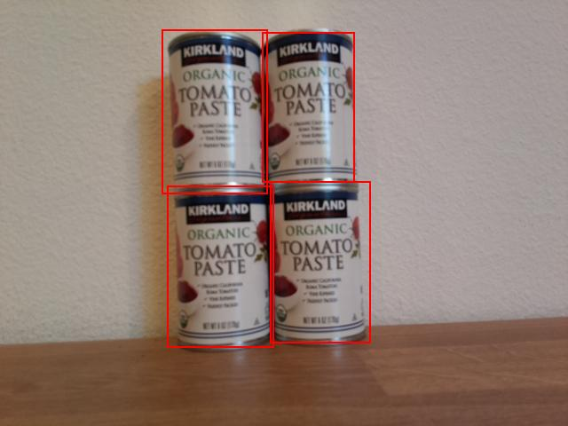

# Count stock from your IoT device - Virtual IoT Hardware and Raspberry Pi

A combination of the predictions and their bounding boxes can be used to count stock in an image

## Show bounding boxes

As a helpful debugging step you can not only print out the bounding boxes, but you can also draw them on the image that was written to disk when an image was captured.

### Task - print the bounding boxes

1. Ensure the `stock-counter` project is open in VS Code, and the virtual environment is activated if you are using a virtual IoT device.

1. Change the `print` statement in the `for` loop to the following to print the bounding boxes to the console:

    ```python
    print(f'{prediction.tag_name}:\t{prediction.probability * 100:.2f}%\t{prediction.bounding_box}')
    ```

1. Run the app with the camera pointing at some stock on a shelf. The bounding boxes will be printed to the console, with left, top, width and height values from 0-1.

    ```output
    pi@raspberrypi:~/stock-counter $ python3 app.py 
    tomato paste:   33.42%  {'additional_properties': {}, 'left': 0.3455171, 'top': 0.09916268, 'width': 0.14175442, 'height': 0.29405564}
    tomato paste:   34.41%  {'additional_properties': {}, 'left': 0.48283678, 'top': 0.10242918, 'width': 0.11782813, 'height': 0.27467814}
    tomato paste:   31.25%  {'additional_properties': {}, 'left': 0.4923783, 'top': 0.35007596, 'width': 0.13668466, 'height': 0.28304994}
    tomato paste:   31.05%  {'additional_properties': {}, 'left': 0.36416405, 'top': 0.37494493, 'width': 0.14024884, 'height': 0.26880276}
    ```

### Task - draw bounding boxes on the image

1. The Pip package [Pillow](https://pypi.org/project/Pillow/) can be used to draw on images. Install this with the following command:

    ```sh
    pip3 install pillow
    ```

    If you are using a virtual IoT device, make sure to run this from inside the activated virtual environment.

1. Add the following import statement to the top of the `app.py` file:

    ```python
    from PIL import Image, ImageDraw, ImageColor
    ```

    This imports code needed to edit the image.

1. Add the following code to the end of the `app.py` file:

    ```python
    with Image.open('image.jpg') as im:
        draw = ImageDraw.Draw(im)
    
        for prediction in predictions:
            scale_left = prediction.bounding_box.left
            scale_top = prediction.bounding_box.top
            scale_right = prediction.bounding_box.left + prediction.bounding_box.width
            scale_bottom = prediction.bounding_box.top + prediction.bounding_box.height
            
            left = scale_left * im.width
            top = scale_top * im.height
            right = scale_right * im.width
            bottom = scale_bottom * im.height
    
            draw.rectangle([left, top, right, bottom], outline=ImageColor.getrgb('red'), width=2)
    
        im.save('image.jpg')
    ```

    This code opens the image that was saved earlier for editing. It then loops through the predictions getting the bounding boxes, and calculates the bottom right coordinate using the bounding box values from 0-1. These are then converted to image coordinates by multiplying by the relevant dimension of the image. For example, if the left value was 0.5 on an image that was 600 pixels wide, this would convert it to 300 (0.5 x 600 = 300).

    Each bounding box is drawn on the image using a red line. Finally the edited image is saved, overwriting the original image.

1. Run the app with the camera pointing at some stock on a shelf. You will see the `image.jpg` file in the VS Code explorer, and you will be able to select it to see the bounding boxes.

    

## Count stock

In the image shown above, the bounding boxes have a small overlap. If this overlap was much larger, then the bounding boxes may indicate the same object. To count the objects correctly, you need to ignore boxes with a significant overlap.

### Task - count stock ignoring overlap

1. The Pip package [Shapely](https://pypi.org/project/Shapely/) can be used to calculate the intersection. If you are using a Raspberry Pi, you will need to instal a library dependency first:

    ```sh
    sudo apt install libgeos-dev
    ```

1. Install the Shapely Pip package:

    ```sh
    pip3 install shapely
    ```

    If you are using a virtual IoT device, make sure to run this from inside the activated virtual environment.

1. Add the following import statement to the top of the `app.py` file:

    ```python
    from shapely.geometry import Polygon
    ```

    This imports code needed to create polygons to calculate overlap.

1. Above the code that draws the bounding boxes, add the following code:

    ```python
    overlap_threshold = 0.20
    ```

    This defines the percentage overlap allowed before the bounding boxes are considered to be the same object. 0.20 defines a 20% overlap.

1. To calculate overlap using Shapely, the bounding boxes need to be converted into Shapely polygons. Add the following function to do this:

    ```python
    def create_polygon(prediction):
        scale_left = prediction.bounding_box.left
        scale_top = prediction.bounding_box.top
        scale_right = prediction.bounding_box.left + prediction.bounding_box.width
        scale_bottom = prediction.bounding_box.top + prediction.bounding_box.height
    
        return Polygon([(scale_left, scale_top), (scale_right, scale_top), (scale_right, scale_bottom), (scale_left, scale_bottom)])
    ```

    This creates a polygon using the bounding box of a prediction.

1. The logic for removing overlapping objects involves comparing all bounding boxes and if any pairs of predictions have bounding boxes that overlap more than the threshold, delete one of the predictions. To compare all the predictions, you compare prediction 1 with 2, 3, 4, etc., then 2 with 3, 4, etc. The following code does this:

    ```python
    to_delete = []

    for i in range(0, len(predictions)):
        polygon_1 = create_polygon(predictions[i])
    
        for j in range(i+1, len(predictions)):
            polygon_2 = create_polygon(predictions[j])
            overlap = polygon_1.intersection(polygon_2).area

            smallest_area = min(polygon_1.area, polygon_2.area)
    
            if overlap > (overlap_threshold * smallest_area):
                to_delete.append(predictions[i])
                break
    
    for d in to_delete:
        predictions.remove(d)

    print(f'Counted {len(predictions)} stock items')
    ```

    The overlap is calculated using the Shapely `Polygon.intersection` method that returns a polygon that has the overlap. The area is then calculated from this polygon. This overlap threshold is not an absolute value, but needs to be a percentage of the bounding box, so the smallest bounding box is found, and the overlap threshold is used to calculate what area the overlap can be to not exceed the percentage overlap threshold of the smallest bounding box. If the overlap exceeds this, the prediction is marked for deletion.

    Once a prediction has been marked for deletion it doesn't need to be checked again, so the inner loop breaks out to check the next prediction. You can't delete items from a list whilst iterating through it, so the bounding boxes that overlap more than the threshold are added to the `to_delete` list, then deleted at the end.

    Finally the stock count is printed to the console. This could then be sent to an IoT service to alert if the stock levels are low. All of this code is before the bounding boxes are drawn, so you will see the stock predictions without overlaps on the generated images.

    > 💁 This is very simplistic way to remove overlaps, just removing the first one in an overlapping pair. For production code, you would want to put more logic in here, such as considering the overlaps between multiple objects, or if one bounding box is contained by another.

1. Run the app with the camera pointing at some stock on a shelf. The output will indicate the number of bounding boxes without overlaps that exceed the threshold. Try adjusting the `overlap_threshold` value to see predictions being ignored.

> 💁 You can find this code in the [code-count/pi](code-count/pi) or [code-count/virtual-device](code-count/virtual-device) folder.

😀 Your stock counter program was a success!
