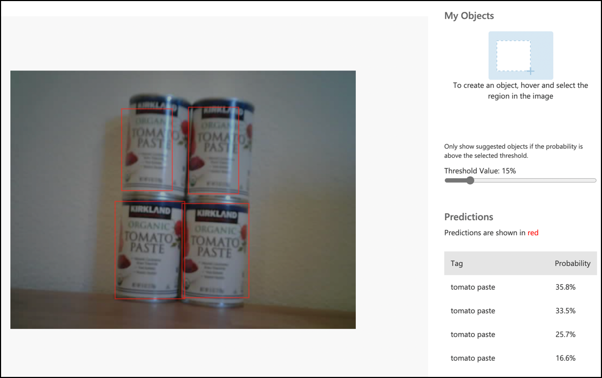

# Call your object detector from your IoT device - Virtual IoT Hardware and Raspberry Pi

Once your object detector has been published, it can be used from your IoT device.

## Copy the image classifier project

The majority of your stock detector is the same as the image classifier you created in a previous lesson.

### Task - copy the image classifier project

1. Create a folder called `stock-counter` either on your computer if you are using a virtual IoT device, or on your Raspberry Pi. If you are using a virtual IoT device make sure you set up a virtual environment.

1. Set up the camera hardware.

    * If you are using a Raspberry Pi you will need to fit the PiCamera. You might also want to fix the camera in a single position, for example, by hanging the cable over a box or can, or fixing the camera to a box with double-sided tape.
    * If you are using a virtual IoT device then you will need to install CounterFit and the CounterFit PyCamera shim. If you are going to use still images, then capture some images that your object detector hasn't seen yet, if you are going to use your web cam make sure it is positioned in a way that can see the stock you are detecting.

1. Replicate the steps from [lesson 2 of the manufacturing project](../../../4-manufacturing/lessons/2-check-fruit-from-device/README.md#task---capture-an-image-using-an-iot-device) to capture images from the camera.

1. Replicate the steps from [lesson 2 of the manufacturing project](../../../4-manufacturing/lessons/2-check-fruit-from-device/README.md#task---classify-images-from-your-iot-device) to call the image classifier. The majority of this code will be re-used to detect objects.

## Change the code from a classifier to an image detector

The code you used to classify images is very similar to the code to detect objects. The main difference is the method called on the Custom Vision SDK, and the results of the call.

### Task - change the code from a classifier to an image detector

1. Delete the three lines of code that classifies the image and processes the predictions:

    ```python
    results = predictor.classify_image(project_id, iteration_name, image)
    
    for prediction in results.predictions:
        print(f'{prediction.tag_name}:\t{prediction.probability * 100:.2f}%')
    ```

    Remove these three lines.

1. Add the following code to detect objects in the image:

    ```python
    results = predictor.detect_image(project_id, iteration_name, image)

    threshold = 0.3
    
    predictions = list(prediction for prediction in results.predictions if prediction.probability > threshold)
    
    for prediction in predictions:
        print(f'{prediction.tag_name}:\t{prediction.probability * 100:.2f}%')
    ```

    This code calls the `detect_image` method on the predictor to run the object detector. It then gathers all the predictions with a probability above a threshold, printing them to the console.

    Unlike an image classifier that only returns one result per tag, the object detector will return multiple results, so any with a low probability need to be filtered out.

1. Run this code and it will capture an image, sending it to the object detector, and print out the detected objects. If you are using a virtual IoT device ensure you have an appropriate image set in CounterFit, or our web cam is selected. If you are using a Raspberry Pi, make sure your camera is pointing to objects on a shelf.

    ```output
    pi@raspberrypi:~/stock-counter $ python3 app.py 
    tomato paste:   34.13%
    tomato paste:   33.95%
    tomato paste:   35.05%
    tomato paste:   32.80%
    ```

    > 💁 You may need to adjust the `threshold` to an appropriate value for your images.

    You will be able to see the image that was taken, and these values in the **Predictions** tab in Custom Vision.

    

> 💁 You can find this code in the [code-detect/pi](code-detect/pi) or [code-detect/virtual-iot-device](code-detect/virtual-iot-device) folder.

😀 Your stock counter program was a success!
