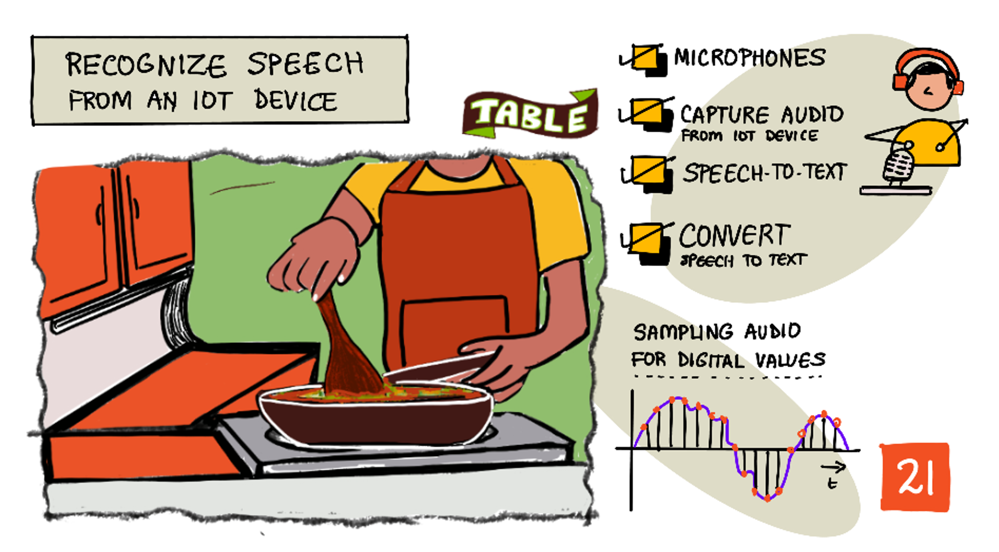
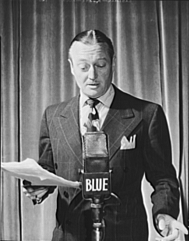
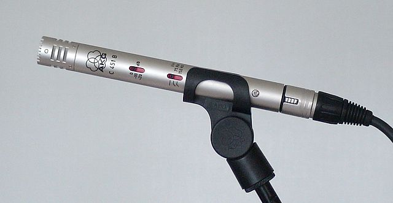
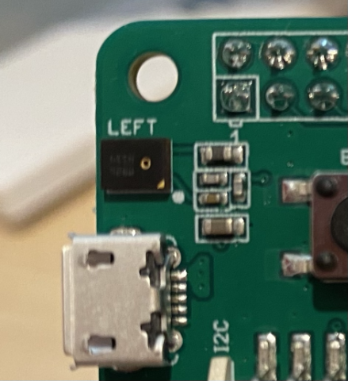
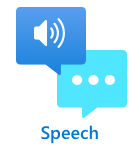

# Recognize speech with an IoT device



> Sketchnote by [Nitya Narasimhan](https://github.com/nitya). Click the image for a larger version.

This video gives an overview of the Azure speech service, a topic that will be covered in this lesson:

[](https://www.youtube.com/watch?v=iW0Fw0l3mrA)

> 🎥 Click the image above to watch a video

## Pre-lecture quiz

[Pre-lecture quiz](https://brave-island-0b7c7f50f.azurestaticapps.net/quiz/41)

## Introduction

'Alexa, set a 12 minute timer'

'Alexa, timer status'

'Alexa, set a 8 minute timer called steam broccoli'

Smart devices are becoming more and more pervasive. Not just as smart speakers like HomePods, Echos and Google Homes, but embedded in our phones, watches, and even light fittings and thermostats. 

> 💁 I have at least 19 devices in my home that have voice assistants, and that's just the ones I know about!

Voice control increases accessibility by allowing folks with limited movement to interact with devices. Whether it is a permanent disability such as being born without arms, to temporary disabilities such as broken arms, or having your hands full of shopping or young children, being able to control our houses from our voice instead of our hands opens up a world of access. Shouting 'Hey Siri, close my garage door' whilst dealing with a baby change and an unruly toddler can be a small but effective improvement on life.

One of the more popular uses for voice assistants is setting timers, especially kitchen timers. Being able to set multiple timers with just your voice is a great help in the kitchen - no need to stop kneading dough, stirring soup, or clean dumpling filling off your hands to use a physical timer.

In this lesson you will learn about building voice recognition into IoT devices. You'll learn about microphones as sensors, how to capture audio from a microphone attached to an IoT device, and how to use AI to convert what is heard into text. Throughout the rest of this project you will build a smart kitchen timer, able to set timers using your voice with multiple languages.

In this lesson we'll cover:

* [Microphones](#microphones)
* [Capture audio from your IoT device](#capture-audio-from-your-iot-device)
* [Speech to text](#speech-to-text)
* [Convert speech to text](#convert-speech-to-text)

## Microphones

Microphones are analog sensors that convert sound waves into electrical signals. Vibrations in air cause components in the microphone to move tiny amounts, and these cause tiny changes in electrical signals. These changes are then amplified to generate an electrical output.

### Microphone types

Microphones come in a variety of types:

* Dynamic - Dynamic microphones have magnet attached to a moving diaphragm that moves in a coil of wire creating an electrical current. This is the opposite of most loudspeakers, that use an electrical current to move a magnet in a coil of wire, moving a diaphragm to create sound. This means speakers can be used a dynamic microphones, and dynamic microphones can be used as speakers. In devices such as intercoms where a user is either listening or speaking, but not both, one device can act as both a speaker and a microphone.

    Dynamic microphones don't need power to work, the electrical signal is created entirely from the microphone.

    

* Ribbon - Ribbon microphones are similar to dynamic microphones, except they have a metal ribbon instead of a diaphragm. This ribbon moves in a magnetic field generating an electrical current. Like dynamic microphones, ribbon microphones don't need power to work.

    

* Condenser - Condenser microphones have a thin metal diaphragm and a fixed metal backplate. Electricity is applied to both of these and as the diaphragm vibrates the static charge between the plates changes generating a signal. Condenser microphones need power to work - called *Phantom power*.

    

* MEMS - Microelectromechanical systems microphones, or MEMS, are microphones on a chip. They have a pressure sensitive diaphragm etched onto a silicon chip, and work similar to a condenser microphone. These microphones can be tiny, and integrated into circuitry.

    

    In the image above, the chip labelled **LEFT** is a MEMS microphone, with a tiny diaphragm less than a millimeter wide.

✅ Do some research: What microphones do you have around you - either in your computer, your phone, your headset or in other devices. What type of microphones are they?

### Digital audio

Audio is an analog signal carrying very fine-grained information. To convert this signal to digital, the audio needs to be sampled many thousands of times a second.

> 🎓 Sampling is converting the audio signal into a digital value that represents the signal at that point in time.


Digital audio is sampled using Pulse Code Modulation, or PCM. PCM involves reading the voltage of the signal, and selecting the closest discrete value to that voltage using a defined size.

> 💁 You can think of PCM as the sensor version of pulse width modulation, or PWM (PWM was covered back in [lesson 3 of the getting started project](../../../1-getting-started/lessons/3-sensors-and-actuators/README.md#pulse-width-modulation)). PCM involves converting an analog signal to digital, PWM involves converting a digital signal to analog.

For example most streaming music services offer 16-bit or 24-bit audio. This means they convert the voltage into a value that fits into a 16-bit integer, or 24-bit integer. 16-bit audio fits the value into a number ranging from -32,768 to 32,767, 24-bit is in the range −8,388,608 to 8,388,607. The more bits, the closer the sample is to what our ears actually hear.

> 💁 You may have hard of 8-bit audio, often referred to as LoFi. This is audio sampled using only 8-bits, so -128 to 127. The first computer audio was limited to 8 bits due to hardware limitations, so this is often seen in retro gaming.

These samples are taken many thousands of times per second, using well-defined sample rates measured in KHz (thousands of readings per second). Streaming music services use 48KHz for most audio, but some 'lossless' audio uses up to 96KHz or even 192KHz. The higher the sample rate, the closer to the original the audio will be, up to a point. There is debate whether humans can tell the difference above 48KHz.

✅ Do some research: If you use a streaming music service, what sample rate and size does it use? If you use CDs, what is the sample rate and size of CD audio?

There are a number of different formats for audio data. You've probably heard of mp3 files - audio data that is compressed to make it smaller without losing any quality. Uncompressed audio is often stored as a WAV file - this is a file with 44 bytes of header information, followed by raw audio data. The header contains information such as the sample rate (for example 16000 for 16KHz) and sample size (16 for 16-bit), and the number of channels. After the header, the WAV file contains the raw audio data.

> 🎓 Channels refers to how many different audio streams make up the audio. For example, for stereo audio with left and right, there would be 2 channels. For 7.1 surround sound for a home theater system this would be 8.

### Audio data size

Audio data is relatively large. For example, capturing uncompressed 16-bit audio at 16KHz (a good enough rate for use with speech to text model), takes 32KB of data for each second of audio:

* 16-bit means 2 bytes per sample (1 byte is 8 bits).
* 16KHz is 16,000 samples per second.
* 16,000 x 2 bytes = 32,000 bytes per second.

This sounds like a small amount of data, but if you are using a microcontroller with limited memory, this can be a lot. For example, the Wio Terminal has 192KB of memory, and that needs to store program code and variables. Even if your program code was tiny, you couldn't capture more than 5 seconds of audio.

Microcontrollers can access additional storage, such as SD cards or flash memory. When building an IoT device that captures audio you will need to ensure not only you have additional storage, but your code writes the audio captured from your microphone directly to that storage, and when sending it to the cloud, you stream from storage to the web request. That way you can avoid running out of memory by trying to hold the entire block of audio data in memory at once.

## Capture audio from your IoT device

Your IoT device can be connected to a microphone to capture audio, ready for conversion to text. It can also be connected to speakers to output audio. In later lessons this will be used to give audio feedback, but it is useful to set up speakers now to test the microphone.

### Task - configure your microphone and speakers

Work through the relevant guide to configure the microphone and speakers for your IoT device:

* [Arduino - Wio Terminal](wio-terminal-microphone.md)
* [Single-board computer - Raspberry Pi](pi-microphone.md)
* [Single-board computer - Virtual device](virtual-device-microphone.md)

### Task - capture audio

Work through the relevant guide to capture audio on your IoT device:

* [Arduino - Wio Terminal](wio-terminal-audio.md)
* [Single-board computer - Raspberry Pi](pi-audio.md)
* [Single-board computer - Virtual device](virtual-device-audio.md)

## Speech to text

Speech to text, or speech recognition, involves using AI to convert words in an audio signal to text.

### Speech recognition models

To convert speech to text, samples from the audio signal are grouped together and fed into a machine learning model based around a Recurrent Neural network (RNN). This is a type of machine learning model that can use previous data to make a decision about incoming data. For example, the RNN could detect one block of audio samples as the sound 'Hel', and when it receives another that it thinks is the sound 'lo', it can combine this with the previous sound, find that 'Hello' is a valid word and select that as the outcome.

ML models always accept data of the same size every time. The image classifier you built in an earlier lesson resizes images to a fixed size and processes them. The same with speech models, they have to process fixed sized audio chunks. The speech models need to be able to combine the outputs of multiple predictions to get the answer, to allow it to distinguish between 'Hi' and 'Highway', or 'flock' and 'floccinaucinihilipilification'.

Speech models are also advanced enough to understand context, and can correct the words they detect as more sounds are processed. For example, if you say "I went to the shops to get two bananas and an apple too", you would use three words that sound the same, but are spelled differently - to, two and too. Speech models are able to understand the context and use the appropriate spelling of the word.

> 💁 Some speech services allow customization to make them work better in noisy environments such as factories, or with industry-specific words such as chemical names. These customizations are trained by providing sample audio and a transcription, and work using transfer learning, the same as how you trained an image classifier using only a few images in an earlier lesson.

### Privacy

When using speech to text in a consumer IoT device, privacy is incredibly important. These devices listen to audio continuously, so as a consumer you don't want everything you say being sent to the cloud and converted to text. Not only will this use a lot of Internet bandwidth, it also has massive privacy implications, especially when some smart device makers randomly select audio for [humans to validate against the text generated to help improve their model](https://www.theverge.com/2019/4/10/18305378/amazon-alexa-ai-voice-assistant-annotation-listen-private-recordings).

You only want your smart device to send audio to the cloud for processing when you are using it, not when it hears audio in your home, audio that could include private meetings or intimate interactions. The way most smart devices work is with a *wake word*, a key phrase such as "Alexa", "Hey Siri", or "OK Google" that causes the device to 'wake up' and listen to what you are saying up until it detects a break in your speech, indicating you have finished talking to the device.

> 🎓 Wake word detection is also referred to as *Keyword spotting* or *Keyword recognition*.

These wake words are detected on the device, not in the cloud. These smart devices have small AI models that run on the device that listen for the wake work, and when it is detected, start streaming the audio to the cloud for recognition. These models are very specialized, and just listen for the wake word.

> 💁 Some tech companies are adding more privacy to their devices and doing some of the speech to text conversion on the device. Apple have announced that as part of their 2021 iOS and macOS updates they will support the speech to text conversion on device, and be able to handle many requests without needing to use the cloud. This is thanks to having powerful processors in their devices that can run ML models.

✅ What do you think are the privacy and ethical implications of storing the audio sent to the cloud? Should this audio be stored, and if so, how? Do you thing the use of recordings for law enforcement is a good trade off for the loss of privacy?

Wake word detection usually uses a technique know an TinyML, that is converting ML models to be able to run on microcontrollers. These models are small in size, and consume very little power to run.

To avoid the complexity of training and using a wake word model, the smart timer you are building in this lesson will use a button to turn on the speech recognition.

> 💁 If you want to try creating a wake word detection model to run on the Wio Terminal or Raspberry Pi, check out this [Responding to your voice tutorial by Edge Impulse](https://docs.edgeimpulse.com/docs/responding-to-your-voice). If you want to use your computer to do this, you can try the [Get started with Custom Keyword quickstart on the Microsoft docs](https://docs.microsoft.com/azure/cognitive-services/speech-service/keyword-recognition-overview?WT.mc_id=academic-17441-jabenn).

## Convert speech to text



Just like with image classification in an earlier project, there are pre-built AI services that can take speech as an audio file and convert it to text. Once such service is the Speech Service, part of the Cognitive Services, pre-built AI services you can use in your apps.

### Task - configure a speech AI resource

1. Create a Resource Group for this project called `smart-timer`

1. Use the following command to create a free speech resource:

    ```sh
    az cognitiveservices account create --name smart-timer \
                                        --resource-group smart-timer \
                                        --kind SpeechServices \
                                        --sku F0 \
                                        --yes \
                                        --location <location>
    ```

    Replace `<location>` with the location you used when creating the Resource Group.

1. You will need an API key to access the speech resource from your code. Run the following command to get the key:

    ```sh
    az cognitiveservices account keys list --name smart-timer \
                                           --resource-group smart-timer \
                                           --output table
    ```

    Take a copy of one of the keys.

### Task - convert speech to text

Work through the relevant guide to convert speech to text on your IoT device:

* [Arduino - Wio Terminal](wio-terminal-speech-to-text.md)
* [Single-board computer - Raspberry Pi](pi-speech-to-text.md)
* [Single-board computer - Virtual device](virtual-device-speech-to-text.md)

---

## 🚀 Challenge

Speech recognition has been around for a long time, and is continuously improving. Research the current capabilities and compare how these have evolved over time, including how accurate machine transcriptions are compared to human.

What do you think the future holds for speech recognition?

## Post-lecture quiz

[Post-lecture quiz](https://brave-island-0b7c7f50f.azurestaticapps.net/quiz/42)

## Review & Self Study

* Read about the different microphone types and how they work on the [What's the difference between dynamic and condenser microphones article on Musician's HQ](https://musicianshq.com/whats-the-difference-between-dynamic-and-condenser-microphones/).
* Read more on the Cognitive Services speech service on the [Speech service documentation on Microsoft Docs](https://docs.microsoft.com/azure/cognitive-services/speech-service/?WT.mc_id=academic-17441-jabenn)
* Read about keyword spotting on the [Keyword recognition documentation on Microsoft Docs](https://docs.microsoft.com/azure/cognitive-services/speech-service/keyword-recognition-overview?WT.mc_id=academic-17441-jabenn)

## Assignment

[](assignment.md)
