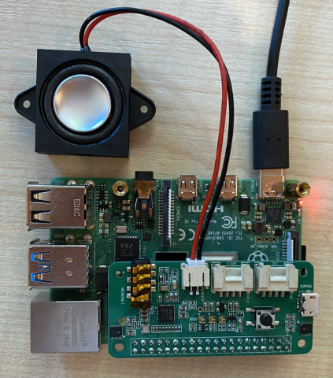

# 마이크 및 스피커 구성 - Raspberry Pi

이 단원에서는 Raspberry Pi에 마이크와 스피커를 추가합니다.

## 하드웨어

Raspberry Pi에 연결할 마이크가 필요합니다.

Pi에는 내장 마이크가 없기 때문에 외부 마이크를 추가해야 합니다. 외부 마이크를 추가하는 방법에는 여러가지가 있습니다.

* USB 마이크
* USB 헤드셋
* USB 연결 스피커폰 
* USB 연결 3.5mm 잭이 있는 오디오 어댑터 및 마이크
* [ReSpeaker 2-Mics Pi HAT](https://www.seeedstudio.com/ReSpeaker-2-Mics-Pi-HAT.html)

> 💁 Raspberry Pi에서는 블루투스 마이크가 일부 지원되지 않으므로 블루투스 마이크 또는 헤드셋이 있는 경우 오디오 페어링 또는 캡처에 문제가 있을 수 있습니다.

Raspberry Pi 장치에는 3.5mm 헤드폰 잭이 있습니다. 헤드셋 또는 스피커를 연결하기 위해 이를 사용할 수 있으며 아래 방법을 통해서도 스피커를 추가할 수 있습니다.

* 모니터 또는 TV를 통한 HDMI 오디오
* USB 스피커
* USB 헤드셋
* USB 연결 가능 스피커폰
* 3.5mm 잭 또는 JST 포트에 스피커가 부착된 [ReSpeaker 2-Mics Pi HAT](https://www.seeedstudio.com/ReSpeaker-2-Mics-Pi-HAT.html) 

## 마이크와 스피커를 연결하고 구성합니다.

마이크와 스피커를 연결하고 구성해야 합니다.

### 작업 - 마이크를 연결하고 구성합시다.

1. 적절한 방법으로 마이크를 연결합니다. 예를 들어 USB 포트 중 하나를 통해 연결합니다.

1. ReSpeaker 2-Mics Pi HAT를 사용하는 경우 Grove base hat을 제거한 다음 ReSpeaker hat을 그 자리에 장착할 수 있습니다.
    

    이 과정의 후반부에 Grove 버튼이 필요하지만, 이 모자에는 Grove base hat이 내장되어 있으므로 Grove base hat이 필요하지 않습니다.
    
    hat이 장착되면 드라이버를 설치해야 합니다. 드라이버 설치 지침은 [Seeed getting started instructions](https://wiki.seeedstudio.com/ReSpeaker_2_Mics_Pi_HAT_Raspberry/#getting-started) 을 참고하세요.

    > ⚠️ 명령어는 `git`를 사용하여 저장소를 복제합니다. Pi에 `git`이 설치되어 있지 않은 경우 다음 명령을 실행하여 설치할 수 있습니다.
    >
    > ```sh
    > sudo apt install git --yes
    > ```

1. 연결된 마이크에 대한 정보를 보려면 Pi에서 또는 VS Code 및 원격 SSH 세션을 사용하여 연결된 터미널에서 다음 명령을 실행합니다.

    ```sh
    arecord -l
    ```

    아래와 같이 연결된 마이크 목록이 표시됩니다:

    ```output
    pi@raspberrypi:~ $ arecord -l
    **** List of CAPTURE Hardware Devices ****
    card 1: M0 [eMeet M0], device 0: USB Audio [USB Audio]
      Subdevices: 1/1
      Subdevice #0: subdevice #0
    ```

    연결된 마이크가 하나일 때 하나의 항목만 표시됩니다. 리눅스에서 마이크 구성이 까다로울 수 있으므로 한 개의 마이크만 사용하고 다른 마이크는 분리하는 것을 추천합니다.
    
    카드 번호는 나중에 필요하므로 적어 두세요. 위의 출력에서 카드 번호는 1입니다.
    
### 작업 - 스피커를 연결하고 구성합니다.

1. 적절한 방법으로 스피커를 연결합니다.

1. 연결된 스피커에 대한 정보를 보려면 Pi에서 또는 VS Code와 원격 SSH 세션을 사용하여 연결된 터미널에서 다음 명령을 실행합니다.
    ```sh
    aplay -l
    ```

    아래와 같이 연결된 스피커 목록이 표시됩니다:

    ```output
    pi@raspberrypi:~ $ aplay -l
    **** List of PLAYBACK Hardware Devices ****
    card 0: Headphones [bcm2835 Headphones], device 0: bcm2835 Headphones [bcm2835 Headphones]
      Subdevices: 8/8
      Subdevice #0: subdevice #0
      Subdevice #1: subdevice #1
      Subdevice #2: subdevice #2
      Subdevice #3: subdevice #3
      Subdevice #4: subdevice #4
      Subdevice #5: subdevice #5
      Subdevice #6: subdevice #6
      Subdevice #7: subdevice #7
    card 1: M0 [eMeet M0], device 0: USB Audio [USB Audio]
      Subdevices: 1/1
      Subdevice #0: subdevice #0
    ```

    헤드폰 잭이 내장돼 있어 `card 0: Headphones`이 항상 확인되는 것을 볼 수 있습니다. USB 스피커와 같은 스피커를 추가한 경우에도 이 목록은 표시됩니다.
    
1. 내장 헤드폰 잭에 연결된 스피커나 헤드폰이 아닌 추가 스피커를 사용하는 경우 다음 명령어를 통해 기본값으로 구성해야 합니다. 
    ```sh
    sudo nano /usr/share/alsa/alsa.conf
    ```

    이렇게 하면 단말기 기반 텍스트 편집기인 `nano`에서 구성 파일이 열립니다. 다음 줄을 찾을 때까지 키보드의 화살표 키를 사용하여 아래로 스크롤합니다.
    
    ```output
    defaults.pcm.card 0
    ```

    호출 후 돌아온 목록에서 사용할 카드의 카드 번호를 `0`에서 `aplay -l`로 변경합니다. 예를 들어, 위의 출력에는 `card 1: M0 [eMeet M0], 장치 0: USB Audio [USB Audio]`라는 두 번째 사운드 카드가 있습니다. 이를 사용하기 위해 다음과 같이 파일을 업데이트합니다.
    
    ```output
    defaults.pcm.card 1
    ```

   이 값을 적절한 카드 번호로 설정합니다. 키보드의 화살표 키를 사용하여 숫자로 이동한 다음 텍스트 파일을 편집할 때 일반적으로 새 숫자를 삭제하고 입력할 수 있습니다.
   
1. `Ctrl+x`를 눌러 변경 내용을 저장하고 파일을 닫습니다. `y`를 눌러 파일을 저장한 다음 `return`을 눌러 파일 이름을 선택합니다.

### 작업 - 마이크와 스피커를 테스트합니다

1. 다음 명령을 실행하여 마이크를 통해 5초간의 오디오를 녹음합니다.:

    ```sh
    arecord --format=S16_LE --duration=5 --rate=16000 --file-type=wav out.wav
    ```

    이 명령이 실행되는 동안 말하기, 노래하기, 비트박스, 악기 연주 또는 하고싶은 것을 하며 마이크에 소리를 내십시오.
    
1. 5초 후에 녹화가 중지됩니다. 다음 명령을 실행하여 오디오를 재생합니다.

    ```sh
    aplay --format=S16_LE --rate=16000 out.wav
    ```

    스피커를 통해 audio bing이 재생되는 소리가 들립니다. 필요에 따라 스피커의 출력 볼륨을 조정합니다.
    
1. 내장된 마이크 포트의 볼륨을 조절하거나 마이크의 게인을 조절해야 할 경우 `alsamixer` 유틸리티를 사용할 수 있습니다. 이 유틸리티에 대한 자세한 내용은 [Linux alsamixer man page](https://linux.die.net/man/1/alsamixer) 에서 확인할 수 있습니다.

1. 오디오를 재생할 때 오류가 발생하면 `alsa.conf` 파일에서 `defaults.pcm.card`로 설정한 카드를 확인합니다.
