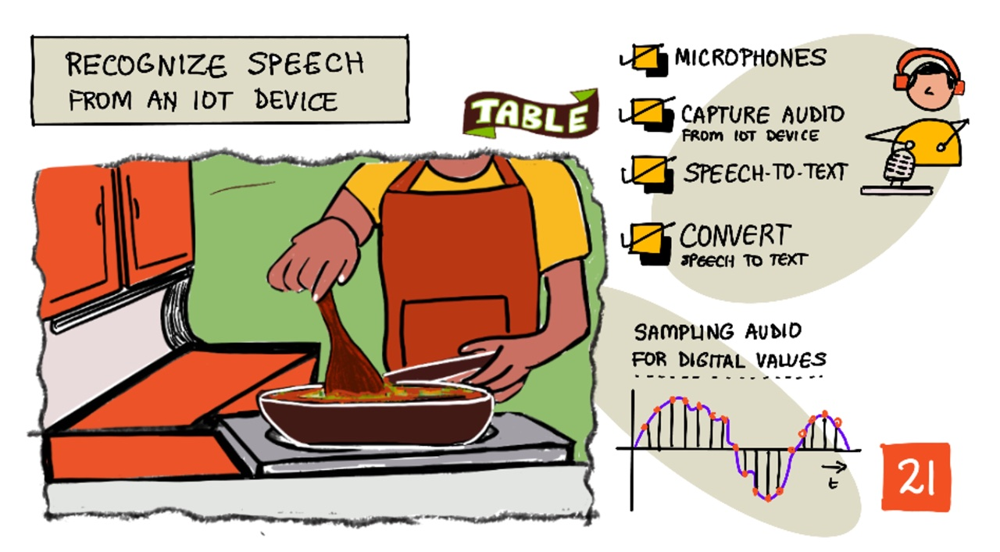

# IoT 장치로 음성 인식



> [Nitya Narasimhan](https://github.com/nitya)의 스케치 노트. 크게 보려면 클릭하세요.

이 비디오는 이 수업에서 다룰 주제인 Azure 음성 서비스에 대한 개요를 제공합니다.

[](https://www.youtube.com/watch?v=iW0Fw0l3mrA)

> 🎥 상단의 이미지를 클릭하여 비디오를 시청합니다.

## 수업 전 퀴즈

[수업 전 퀴즈](https://black-meadow-040d15503.1.azurestaticapps.net/quiz/41)

## 개요

'Alexa, 타이머 12분으로 맞춰줘'

'Alexa, 타이머 상태'

'Alexa, 스팀 브로콜리 타이머 8분으로 맞춰줘'

스마트 기기는 점점 더 보편화되고 있습니다. HomePods이나 Echos, Google Homes와 같은 스마트 스피커 뿐만 아니라 휴대폰, 워치, 조명 장치 및 온도 조절 장치에도 내장되어 있습니다.

> 💁 저희집에는 최소 19개의 음성 비서가 있는 장치가 있습니다. 제가 아는 것만 해도요!

음성 제어는 움직임이 제한된 사람들이 장치와 상호 작용할 수 있도록 하여 접근성을 높입니다. 팔이 없이 태어난 선천적인 장애든, 팔이 부러지는 것과 같이 일시적인 장애든, 장바구니나 아이의 손을 잡느라 손이 없든간에 우리의 손이 아닌 목소리로 집을 제어할 수 있다는 것은 접근의 세상을 열어줍니다. 아이의 변화와 다루기 힘든 유아를 돌보는 동안 'Hey Siri, 차고 문 좀 닫아줘'를 외치는 것은 작지만 효과적인 삶의 개선이 될 수 있습니다.

음성 비서의 가장 인기있는 용도 중 하나는 특히나 주방 타이머 같은 타이머 설정입니다. 목소리만으로 여러개의 타이머를 설정할 수 있는 것은 주방에서 큰 도움이 됩니다. 물리적 타이머를 설정하기 위해 반죽을 하거나 수프를 저어주거나 만두 속을 채우던 손을 멈출 필요가 없습니다.

이 수업에서는 음성 인식을 IoT에 구축하는 것을 배웁니다. 센서로서의 마이크, IoT 기기에 부착된 마이크로 부터 어떻게 오디오를 캡처하는지, 어떻게 인공지능이 들은 내용을 텍스트로 변환하는 지에 대해 배웁니다. 이 프로젝트의 나머지 부분에서 여러 언어로 음성을 사용하여 타이머를 설정할 수 있는 스마트 주방 타이머를 구축할 예정입니다.

이 강의에서 다룰 내용은 다음과 같습니다:

- [마이크](#마이크)
- [IoT 장치에서 오디오 캡처하기](#iot-장치에서-오디오-캡처하기)
- [음성에서 텍스트로](#음성에서-텍스트로)
- [음성을 텍스트로 변환](#음성을-텍스트로-변환)

## 마이크

마이크는 음파를 전기 신호로 변환하는 아날로그 센서입니다. 공기 중의 진동은 마이크의 구성 요소들을 아주 작은 양으로 움직이게 하고, 이것들은 전기 신호에 작은 변화를 일으킵니다. 이후 이러한 변화는 증폭되어 전기적 출력을 생성합니다.

### 마이크 유형

마이크는 다양한 종류가 있습니다.

* Dynamic - Dynamic 마이크에는 자석이 부착되어있어, 와이어 코일을 통해 움직이며 전류를 생성하는 움직이는 다이어프램이 있습니다. 이것은 대개 전류를 사용하여 와이어 코일에 있는 자석을 움직이는 확성기와는 반대로, 진동판을 움직여 소리를 생성합니다. 즉, 이것은 스피커가 Dynamic 마이크로 사용할 수 있고, dynamic 마이크를 스피커로 사용할 수 있음을 의미합니다. 사용자가 듣거나 말하는 intercom 같은 장치에서 스피커와 마이크의 역할을 동시에 수행할 수 있는 장치는 없습니다. 

    Dynamic 마이크는 작동하는데 전력이 필요하지 않으며, 전기 신호는 전적으로 마이크에서 생성됩니다.,

    

* Ribbon -Ribbon 마이크는 다이어프램 대신 금속 리본이 있다는 점을 제외하면 Dynamic 마이크와 유사합니다. 이 리본은 자기장에서 이동하며 전류를 생성합니다. Dynamic 마이크와 마찬가지로 리본 마이크는 전원이 필요하지 않습니다.

    

* Condenser - Condenser 마이크는 얇은 금속 다이어프램과 고정 금속 백플레이트를 가지고 있습니다. 이 두 가지 모두에 전기가 적용되며 다이어프램이 진동함에 따라 플레이트 사이의 정전기가 변화하여 신호가 생성됩니다. 콘덴서 마이크가 작동하려면 *팬텀 전원*이 필요합니다.

    

* MEMS - 마이크로 전기 기계 시스템 마이크, 또는 MEMS는 작은 칩에 있는 마이크입니다. 이들은 압력 감지 다이어프램을 실리콘 칩에 새기고, 콘덴서 마이크와 유사하게 작동합니다. 이 마이크들은 아주 작고 회로에 사용 될 수 있습니다.

    

    위 이미지에서 **LEFT**라고 표시된 칩은 MEMS 마이크이며 폭이 1mm 미만인 작은 다디어프램이 있습니다.
    
✅ 생각 해 봅시다 : 컴퓨터, 전화기, 헤드셋 또는 다른 전자기기에서는 어떠한 마이크를 가지고 있는지 조사 해 봅시다.

### Digital audio

오디오는 매우 미세한 정보를 전달하는 아날로그 신호입니다. 이 신호를 디지털로 변환하려면 오디오를 초당 수천번 샘플링 해야합니다.

> 🎓 샘플링이란 오디오 신호를 해당 지점의 신호를 나타내는 디지컬 값으로 변환하는 것 입니다.


디지털 오디오는 펄스 코드 변조(Pulse Code Modulation, PCM)를 사용하여 샘플링 됩니다. PCM은 신호의 전압을 읽고 정의된 크기를 사용하여 해당 전압에 가장 가까운 이산 값을 선택하는 작업을 포함합니다.

> 💁 PCM은 펄스 폭 변조의 센서 버전 혹은 PWM(PWM은 [lesson 3 of the getting started project](../../../../1-getting-started/lessons/3-sensors-and-actuators/README.md#pulse-width-modulation)에서 다룬 적 있습니다.). PCM은 아날로그 신호를 디지털 신호로 변환하고 PWM은 디지털 신호를 아날로그로 변환합니다.

예를 들어 대부분의 스트리밍 음악 서비스는 16비트 혹은 24비트 오디오를 제공합니다. 즉, 전압을 16비트 정수 또는 24비트 정수로 변환합니다. 16비트 오디오는 -32,768에서 32,767 사이의 숫자로 변환되고, 24비트는 -8,388,608에서 8,388,607 사이의 범위에 있습니다. 비트 수가 많을수록 샘플링 된 결과는 우리가 실제로 귀로 듣는 것과 유사해집니다.

> 💁 종종 LoFi라고 하는 하드 8비트 오디오를 사용할 때가 있습니다. 이것은 8비트만 사용하는 오디오 샘플링으로 범위는 -128에서 127까지입니다. 최초의 컴퓨터 오디오는 하드웨어의 한계로 인해 8비트로 제한되었기 때문에 이것은 레트로 게임에서 자주 볼 수 있습니다.

이러한 샘플은 KHz(초당 수천 개의 판독치) 단위로 잘 정의된 샘플 속도를 사용하여 초당 수천 번 수집됩니다. 스트리밍 음악 서비스는 대부분의 오디오에 48KHz를 사용하지만, 일부 `무손실` 오디오는 최대 96KHz 또는 심지어 192KHz를 사용합니다. 샘플링 속도가 높을수록 오디가 원본에 가깝습니다. 인간이 48KHz 이상의 차이를 구별할 수 있는지에 대한 논란이 있습니다.

✅ 생각 해 봅시다 : 스트리밍 음악 서비스를 사용한다면, 어떤 샘플링 정도와 크기를 사용하나요? CD를 사용할 경우 CD 오디오의 샘플링 비율과 크기는 어떻게 될까요?

오디오 데이터에는 여러가지 다른 형식이 있습니다. 음질을 잃지 않고 작게 만들기 위해서 만들어진 mp3 오디오 데이터에 대하여 들어본 적이 있을 것 입니다. 압축되지 않은 오디오는 종종 WAV 파일로 저장됩니다. 이 파일은 44 바이트릐 헤더 정보와 원시 오디오 데이터를 포합합니다. 헤더에는 샘플링 속도(예: 16KHz의 경우 16000), 샘플링 크기(16비트의 경우 16) 및 채널 수와 같은 정보가 포함됩니다.  WAV 파일의 헤더 뒤에 원시 오디오 데이터가 포함됩니다.

> 🎓 채널은 오디오를 구성하는 다양한 오디오 스트림 수를 나타냅니다. 예를 들어, 좌우 구분이 되는 스테레오 오디오의 경우 2개의 채널이 있습니다. 홈 시어터 시스템의 7.1 서라운드 사운드의 경우 8입니다.

### 오디오 

오디오 데이터는 상대적으로 큰 값을 가집니다. 압축되지 않은 16비트 오디오를 16KHz(스피치 대 텍스트 모델에서 사용하기에 충분한 속도)로 캡처하려면 오디오의 초당 32KB의 데이터가 필요합니다.

* 16비트는 샘플당 2바이트(1바이트는 8비트)를 의미합니다.
* 16KHz는 초당 16,000개의 샘플입니다.
* 16,000 x 2바이트 = 32,000 bytes/sec.

적은 양의 데이터처럼 느껴질 수 있지만 메모리가 제한된 마이크로 컨트롤러를 사용하는 경우 데이터가 훨씬 더 많게 느껴질 수 있습니다.  예를 들어, Wio Terminal은 192KB의 메모리를 가지고 있으며 프로그램 코드와 변수를 저장해야 합니다. 프로그램 코드의 길이가 짧더라도 5초 이상의 오디오를 캡쳐할 수 없습니다.

마이크로컨트롤러는 SD 카드나 플래시 메모리와 같은 추가 저장소에 액세스할 수 있습니다. 오디오를 캡처하는 IoT 장치를 구축할 때는 추가 저장소가 있어야 할 뿐만 아니라 코드가 마이크에서 캡처한 오디오를 해당 저장소에 직접 기록하고 클라우드로 전송할 때 저장소에서 웹 요청으로 스트리밍해야 합니다. 이렇게 하면 한 번에 전체적인 오디오 데이터 블록을 메모리에 저장하여 메모리 lack을 방지할 수 있습니다.

## IoT 장치에서 오디오 캡처하기

IoT 장치를 마이크와 연결하여 텍스트로 변환할 준비가 된 오디오를 캡처할 수 있습니다. 스피커를 연결하여 오디오 출력을 할 수도 있습니다. 이후 강의에서 이것은 오디오 피드백을 제공하는 데 사용되지만 마이크를 테스트 하기 위해 지금 스피커를 설정하는 것이 유용합니다.

### 작업 - 마이크 및 스피커 구성

관련 가이드를 통해 IoT 장치용 마이크와 스피커를 구성하십시오:

- [Arduino - Wio Terminal](../wio-terminal-microphone.md)
- [단일 보드 컴퓨터 - Raspberry Pi](pi-microphone.ko.md)
- [단일 보드 컴퓨터 - 가상 장치](../virtual-device-microphone.md)

### 작업 - 오디오 캡처

관련 가이드를 통해 IoT 장치에서 오디오를 캡처합니다:

- [Arduino - Wio Terminal](../wio-terminal-audio.md)
- [단일 보드 컴퓨터 - Raspberry Pi](pi-audio.ko.md)
- [단일 보드 컴퓨터 - 가상 장치](../virtual-device-audio.md)

## 음성에서 텍스트로

음성을 텍스트로 변환하거나 음성 인식은 AI를 사용하여 오디오 신호의 단어를 텍스트로 변환하는 것을 포함합니다.

### 음성 인식 모델

음성을 텍스트로 변환하기 위해, 오디오 신호의 샘플은 함께 그룹화되어 Recurrent Neural network (RNN) 기반의 기계 학습 모델에 제공됩니다. 이는 이전 데이터를 사용하여 수신 데이터에 대한 결정을 내릴 수 있는 일종의 기계 학습 모델입니다. 예를 들어, RNN은 오디오 샘플의 한 블록을 'Hel'로 감지할 수 있고, 다른 블록을 수신하면 이를 'lo' 라고 생각할 수 있습니다. 이를 이전 블록과 결합하여 'Hello' 가 올바른 단어임을 찾고, 결과 값으로 선택합니다.

ML 모델은 항상 동일한 크기의 데이터를 받아들입니다. 이전 단원에서 구축한 이미지 분류기는 이미지의 크기를 고정된 크기로 조정하고 처리합니다. 이는 음성 모델도 마찬가지로, 오디오 청크 사이즈를 조정해야 합니다. 음성 모델은 'Hi'과 'Highway', 또는 'flock'과 'floccinaucinihilipilification' 을 구별할 수 있도록, 여러 예측의 출력을 결합하여 답을 얻을 수 있어야 합니다.

또한 음성 모델은 문단을 이해할 수 있을 정도로 발전했으며, 더 많은 소리를 처리해 감지한 언어를 수정할 수 있습니다. 예를 들어, "I went to the shops to get two bananas and an apple too" 라고 말한다면, 동음의이어 to, two, too 를 사용할 수 있습니다. 음성 모델은 문단을 이해하고 절절한 철자를 사용할 수 있습니다.

> 💁 일부 음성 서비스들은 공장과 같은 시끄러운 환경이나, 화학 이름과 같이 특정 산업에서 사용되는 단어들을 맞춤화하여 더 잘 작동하도록 할 수 있습니다. 이러한 맞춤화는 주어진 샘플 오디오와 사본, 전이 학습으로 훈련됩니다. 이전 시간에 몇 개의 이미지를 사용하여 이미지 분류기를 휸련한 것과 동일한 방법입니다.

### 개인 정보

소비자 IoT 장치에서 음성을 텍스트로 변환할때, 개인 정보는 매우 중요합니다. 이러한 장치는 지속적으로 오디오를 듣습니다. 소비자는 말하는 모든 내용이 클라우드로 전송되어 텍스트로 변환되는 것을 원하지 않을 수 있습니다. 이것은 많은 인터넷 대역폭을 사용할 뿐만 아니라, 개인 정보에 중요한 영향을 미칩니다. 특히 일부 스마트 장치 제조업체가 [모델을 개선하는데 도움이 되도록, 생성된 텍스트에 대해 사람이 검증](https://www.theverge.com/2019/4/10/18305378/amazon-alexa-ai-voice-assistant-annotation-listen-private-recordings)할 오디오를 선택할 때 큰 영향을 미칩니다.

당신은 스마트 장치가 집이나, 사적인 회의, 또는 친밀한 사이에서의 대화가 아니라, 장치를 이용할 때만 클라우드에 오디오를 전송해 처리해주기를 원할 것입니다. 이를 위해, 대부분의 스마트 장치가 이용하는 방식은 호출 명령어입니다. "Alexa", "Hey Siri", 또는 "OK Google"과 같은 _호출 명령어_ 를 사용해 장치를 "깨워" 사용자가 말하는 것을 듣게 합니다. 장치는 음성 중단을 감지하여 대화가 마쳤음을 알아챕니다.

> 🎓 호출 명령어는 _키워드 발견_ 또는 _키워드 인식_ 이라고도 합니다.

이러한 호출 명령어는 클라우드가 아닌 장치에서 감지됩니다. 이러한 스마트 장치들은 작은 AI 모델이 있으며, 이는 장치를 깨우는 작업을 수행합니다. 호출 명령어가 감지되면 인식을 위해 오디오를 클라우드로 스트리밍하기 시작합니다. 이 모델은 매우 전문화되어 있으며 호출 명령어를 듣기만 하면 됩니다.

> 💁 일부 기술 회사는 장치에 더 많은 개인 정보를 추가하고 장치에서 음성을 텍스트로 변환하는 작업을 수행하고 있습니다. Apple은 장치에서 음성을 텍스트로 변환하는 기능을 지원하고, 클라우드를 사용하지 않고 많은 요쳥을 처리할 수 있는 기능에 대한 2021년 iOS 와 macOS 업데이트 일부를 발표했습니다. 이는 기기에 ML 모델을 실행할 수 있는 강력한 프로세서가 있기에 가능했습니다.

✅ 클라우드로 오디오를 전송하고 저장하는 것의 개인 정보 보호 및 윤리적 의미는 무엇이라고 생각합니까? 오디오를 저장해야 한다면 어떻게 해야 합니까? 법 집행을 위해 녹음을 사용하는 것이 사생활 침해에 대한 좋은 절충안이라고 생각힙니까?

호출 명령어 감지는 주로 TinyMl이라는 기술을 사용합니다. 이는 ML 모델을 마이크로컨트롤러에서 실행할 수 있도록 변환한 것입니다. 이 모델은 크기가 매우 작고, 실행하는데 매우 적은 전력을 소모합니다.

호출 명령어 모델을 사용과 복잡한 훈련을 피하기 위해, 이 단원에서 구축하는 스마트 타이머는 버튼을 사용하여 음성 인식을 시작합니다.

> 💁 Wio Terminal 또는 Raspberry Pi 에서 wake world 감지 모델을 생성하려는 경우, 다음 문서 [Edge Impulse로 음성에 대한 응답](https://docs.edgeimpulse.com/docs/responding-to-your-voice)를 확인하십시오. 컴퓨터를 사용하여 작업을 수행하려는 경우, [Microsoft의 사용자 지정 키워드와 시작하기 문서](https://docs.microsoft.com/azure/cognitive-services/speech-service/keyword-recognition-overview?WT.mc_id=academic-17441-jabenn)에서 시도할 수 있습니다.

## 음성을 텍스트로 변환


이전 프로젝트의 이미지 분류와 마찬가지로, 음성을 오디오 파일로 받아 텍스트로 변환할 수 있는 미리 구축된 AI 서비스가 있습니다. 그러한 서비스가 인지 서비스의 일부인 음성 서비스라면, 당신의 앱에서 사용할 수 있는 미리 만들어진 인공지능 서비스입니다.

### 작업 - 음성 AI 리소스 구성하기

1. `smart-timer`라는 이 프로젝트에 대한 리소스 그룹을 만듭니다.

2. 다음 명령을 사용해 자유 연설 리소스를 만듭니다:

   ```sh
   az cognitiveservices account create --name smart-timer \
                                       --resource-group smart-timer \
                                       --kind SpeechServices \
                                       --sku F0 \
                                       --yes \
                                       --location <location>
   ```

   `<location>` 를 리소스 그룹을 생성할 때 사용한 위치로 바꿉니다.

3. 코드에서 음성 리소스에 접근하려면 API 키가 필요합니다. 다음 명령을 실행하여 key를 가져옵니다:

   ```sh
   az cognitiveservices account keys list --name smart-timer \
                                          --resource-group smart-timer \
                                          --output table
   ```

   키 중 하나를 복사하십시오.

### 작업 - 음성을 텍스트로 변환하기

관련 가이드를 통해 IoT 장치에서 음성을 텍스트로 변환합니다:

- [Arduino - Wio Terminal](wio-terminal-speech-to-text.md)
- [싱글 보드 컴퓨터 - Raspberry Pi](pi-speech-to-text.md)
- [싱글 보드 컴퓨터 - 가상 장치](virtual-device-speech-to-text.md)

---

## 🚀 도전

음성 인식은 오랜 시간동안 사용되어 왔고, 지속적으로 개선되고 있습니다. 현재의 역량을 연구하고 기계가 작성한 필사본이 인간과 비교하여 얼마나 정확한 지를 포함하여 시간이 지남에 따라 어떻게 발전했는지 비교하십시오.

음성 인식의 미래는 어떻게 될 것이라고 생각합니까?

## 강의 후 퀴즈

[강의 후 퀴즈](https://black-meadow-040d15503.1.azurestaticapps.net/quiz/42)

## 복습 & 독학

- 다른 마이크 타입과 그들이 어떻게 동작하는 지에 대해 [Musician's HQ의 다이나믹 마이크와 콘덴서 마이크의 차이점](https://musicianshq.com/whats-the-difference-between-dynamic-and-condenser-microphones/)에서 읽어보세요.
- [Microsoft Docs의 음성 서비스 문서](https://docs.microsoft.com/azure/cognitive-services/speech-service/?WT.mc_id=academic-17441-jabenn)에서 Cognitive Sevices의 음성 서비스에 대해 자세히 읽어보세요.
- [Microsoft Docs의 키워드 인식 설명서](https://docs.microsoft.com/azure/cognitive-services/speech-service/keyword-recognition-overview?WT.mc_id=academic-17441-jabenn)에서 키워드 지정에 대해 읽어보세요.

## 과제

[](assignment.md)
