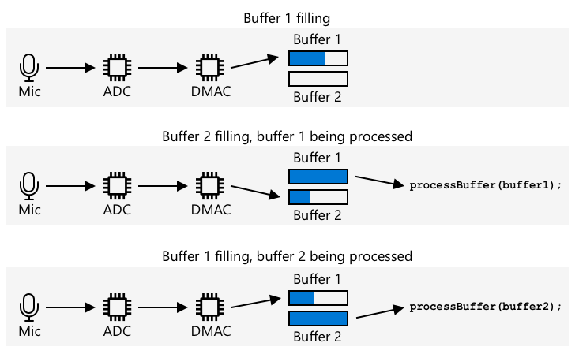

# Capture audio - Wio Terminal

In this part of the lesson, you will write code to capture audio on your Wio Terminal. Audio capture will be controlled by one of the buttons on the top of the Wio Terminal.

## Program the device to capture audio

You can capture audio from the microphone using C++ code. The Wio Terminal only has 192KB of RAM, not enough to capture more than a couple of seconds of audio. It also has 4MB of flash memory, so this can be used instead, saving captured audio to the flash memory.

The built-in microphone captures an analog signal, which gets converted to a digital signal that the Wio Terminal can use. When capturing audio, the data needs to be captured at the correct time - for example to capture audio at 16KHz, the audio needs to be captured exactly 16,000 times per second, with equal intervals between each sample. Rather than use your code to do this, you can use the direct memory access controller (DMAC). This is circuitry that can capture a signal from somewhere and write to memory, without interrupting your code running on the processor.

✅ Read more on DMA on the [direct memory access page on Wikipedia](https://wikipedia.org/wiki/Direct_memory_access).



The DMAC can capture audio from the ADC at fixed intervals, such as at 16,000 times a second for 16KHz audio. It can write this captured data to a pre-allocated memory buffer, and when this is full, make it available to your code to process. Using this memory can delay capturing audio, but you can set up multiple buffers. The DMAC writes to buffer 1, then when it's full, notifies your code to proces buffer 1, whilst the DMAC writes to buffer 2. When buffer 2 is full, it notifies your code, and goes back to writing to buffer 1. That way as long as you process each buffer in less time that it takes to fill one, you will not lose any data.

Once each buffer has been captured, it can be written to the flash memory. Flash memory needs to be written to using defined addresses, specifying where to write and how large to write, similar to updating an array of bytes in memory. Flash memory has granularity, meaning erase and writing operations rely not only on being of a fixed size, but aligning to that size. For example, if the granularity is 4096 bytes and you request an erase at address 4200, it could erase all the data from address 4096 to 8192. This means when you write the audio data to flash memory, it has to be in chunks of the correct size.

### Task - configure flash memory

1. Create a brand new Wio Terminal project using PlatformIO. Call this project `smart-timer`. Add code in the `setup` function to configure the serial port.

1. Add the following library dependencies to the `platformio.ini` file to provide access to the flash memory:

    ```ini
    lib_deps =
        seeed-studio/Seeed Arduino FS @ 2.1.1
        seeed-studio/Seeed Arduino SFUD @ 2.0.2
    ```

1. Open the `main.cpp` file and add the following include directive for the flash memory library to the top of the file:

    ```cpp
    #include <sfud.h>
    #include <SPI.h>
    ```

    > 🎓 SFUD stands for Serial Flash Universal Driver, and is a library designed to work with all flash memory chips

1. In the `setup` function, add the following code to set up the flash storage library:

    ```cpp
    while (!(sfud_init() == SFUD_SUCCESS))
        ;

    sfud_qspi_fast_read_enable(sfud_get_device(SFUD_W25Q32_DEVICE_INDEX), 2);
    ```

    This loops until the SFUD library is initialized, then turns on fast reads. The built-in flash memory can be accessed using a Queued Serial Peripheral Interface (QSPI), a type of SPI controller that allows continuous access via a queue with minimal processor usage. This makes it faster to read and write to flash memory.

1. Create a new file in the `src` folder called `flash_writer.h`.

1. Add the following to the top of this file:

    ```cpp
    #pragma once

    #include <Arduino.h>
    #include <sfud.h>
    ```

    This includes some needed header files, including the header file for the SFUD library to interact with flash memory

1. Define a class in this new header file called `FlashWriter`:

    ```cpp
    class FlashWriter
    {
    public:
    
    private:
    };
    ```

1. In the `private` section, add the following code:

    ```cpp
    byte *_sfudBuffer;
    size_t _sfudBufferSize;
    size_t _sfudBufferPos;
    size_t _sfudBufferWritePos;

    const sfud_flash *_flash;
    ```

    This defines some fields for the buffer to use to store data before writing it to the flash memory. There is a byte array, `_sfudBuffer`, to write data to, and when this is full, the data is written to flash memory. The `_sfudBufferPos` field stores the current location to write to in this buffer, and `_sfudBufferWritePos` stores the location in flash memory to write to. `_flash` is a pointer the flash memory to write to - some microcontrollers have multiple flash memory chips.

1. Add the following method to the `public` section to initialize this class:

    ```cpp
    void init()
    {
        _flash = sfud_get_device_table() + 0;
        _sfudBufferSize = _flash->chip.erase_gran;
        _sfudBuffer = new byte[_sfudBufferSize];
        _sfudBufferPos = 0;
        _sfudBufferWritePos = 0;
    }
    ```

    This configures the flash memory on the Wio Terminal to write to, and sets up the buffers based off the grain size of the flash memory. This is in an `init` method, rather than a constructor as this needs to be called after the flash memory has been set up in the `setup` function.

1. Add the following code to the `public` section:

    ```cpp
    void writeSfudBuffer(byte b)
    {
        _sfudBuffer[_sfudBufferPos++] = b;
        if (_sfudBufferPos == _sfudBufferSize)
        {
            sfud_erase_write(_flash, _sfudBufferWritePos, _sfudBufferSize, _sfudBuffer);
            _sfudBufferWritePos += _sfudBufferSize;
            _sfudBufferPos = 0;
        }
    }

    void writeSfudBuffer(byte *b, size_t len)
    {
        for (size_t i = 0; i < len; ++i)
        {
            writeSfudBuffer(b[i]);
        }
    }

    void flushSfudBuffer()
    {
        if (_sfudBufferPos > 0)
        {
            sfud_erase_write(_flash, _sfudBufferWritePos, _sfudBufferSize, _sfudBuffer);
            _sfudBufferWritePos += _sfudBufferSize;
            _sfudBufferPos = 0;
        }
    }
    ```

    This code defines methods to write bytes to the flash storage system. It works by writing to an in-memory buffer that is the right size for the flash memory, and when this is full, this is written to the flash memory, erasing any existing data at that location. There is also a `flushSfudBuffer` to write an incomplete buffer, as the data being captured won't be exact multiples of the grain size, so the end part of the data needs to be written.

    > 💁 The end part of the data will write additional unwanted data, but this is ok as only the data needed will be read.

### Task - set up audio capture

1. Create a new file in the `src` folder called `config.h`.

1. Add the following to the top of this file:

    ```cpp
    #pragma once

    #define RATE 16000
    #define SAMPLE_LENGTH_SECONDS 4
    #define SAMPLES RATE * SAMPLE_LENGTH_SECONDS
    #define BUFFER_SIZE (SAMPLES * 2) + 44
    #define ADC_BUF_LEN 1600
    ```

    This code sets up some constants for the audio capture.

    | Constant              | Value  | Description |
    | --------------------- | -----: | - |
    | RATE                  | 16000  | The sample rate for the audio. 16,000 is 16KHz |
    | SAMPLE_LENGTH_SECONDS | 4      | The length of audio to capture. This is set to 4 seconds. To record longer audio, increase this. |
    | SAMPLES               | 64000  | The total number of audio samples that will be captured. Set to the sample rate * the number of seconds |
    | BUFFER_SIZE           | 128044 | The size of the audio buffer to capture. Audio will be captured as a WAV file, which is 44 bytes of header, then 128,000 bytes of audio date (each sample is 2 bytes) |
    | ADC_BUF_LEN           | 1600   | The size of the buffers to use to capture audio from the DMAC |

    > 💁 If you find 4 seconds is too short to request a timer, you can increase the `SAMPLE_LENGTH_SECONDS` value, and all the other values will recalculate.

1. Create a new file in the `src` folder called `mic.h`.

1. Add the following to the top of this file:

    ```cpp
    #pragma once

    #include <Arduino.h>

    #include "config.h"
    #include "flash_writer.h"
    ```

    This includes some needed header files, including the `config.h` and `FlashWriter` header files.

1. Add the following to define a `Mic` class that can capture from the microphone:

    ```cpp
    class Mic
    {
    public:
        Mic()
        {
            _isRecording = false;
            _isRecordingReady = false;
        }
    
        void startRecording()
        {
            _isRecording = true;
            _isRecordingReady = false;
        }
    
        bool isRecording()
        {
            return _isRecording;
        }
    
        bool isRecordingReady()
        {
            return _isRecordingReady;
        }
    
    private:
        volatile bool _isRecording;
        volatile bool _isRecordingReady;
        FlashWriter _writer;
    };
    
    Mic mic;
    ```

    This class currently only has a couple of fields to track if recording has started, and if a recording is ready to be used. When the DMAC is set up, it continuously writes to memory buffers, so the `_isRecording` flag determines if these should be processed or ignored. The `_isRecordingReady` flag will be set when the required 4 seconds of audio has been captured. The `_writer` field is used to save the audio data to flash memory.

    A global variable is then declared for an instance of the `Mic` class.

1. Add the following code to the `private` section of the `Mic` class:

    ```cpp
    typedef struct
    {
        uint16_t btctrl;
        uint16_t btcnt;
        uint32_t srcaddr;
        uint32_t dstaddr;
        uint32_t descaddr;
    } dmacdescriptor;

    // Globals - DMA and ADC
    volatile dmacdescriptor _wrb[DMAC_CH_NUM] __attribute__((aligned(16)));
    dmacdescriptor _descriptor_section[DMAC_CH_NUM] __attribute__((aligned(16)));
    dmacdescriptor _descriptor __attribute__((aligned(16)));

    void configureDmaAdc()
    {
        // Configure DMA to sample from ADC at a regular interval (triggered by timer/counter)
        DMAC->BASEADDR.reg = (uint32_t)_descriptor_section;                    // Specify the location of the descriptors
        DMAC->WRBADDR.reg = (uint32_t)_wrb;                                    // Specify the location of the write back descriptors
        DMAC->CTRL.reg = DMAC_CTRL_DMAENABLE | DMAC_CTRL_LVLEN(0xf);           // Enable the DMAC peripheral
        DMAC->Channel[1].CHCTRLA.reg = DMAC_CHCTRLA_TRIGSRC(TC5_DMAC_ID_OVF) | // Set DMAC to trigger on TC5 timer overflow
                                        DMAC_CHCTRLA_TRIGACT_BURST;             // DMAC burst transfer

        _descriptor.descaddr = (uint32_t)&_descriptor_section[1];                    // Set up a circular descriptor
        _descriptor.srcaddr = (uint32_t)&ADC1->RESULT.reg;                           // Take the result from the ADC0 RESULT register
        _descriptor.dstaddr = (uint32_t)_adc_buf_0 + sizeof(uint16_t) * ADC_BUF_LEN; // Place it in the adc_buf_0 array
        _descriptor.btcnt = ADC_BUF_LEN;                                             // Beat count
        _descriptor.btctrl = DMAC_BTCTRL_BEATSIZE_HWORD |                            // Beat size is HWORD (16-bits)
                                DMAC_BTCTRL_DSTINC |                                    // Increment the destination address
                                DMAC_BTCTRL_VALID |                                     // Descriptor is valid
                                DMAC_BTCTRL_BLOCKACT_SUSPEND;                           // Suspend DMAC channel 0 after block transfer
        memcpy(&_descriptor_section[0], &_descriptor, sizeof(_descriptor));          // Copy the descriptor to the descriptor section

        _descriptor.descaddr = (uint32_t)&_descriptor_section[0];                    // Set up a circular descriptor
        _descriptor.srcaddr = (uint32_t)&ADC1->RESULT.reg;                           // Take the result from the ADC0 RESULT register
        _descriptor.dstaddr = (uint32_t)_adc_buf_1 + sizeof(uint16_t) * ADC_BUF_LEN; // Place it in the adc_buf_1 array
        _descriptor.btcnt = ADC_BUF_LEN;                                             // Beat count
        _descriptor.btctrl = DMAC_BTCTRL_BEATSIZE_HWORD |                            // Beat size is HWORD (16-bits)
                                DMAC_BTCTRL_DSTINC |                                    // Increment the destination address
                                DMAC_BTCTRL_VALID |                                     // Descriptor is valid
                                DMAC_BTCTRL_BLOCKACT_SUSPEND;                           // Suspend DMAC channel 0 after block transfer
        memcpy(&_descriptor_section[1], &_descriptor, sizeof(_descriptor));          // Copy the descriptor to the descriptor section

        // Configure NVIC
        NVIC_SetPriority(DMAC_1_IRQn, 0); // Set the Nested Vector Interrupt Controller (NVIC) priority for DMAC1 to 0 (highest)
        NVIC_EnableIRQ(DMAC_1_IRQn);      // Connect DMAC1 to Nested Vector Interrupt Controller (NVIC)

        // Activate the suspend (SUSP) interrupt on DMAC channel 1
        DMAC->Channel[1].CHINTENSET.reg = DMAC_CHINTENSET_SUSP;

        // Configure ADC
        ADC1->INPUTCTRL.bit.MUXPOS = ADC_INPUTCTRL_MUXPOS_AIN12_Val; // Set the analog input to ADC0/AIN2 (PB08 - A4 on Metro M4)
        while (ADC1->SYNCBUSY.bit.INPUTCTRL)
            ;                              // Wait for synchronization
        ADC1->SAMPCTRL.bit.SAMPLEN = 0x00; // Set max Sampling Time Length to half divided ADC clock pulse (2.66us)
        while (ADC1->SYNCBUSY.bit.SAMPCTRL)
            ;                                         // Wait for synchronization
        ADC1->CTRLA.reg = ADC_CTRLA_PRESCALER_DIV128; // Divide Clock ADC GCLK by 128 (48MHz/128 = 375kHz)
        ADC1->CTRLB.reg = ADC_CTRLB_RESSEL_12BIT |    // Set ADC resolution to 12 bits
                            ADC_CTRLB_FREERUN;          // Set ADC to free run mode
        while (ADC1->SYNCBUSY.bit.CTRLB)
            ;                       // Wait for synchronization
        ADC1->CTRLA.bit.ENABLE = 1; // Enable the ADC
        while (ADC1->SYNCBUSY.bit.ENABLE)
            ;                       // Wait for synchronization
        ADC1->SWTRIG.bit.START = 1; // Initiate a software trigger to start an ADC conversion
        while (ADC1->SYNCBUSY.bit.SWTRIG)
            ; // Wait for synchronization

        // Enable DMA channel 1
        DMAC->Channel[1].CHCTRLA.bit.ENABLE = 1;

        // Configure Timer/Counter 5
        GCLK->PCHCTRL[TC5_GCLK_ID].reg = GCLK_PCHCTRL_CHEN |     // Enable perhipheral channel for TC5
                                            GCLK_PCHCTRL_GEN_GCLK1; // Connect generic clock 0 at 48MHz

        TC5->COUNT16.WAVE.reg = TC_WAVE_WAVEGEN_MFRQ; // Set TC5 to Match Frequency (MFRQ) mode
        TC5->COUNT16.CC[0].reg = 3000 - 1;            // Set the trigger to 16 kHz: (4Mhz / 16000) - 1
        while (TC5->COUNT16.SYNCBUSY.bit.CC0)
            ; // Wait for synchronization

        // Start Timer/Counter 5
        TC5->COUNT16.CTRLA.bit.ENABLE = 1; // Enable the TC5 timer
        while (TC5->COUNT16.SYNCBUSY.bit.ENABLE)
            ; // Wait for synchronization
    }

    uint16_t _adc_buf_0[ADC_BUF_LEN];
    uint16_t _adc_buf_1[ADC_BUF_LEN];
    ```

    This code defines a `configureDmaAdc` method that configures the DMAC, connecting it to the ADC and setting it to populate two different alternating buffers, `_adc_buf_0` and `_adc_buf_0`.

    > 💁 One of the downsides of microcontroller development is the complexity of the code needed to interact with hardware, as your code runs at a very low level interacting with hardware directly. This code is more complex than what you would write for a single-board computer or desktop computer as there is no operating system to help. There are some libraries available that can simplify this, but there is still a lot of complexity.

1. Below this, add the following code:

    ```cpp
    // WAV files have a header. This struct defines that header
    struct wavFileHeader
    {
        char riff[4];         /* "RIFF"                                  */
        long flength;         /* file length in bytes                    */
        char wave[4];         /* "WAVE"                                  */
        char fmt[4];          /* "fmt "                                  */
        long chunk_size;      /* size of FMT chunk in bytes (usually 16) */
        short format_tag;     /* 1=PCM, 257=Mu-Law, 258=A-Law, 259=ADPCM */
        short num_chans;      /* 1=mono, 2=stereo                        */
        long srate;           /* Sampling rate in samples per second     */
        long bytes_per_sec;   /* bytes per second = srate*bytes_per_samp */
        short bytes_per_samp; /* 2=16-bit mono, 4=16-bit stereo          */
        short bits_per_samp;  /* Number of bits per sample               */
        char data[4];         /* "data"                                  */
        long dlength;         /* data length in bytes (filelength - 44)  */
    };

    void initBufferHeader()
    {
        wavFileHeader wavh;

        strncpy(wavh.riff, "RIFF", 4);
        strncpy(wavh.wave, "WAVE", 4);
        strncpy(wavh.fmt, "fmt ", 4);
        strncpy(wavh.data, "data", 4);

        wavh.chunk_size = 16;
        wavh.format_tag = 1; // PCM
        wavh.num_chans = 1;  // mono
        wavh.srate = RATE;
        wavh.bytes_per_sec = (RATE * 1 * 16 * 1) / 8;
        wavh.bytes_per_samp = 2;
        wavh.bits_per_samp = 16;
        wavh.dlength = RATE * 2 * 1 * 16 / 2;
        wavh.flength = wavh.dlength + 44;

        _writer.writeSfudBuffer((byte *)&wavh, 44);
    }
    ```

    This code defines the WAV header as a struct that takes up 44 bytes of memory. It writes details to it about the audio file rate, size, and number of channels. This header is then written to the flash memory

1. Below this code, add the following to declare a method to be called when the audio buffers are ready to process:

    ```cpp
    void audioCallback(uint16_t *buf, uint32_t buf_len)
    {
        static uint32_t idx = 44;

        if (_isRecording)
        {
            for (uint32_t i = 0; i < buf_len; i++)
            {
                int16_t audio_value = ((int16_t)buf[i] - 2048) * 16;

                _writer.writeSfudBuffer(audio_value & 0xFF);
                _writer.writeSfudBuffer((audio_value >> 8) & 0xFF);
            }

            idx += buf_len;
                
            if (idx >= BUFFER_SIZE)
            {
                _writer.flushSfudBuffer();
                idx = 44;
                _isRecording = false;
                _isRecordingReady = true;
            }
        }
    }
    ```

    The audio buffers are arrays of 16-bit integers containing the audio from the ADC. The ADC returns 12-bit unsigned values (0-1023), so these need to be converted to 16-bit signed values, and then converted into 2 bytes to be stored as raw binary data.

    These bytes are written to the flash memory buffers. The write starts at index 44 - this is the offset from the 44 bytes written as the WAV file header. Once all the bytes needed for the required audio length have been captured, the remaing data is written to the flash memory.

1. In the `public` section of the `Mic` class, add the following code:

    ```cpp
    void dmaHandler()
    {
        static uint8_t count = 0;

        if (DMAC->Channel[1].CHINTFLAG.bit.SUSP)
        {
            DMAC->Channel[1].CHCTRLB.reg = DMAC_CHCTRLB_CMD_RESUME;
            DMAC->Channel[1].CHINTFLAG.bit.SUSP = 1;

            if (count)
            {
                audioCallback(_adc_buf_0, ADC_BUF_LEN);
            }
            else
            {
                audioCallback(_adc_buf_1, ADC_BUF_LEN);
            }

            count = (count + 1) % 2;
        }
    }
    ```

    This code will be called by the DMAC to tell your code to process the buffers. It checks that there is data to process, and calls the `audioCallback` method with the relevant buffer.

1. Outside the class, after the `Mic mic;` declaration, add the following code:

    ```cpp
    void DMAC_1_Handler()
    {
        mic.dmaHandler();
    }
    ```

    The `DMAC_1_Handler` will be called by the DMAC when there the buffers are ready to process. This function is found by name, so just needs to exist to be called.

1. Add the following two methods to the `public` section of the `Mic` class:

    ```cpp
    void init()
    {
        analogReference(AR_INTERNAL2V23);

        _writer.init();

        initBufferHeader();
        configureDmaAdc();
    }

    void reset()
    {
        _isRecordingReady = false;
        _isRecording = false;

        _writer.reset();

        initBufferHeader();
    }
    ```

    The `init` method contain code to initialize the `Mic` class. This method sets the correct voltage for the Mic pin, sets up the flash memory writer, writes the WAV file header, and configures the DMAC. The `reset` method resets the flash memory and re-writes the header after the audio has been captured and used.

### Task - capture audio

1. In the `main.cpp` file, and an include directive for the `mic.h` header file:

    ```cpp
    #include "mic.h"
    ```

1. In the `setup` function, initialize the C button. Audio capture will start when this button is pressed, and continue for 4 seconds:

    ```cpp
    pinMode(WIO_KEY_C, INPUT_PULLUP);
    ```

1. Below this, initialize the microphone, then print to the console that audio is ready to be captured:

    ```cpp
    mic.init();

    Serial.println("Ready.");
    ```

1. Above the `loop` function, define a function to process the captured audio. For now this does nothing, but later in this lesson it will send the speech to be converted to text:

    ```cpp
    void processAudio()
    {
    
    }
    ```

1. Add the following to the `loop` function:

    ```cpp
    void loop()
    {
        if (digitalRead(WIO_KEY_C) == LOW && !mic.isRecording())
        {
            Serial.println("Starting recording...");
            mic.startRecording();
        }
    
        if (!mic.isRecording() && mic.isRecordingReady())
        {
            Serial.println("Finished recording");
    
            processAudio();
    
            mic.reset();
        }
    }
    ```

    This code checks the C button, and if this is pressed and recording hasn't started, then the `_isRecording` field of the `Mic` class is set to true. This will cause the `audioCallback` method of the `Mic` class to store audio until 4 seconds has been captured. Once 4 seconds of audio has been captured, the `_isRecording` field is set to false, and the `_isRecordingReady` field is set to true. This is then checked in the `loop` function, and when true the `processAudio` function is called, then the mic class is reset.

1. Build this code, upload it to your Wio Terminal and test it out through the serial monitor. Press the C button (the one on the left-hand side, closest to the power switch), and speak. 4 seconds of audio will be captured.

    ```output
    --- Available filters and text transformations: colorize, debug, default, direct, hexlify, log2file, nocontrol, printable, send_on_enter, time
    --- More details at http://bit.ly/pio-monitor-filters
    --- Miniterm on /dev/cu.usbmodem1101  9600,8,N,1 ---
    --- Quit: Ctrl+C | Menu: Ctrl+T | Help: Ctrl+T followed by Ctrl+H ---
    Ready.
    Starting recording...
    Finished recording
    ```

> 💁 You can find this code in the [code-record/wio-terminal](code-record/wio-terminal) folder.

😀 Your audio recording program was a success!
