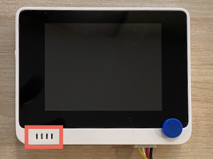
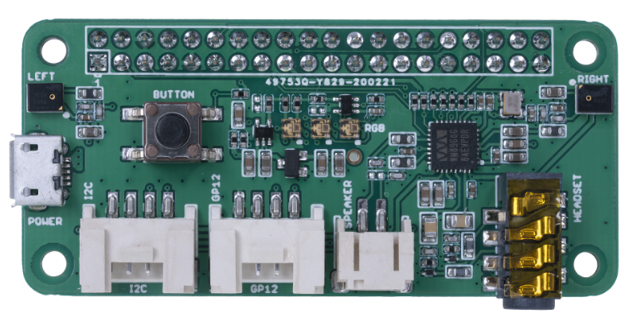
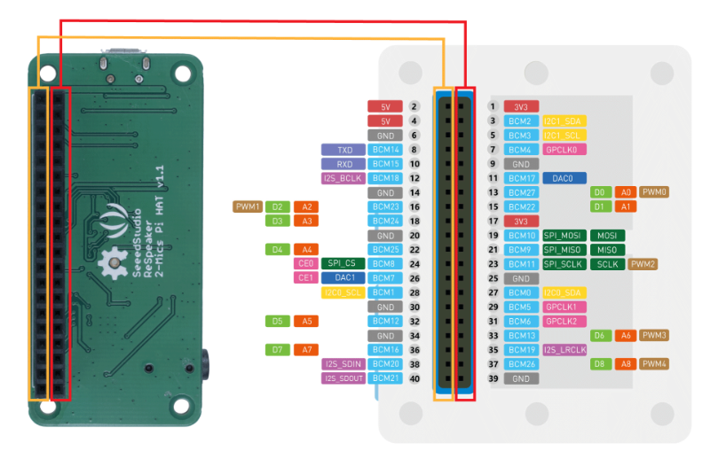
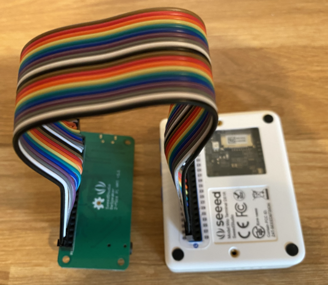
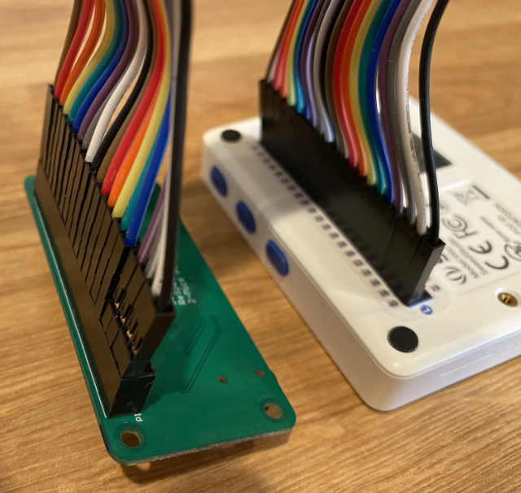
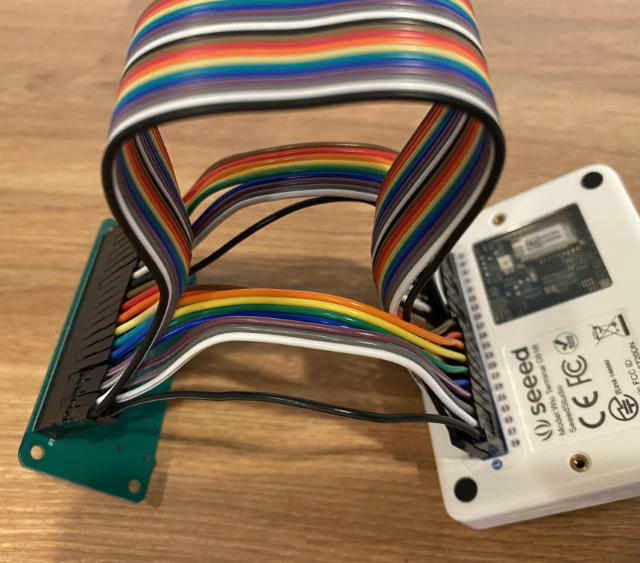
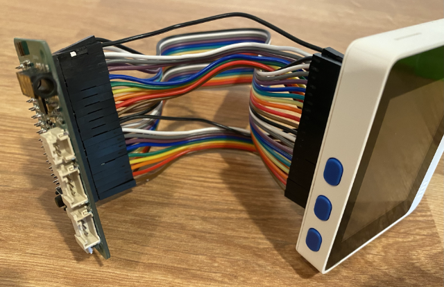
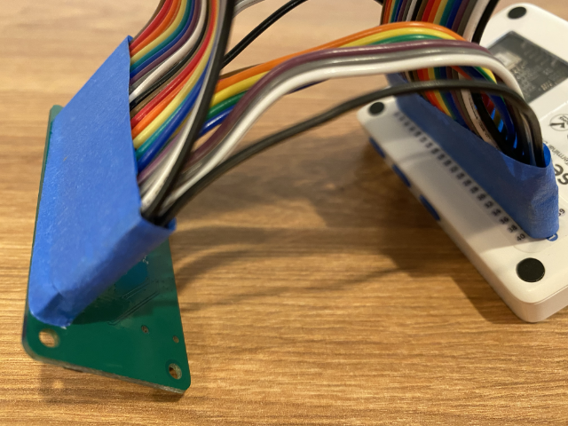
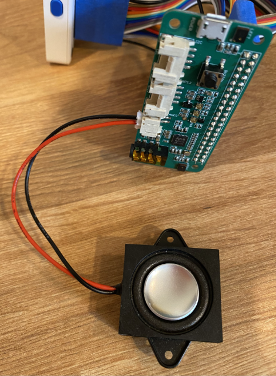
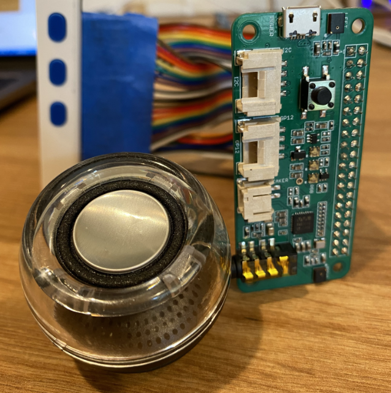

# Configure your microphone and speakers - Wio Terminal

In this part of the lesson, you will add and speakers to your Wio Terminal. The Wio Terminal already has a microphone built-in, and this can be used to capture speech.

## Hardware

The Wio Terminal already has a mic built in, and this can be used to capture audio for speech recognition.

To add a speaker, you can use the [ReSpeaker 2-Mics Pi Hat](https://www.seeedstudio.com/ReSpeaker-2-Mics-Pi-HAT.html). This is an external board that contains 2 MEMS microphones, as well as a speaker connector and headphone socket.

You will need to add either headphones, a speaker with a 3.5mm jack, or a speaker with a JST connection such as the [Mono Enclosed Speaker - 2W 6 Ohm](https://www.seeedstudio.com/Mono-Enclosed-Speaker-2W-6-Ohm-p-2832.html).

To connect the ReSpeaker 2-Mics Pi Hat you will need 40 pin-to-pin (also referred to as male-to-male) jumper cables.

> 💁 If you are comfortable soldering, then you can use the [40 Pin Raspberry Pi Hat Adapter Board For Wio Terminal](https://www.seeedstudio.com/40-Pin-Raspberry-Pi-Hat-Adapter-Board-For-Wio-Terminal-p-4730.html) to connect the ReSpeaker.

### Task - connect the ReSpeaker Pi Hat

1. With the Wio Terminal powered off, connect the ReSpeaker 2-Mics Pi Hat to the Wio Terminal using the jumper leads and the GPIO sockets on the back of the Wio Terminal:

    The pins need to be connected in this way:

    

1. Position the ReSpeaker and Wio Terminal with the GPIO sockets facing up, and on the left-hand side.

1. Start from the socket on the top left of the GPIO socket on the ReSpeaker. Connect a pin-to-pin jumper cable from the top left socket of the ReSpeaker to the top left socket of the Wio Terminal.

1. Repeat this all the way down the GPIO sockets on the left hand side. Make sure the pins are in firmly.

    

    

    > 💁 If your jumper cables are connected into ribbons, keep them all together - it makes it easier to ensure you have connected all the cables in order.

1. Repeat the process using the right hand GPIO sockets on the ReSpeaker and Wio Terminal. These cables need to go around the cables that are already in place.

    

    

    > 💁 If your jumper cables are connected into ribbons, split them into two ribbons. Pass one each side of the existing cables.

    > 💁 You can use sticky tape to hold the pins into a block to help stop any coming out as you are connecting them all.
    >
    > 

1. You will need to add a speaker.

    * If you are using a speaker with a JST cable, connect it to the JST port on the ReSpeaker.

      

    * If you are using a speaker with a 3.5mm jack, or headphones, insert them into the 3.5mm jack socket.

      
