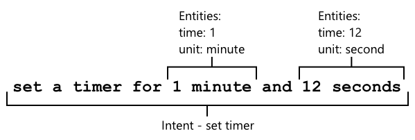
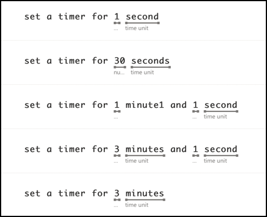

# Understand language

Add a sketchnote if possible/appropriate


## Pre-lecture quiz

[Pre-lecture quiz](https://brave-island-0b7c7f50f.azurestaticapps.net/quiz/43)

## Introduction

In the last lesson you converted speech to text. For this to be used to program a smart timer, your code will need to have an understanding of what was said. You could assume the user will speak a fixed phrase, such as "Set a 3 minute timer", and parse that expression to get how long the timer should be, but this isn't very user-friendly. If a user were to say "Set a timer for 3 minutes", you or I would understand what they mean, but your code would not, it would be expecting a fixed phrase.

This is where language understanding comes in, using AI models to interpret text and return the details that are needed, for example being able to take both "Set a 3 minute timer" and "Set a timer for 3 minutes", and understand that a timer is required for 3 minutes.

In this lesson you will learn about language understanding models, how to create them, train them, and use them from your code.

In this lesson we'll cover:

* [Language understanding](#language-understanding)
* [Create a language understanding model](create-a-language-understanding-model)
* [Intents and entities](#intents-and-entities)
* [Use the language understanding model](#use-the-language-understanding-model)

## Language understanding

Humans have used language to communicate for hundreds of thousands of years. We communicate with words, sounds, or actions and understand what is said, both the meaning of the words, sounds or actions, but also their context. We understand sincerity and sarcasm, allowing the same words to mean different things depending on the tone of our voice.

✅ Think about some of the conversations you have had recently. How much of the conversation would be hard for a computer to understand because it needs context?

Language understanding, also called natural-language understanding is part of a field of artificial intelligence called natural-language processing (or NLP), and deals with reading comprehension, trying to understand the details of words or sentences. If you use a voice assistant such as Alexa or Siri, you have used language understanding services. These are the behind-the-scenes AI services that convert "Alexa, play the latest album by Taylor Swift" into my daughter dancing around the living room to her favorite tunes.

> 💁 Computers, despite all their advances, still have a long way to go to truly understand text. When we refer to language understanding with computers, we don't mean anything anywhere near as advanced as human communication, instead we mean taking some words and extracting key details.

As humans, we understand language without really thinking about it. If I asked another human to "play the latest album by Taylor Swift" then they would instinctively know what I meant. For a computer, this is harder. It would have to take the words, converted from speech to text, and work out the following pieces of information:

* Music needs to be played
* The music is by the artist Taylor Swift
* The specific music is a whole album of multiple tracks in order
* Taylor Swift has many albums, so they need to be sorted by chronological order and the most recently published is the one required

✅ Think of some other sentences you have spoken when making requests, such as ordering coffee or asking a family member to pass you something. Try to break then down into the pieces of information a computer would need to extract to understand the sentence.

Language understanding models are AI models that are trained to extract certain details from language, and then are trained for specific tasks using transfer learning, in the same way you trained a Custom Vision model using a small set of images. You can take a model, then train it using the text you want it to understand.

## Create a language understanding model


You can create language understanding models using LUIS, a language understanding service from Microsoft that is part of Cognitive Services.

### Task - create an authoring resource

To use LUIS, you need to create an authoring resource.

1. Use the following command to create an authoring resource in your `smart-timer` resource group:

    ```python
    az cognitiveservices account create --name smart-timer-luis-authoring \
                                        --resource-group smart-timer \
                                        --kind LUIS.Authoring \
                                        --sku F0 \
                                        --yes \
                                        --location <location>
    ```

    Replace `<location>` with the location you used when creating the Resource Group.

    > ⚠️ LUIS isn't available in all regions, so if you get the following error:
    >
    > ```output
    > InvalidApiSetId: The account type 'LUIS.Authoring' is either invalid or unavailable in given region.
    > ```
    >
    > pick a different region.

    This will create a free-tier LUIS authoring resource.

### Task - create a language understanding app

1. Open the LUIS portal at [luis.ai](https://luis.ai?WT.mc_id=academic-17441-jabenn) in your browser, and sign in with the same account you have been using for Azure.

1. Follow the instructions on the dialog to select your Azure subscription, then select the `smart-timer-luis-authoring` resource you have just created.

1. From the *Conversation apps* list, select the **New app** button to create a new application. Name the new app `smart-timer`, and set the *Culture* to your language.

    > 💁 There is a field for a prediction resource. You can create a second resource just for prediction, but the free authoring resource allows 1,000 predictions a month which should be enough for development, so you can leave this blank.

1. Read through the guide that appears once you cerate the app to get an understanding of the steps you need to take to train the language understanding model. Close this guide when you are done.

## Intents and entities

Language understanding is based around *intents* and *entities*. Intents are what the intent of the words are, for example playing music, setting a timer, or ordering food. Entities are what the intent is referring to, such as the album, the length of the timer, or the type of food. Each sentence that the model interprets should have at least one intent, and optionally one or more entities.

Some examples:

| Sentence                                            | Intent           | Entities                                   |
| --------------------------------------------------- | ---------------- | ------------------------------------------ |
| "Play the latest album by Taylor Swift"             | *play music*     | *the latest album by Taylor Swift*         |
| "Set a 3 minute timer"                              | *set a timer*    | *3 minutes*                                |
| "Cancel my timer"                                   | *cancel a timer* | None                                       |
| "Order 3 large pineapple pizzas and a caesar salad" | *order food*     | *3 large pineapple pizzas*, *caesar salad* |

✅ With the sentences you though about earlier, what would be the intent and any entities in that sentence?

To train LUIS, first you set the entities. These can be a fixed list of terms, or learned from the text. For example, you could provide a fixed list of food available from your menu, with variations (or synonyms) of each word, such as *egg plant* and *aubergine* as variations of *aubergine*. LUIS also has pre-built entities that can be used, such as numbers and locations.

For setting a timer, you could have one entity using the pre-built number entities for the time, and another for the units, such as minutes and seconds. Each unit would have multiple variations to cover the singular and plural forms - such as minute and minutes.

Once the entities are defined, you create intents. These are learned by the model based on example sentences that you provide (known as utterances). For example, for a *set timer* intent, you might provide the following sentences:

* `set a 1 second timer`
* `set a timer for 1 minute and 12 seconds`
* `set a timer for 3 minutes`
* `set a 9 minute 30 second timer`

You then tell LUIS what parts of these sentences map to the entities:



The sentence `set a timer for 1 minute and 12 seconds` has the intent of `set timer`. It also has 2 entities with 2 values each:

|            | time | unit   |
| ---------- | ---: | ------ |
| 1 minute   | 1    | minute |
| 12 seconds | 12   | second |

To train a good model, you need a range of different example sentences to cover the many different ways someone might ask for the same thing.

> 💁 As with any AI model, the more data and the more accurate the data you use to train, the better the model.

✅ Think about the different ways you might ask the same thing and expect a human to understand.

### Task - add entities to the language understanding models

For the timer, you need to add 2 entities - one for the unit of time (minutes or seconds), and one for the number of minutes or seconds.

You can find instructions for using the LUIS portal in the [Quickstart: Build your app in LUIS portal documentation on Microsoft docs](https://docs.microsoft.com/azure/cognitive-services/luis/luis-get-started-create-app?WT.mc_id=academic-17441-jabenn).

1. From the LUIS portal, select the *Entities* tab and add the *number* prebuilt entity by selecting the **Add prebuilt entity** button, then selecting *number* from the list.

1. Create a new entity for the time unit using the **Create** button. Name the entity `time unit` and set the type to *List*. Add values for `minute` and `second` to the *Normalized values* list, adding the singular and plural forms to the *synonyms* list. Press `return` after adding each synonym to add it to the list.

    | Normalized value | Synonyms        |
    | ---------------- | --------------- |
    | minute           | minute, minutes |
    | second           | second, seconds |

### Task - add intents to the language understanding models

1. From the *Intents* tab, select the **Create** button to create a new intent. Name this intent `set timer`.

1. In the examples, enter different ways to set a timer using both minutes, seconds and minutes and seconds combined. Examples could be:

    * `set a 1 second timer`
    * `set a 4 minute timer`
    * `set a four minute six second timer`
    * `set a 9 minute 30 second timer`
    * `set a timer for 1 minute and 12 seconds`
    * `set a timer for 3 minutes`
    * `set a timer for 3 minutes and 1 second`
    * `set a timer for three minutes and one second`
    * `set a timer for 1 minute and 1 second`
    * `set a timer for 30 seconds`
    * `set a timer for 1 second`

    Mix up numbers as words and numerics so the model learns to handle both.

1. As you enter each example, LUIS will start detecting entities, and will underline and label any it finds.

    

### Task - train and test the model

1. Once the entities and intents are configured, you can train the model using the **Train** button on the top menu. Select this button, and the model should train in a few seconds. The button will be greyed out whilst training, and be re-enabled once done.

1. Select the **Test** button from the top menu to test the language understanding model. Enter text such as `set a timer for 5 minutes and 4 seconds` and press return. The sentence will appear in a box under the text box that you typed it in to, and blow that will be the *top intent*, or the intent that was detected with the highest probability. This should be `set timer`. The intent name will be followed by the probability that the intent detected was the right one.

1. Select the **Inspect** option to see a breakdown of the results. You will see the top-scoring intent with it's percentage probability, along with lists of the entities detected.

1. Close the *Test* pane when you are done testing.

### Task - publish the model

To use this model from code, you need to publish it. When publishing from LUIS, you can publish to either a staging environment for testing, or a product environment for a full release. In this lesson, a staging environment is fine.

1. From the LUIS portal, select the **Publish** button from the top menu.

1. Make sure *Staging slot* is selected, then select **Done**. You will see a notification when the app is published.

1. You can test this using curl. To build the curl command, you need three values - the endpoint, the application ID (App ID) and an API key. These can be accessed from the **MANAGE** tab that can be selected from the top menu.

    1. From the *Settings* section, copy the App ID

    1. From the *Azure Resources* section, select *Authoring Resource*, and copy the *Primary Key* and *Endpoint URL*

1. Run the following curl command in your command prompt or terminal:

    ```sh
    curl "<endpoint url>/luis/prediction/v3.0/apps/<app id>/slots/staging/predict" \
          --request GET \
          --get \
          --data "subscription-key=<primary key>" \
          --data "verbose=false" \
          --data "show-all-intents=true" \
          --data-urlencode "query=<sentence>"
    ```

    Replace `<endpoint url>` with the Endpoint URL from the *Azure Resources* section.

    Replace `<app id>` with the App ID from the *Settings* section.

    Replace `<primary key>` with the Primary Key from the *Azure Resources* section.

    Replace `<sentence>` with the sentence you want to test with.

1. The output of this call will be a JSON document that details the query, the top intent, and a list of entities broken down by type.

    ```JSON
    {
        "query": "set a timer for 45 minutes and 12 seconds",
        "prediction": {
            "topIntent": "set timer",
            "intents": {
                "set timer": {
                    "score": 0.97031575
                },
                "None": {
                    "score": 0.02205793
                }
            },
            "entities": {
                "number": [
                    45,
                    12
                ],
                "time-unit": [
                    [
                        "minute"
                    ],
                    [
                        "second"
                    ]
                ]
            }
        }
    }
    ```

    The JSON above came from querying with `set a timer for 45 minutes and 12 seconds`:

    * The `set timer` was the top intent with a probability of 97%.
    * Two *number* entities were detected, `45` and `12`.
    * Two *time-unit* entities were detected, `minute` and `second`.

## Use the language understanding model

Once published, the LUIS model can be called from code. In the last lesson you sent the recognized speech to an IoT Hub, and you can use serverless code to respond to this and understand what was sent.

### Task - create a serverless functions app

1. Create an Azure Functions app called `smart-timer-trigger`.

1. Add an IoT Hub event trigger to this app called `speech-trigger`.

1. Set the Event Hub compatible endpoint connection string for your IoT Hub in the `local.settings.json` file, and use the key for that entry in the `function.json` file.

1. Use the Azurite app as a local storage emulator.

1. Run your functions app and your IoT device to ensure speech is arriving at the IoT Hub.

    ```output
    Python EventHub trigger processed an event: {"speech": "Set a 3 minute timer."}
    ```

### Task - use the language understanding model

1. The SDK for LUIS is available via a Pip package. Add the following line to the `requirements.txt` file to add the dependency on this package:

    ```sh
    azure-cognitiveservices-language-luis
    ```

1. Make sure the VS Code terminal has the virtual environment activated, and run the following command to install the Pip packages:

    ```sh
    pip install -r requirements.txt
    ```

1. Add new entries to the `local.settings.json` file for your LUIS API Key, Endpoint URL, and App ID from the **MANAGE** tab of the LUIS portal:

    ```JSON
    "LUIS_KEY": "<primary key>",
    "LUIS_ENDPOINT_URL": "<endpoint url>",
    "LUIS_APP_ID": "<app id>"
    ```

    Replace `<endpoint url>` with the Endpoint URL from the *Azure Resources* section of the **MANAGE** tab. This will be `https://<location>.api.cognitive.microsoft.com/`.

    Replace `<app id>` with the App ID from the *Settings* section of the **MANAGE** tab.

    Replace `<primary key>` with the Primary Key from the *Azure Resources* section of the **MANAGE** tab.

1. Add the following imports to the `__init__.py` file:

    ```python
    import json
    import os
    from azure.cognitiveservices.language.luis.runtime import LUISRuntimeClient
    from msrest.authentication import CognitiveServicesCredentials
    ```

    This imports some system libraries, as well as the libraries to interact with LUIS.

1. In the `main` method, before it loops through all the events, add the following code:

    ```python
    luis_key = os.environ['LUIS_KEY']
    endpoint_url = os.environ['LUIS_ENDPOINT_URL']
    app_id = os.environ['LUIS_APP_ID']
    
    credentials = CognitiveServicesCredentials(luis_key)
    client = LUISRuntimeClient(endpoint=endpoint_url, credentials=credentials)
    ```

    This loads the values you added to the `local.settings.json` file for your LUIS app, creates a credentials object with your API key, then creates a LUIS client object to interact with your LUIS app.

1. Predictions are requested from LUIS by sending a prediction request - a JSON document containing the text to predict. Create this with the following code inside the `for event in events` loop:

    ```python
    event_body = json.loads(event.get_body().decode('utf-8'))
    prediction_request = { 'query' : event_body['speech'] }
    ```

    This code extracts the speech that was sent to the IoT Hub and uses it to build the prediction request.

1. This request can then be sent to LUIS, using the staging slot that your app was published to:

    ```python
    prediction_response = client.prediction.get_slot_prediction(app_id, 'Staging', prediction_request)
    ```

1. The prediction response contains the top intent - the intent with the highest prediction score, along with the entities. If the top intent is `set timer`, then the entities can be read to get the time needed for the timer:

    ```python
    if prediction_response.prediction.top_intent == 'set timer':
        numbers = prediction_response.prediction.entities['number']
        time_units = prediction_response.prediction.entities['time unit']
        total_time = 0
    ```

    The `number` entities wil be an array of numbers. For example, if you said *"Set a four minute 17 second timer."*, then the `number` array will contain 2 integers - 4 and 17.

    The `time unit` entities will be an array of arrays of strings, with each time unit as an array of strings inside the array. For example, if you said *"Set a four minute 17 second timer."*, then the `time unit` array will contain 2 arrays with single values each - `['minute']` and `['second']`.

    The JSON version of these entities for *"Set a four minute 17 second timer."* is:

    ```json
    {
        "number": [4, 17],
        "time unit": [
            ["minute"],
            ["second"]
        ]
    }
    ```

    This code also defines a count for the total time for the timer in seconds. This will be populated by the values from the entities.

1. The entities aren't linked, but we can make some assumptions about them. They will be in the order spoken, so the position in the array can be used to determine which number matches to which time unit. For example:

    * *"Set a 30 second timer"* - this will have one number, `30`, and one time unit, `second` so the single number will match the single time unit.
    * *"Set a 2 minute and 30 second timer"* - this will have two numbers, `2` and `30`, and two time units, `minute` and `second` so the first number will be for the first time unit (2 minutes), and the second number for the second time unit (30 seconds).

    The following code gets the count of items in the number entities, and uses that to extract the first item from each array, then the second and so on:

    ```python
    for i in range(0, len(numbers)):
        number = numbers[i]
        time_unit = time_units[i][0]
    ```

    For *"Set a four minute 17 second timer."*, this will loop twice, giving the following values:

    | loop count | `number` | `time_unit` |
    | ---------: | -------: | ----------- |
    | 0          | 4        | minute      |
    | 1          | 17       | second      |

1. Inside this loop, use the number and time unit to calculate the total time for the timer, adding 60 seconds for each minute, and the number of seconds for any seconds.

    ```python
    if time_unit == 'minute':
        total_time += number * 60
    else:
        total_time += number
    ```

1. Finally, outside this loop through the entities, log the total time for the timer:

    ```python
    logging.info(f'Timer required for {total_time} seconds')
    ```

1. Run the function app and speak into your IoT device. You will see the total time for the timer in the function app output:

    ```output
    [2021-06-16T01:38:33.316Z] Executing 'Functions.speech-trigger' (Reason='(null)', Id=39720c37-b9f1-47a9-b213-3650b4d0b034)
    [2021-06-16T01:38:33.329Z] Trigger Details: PartionId: 0, Offset: 3144-3144, EnqueueTimeUtc: 2021-06-16T01:38:32.7970000Z-2021-06-16T01:38:32.7970000Z, SequenceNumber: 8-8, Count: 1
    [2021-06-16T01:38:33.605Z] Python EventHub trigger processed an event: {"speech": "Set a four minute 17 second timer."}
    [2021-06-16T01:38:35.076Z] Timer required for 257 seconds
    [2021-06-16T01:38:35.128Z] Executed 'Functions.speech-trigger' (Succeeded, Id=39720c37-b9f1-47a9-b213-3650b4d0b034, Duration=1894ms)
    ```

> 💁 You can find this code in the [code/functions](code/functions) folder.

---

## 🚀 Challenge

There are many ways to request the same thing, such as setting a timer. Think of different ways to do this, and use them as examples in your LUIS app. Test these out, to see how well your model can cope with multiple ways to request a timer.

## Post-lecture quiz

[Post-lecture quiz](https://brave-island-0b7c7f50f.azurestaticapps.net/quiz/44)

## Review & Self Study

* Read more about LUIS and it's capabilities on the [Language Understanding (LUIS) documentation page on Microsoft docs](https://docs.microsoft.com/azure/cognitive-services/luis/?WT.mc_id=academic-17441-jabenn)
* Read more about language understanding on the [Natural-language understanding page on Wikipedia](https://wikipedia.org/wiki/Natural-language_understanding)

## Assignment

[Cancel the timer](assignment.md)
