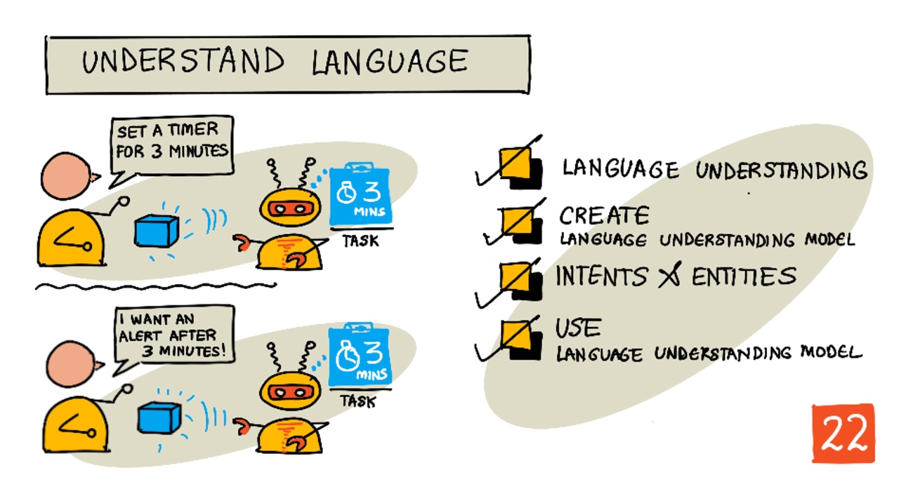

# 언어의 이해



> [Nitya Narasimhan](https://github.com/nitya)의 스케치 노트. 클릭하여 더 크게 보세요.

## 강의 전 퀴즈

[강의 전 퀴즈](https://black-meadow-040d15503.1.azurestaticapps.net/quiz/43)

## 개요

지난 수업에서 음성을 텍스트로 변환했습니다. 이것을 스마트 타이머를 프로그래밍하는 데 사용하기 위해선 코드가 말하는 내용을 이해해야 합니다. 사용자가 "3분 타이머 설정해줘"과 같은 정해진 문구를 말하고 해당 표현을 분석해서 타이머가 얼마나 설정되어야 할 지 알아낼 수 있을 것이라고 가정할 수 있지만 이는 사용자 친화적이지 않습니다. 사용자가 "타이머 3분으로 설정해줘"라고 말한다면 당신과 저는 그 말이 의미하는 바를 이해할 수 있지만 코드는 그렇지 않습니다. 코드는 정해진 문구를 기대합니다.

인공지능 모델을 사용하여 텍스트를 해석하고 필요한 세부 정보를 반환하는 언어 이해가 여기서 나옵니다. 예를들어 "3분 타이머 설정해줘"와 "타이머 3분으로 설정해줘"를 모두 사용할 수 있으며 3분의 타이머를 요구하는 것이라는 것을 이해할 수 있습니다.

이 수업에서는 언어 이해 모델에 대해 어떻게 그것을 생성하고 학습시키고 사용하는지 배웁니다.

이 수업에서는 다음을 다룹니다:

- [언어의 이해](#언어의-이해)
- [언어 이해 모델의 생성](#언어-이해-모델의-생성)
- [의도와 엔터티](#의도와-엔터티)
- [언어 이해 모델의 사용](#언어-이해-모델의-사용)

## 언어의 이해

인간은 수십만 년 동안 의사 소통을 위해 언어를 사용해 왔습니다. 우리는 단어, 소리 또는 행동으로 의사소통하고 말한 내용, 단어, 소리 또는 행동의 의미뿐만 아니라 그 맥락도 이해합니다. 우리는 목소리 톤에 따라 단어가 다른 의미를 갖는 것을 허용함으로서 진정성과 빈정거림을 구분합니다.

✅ 당신이 최근에 한 대화를 생각해보십시오. 컴퓨터가 맥락을 이해하기에 어려울 대화는 얼마나 되나요?

자연어 이해라고도 불리는 언어의 이해는 단어나 문장의 세부 사항을 이해하려고 노력하는 독해를 다루는 자연어 처리(또는 NLP)라는 인공지능 분야의 일부입니다. 알렉사나 시리와 같은 음성 비서를 사용하는 경우 당신은 언어 이해 서비스를 사용한 적이 있습니다. 이는 'Alexa, 테일러 스위프트 최신 앨범 틀어줘'를 내 딸이 좋아하는 곡에 맞춰 거실에서 춤을 추는 모습으로 바꿔주는 비하인드 AI 서비스들입니다.

> 💁 컴퓨터는 모든 발전에도 불구하고 텍스트를 정말로 이해하려면 아직 갈 길이 멉니다. 컴퓨터의 언어의 이해를 언급할 때 우리는 인간의 의사소통만큼 발전된 것을 의미하는 것이 아니라 단어를 취하고 주요 세부 사항을 추출하는 것을 의미합니다.

인간인 우리들은 언어를 깊이 생가하지 않고 이해합니다. 만약 제가 다른 사람에게 "테일러 스위프트의 최신 앨범 틀어줘"라고 한다면 그들은 본능적으로 제가 무슨 뜻으로 말한 것인지 알 것입니다. 컴퓨터에게 이것은 더욱 어렵습니다. 음성에서 텍스트로 변환된 단어를 가져와 다음 정보를 계산해야 합니다:

- 음악을 재생해야 합니다.
- 아티스트 테일러 스위프트가 음악을 맡았습니다.
- 특정 음악은 순서대로 여러 트랙의 전체 앨범입니다.
- 테일러 스위프트는 많은 앨범을 발매했으므로 시간순으로 정렬하여 가장 최근에 발매된 것이 필요합니다.

✅ 커피를 주문하거나 가족에게 무언가를 전달해 달라고 요청하는 것과 같이 요청을 할 때 사용했던 다른 문장을 생각해 보십시오. 컴퓨터가 문장을 이해하기 위해 추출해야하는 정보 조각들로 문장을 분리해보십시오.

언어 이해 모델은 작은 이미지 세트를 사용하여 Custom Vision 모델을 훈련한 것과 같은 방식으로 언어에서 특정 세부 정보를 추출하도록 훈련된 다음 전이 학습을 사용하여 특정 작업에 대해 훈련된 AI 모델입니다. 모델을 선택한 다음 이해하려는 텍스트를 사용하여 모델을 훈련시킬 수 있습니다.

## 언어 이해 모델의 생성


Cognitive Services의 일부인 Microsoft의 언어 이해 서비스인 LUIS를 사용하여 언어 이해 모델을 만들 수 있습니다.

### 작업 - 제작 리소스 생성

LUIS를 사용하기 위해서는 제작 리소스를 만들어야 합니다.

1. 다음 명령어를 사용하여 `smart-timer` 그룹에 제작 리소스를 생성합니다.

   ```python
   az cognitiveservices account create --name smart-timer-luis-authoring \
                                       --resource-group smart-timer \
                                       --kind LUIS.Authoring \
                                       --sku F0 \
                                       --yes \
                                       --location <location>
   ```

   `<location>`을 리소스 그룹을 만들 때 사용한 위치로 바꿉니다.

   > ⚠️ LUIS는 모든 지역에서 사용 가능하지는 않습니다. 따라서 다음과 같은 오류 메세지가 뜬다면:
   >
   > ```output
   > InvalidApiSetId: The account type 'LUIS.Authoring' is either invalid or unavailable in given region.
   > ```
   >
   > 다른 지역을 선택합니다.

   이는 무료 등급의 LUIS 제작 리소스를 생성합니다.

### 업무 - 언어 이해 앱 만들기

1. 브라우저에서 [luis.ai](https://luis.ai?WT.mc_id=academic-17441-jabenn)의 LUIS 포털을 열고, Azure에서 사용한 계정과 동일한 계정으로 로그인합니다.

1. 대화 상자의 지침에 따라 Azure 구독을 선택한 다음, 생성한 `smart-timer-luis-authoring` 리소스를 선택합니다.

1. _대화 앱_ 목록에서 **새 앱** 버튼을 선택하여 새로운 어플리케이션을 생성합니다. 새 앱의 이름을 `smart-timer`로 명명하고 _Culture_ 를 해당 언어로 설정합니다.

   > 💁 예측 리소스에 대한 필드가 있습니다. 예측을 위한 두 번째 리소스를 만들 수 있지만, 무료 제작 리소스는 한 달에 1,000개의 개발에 충분한 예측을 허용하므로 이 항목을 비워둘 수 있습니다.

1. 언어 이해 모델을 학습시키기 위해 수행해야 하는 단계를 이해하려면 앱을 만든 후 나타나는 가이드를 읽어보세요. 완료되면 해당 가이드를 닫습니다.

## 의도와 엔터티

언어의 이해는 _의도_ 와 _엔터티_ 를 기반으로 합니다. 의도는 단어가 의도하는 바를 말합니다. 예를 들면 음악 재생, 타이머 세팅, 음식 주문 등이 있습니다. 엔티티는 앨범, 타이머의 길이 또는 음식의 종류와 같이 의도가 참조하는 것을 말합니다. 모델이 이해하는 각각의 문장은 적어도 하나의 의도를 가져야 하고, 선택적으로 하나 또는 다수의 엔터티를 가질 수 있습니다.

예시:

| 문장                                              | 의도          | 엔터티                                  |
| ------------------------------------------------- | ------------- | --------------------------------------- |
| "Taylor Swift의 최신 앨범 재생해 줘"              | _음악 재생_   | _Taylor Swift의 최신 앨범_              |
| "3분 타이머 맞춰줘"                               | _타이머 설정_ | _3분_                                   |
| "타이머 취소해줘"                                 | _타이머 취소_ | 없음                                    |
| "파인애플 피자 라지 3판이랑 시저 샐러드 주문해줘" | _음식 주문_   | _파인애플 피자 라지 3판_, _시저 샐러드_ |

✅ 이전에 생각해보았던 문장에서 의도와 엔터티는 무엇인가요?

LUIS를 학습시키기 위해서는 먼저 엔터티를 설정합니다. 이는 용어의 고정된 목록이나 텍스트로부터 배운 것일 수 있습니다. 예를 들어 각 단어의 변형(또는 동의어)과 함께 메뉴에서 사용할 수 있는 고정된 음식 목록을 제공할 수 있습니다. LUIS에는 숫자와 위치와 같이 사용할 수 있는 미리 탑재된 엔터티도 있습니다.

타이머를 세팅하기 위해서, 시간에 대해 미리 작성된 숫자 엔터티를 사용하는 엔터티와 분이나 초와 같은 단위에 대해 각각의 다른 엔터티를 사용할 수 있습니다. 각 단위에는 minute과 minutes와 같은 단수형 및 복수형을 포함하는 여러 변형이 있습니다.

엔터티가 정의되면 의도를 생성합니다. 이는 당신이 제공하는 예문(발화)에 기반을 두고 학습합니다. 예를 들어, _타이머 세팅_ 이라는 의도에 대해 다음 문장들을 제공할 수 있습니다.

- `1초 타이머 설정`
- `타이머 1분 12초로 설정해줘`
- `타이머 3분으로 설정해줘`
- `9분 30초 타이머 설정해줘`

LUIS에게 이 문장들의 어떤 부분이 엔터티에 매핑되는지 알려줍니다:


`타이머 1분 12초로 설정해줘`라는 문장은 `타이머 설정`이라는 의도를 가집니다. 또한 각각 2개의 값을 갖는 2개의 엔터티를 가집니다:

|      | 시간 | 단위 |
| ---- | ---: | ---- |
| 1분  |    1 | 분   |
| 12초 |   12 | 초   |

좋은 모델을 훈련시키기 위해선 누군가가 동일한 것을 요구할 수 있는 여러 가지 방법을 다룰 수 있는 다양한 예문이 필요합니다.

> 💁 모든 AI 모델과 마찬가지로 훈련에 사용하는 데이터가 많고 정확할수록 모델이 더 좋아집니다.

✅ 같은 질문을 해서 인간이 이해하기를 기대하는 다른 방법들을 생각해보세요.

### 업무 - 언어 이해 모델에 엔터티 추가하기

타이머를 위해서는 2가지 엔터티가 필요합니다. 하나는 시간의 단위(분 또는 초)이고 다른 하나는 분이나 초의 숫자에 대한 것입니다.

LUIS 포털을 이용해서 [Quickstart: Build your app in LUIS portal documentation on Microsoft docs](https://docs.microsoft.com/azure/cognitive-services/luis/luis-get-started-create-app?WT.mc_id=academic-17441-jabenn)에서 지침을 찾을 수 있습니다.

1. LUIS 포털에서 _Entities_ 탭을 선택하고 **미리 빌드된 엔터티 추가**를 선택하여 미리 빌드된 엔터티 _number_ 를 추가합니다. 그런 다음 목록에서 _숫자_ 를 선택합니다.

1. **생성** 버튼을 사용하여 시간 단위를 위한 새 엔터티를 추가합니다. 엔터티의 이름을 `시간 단위`로 짓고 해당 타입을 _목록_ 에 세팅합니다. _정규화된 값_ 목록에 `분`과 `초`의 값을 추가합니다. 단수형과 복수형을 _동의어_ 목록에 추가합니다. 각각의 동의어를 추가한 뒤에 `return`(엔터키)을 누르면 목록에 추가됩니다.
   |정규화된 값| 동의어|
   |--------|-----|
   |분 |minute, minutes|
   |초 |second, seconds|

### 업무 - 언어 이해 모델에 의도 추가하기

1. _의도_ 탭에서 **생성** 버튼을 눌러 새로운 의도를 추가합니다. 이 의도를 `타이머 설정`이라고 이름 짓습니다.

1. 예시에서 분, 초 및 분과 초를 결합하여 타이머를 설정하는 다양한 방법을 입력합니다. 예를 들면 다음과 같습니다.

   - `1초 타이머 설정`
   - `4분 타이머 설정`
   - `타이머 사분 육초로 설정해줘`
   - `9분 30초 타이머 설정해줘`
   - `타이머 1분 12초로 설정해줘`
   - `타이머 3분으로 설정해줘`
   - `타이머 3분하고 1초로 설정해줘`
   - `삼분 일초로 타이머 설정해줘`
   - `1분 1초 타이머 설정`
   - `타이머 30초로 설정해줘`
   - `1초 타이머 설정`

   모델이 두 가지 모두를 처리하는 방법을 학습하도록 숫자를 단어와 숫자로 혼합합니다.

1. 각 예시를 입력하면 LUIS는 엔터티를 검색하기 시작하고 찾은 항목에 밑줄을 긋고 레이블을 지정합니다.
   

### 업무 - 모델을 학습시키고 테스트하기

1. 엔터티와 의도가 구성이 되고나면 상단 메뉴의 **Train** 버튼을 이용하여 모델을 학습시킬 수 있습니다. 이 버튼을 선택하면 모델은 몇 초간 학습합니다. 학습 중에는 버튼이 회색으로 표시되며, 학습이 완료되면 다시 활성화됩니다.

1. 상단 메뉴의 **Test** 버튼을 선택하여 언어 이해 모델을 테스트합니다. `타이머 5분 4초로 설정해줘` 와 같은 텍스트를 입력한 뒤 엔터키를 누릅니다. 입력한 텍스트 상자 아래의 상자에 해당 문장이 나타나며 _상위 의도_ 또는 가장 높은 가능성으로 판별된 의도가 나타납니다. 이것은 `set timer`이어야 합니다. 인텐트 이름 뒤에는 감지된 인텐트가 맞을 확률이 표시됩니다.

1. 결과의 분석을 보기 위해서는 **점검** 옵션을 선택합니다. 탐지된 엔터티 목록과 함께 백분율 확률과 함께 가장 높은 점수를 얻은 의도가 표시됩니다.

1. 테스트를 마치면 _Test_ 창을 닫습니다.

### 업무 - 모델을 게시하기

코드에서 이 모델을 사용하기 위해서는 이를 게시해야 합니다. LUIS에서 게시할 때 테스트용 스테이징 환경이나 전체 릴리즈용 제품 환경을 게시할 수 있습니다. 이 수업에서는 스테이징 환경이 좋습니다.

1. LUIS 포털에서 상단 메뉴에서 **게시하기** 버튼을 선택합니다.

1. _Staging slot_ 이 선택되었는지 확인하고 **완료**를 선택합니다. 앱이 게시되면 알림이 표시됩니다.

1. curl을 사용해서 이를 테스트할 수 있습니다. curl 명령을 빌드하기위해서는 엔드포인트, 애플리케이션 IP(앱 ID), API 키 3개의 값이 필요합니다. 이는 상단 메뉴에서 선택할 수 있는 **관리** 탭에서 접근할 수 있습니다.

   1. **Settings** 섹션에서 App ID를 복사합니다.

   1. _Azure Resources_ 섹션에서 _Authoring Resource_ 를 선택하고 _기본 키_ 와 _엔드포인트 URL_ 을 복사합니다.

1. 다음의 curl 명령어를 명령 프롬프트 또는 터미널에서 실행합니다.

   ```sh
   curl "<endpoint url>/luis/prediction/v3.0/apps/<app id>/slots/staging/predict" \
         --request GET \
         --get \
         --data "subscription-key=<primary key>" \
         --data "verbose=false" \
         --data "show-all-intents=true" \
         --data-urlencode "query=<sentence>"
   ```

   `<endpoint url>`를 _Azure Resources_ 섹션에서의 엔드포인트 URL로 바꿉니다.

   `<app id>` 를 _Settings_ 섹션에서의 App ID로 바꿉니다.

   `<primary key>`를 _Azure Resources_ 섹션의 기본 키로 바꿉니다.

   `<sentence>`를 테스트하고자 하는 문장으로 바꿉니다.

1. 이 호출의 출력은 쿼리, 상위에 있는 의도와 유형별로 분류된 엔터티 목록을 자세히 설명하는 JSON 문서입니다.

   ```JSON
   {
       "query": "set a timer for 45 minutes and 12 seconds",
       "prediction": {
           "topIntent": "set timer",
           "intents": {
               "set timer": {
                   "score": 0.97031575
               },
               "None": {
                   "score": 0.02205793
               }
           },
           "entities": {
               "number": [
                   45,
                   12
               ],
               "time-unit": [
                   [
                       "minute"
                   ],
                   [
                       "second"
                   ]
               ]
           }
       }
   }
   ```

   상단의 JSON은 `set a timer for 45 minutes and 12 seconds`을 사용한 쿼리의 결과입니다.

   - `set timer`는 97%의 가능성을 가진 상위 의도입니다.
   - `45` 와 `12` 두 개의 _숫자_ 엔터티가 감지되었습니다.
   - `분` 과 `초` 두 개의 _시간-단위_ 엔터티가 감지되었습니다.

## 언어 이해 모델의 사용

게시가 되고 나면 LUIS 모델을 코드에서 호출할 수 있습니다. 이전 수업에서 IoT Hub를 사용하여 클라우드 서비스와의 통신을 처리하고 원격 분석을 보내고 명령을 수신했습니다. 이는 매우 비동기적입니다. 일단 원격 측정이 전송되면 코드가 응답을 기다리지 않으며 만약 클라우드 서비스가 다운되더라도 알 수 없습니다.

스마트 타이머의 경우 사용자에게 타이머가 설정되었음을 알리거나 클라우드 서비스를 사용할 수 없다고 경고할 수 있도록 즉시 응답을 원합니다. 이를 위해 IoT 장치는 IoT Hub에 의존하는 대신 웹의 엔드포인트를 직접 호출합니다.

IoT 장치에서 LUIS를 호출하는 대신에 다른 유형의 트리거(HTTP 트리거)와 함께 서버리스 코드를 사용할 수 있습니다. 이렇게 하면 함수 앱이 REST 요청을 수신 대기하고 이에 응답할 수 있습니다. 이 함수는 장치가 호출할 수 있는 REST 엔드포인트가 됩니다.

> 💁 IoT 디바이스에서 직접 LUIS를 호출할 수 있지만 서버리스 코드를 사용하는 것이 좋습니다. 이렇게 하면 호출하는 LUIS 앱을 변경하려는 경우(예: 더 나은 모델을 학습시키거나 다른 언어로 모델을 학습시키는 경우) 잠재적으로 수천 또는 수백만 개의 IoT 장치에 코드를 재배포하지 않고 클라우드 코드만 업데이트하면 됩니다.

### 업무 - 서버리스 함수 앱 만들기

1. `smart-timer-trigger`의 이름으로 Azure Function 앱을 생성하고 이를 VS Code에서 엽니다.

1. VS Code의 터미널에서 아래의 명령을 사용하여 `speech-trigger` HTTP 트리거를 추가합니다.

   ```sh
   func new --name text-to-timer --template "HTTP trigger"
   ```

   이는 `text-to-timer`라는 HTTP 트리거를 생성합니다.

1. functions 앱을 실행하여 HTTP 트리거를 테스트합니다. 실행하면 출력에 나열된 엔드포인트를 볼 수 있습니다.

   ```output
   Functions:

           text-to-timer: [GET,POST] http://localhost:7071/api/text-to-timer
   ```

   URL [http://localhost:7071/api/text-to-timer](http://localhost:7071/api/text-to-timer)을 브라우저에서 로드하여 이를 테스트 합니다.

   ```output
   This HTTP triggered function executed successfully. Pass a name in the query string or in the request body for a personalized response.
   ```

### 업무 - 언어 이해 모델 사용하기

1. LUIS용 SDK는 Pip 패키지를 통해 사용이 가능합니다. `requirements.txt` 파일에 다음 줄을 추가하여 이 패키지에 대한 종속성을 추가합니다.

   ```sh
   azure-cognitiveservices-language-luis
   ```

1. VS Code 터미널에 가상 환경이 활성화되어 있는지 확인하고 다음 명령을 실행하여 Pip 패키지를 설치합니다:

   ```sh
   pip install -r requirements.txt
   ```

   > 💁 오류가 난다면 다음 명령어를 통해 pip를 업그레이드 해야합니다:
   >
   > ```sh
   > pip install --upgrade pip
   > ``
   > ```

1. LUIS 포털의 **관리** 탭의 LUIS API Key, Endpoint URL, App ID를 위한 새 엔트리를 `local.settings.json` 파일에 추가합니다:

   ```JSON
   "LUIS_KEY": "<primary key>",
   "LUIS_ENDPOINT_URL": "<endpoint url>",
   "LUIS_APP_ID": "<app id>"
   ```

   `<endpoint url>` 를 _Azure Resources_ 섹션의 **MANAGE** 탭에서의 앤드포인트 URL로 바꿉니다. 이는 `https://<location>.api.cognitive.microsoft.com/`일 것입니다.

   `<app id>`를 _Settings_ 섹션의 **관리** 탭의 App ID로 변경합니다.

   `<primary key>` 를 _Azure Resources_ 섹션의 **MANAGE** 탭의 기본 키로 변경합니다.

1. 다음의 import문들을 `__init__.py` 파일에 추가합니다:

   ```python
   import json
   import os
   from azure.cognitiveservices.language.luis.runtime import LUISRuntimeClient
   from msrest.authentication import CognitiveServicesCredentials
   ```

   이는 몇몇 LUIS와 상호작용하는 시스템 라이브러리를 import합니다.

1. `main` 메서드의 내용을 삭제하고 다음 코드를 추가합니다:

   ```python
   luis_key = os.environ['LUIS_KEY']
   endpoint_url = os.environ['LUIS_ENDPOINT_URL']
   app_id = os.environ['LUIS_APP_ID']

   credentials = CognitiveServicesCredentials(luis_key)
   client = LUISRuntimeClient(endpoint=endpoint_url, credentials=credentials)
   ```

   그러면 LUIS 앱의 `local.settings.json` 파일에 추가한 값이 로드되고 API 키로 자격 증명 개체가 생성된 다음 LUIS 앱과 상호 작용할 LUIS 클라이언트 개체가 생성됩니다.

1. 이 HTTP 트리거는 텍스트를 JSON으로 이해하기 위해 `text`라는 속성에 있는 텍스트를 전달하는 것으로 호출됩니다. 다음 코드는 HTTP 요청의 본문에서 값을 추출하여 콘솔에 기록합니다. 다음 코드를 `main` 함수에 추가합니다:

   ```python
   req_body = req.get_json()
   text = req_body['text']
   logging.info(f'Request - {text}')
   ```

1. 예측 요청(예측할 텍스트가 포함된 JSON 문서)을 전송하여 LUIS에서 예측을 요청합니다. 다음 코드를 사용하여 생성합니다:

   ```python
   prediction_request = { 'query' : text }
   ```

1. 앱이 게시된 스테이징 슬롯을 사용하여 이 요청을 LUIS로 보낼 수 있습니다.

   ```python
   prediction_response = client.prediction.get_slot_prediction(app_id, 'Staging', prediction_request)
   ```

1. 예측 응답에는 엔터티와 함께 ​​최상위 의도(예측 점수가 가장 높은 의도)가 포함됩니다. 최상위 의도가 `set timer`인 경우 엔티티를 읽어 타이머에
   필요한 시간을 얻을 수 있습니다:

   ```python
   if prediction_response.prediction.top_intent == 'set timer':
       numbers = prediction_response.prediction.entities['number']
       time_units = prediction_response.prediction.entities['time unit']
       total_seconds = 0
   ```

   `number` 엔터티는 숫자 배열입니다. 예를 들어 _"Set a four minute 17 second timer."_ 라고 말한다면 `number` 배열은 4와 17 2개의 단일 값을 포함할 것입니다.

   `time unit` 배열은 문자열 배열이며 각 시간 단위는 배열 내부의 문자열 배열입니다. 예를 들어 _"Set a four minute 17 second timer."_ 라고 말한다면 `time unit` 배열은 각각 `['minute']` 과 `['second']` 의 단일 값을 가지는 두 배열을 포함할 것입니다.

   _"Set a four minute 17 second timer."_ 에 대한 이러한 엔티티의 JSON 버전은 다음과 같습니다:

   ```json
   {
     "number": [4, 17],
     "time unit": [["minute"], ["second"]]
   }
   ```

   이 코드는 또한 타이머의 총 시간을 초 단위로 정의합니다. 이는 엔터티의 값으로 채워집니다.

1. 엔터티는 연결되어 있지 않지만 우리는 이에 대해 몇 가지 가정을 할 수 있습니다. 말한 순서대로 나열되기 때문에 배열의 위치를 ​​사용하여 어떤 숫자가 어떤 시간 단위와 일치하는지 확인할 수 있습니다. 예를 들어:

   - _"Set a 30 second timer"_ - 이는 하나의 숫자 `30`을 가지고 하나의 시간 단위 `second`을 가집니다, 따라서 하나의 숫자가 하나의 시간 단위와 짝을 이룹니다.
   - _"Set a 2 minute and 30 second timer"_ - 이는 `2` 와 `30` 2개의 숫자를 가집니다. 또한 `minute`과 `second`의 두 개의 시간 단위를 가집니다. 따라서 첫 번째 숫자는 첫 번째 시간 단위와 짝을 이루고(2분), 두 번째 숫자는 두 번째 시간 단위와 짝을 이룰 것입니다(30초).

   다음 코드는 숫자 엔터티의 항목 수를 가져오고 이를 사용하여 각 배열에서 첫 번째 항목을 추출한 다음 두 번째 항목을 추출하는 코드입니다. 이를 `if` 블록 안에 추가합니다.

   ```python
   for i in range(0, len(numbers)):
       number = numbers[i]
       time_unit = time_units[i][0]
   ```

   _"Set a four minute 17 second timer."_ 에 대하여 이 코드는 루프를 두번 돌아 다음과 같은 값을 제공합니다:
   | 반복 횟수 | `number` | `time_unit` |
   | ---------: | -------: | ----------- |
   | 0 | 4 | minute |
   | 1 | 17 | second |

1. 이 루프 내에서 숫자와 시간 단위를 사용하여 타이머의 총 시간(분당 60초, 초당 초 수)을 계산합니다.

   ```python
   if time_unit == 'minute':
      total_seconds += number * 60
   else:
      total_seconds += number
   ```

1. 엔티티를 통과하는 이 루프 외부에서 타이머의 총 시간을 로그로 남깁니다:

   ```python
   logging.info(f'Timer required for {total_seconds} seconds')
   ```

1. 함수에서 HTTP 응답으로 반환해야 하는 시간(초)입니다. `if` 블럭의 끝 부분에 다음을 추가합니다:

   ```python
   payload = {
       'seconds': total_seconds
   }
   return func.HttpResponse(json.dumps(payload), status_code=200)
   ```

   이 코드는 타이머의 총 시간(초)이 포함된 페이로드를 생성하고, 이를 JSON 문자열로 변환한 다음 호출이 성공했음을 의미하는 상태 코드 200과 함께 HTTP 결과로 반환합니다.

1. 마지막으로 `if` 블럭의 밖에서 오류 코드를 반환하여 의도가 인식되지 않은 경우를 처리합니다:

   ```python
   return func.HttpResponse(status_code=404)
   ```

   404는 _not found_ 에 대한 상태 코드입니다.

1. function app을 실행하고 curl을 사용하여 이를 테스트합니다.

   ```sh
   curl --request POST 'http://localhost:7071/api/text-to-timer' \
        --header 'Content-Type: application/json' \
        --include \
        --data '{"text":"<text>"}'
   ```

   `<text>` 를 `set a 2 minutes 27 second timer`와 같은 요청한 텍스트로 바꿉니다.

   function app에서 다음과 같은 결과를 볼 수 있습니다:

   ```output
   Functions:

           text-to-timer: [GET,POST] http://localhost:7071/api/text-to-timer

   For detailed output, run func with --verbose flag.
   [2021-06-26T19:45:14.502Z] Worker process started and initialized.
   [2021-06-26T19:45:19.338Z] Host lock lease acquired by instance ID '000000000000000000000000951CAE4E'.
   [2021-06-26T19:45:52.059Z] Executing 'Functions.text-to-timer' (Reason='This function was programmatically called via the host APIs.', Id=f68bfb90-30e4-47a5-99da-126b66218e81)
   [2021-06-26T19:45:53.577Z] Timer required for 147 seconds
   [2021-06-26T19:45:53.746Z] Executed 'Functions.text-to-timer' (Succeeded, Id=f68bfb90-30e4-47a5-99da-126b66218e81, Duration=1750ms)
   ```

   curl 호출은 다음을 반환합니다:

   ```output
   HTTP/1.1 200 OK
   Date: Tue, 29 Jun 2021 01:14:11 GMT
   Content-Type: text/plain; charset=utf-8
   Server: Kestrel
   Transfer-Encoding: chunked

   {"seconds": 147}
   ```

   타이머가 설정되어야 하는 시간은 `"seconds"` 단위입니다.

> 💁 이 코드는 [code/functions](../code/functions) 폴더에서 찾을 수 있습니다.

### 업무 - function을 IoT 장치에서 사용할 수 있도록 하기

1. IoT 장치가 REST 엔드포인트를 호출하려면 URL을 알아야 합니다. 이전에 이에 액세스 했을 때에는 로컬 시스템에서 REST 끝점에 액세스하기 위한 바로 가기인 `localhost`을 사용했습니다. IoT 장치가 액세스할 수 있도록 하려면 클라우드에 게시하거나 IP 주소를 가져와 로컬에서 액세스해야 합니다.

   > ⚠️ Wio Terminal을 사용하는 경우 이전과 동일한 방식으로 함수 앱을 배포할 수 없음을 의미하는 라이브러리에 대한 종속성이 있습니다. 따라서 로컬에서 함수 앱을 실행하는 것이 더 쉽습니다. function 앱을 로컬에서 실행하고 컴퓨터의 IP 주소를 통해 액세스합니다. 클라우드에 배포하려는 경우 이를 수행하는 방법에 대한 이후 학습에서 정보가 제공됩니다.

   - 기능 앱을 게시하기 - 이전 레슨의 지침에 따라 기능 앱을 클라우드에 게시합니다. 게시되고 나면 URL은 `https://<APP_NAME>.azurewebsites.net/api/text-to-timer`이 되고 `<APP_NAME>`은 당신의 기능 앱 이름을 의미합니다. 로컬 설정에서도 게시되었는지 확인하십시오.

     HTTP 트리거를 사용하여 작업할 때 기본적으로 기능 앱 키로 보호됩니다. 이 키를 가져오기 위해선 다음 명령을 실행합니다:

     ```sh
     az functionapp keys list --resource-group smart-timer \
                              --name <APP_NAME>
     ```

     `functionKeys`에서 `default` 엔트리의 값을 복사합니다.

     ```output
     {
       "functionKeys": {
         "default": "sQO1LQaeK9N1qYD6SXeb/TctCmwQEkToLJU6Dw8TthNeUH8VA45hlA=="
       },
       "masterKey": "RSKOAIlyvvQEQt9dfpabJT018scaLpQu9p1poHIMCxx5LYrIQZyQ/g==",
       "systemKeys": {}
     }
     ```

     이 키가 쿼리 매개변수에 추가되어야 하므로 최종 URL은 `https://<APP_NAME>.azurewebsites.net/api/text-to-timer?code=<FUNCTION_KEY>`입니다. 여기서 `<APP_NAME>`이 functions 앱의 이름이 되고 `<FUNCTION_KEY>`가 기본 기능 키가 됩니다.

     > 💁 `function.json` 파일의 `authlevel` 설정을 사용하여 HTTP 트리거의 인증 유형을 변경할 수 있습니다. 이에 대해 더 자세히 알기 위해선 [configuration section of the Azure Functions HTTP trigger documentation on Microsoft docs](https://docs.microsoft.com/azure/azure-functions/functions-bindings-http-webhook-trigger?WT.mc_id=academic-17441-jabenn&tabs=python#configuration)를 참고하십시오.

   - functions 앱을 로컬에서 실행하고 IP 주소를 사용하여 액세스합니다. 로컬 네트워크에서 IP 주소를 가져와 URL을 만드는 데 사용할 수 있습니다.

     IP 주소 찾기:

     - Windows 10에서는 [find your IP address guide](https://support.microsoft.com/windows/find-your-ip-address-f21a9bbc-c582-55cd-35e0-73431160a1b9?WT.mc_id=academic-17441-jabenn)를 따릅니다.

     - macOS에서는 [how to find you IP address on a Mac guide](https://www.hellotech.com/guide/for/how-to-find-ip-address-on-mac)를 따릅니다.

     - Linux에서는 [how to find your IP address in Linux guide](https://opensource.com/article/18/5/how-find-ip-address-linux)에서 개인 IP 주소 찾기 섹션을 따릅니다.

     IP 주소가 있으면, `http://<IP_ADDRESS>:7071/api/text-to-timer`에 있는 함수에 접근할 수 있습니다. `<IP_ADDRESS>` 는 당신의 IP 주소입니다. 예를 들면 `http://192.168.1.10:7071/api/text-to-timer`같이 사용할 수 있습니다.

     > 💁 7071 포트를 사용하는 것이 아니라, IP 주소 뒤에`:7071`이 필요합니다.

     > 💁 이것은 IoT 장치가 컴퓨터와 동일한 네트워크에 있는 경우에만 작동합니다.

1. curl을 사용하여 엔드포인트에 액세스하여 엔드포인트를 테스트합니다.

---

## 🚀 도전 과제

타이머를 세팅하는 것과 같이 동일한 것을 요청하는 데는 많은 방법이 있습니다. 이를 수행하는 다양한 방법을 생각하고 LUIS 앱에서 예로 사용해봅시다. 이를 테스트하여 모델이 타이머를 요청하는 여러 방법에 얼마나 잘 대처할 수 있는지 확인합니다.

## 강의 후 퀴즈

[강의 후 퀴즈](https://black-meadow-040d15503.1.azurestaticapps.net/quiz/44)

## 복습 & 자습

- LUIS 및 해당 기능에 대해 [Language Understanding (LUIS) documentation page on Microsoft docs](https://docs.microsoft.com/azure/cognitive-services/luis/?WT.mc_id=academic-17441-jabenn)에서 더 자세히 읽어보세요.
- [natural-language understanding page on Wikipedia](https://wikipedia.org/wiki/Natural-language_understanding)에서 언어 이해에 대해 더 알아보세요.
- HTTP 트리거에 대해 [Azure Functions HTTP trigger documentation on Microsoft docs](https://docs.microsoft.com/azure/azure-functions/functions-bindings-http-webhook-trigger?WT.mc_id=academic-17441-jabenn&tabs=python)에서 더 알아보세요.

## 과제

[타이머 취소](assignment.ko.md)
