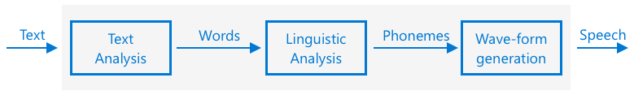

# Set a timer and provide spoken feedback

## Pre-lecture quiz

[Pre-lecture quiz](https://brave-island-0b7c7f50f.azurestaticapps.net/quiz/45)

## Introduction

Smart assistants are not one-way communication devices. You speak to them, and they respond:

"Alexa, set a 3 minute timer"

"Ok, your timer is set for 3 minutes"

In the last 2 lessons you learned how to take speech and create text, then extract a set timer request from that text. In this lesson you will learn how to set the timer on the IoT device, responding to the user with spoken words confirming their timer, and alerting them when their timer is finished.

In this lesson we'll cover:

* [Text to speech](#text-to-speech)
* [Set the timer](#set-the-timer)
* [Convert text to speech](#convert-text-to-speech)

## Text to speech

Text to speech, as the name suggests, is the process of converting text into audio that contains the text as spoken words. The basic principle is to break down the words in the text into their constituent sounds (known as phonemes), and stitch together audio for those sounds, either using pre-recorded audio or using audio generated by AI models.



Text to speech systems typically have 3 stages:

* Text analysis
* Linguistic analysis
* Wave-form generation

### Text analysis

Text analysis involves taking the text provided, and converting into words that can be used to generate speech. For example, if you convert "Hello world", there there is no text analysis needed, the two words can be converted to speech. If you have "1234" however, then this might need to be converted either into the words "One thousand, two hundred thirty four" or "One, two, three, four" depending on the context. For "I have 1234 apples", then it would be "One thousand, two hundred thirty four", but for "The child counted 1234" then it would be "One, two, three, four".

The words created vary not only for the language, but the locale of that language. For example, in American English, 120 would be "One hundred twenty", in British English it would be "One hundred and twenty", with the use of "and" after the hundreds.

✅ Some other examples that require text analysis include "in" as a short form of inch, and "st" as a short form of saint and street. Can you think of other examples in your language of words that are ambiguous without context.

Once the words have been defined, they are sent for linguistic analysis.

### Linguistic analysis

Linguistic analysis breaks the words down into phonemes. Phonemes are based not just on the letters used, but the other letters in the word. For example, in English the 'a' sound in 'car' and 'care' is different. The English language has 44 different phonemes for the 26 letters in the alphabet, some shared by different letters, such as the same phoneme used at the start of 'circle' and 'serpent'.

✅ Do some research: What are the phonemes for you language?

Once the words have been converted to phonemes, these phonemes need additional data to support intonation, adjusting the tone or duration depending on the context. One example is in English pitch increases can be used to convert a sentence into a question, having a raised pitch for the last word implies a question.

For example - the sentence "You have an apple" is a statement saying that you have an apple. If the pitch goes up at the end, increasing for the word apple, it becomes the question "You have an apple?", asking if you have an apple. The linguistic analysis needs to use the question mark at the end to decide to increase pitch.

Once the phonemes have been generated, they can be sent for wave-form generation to produce the audio output.

### Wave-form generation

The first electronic text to speech systems used single audio recordings for each phoneme, leading to very monotonous, robotic sounding voices. The linguistic analysis would produce phonemes, these would be loaded from a database of sounds and stitched together to make the audio.

✅ Do some research: Find some audio recordings from early speech synthesis systems. Compare it to modern speech synthesis, such as that used in smart assistants.

More modern wave-form generation uses ML models built using deep learning (very large neural networks that act in a similar way to neurons in the brain) to produce more natural sounding voices that can be indistinguishable from humans.

> 💁 Some of these ML models can be re-trained using transfer learning to sound like real people. This means using voice as a security system, something banks are increasingly trying to do, is no longer a good idea as anyone with a recording of a few minutes of your voice can impersonate you.

These large ML models are being trained to combine all three steps into end-to-end speech synthesizers.

## Set the timer

To set the timer, your IoT device needs to call the REST endpoint you created using serverless code, then use the resulting number of seconds to set a timer.

### Task - call the serverless function to get the timer time

Follow the relevant guide to call the REST endpoint from your IoT device and set a timer for the required time:

* [Arduino - Wio Terminal](wio-terminal-set-timer.md)
* [Single-board computer - Raspberry Pi/Virtual IoT device](single-board-computer-set-timer.md)

## Convert text to speech

The same speech service you used to convert speech to text can be used to convert text back into speech, and this can be played through a speaker on your IoT device. The text to convert is sent to the speech service, along with the type of audio required (such as the sample rate), and binary data containing the audio is returned.

When you send this request, you send it using *Speech Synthesis Markup Language* (SSML), an XML-based markup language for speech synthesis applications. This defines not only the text to be converted, but the language of the text, the voice to use, and can even be used to define speed, volume, and pitch for some or all of the words in the text.

For example, this SSML defines a request to convert the text "Your 3 minute 5 second time has been set" to speech using a British English voice called `en-GB-MiaNeural`

```xml
<speak version='1.0' xml:lang='en-GB'>
    <voice xml:lang='en-GB' name='en-GB-MiaNeural'>
        Your 3 minute 5 second time has been set
    </voice>
</speak>
```

> 💁 Most text to speech systems have multiple voices for different languages, with relevant accents such as a British English voice with an English accent and a New Zealand English voice with a New Zealand accent.

### Task - convert text to speech

Work through the relevant guide to convert text to speech using your IoT device:

* [Arduino - Wio Terminal](wio-terminal-text-to-speech.md)
* [Single-board computer - Raspberry Pi](pi-text-to-speech.md)
* [Single-board computer - Virtual device](virtual-device-text-to-speech.md)

---

## 🚀 Challenge

SSML has ways to change how words are spoken, such as adding emphasis to certain words, adding pauses, or changing pitch. Try some of these out, sending different SSML from your IoT device and comparing the output. You can read more about SSML, including how to change the way words are spoken in the [Speech Synthesis Markup Language (SSML) Version 1.1 specification from the World Wide Web consortium](https://www.w3.org/TR/speech-synthesis11/).

## Post-lecture quiz

[Post-lecture quiz](https://brave-island-0b7c7f50f.azurestaticapps.net/quiz/46)

## Review & Self Study

* Read more on speech synthesis on the [Speech synthesis page on Wikipedia](https://wikipedia.org/wiki/Speech_synthesis)
* Read more on ways criminals are using speech synthesis to steal on the [Fake voices 'help cyber crooks steal cash' story on BBC news](https://www.bbc.com/news/technology-48908736)
* Learn more about the risks to voice actors from synthesized versions of their voices in the [This TikTok Lawsuit Is Highlighting How AI Is Screwing Over Voice Actors article on Vice](https://www.vice.com/en/article/z3xqwj/this-tiktok-lawsuit-is-highlighting-how-ai-is-screwing-over-voice-actors)

## Assignment

[Cancel the timer](assignment.md)
