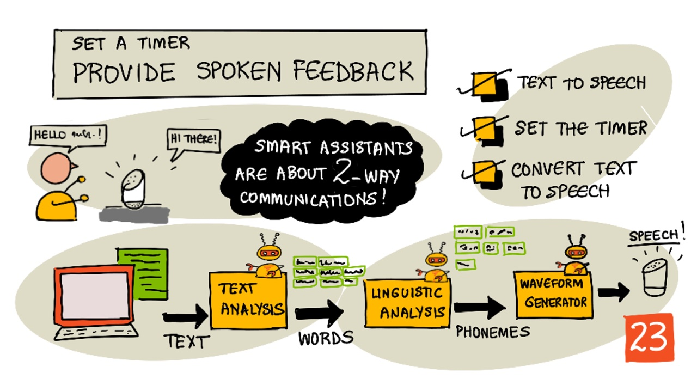

# 타이머 설정 및 음성 피드백 제공



> [Nitya Narasimhan](https://github.com/nitya)의 스케치노트. 클릭하여 크게 보세요.

## 강의 전 퀴즈

[강의 전 퀴즈](https://black-meadow-040d15503.1.azurestaticapps.net/quiz/45)

## 도입

스마트 어시스턴트는 단방향 통신 장치가 아닙니다. 그들에게 말을 걸면 그들은 대답합니다.

"Alexa, 3분짜리 타이머 설정해줘"

"네. 3분 타이머 설정했습니다."

지난 두 번의 수업에서 여러분은 강의를 듣고 음성을 통해 텍스트를 생성하는 방법을 배웠고, 생성한 텍스트에서 타이머 설정 요청에 관한 내용을 추출했습니다. 이 수업에서는 IoT 장치에서 타이머를 설정하고,  사용자에게 타이머 설정이 완료됨을 확인하는 음성안내를 송출한 후, 타이머가 종료되면 알람을 울리는 방법을 배울 것 입니다.

이 강의에서는 다음을 다룹니다.:

* [텍스트에서 음성으로](#텍스트에서-음성으로)
* [타이머 설정하기](#타이머-설정하기)
* [텍스트를 음성으로 변환하기](#텍스트를-음성으로-변환하기)

## 텍스트에서 음성으로

제목에서부터 알다시피 텍스트를 음성으로 변환하는 과정입니다. 기본 원칙은 텍스트의 단어를 구성하는 소리(음소)로 나누고, 사전 녹음된 오디오나  AI모델에서 생성된 오디오를 사용하여 하나의 오디오로 연결합니다. 


텍스트 음성 변환 시스템은 일반적으로 3단계로 구성됩니다.

* 텍스트 분석
* 언어 분석
* 파형 발생

### 텍스트 분석

텍스트 분석에는 제공된 문장을 가져와서 음성을 생성하는 데 필요한 단어로 변환하는 작업이 포함됩니다. 예를 들어 "Hello wolrd" 를 변환하면 텍스트 분석 없이 두 단어를 음성으로 변환할 수 있습니다. 그러나 "1234"는 문맥에 따라 "천 이백 삼시 사" 혹은 "일 이  삼 사" 로 변환해야 할 수 있습니다. "나는 1234개의 사과를 가지고 있다"의 경우 문맥상 "천 이백 삼십 사"로 감지되지만, "아이가 1234ㄹ를 세었다"의 경우 "일 이 삼 사"가 됩니다.

생성된 단어는 언어 뿐만 아니라 해당 언어의 사용 환경에 따라 다릅니다. 예를 들면, 미국영어에서 "120"은  "One hundred twenty" 이지만, 영국에서는  "One hundred and twenty"으로 hundreds 뒤에 "and"를 사용합니다.

✅ 텍스트 분석이 필요한 다른 예로는 inch의 in을 발음하는 짧은 음, saint와 street의 짧은 형태의 "st"등이 있습니다. 여러분은 문맥 상 모호한 언어로 구성된 다른 예시들이 생각 나시나요?
 
 +) 한국어 문맥 상 "난 네 말이 궁금해" 에서 동물을 의미하는 지 대화를 의미하는 지 등의 동음이의어이지 않을까 생각합니다.

문맥상 단어가 명확해지면 언어 분석을 위해 전송됩니다.

### 언어 분석

언어 분석은 단어들을 음소로 나눕니다. 음소는 사용된 문자 뿐만 아니라 단어의 다른 문자에도 기반을 두고 있습니다. 예를들어 영어에서 'car'와 'care'에서의 'a'소리가 다릅니다. 영어는 알파벳의 26개 문자에 대하여 44개의 서로 다른 음소를 가지고 있으며, 일부는 'circle'와 'serpent'처럼 다른 문자이지만 동일한 음소로 사용되는 경우도 존재합니다.

✅ 생각 해 봅시다 : 한국어 음소는 무엇이 있나요?

일단 단어들이 음소로 변환되면, 이 음소들은 문맥에 따라서 음조나 발음 시간을 조절하면서 억양을 지원하기 위한 추가적인 데이터가 필요합니다. 한 예로 영어에서 마지막 단어에 대한 음높이 증가는 질문을 의미합니다. 이를 바탕으로 문장을 질문으로 변환하는 데 사용할 수 있습니다.

예를 들어, "You have an apple"이라는 문장은 상대방이 사과를 가지고 있다는 것을 나타내는 문장입니다. 만약 마지막 'apple' 단어의 끝음이 올라간다면 "You have an apple?"의 질문 형태가 됩니다. 언어 분석 시 마지막 단어의 음이 올라가는 것을 파악하면 물음표를 사용하여 질문임을 표시해야합니다.

일단 음소가 생성되면, 오디오 출력을 생성하기 위한 파형 생성을 위해 전송될 수 있습니다.

### 파형 발생

최초의 전자 텍스트 음성 변환 시스템은 각 음소에 단일 오디오 녹음을 사용하여 매우 단조로운 로봇 음성으로 구현되었습니다. 이들은 소리 데이터베이스에서 로드되고 오디오를 만들기 위해 연결됩니다.

✅ 생각 해 봅시다 : 초기 음성 합성 시스템의 오디오 녹음을 찾아봅시다. 스마트 어시스턴트에 사용되는 것과 같은 최신 음성 합성과 비교 해 봅시다.

보다 최신의 파형 생성은 딥러닝을 사용하여 구축된 머신 러닝 모델을 사용하여 인간과 구별 할 수 없는 더 자연스러운 소리를 생성합니다.

> 💁 이러한 머신 러닝 모델 중 일부는 실제 사람이 말하는 것 처럼 들리기 위해 전이 학습을 사용하여 재학습 될 수 있습니다. 즉, 은행에서 점점 더 시도하고 있는 음성 보안 시스템은 여러분의 목소리를 몇 분 녹음한 사람은 누구나 여러분을 사칭할 수 있기 때문에 좋은 방법이 아니라고 생각합니다.

이러한 대형 머신 러닝 모델은 세 단계를 모두 end-to-end 음성 합성기로 결합하도록 학습되고 있습니다.

## 타이머 설정하기

타이머를 설정하려면 IoT 장치가 서버리스 코드를 사용하여 만든 REST 엔드포인트를 호출한 후, 결과 시간을 사용하여 타이머를 설정합니다.

### 작업 - 서버리스 함수를 호출하여 타이머 시간을 가져옵시다.

아래 안내에 따라 IoT 장치에서 REST 끝 점을 호출하고 요청한 시간 동안의 타이머를 설정 해 줍니다.:

* [Arduino - Wio Terminal](../wio-terminal-set-timer.md)
* [Single-board computer - Raspberry Pi/Virtual IoT device](single-board-computer-set-timer.ko.md)

## 텍스트를 음성으로 변환하기

음성을 텍스트로 변환하는 데 사용한 것과 동일한 음성 서비스를 사용하여 텍스트를 다시 음성으로 변환할 수 있습니다. 이는 IoT 장치의 스피커를 통해 재생할 수 있습니다. 변환하고자 하는 텍스트는 필요한 오디오 유형(ex: 샘플링 정도)정보와 함께 음성 서비스로 전송되고 오디오가 포함된 이진 데이터가 반환됩니다.

해당 요청을 보낼 때, 음성 합성 응용 프로그램을 위한 XML 기반 마크업 언어인 *Speech Synthesis Markup Language*(SSML)를 사용하여 전송합니다. 이것은 변환될 텍스트 뿐만 아니라 텍스트의 언어, 사용할 음성을 정의하며 텍스트의 일부 또는 전부에 대한 말한느 속도, 볼륨, 피치 등을 정의하는 데 사용될 수 있습니다.

예를 들어, 이 SSML은 "Your 3 minute 5 second time has been set" 라는 텍스트를  `en-GB-MiaNeural`이라는 영국 언어 음성을 사용하여 음성으로 변환하는 요청을 정의합니다.

```xml
<speak version='1.0' xml:lang='en-GB'>
    <voice xml:lang='en-GB' name='en-GB-MiaNeural'>
        Your 3 minute 5 second time has been set
    </voice>
</speak>
```

> 💁 대부분의 텍스트 음성 시스템은 영국 억양 영어 음성, 뉴질랜드 억양 영어 음성 등 다양한 언어에 대한 다양한 음성을 가지고 있습니다.

### 작업 - 텍스트를 음성으로 변환 해 봅시다.

IoT 장치를 사용하여 텍스트를 음성으로 변환하려면 아래 가이드를 사용하십시오.

* [Arduino - Wio Terminal](../wio-terminal-text-to-speech.md)
* [Single-board computer - Raspberry Pi](pi-text-to-speech.ko.md)
* [Single-board computer - Virtual device](../virtual-device-text-to-speech.md)

---

## 🚀 도전

SSML은 특정 단어를 강조하거나, 잠깐의 텀을 두거나, 음높이를 변경하는 등 단어를 말하는 방식을 변경하는 방법을 가지고 있습니다. IoT 장치에서 다른 SSML을 전송하고 출력을 비교하면서 이 중 몇가지를 시도해봅시다. SSML에 대한 자세한 내용은 [World Wide Web Consortium의 음성 합성 마크업 언어(SSML) Version 1.1](https://www.w3.org/TR/speech-synthesis11/))에서 확인할 수 있습니다.

## 강의 후 퀴즈

[강의 후 퀴즈](https://black-meadow-040d15503.1.azurestaticapps.net/quiz/46)

## 복습 및 독학

* 음성 합성에 대한 자세한 내용은 [speech synthesis page on Wikipedia](https://wikipedia.org/wiki/Speech_synthesis) 에서 확인 하세요.
* 범죄자들이 음성 합성을 사용하여  [가짜 목소리로 돈을 훔치는 것에 대한 BBC뉴스](https://www.bbc.com/news/technology-48908736) 기사에서 확인 해 보세요.
* [TikTok 플랫폼이 성우들의 동의 없이 AI를 사용하여 그들의 목소리를 악의적으로 사용하였다.](https://www.vice.com/en/article/z3xqwj/this-tiktok-lawsuit-is-highlighting-how-ai-is-screwing-over-voice-actors) 와 관련된 기사를 확인 해 보세요.

## 과제

[타이머 취소하기](assignment.ko.md)
