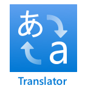
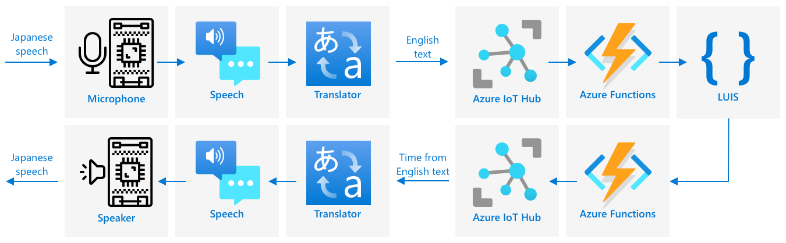

# Support multiple languages

This video gives an overview of the Azure speech services, covering speech to text and text to speech from earlier lessons, as well as translating speech, a topic covered in this lesson:

[](https://www.youtube.com/watch?v=h6xbpMPSGEA)

> 🎥 Click the image above to watch the video

## Pre-lecture quiz

[Pre-lecture quiz](https://brave-island-0b7c7f50f.azurestaticapps.net/quiz/47)

## Introduction

In the last 3 lessons you learned about converting speech to text, language understanding, and converting text to speech, all powered by AI. One other area of human communication that AI can help with is language translation - converting from one language to another, such as from English to French.

In this lesson you will learn about using AI to translate text, allowing your smart timer to interact with users in multiple languages.

In this lesson we'll cover:

* [Translate text](#translate-text)
* [Translation services](#translation-services)
* [Create a translator resource](#create-a-translator-resource)
* [Support multiple languages in applications with translations](#support-multiple-languages-in-applications-with-translations)
* [Translate text using an AI service](#translate-text-using-an-ai-service)

> 🗑 This is the last lesson in this project, so after completing this lesson and the assignment, don't forget to clean up your cloud services. You will need the services to complete the assignment, so make sure to complete that first.
>
> Refer to [the clean up your project guide](../../../clean-up.md) if necessary for instructions on how to do this.

## Translate text

Text translation has been a computer science problem that has been researched for over 70 years, and only now thanks to advances in AI and computer power is close to being solved to a point where it is almost as good as human translators.

> 💁 The origins can be traced back even further, to [Al-Kindi](https://wikipedia.org/wiki/Al-Kindi), a 9th century Arabic cryptographer who developed techniques for language translation

### Machine translations

Text translation started out as a technology known as Machine Translation (MT), that can translate between different language pairs. MT works by substituting words in one language with another, adding techniques to select the correct ways of translating phrases or parts of sentences when a simple word-for-word translation doesn't make sense.

> 🎓 When translators support translating between one language and another, these are know as *language pairs*. Different tools support different language pairs, and these may not be complete. For example, a translator may support English to Spanish as a language pair, and Spanish to Italian as a language pair, but not English to Italian.

For example, translating "Hello world" from English into French can be performed with a substitution - "Bonjour" for "Hello", and "le monde" for "world", leading to the correct translation of "Bonjour le monde".

Substitutions don't work when different languages use different ways of saying the same thing. For example, the English sentence "My name is Jim", translates into "Je m'appelle Jim" in French - literally "I call myself Jim". "Je" is French for "I", "moi" is me, but is concatenated with the verb as it starts with a vowel, so becomes "m'", "appelle" is to call, and "Jim" isn't translated as it's a name, and not a word that can be translated. Word ordering also becomes an issue - a simple substitution of "Je m'appelle Jim" becomes "I myself call Jim", with a different word order to English.

> 💁 Some words are never translated - my name is Jim regardless of which language is used to introduce me. When translating to languages that use different alphabets, or use different letters for different sounds, then words can be *transliterated*, that is selecting letters or characters that give the appropriate sound to sound the same as the given word.

Idioms are also a problem for translation. These are phrases that have an understood meaning that is different from a direct interpretation of the words. For example, in English the idiom "I've got ants in my pants" does not literally refer to having ants in your clothing, but to being restless. If you translated this to German, you would end up confusing the listener, as the German version is "I have bumble bees in the bottom".

> 💁 Different locales add different complexities. With the idiom "ants in your pants", in American English "pants" refers to outerwear, in British English, "pants" is underwear.

✅ If you speak multiple languages, think of some phrases that don't directly translate

Machine translation systems rely on large databases of rules that describe how to translate certain phrases and idioms, along with statistical methods to pick the appropriate translations from possible options. These statistical methods use huge databases of works translated by humans into multiple languages to pick the most likely translation, a technique called *statistical machine translation*. A number of these use intermediate representations of the language, allowing one language to be translated to the intermediate, then from the intermediate to another language. This way adding more languages involves translations to and from the intermediate, not to and from all other languages.

### Neural translations

Neural translations involve using the power of AI to translate, typically translating entire sentences using one model. These models are trained on huge data sets that have been human translated, such as web pages, books and United Nations documentation.

Neural translation models are usually smaller than machine translation models due to not needing huge databases of phrases and idioms. Modern AI services that provide translations often mix multiple techniques, mixing statistical machine translation and neural translation

There is no 1:1 translation for any language pair. Different translation models will produce slightly different results depending on the data used to train the model. Translations are not always symmetrical - in that if you translate a sentence from one language to another, then back to the first language you may see a slightly different sentence as the result.

✅ Try out different online translators such as [Bing Translate](https://www.bing.com/translator), [Google Translate](https://translate.google.com), or the Apple translate app. Compare the translated versions of a few sentences. Also try translating in one, then translating back in another.

## Translation services

There are a number of AI services that can be used from your applications to translate speech and text.

### Cognitive services Speech service


The speech service you've been using over the past few lessons has translation capabilities for speech recognition. When you recognize speech, you can request not only the text of the speech in the same language, but also in other languages.

> 💁 This is only available from the speech SDK, the REST API doesn't have translations built in.

### Cognitive services Translator service



The Translator service is a dedicated translation service that can translate text from one language, to one or more target languages. As well as translating, it supports a wide range of extra features including masking profanity. It also allows you to provide a specific translation for a particular word or sentence, to work with terms you don't want translated, or have a specific well-known translation.

For example, when translating the sentence "I have a Raspberry Pi", referring to the single-board computer, into another language such as French, you would want to keep the name "Raspberry Pi" as is, and not translate it, giving "J’ai un Raspberry Pi" instead of "J’ai une pi aux framboises".

## Create a translator resource

For this lesson you will need a Translator resource. You will use the REST API to translate text.

### Task - create a translator resource

1. From your terminal or command prompt, run the following command to create a translator resource in your `smart-timer` resource group.

    ```sh
    az cognitiveservices account create --name smart-timer-translator \
                                        --resource-group smart-timer \
                                        --kind TextTranslation \
                                        --sku F0 \
                                        --yes \
                                        --location <location>
    ```

    Replace `<location>` with the location you used when creating the Resource Group.

1. Get the key for the translator service:

    ```sh
    az cognitiveservices account keys list --name smart-timer-translator \
                                           --resource-group smart-timer \
                                           --output table
    ```

    Take a copy of one of the keys.

## Support multiple languages in applications with translations

In an ideal world, your whole application should understand as many different languages as possible, from listening for speech, to language understanding, to responding with speech. This is a lot of work, so translation services can speed up the time to delivery of your application.



Imagine you are building a smart timer that uses English end-to-end, understanding spoken English and converting that to text, running the language understanding in English, building up responses in English and replying with English speech. If you wanted to add support for Japanese, you could start with translating spoken Japanese to English text, then keep the core of the application the same, then translate the response text to Japanese before speaking the response. This would allow you to quickly add Japanese support, and you can expand to providing full end-to-end Japanese support later.

> 💁 The downside to relying on machine translation is that different languages and cultures have different ways of saying the same things, so the translation may not match the expression you are expecting.

Machine translations also open up possibilities for apps and devices that can translate user-created content as it is created. Science fiction regularly features 'universal translators', devices that can translate from alien languages into (typically) American English. These devices are less science fiction, more science fact, if you ignore the alien part. There are already apps and devices that provide real-time translation of speech and written text, using combinations of speech and translation services.

One example is the [Microsoft Translator](https://www.microsoft.com/translator/apps/?WT.mc_id=academic-17441-jabenn) mobile phone app, demonstrated in this video:

[](https://www.youtube.com/watch?v=16yAGeP2FuM)

> 🎥 Click the image above to watch the video

Imagine having such a device available to you, especially when travelling or interacting with folks whose language you don't know. Having automatic translation devices in airports or hospitals would provide much needed accessibility improvements.

✅ Do some research: Are there any translation IoT devices commercially available? What about translation capabilities built into smart devices?

> 👽 Although there are no true universal translators that allow us to talk to aliens, the [Microsoft translator does support Klingon](https://www.microsoft.com/translator/blog/2013/05/14/announcing-klingon-for-bing-translator/?WT.mc_id=academic-17441-jabenn). Qapla’!

## Translate text using an AI service

You can use an AI service to add this translation capability to your smart timer.

### Task - translate text using an AI service

Work through the relevant guide to convert translate text on your IoT device:

* [Arduino - Wio Terminal](wio-terminal-translate-speech.md)
* [Single-board computer - Raspberry Pi](pi-translate-speech.md)
* [Single-board computer - Virtual device](virtual-device-translate-speech.md)

---

## 🚀 Challenge

How can machine translations benefit other IoT applications beyond smart devices? Think of different ways translations can help, not just with spoken words but with text.

## Post-lecture quiz

[Post-lecture quiz](https://brave-island-0b7c7f50f.azurestaticapps.net/quiz/48)

## Review & Self Study

* Read more on machine translation on the [Machine translation page on Wikipedia](https://wikipedia.org/wiki/Machine_translation)
* Read more on neural machine translation on the [Neural machine translation page on Wikipedia](https://wikipedia.org/wiki/Neural_machine_translation)
* Check out the list of supported languages for the Microsoft speech services in the [Language and voice support for the Speech service documentation on Microsoft Docs](https://docs.microsoft.com/azure/cognitive-services/speech-service/language-support?WT.mc_id=academic-17441-jabenn)

## Assignment

[Build a universal translator](assignment.md)
