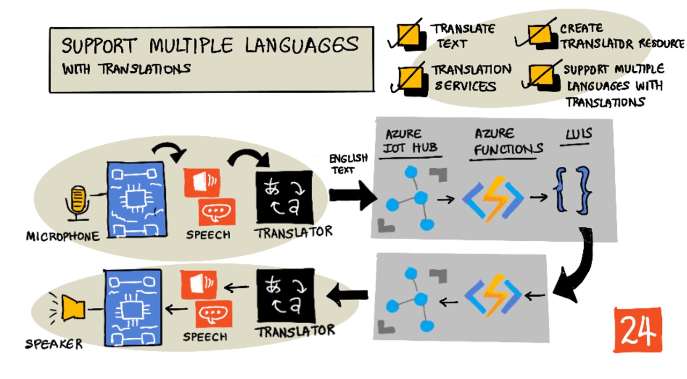

# 다양한 언어 지원



> [Nitya Narasimhan](https://github.com/nitya)의 스케치 노트. 더 큰 이미지를 보려면 클릭하세요.

이 비디오는 Azure 음성 서비스에 대한 개요를 제공합니다. 이전 단원의 음성 번역 뿐만 아니라, 음성에서 텍스트, 텍스트에서 음성을 변환하는 내용과 이번 수업에서 다를 주제를 포함하고 있습니다.

[](https://www.youtube.com/watch?v=h6xbpMPSGEA)

> 🎥 위 이미지를 클릭하면 영상을 볼 수 있습니다.

## 강의 전 퀴즈

[강의 전 퀴즈](https://black-meadow-040d15503.1.azurestaticapps.net/quiz/47)

## 개요

지난 3개의 강의에서 음성을 텍스트로 변환하고, 언어를 이해하고, 텍스트를 음성으로 변환하는 방법에 대해 배웠습니다. 이 모든 것이 AI 기반입니다. AI 가 도울 수 있는 인간 의사소통의 또 다른 영역은 언어 번역입니다. - 영어에서 프랑스어처럼, 한 언어에서 다른 언어로 변환하는 것입니다.

이번 수업에서는 AI를 사용하여 텍스트를 번역하여, 스마트 타이머가 여러 언어로 사용자와 상호 작용하는 방법을 배웁니다.

이 강의에서 다룰 내용용은 다음과 같습니다:

- [텍스트 번역](#translate-text)
- [번역 서비스](#translation-services)
- [번역가 리소스 만들기](#create-a-translator-resource)
- [번역을 통해 어플리케이션에서 여러 언어 지원하기](#support-multiple-languages-in-applications-with-translations)
- [AI 서비스를 사용하여 텍스트 번역하기](#translate-text-using-an-ai-service)

> 🗑 이것은 이 프로젝트의 마지막 강의이므로, 강의와 과제를 완료한 후, 클라우드 서비스를 종료하는 것을 잊지 마십시오. 과제를 완료하려면 서비스가 필요하므로, 과제를 먼저 완료해야 합니다.
>
> 이 작업을 수행하는 방법에 대한 지침이 필요한 경우 [프로젝트 종료 가이드](../../../../clean-up.md) 를 참조 하세요.

## 텍스트 번역

텍스트 번역은 70년 넘게 연구되어 온 컴퓨터 과학의 문제였는데, 이제서야 인공지능과 컴퓨터의 발전 덕분에 인간 번역가와 맞먹는 수준에 이르렀습니다.

> 💁 그 기원을 따라가보면, 언어 번역 기술을 개발한 9세기 아랍 암호학자인 [Al-Kindi](https://wikipedia.org/wiki/Al-Kindi)까지 거슬러 올라갈 수 있습니다.

### 기계 번역

텍스트 번역은 서로 다른 언어 쌍 간에 번역할 수 있는 기계번역(MT)로 알려진 기술로 시작되었습니다. MT는 한 언어의 단어를 다른 언어로 대체하고, 단어 대 단어 번역이 이해되지 않을 때, 구 또는 문장의 일부를 번역해 올바른 방법을 선택하는 기술이 추가되어 작동합니다.

> 🎓 번역가가 한 언어와 다른 언어 간의 번역을 지원하는 경우, 이를 *언어 쌍*이라고 합니다. 다른 도구는 다른 언어 쌍을 지원하며, 완전하지 않을 수 있습니다. 예를 들어, 번역가가 언어 쌍으로 영어에서 스페인어를 지원하고, 언어 쌍으로 스페인어에서 이탈리아어를 지원할 수 있지만, 영어에서 이탈리아어는 지원하지 않을 수 있습니다.

예를 들어, "Hello world"를 영어에서 프랑스어로 번역하는 것은 "Hello"를 "Bonjour"로, "world"를 "le monde"로 대체하는 것으로 수행되며, 이는 "Bonjour le monde"의 올바른 번역으로 이어집니다.

다른 언어가 동음이의어를 사용하는 경우 대체가 작동하지 않습니다. 예를 들어, 영어 문장인 "My name is Jim"은, 프랑스어로 "Je m'appelle Jim" 으로 번역됩니다. 문자 그대로 "I call myself Jim"이라는 의미입니다. 프랑스어로 "Je" 는 "I", "moi" 는 "me"를 의미하지만, 모음으로 시작하는 동사와 연결될 경우, "m'"가 됩니다. "appelle" 은 "call"을 의미하고, "Jim" 은 이름으로 번역되지 않습니다. 단어의 순서도 문제가 됩니다. "Je m'appelle Jim"를 단순히 대체하면, 영어와 다른 단어 순서로 "I myself call Jim"이 됩니다.

> 💁 어떤 단어는 번역되지 않습니다. 저를 소개하는데 어떤 언어를 사용하는지에 관계없이 제 이름은 Jim 입니다. 다른 알파벳을 사용하거나 다른 소리에 대해 다른 글자를 사용하는 언어의 경우, 단어는 _음역_ 될 수 있습니다. 이는 동일한 단어에 대해 적절한 소리를 내는 글자를 선택하는 것입니다.

관용구도 번역의 문제입니다. 이는 단어의 직역과 다른 의미를 가진 구입니다. 예를 들어, 영어 관용구 "I've got ants in my pants" 는 문자 그대로 당신의 옷에 개미가 있다는 것이 아니라, 안절부절 못하는 것을 의미합니다. 이를 독일어로 번역하면 "내 아래에 땅벌을 가지고 있다" 가 되어, 듣는 사람을 혼란스럽게 만들 것입니다.

> 💁 다른 지역성도 다른 복잡성을 추가합니다. 관용구 "ants in your pants"는, 미국 영어로 "pants" 는 겉옷을, 영국 영어로 "pants" 는 속옷을 의미합니다.

✅ 여러 언어를 사용하는 경우, 직역되지 않는 구문을 생각해 보세요.

기계 번역 시스템은 통계적 방법과 가능한 옵션에서 적절한 번역을 선택하기 위한 특정 구문과 관용구를 방법을 설명하는 대규모 규칙 데이터베이스에 의존합니다. 이러한 통계적 방법은 인간이 여러 언어로 번역한 거대한 데이터베이스를 사용하여 가장 가능성이 높은 번역을 선택하는 _통계적 기계 번역_ 이라는 기술 입니다. 이들 중 다수는 언어의 중간 표현을 사용하여, 한 언어를 중간 언어로 번역한 다음 중간 언어에서 다른 언어로 번역할 수 있습니다. 이 방법으로 더 많은 언어를 추가하려면 다른 모든 언어가 아닌 중간 언어로의 번역이 필요합니다.

### 신경망 번역

신경망 번역에는 AI를 사용하는 번역이 포함되며, 일반적으로 하나의 모델을 사용하여 전체 문장을 번역합니다. 이러한 모델은 웹 페이지, 책과 국제 문서와 같이 사람이 번역한 거대한 데이터 셋에 대해 훈련됩니다.

신경망 번역 모델은 구와 관용어의 거대한 데이터베이스가 필요하지 않기 때문에 일반적으로 기계 번역 모델보다 작습니다. 현대 AI 서비스는 통계적 기계 번역과 신경망 번역을 혼합한 여러 기술을 혼합한 번역을 제공합니다.

모든 언어 쌍에 대한 1:1 번역은 없습니다. 다른 번역 모델은, 모델 훈련 시 사용된 언어에 따라 아주 작은 차이의 결과를 생성합니다. 번역이 항상 대칭적인 것은 아닙니다. 한 언어에서 다른 언어로 문장을 번역 한 다음, 다시 처음 언어로 번역하면 결과적으로 약간 다른 문장이 나타날 있습니다.

✅ Apple 번역 앱이나 [Bing Translate](https://www.bing.com/translator), [Google Translate](https://translate.google.com)과 같은 다른 온라인 번역기를 사용해보세요. 몇 문장의 번역된 버전을 비교해보세요. 또한 번역한 것을 다시 번역해보세요.

## 번역 서비스

애플리케이션에서 음성 및 텍스트를 번역하는 데 사용할 수 있는 여러 AI 서비스가 있습니다.

### 인지 서비스 음성 서비스


지난 수업에서 사용한 음성 서비스에는 음성 인식을 위한 번역 기능이 있습니다. 음성을 인식하면, 음성에 대한 텍스트 뿐만 아니라 다른 언어의 텍스트를 요청할 수 있습니다.

> 💁 이것은 음성 SDK에서만 사용할 수 있으며, REST API에는 번역이 내장되어 있지 않습니다.

### 인지 서비스 번역 서비스


번역 서비스는 한 언어에서 하나 이상의 언어의 텍스트로 번역할 수 있는 전용 번역 서비스 입니다. 번역 뿐만 아니라 욕설을 포함한 다양한 추가 기능을 지원합니다. 또한 번역을 원하지 않는 용어나 잘 알려진 특정한 번역 같이, 특정 단어나 문장에 대해 특정 번역을 제공합니다.

예를 들어, "I have a Raspberry Pi"라는 문장을 프랑스어와 같이 다른 언어로 번역할 때, 싱글 보드 컴퓨터를 가리키는 "Raspberry Pi"라는 이름 그대로 유지하고 싶을 것입니다. 그 결과 "J’ai une pi aux framboises" 대신 "J’ai un Raspberry Pi"를 얻게 됩니다.

## 번역가 리소스 만들기

이 강의에서는 번역가 리소스가 필요합니다. REST API를 사용해 텍스트를 번역합니다.

### 작업 - 번역가 리소스 만들기

1. 터미널 또는 명령 프롬프트에서 다음 명령을 실행하여 `smart-timer` 리소스 그룹에 변환기 리소스를 만듭니다.

   ```sh
   az cognitiveservices account create --name smart-timer-translator \
                                       --resource-group smart-timer \
                                       --kind TextTranslation \
                                       --sku F0 \
                                       --yes \
                                       --location <location>
   ```

   `<location>` 을 리소스 그룹을 생성할 때 사용한 위치로 바꿉니다.

2. 번역 서비스 key 가져오기:

   ```sh
   az cognitiveservices account keys list --name smart-timer-translator \
                                          --resource-group smart-timer \
                                          --output table
   ```

   key 중 하나를 복사하십시오.

## 애플리케이션의 번역에 여러 언어 지원하기

이상적인 세계에서, 전체 응용 프로그램은 음성 듣기, 음성 이해, 음성 응답에 이르기까지 가능한 많은 다른 언어를 이해해야 합니다. 이것은 많은 작업이므로, 번역 서비스를 사용하면 응용 프로그램에 제공되는 시간을 단축할 수 있습니다.


스마트 타이머를 구축한다고 생각해보십시오. 이는 전체 영어를 사용하고, 구어체 영어를 이해하여 텍스트로 변환하고, 영어로 언어 이해를 실행하고, 응답을 영어로 구축해 영어로 응답합니다. 일본어에 대한 지원을 추가하려는 경우, 일본어 음성을 영어 텍스트로 번역하는 것을 시작으로, 응용 프로그램의 핵심을 동일하게 적용합니다. 그런 다음, 응답을 말하기 전에 텍스트로 번역합니다.이렇게 하면 일본어 지원을 빠르게 추가할 수 있으며, 나중에 전체 일본어 지원을 제공하도록 확장할 수 있습니다.

> 💁 기계 번역에 의존하는 것의 단점은 언어와 문화에 따라 같은 것이라도 말하는 방식이 때문에, 번역이 예상한 표현과 일치하지 않을 수 있다는 것입니다.

또한 기계 번역은 사용자가 만든 콘텐츠를 생성할 때 번역할 수 있는 앱과 장치에 대한 가능성을 열어줍니다. 공상 과학 소설에는 주로 외계인 언어를 (일반적으로) 미국 영어로 번역할 수 있는 '범용 번역기'가 등장합니다. 이 장치는 외계인이라는 부분을 무시한다면 공상 과학이 아니라 과학 사실에 가깝습니다. 음성 및 번역 서비스의 조합을 사용하여 음성 및 서면 텍스트의 실시간 번역을 제공하는 앱과 장치가 이미 존재합니다.

이 비디오에서 시연되는 한가지 예로 [Microsoft 번역기](https://www.microsoft.com/translator/apps/?WT.mc_id=academic-17441-jabenn) 휴대폰 앱이 있습니다:

[](https://www.youtube.com/watch?v=16yAGeP2FuM)

> 🎥 위 이미지를 클릭하면 영상을 볼 수 있습니다.

특히 여행을 가거나 당신이 모르는 언어를 사용하는 사람들과 교류할 때, 그러한 장치를 사용할 수 있다고 상상해 보십시오. 공항이나 병원에 자동 번역 장치가 있다면 접근성이 크게 향상될 것입니다.

✅ 조사해보세요: 상업적으로 사용 가능한 번역 IoT 장치가 있습니까? 스마트 기기에 내장된 번역 기능은 어떻습니까?

> 👽 외계인과 대화할 수 있는 진정한 범용 번역기는 없지만 [Microsoft 번역기는 Klingon를 지원합니다.](https://www.microsoft.com/translator/blog/2013/05/14/announcing-klingon-for-bing-translator/?WT.mc_id=academic-17441-jabenn). Qapla’!

## AI 서비스를 사용해 텍스트 번역하기

AI 서비스를 사용하여 이 번역 기능을 스마트 타이머에 추가할 수 있습니다.

### 작업 - AI 서비스를 사용해 텍스트 번역하기

관련 가이드를 통해 IoT 장치에서 번역 텍스트를 변환합니다:

- [Arduino - Wio Terminal](../wio-terminal-translate-speech.md)
- [싱글 보드 컴퓨터 - Raspberry Pi](pi-translate-speech.ko.md)
- [싱글 보드 컴퓨터](../virtual-device-translate-speech.md)

---

## 🚀 도전

기계 번역이 스마트 기기 이외의 다른 IoT 애플리케이션에 어떤 이점을 제공할 수 있습니까? 말 뿐만 아니라 텍스트로도 번역이 도움이 될 수 있는 다양한 방법을 생각해 보십시오.

## 강의 후 퀴즈

[강의 후 퀴즈](https://black-meadow-040d15503.1.azurestaticapps.net/quiz/48)

## 복습 및 독학

- [Wikipedia의 기계 번역 페이지](https://wikipedia.org/wiki/Machine_translation)에서 기계 번역에 대해 자세히 알아보세요.
- [Wikipedia의 신경망 기계 번역](https://wikipedia.org/wiki/Neural_machine_translation)에서 신경망 기계 번역에 대해 자세히 알아보세요.
- [Microsoft Docs의 음성 서비스 문서에 대한 언어 및 음성 지원](https://docs.microsoft.com/azure/cognitive-services/speech-service/language-support?WT.mc_id=academic-17441-jabenn)에서 Microsoft 음성 서비스에 대해 지원되는 언어 목록을 확인하세요.

## 과제

[범용 번역기 구축하기](../assignment.md)
