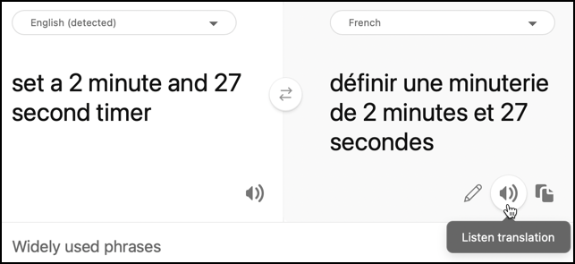

# Translate speech - Wio Terminal

In this part of the lesson, you will write code to translate text using the translator service.

## Convert text to speech using the translator service

The speech service REST API doesn't support direct translations, instead you can use the Translator service to translate the text generated by the speech to text service, and the text of the spoken response. This service has a REST API you can use to translate the text, but to make it easier to use this will be wrapped in another HTTP trigger in your functions app.

### Task - create a serverless function to translate text

1. Open your `smart-timer-trigger` project in VS Code, and open the terminal ensuring the virtual environment is activated. If not, kill and re-create the terminal.

1. Open the `local.settings.json` file and add settings for the translator API key and location:

    ```json
    "TRANSLATOR_KEY": "<key>",
    "TRANSLATOR_LOCATION": "<location>"
    ```

    Replace `<key>` with the API key for your translator service resource. Replace `<location>` with the location you used when you created the translator service resource.

1. Add a new HTTP trigger to this app called `translate-text` using the following command from inside the VS Code terminal in the root folder of the functions app project:

    ```sh
    func new --name translate-text --template "HTTP trigger"
    ```

    This will create an HTTP trigger called `translate-text`.

1. Replace the contents of the `__init__.py` file in the `translate-text` folder with the following:

    ```python
    import logging
    import os
    import requests
    
    import azure.functions as func
    
    location = os.environ['TRANSLATOR_LOCATION']
    translator_key = os.environ['TRANSLATOR_KEY']
    
    def main(req: func.HttpRequest) -> func.HttpResponse:
        req_body = req.get_json()
        from_language = req_body['from_language']
        to_language = req_body['to_language']
        text = req_body['text']
        
        logging.info(f'Translating {text} from {from_language} to {to_language}')
    
        url = f'https://api.cognitive.microsofttranslator.com/translate?api-version=3.0'
    
        headers = {
            'Ocp-Apim-Subscription-Key': translator_key,
            'Ocp-Apim-Subscription-Region': location,
            'Content-type': 'application/json'
        }
    
        params = {
            'from': from_language,
            'to': to_language
        }
    
        body = [{
            'text' : text
        }]
        
        response = requests.post(url, headers=headers, params=params, json=body)
        return func.HttpResponse(response.json()[0]['translations'][0]['text'])
    ```

    This code extracts the text and the languages from the HTTP request. It then makes a request to the translator REST API, passing the languages as parameters for the URL and the text to translate as the body. Finally, the translation is returned.

1. Run your function app locally. You can then call this using a tool like curl in the same way that you tested your `text-to-timer` HTTP trigger. Make sure to pass the text to translate and the languages as a JSON body:

    ```json
    {
        "text": "Définir une minuterie de 30 secondes",
        "from_language": "fr-FR",
        "to_language": "en-US"
    }
    ```

    This example translates *Définir une minuterie de 30 secondes* from French to US English. It will return *Set a 30-second timer*.

> 💁 You can find this code in the [code/functions](code/functions) folder.

### Task - use the translator function to translate text

1. Open the `smart-timer` project in VS Code if it is not already open.

1. Your smart timer will have 2 languages set - the language of the server that was used to train LUIS (the same language is also used to build the messages to speak to the user), and the language spoken by the user. Update the `LANGUAGE` constant in the `config.h` header file to be the language that will be spoken by the user, and add a new constant called `SERVER_LANGUAGE` for the language used to train LUIS:

    ```cpp
    const char *LANGUAGE = "<user language>";
    const char *SERVER_LANGUAGE = "<server language>";
    ```

    Replace `<user language>` with the locale name for language you will be speaking in, for example `fr-FR` for French, or `zn-HK` for Cantonese.

    Replace `<server language>` with the locale name for language used to train LUIS.

    You can find a list of the supported languages and their locale names in the [Language and voice support documentation on Microsoft docs](https://docs.microsoft.com/azure/cognitive-services/speech-service/language-support?WT.mc_id=academic-17441-jabenn#speech-to-text).

    > 💁 If you don't speak multiple languages you can use a service like [Bing Translate](https://www.bing.com/translator) or [Google Translate](https://translate.google.com) to translate from your preferred language to a language of your choice. These services can then play audio of the translated text.
    >
    > For example, if you train LUIS in English, but want to use French as the user language, you can translate sentences like "set a 2 minute and 27 second timer" from English into French using Bing Translate, then use the **Listen translation** button to speak the translation into your microphone.
    >
    > 

1. Add the translator API key and location below the `SPEECH_LOCATION`:

    ```cpp
    const char *TRANSLATOR_API_KEY = "<KEY>";
    const char *TRANSLATOR_LOCATION = "<LOCATION>";
    ```

    Replace `<KEY>` with the API key for your translator service resource. Replace `<LOCATION>` with the location you used when you created the translator service resource.

1. Add the translator trigger URL below the `VOICE_URL`:

    ```cpp
    const char *TRANSLATE_FUNCTION_URL = "<URL>";
    ```

    Replace `<URL>` with the URL for the `translate-text` HTTP trigger on your function app. This will be the same as the value for `TEXT_TO_TIMER_FUNCTION_URL`, except with a function name of `translate-text` instead of `text-to-timer`.

1. Add a new file to the `src` folder called `text_translator.h`.

1. This new `text_translator.h` header file will contain a class to translate text. Add the following to this file to declare this class:

    ```cpp
    #pragma once
    
    #include <Arduino.h>
    #include <ArduinoJson.h>
    #include <HTTPClient.h>
    #include <WiFiClient.h>
    
    #include "config.h"
    
    class TextTranslator
    {
    public:   
    private:
        WiFiClient _client;
    };
    
    TextTranslator textTranslator;
    ```

    This declares the `TextTranslator` class, along with an instance of this class. The class has a single field for the WiFi client.

1. To the `public` section of this class, add a method to translate text:

    ```cpp
    String translateText(String text, String from_language, String to_language)
    {
    }
    ```

    This method takes the language to translate from, and the language to translate to. When handling speech, the speech will be translated from the user language to the LUIS server language, and when giving responses it will translate from the LUIS server language to the users language.

1. In this method, add code to construct a JSON body containing the text to translate and the languages:

    ```cpp
    DynamicJsonDocument doc(1024);
    doc["text"] = text;
    doc["from_language"] = from_language;
    doc["to_language"] = to_language;

    String body;
    serializeJson(doc, body);

    Serial.print("Translating ");
    Serial.print(text);
    Serial.print(" from ");
    Serial.print(from_language);
    Serial.print(" to ");
    Serial.print(to_language);
    ```

1. Below this, add the following code to send the body to the serverless function app:

    ```cpp
    HTTPClient httpClient;
    httpClient.begin(_client, TRANSLATE_FUNCTION_URL);

    int httpResponseCode = httpClient.POST(body);
    ```

1. Next, add code to get the response:

    ```cpp
    String translated_text = "";

    if (httpResponseCode == 200)
    {
        translated_text = httpClient.getString();
        Serial.print("Translated: ");
        Serial.println(translated_text);
    }
    else
    {
        Serial.print("Failed to translate text - error ");
        Serial.println(httpResponseCode);
    }
    ```

1. Finally, add code to close the connection and return the translated text:

    ```cpp
    httpClient.end();

    return translated_text;
    ```

### Task - translate the recognized speech and the responses

1. Open the `main.cpp` file.

1. Add an include directive at the top of the file for the `TextTranslator` class header file:

    ```cpp
    #include "text_translator.h"
    ```

1. The text that is said when a timer is set or expires needs to be translated. To do this, add the following as the first line of the `say` function:

    ```cpp
    text = textTranslator.translateText(text, LANGUAGE, SERVER_LANGUAGE);
    ```

    This will translate the text to the users language.

1. In the `processAudio` function, text is retrieved from the captured audio with the `String text = speechToText.convertSpeechToText();` call. After this call, translate the text:

    ```cpp
    String text = speechToText.convertSpeechToText();
    text = textTranslator.translateText(text, LANGUAGE, SERVER_LANGUAGE);
    ```

    This will translate the text from the users language into the language used on the server.

1. Build this code, upload it to your Wio Terminal and test it out through the serial monitor. Once you see `Ready` in the serial monitor, press the C button (the one on the left-hand side, closest to the power switch), and speak. Ensure your function app is running, and request a timer in the user language, either by speaking that language yourself, or using a translation app.

    ```output
    Connecting to WiFi..
    Connected!
    Got access token.
    Ready.
    Starting recording...
    Finished recording
    Sending speech...
    Speech sent!
    {"RecognitionStatus":"Success","DisplayText":"Définir une minuterie de 2 minutes 27 secondes.","Offset":9600000,"Duration":40400000}
    Translating Définir une minuterie de 2 minutes 27 secondes. from fr-FR to en-US
    Translated: Set a timer of 2 minutes 27 seconds.
    Set a timer of 2 minutes 27 seconds.
    {"seconds": 147}
    Translating 2 minute 27 second timer started. from en-US to fr-FR
    Translated: 2 minute 27 seconde minute a commencé.
    2 minute 27 seconde minute a commencé.
    Translating Times up on your 2 minute 27 second timer. from en-US to fr-FR
    Translated: Chronométrant votre minuterie de 2 minutes 27 secondes.
    Chronométrant votre minuterie de 2 minutes 27 secondes.
    ```

> 💁 You can find this code in the [code/wio-terminal](code/wio-terminal) folder.

😀 Your multi-lingual timer program was a success!
