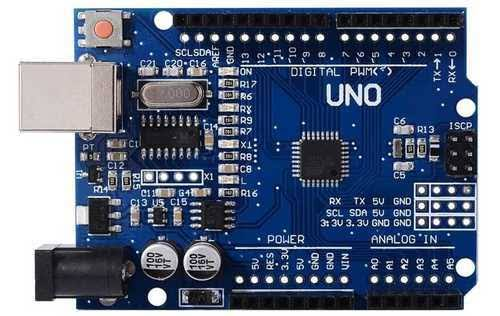
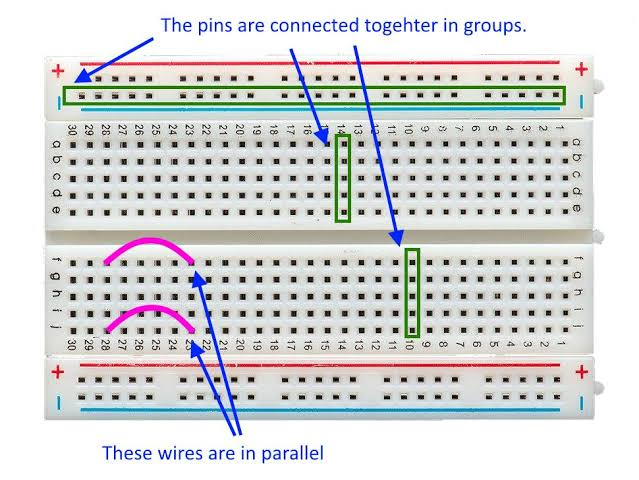
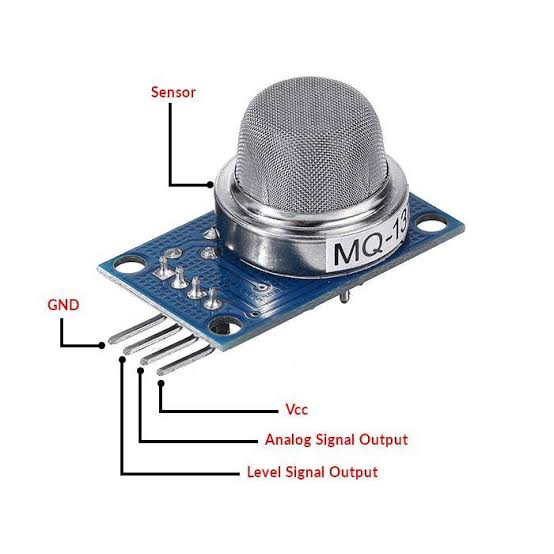

<span style="font-family:Papyrus;">

# **Smoke Detection**

This a beginner friendly IOT project.

## **Motive** 
To be able to detect smoke and notify the danger level using rgb lights.

## **Apparatus** 

*  |<span style = "font-size:18px">Arduino Uno| </span><sub> 1 pc  </sub>
   |----------- | --------  |
   | |

*  |<span style = "font-size:18px">BreadBoard| </span><sub> 1 pc  </sub>
   |----------- | -------|
   |  |

*  |<span style = "font-size:18px">Gas Sensor|  </span><sub> 1 pc  </sub>
   |-----------|---------|
   |   |

*  |<span style = "font-size:18px">Temperature Sensor | </span><sub> 1 pc  </sub>
   |-----------|--------------|
   ||

* <span style = "font-size:18px">Resistors  </span><sub> 6 pcs {1 - 4 Kohms and 5 - 330 ohms} </sub>

*  |<span style = "font-size:18px">LEDs| </span><sub>5 pcs</sub>
   |-----------|----------|
    |  Color   |    Qty.  |
    |   Red    |   1pc    |
    |   Blue   |   1pc    |
    |  Green   |   1pc    |
    |  Yellow  |   2pc    |

* <span style = "font-size:18px">TinkerCad </span>

    If you don't have hardware to perform this. 
    You can try this Web Application **[TinkerCad](https://www.tinkercad.com/)**

------

# Circuit Diagram

Make connections like below schematic.


Below code is simple to understand.

```cpp
    // C++ code
    //
    void setup()
    {
        // Setting Pins for their tasks i.e. inputs and outputs

        pinMode(A0, INPUT);
        pinMode(A5, INPUT);

        pinMode(6, OUTPUT);
        pinMode(5, OUTPUT);
        pinMode(4, OUTPUT);
        pinMode(3, OUTPUT);
        pinMode(2, OUTPUT);

        // Monitoring over data using Serial Monitor
        Serial.begin(9600);

    }

    void loop()
    {
        // reading Temperature and Gases input which are analog in nature
        // analogRead is used to read outputs of analog devices
        int temp = analogRead(A0);
        int gas = analogRead(A5);

        float t = -40 + (temp - 20) / 358.0 + 165;

        // Following if-else statements denote a certain threshold level
        // Above which a certain Diode is set to HIGH i.e. ON 

        //digitalWrite is used for setting Diode to HIGH or LOW

        if (gas > 280)
        {
            digitalWrite(6, HIGH);
        }
        if (gas > 300)
        {
            digitalWrite(5, HIGH);
        }
        if (gas > 400)
        {
            digitalWrite(4, HIGH);
            Serial.println(t); // This Statement reads the temperature and  
                               // prints on a single line of the Serial Monitor
        }
        if (gas > 550)
        {
            digitalWrite(3, HIGH);
            Serial.println(t);
        }
        if (gas > 650)
        {
            digitalWrite(2, HIGH);
            Serial.println(t);
        }
        
        // Delay puts a delay of 100 miliseconds on Serial Monitor output
        delay(100);

        //If the smoke is not detected the LEDs must be OFF i.e. LOW state
        digitalWrite(2, LOW);
        digitalWrite(3, LOW);
        digitalWrite(4, LOW);
        digitalWrite(5, LOW);
        digitalWrite(6, LOW);
    }

```


</span>