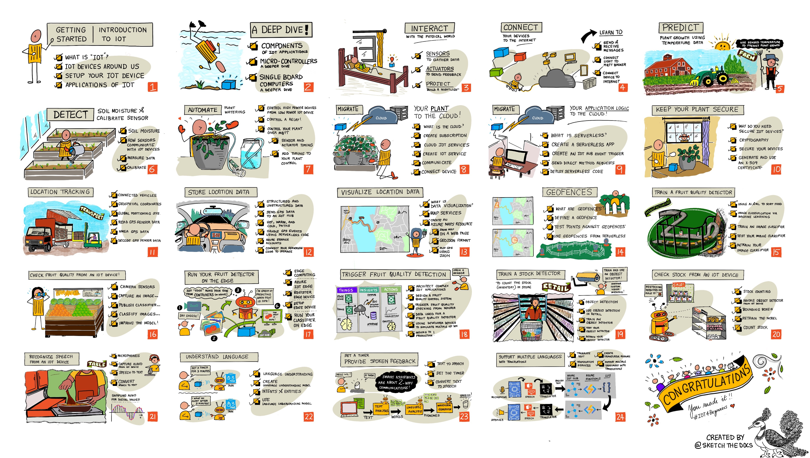

[](https://github.com/microsoft/IoT-For-Beginners/blob/master/LICENSE)
[](https://GitHub.com/microsoft/IoT-For-Beginners/graphs/contributors/)
[](https://GitHub.com/microsoft/IoT-For-Beginners/issues/)
[](https://GitHub.com/microsoft/IoT-For-Beginners/pulls/)
[](http://makeapullrequest.com)

[](https://GitHub.com/microsoft/IoT-For-Beginners/watchers/)
[](https://GitHub.com/microsoft/IoT-For-Beginners/network/)
[](https://GitHub.com/microsoft/IoT-For-Beginners/stargazers/)

[](README.bn.md)
[](README.zh-cn.md)
[](README.tr.md)
[](README.fr.md)
[](../README.md)
[](README.ja.md)

# IoT for Beginners - 커리큘럼

마이크로소프트의 Azure 클라우드 담당자들이 IoT 기본에 대한 12주 24시간 교육 과정을 제공하게 되어 기쁩니다. 각 수업에는 수업 전/후 퀴즈, 수업 완료를 위한 강의, 해결책, 과제 등이 포함됩니다. NAT의 프로젝트 기반 교육학을 통해 새로운 기술을 구축하는 동안 `익힐 수 있는` 검증된 방법을 학습할 수 있습니다.

그 프로젝트들은 농부의 농장에서 사용자의 식탁으로 까지의 음식의 여정을 다룹니다. 여기에는 농업, 물류, 제조, 소매 및 소비자 등 모든 IoT 장치에서 인기 있는 산업 분야가 포함됩니다.



> [Nitya Narasimhan](https://github.com/nitya)의 스케치 노트입니다. 클릭하여 사진을 크게 보세요

**저자 [Jen Fox](https://github.com/jenfoxbot), [Jen Looper](https://github.com/jlooper), [Jim Bennett](https://github.com/jimbobbennett)와 스케치노트를 그려 준 [Nitya Narasimhan](https://github.com/nitya)에게 감사를 보냅니다.**

**이 커리큘럼을 검토하고 번역해 주신 [Microsoft Learn Student Ambassadors](https://studentambassadors.microsoft.com?WT.mc_id=academic-17441-jabenn) 팀에게도 감사드립니다. - [Aditya Garg](https://github.com/AdityaGarg00), [Anurag Sharma](https://github.com/Anurag-0-1-A), [Arpita Das](https://github.com/Arpiiitaaa), [Aryan Jain](https://www.linkedin.com/in/aryan-jain-47a4a1145/), [Bhavesh Suneja](https://github.com/EliteWarrior315), [Faith Hunja](https://faithhunja.github.io/), [Lateefah Bello](https://www.linkedin.com/in/lateefah-bello/), [Manvi Jha](https://github.com/Severus-Matthew), [Mireille Tan](https://www.linkedin.com/in/mireille-tan-a4834819a/), [Mohammad Iftekher (Iftu) Ebne Jalal](https://github.com/Iftu119), [Mohammad Zulfikar](https://github.com/mohzulfikar), [Priyanshu Srivastav](https://www.linkedin.com/in/priyanshu-srivastav-b067241ba), [Thanmai Gowducheruvu](https://github.com/innovation-platform), [Zina Kamel](https://www.linkedin.com/in/zina-kamel/).**

팀을 만나보세요!


[](https://youtu.be/-wippUJRi5k)

**Gif by** [Mohit Jaisal](https://linkedin.com/in/mohitjaisal)

> 🎥 프로젝트에 대한 비디오를 보려면 위의 이미지를 클릭하세요!

> **선생님**, 본 교육과정의 사용법에 대해 [안내](../for-teachers.md) 드립니다. 귀하께서 직접 강의를 만들고 싶다면 [lesson template](../lesson-template/README.md)에 그에 대한 안내를 드립니다.

> [**학생분들**](https://aka.ms/student-page)은 본 교육과정을 스스로 사용하기 위해 레포 전체를 분기하여 미리 준비된 퀴즈부터 시작하여 강의를 읽고 나머지 활동을 완료합니다. 솔루션 코드를 복사하는 대신 해당 과정을 이해하여 프로젝트를 만드십시오. 그러나 해당 코드는 각 프로젝트 지향 과정의 /solutions 폴더에서 사용할 수 있습니다. 또 다른 아이디어는 친구들과 스터디 그룹을 구성해서 그 내용을 함께 검토하는 것입니다. 자세한 내용은[Microsoft Learn](https://docs.microsoft.com/users/jimbobbennett/collections/ke2ehd351jopwr?WT.mc_id=academic-17441-jabenn)에서 확인할 수 있습니다.

본 코스의 영상 개요는 다음 비디오를 참고하십시오.

[](https://youtube.com/watch?v=bccEMm8gRuc "Promo video")

> 🎥 프로젝트에 대한 비디오를 보려면 위의 이미지를 클릭하십시오!


## 교육학

우리는 이 커리큘럼을 구축하면서 두 가지 교육학적 원칙을 선택했습니다. 첫 번째는 프로젝트를 기반으로 한다는 것이고 두 번째는 자주 퀴즈를 포함하도록 하는 것입니다. 이 시리즈가 끝나면 학생들은 식물 모니터링 및 관수 시스템, 차량 추적, 음식을 추적하고 확인하는 스마트 공장 설정, 음성으로 제어되는 요리 타이머를 구축하게 됩니다. 또한 장치 코드를 작성하고, 클라우드에 연결하고, 원격 측정을 분석하고, AI를 edge에서 실행하는 방법을 포함해 사물 인터넷의 기초에 대해 배우게 됩니다.

내용과 프로젝트가 일치하도록 보장함으로써, 이 과정이 학생들에게 더 매력적으로 다가가며 개념을 더 잘 유지할 수 있을 것입니다.

또한 수업 전에 부담이 적은 퀴즈를 통해 학생이 주제를 학습하려는 의도를 설정하고 수업 후 두 번째 퀴즈를 통해 기억에 더 남도록 할 수 있습니다. 이 커리큘럼은 유연하고 재미있게 설계되었으며 전체 또는 부분적으로 수강할 수 있습니다. 프로젝트는 소규모로 시작하여 12주 주기가 끝날 때까지 점점 복잡해집니다.

각각의 프로젝트는 학생과 취미로 하는 사람들이 사용할 수 있는 실제 하드웨어롤 기반으로 합니다. 각 프로젝트는 특정 프로젝트 영역을 조사하여 관련된 배경 지식을 제공합니다. 성공적인 개발자가 되기 위해서는 해결해야 하는 문제의 도메인을 이해하는 것이 도움이 됩니다. 이러한 배경 지식을 제공하면 학생들이 IoT 개발자로서 해결하도록 요청받을 수 있는 실제 문제의 맥락에서 IoT 솔루션과 학습에 대해 생각할 수 있습니다. 학생들은 자신들이 구축하고 있는 솔루션의 '이유'에 대해 배우고 최종 사용자를 이해합니다.

## 하드웨어

개인 선호도, 프로그래밍 언어 지식 또는 선호도, 학습 목표 및 가용성에 따라 프로젝트에 사용할 두 가지 IoT 하드웨어 중에서 선택할 수 있습니다. 또한 하드웨어에 액세스할 수 없거나 구매하기 전에 자세히 알아보고 싶은 사용자를 위해 '가상 하드웨어' 버전을 제공했습니다. Seeed Studio에서 전체 키트를 구입할 수 있는 링크를 포함하여 [하드웨어 페이지](../hardware.md)에서 자세한 내용을 읽고 '쇼핑 목록'을 찾을 수 있습니다.

> 💁 우리의 [행동 강령](../CODE_OF_CONDUCT.md), [컨트리뷰팅](../CONTRIBUTING.md), and [번역](../TRANSLATIONS.md) 가이드 라인을 찾아보세요. 건설적인 피드백은 언제나 환영입니다!

## 각각의 레슨은 다음을 포함합니다:

- 스케치 노트
- 선택적인 보충 영상
- 강의 전 워밍업 퀴즈
- 필기 수업
- 프로젝트 기반 강의의 경우 프로젝트 빌드 방법에 대한 단계별 가이드
- 지식 확인
- 도전
- 보충 읽을거리
- 과제
- 강의 후 퀴즈

> **퀴즈에 대한 참고 사항**: 모든 퀴즈는 [이 앱](https://black-meadow-040d15503.1.azurestaticapps.net)에 포함되어 있으며 각 3개의 질문으로 구성된 총 48개의 퀴즈가 있습니다. 수업 내에서 연결되지만 퀴즈 앱은 로컬에서 실행할 수 있습니다. `quiz-app` 폴더의 지침을 따르세요. 점차 지역화하고 있습니다.

## 레슨

|     |                        프로젝트 이름                         |                  배운 개념                   | 학습 목표                                                                                                                           |                                                          연결된 수업                                                          |
| :-: | :----------------------------------------------------------: | :------------------------------------------: | ----------------------------------------------------------------------------------------------------------------------------------- | :---------------------------------------------------------------------------------------------------------------------------: |
| 01  |  [시작하기](./1-getting-started/translations/README.ko.md)   |               IoT에 대한 소개                | IoT의 기본 원리와 센서 및 클라우드 서비스와 같은 IoT의 구성 요소에 대해 배우고 첫 번째 IoT 장치를 설정합니다.                       |                [IoT에 대한 소개](./1-getting-started/lessons/1-introduction-to-iot/translations/README.ko.md)                 |
| 02  |         [시작하기](./1-getting-started/README.ko.md)         |             IoT에 대한 심층 분석             | IoT 시스템의 구성 요소와 마이크로컨트롤러 및 Single-board 컴퓨터에 대해 자세히 배웁니다.                                            |                  [IoT에 대한 심층 분석](./1-getting-started/lessons/2-deeper-dive/translations/README.ko.md)                  |
| 03  |  [시작하기](./1-getting-started/translations/README.ko.md)   | 센서 및 액추에이터로 물리적 세계와 상호 작용 | 야간 조명을 만드는 동안 물리적 세계에서 데이터를 수집하는 센서와 피드백을 보내는 액추에이터에 대해 배웁니다.                        | [센서 및 액추에이터로 물리적 세계와 상호 작용](./1-getting-started/lessons/3-sensors-and-actuators/translations/README.ko.md) |
| 04  |  [시작하기](./1-getting-started/translations/README.ko.md)   |           장치를 인터넷에 연결하기           | 야간 조명을 MQTT 브로커에 연결하여 IoT 장치를 인터넷에 연결하여 메시지를 보내고 받는 방법에 대해 배웁니다.                          |             [장치를 인터넷에 연결하기](./1-getting-started/lessons/4-connect-internet/translations/README.ko.md)              |
| 05  |          [농장](./2-farm/translations/README.ko.md)          |                식물 성장 예측                | IoT 장치에서 캡처한 온도 데이터를 사용하여 식물 성장을 예측하는 방법을 배웁니다.                                                    |                      [식물 성장 예측](./2-farm/lessons/1-predict-plant-growth/translations/README.ko.md)                      |
| 06  |          [농장](./2-farm/translations/README.ko.md)          |                토양 수분 측정                | 토양 수분을 측정하고 토양 수분 센서를 보정하는 방법을 배웁니다.                                                                     |                      [토양 수분 측정](./2-farm/lessons/2-detect-soil-moisture/translations/README.ko.md)                      |
| 07  |          [농장](./2-farm/translations/README.ko.md)          |              자동화된 식물 급수              | 릴레이 및 MQTT를 사용하여 자동화 및 시간 급수 방법에 대해 배웁니다.                                                                 |                  [자동화된 식물 급수](./2-farm/lessons/3-automated-plant-watering/translations/README.ko.md)                  |
| 08  |          [농장](./2-farm/translations/README.ko.md)          |          식물을 클라우드로 이동하기          | 클라우드 및 클라우드 호스팅 IoT 서비스에 대해 알아보고 식물을 공용 MQTT 브로커 대신 서비스 중 하나에 연결하는 방법에 대해 배웁니다. |          [식물을 클라우드로 이동하기](./2-farm/lessons/4-migrate-your-plant-to-the-cloud/translations/README.ko.md)           |
| 09  |          [농장](./2-farm/translations/README.ko.md)          |   어플리케이션 로직을 클라우드로 이동하기    | IoT 메시지에 응답하는 클라우드에서 애플리케이션 로직을 작성하는 방법에 대해 배웁니다.                                               |   [어플리케이션 로직을 클라우드로 이동하기](./2-farm/lessons/5-migrate-application-to-the-cloud/translations/README.ko.md)    |
| 10  |          [농장](./2-farm/translations/README.ko.md)          |           식물은 안전하게 유지하기           | IoT를 통한 보안과 키 및 인증서로 식물 보안을 유지하는 방법에 대해 배웁니다.                                                         |                [식물을 안전하게 유지하기](./2-farm/lessons/6-keep-your-plant-secure/translations/README.ko.md)                |
| 11  |               [수송](./3-transport/README.md)                |                  위치 추적                   | IoT 장치의 GPS 위치 추적에 대해 배웁니다.                                                                                           |                       [위치 추적](./3-transport/lessons/1-location-tracking/translations/README.ko.md)                        |
| 12  |       [수송](./3-transport/translations/README.ko.md)        |               위치 데이터 저장               | 나중에 시각화하거나 분석할 IoT 데이터를 저장하는 방법을 배웁니다.                                                                   |                   [위치 데이터 저장](./3-transport/lessons/2-store-location-data/translations/README.ko.md)                   |
| 13  |     [Transport](./3-transport/translations/README.ko.md)     |              위치 데이터 시각화              | 지도에서 위치 데이터를 시각화하는 방법과 지도가 실제 3D 세계를 2차원으로 표현하는 방법에 대해 배웁니다.                             |                [위치 데이터 시각화](./3-transport/lessons/3-visualize-location-data/translations/README.ko.md)                |
| 14  |       [수송](./3-transport/translations/README.ko.md)        |                   지오펜스                   | 지오펜스에 대해 알아보고 공급망의 차량이 목적지에 가까워졌을 때 경고하는 데 어떻게 사용할 수 있는지 알아봅니다.                     |                            [지오펜스](./3-transport/lessons/4-geofences/translations/README.ko.md)                            |
| 15  |     [조작](./4-manufacturing/translations/README.ko.md)      |             과일 품질 감지 훈련              | 과일 품질을 감지하기 위해 클라우드에서 이미지 분류기를 교육하는 방법을 배웁니다.                                                    |               [과일 품질 감지 훈련](./4-manufacturing/lessons/1-train-fruit-detector/translations/README.ko.md)               |
| 16  |     [조작](./4-manufacturing/translations/README.ko.md)      |         IoT 장치에서 과일 품질 확인          | IoT 장치에서 과일 품질 감지기를 사용하는 방법을 배웁니다. device                                                                    |         [IoT 장치에서 과일 품질 확인](./4-manufacturing/lessons/2-check-fruit-from-device/translations/README.ko.md)          |
| 17  |     [조작](./4-manufacturing/translations/README.ko.md)      |        edge에서 과일 탐지기 실행하기         | edge의 IoT 기기에서 과일 탐지기를 실행하는 방법을 배웁니다.                                                                         |        [edge에서 과일 탐지기 실행하기](./4-manufacturing/lessons/3-run-fruit-detector-edge/translations/README.ko.md)         |
| 18  | [Manufacturing](./4-manufacturing/translations/README.ko.md) |       센서에서 과일 품질 감지 작동하기       | 센서에서 과일 품질 감지 작동하는 방법을 배웁니다.                                                                                   |       [센서에서 과일 품질 감지 작동하기](./4-manufacturing/lessons/4-trigger-fruit-detector/translations/README.ko.md)        |
| 19  |         [소매](./5-retail/translations/README.ko.md)         |               재고 감지기 훈련               | 물체 감지를 사용하여 상점의 재고를 계산하도록 재고 감지기를 훈련시키는 방법을 배웁니다.                                             |                    [재고 감지기 훈련](./5-retail/lessons/1-train-stock-detector/translations/README.ko.md)                    |
| 20  |         [소매](./5-retail/translations/README.ko.md)         |          IoT 장치에서 재고 확인하기          | 객체 감지 모델을 사용하여 IoT 장치에서 재고를 확인하는 방법을 배웁니다.                                                             |                [IoT 장치에서 재고 확인하기](./5-retail/lessons/2-check-stock-device/translations/README.ko.md)                |
| 21  |       [소비자](./6-consumer/translations/README.ko.md)       |             IoT 장치로 음성 인식             | 스마트 타이머를 구축하기 위해 IoT 장치에서 음성을 인식하는 방법을 배웁니다.                                                         |                  [IoT 장치로 음성 인식](./6-consumer/lessons/1-speech-recognition/translations/README.ko.md)                  |
| 22  |       [소비자](./6-consumer/translations/README.ko.md)       |                  언어 이해                   | IoT 장치에 말한 문장을 이해하는 방법을 배웁니다.                                                                                    |                     [언어 이해](./6-consumer/lessons/2-language-understanding/translations/README.ko.md)                      |
| 23  |       [소비자](./6-consumer/translations/README.ko.md)       |       타이머 설정 및 음성 피드백 제공        | IoT 장치에서 타이머를 설정하고 타이머가 설정되고 종료될 때 음성 피드백을 제공하는 방법을 배웁니다.                                  |              [타이머 설정 및 음성 피드백 제공](./6-consumer/lessons/3-spoken-feedback/translations/README.ko.md)              |
| 24  |       [소비자](./6-consumer/translations/README.ko.md)       |                여러 언어 지원                | 음성 및 스마트 타이머의 응답에서 여러 언어를 지원하는 방법을 배웁니다.                                                              |                 [여러 언어 지원](./6-consumer/lessons/4-multiple-language-support/translations/README.ko.md)                  |

## Offline access

[Docsify](https://docsify.js.org/#/)를 사용하여 이 문서를 오프라인으로 실행할 수 있습니다. 로컬 시스템에서 [install Docsify](https://docsify.js.org/#/quickstart) 레포를 포크하고, 이 레포의 루트 폴더에 `docsify serve`를 입력합니다. 이 웹 사이트는 로컬 호스트인 `localhost:3000`에서 제공됩니다.

### PDF

필요한 경우 오프라인 액세스를 위해 이 컨텐츠의 PDF를 생성할 수 있습니다. 이 작업을 위해서  [npm installed](https://docs.npmjs.com/downloading-and-installing-node-js-and-npm)이 수행되어 있는지 확인하고 이 레포지토리의 루트 폴더에서 아래 명령을 실행하십시오:


```sh
npm i
npm run convert
```

### Slides

[slides](../slides)폴더에는 일부 레슨을 위한 슬라이드 데크가 있습니다.

## 도움이 필요하신가요?

번역에 기여하고 싶으시다면 [번역 지침](../TRANSLATIONS.md)를 읽고 [번역 issue 중 하나](https://github.com/microsoft/IoT-For-Beginners/issues?q=is%3Aissue+is%3Aopen+label%3Atranslation)에 추가하십시오. 만약 당신이 새로운 언어로 번역하고 싶다면, tracking을 위해 새로운 이슈를 제기해주세요.

## 기타 커리큘럼

우리 팀은 다른 커리큘럼을 생산합니다! 확인 해 보세요:

- [초보자를 위한 웹 개발](https://aka.ms/webdev-beginners)
- [초보자용 ML](https://aka.ms/ml-beginners)
- [초보자용 데이터 과학](https://aka.ms/datascience-beginners)
- [초보자용 AI](https://aka.ms/ai-beginners)

## 이미지 속성

본 교육과정에 사용된 이미지의 모든 속성은 [Attributions](./attributions.md)에서 확인할 수 있습니다.

