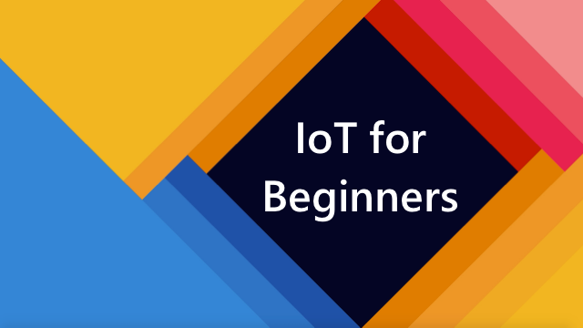

[](https://github.com/microsoft/IoT-For-Beginners/blob/master/LICENSE)
[](https://GitHub.com/microsoft/IoT-For-Beginners/graphs/contributors/)
[](https://GitHub.com/microsoft/IoT-For-Beginners/issues/)
[](https://GitHub.com/microsoft/IoT-For-Beginners/pulls/)
[](http://makeapullrequest.com)

[](https://GitHub.com/microsoft/IoT-For-Beginners/watchers/)
[](https://GitHub.com/microsoft/IoT-For-Beginners/network/)
[](https://GitHub.com/microsoft/IoT-For-Beginners/stargazers/)

[](README.bn.md)
[](../README.md)
[](README.zh-cn.md)
[](../translations/README.fr.md)
[](../translations/README.ja.md)

# Yeni Başlayanlar için IOT

Microsoft'tan Azure Cloud Advocates size IOT temelleri hakkında 12 haftalık 24 dersten oluşan programı zevkle sunar. Her ders ön-quiz, dersi tamamlamanız için talimatlar, bir çözüm, bir ödev ve ders sonrası quiz içerir. Proje tabanlı pedogojimiz öğrenirken bir şeyler oluşturmanıza izin verecek. Bu, ispanlanmıştır ki yeni becerileri adeta size "yapıştıracak".

Projeler, yemeğimizin çiftlikten sofralara olan yolculuğuyla ilgili. Buna; tarım, taşımacılık, işleme, satış, müşteriler gibi IOT cihazları için tüm popüler endüstri alanları dahildir.


> [Nitya Narasimhan](https://github.com/nitya) 'dan taslak notu. Daha büyük hali için resme tıklayın

**Yazarlarımıza en kalbi duygularla teşekkür ederiz [Jen Fox](https://github.com/jenfoxbot), [Jen Looper](https://github.com/jlooper), [Jim Bennett](https://github.com/jimbobbennett), ve taslak notu için [Nitya Narasimhan](https://github.com/nitya) 'a**

**[Microsoft Learn Student Ambassadors](https://studentambassadors.microsoft.com?WT.mc_id=academic-17441-jabenn) ekibimize de teşekkür edriz. Dersleri gözden geçirenler ve çeşitli dillere çevirenler - [Aditya Garg](https://github.com/AdityaGarg00), [Anurag Sharma](https://github.com/Anurag-0-1-A), [Arpita Das](https://github.com/Arpiiitaaa), [Aryan Jain](https://www.linkedin.com/in/aryan-jain-47a4a1145/), [Bhavesh Suneja](https://github.com/EliteWarrior315), [Faith Hunja](https://faithhunja.github.io/), [Lateefah Bello](https://www.linkedin.com/in/lateefah-bello/), [Manvi Jha](https://github.com/Severus-Matthew), [Mireille Tan](https://www.linkedin.com/in/mireille-tan-a4834819a/), [Mohammad Iftekher (Iftu) Ebne Jalal](https://github.com/Iftu119), [Mohammad Zulfikar](https://github.com/mohzulfikar), [Priyanshu Srivastav](https://www.linkedin.com/in/priyanshu-srivastav-b067241ba), [Thanmai Gowducheruvu](https://github.com/innovation-platform), and [Zina Kamel](https://www.linkedin.com/in/zina-kamel/).**

Takımla tnışın!

[](https://youtu.be/-wippUJRi5k)

> 🎥  Proje hakkındaki video için yukarıdaki resme tıklayın!

> **Öğretmenler**, için bu dersleri nasıl kullancaklarına dair [bazı öneriler](../for-teachers.md). Eğer kendi derslerinizi oluşturmak istiyorsanız [ders taslağı](../lesson-template/README.md) ekledik. 

> **Öğrenciler**,bu dersleri kendiniz için kullanmak istiyorsanız tüm repo'yu fork'layın ve tüm egzersizleri bitirin. Ön-quizlerle başlayın, sonra bölümü okuyun ve kalan etkinlikleri bitirin. Çözüm için kodu kopyalamaktansa kendiniz projeler oluşturun ve anlayın, ama çözüm kodları her proje tabanlı ders içerisinde /sollutions klasörünün içindedir. Başka bir fikir de arkadaşlarınızla çalışma grupları oluşturmak ve beraber gitmektir. Daha fazla çalışma için [Microsoft Learn](https://docs.microsoft.com/users/jimbobbennett/collections/ke2ehd351jopwr?WT.mc_id=academic-17441-jabenn).

Kursun tanıtımı için bir video. Videoya bir bakın:

[](https://youtube.com/watch?v=bccEMm8gRuc "Promo video")

> 🎥 Proje hakkındaki video için yukarıdaki resme tıklayın!

## Pedagoji

Dersleri oluşturmak için iki pedagojik ilke seçtik: derslerin proje tabanlı olmalarını sağlamak ve sıklıkla quiz içermeleri. Serinin sonunda öğrenciler bitki izleme sistemi ve sulama sistemi, araç takip sistemi, yiyecekleri kontrol etmek için akıllı bir fabrika ve ses kontrollü bir mutfak zamanlayıcısı yapacaklar. Ayrıca devre kodu nasıl yazılır, buluta bağlanma, uzaklığı analiz etme ve bir köşede yapay zeka çalıştırma dahil olmak üzere nesnelerin internetinin temellerini öğrenecekler.

İçeriğin projelerle uyumlu olması sağlanarak süreç öğrenciler için daha ilgi çekici hale getirilecek ve kavramlar çok daha akılda kalıcı hale gelecektir.

Ayrıca; dersten önce ufak bir quiz öğrencinin konu hakkında bir fikri olmasını sağlarken ders sonrası ikinci bir quiz ise konunun daha fazla akıldı kalmasını sağlar. Dersler bir çok bölümde esnek ve eğlenceli olarak tasarlandı. Projeler küçük başlar ama 12 haftalık döngüde giderek daha karmaşık olur.

Her proje öğrencilerde ve hobicilerde bulunan gerçek donanımlara dayanır. Her proje; özel proje alanlarına, ve ilgili temel bilgilere bakar. Başarılı bir geliştirici olmak için, sorunları çözdüğünüz alanı anlamaya yardımcı olur; bu temel bilgiyi sağlamak, öğrencilerin, çözmeleri istenebilecek sorunu kendi IoT çözümleri ve öğrendikleri hakkında düşünmelerini sağlar. Öğrenciler çözüm için neyi niçin ürettiklerini öğrenir ve kullanıcı onları takdir eder.

## Donanım
Kişisel tercih, programlama dili bilgisi ve tercihi, öğrenme amaçları ve erişilebilirlik için iki IoT donanımı seçeneğimiz var. Ayrıca donanıma erişimi olmayanlara ve o donanımları henüz öğrenmeden satın alamayacaklara 'sanal donanım' şeklini sunduk. Daha fazlasını ve alışveriş listesini [donanım sayfasından](../hardware.md) okuyabilirsiniz. Orada Seed Studio'dan arkadaşlarımızdan satın alabileceğiniz linkler mevcut.


> 💁 [Davranış kurallarımız](../CODE_OF_CONDUCT.md) , [Katkılandırma](../CONTRIBUTING.md), ve [Çeviri](../TRANSLATIONS.md) rehberlerimiz. Yapıcı geri bildiriminizi memnuniyetle karşılıyoruz

## Her ders şunları içerir:

- Taslak Notu
- İsteğe bağlı fazladan video
- Ders öncesi ısınma quiz'i
- Yazılı dersler
- Proje tabanlı dersler için, adım adım proje nasıl hazırlanır klavuzu
- Bilgi kontrolü
- Hodri meydan
- Ek okuma
- Ödev
- Ders sonrası quiz

> **Quiz'ler hakkında bir not**: Tüm quizler [bu uygulamada](https://brave-island-0b7c7f50f.azurestaticapps.net), toplam 48 quiz için her birine 3 soru. Quizlerin ilgili derslerde linkleri vardır. Ayrıca quiz uygulaması kendi cihanızdan da çalışabilir. Bunun için `quiz-app` kalsöründeki talimatlara uyun. 

## Dersler

|     | Proje Adı | Öğretilen Kavramlar | Hedeflenen Konular | Bağlantılı Ders |
| :-: | :----------: | :-------------: | ------------------- | :-----------: |
| 01 | [Başlangıç](../1-getting-started) | Nesnelerin internetine giriş |İlk IoT cihazınızı yaparken, IoT'nin temel ilkelerini, sensörler ve bulut hizmetleri gibi IoT çözümlerinin temellerini öğrenin. | [Nesnelerin internetine giriş](../1-getting-started/lessons/1-introduction-to-iot/README.md) |
| 02 | [Başlangıç](../1-getting-started) | IOT'ye daha derin bir dalış | IoT sistemlerinin bileşenleri hakkında daha fazlasını öğrenin hem de mikro işlemcileri ve tek-kart bilgisayarları | [IOT'ye daha derin bir dalış](../1-getting-started/lessons/2-deeper-dive/README.md) |
| 03 | [Başlangıç](../1-getting-started) | Sensörler ve aktüatörler ile gerçek dünyayla etkileşin | Gece lambası inşa ederken sensörlerin fiziksel dünyadan veri toplamalarını ve aktüatörler in tepki vermelerini öğrenin L | [Sensörler ve aktüatörler ile gerçek dünyayla etkileşin](../1-getting-started/lessons/3-sensors-and-actuators/README.md) |
| 04 | [Başlangıç](../1-getting-started) | Devrenizi internete bağlayın | Devrelerin internete nasıl bağlandığını ve internetten nasıl mesaj aldıklarını gece lambanızı MQTT'ye bağlayarak öğrenin. | [Devrenizi internete bağlayın](../1-getting-started/lessons/4-connect-internet/README.md) |
| 05 | [Çiftlik](../2-farm) | Bitkinin büyümesini tahmin edin | IoT devresiyle toplanan sıcaklık verisinin bitki büyümesini tahmin etmede nasıl kullanıldığını öğrenin | [Bitkinin büyümesini tahmin edin](../2-farm/lessons/1-predict-plant-growth/README.md) |
| 06 | [Çiftlik](../2-farm) | Toprak nemini algılayın | Toprak neminin nasıl tespit edildiğini ve toprak nem sensörünün nasıl kalibre edildiğini öğrenin. | [Toprak nemini algılayın](../2-farm/lessons/2-detect-soil-moisture/README.md) |
| 07 | [Çiftlik](../2-farm) | Otomatik Bitki Sulama| Sulamanın nasıl otomatikleştirildiğini bir röle ve MQTT kullanarak öğrenin | [Otomatik Bitki Sulama](../2-farm/lessons/3-automated-plant-watering/README.md) |
| 08 | [Çiftlik](../2-farm) | Bitkinizi buluta taşıyın | Bulut tabanlı IOT servislerini ve MQTT yerine bunları kullanmayı öğrenin | [Bitkinizi buluta taşıyın](../2-farm/lessons/4-migrate-your-plant-to-the-cloud/README.md) |
| 09 | [Çiftlik](../2-farm) | Uygulama mantığını buluta taşıyın | IOT mesajlarını bulutta cevaplayan ugulama mantığı nasıl yazılır | [Uygulama mantığını buluta taşıyın](../2-farm/lessons/5-migrate-application-to-the-cloud/README.md) |
| 10 | [Çiftlik](../2-farm) | Bitkinizi güvende tutun | IoT'nin güvenliğini ve bitkinizi anahtarlarla ve sertifikalarla güvende tutmayı öğrenin | [Bitkinizi güvende tutun](../2-farm/lessons/6-keep-your-plant-secure/README.md) |
| 11 | [Nakliyat](../3-transport) | Konum takibi | GPS ile IoT cihazlarını takip etmeyi öğrenin. | [Konum takibi](../3-transport/lessons/1-location-tracking/README.md) |
| 12 | [Nakliyat](../3-transport) | Konum bilgilerini depolayın | IoT verilerinin sonradan görselleştirilme ve analiz için nasıl saklandığını öğrenin | [Konum bilgilerini depolayın](../3-transport/lessons/2-store-location-data/README.md) |
| 13 | [Nakliyat](../3-transport) | Konum verilerini görselleştirin | Konum verisini harita üzerinde görselleştirmeyi ve haritaların 3 boyutlu dünyamızı nasıl 2 boyutlu gösterdiğini öğrenin | [Konum verilerini görselleştirin](../3-transport/lessons/3-visualize-location-data/README.md) |
| 14 | [Nakliyat](../3-transport) | Coğrafi Sınırlar | Coğrafi sınırları, tedarik zincirindeki araçları hedefe yaklaştıklarında uyarmak için coğrafi sınırları nasıl kullanacağınızı öğrenin. | [Coğrafi Sınırlar](../3-transport/lessons/4-geofences/README.md) |
| 15 | [Üretim](../4-manufacturing) | Meyve kalite kontrolcüsünü eğitin | Meyvelerin kalitesini kontrol etmek için buluttaki bir resim sınıflandırma algoritmasını eğitmeyi öğrenin. | [Meyve kalite algılayıcısını eğitin](../4-manufacturing/lessons/1-train-fruit-detector/README.md) |
| 16 | [Üretim](../4-manufacturing) | IoT devresinden meyvelerin kalitesini kontrol edin | Meyve kalitesini IoT cihazınızdan nasıl kontrol edeceğinizi öğrenin | [IoT devresinden meyvelerin kalitesini kontrol edin](../4-manufacturing/lessons/2-check-fruit-from-device/README.md) |
| 17 | [Üretim](../4-manufacturing) |Meyve dedektörünüzü bir köşede çalıştırın| Meyve dedektörünüzü ve IoT devrelerini bir köşede nasıl çalıştıracağınızı öğrenin. | [Meyve dedektörünüzü bir köşede çalıştırın](../4-manufacturing/lessons/3-run-fruit-detector-edge/README.md) |
| 18 | [Üretim](../4-manufacturing) | Bir sensörden meyve kalitesini algılamayı tetikleyin | Bir sensörden meyve kalitesinin algılanmasını nasıl tetikleyebileceğinizi öğrenin. | [Bir sensörden meyve kalitesini algılamayı tetikleyin](../4-manufacturing/lessons/4-trigger-fruit-detector/README.md) |
| 19 | [Perakende](../5-retail) | Stok dedektörünü eğitin | Marketinizdeki stoğu sayması için nesne tanıyan dedektörün nasıl eğitildiğini öğrenin | [Stok dedektörünü eğitin](../5-retail/lessons/1-train-stock-detector/README.md) |
| 20 | [Perakende](../5-retail) | Stokları IoT cihazınız ile kontrol edin | Stokları nesne tanıyan IoT cihazınız ile kontrol etmeyi öğrenin | [CStokları IoT cihazınız ile kontrol edin](../5-retail/lessons/2-check-stock-device/README.md)  |
| 21 | [Tüketici](../6-consumer) | IoT cihazınız ile konuşma tanıyın | Akıllı bir zamanlayıcı oluşturmak için IoT cihazınızla konuşma tanıyacağınızı öğrenin. | [IoT cihazınız ile konuşma tanıyın ](../6-consumer/lessons/1-speech-recognition/README.md) |
| 22 | [Tüketici](../6-consumer) | Dili anlayın | IoT cihazınızın konuşulan cümleleri nasıl anladığını öğrenin | [Dili anlayın](../6-consumer/lessons/2-language-understanding/README.md) |
| 23 | [Tüketici](../6-consumer) | Bir zamanlayıcı kurun ve konuşturun | IoT cihazları için nasıl zamanlayıcı oluşturmayı ve zamanlayıcı kurulup çalıştıktan sonra  IoT cihazlarına konuşarak geri bildirim verdirmeyi öğrenin.| [Bir zamanlayıcı kurun ve konuşturun](../6-consumer/lessons/3-spoken-feedback/README.md) |
| 24 | [Tüketici](../6-consumer) | Çoklu dil desteği | Hem konuşulan hem de geri bildirim için zamanlayıcınıza nasıl çoklu dil desteği sunulduğunu öğrenin | [Çoklu dil desteği](../6-consumer/lessons/4-multiple-language-support/README.md) |

## Çevirim dışı erişim

Bu belgeleri çevirim dışı olarak [Docsify](https://docsify.js.org/#/) kullanarak çalıştırabilirsiniz. Bu repo'yu forklayın [Docsify'ı kurun](https://docsify.js.org/#/quickstart) ve bu repo'nun ana klasöründe `docsify serve` yazın. Website sizin yerelinizde: `localhost:3000`.
  
### PDF

Bu içeriklerin pdf'ini ihtiyaç halinde oluşturabilirsiniz. Bunun için [npm](https://docs.npmjs.com/downloading-and-installing-node-js-and-npm) 'in kurulu oldundan emin olun ve ilerideki komutları bu reponun ana klasöründe yazın.

```sh
npm i
npm run convert
```

## Yardım Aranıyor!

Bir çeviriyle katkıda bulunmak ister miydiniz? Lütfen [çeviri rehberimizi](../TRANSLATIONS.md) okuyun ve [çeviri issue'lerinden birine](https://github.com/microsoft/IoT-For-Beginners/issues?q=is%3Aissue+is%3Aopen+label%3Atranslation) yazınız. Eğer yeni bir dile çevirmek istiyorsanız lütfen yeni bir issue oluşturun.

## Diğer Dersler

Takımımız başka dersler de yapıyor:

- [Yeni başlayanlar için web geliştiriciliği](https://aka.ms/webdev-beginners)
- [Yeni başlayanlar için makine öğrenimi](https://aka.ms/ml-beginners)

## Resim atıfları

Bu derslerde kullanılan tüm atıfları ihtiyaç halinde [buradan bulabilirsiniz](../attributions.md).
