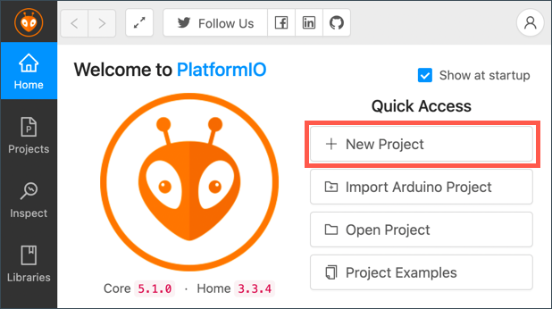
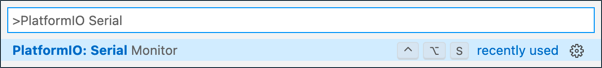

<!--
CO_OP_TRANSLATOR_METADATA:
{
  "original_hash": "a4f0c166010e31fd7b6ca20bc88dec6d",
  "translation_date": "2025-08-26T23:42:39+00:00",
  "source_file": "1-getting-started/lessons/1-introduction-to-iot/wio-terminal.md",
  "language_code": "ar"
}
-->
# Wio Terminal

[Wio Terminal من Seeed Studios](https://www.seeedstudio.com/Wio-Terminal-p-4509.html) هو متحكم دقيق متوافق مع Arduino، يحتوي على WiFi وبعض المستشعرات والمحركات المدمجة، بالإضافة إلى منافذ لإضافة المزيد من المستشعرات والمحركات باستخدام نظام بيئي للأجهزة يسمى [Grove](https://www.seeedstudio.com/category/Grove-c-1003.html).


## الإعداد

لاستخدام Wio Terminal، ستحتاج إلى تثبيت بعض البرامج المجانية على جهاز الكمبيوتر الخاص بك. كما ستحتاج إلى تحديث البرنامج الثابت (firmware) الخاص بـ Wio Terminal قبل أن تتمكن من توصيله بشبكة WiFi.

### المهمة - الإعداد

قم بتثبيت البرامج المطلوبة وتحديث البرنامج الثابت.

1. قم بتثبيت Visual Studio Code (VS Code). هذا هو المحرر الذي ستستخدمه لكتابة كود الجهاز بلغة C/C++. راجع [وثائق VS Code](https://code.visualstudio.com?WT.mc_id=academic-17441-jabenn) للحصول على تعليمات التثبيت.

    > 💁 IDE آخر شائع لتطوير Arduino هو [Arduino IDE](https://www.arduino.cc/en/software). إذا كنت بالفعل على دراية بهذه الأداة، يمكنك استخدامها بدلاً من VS Code وPlatformIO، ولكن الدروس ستعتمد على استخدام VS Code.

1. قم بتثبيت إضافة PlatformIO لـ VS Code. هذه الإضافة تدعم برمجة المتحكمات الدقيقة بلغة C/C++. راجع [وثائق إضافة PlatformIO](https://marketplace.visualstudio.com/items?WT.mc_id=academic-17441-jabenn&itemName=platformio.platformio-ide) للحصول على تعليمات التثبيت. تعتمد هذه الإضافة على إضافة Microsoft C/C++ التي يتم تثبيتها تلقائيًا عند تثبيت PlatformIO.

1. قم بتوصيل Wio Terminal بجهاز الكمبيوتر الخاص بك. يحتوي Wio Terminal على منفذ USB-C في الأسفل، ويجب توصيله بمنفذ USB على جهاز الكمبيوتر الخاص بك. يأتي Wio Terminal مع كابل USB-C إلى USB-A، ولكن إذا كان جهاز الكمبيوتر الخاص بك يحتوي فقط على منافذ USB-C، فستحتاج إلى كابل USB-C أو محول USB-A إلى USB-C.

1. اتبع التعليمات في [وثائق Wio Terminal Wiki WiFi Overview](https://wiki.seeedstudio.com/Wio-Terminal-Network-Overview/) لإعداد Wio Terminal وتحديث البرنامج الثابت.

## Hello World

من التقليدي عند البدء باستخدام لغة برمجة أو تقنية جديدة إنشاء تطبيق "Hello World" - وهو تطبيق صغير يعرض نصًا مثل `"Hello World"` للتأكد من أن جميع الأدوات تم إعدادها بشكل صحيح.

تطبيق Hello World الخاص بـ Wio Terminal سيتأكد من أن Visual Studio Code تم تثبيته بشكل صحيح مع PlatformIO وتم إعداده لتطوير المتحكمات الدقيقة.

### إنشاء مشروع PlatformIO

الخطوة الأولى هي إنشاء مشروع جديد باستخدام PlatformIO مهيأ لـ Wio Terminal.

#### المهمة - إنشاء مشروع PlatformIO

قم بإنشاء مشروع PlatformIO.

1. قم بتوصيل Wio Terminal بجهاز الكمبيوتر الخاص بك.

1. افتح VS Code.

1. ستجد أيقونة PlatformIO في شريط القائمة الجانبي:

    

    اختر هذا العنصر من القائمة، ثم اختر *PIO Home -> Open*.

    

1. من شاشة الترحيب، اختر زر **+ New Project**.

    

1. قم بتكوين المشروع في *معالج المشروع*:

    1. قم بتسمية مشروعك `nightlight`.

    1. من قائمة *Board* المنسدلة، اكتب `WIO` لتصفية اللوحات، واختر *Seeeduino Wio Terminal*.

    1. اترك خيار *Framework* كما هو على *Arduino*.

    1. إما أن تترك خيار *Use default location* محددًا، أو قم بإلغاء تحديده واختر موقعًا لمشروعك.

    1. اختر زر **Finish**.

    

    سيقوم PlatformIO بتنزيل المكونات التي يحتاجها لتجميع الكود الخاص بـ Wio Terminal وإنشاء مشروعك. قد يستغرق هذا بضع دقائق.

### استكشاف مشروع PlatformIO

سيعرض مستكشف VS Code عددًا من الملفات والمجلدات التي أنشأها معالج PlatformIO.

#### المجلدات

* `.pio` - يحتوي هذا المجلد على بيانات مؤقتة يحتاجها PlatformIO مثل المكتبات أو الكود المترجم. يتم إعادة إنشائه تلقائيًا إذا تم حذفه، ولا تحتاج إلى إضافته إلى التحكم في الكود المصدري إذا كنت تشارك مشروعك على مواقع مثل GitHub.
* `.vscode` - يحتوي هذا المجلد على التكوين المستخدم بواسطة PlatformIO وVS Code. يتم إعادة إنشائه تلقائيًا إذا تم حذفه، ولا تحتاج إلى إضافته إلى التحكم في الكود المصدري إذا كنت تشارك مشروعك على مواقع مثل GitHub.
* `include` - هذا المجلد مخصص لملفات الرأس الخارجية المطلوبة عند إضافة مكتبات إضافية إلى الكود الخاص بك. لن تستخدم هذا المجلد في أي من هذه الدروس.
* `lib` - هذا المجلد مخصص للمكتبات الخارجية التي تريد استدعاءها من الكود الخاص بك. لن تستخدم هذا المجلد في أي من هذه الدروس.
* `src` - يحتوي هذا المجلد على الكود المصدري الرئيسي لتطبيقك. في البداية، سيحتوي على ملف واحد - `main.cpp`.
* `test` - هذا المجلد هو المكان الذي ستضع فيه أي اختبارات وحدة للكود الخاص بك.

#### الملفات

* `main.cpp` - يحتوي هذا الملف في مجلد `src` على نقطة الدخول لتطبيقك. افتح هذا الملف، وسيحتوي على الكود التالي:

    ```cpp
    #include <Arduino.h>
    
    void setup() {
      // put your setup code here, to run once:
    }
    
    void loop() {
      // put your main code here, to run repeatedly:
    }
    ```

    عند بدء تشغيل الجهاز، سيقوم إطار عمل Arduino بتشغيل وظيفة `setup` مرة واحدة، ثم تشغيل وظيفة `loop` بشكل متكرر حتى يتم إيقاف تشغيل الجهاز.

* `.gitignore` - يسرد هذا الملف الملفات والمجلدات التي يجب تجاهلها عند إضافة الكود إلى التحكم في الكود المصدري، مثل التحميل إلى مستودع على GitHub.

* `platformio.ini` - يحتوي هذا الملف على التكوين الخاص بجهازك وتطبيقك. افتح هذا الملف، وسيحتوي على الكود التالي:

    ```ini
    [env:seeed_wio_terminal]
    platform = atmelsam
    board = seeed_wio_terminal
    framework = arduino
    ```

    يحتوي القسم `[env:seeed_wio_terminal]` على التكوين الخاص بـ Wio Terminal. يمكنك أن تحتوي على أقسام `env` متعددة بحيث يمكن تجميع الكود الخاص بك لألواح متعددة.

    القيم الأخرى تتطابق مع التكوين من معالج المشروع:

  * `platform = atmelsam` يحدد الأجهزة التي يستخدمها Wio Terminal (وحدة تحكم دقيقة تعتمد على ATSAMD51).
  * `board = seeed_wio_terminal` يحدد نوع لوحة المتحكم الدقيقة (Wio Terminal).
  * `framework = arduino` يحدد أن هذا المشروع يستخدم إطار عمل Arduino.

### كتابة تطبيق Hello World

أنت الآن جاهز لكتابة تطبيق Hello World.

#### المهمة - كتابة تطبيق Hello World

اكتب تطبيق Hello World.

1. افتح ملف `main.cpp` في VS Code.

1. قم بتغيير الكود ليطابق الكود التالي:

    ```cpp
    #include <Arduino.h>

    void setup()
    {
        Serial.begin(9600);

        while (!Serial)
            ; // Wait for Serial to be ready
    
        delay(1000);
    }
    
    void loop()
    {
        Serial.println("Hello World");
        delay(5000);
    }
    ```

    تقوم وظيفة `setup` بتهيئة الاتصال بالمنفذ التسلسلي - في هذه الحالة، منفذ USB المستخدم لتوصيل Wio Terminal بجهاز الكمبيوتر الخاص بك. المعامل `9600` هو [معدل البود](https://wikipedia.org/wiki/Symbol_rate) (المعروف أيضًا بمعدل الرموز)، أو السرعة التي يتم بها إرسال البيانات عبر المنفذ التسلسلي بوحدات البت في الثانية. هذا الإعداد يعني إرسال 9,600 بت (0 و1) من البيانات كل ثانية. ثم ينتظر حتى يكون المنفذ التسلسلي جاهزًا.

    تقوم وظيفة `loop` بإرسال السطر `Hello World!` إلى المنفذ التسلسلي، بحيث يتم إرسال أحرف `Hello World!` مع حرف سطر جديد. ثم ينتظر لمدة 5,000 مللي ثانية أو 5 ثوانٍ. بعد انتهاء وظيفة `loop`، يتم تشغيلها مرة أخرى، وهكذا طوال الوقت الذي يكون فيه المتحكم الدقيق قيد التشغيل.

1. ضع Wio Terminal في وضع التحميل. ستحتاج إلى القيام بذلك في كل مرة تقوم فيها بتحميل كود جديد إلى الجهاز:

    1. اسحب المفتاح مرتين بسرعة - سيعود تلقائيًا إلى وضع التشغيل في كل مرة.

    1. تحقق من مؤشر LED الأزرق على الجانب الأيمن من منفذ USB. يجب أن يكون يومض ببطء.
    
    [](https://youtu.be/LeKU_7zLRrQ)
    
    انقر على الصورة أعلاه لمشاهدة فيديو يوضح كيفية القيام بذلك.

1. قم ببناء وتحميل الكود إلى Wio Terminal.

    1. افتح لوحة الأوامر في VS Code.

    1. اكتب `PlatformIO Upload` للبحث عن خيار التحميل، واختر *PlatformIO: Upload*.

        

        سيقوم PlatformIO تلقائيًا ببناء الكود إذا لزم الأمر قبل التحميل.

    1. سيتم تجميع الكود وتحميله إلى Wio Terminal.

        > 💁 إذا كنت تستخدم macOS، ستظهر إشعار حول *DISK NOT EJECTED PROPERLY*. يحدث هذا لأن Wio Terminal يتم تركيبه كقرص كجزء من عملية الفلاش، ويتم فصله عند كتابة الكود المترجم إلى الجهاز. يمكنك تجاهل هذا الإشعار.

    ⚠️ إذا واجهت أخطاء حول عدم توفر منفذ التحميل، تأكد أولاً من أن Wio Terminal متصل بجهاز الكمبيوتر الخاص بك، ومشغل باستخدام المفتاح الموجود على الجانب الأيسر من الشاشة، ومضبوط على وضع التحميل. يجب أن يكون الضوء الأخضر في الأسفل مضاءً، والضوء الأزرق يومض ببطء. إذا استمرت المشكلة، اسحب مفتاح التشغيل/الإيقاف مرتين بسرعة مرة أخرى لإجبار Wio Terminal على وضع التحميل وحاول التحميل مرة أخرى.

يحتوي PlatformIO على مراقب تسلسلي يمكنه مراقبة البيانات المرسلة عبر كابل USB من Wio Terminal. يتيح لك ذلك مراقبة البيانات المرسلة بواسطة الأمر `Serial.println("Hello World");`.

1. افتح لوحة الأوامر في VS Code.

1. اكتب `PlatformIO Serial` للبحث عن خيار المراقب التسلسلي، واختر *PlatformIO: Serial Monitor*.

    

    سيتم فتح نافذة طرفية جديدة، وسيتم بث البيانات المرسلة عبر المنفذ التسلسلي إلى هذه النافذة:

    ```output
    > Executing task: platformio device monitor <
    
    --- Available filters and text transformations: colorize, debug, default, direct, hexlify, log2file, nocontrol, printable, send_on_enter, time
    --- More details at http://bit.ly/pio-monitor-filters
    --- Miniterm on /dev/cu.usbmodem101  9600,8,N,1 ---
    --- Quit: Ctrl+C | Menu: Ctrl+T | Help: Ctrl+T followed by Ctrl+H ---
    Hello World
    Hello World
    ```

    سيتم طباعة `Hello World` إلى المراقب التسلسلي كل 5 ثوانٍ.

> 💁 يمكنك العثور على هذا الكود في المجلد [code/wio-terminal](../../../../../1-getting-started/lessons/1-introduction-to-iot/code/wio-terminal).

😀 لقد نجحت في تشغيل برنامج "Hello World"!

---

**إخلاء المسؤولية**:  
تم ترجمة هذا المستند باستخدام خدمة الترجمة بالذكاء الاصطناعي [Co-op Translator](https://github.com/Azure/co-op-translator). بينما نسعى لتحقيق الدقة، يرجى العلم أن الترجمات الآلية قد تحتوي على أخطاء أو معلومات غير دقيقة. يجب اعتبار المستند الأصلي بلغته الأصلية المصدر الموثوق. للحصول على معلومات حاسمة، يُوصى بالاستعانة بترجمة بشرية احترافية. نحن غير مسؤولين عن أي سوء فهم أو تفسيرات خاطئة تنشأ عن استخدام هذه الترجمة.