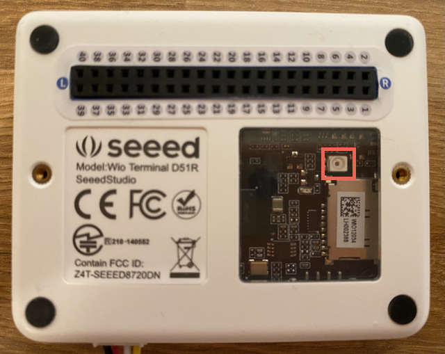

<!--
CO_OP_TRANSLATOR_METADATA:
{
  "original_hash": "7f4ad0ef54f248b85b92187c94cf9dcb",
  "translation_date": "2025-08-26T23:31:06+00:00",
  "source_file": "1-getting-started/lessons/3-sensors-and-actuators/wio-terminal-sensor.md",
  "language_code": "ar"
}
-->
# إضافة مستشعر - Wio Terminal

في هذا الجزء من الدرس، ستستخدم مستشعر الضوء الموجود في Wio Terminal.

## الأجهزة

المستشعر المستخدم في هذا الدرس هو **مستشعر الضوء** الذي يستخدم [الصمام الضوئي](https://wikipedia.org/wiki/Photodiode) لتحويل الضوء إلى إشارة كهربائية. هذا المستشعر هو مستشعر تناظري يرسل قيمة عددية تتراوح بين 0 و1023 تشير إلى كمية الضوء النسبية، والتي لا تتوافق مع أي وحدة قياس قياسية مثل [اللكس](https://wikipedia.org/wiki/Lux).

مستشعر الضوء مدمج في Wio Terminal ويمكن رؤيته من خلال النافذة البلاستيكية الشفافة الموجودة في الخلف.



## برمجة مستشعر الضوء

يمكن الآن برمجة الجهاز لاستخدام مستشعر الضوء المدمج.

### المهمة

برمج الجهاز.

1. افتح مشروع "الضوء الليلي" في VS Code الذي أنشأته في الجزء السابق من هذا التمرين.

1. أضف السطر التالي إلى نهاية دالة `setup`:

    ```cpp
    pinMode(WIO_LIGHT, INPUT);
    ```

    هذا السطر يقوم بتكوين الدبابيس المستخدمة للتواصل مع أجهزة المستشعر.

    دبوس `WIO_LIGHT` هو رقم دبوس GPIO المتصل بمستشعر الضوء المدمج. يتم ضبط هذا الدبوس على `INPUT`، مما يعني أنه متصل بمستشعر وسيتم قراءة البيانات من الدبوس.

1. احذف محتويات دالة `loop`.

1. أضف الكود التالي إلى دالة `loop` الفارغة الآن.

    ```cpp
    int light = analogRead(WIO_LIGHT);
    Serial.print("Light value: ");
    Serial.println(light);
    ```

    هذا الكود يقرأ قيمة تناظرية من دبوس `WIO_LIGHT`. يتم قراءة قيمة تتراوح بين 0 و1023 من مستشعر الضوء المدمج. يتم إرسال هذه القيمة بعد ذلك إلى المنفذ التسلسلي بحيث يمكنك قراءتها في Serial Monitor عند تشغيل هذا الكود. `Serial.print` يكتب النص بدون سطر جديد في النهاية، لذا سيبدأ كل سطر بـ `Light value:` وينتهي بالقيمة الفعلية للضوء.

1. أضف تأخيرًا صغيرًا لمدة ثانية واحدة (1000 مللي ثانية) في نهاية دالة `loop` حيث لا تحتاج مستويات الضوء إلى الفحص بشكل مستمر. التأخير يقلل من استهلاك الطاقة للجهاز.

    ```cpp
    delay(1000);
    ```

1. أعد توصيل Wio Terminal بجهاز الكمبيوتر الخاص بك، وقم برفع الكود الجديد كما فعلت من قبل.

1. قم بتوصيل Serial Monitor. سيتم إخراج قيم الضوء إلى الطرفية. قم بتغطية مستشعر الضوء الموجود في الجزء الخلفي من Wio Terminal وكشفه، وستتغير القيم.

    ```output
    > Executing task: platformio device monitor <

    --- Available filters and text transformations: colorize, debug, default, direct, hexlify, log2file, nocontrol, printable, send_on_enter, time
    --- More details at http://bit.ly/pio-monitor-filters
    --- Miniterm on /dev/cu.usbmodem101  9600,8,N,1 ---
    --- Quit: Ctrl+C | Menu: Ctrl+T | Help: Ctrl+T followed by Ctrl+H ---
    Light value: 4
    Light value: 5
    Light value: 4
    Light value: 158
    Light value: 343
    Light value: 348
    Light value: 344
    ```

> 💁 يمكنك العثور على هذا الكود في مجلد [code-sensor/wio-terminal](../../../../../1-getting-started/lessons/3-sensors-and-actuators/code-sensor/wio-terminal).

😀 إضافة مستشعر إلى برنامج الضوء الليلي الخاص بك كانت ناجحة!

---

**إخلاء المسؤولية**:  
تم ترجمة هذا المستند باستخدام خدمة الترجمة بالذكاء الاصطناعي [Co-op Translator](https://github.com/Azure/co-op-translator). بينما نسعى لتحقيق الدقة، يرجى العلم أن الترجمات الآلية قد تحتوي على أخطاء أو معلومات غير دقيقة. يجب اعتبار المستند الأصلي بلغته الأصلية المصدر الموثوق. للحصول على معلومات حاسمة، يُوصى بالاستعانة بترجمة بشرية احترافية. نحن غير مسؤولين عن أي سوء فهم أو تفسيرات خاطئة تنشأ عن استخدام هذه الترجمة.