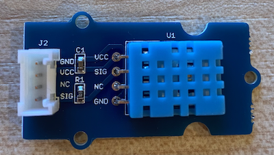

<!--
CO_OP_TRANSLATOR_METADATA:
{
  "original_hash": "7678f7c67b97ee52d5727496dcd7d346",
  "translation_date": "2025-08-26T22:21:06+00:00",
  "source_file": "2-farm/lessons/1-predict-plant-growth/pi-temp.md",
  "language_code": "ar"
}
-->
# قياس درجة الحرارة - Raspberry Pi

في هذا الجزء من الدرس، ستقوم بإضافة مستشعر درجة حرارة إلى Raspberry Pi الخاص بك.

## الأجهزة

المستشعر الذي ستستخدمه هو [مستشعر الرطوبة ودرجة الحرارة DHT11](https://www.seeedstudio.com/Grove-Temperature-Humidity-Sensor-DHT11.html)، الذي يجمع بين مستشعرين في حزمة واحدة. هذا المستشعر شائع جدًا، حيث تتوفر العديد من المستشعرات التجارية التي تجمع بين قياس درجة الحرارة والرطوبة وأحيانًا الضغط الجوي. مكون مستشعر درجة الحرارة هو مقاوم حراري ذو معامل حراري سلبي (NTC)، وهو مقاوم تقل مقاومته مع زيادة درجة الحرارة.

هذا مستشعر رقمي، لذا يحتوي على محول تناظري إلى رقمي (ADC) مدمج لإنشاء إشارة رقمية تحتوي على بيانات درجة الحرارة والرطوبة التي يمكن لوحدة التحكم الدقيقة قراءتها.

### توصيل مستشعر درجة الحرارة

يمكن توصيل مستشعر درجة الحرارة Grove بـ Raspberry Pi.

#### المهمة

قم بتوصيل مستشعر درجة الحرارة



1. أدخل أحد طرفي كابل Grove في المقبس الموجود على مستشعر الرطوبة ودرجة الحرارة. يمكن إدخاله في اتجاه واحد فقط.

1. مع إيقاف تشغيل Raspberry Pi، قم بتوصيل الطرف الآخر من كابل Grove بالمقبس الرقمي المسمى **D5** على قبعة Grove Base المثبتة على Raspberry Pi. هذا المقبس هو الثاني من اليسار في صف المقابس بجانب دبابيس GPIO.


## برمجة مستشعر درجة الحرارة

يمكن الآن برمجة الجهاز لاستخدام مستشعر درجة الحرارة المتصل.

### المهمة

برمج الجهاز.

1. قم بتشغيل Raspberry Pi وانتظر حتى يتم الإقلاع.

1. افتح VS Code، إما مباشرة على Raspberry Pi، أو قم بالاتصال باستخدام إضافة Remote SSH.

    > ⚠️ يمكنك الرجوع إلى [التعليمات الخاصة بإعداد وتشغيل VS Code في الدرس الأول إذا لزم الأمر](../../../1-getting-started/lessons/1-introduction-to-iot/pi.md).

1. من الطرفية، قم بإنشاء مجلد جديد في دليل المستخدم `pi` باسم `temperature-sensor`. قم بإنشاء ملف داخل هذا المجلد باسم `app.py`:

    ```sh
    mkdir temperature-sensor
    cd temperature-sensor
    touch app.py
    ```

1. افتح هذا المجلد في VS Code.

1. لاستخدام مستشعر درجة الحرارة والرطوبة، يجب تثبيت حزمة Pip إضافية. من الطرفية في VS Code، قم بتشغيل الأمر التالي لتثبيت هذه الحزمة على Raspberry Pi:

    ```sh
    pip3 install seeed-python-dht
    ```

1. أضف الكود التالي إلى ملف `app.py` لاستيراد المكتبات المطلوبة:

    ```python
    import time
    from seeed_dht import DHT
    ```

    يقوم السطر `from seeed_dht import DHT` باستيراد فئة `DHT` للتفاعل مع مستشعر درجة الحرارة من نوع Grove من الوحدة `seeed_dht`.

1. أضف الكود التالي بعد الكود أعلاه لإنشاء نسخة من الفئة التي تدير مستشعر درجة الحرارة:

    ```python
    sensor = DHT("11", 5)
    ```

    هذا يعلن عن نسخة من فئة `DHT` التي تدير مستشعر **D**igital **H**umidity و**T**emperature. المعامل الأول يخبر الكود أن المستشعر المستخدم هو *DHT11* - المكتبة التي تستخدمها تدعم أنواعًا أخرى من هذا المستشعر. المعامل الثاني يخبر الكود أن المستشعر متصل بالمقبس الرقمي `D5` على قبعة Grove Base.

    > ✅ تذكر، جميع المقابس لها أرقام دبابيس فريدة. الدبابيس 0، 2، 4، و6 هي دبابيس تناظرية، والدبابيس 5، 16، 18، 22، 24، و26 هي دبابيس رقمية.

1. أضف حلقة لا نهائية بعد الكود أعلاه لاستطلاع قيمة مستشعر درجة الحرارة وطباعتها على الطرفية:

    ```python
    while True:
        _, temp = sensor.read()
        print(f'Temperature {temp}°C')
    ```

    الاستدعاء `sensor.read()` يعيد مجموعة تحتوي على الرطوبة ودرجة الحرارة. تحتاج فقط إلى قيمة درجة الحرارة، لذا يتم تجاهل الرطوبة. ثم يتم طباعة قيمة درجة الحرارة على الطرفية.

1. أضف فترة انتظار قصيرة مدتها عشر ثوانٍ في نهاية الحلقة لتقليل استهلاك الطاقة، حيث لا تحتاج إلى التحقق من مستويات درجة الحرارة باستمرار.

    ```python
    time.sleep(10)
    ```

1. من الطرفية في VS Code، قم بتشغيل الأمر التالي لتشغيل تطبيق Python الخاص بك:

    ```sh
    python3 app.py
    ```

    يجب أن ترى قيم درجة الحرارة تظهر على الطرفية. استخدم شيئًا لتسخين المستشعر، مثل الضغط عليه بإبهامك أو استخدام مروحة، لملاحظة تغير القيم:

    ```output
    pi@raspberrypi:~/temperature-sensor $ python3 app.py 
    Temperature 26°C
    Temperature 26°C
    Temperature 28°C
    Temperature 30°C
    Temperature 32°C
    ```

> 💁 يمكنك العثور على هذا الكود في المجلد [code-temperature/pi](../../../../../2-farm/lessons/1-predict-plant-growth/code-temperature/pi).

😀 لقد نجحت في برمجة مستشعر درجة الحرارة الخاص بك!

---

**إخلاء المسؤولية**:  
تم ترجمة هذا المستند باستخدام خدمة الترجمة بالذكاء الاصطناعي [Co-op Translator](https://github.com/Azure/co-op-translator). بينما نسعى لتحقيق الدقة، يرجى العلم أن الترجمات الآلية قد تحتوي على أخطاء أو معلومات غير دقيقة. يجب اعتبار المستند الأصلي بلغته الأصلية المصدر الموثوق. للحصول على معلومات حاسمة، يُوصى بالاستعانة بترجمة بشرية احترافية. نحن غير مسؤولين عن أي سوء فهم أو تفسيرات خاطئة تنشأ عن استخدام هذه الترجمة.