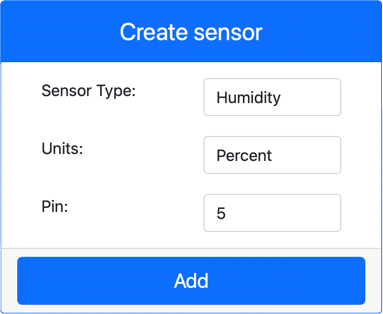

<!--
CO_OP_TRANSLATOR_METADATA:
{
  "original_hash": "70e5a428b607cd5a9a4f422c2a4df03d",
  "translation_date": "2025-08-26T22:19:33+00:00",
  "source_file": "2-farm/lessons/1-predict-plant-growth/virtual-device-temp.md",
  "language_code": "ar"
}
-->
# قياس درجة الحرارة - أجهزة إنترنت الأشياء الافتراضية

في هذا الجزء من الدرس، ستضيف مستشعر درجة حرارة إلى جهاز إنترنت الأشياء الافتراضي الخاص بك.

## الأجهزة الافتراضية

سيستخدم جهاز إنترنت الأشياء الافتراضي مستشعرًا محاكيًا للرطوبة ودرجة الحرارة من نوع Grove Digital. هذا يجعل هذا المختبر مشابهًا لاستخدام Raspberry Pi مع مستشعر DHT11 الفعلي.

يجمع المستشعر بين **مستشعر درجة الحرارة** و**مستشعر الرطوبة**، ولكن في هذا المختبر، ستستخدم فقط مكون مستشعر درجة الحرارة. في جهاز إنترنت الأشياء الفعلي، سيكون مستشعر درجة الحرارة عبارة عن [ثيرميستور](https://wikipedia.org/wiki/Thermistor) يقيس درجة الحرارة عن طريق استشعار التغير في المقاومة مع تغير درجة الحرارة. عادةً ما تكون مستشعرات درجة الحرارة مستشعرات رقمية تقوم داخليًا بتحويل المقاومة المقاسة إلى درجة حرارة بوحدات مئوية (أو كلفن، أو فهرنهايت).

### إضافة المستشعرات إلى CounterFit

لاستخدام مستشعر افتراضي للرطوبة ودرجة الحرارة، تحتاج إلى إضافة المستشعرين إلى تطبيق CounterFit.

#### المهمة - إضافة المستشعرات إلى CounterFit

أضف مستشعرات الرطوبة ودرجة الحرارة إلى تطبيق CounterFit.

1. قم بإنشاء تطبيق Python جديد على جهاز الكمبيوتر الخاص بك في مجلد يسمى `temperature-sensor` يحتوي على ملف واحد يسمى `app.py` وبيئة افتراضية لـ Python، وأضف حزم CounterFit pip.

    > ⚠️ يمكنك الرجوع إلى [التعليمات لإنشاء وإعداد مشروع CounterFit Python في الدرس الأول إذا لزم الأمر](../../../1-getting-started/lessons/1-introduction-to-iot/virtual-device.md).

1. قم بتثبيت حزمة Pip إضافية لتثبيت واجهة CounterFit لمستشعر DHT11. تأكد من تثبيتها من خلال الطرفية مع تفعيل البيئة الافتراضية.

    ```sh
    pip install counterfit-shims-seeed-python-dht
    ```

1. تأكد من تشغيل تطبيق الويب CounterFit.

1. قم بإنشاء مستشعر رطوبة:

    1. في مربع *إنشاء مستشعر* في لوحة *المستشعرات*، انقر على القائمة المنسدلة *نوع المستشعر* واختر *رطوبة*.

    1. اترك *الوحدات* مضبوطة على *النسبة المئوية*.

    1. تأكد من أن *الدبوس* مضبوط على *5*.

    1. انقر على زر **إضافة** لإنشاء مستشعر الرطوبة على الدبوس 5.

    

    سيتم إنشاء مستشعر الرطوبة وسيظهر في قائمة المستشعرات.

    

1. قم بإنشاء مستشعر درجة حرارة:

    1. في مربع *إنشاء مستشعر* في لوحة *المستشعرات*، انقر على القائمة المنسدلة *نوع المستشعر* واختر *درجة حرارة*.

    1. اترك *الوحدات* مضبوطة على *درجة مئوية*.

    1. تأكد من أن *الدبوس* مضبوط على *6*.

    1. انقر على زر **إضافة** لإنشاء مستشعر درجة الحرارة على الدبوس 6.

    

    سيتم إنشاء مستشعر درجة الحرارة وسيظهر في قائمة المستشعرات.

    

## برمجة تطبيق مستشعر درجة الحرارة

يمكن الآن برمجة تطبيق مستشعر درجة الحرارة باستخدام مستشعرات CounterFit.

### المهمة - برمجة تطبيق مستشعر درجة الحرارة

برمج تطبيق مستشعر درجة الحرارة.

1. تأكد من فتح تطبيق `temperature-sensor` في VS Code.

1. افتح ملف `app.py`.

1. أضف الكود التالي إلى أعلى ملف `app.py` لتوصيل التطبيق بـ CounterFit:

    ```python
    from counterfit_connection import CounterFitConnection
    CounterFitConnection.init('127.0.0.1', 5000)
    ```

1. أضف الكود التالي إلى ملف `app.py` لاستيراد المكتبات المطلوبة:

    ```python
    import time
    from counterfit_shims_seeed_python_dht import DHT
    ```

    يقوم السطر `from seeed_dht import DHT` باستيراد فئة `DHT` للتفاعل مع مستشعر درجة الحرارة الافتراضي من نوع Grove باستخدام واجهة من وحدة `counterfit_shims_seeed_python_dht`.

1. أضف الكود التالي بعد الكود أعلاه لإنشاء نسخة من الفئة التي تدير مستشعر الرطوبة ودرجة الحرارة الافتراضي:

    ```python
    sensor = DHT("11", 5)
    ```

    يقوم هذا بتعريف نسخة من فئة `DHT` التي تدير مستشعر **الرطوبة** و**درجة الحرارة** الرقمي الافتراضي. المعامل الأول يخبر الكود بأن المستشعر المستخدم هو مستشعر افتراضي من نوع *DHT11*. المعامل الثاني يخبر الكود بأن المستشعر متصل بالمنفذ `5`.

    > 💁 يقوم CounterFit بمحاكاة هذا المستشعر المدمج للرطوبة ودرجة الحرارة عن طريق الاتصال بمستشعرين، مستشعر رطوبة على الدبوس المحدد عند إنشاء فئة `DHT`، ومستشعر درجة حرارة يعمل على الدبوس التالي. إذا كان مستشعر الرطوبة على الدبوس 5، فإن الواجهة تتوقع أن يكون مستشعر درجة الحرارة على الدبوس 6.

1. أضف حلقة لا نهائية بعد الكود أعلاه لاستطلاع قيمة مستشعر درجة الحرارة وطباعتها على وحدة التحكم:

    ```python
    while True:
        _, temp = sensor.read()
        print(f'Temperature {temp}°C')
    ```

    يقوم الاستدعاء `sensor.read()` بإرجاع زوج من القيم للرطوبة ودرجة الحرارة. تحتاج فقط إلى قيمة درجة الحرارة، لذا يتم تجاهل الرطوبة. ثم يتم طباعة قيمة درجة الحرارة على وحدة التحكم.

1. أضف فترة توقف قصيرة مدتها عشر ثوانٍ في نهاية الحلقة لتقليل استهلاك الطاقة، حيث لا تحتاج إلى التحقق من مستويات درجة الحرارة باستمرار.

    ```python
    time.sleep(10)
    ```

1. من طرفية VS Code مع تفعيل البيئة الافتراضية، قم بتشغيل الأمر التالي لتشغيل تطبيق Python الخاص بك:

    ```sh
    python app.py
    ```

1. من تطبيق CounterFit، قم بتغيير قيمة مستشعر درجة الحرارة التي سيتم قراءتها بواسطة التطبيق. يمكنك القيام بذلك بطريقتين:

    * أدخل رقمًا في مربع *القيمة* الخاص بمستشعر درجة الحرارة، ثم انقر على زر **تعيين**. الرقم الذي تدخله سيكون القيمة التي يعيدها المستشعر.

    * قم بتحديد مربع *عشوائي*، وأدخل قيمتي *الحد الأدنى* و*الحد الأقصى*، ثم انقر على زر **تعيين**. في كل مرة يقرأ المستشعر قيمة، سيقرأ رقمًا عشوائيًا بين *الحد الأدنى* و*الحد الأقصى*.

    يجب أن ترى القيم التي قمت بتعيينها تظهر في وحدة التحكم. قم بتغيير *القيمة* أو إعدادات *العشوائية* لرؤية التغيير في القيم.

    ```output
    (.venv) ➜  temperature-sensor python app.py
    Temperature 28.25°C
    Temperature 30.71°C
    Temperature 25.17°C
    ```

> 💁 يمكنك العثور على هذا الكود في المجلد [code-temperature/virtual-device](../../../../../2-farm/lessons/1-predict-plant-growth/code-temperature/virtual-device).

😀 لقد نجحت في برمجة تطبيق مستشعر درجة الحرارة!

---

**إخلاء المسؤولية**:  
تم ترجمة هذا المستند باستخدام خدمة الترجمة بالذكاء الاصطناعي [Co-op Translator](https://github.com/Azure/co-op-translator). بينما نسعى لتحقيق الدقة، يرجى العلم أن الترجمات الآلية قد تحتوي على أخطاء أو عدم دقة. يجب اعتبار المستند الأصلي بلغته الأصلية المصدر الموثوق. للحصول على معلومات حاسمة، يُوصى بالترجمة البشرية الاحترافية. نحن غير مسؤولين عن أي سوء فهم أو تفسيرات خاطئة تنشأ عن استخدام هذه الترجمة.