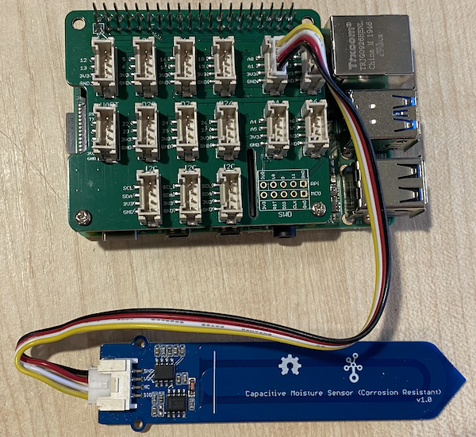
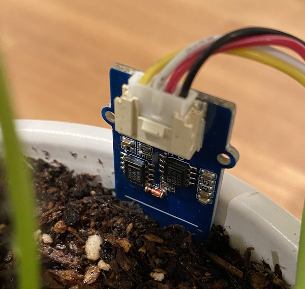

<!--
CO_OP_TRANSLATOR_METADATA:
{
  "original_hash": "9d4d00a47d5d0f3e6ce42c0d1020064a",
  "translation_date": "2025-08-26T22:52:42+00:00",
  "source_file": "2-farm/lessons/2-detect-soil-moisture/pi-soil-moisture.md",
  "language_code": "ar"
}
-->
# قياس رطوبة التربة - Raspberry Pi

في هذا الجزء من الدرس، ستقوم بإضافة مستشعر رطوبة التربة السعوي إلى Raspberry Pi، وقراءة القيم منه.

## الأجهزة

يحتاج Raspberry Pi إلى مستشعر رطوبة التربة السعوي.

المستشعر الذي ستستخدمه هو [مستشعر رطوبة التربة السعوي](https://www.seeedstudio.com/Grove-Capacitive-Moisture-Sensor-Corrosion-Resistant.html)، الذي يقيس رطوبة التربة عن طريق الكشف عن السعة الكهربائية للتربة، وهي خاصية تتغير مع تغير رطوبة التربة. مع زيادة رطوبة التربة، ينخفض الجهد الكهربائي.

هذا المستشعر هو مستشعر تناظري، لذا يستخدم دبوسًا تناظريًا، ومحول ADC بدقة 10 بت في قبعة Grove Base Hat على Raspberry Pi لتحويل الجهد إلى إشارة رقمية تتراوح بين 1-1,023. يتم إرسال هذه الإشارة بعد ذلك عبر GPIO pins على Raspberry Pi.

### توصيل مستشعر رطوبة التربة

يمكن توصيل مستشعر رطوبة التربة Grove بـ Raspberry Pi.

#### المهمة - توصيل مستشعر رطوبة التربة

قم بتوصيل مستشعر رطوبة التربة.


1. أدخل أحد طرفي كابل Grove في المقبس الموجود على مستشعر رطوبة التربة. لن يدخل إلا في اتجاه واحد.

1. مع إيقاف تشغيل Raspberry Pi، قم بتوصيل الطرف الآخر من كابل Grove بالمقبس التناظري المسمى **A0** على قبعة Grove Base المثبتة على Raspberry Pi. هذا المقبس هو الثاني من اليمين، في صف المقابس بجانب دبابيس GPIO.



1. أدخل مستشعر رطوبة التربة في التربة. يحتوي المستشعر على "خط أعلى موضع" - وهو خط أبيض عبر المستشعر. أدخل المستشعر حتى هذا الخط ولكن لا تتجاوزه.



## برمجة مستشعر رطوبة التربة

يمكن الآن برمجة Raspberry Pi لاستخدام مستشعر رطوبة التربة المتصل.

### المهمة - برمجة مستشعر رطوبة التربة

قم ببرمجة الجهاز.

1. قم بتشغيل Raspberry Pi وانتظر حتى يتم الإقلاع.

1. قم بتشغيل VS Code، إما مباشرة على Raspberry Pi، أو قم بالاتصال باستخدام إضافة Remote SSH.

    > ⚠️ يمكنك الرجوع إلى [التعليمات الخاصة بإعداد وتشغيل VS Code في درس Nightlight - الدرس الأول إذا لزم الأمر](../../../1-getting-started/lessons/1-introduction-to-iot/pi.md).

1. من خلال الطرفية، قم بإنشاء مجلد جديد في دليل المستخدم `pi` باسم `soil-moisture-sensor`. قم بإنشاء ملف داخل هذا المجلد باسم `app.py`.

1. افتح هذا المجلد في VS Code.

1. أضف الكود التالي إلى ملف `app.py` لاستيراد بعض المكتبات المطلوبة:

    ```python
    import time
    from grove.adc import ADC
    ```

    يقوم السطر `import time` باستيراد وحدة `time` التي سيتم استخدامها لاحقًا في هذا التمرين.

    يقوم السطر `from grove.adc import ADC` باستيراد `ADC` من مكتبات Grove Python. تحتوي هذه المكتبة على كود للتفاعل مع المحول التناظري إلى الرقمي على قبعة Pi Base Hat وقراءة الجهود من المستشعرات التناظرية.

1. أضف الكود التالي أدناه لإنشاء نسخة من فئة `ADC`:

    ```python
    adc = ADC()
    ```

1. أضف حلقة لا نهائية تقرأ من هذا المحول التناظري إلى الرقمي على دبوس A0، وتكتب النتيجة إلى وحدة التحكم. يمكن لهذه الحلقة أن تنتظر 10 ثوانٍ بين القراءات.

    ```python
    while True:
        soil_moisture = adc.read(0)
        print("Soil moisture:", soil_moisture)

        time.sleep(10)
    ```

1. قم بتشغيل تطبيق Python. سترى قياسات رطوبة التربة مكتوبة إلى وحدة التحكم. أضف بعض الماء إلى التربة، أو أخرج المستشعر من التربة، وشاهد التغير في القيمة.

    ```output
    pi@raspberrypi:~/soil-moisture-sensor $ python3 app.py 
    Soil moisture: 615
    Soil moisture: 612
    Soil moisture: 498
    Soil moisture: 493
    Soil moisture: 490
    Soil Moisture: 388
    ```

    في المثال أعلاه، يمكنك رؤية انخفاض الجهد عند إضافة الماء.

> 💁 يمكنك العثور على هذا الكود في المجلد [code/pi](../../../../../2-farm/lessons/2-detect-soil-moisture/code/pi).

😀 لقد نجحت في برمجة مستشعر رطوبة التربة!

---

**إخلاء المسؤولية**:  
تم ترجمة هذا المستند باستخدام خدمة الترجمة بالذكاء الاصطناعي [Co-op Translator](https://github.com/Azure/co-op-translator). بينما نسعى لتحقيق الدقة، يرجى العلم أن الترجمات الآلية قد تحتوي على أخطاء أو معلومات غير دقيقة. يجب اعتبار المستند الأصلي بلغته الأصلية المصدر الموثوق. للحصول على معلومات حاسمة، يُوصى بالاستعانة بترجمة بشرية احترافية. نحن غير مسؤولين عن أي سوء فهم أو تفسيرات خاطئة تنشأ عن استخدام هذه الترجمة.