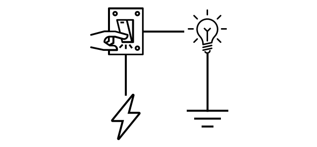

<!--
CO_OP_TRANSLATOR_METADATA:
{
  "original_hash": "f7bb24ba53fb627ddb38a8b24a05e594",
  "translation_date": "2025-08-26T22:22:58+00:00",
  "source_file": "2-farm/lessons/3-automated-plant-watering/README.md",
  "language_code": "ar"
}
-->
# الريّ الآلي للنباتات


> رسم توضيحي بواسطة [نيتيا ناراسيمهان](https://github.com/nitya). اضغط على الصورة للحصول على نسخة أكبر.

تم تدريس هذا الدرس كجزء من [مشروع إنترنت الأشياء للمبتدئين - سلسلة الزراعة الرقمية](https://youtube.com/playlist?list=PLmsFUfdnGr3yCutmcVg6eAUEfsGiFXgcx) من [مايكروسوفت ريآكتور](https://developer.microsoft.com/reactor/?WT.mc_id=academic-17441-jabenn).

[](https://youtu.be/g9FfZwv9R58)

## اختبار ما قبل المحاضرة

[اختبار ما قبل المحاضرة](https://black-meadow-040d15503.1.azurestaticapps.net/quiz/13)

## المقدمة

في الدرس السابق، تعلمت كيفية مراقبة رطوبة التربة. في هذا الدرس، ستتعلم كيفية بناء المكونات الأساسية لنظام ريّ آلي يستجيب لرطوبة التربة. ستتعلم أيضًا عن التوقيت - كيف يمكن أن تستغرق المستشعرات وقتًا للاستجابة للتغيرات، وكيف يمكن للمشغلات أن تستغرق وقتًا لتغيير الخصائص التي تقيسها المستشعرات.

في هذا الدرس سنغطي:

* [التحكم في الأجهزة ذات الطاقة العالية باستخدام جهاز إنترنت الأشياء منخفض الطاقة](../../../../../2-farm/lessons/3-automated-plant-watering)
* [التحكم في الريليه](../../../../../2-farm/lessons/3-automated-plant-watering)
* [التحكم في نباتك عبر MQTT](../../../../../2-farm/lessons/3-automated-plant-watering)
* [توقيت المستشعرات والمشغلات](../../../../../2-farm/lessons/3-automated-plant-watering)
* [إضافة التوقيت إلى خادم التحكم بالنباتات](../../../../../2-farm/lessons/3-automated-plant-watering)

## التحكم في الأجهزة ذات الطاقة العالية باستخدام جهاز إنترنت الأشياء منخفض الطاقة

تستخدم أجهزة إنترنت الأشياء جهدًا منخفضًا. بينما يكون هذا كافيًا للمستشعرات والمشغلات منخفضة الطاقة مثل مصابيح LED، إلا أنه منخفض جدًا للتحكم في الأجهزة الأكبر، مثل مضخة المياه المستخدمة في الريّ. حتى المضخات الصغيرة التي يمكن استخدامها للنباتات المنزلية تسحب تيارًا كبيرًا جدًا بالنسبة لمجموعة تطوير إنترنت الأشياء، مما قد يؤدي إلى تلف اللوحة.

> 🎓 التيار، الذي يُقاس بالأمبير (A)، هو كمية الكهرباء التي تتحرك عبر الدائرة. الجهد يوفر الدفع، والتيار هو مقدار الدفع. يمكنك قراءة المزيد عن التيار في [صفحة التيار الكهربائي على ويكيبيديا](https://wikipedia.org/wiki/Electric_current).

الحل هو توصيل المضخة بمصدر طاقة خارجي واستخدام مشغل لتشغيل المضخة، مشابه لكيفية تشغيل الضوء باستخدام مفتاح. يتطلب الأمر كمية صغيرة جدًا من الطاقة (على شكل طاقة في جسمك) لتحريك إصبعك لتشغيل المفتاح، وهذا يربط الضوء بالكهرباء الرئيسية التي تعمل بجهد 110 فولت/240 فولت.



> 🎓 [الكهرباء الرئيسية](https://wikipedia.org/wiki/Mains_electricity) تشير إلى الكهرباء التي يتم توصيلها إلى المنازل والأعمال عبر البنية التحتية الوطنية في العديد من أنحاء العالم.

✅ يمكن لأجهزة إنترنت الأشياء عادةً توفير 3.3 فولت أو 5 فولت، بأقل من 1 أمبير (1A) من التيار. قارن هذا بالكهرباء الرئيسية التي تكون غالبًا عند 230 فولت (120 فولت في أمريكا الشمالية و100 فولت في اليابان)، ويمكنها توفير الطاقة للأجهزة التي تسحب 30 أمبير.

هناك عدد من المشغلات التي يمكنها القيام بذلك، بما في ذلك الأجهزة الميكانيكية التي يمكن تثبيتها على المفاتيح الموجودة لتقليد حركة الإصبع لتشغيلها. الأكثر شيوعًا هو الريليه.

### الريليه

الريليه هو مفتاح كهروميكانيكي يحول الإشارة الكهربائية إلى حركة ميكانيكية تقوم بتشغيل المفتاح. جوهر الريليه هو المغناطيس الكهربائي.

> 🎓 [المغناطيسات الكهربائية](https://wikipedia.org/wiki/Electromagnet) هي مغناطيسات يتم إنشاؤها عن طريق تمرير الكهرباء عبر ملف من الأسلاك. عندما يتم تشغيل الكهرباء، يصبح الملف ممغنطًا. عندما يتم إيقاف الكهرباء، يفقد الملف مغناطيسيته.


في الريليه، تقوم دائرة التحكم بتشغيل المغناطيس الكهربائي. عندما يكون المغناطيس الكهربائي في وضع التشغيل، فإنه يسحب ذراعًا يحرك مفتاحًا، مما يغلق زوجًا من التلامسات ويكمل دائرة الإخراج.


عندما تكون دائرة التحكم في وضع الإيقاف، يتم إيقاف تشغيل المغناطيس الكهربائي، مما يحرر الذراع ويفتح التلامسات، مما يوقف دائرة الإخراج. الريليه هو مشغل رقمي - إشارة عالية إلى الريليه تشغله، وإشارة منخفضة توقفه.

يمكن استخدام دائرة الإخراج لتشغيل أجهزة إضافية، مثل نظام الريّ. يمكن لجهاز إنترنت الأشياء تشغيل الريليه، مما يكمل دائرة الإخراج التي تشغل نظام الريّ، ويتم ريّ النباتات. يمكن لجهاز إنترنت الأشياء بعد ذلك إيقاف تشغيل الريليه، مما يقطع الطاقة عن نظام الريّ، ويوقف الماء.


في الفيديو أعلاه، يتم تشغيل الريليه. يضيء مصباح LED على الريليه للإشارة إلى أنه في وضع التشغيل (تحتوي بعض لوحات الريليه على مصابيح LED للإشارة إلى ما إذا كان الريليه في وضع التشغيل أو الإيقاف)، ويتم إرسال الطاقة إلى المضخة، مما يشغلها ويضخ الماء إلى النبات.

> 💁 يمكن أيضًا استخدام الريليه للتبديل بين دائرتي إخراج بدلاً من تشغيل واحدة وإيقافها. عندما يتحرك الذراع، فإنه يحرك مفتاحًا من إكمال دائرة إخراج واحدة إلى إكمال دائرة إخراج مختلفة، عادةً بمشاركة اتصال طاقة مشترك أو اتصال أرضي مشترك.

✅ قم ببعض البحث: هناك أنواع متعددة من الريليه، مع اختلافات مثل ما إذا كانت دائرة التحكم تشغل الريليه أو توقفه عند تطبيق الطاقة، أو وجود دوائر إخراج متعددة. اكتشف هذه الأنواع المختلفة.

عندما يتحرك الذراع، يمكنك عادةً سماع صوت واضح للنقر عند الاتصال بالمغناطيس الكهربائي.

> 💁 يمكن توصيل الريليه بحيث يؤدي إنشاء الاتصال فعليًا إلى قطع الطاقة عن الريليه، مما يوقف تشغيله، والذي يرسل بعد ذلك الطاقة إلى الريليه لتشغيله مرة أخرى، وهكذا. هذا يعني أن الريليه سينقر بسرعة كبيرة مما يخلق صوت طنين. هذه هي الطريقة التي عملت بها بعض الأجراس الكهربائية الأولى المستخدمة في أجراس الأبواب.

### طاقة الريليه

لا يحتاج المغناطيس الكهربائي إلى الكثير من الطاقة للتفعيل وسحب الذراع، يمكن التحكم فيه باستخدام خرج 3.3 فولت أو 5 فولت من مجموعة تطوير إنترنت الأشياء. يمكن لدائرة الإخراج أن تحمل طاقة أكبر بكثير، اعتمادًا على الريليه، بما في ذلك الجهد الرئيسي أو حتى مستويات طاقة أعلى للاستخدام الصناعي. بهذه الطريقة يمكن لمجموعة تطوير إنترنت الأشياء التحكم في نظام الريّ، من مضخة صغيرة لنبات واحد، وصولًا إلى نظام صناعي ضخم لمزرعة تجارية كاملة.


الصورة أعلاه تظهر ريليه Grove. دائرة التحكم تتصل بجهاز إنترنت الأشياء وتقوم بتشغيل الريليه أو إيقافه باستخدام 3.3 فولت أو 5 فولت. دائرة الإخراج تحتوي على طرفين، يمكن لأي منهما أن يكون الطاقة أو الأرض. دائرة الإخراج يمكنها التعامل مع ما يصل إلى 250 فولت عند 10 أمبير، وهو ما يكفي لمجموعة من الأجهزة التي تعمل بالطاقة الرئيسية. يمكنك الحصول على ريليه يمكنه التعامل مع مستويات طاقة أعلى.


في الصورة أعلاه، يتم توفير الطاقة لمضخة عبر ريليه. هناك سلك أحمر يربط الطرف +5 فولت من مصدر طاقة USB بأحد أطراف دائرة الإخراج للريليه، وسلك أحمر آخر يربط الطرف الآخر لدائرة الإخراج بالمضخة. سلك أسود يربط المضخة بالأرض على مصدر طاقة USB. عندما يتم تشغيل الريليه، فإنه يكمل الدائرة، ويرسل 5 فولت إلى المضخة، مما يشغل المضخة.

## التحكم في الريليه

يمكنك التحكم في الريليه من مجموعة تطوير إنترنت الأشياء الخاصة بك.

### المهمة - التحكم في الريليه

قم بتنفيذ الدليل المناسب للتحكم في الريليه باستخدام جهاز إنترنت الأشياء الخاص بك:

* [Arduino - Wio Terminal](wio-terminal-relay.md)
* [كمبيوتر أحادي اللوحة - Raspberry Pi](pi-relay.md)
* [كمبيوتر أحادي اللوحة - جهاز افتراضي](virtual-device-relay.md)

## التحكم في نباتك عبر MQTT

حتى الآن يتم التحكم في الريليه بواسطة جهاز إنترنت الأشياء مباشرة بناءً على قراءة واحدة لرطوبة التربة. في نظام الريّ التجاري، يتم مركزية منطق التحكم، مما يسمح له باتخاذ قرارات الريّ باستخدام بيانات من مستشعرات متعددة، والسماح بتغيير أي إعدادات في مكان واحد. لمحاكاة ذلك، يمكنك التحكم في الريليه عبر MQTT.

### المهمة - التحكم في الريليه عبر MQTT

1. أضف مكتبات MQTT/pip المناسبة والكود إلى مشروع `soil-moisture-sensor` للاتصال بـ MQTT. قم بتسمية معرف العميل كـ `soilmoisturesensor_client` مسبوقًا بمعرفك.

    > ⚠️ يمكنك الرجوع إلى [التعليمات للاتصال بـ MQTT في المشروع 1، الدرس 4 إذا لزم الأمر](../../../1-getting-started/lessons/4-connect-internet/README.md#connect-your-iot-device-to-mqtt).

1. أضف كود الجهاز المناسب لإرسال البيانات مع إعدادات رطوبة التربة. بالنسبة لرسالة البيانات، قم بتسمية الخاصية `soil_moisture`.

    > ⚠️ يمكنك الرجوع إلى [التعليمات لإرسال البيانات إلى MQTT في المشروع 1، الدرس 4 إذا لزم الأمر](../../../1-getting-started/lessons/4-connect-internet/README.md#send-telemetry-from-your-iot-device).

1. قم بإنشاء كود خادم محلي للاشتراك في البيانات وإرسال أمر للتحكم في الريليه في مجلد يسمى `soil-moisture-sensor-server`. قم بتسمية الخاصية في رسالة الأمر `relay_on`، وقم بتعيين معرف العميل كـ `soilmoisturesensor_server` مسبوقًا بمعرفك. حافظ على نفس هيكل كود الخادم الذي كتبته للمشروع 1، الدرس 4 حيث ستضيف إلى هذا الكود لاحقًا في هذا الدرس.

    > ⚠️ يمكنك الرجوع إلى [التعليمات لإرسال البيانات إلى MQTT](../../../1-getting-started/lessons/4-connect-internet/README.md#write-the-server-code) و[إرسال الأوامر عبر MQTT](../../../1-getting-started/lessons/4-connect-internet/README.md#send-commands-to-the-mqtt-broker) في المشروع 1، الدرس 4 إذا لزم الأمر.

1. أضف كود الجهاز المناسب للتحكم في الريليه من الأوامر المستلمة، باستخدام الخاصية `relay_on` من الرسالة. أرسل true لـ `relay_on` إذا كانت `soil_moisture` أكبر من 450، وإلا أرسل false، بنفس المنطق الذي أضفته لجهاز إنترنت الأشياء سابقًا.

    > ⚠️ يمكنك الرجوع إلى [التعليمات للاستجابة للأوامر من MQTT في المشروع 1، الدرس 4 إذا لزم الأمر](../../../1-getting-started/lessons/4-connect-internet/README.md#handle-commands-on-the-iot-device).

> 💁 يمكنك العثور على هذا الكود في [code-mqtt](../../../../../2-farm/lessons/3-automated-plant-watering/code-mqtt) folder.

تأكد من تشغيل الكود على جهازك والخادم المحلي، واختبره عن طريق تغيير مستويات رطوبة التربة، إما عن طريق تغيير القيم المرسلة بواسطة المستشعر الافتراضي، أو عن طريق تغيير مستويات الرطوبة في التربة بإضافة الماء أو إزالة المستشعر من التربة.

## توقيت المستشعرات والمشغلات

في الدرس الثالث، قمت ببناء ضوء ليلي - مصباح LED يضيء بمجرد اكتشاف مستوى منخفض من الضوء بواسطة مستشعر الضوء. مستشعر الضوء اكتشف تغيرًا في مستويات الضوء على الفور، وكان الجهاز قادرًا على الاستجابة بسرعة، فقط محدودًا بطول التأخير في وظيفة `loop` أو حلقة `while True:`. كمطور إنترنت الأشياء، لا يمكنك دائمًا الاعتماد على مثل هذه الحلقة السريعة.

### توقيت رطوبة التربة

إذا قمت بالدرس الأخير حول رطوبة التربة باستخدام مستشعر فعلي، ربما لاحظت أنه استغرق بضع ثوانٍ حتى تنخفض قراءة رطوبة التربة بعد ريّ النبات. هذا ليس لأن المستشعر بطيء، ولكن لأن الماء يستغرق وقتًا للتغلغل في التربة.
💁 إذا قمت بري التربة بالقرب من المستشعر، قد تكون لاحظت انخفاض القراءة بسرعة ثم عودتها للارتفاع - يحدث هذا بسبب انتشار الماء بالقرب من المستشعر في باقي التربة، مما يقلل من رطوبة التربة حول المستشعر.


في الرسم البياني أعلاه، يظهر قياس رطوبة التربة بقيمة 658. يتم ري النبات، لكن هذه القيمة لا تتغير فورًا لأن الماء لم يصل بعد إلى المستشعر. يمكن أن ينتهي الري حتى قبل أن يصل الماء إلى المستشعر وتنخفض القيمة لتعكس مستوى الرطوبة الجديد.

إذا كنت تكتب كودًا للتحكم في نظام الري باستخدام مرحل بناءً على مستويات رطوبة التربة، فستحتاج إلى أخذ هذا التأخير في الاعتبار وبناء توقيت أكثر ذكاءً في جهاز إنترنت الأشياء الخاص بك.

✅ خذ لحظة للتفكير في كيفية القيام بذلك.

### التحكم في توقيت المستشعر والمشغل

تخيل أنك مكلف ببناء نظام ري لمزرعة. بناءً على نوع التربة، تم تحديد أن مستوى الرطوبة المثالي للنباتات المزروعة يتطابق مع قراءة جهد تناظري بين 400-450.

يمكنك برمجة الجهاز بنفس طريقة المصباح الليلي - طوال الوقت الذي يقرأ فيه المستشعر قيمة أعلى من 450، قم بتشغيل المرحل لتشغيل المضخة. المشكلة هي أن الماء يستغرق وقتًا للوصول من المضخة عبر التربة إلى المستشعر. سيتوقف المستشعر عن الماء عندما يكتشف مستوى 450، لكن مستوى الماء سيستمر في الانخفاض مع استمرار تشبع الماء في التربة. النتيجة النهائية هي هدر الماء وخطر تلف الجذور.

✅ تذكر - الكثير من الماء يمكن أن يكون سيئًا للنباتات مثل القليل منه، ويهدر موردًا ثمينًا.

الحل الأفضل هو فهم أن هناك تأخيرًا بين تشغيل المشغل وتغير الخاصية التي يقرأها المستشعر. هذا يعني أنه لا يجب فقط أن ينتظر المستشعر لفترة قبل قياس القيمة مرة أخرى، ولكن يجب أن يتوقف المشغل لفترة قبل أخذ قياس المستشعر التالي.

كم من الوقت يجب أن يكون المرحل قيد التشغيل في كل مرة؟ من الأفضل أن تكون حذرًا وتشغيل المرحل لفترة قصيرة فقط، ثم الانتظار حتى يتشبع الماء، ثم إعادة التحقق من مستويات الرطوبة. بعد كل شيء، يمكنك دائمًا تشغيله مرة أخرى لإضافة المزيد من الماء، لكن لا يمكنك إزالة الماء من التربة.

> 💁 هذا النوع من التحكم في التوقيت محدد جدًا لجهاز إنترنت الأشياء الذي تقوم ببنائه، والخاصية التي تقيسها، والمستشعرات والمشغلات المستخدمة.


على سبيل المثال، لدي نبات فراولة مع مستشعر رطوبة التربة ومضخة يتم التحكم فيها بواسطة مرحل. لقد لاحظت أنه عندما أضيف الماء يستغرق حوالي 20 ثانية حتى تستقر قراءة رطوبة التربة. هذا يعني أنني بحاجة إلى إيقاف المرحل والانتظار لمدة 20 ثانية قبل التحقق من مستويات الرطوبة. أفضل أن يكون هناك القليل من الماء بدلاً من الكثير - يمكنني دائمًا تشغيل المضخة مرة أخرى، لكن لا يمكنني إزالة الماء من النبات.


هذا يعني أن أفضل عملية ستكون دورة ري تشبه:

* تشغيل المضخة لمدة 5 ثوانٍ
* الانتظار لمدة 20 ثانية
* التحقق من رطوبة التربة
* إذا كان المستوى لا يزال أعلى مما أحتاجه، كرر الخطوات أعلاه

قد تكون 5 ثوانٍ طويلة جدًا بالنسبة للمضخة، خاصة إذا كانت مستويات الرطوبة أعلى قليلاً فقط من المستوى المطلوب. أفضل طريقة لمعرفة التوقيت المناسب هي تجربته، ثم التعديل عندما تحصل على بيانات المستشعر، مع حلقة تغذية راجعة مستمرة. يمكن أن يؤدي ذلك حتى إلى توقيت أكثر دقة، مثل تشغيل المضخة لمدة ثانية واحدة لكل 100 أعلى من مستوى رطوبة التربة المطلوب، بدلاً من 5 ثوانٍ ثابتة.

✅ قم ببعض البحث: هل هناك اعتبارات توقيت أخرى؟ هل يمكن ري النبات في أي وقت تكون فيه رطوبة التربة منخفضة جدًا، أم أن هناك أوقات معينة من اليوم تكون جيدة أو سيئة لري النباتات؟

> 💁 يمكن أيضًا أخذ توقعات الطقس في الاعتبار عند التحكم في أنظمة الري الآلية للنمو الخارجي. إذا كان من المتوقع هطول الأمطار، يمكن تأجيل الري حتى انتهاء المطر. في تلك المرحلة قد تكون التربة رطبة بما يكفي بحيث لا تحتاج إلى الري، وهو أكثر كفاءة من هدر الماء بالري قبل المطر مباشرة.

## إضافة توقيت إلى خادم التحكم بالنباتات

يمكن تعديل كود الخادم لإضافة التحكم حول توقيت دورة الري، والانتظار حتى تتغير مستويات رطوبة التربة. منطق الخادم للتحكم في توقيت المرحل هو:

1. استلام رسالة القياس عن بعد
1. التحقق من مستوى رطوبة التربة
1. إذا كان المستوى مناسبًا، لا تفعل شيئًا. إذا كانت القراءة مرتفعة جدًا (مما يعني أن رطوبة التربة منخفضة جدًا)، فقم بما يلي:
    1. إرسال أمر لتشغيل المرحل
    1. الانتظار لمدة 5 ثوانٍ
    1. إرسال أمر لإيقاف المرحل
    1. الانتظار لمدة 20 ثانية حتى تستقر مستويات رطوبة التربة

دورة الري، العملية من استلام رسالة القياس عن بعد إلى أن تكون جاهزًا لمعالجة مستويات رطوبة التربة مرة أخرى، تستغرق حوالي 25 ثانية. نحن نرسل مستويات رطوبة التربة كل 10 ثوانٍ، لذا هناك تداخل حيث يتم استلام رسالة بينما ينتظر الخادم استقرار مستويات رطوبة التربة، مما قد يبدأ دورة ري أخرى.

هناك خياران للتعامل مع هذا:

* تغيير كود جهاز إنترنت الأشياء لإرسال القياس عن بعد كل دقيقة فقط، بهذه الطريقة ستكتمل دورة الري قبل إرسال الرسالة التالية
* إلغاء الاشتراك من القياس عن بعد أثناء دورة الري

الخيار الأول ليس دائمًا حلاً جيدًا للمزارع الكبيرة. قد يرغب المزارع في التقاط مستويات رطوبة التربة أثناء ري التربة لتحليلها لاحقًا، على سبيل المثال ليكون على دراية بتدفق الماء في مناطق مختلفة من المزرعة لتوجيه الري بشكل أكثر دقة. الخيار الثاني أفضل - الكود يتجاهل القياس عن بعد عندما لا يمكن استخدامه، لكن القياس عن بعد لا يزال موجودًا لخدمات أخرى قد تشترك فيه.

> 💁 بيانات إنترنت الأشياء لا يتم إرسالها من جهاز واحد إلى خدمة واحدة فقط، بل يمكن للعديد من الأجهزة إرسال البيانات إلى وسيط، ويمكن للعديد من الخدمات الاستماع إلى البيانات من الوسيط. على سبيل المثال، يمكن لخدمة واحدة الاستماع إلى بيانات رطوبة التربة وتخزينها في قاعدة بيانات لتحليلها لاحقًا. يمكن لخدمة أخرى أيضًا الاستماع إلى نفس القياس عن بعد للتحكم في نظام الري.

### المهمة - إضافة توقيت إلى خادم التحكم بالنباتات

قم بتحديث كود الخادم لتشغيل المرحل لمدة 5 ثوانٍ، ثم الانتظار لمدة 20 ثانية.

1. افتح مجلد `soil-moisture-sensor-server` في VS Code إذا لم يكن مفتوحًا بالفعل. تأكد من تنشيط البيئة الافتراضية.

1. افتح ملف `app.py`

1. أضف الكود التالي إلى ملف `app.py` أسفل الواردات الحالية:

    ```python
    import threading
    ```

    هذا البيان يستورد `threading` من مكتبات Python، مما يسمح لـ Python بتنفيذ كود آخر أثناء الانتظار.

1. أضف الكود التالي قبل وظيفة `handle_telemetry` التي تعالج رسائل القياس عن بعد المستلمة بواسطة كود الخادم:

    ```python
    water_time = 5
    wait_time = 20
    ```

    هذا يحدد مدة تشغيل المرحل (`water_time`)، ومدة الانتظار بعدها للتحقق من رطوبة التربة (`wait_time`).

1. أسفل هذا الكود، أضف ما يلي:

    ```python
    def send_relay_command(client, state):
        command = { 'relay_on' : state }
        print("Sending message:", command)
        client.publish(server_command_topic, json.dumps(command))
    ```

    هذا الكود يعرف وظيفة تسمى `send_relay_command` التي ترسل أمرًا عبر MQTT للتحكم في المرحل. يتم إنشاء القياس عن بعد كقاموس، ثم تحويله إلى سلسلة JSON. القيمة الممررة إلى `state` تحدد ما إذا كان المرحل يجب أن يكون قيد التشغيل أو الإيقاف.

1. بعد وظيفة `send_relay_code`، أضف الكود التالي:

    ```python
    def control_relay(client):
        print("Unsubscribing from telemetry")
        mqtt_client.unsubscribe(client_telemetry_topic)
    
        send_relay_command(client, True)
        time.sleep(water_time)
        send_relay_command(client, False)
    
        time.sleep(wait_time)
    
        print("Subscribing to telemetry")
        mqtt_client.subscribe(client_telemetry_topic)
    ```

    هذا يعرف وظيفة للتحكم في المرحل بناءً على التوقيت المطلوب. يبدأ بإلغاء الاشتراك من القياس عن بعد بحيث لا تتم معالجة رسائل رطوبة التربة أثناء الري. بعد ذلك يرسل أمرًا لتشغيل المرحل. ثم ينتظر لمدة `water_time` قبل إرسال أمر لإيقاف المرحل. أخيرًا ينتظر استقرار مستويات رطوبة التربة لمدة `wait_time` ثانية. ثم يعيد الاشتراك في القياس عن بعد.

1. قم بتغيير وظيفة `handle_telemetry` إلى ما يلي:

    ```python
    def handle_telemetry(client, userdata, message):
        payload = json.loads(message.payload.decode())
        print("Message received:", payload)
    
        if payload['soil_moisture'] > 450:
            threading.Thread(target=control_relay, args=(client,)).start()
    ```

    هذا الكود يتحقق من مستوى رطوبة التربة. إذا كانت أكبر من 450، فإن التربة تحتاج إلى الري، لذا يتم استدعاء وظيفة `control_relay`. يتم تشغيل هذه الوظيفة على خيط منفصل، يعمل في الخلفية.

1. تأكد من تشغيل جهاز إنترنت الأشياء الخاص بك، ثم قم بتشغيل هذا الكود. قم بتغيير مستويات رطوبة التربة ولاحظ ما يحدث للمرحل - يجب أن يعمل لمدة 5 ثوانٍ ثم يبقى مغلقًا لمدة 20 ثانية على الأقل، ولا يعمل إلا إذا كانت مستويات رطوبة التربة غير كافية.

    ```output
    (.venv) ➜  soil-moisture-sensor-server ✗ python app.py
    Message received: {'soil_moisture': 457}
    Unsubscribing from telemetry
    Sending message: {'relay_on': True}
    Sending message: {'relay_on': False}
    Subscribing to telemetry
    Message received: {'soil_moisture': 302}
    ```

    طريقة جيدة لاختبار ذلك في نظام ري محاكي هي استخدام تربة جافة، ثم صب الماء يدويًا أثناء تشغيل المرحل، والتوقف عن الصب عندما يتوقف المرحل.

> 💁 يمكنك العثور على هذا الكود في مجلد [code-timing](../../../../../2-farm/lessons/3-automated-plant-watering/code-timing).

> 💁 إذا كنت تريد استخدام مضخة لبناء نظام ري حقيقي، يمكنك استخدام [مضخة ماء 6V](https://www.seeedstudio.com/6V-Mini-Water-Pump-p-1945.html) مع [مزود طاقة طرفي USB](https://www.adafruit.com/product/3628). تأكد من أن الطاقة إلى أو من المضخة متصلة عبر المرحل.

---

## 🚀 التحدي

هل يمكنك التفكير في أي أجهزة إنترنت الأشياء أو أجهزة كهربائية أخرى تواجه مشكلة مشابهة حيث يستغرق الأمر وقتًا حتى تصل نتائج المشغل إلى المستشعر؟ ربما لديك بعض منها في منزلك أو مدرستك.

* ما الخصائص التي تقيسها؟
* كم من الوقت يستغرق تغير الخاصية بعد استخدام المشغل؟
* هل من المقبول أن تتغير الخاصية بعد القيمة المطلوبة؟
* كيف يمكن إعادتها إلى القيمة المطلوبة إذا لزم الأمر؟

## اختبار ما بعد المحاضرة

[اختبار ما بعد المحاضرة](https://black-meadow-040d15503.1.azurestaticapps.net/quiz/14)

## المراجعة والدراسة الذاتية

* اقرأ المزيد عن المرحلات بما في ذلك استخدامها التاريخي في تبادل الهواتف على [صفحة ويكيبيديا عن المرحلات](https://wikipedia.org/wiki/Relay).

## الواجب

[بناء دورة ري أكثر كفاءة](assignment.md)

---

**إخلاء المسؤولية**:  
تم ترجمة هذا المستند باستخدام خدمة الترجمة بالذكاء الاصطناعي [Co-op Translator](https://github.com/Azure/co-op-translator). بينما نسعى لتحقيق الدقة، يرجى العلم أن الترجمات الآلية قد تحتوي على أخطاء أو عدم دقة. يجب اعتبار المستند الأصلي بلغته الأصلية المصدر الرسمي. للحصول على معلومات حاسمة، يُوصى بالاستعانة بترجمة بشرية احترافية. نحن غير مسؤولين عن أي سوء فهم أو تفسيرات خاطئة تنشأ عن استخدام هذه الترجمة.