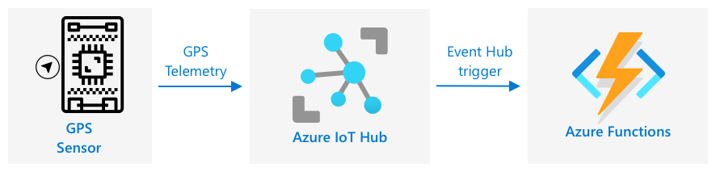

<!--
CO_OP_TRANSLATOR_METADATA:
{
  "original_hash": "e345843ccfeb7261d81500d19c64d476",
  "translation_date": "2025-08-27T00:58:44+00:00",
  "source_file": "3-transport/lessons/2-store-location-data/README.md",
  "language_code": "ar"
}
-->
# تخزين بيانات الموقع


> رسم توضيحي بواسطة [نيتيا ناراسيمهان](https://github.com/nitya). انقر على الصورة للحصول على نسخة أكبر.

## اختبار ما قبل المحاضرة

[اختبار ما قبل المحاضرة](https://black-meadow-040d15503.1.azurestaticapps.net/quiz/23)

## المقدمة

في الدرس السابق، تعلمت كيفية استخدام مستشعر GPS لالتقاط بيانات الموقع. لاستخدام هذه البيانات لتصور موقع شاحنة محملة بالطعام ورحلتها، يجب إرسالها إلى خدمة إنترنت الأشياء (IoT) في السحابة، ثم تخزينها في مكان ما.

في هذا الدرس، ستتعلم عن الطرق المختلفة لتخزين بيانات إنترنت الأشياء، وستتعلم كيفية تخزين البيانات من خدمة إنترنت الأشياء باستخدام الكود بدون خادم.

في هذا الدرس سنتناول:

* [البيانات المهيكلة وغير المهيكلة](../../../../../3-transport/lessons/2-store-location-data)
* [إرسال بيانات GPS إلى IoT Hub](../../../../../3-transport/lessons/2-store-location-data)
* [مسارات البيانات الساخنة، الدافئة، والباردة](../../../../../3-transport/lessons/2-store-location-data)
* [معالجة أحداث GPS باستخدام الكود بدون خادم](../../../../../3-transport/lessons/2-store-location-data)
* [حسابات تخزين Azure](../../../../../3-transport/lessons/2-store-location-data)
* [ربط الكود بدون خادم بالتخزين](../../../../../3-transport/lessons/2-store-location-data)

## البيانات المهيكلة وغير المهيكلة

تتعامل أنظمة الكمبيوتر مع البيانات، وهذه البيانات تأتي بأشكال وأحجام مختلفة. يمكن أن تتراوح من أرقام فردية إلى كميات كبيرة من النصوص، إلى مقاطع فيديو وصور، وإلى بيانات إنترنت الأشياء. عادةً ما يمكن تقسيم البيانات إلى واحدة من فئتين - *البيانات المهيكلة* و *البيانات غير المهيكلة*.

* **البيانات المهيكلة** هي بيانات ذات هيكل محدد جيدًا وثابت لا يتغير وعادةً ما يتم تعيينها إلى جداول بيانات ذات علاقات. مثال على ذلك هو تفاصيل شخص بما في ذلك اسمه، تاريخ ميلاده وعنوانه.

* **البيانات غير المهيكلة** هي بيانات بدون هيكل محدد جيدًا وثابت، بما في ذلك البيانات التي يمكن أن يتغير هيكلها بشكل متكرر. مثال على ذلك هو المستندات مثل الوثائق المكتوبة أو جداول البيانات.

✅ قم ببعض البحث: هل يمكنك التفكير في أمثلة أخرى للبيانات المهيكلة وغير المهيكلة؟

> 💁 هناك أيضًا بيانات شبه مهيكلة تكون مهيكلة ولكنها لا تتناسب مع جداول بيانات ثابتة.

عادةً ما تعتبر بيانات إنترنت الأشياء بيانات غير مهيكلة.

تخيل أنك تضيف أجهزة إنترنت الأشياء إلى أسطول من المركبات لمزرعة تجارية كبيرة. قد ترغب في استخدام أجهزة مختلفة لأنواع مختلفة من المركبات. على سبيل المثال:

* بالنسبة لمركبات المزرعة مثل الجرارات، تريد بيانات GPS لضمان عملها في الحقول الصحيحة.
* بالنسبة لشاحنات التوصيل التي تنقل الطعام إلى المستودعات، تريد بيانات GPS بالإضافة إلى بيانات السرعة والتسارع لضمان قيادة السائق بأمان، وبيانات هوية السائق وبدء/إيقاف لضمان الامتثال للقوانين المحلية بشأن ساعات العمل.
* بالنسبة للشاحنات المبردة، تريد أيضًا بيانات درجة الحرارة لضمان عدم ارتفاع أو انخفاض درجة حرارة الطعام بشكل كبير مما يؤدي إلى تلفه أثناء النقل.

يمكن أن تتغير هذه البيانات باستمرار. على سبيل المثال، إذا كان جهاز إنترنت الأشياء موجودًا في كابينة الشاحنة، فقد تتغير البيانات التي يرسلها مع تغيير المقطورة، على سبيل المثال إرسال بيانات درجة الحرارة فقط عند استخدام مقطورة مبردة.

✅ ما البيانات الأخرى التي يمكن أن يتم التقاطها بواسطة إنترنت الأشياء؟ فكر في أنواع الحمولات التي يمكن أن تحملها الشاحنات، بالإضافة إلى بيانات الصيانة.

تختلف هذه البيانات من مركبة إلى أخرى، ولكن يتم إرسالها جميعًا إلى نفس خدمة إنترنت الأشياء لمعالجتها. تحتاج خدمة إنترنت الأشياء إلى أن تكون قادرة على معالجة هذه البيانات غير المهيكلة، وتخزينها بطريقة تسمح بالبحث أو التحليل، ولكنها تعمل مع هياكل مختلفة لهذه البيانات.

### تخزين SQL مقابل NoSQL

تعد قواعد البيانات خدمات تسمح لك بتخزين البيانات واستعلامها. تأتي قواعد البيانات في نوعين - SQL و NoSQL.

#### قواعد بيانات SQL

كانت أول قواعد البيانات هي أنظمة إدارة قواعد البيانات العلائقية (RDBMS)، أو قواعد البيانات العلائقية. تُعرف أيضًا باسم قواعد بيانات SQL نسبةً إلى لغة الاستعلام الهيكلية (SQL) المستخدمة للتفاعل معها لإضافة أو إزالة أو تحديث أو استعلام البيانات. تتكون هذه القواعد من مخطط - مجموعة محددة جيدًا من جداول البيانات، مشابهة لجداول البيانات. يحتوي كل جدول على أعمدة مسماة متعددة. عندما تقوم بإدخال البيانات، تضيف صفًا إلى الجدول، وتضع القيم في كل من الأعمدة. يحافظ هذا على البيانات في هيكل صارم للغاية - على الرغم من أنه يمكنك ترك الأعمدة فارغة، إذا كنت تريد إضافة عمود جديد، يجب عليك القيام بذلك على قاعدة البيانات، وملء القيم للصفوف الموجودة. هذه القواعد علائقية - بمعنى أن جدولًا واحدًا يمكن أن يكون له علاقة بجدول آخر.


على سبيل المثال، إذا كنت تخزن تفاصيل شخصية للمستخدمين في جدول، فستكون لديك نوع من المعرف الفريد الداخلي لكل مستخدم يتم استخدامه في صف في جدول يحتوي على اسم المستخدم وعنوانه. إذا كنت تريد بعد ذلك تخزين تفاصيل أخرى عن هذا المستخدم، مثل مشترياته، في جدول آخر، فستكون لديك عمود واحد في الجدول الجديد لمعرف المستخدم. عندما تبحث عن مستخدم، يمكنك استخدام معرفه للحصول على تفاصيله الشخصية من جدول واحد، ومشترياته من جدول آخر.

تعد قواعد بيانات SQL مثالية لتخزين البيانات المهيكلة، ولضمان تطابق البيانات مع المخطط الخاص بك.

✅ إذا لم تستخدم SQL من قبل، خذ لحظة لقراءة المزيد عنها في [صفحة SQL على ويكيبيديا](https://wikipedia.org/wiki/SQL).

بعض قواعد بيانات SQL المعروفة هي Microsoft SQL Server، MySQL، و PostgreSQL.

✅ قم ببعض البحث: اقرأ عن بعض قواعد بيانات SQL هذه وقدراتها.

#### قواعد بيانات NoSQL

تُعرف قواعد بيانات NoSQL بهذا الاسم لأنها لا تحتوي على نفس الهيكل الصارم لقواعد بيانات SQL. تُعرف أيضًا باسم قواعد البيانات الوثائقية لأنها يمكنها تخزين البيانات غير المهيكلة مثل الوثائق.

> 💁 على الرغم من اسمها، تسمح بعض قواعد بيانات NoSQL باستخدام SQL لاستعلام البيانات.


لا تحتوي قواعد بيانات NoSQL على مخطط محدد مسبقًا يحد من كيفية تخزين البيانات، بل يمكنك إدخال أي بيانات غير مهيكلة، عادةً باستخدام وثائق JSON. يمكن تنظيم هذه الوثائق في مجلدات، مشابهة للملفات على جهاز الكمبيوتر الخاص بك. يمكن أن تحتوي كل وثيقة على حقول مختلفة عن الوثائق الأخرى - على سبيل المثال، إذا كنت تخزن بيانات إنترنت الأشياء من مركبات المزرعة، فقد تحتوي بعضها على حقول لبيانات التسارع والسرعة، وقد تحتوي أخرى على حقول لدرجة الحرارة في المقطورة. إذا كنت تريد إضافة نوع جديد من الشاحنات، مثل شاحنة مزودة بموازين مدمجة لتتبع وزن المنتجات المحملة، يمكن لجهاز إنترنت الأشياء الخاص بك إضافة هذا الحقل الجديد ويمكن تخزينه دون أي تغييرات على قاعدة البيانات.

بعض قواعد بيانات NoSQL المعروفة تشمل Azure CosmosDB، MongoDB، و CouchDB.

✅ قم ببعض البحث: اقرأ عن بعض قواعد بيانات NoSQL هذه وقدراتها.

في هذا الدرس، ستستخدم تخزين NoSQL لتخزين بيانات إنترنت الأشياء.

## إرسال بيانات GPS إلى IoT Hub

في الدرس السابق، قمت بالتقاط بيانات GPS من مستشعر GPS متصل بجهاز إنترنت الأشياء الخاص بك. لتخزين هذه البيانات في السحابة، تحتاج إلى إرسالها إلى خدمة إنترنت الأشياء. مرة أخرى، ستستخدم Azure IoT Hub، نفس خدمة إنترنت الأشياء السحابية التي استخدمتها في المشروع السابق.


### المهمة - إرسال بيانات GPS إلى IoT Hub

1. قم بإنشاء IoT Hub جديد باستخدام الطبقة المجانية.

    > ⚠️ يمكنك الرجوع إلى [تعليمات إنشاء IoT Hub من المشروع 2، الدرس 4](../../../2-farm/lessons/4-migrate-your-plant-to-the-cloud/README.md#create-an-iot-service-in-the-cloud) إذا لزم الأمر.

    تذكر إنشاء مجموعة موارد جديدة. قم بتسمية مجموعة الموارد الجديدة `gps-sensor`، واسم IoT Hub الجديد اسمًا فريدًا بناءً على `gps-sensor`، مثل `gps-sensor-<اسمك>`.

    > 💁 إذا كان لديك IoT Hub من المشروع السابق، يمكنك إعادة استخدامه. تذكر استخدام اسم هذا IoT Hub ومجموعة الموارد التي توجد فيها عند إنشاء خدمات أخرى.

1. أضف جهازًا جديدًا إلى IoT Hub. قم بتسمية هذا الجهاز `gps-sensor`. احصل على سلسلة الاتصال الخاصة بالجهاز.

1. قم بتحديث كود الجهاز الخاص بك لإرسال بيانات GPS إلى IoT Hub الجديد باستخدام سلسلة الاتصال الخاصة بالجهاز من الخطوة السابقة.

    > ⚠️ يمكنك الرجوع إلى [تعليمات توصيل جهازك بـ IoT من المشروع 2، الدرس 4](../../../2-farm/lessons/4-migrate-your-plant-to-the-cloud/README.md#connect-your-device-to-the-iot-service) إذا لزم الأمر.

1. عند إرسال بيانات GPS، قم بذلك كـ JSON بالتنسيق التالي:

    ```json
    {
        "gps" :
        {
            "lat" : <latitude>,
            "lon" : <longitude>
        }
    }
    ```

1. أرسل بيانات GPS كل دقيقة حتى لا تستخدم حصة الرسائل اليومية الخاصة بك.

إذا كنت تستخدم Wio Terminal، تذكر إضافة جميع المكتبات اللازمة، وضبط الوقت باستخدام خادم NTP. يجب أن يضمن الكود الخاص بك أيضًا أنه قد قرأ جميع البيانات من المنفذ التسلسلي قبل إرسال موقع GPS، باستخدام الكود الموجود من الدرس السابق. استخدم الكود التالي لإنشاء وثيقة JSON:

```cpp
DynamicJsonDocument doc(1024);
doc["gps"]["lat"] = gps.location.lat();
doc["gps"]["lon"] = gps.location.lng();
```

إذا كنت تستخدم جهاز إنترنت الأشياء الافتراضي، تذكر تثبيت جميع المكتبات اللازمة باستخدام بيئة افتراضية.

بالنسبة لكل من Raspberry Pi وجهاز إنترنت الأشياء الافتراضي، استخدم الكود الموجود من الدرس السابق للحصول على قيم خطوط الطول والعرض، ثم أرسلها بالتنسيق الصحيح لـ JSON باستخدام الكود التالي:

```python
message_json = { "gps" : { "lat":lat, "lon":lon } }
print("Sending telemetry", message_json)
message = Message(json.dumps(message_json))
```

> 💁 يمكنك العثور على هذا الكود في [code/wio-terminal](../../../../../3-transport/lessons/2-store-location-data/code/wio-terminal)، [code/pi](../../../../../3-transport/lessons/2-store-location-data/code/pi) أو [code/virtual-device](../../../../../3-transport/lessons/2-store-location-data/code/virtual-device) folder.

قم بتشغيل كود الجهاز الخاص بك وتأكد من تدفق الرسائل إلى IoT Hub باستخدام أمر CLI `az iot hub monitor-events`.

## مسارات البيانات الساخنة، الدافئة، والباردة

البيانات التي تتدفق من جهاز إنترنت الأشياء إلى السحابة لا تتم معالجتها دائمًا في الوقت الفعلي. بعض البيانات تحتاج إلى معالجة في الوقت الفعلي، بينما يمكن معالجة بيانات أخرى بعد فترة قصيرة، وبيانات أخرى يمكن معالجتها لاحقًا. يشير تدفق البيانات إلى خدمات مختلفة تعالج البيانات في أوقات مختلفة إلى المسارات الساخنة، الدافئة، والباردة.

### المسار الساخن

يشير المسار الساخن إلى البيانات التي تحتاج إلى معالجة في الوقت الفعلي أو قريب من الوقت الفعلي. ستستخدم بيانات المسار الساخن للتنبيهات، مثل الحصول على تنبيهات بأن مركبة تقترب من مستودع، أو أن درجة الحرارة في شاحنة مبردة مرتفعة جدًا.

للاستفادة من بيانات المسار الساخن، سيستجيب الكود الخاص بك للأحداث بمجرد استلامها بواسطة خدمات السحابة الخاصة بك.

### المسار الدافئ

يشير المسار الدافئ إلى البيانات التي يمكن معالجتها بعد فترة قصيرة من استلامها، على سبيل المثال للتقارير أو التحليلات قصيرة المدى. ستستخدم بيانات المسار الدافئ للتقارير اليومية عن مسافة المركبات، باستخدام البيانات التي تم جمعها في اليوم السابق.

يتم تخزين بيانات المسار الدافئ بمجرد استلامها بواسطة خدمة السحابة داخل نوع من التخزين الذي يمكن الوصول إليه بسرعة.

### المسار البارد

يشير المسار البارد إلى البيانات التاريخية، حيث يتم تخزين البيانات على المدى الطويل ليتم معالجتها عند الحاجة. على سبيل المثال، يمكنك استخدام المسار البارد للحصول على تقارير سنوية عن مسافة المركبات، أو تشغيل تحليلات على الطرق للعثور على الطريق الأمثل لتقليل تكاليف الوقود.

يتم تخزين بيانات المسار البارد في مستودعات البيانات - قواعد بيانات مصممة لتخزين كميات كبيرة من البيانات التي لن تتغير ويمكن استعلامها بسرعة وسهولة. عادةً ما يكون لديك وظيفة منتظمة في تطبيق السحابة الخاص بك تعمل في وقت منتظم كل يوم، أسبوع، أو شهر لنقل البيانات من تخزين المسار الدافئ إلى مستودع البيانات.

✅ فكر في البيانات التي قمت بجمعها حتى الآن في هذه الدروس. هل هي بيانات مسار ساخن، دافئ، أم بارد؟

## معالجة أحداث GPS باستخدام الكود بدون خادم

بمجرد تدفق البيانات إلى IoT Hub، يمكنك كتابة بعض الكود بدون خادم للاستماع إلى الأحداث المنشورة إلى نقطة النهاية المتوافقة مع Event-Hub. هذا هو المسار الدافئ - سيتم تخزين هذه البيانات واستخدامها في الدرس التالي للتقارير عن الرحلة.



### المهمة - معالجة أحداث GPS باستخدام الكود بدون خادم

1. قم بإنشاء تطبيق Azure Functions باستخدام CLI الخاص بـ Azure Functions. استخدم بيئة تشغيل Python، وقم بإنشائه في مجلد يسمى `gps-trigger`، واستخدم نفس الاسم لمشروع تطبيق Functions. تأكد من إنشاء بيئة افتراضية لاستخدامها.
> ⚠️ يمكنك الرجوع إلى [التعليمات لإنشاء مشروع Azure Functions من المشروع 2، الدرس 5](../../../2-farm/lessons/5-migrate-application-to-the-cloud/README.md#create-a-serverless-application) إذا لزم الأمر.
1. أضف مشغل حدث IoT Hub يستخدم نقطة النهاية المتوافقة مع Event Hub الخاصة بـ IoT Hub.

    > ⚠️ يمكنك الرجوع إلى [التعليمات لإنشاء مشغل حدث IoT Hub من المشروع 2، الدرس 5](../../../2-farm/lessons/5-migrate-application-to-the-cloud/README.md#create-an-iot-hub-event-trigger) إذا لزم الأمر.

1. قم بتعيين سلسلة الاتصال لنقطة النهاية المتوافقة مع Event Hub في ملف `local.settings.json`، واستخدم المفتاح الخاص بهذا الإدخال في ملف `function.json`.

1. استخدم تطبيق Azurite كمحاكي تخزين محلي.

1. قم بتشغيل تطبيق الوظائف الخاص بك للتأكد من أنه يتلقى الأحداث من جهاز GPS الخاص بك. تأكد من تشغيل جهاز IoT الخاص بك أيضًا وإرسال بيانات GPS.

    ```output
    Python EventHub trigger processed an event: {"gps": {"lat": 47.73481, "lon": -122.25701}}
    ```

## حسابات تخزين Azure


حسابات تخزين Azure هي خدمة تخزين متعددة الأغراض يمكنها تخزين البيانات بطرق متنوعة. يمكنك تخزين البيانات كـ blobs، في قوائم انتظار، في جداول، أو كملفات، وكل ذلك في نفس الوقت.

### تخزين Blob

كلمة *Blob* تعني كائنات كبيرة ثنائية، لكنها أصبحت مصطلحًا لأي بيانات غير منظمة. يمكنك تخزين أي بيانات في تخزين blob، من مستندات JSON التي تحتوي على بيانات IoT، إلى ملفات الصور والأفلام. يحتوي تخزين blob على مفهوم *الحاويات*، وهي دلائل مسماة يمكنك تخزين البيانات فيها، مشابهة للجداول في قاعدة بيانات علائقية. يمكن أن تحتوي هذه الحاويات على مجلدات لتخزين blobs، ويمكن لكل مجلد أن يحتوي على مجلدات أخرى، مشابهة لكيفية تخزين الملفات على القرص الصلب لجهاز الكمبيوتر الخاص بك.

ستستخدم تخزين blob في هذا الدرس لتخزين بيانات IoT.

✅ قم ببعض البحث: اقرأ عن [Azure Blob Storage](https://docs.microsoft.com/azure/storage/blobs/storage-blobs-overview?WT.mc_id=academic-17441-jabenn)

### تخزين الجداول

يسمح تخزين الجداول بتخزين البيانات شبه المنظمة. تخزين الجداول هو في الواقع قاعدة بيانات NoSQL، لذا لا يتطلب مجموعة محددة من الجداول مسبقًا، ولكنه مصمم لتخزين البيانات في جدول أو أكثر، مع مفاتيح فريدة لتحديد كل صف.

✅ قم ببعض البحث: اقرأ عن [Azure Table Storage](https://docs.microsoft.com/azure/storage/tables/table-storage-overview?WT.mc_id=academic-17441-jabenn)

### تخزين قوائم الانتظار

يسمح تخزين قوائم الانتظار بتخزين رسائل تصل إلى حجم 64KB في قائمة انتظار. يمكنك إضافة رسائل إلى نهاية قائمة الانتظار، وقراءتها من البداية. تخزن قوائم الانتظار الرسائل إلى أجل غير مسمى طالما أن هناك مساحة تخزين متاحة، مما يسمح بتخزين الرسائل على المدى الطويل ثم قراءتها عند الحاجة. على سبيل المثال، إذا كنت ترغب في تشغيل مهمة شهرية لمعالجة بيانات GPS، يمكنك إضافتها إلى قائمة الانتظار كل يوم لمدة شهر، ثم في نهاية الشهر معالجة جميع الرسائل من قائمة الانتظار.

✅ قم ببعض البحث: اقرأ عن [Azure Queue Storage](https://docs.microsoft.com/azure/storage/queues/storage-queues-introduction?WT.mc_id=academic-17441-jabenn)

### تخزين الملفات

تخزين الملفات هو تخزين الملفات في السحابة، ويمكن لأي تطبيقات أو أجهزة الاتصال باستخدام بروتوكولات قياسية. يمكنك كتابة ملفات إلى تخزين الملفات، ثم تركيبها كقرص على جهاز الكمبيوتر الخاص بك أو جهاز Mac.

✅ قم ببعض البحث: اقرأ عن [Azure File Storage](https://docs.microsoft.com/azure/storage/files/storage-files-introduction?WT.mc_id=academic-17441-jabenn)

## ربط الكود بدون خادم بالتخزين

يحتاج تطبيق الوظائف الخاص بك الآن إلى الاتصال بتخزين blob لتخزين الرسائل من IoT Hub. هناك طريقتان للقيام بذلك:

* داخل كود الوظيفة، قم بالاتصال بتخزين blob باستخدام Python SDK الخاص بتخزين blob وكتابة البيانات كـ blobs.
* استخدم ربط وظيفة الإخراج لربط قيمة الإرجاع للوظيفة بتخزين blob وحفظ blob تلقائيًا.

في هذا الدرس، ستستخدم Python SDK لمعرفة كيفية التفاعل مع تخزين blob.


سيتم حفظ البيانات كـ JSON blob بالتنسيق التالي:

```json
{
    "device_id": <device_id>,
    "timestamp" : <time>,
    "gps" :
    {
        "lat" : <latitude>,
        "lon" : <longitude>
    }
}
```

### المهمة - ربط الكود بدون خادم بالتخزين

1. قم بإنشاء حساب تخزين Azure. قم بتسميته شيئًا مثل `gps<اسمك>`.

    > ⚠️ يمكنك الرجوع إلى [التعليمات لإنشاء حساب تخزين من المشروع 2، الدرس 5](../../../2-farm/lessons/5-migrate-application-to-the-cloud/README.md#task---create-the-cloud-resources) إذا لزم الأمر.

    إذا كان لديك حساب تخزين من المشروع السابق، يمكنك إعادة استخدامه.

    > 💁 ستتمكن من استخدام نفس حساب التخزين لنشر تطبيق Azure Functions الخاص بك لاحقًا في هذا الدرس.

1. قم بتشغيل الأمر التالي للحصول على سلسلة الاتصال لحساب التخزين:

    ```sh
    az storage account show-connection-string --output table \
                                              --name <storage_name>
    ```

    استبدل `<storage_name>` باسم حساب التخزين الذي أنشأته في الخطوة السابقة.

1. أضف إدخالًا جديدًا إلى ملف `local.settings.json` لسلسلة الاتصال الخاصة بحساب التخزين، باستخدام القيمة من الخطوة السابقة. قم بتسميته `STORAGE_CONNECTION_STRING`.

1. أضف ما يلي إلى ملف `requirements.txt` لتثبيت حزم Pip الخاصة بتخزين Azure:

    ```sh
    azure-storage-blob
    ```

    قم بتثبيت الحزم من هذا الملف في بيئتك الافتراضية.

    > إذا حصلت على خطأ، قم بترقية إصدار Pip في بيئتك الافتراضية إلى أحدث إصدار باستخدام الأمر التالي، ثم حاول مرة أخرى:
    >
    > ```sh
    > pip install --upgrade pip
    > ```

1. في ملف `__init__.py` الخاص بـ `iot-hub-trigger`، أضف عبارات الاستيراد التالية:

    ```python
    import json
    import os
    import uuid
    from azure.storage.blob import BlobServiceClient, PublicAccess
    ```

    سيتم استخدام وحدة النظام `json` لقراءة وكتابة JSON، ووحدة النظام `os` لقراءة سلسلة الاتصال، ووحدة النظام `uuid` لإنشاء معرف فريد لقراءة GPS.

    تحتوي حزمة `azure.storage.blob` على Python SDK للعمل مع تخزين blob.

1. قبل طريقة `main`، أضف وظيفة المساعد التالية:

    ```python
    def get_or_create_container(name):
        connection_str = os.environ['STORAGE_CONNECTION_STRING']
        blob_service_client = BlobServiceClient.from_connection_string(connection_str)
    
        for container in blob_service_client.list_containers():
            if container.name == name:
                return blob_service_client.get_container_client(container.name)
        
        return blob_service_client.create_container(name, public_access=PublicAccess.Container)
    ```

    لا يحتوي Python blob SDK على طريقة مساعد لإنشاء حاوية إذا لم تكن موجودة. يقوم هذا الكود بتحميل سلسلة الاتصال من ملف `local.settings.json` (أو إعدادات التطبيق بمجرد نشره في السحابة)، ثم إنشاء فئة `BlobServiceClient` من هذا للتفاعل مع حساب تخزين blob. ثم يقوم بالبحث في جميع الحاويات الخاصة بحساب تخزين blob، بحثًا عن واحدة بالاسم المقدم - إذا وجد واحدة، فإنه يعيد فئة `ContainerClient` التي يمكنها التفاعل مع الحاوية لإنشاء blobs. إذا لم يجد واحدة، يتم إنشاء الحاوية ويتم إرجاع العميل للحاوية الجديدة.

    عند إنشاء الحاوية الجديدة، يتم منح الوصول العام للاستعلام عن blobs في الحاوية. سيتم استخدام هذا في الدرس التالي لتصور بيانات GPS على الخريطة.

1. على عكس رطوبة التربة، مع هذا الكود نريد تخزين كل حدث، لذا أضف الكود التالي داخل حلقة `for event in events:` في وظيفة `main`، أسفل عبارة `logging`:

    ```python
    device_id = event.iothub_metadata['connection-device-id']
    blob_name = f'{device_id}/{str(uuid.uuid1())}.json'
    ```

    يحصل هذا الكود على معرف الجهاز من بيانات الحدث، ثم يستخدمه لإنشاء اسم blob. يمكن تخزين blobs في مجلدات، وسيتم استخدام معرف الجهاز كاسم المجلد، بحيث يكون لكل جهاز جميع أحداث GPS الخاصة به في مجلد واحد. اسم blob هو هذا المجلد، يليه اسم المستند، مفصولًا بشرطة مائلة للأمام، مشابهة لمسارات Linux وmacOS (مشابهة أيضًا لـ Windows، ولكن Windows يستخدم الشرطة المائلة للخلف). اسم المستند هو معرف فريد يتم إنشاؤه باستخدام وحدة Python `uuid`، مع نوع الملف `json`.

    على سبيل المثال، بالنسبة لمعرف الجهاز `gps-sensor`، قد يكون اسم blob هو `gps-sensor/a9487ac2-b9cf-11eb-b5cd-1e00621e3648.json`.

1. أضف الكود التالي أسفل هذا:

    ```python
    container_client = get_or_create_container('gps-data')
    blob = container_client.get_blob_client(blob_name)
    ```

    يحصل هذا الكود على عميل الحاوية باستخدام فئة المساعد `get_or_create_container`، ثم يحصل على كائن عميل blob باستخدام اسم blob. يمكن أن تشير عملاء blob إلى blobs موجودة، أو كما في هذه الحالة، إلى blob جديد.

1. أضف الكود التالي بعد هذا:

    ```python
    event_body = json.loads(event.get_body().decode('utf-8'))
    blob_body = {
        'device_id' : device_id,
        'timestamp' : event.iothub_metadata['enqueuedtime'],
        'gps': event_body['gps']
    }
    ```

    يقوم هذا ببناء جسم blob الذي سيتم كتابته إلى تخزين blob. إنه مستند JSON يحتوي على معرف الجهاز، وقت إرسال البيانات إلى IoT Hub، وإحداثيات GPS من البيانات.

    > 💁 من المهم استخدام وقت إدراج الرسالة بدلاً من الوقت الحالي للحصول على الوقت الذي تم إرسال الرسالة فيه. قد تكون جالسة على hub لفترة قبل أن يتم التقاطها إذا لم يكن تطبيق الوظائف قيد التشغيل.

1. أضف الكود التالي أسفل هذا:

    ```python
    logging.info(f'Writing blob to {blob_name} - {blob_body}')
    blob.upload_blob(json.dumps(blob_body).encode('utf-8'))
    ```

    يسجل هذا الكود أن blob على وشك أن يتم كتابته مع تفاصيله، ثم يرفع جسم blob كمحتوى للـ blob الجديد.

1. قم بتشغيل تطبيق الوظائف. سترى blobs يتم كتابتها لجميع أحداث GPS في الإخراج:

    ```output
    [2021-05-21T01:31:14.325Z] Python EventHub trigger processed an event: {"gps": {"lat": 47.73092, "lon": -122.26206}}
    ...
    [2021-05-21T01:31:14.351Z] Writing blob to gps-sensor/4b6089fe-ba8d-11eb-bc7b-1e00621e3648.json - {'device_id': 'gps-sensor', 'timestamp': '2021-05-21T00:57:53.878Z', 'gps': {'lat': 47.73092, 'lon': -122.26206}}
    ```

    > 💁 تأكد من أنك لا تقوم بتشغيل مراقب أحداث IoT Hub في نفس الوقت.

> 💁 يمكنك العثور على هذا الكود في [code/functions](../../../../../3-transport/lessons/2-store-location-data/code/functions) المجلد.

### المهمة - التحقق من الـ blobs المرفوعة

1. لعرض الـ blobs التي تم إنشاؤها، يمكنك استخدام [Azure Storage Explorer](https://azure.microsoft.com/features/storage-explorer/?WT.mc_id=academic-17441-jabenn)، أداة مجانية تتيح لك عرض وإدارة حسابات التخزين الخاصة بك، أو من CLI.

    1. لاستخدام CLI، أولاً ستحتاج إلى مفتاح الحساب. قم بتشغيل الأمر التالي للحصول على هذا المفتاح:

        ```sh
        az storage account keys list --output table \
                                     --account-name <storage_name>
        ```

        استبدل `<storage_name>` باسم حساب التخزين.

        انسخ قيمة `key1`.

    1. قم بتشغيل الأمر التالي لسرد الـ blobs في الحاوية:

        ```sh
        az storage blob list --container-name gps-data \
                             --output table \
                             --account-name <storage_name> \
                             --account-key <key1>
        ```

        استبدل `<storage_name>` باسم حساب التخزين، و`<key1>` بالقيمة التي نسختها في الخطوة الأخيرة.

        سيقوم هذا بسرد جميع الـ blobs في الحاوية:

        ```output
        Name                                                  Blob Type    Blob Tier    Length    Content Type              Last Modified              Snapshot
        ----------------------------------------------------  -----------  -----------  --------  ------------------------  -------------------------  ----------
        gps-sensor/1810d55e-b9cf-11eb-9f5b-1e00621e3648.json  BlockBlob    Hot          45        application/octet-stream  2021-05-21T00:54:27+00:00
        gps-sensor/18293e46-b9cf-11eb-9f5b-1e00621e3648.json  BlockBlob    Hot          45        application/octet-stream  2021-05-21T00:54:28+00:00
        gps-sensor/1844549c-b9cf-11eb-9f5b-1e00621e3648.json  BlockBlob    Hot          45        application/octet-stream  2021-05-21T00:54:28+00:00
        gps-sensor/1894d714-b9cf-11eb-9f5b-1e00621e3648.json  BlockBlob    Hot          45        application/octet-stream  2021-05-21T00:54:28+00:00
        ```

    1. قم بتنزيل أحد الـ blobs باستخدام الأمر التالي:

        ```sh
        az storage blob download --container-name gps-data \
                                 --account-name <storage_name> \
                                 --account-key <key1> \
                                 --name <blob_name> \
                                 --file <file_name>
        ```

        استبدل `<storage_name>` باسم حساب التخزين، و`<key1>` بالقيمة التي نسختها في الخطوة السابقة.

        استبدل `<blob_name>` بالاسم الكامل من عمود `Name` في إخراج الخطوة الأخيرة، بما في ذلك اسم المجلد. استبدل `<file_name>` باسم ملف محلي لحفظ الـ blob فيه.

    بمجرد التنزيل، يمكنك فتح ملف JSON في VS Code، وسترى الـ blob يحتوي على تفاصيل موقع GPS:

    ```json
    {"device_id": "gps-sensor", "timestamp": "2021-05-21T00:57:53.878Z", "gps": {"lat": 47.73092, "lon": -122.26206}}
    ```

### المهمة - نشر تطبيق الوظائف الخاص بك إلى السحابة

الآن بعد أن أصبح تطبيق الوظائف الخاص بك يعمل، يمكنك نشره إلى السحابة.

1. قم بإنشاء تطبيق وظائف Azure جديد، باستخدام حساب التخزين الذي أنشأته سابقًا. قم بتسميته شيئًا مثل `gps-sensor-` وأضف معرفًا فريدًا في النهاية، مثل بعض الكلمات العشوائية أو اسمك.

    > ⚠️ يمكنك الرجوع إلى [التعليمات لإنشاء تطبيق وظائف من المشروع 2، الدرس 5](../../../2-farm/lessons/5-migrate-application-to-the-cloud/README.md#task---create-the-cloud-resources) إذا لزم الأمر.

1. قم برفع قيم `IOT_HUB_CONNECTION_STRING` و`STORAGE_CONNECTION_STRING` إلى إعدادات التطبيق.

    > ⚠️ يمكنك الرجوع إلى [التعليمات لرفع إعدادات التطبيق من المشروع 2، الدرس 5](../../../2-farm/lessons/5-migrate-application-to-the-cloud/README.md#task---upload-your-application-settings) إذا لزم الأمر.

1. قم بنشر تطبيق الوظائف المحلي الخاص بك إلى السحابة.
> ⚠️ يمكنك الرجوع إلى [التعليمات الخاصة بنشر تطبيق Functions الخاص بك من المشروع 2، الدرس 5](../../../2-farm/lessons/5-migrate-application-to-the-cloud/README.md#task---deploy-your-functions-app-to-the-cloud) إذا لزم الأمر.
---

## 🚀 التحدي

بيانات GPS ليست دقيقة تمامًا، وقد تكون المواقع المكتشفة غير صحيحة ببضعة أمتار، خاصة في الأنفاق والمناطق ذات المباني العالية.

فكر في كيفية تمكن الملاحة عبر الأقمار الصناعية من التغلب على هذه المشكلة؟ ما البيانات التي يمتلكها جهاز الملاحة الخاص بك والتي يمكن أن تساعده في تقديم توقعات أفضل لموقعك؟

## اختبار ما بعد المحاضرة

[اختبار ما بعد المحاضرة](https://black-meadow-040d15503.1.azurestaticapps.net/quiz/24)

## المراجعة والدراسة الذاتية

* اقرأ عن البيانات المهيكلة في [صفحة نموذج البيانات على ويكيبيديا](https://wikipedia.org/wiki/Data_model)
* اقرأ عن البيانات شبه المهيكلة في [صفحة البيانات شبه المهيكلة على ويكيبيديا](https://wikipedia.org/wiki/Semi-structured_data)
* اقرأ عن البيانات غير المهيكلة في [صفحة البيانات غير المهيكلة على ويكيبيديا](https://wikipedia.org/wiki/Unstructured_data)
* اقرأ المزيد عن تخزين Azure وأنواع التخزين المختلفة في [وثائق تخزين Azure](https://docs.microsoft.com/azure/storage/?WT.mc_id=academic-17441-jabenn)

## الواجب

[تحقيق في روابط الوظائف](assignment.md)

---

**إخلاء المسؤولية**:  
تم ترجمة هذا المستند باستخدام خدمة الترجمة بالذكاء الاصطناعي [Co-op Translator](https://github.com/Azure/co-op-translator). بينما نسعى لتحقيق الدقة، يرجى العلم أن الترجمات الآلية قد تحتوي على أخطاء أو معلومات غير دقيقة. يجب اعتبار المستند الأصلي بلغته الأصلية المصدر الرسمي. للحصول على معلومات حاسمة، يُوصى بالاستعانة بترجمة بشرية احترافية. نحن غير مسؤولين عن أي سوء فهم أو تفسيرات خاطئة تنشأ عن استخدام هذه الترجمة.