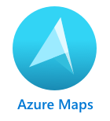

<!--
CO_OP_TRANSLATOR_METADATA:
{
  "original_hash": "9095c61445c2bca7245ef9b59a186a11",
  "translation_date": "2025-08-27T00:53:13+00:00",
  "source_file": "3-transport/lessons/3-visualize-location-data/README.md",
  "language_code": "ar"
}
-->
# تصور بيانات الموقع


> رسم توضيحي بواسطة [نيتيا ناراسيمهان](https://github.com/nitya). انقر على الصورة للحصول على نسخة أكبر.

يقدم هذا الفيديو نظرة عامة على Azure Maps مع إنترنت الأشياء، وهي خدمة سيتم تغطيتها في هذا الدرس.

[](https://www.youtube.com/watch?v=P5i2GFTtb2s)

> 🎥 انقر على الصورة أعلاه لمشاهدة الفيديو

## اختبار قبل المحاضرة

[اختبار قبل المحاضرة](https://black-meadow-040d15503.1.azurestaticapps.net/quiz/25)

## المقدمة

في الدرس السابق، تعلمت كيفية الحصول على بيانات GPS من مستشعراتك وحفظها في السحابة داخل حاوية تخزين باستخدام كود بدون خادم. الآن ستكتشف كيفية تصور هذه النقاط على خريطة Azure. ستتعلم كيفية إنشاء خريطة على صفحة ويب، والتعرف على تنسيق بيانات GeoJSON وكيفية استخدامه لرسم جميع نقاط GPS الملتقطة على خريطتك.

في هذا الدرس سنغطي:

* [ما هو تصور البيانات](../../../../../3-transport/lessons/3-visualize-location-data)
* [خدمات الخرائط](../../../../../3-transport/lessons/3-visualize-location-data)
* [إنشاء مورد Azure Maps](../../../../../3-transport/lessons/3-visualize-location-data)
* [عرض خريطة على صفحة ويب](../../../../../3-transport/lessons/3-visualize-location-data)
* [تنسيق GeoJSON](../../../../../3-transport/lessons/3-visualize-location-data)
* [رسم بيانات GPS على خريطة باستخدام GeoJSON](../../../../../3-transport/lessons/3-visualize-location-data)

> 💁 سيتضمن هذا الدرس كمية صغيرة من HTML وJavaScript. إذا كنت ترغب في معرفة المزيد عن تطوير الويب باستخدام HTML وJavaScript، تحقق من [تطوير الويب للمبتدئين](https://github.com/microsoft/Web-Dev-For-Beginners).

## ما هو تصور البيانات

تصور البيانات، كما يوحي الاسم، يتعلق بتصور البيانات بطرق تجعلها أسهل للفهم البشري. عادةً ما يرتبط بالمخططات والرسوم البيانية، ولكنه أي طريقة لتمثيل البيانات بصريًا لمساعدة البشر على فهم البيانات بشكل أفضل واتخاذ القرارات.

لنأخذ مثالًا بسيطًا - في مشروع المزرعة، قمت بجمع قراءات رطوبة التربة. قد تكون بيانات رطوبة التربة التي تم جمعها كل ساعة في 1 يونيو 2021 كما يلي:

| التاريخ          | القراءة |
| ---------------- | ------: |
| 01/06/2021 00:00 |     257 |
| 01/06/2021 01:00 |     268 |
| 01/06/2021 02:00 |     295 |
| 01/06/2021 03:00 |     305 |
| 01/06/2021 04:00 |     325 |
| 01/06/2021 05:00 |     359 |
| 01/06/2021 06:00 |     398 |
| 01/06/2021 07:00 |     410 |
| 01/06/2021 08:00 |     429 |
| 01/06/2021 09:00 |     451 |
| 01/06/2021 10:00 |     460 |
| 01/06/2021 11:00 |     452 |
| 01/06/2021 12:00 |     420 |
| 01/06/2021 13:00 |     408 |
| 01/06/2021 14:00 |     431 |
| 01/06/2021 15:00 |     462 |
| 01/06/2021 16:00 |     432 |
| 01/06/2021 17:00 |     402 |
| 01/06/2021 18:00 |     387 |
| 01/06/2021 19:00 |     360 |
| 01/06/2021 20:00 |     358 |
| 01/06/2021 21:00 |     354 |
| 01/06/2021 22:00 |     356 |
| 01/06/2021 23:00 |     362 |

بالنسبة للبشر، قد يكون فهم هذه البيانات صعبًا. إنها مجرد أرقام بدون معنى. كخطوة أولى لتصور هذه البيانات، يمكن رسمها على مخطط خطي:


يمكن تحسين هذا المخطط بإضافة خط يشير إلى وقت تشغيل نظام الري التلقائي عند قراءة رطوبة التربة 450:


يوضح هذا المخطط بسرعة ليس فقط مستويات رطوبة التربة، ولكن أيضًا النقاط التي تم فيها تشغيل نظام الري.

المخططات ليست الأداة الوحيدة لتصور البيانات. يمكن لأجهزة إنترنت الأشياء التي تتبع الطقس أن تحتوي على تطبيقات ويب أو تطبيقات جوال تصور ظروف الطقس باستخدام رموز، مثل رمز السحابة للأيام الغائمة، ورمز السحابة الممطرة للأيام الممطرة، وهكذا. هناك عدد كبير من الطرق لتصور البيانات، بعضها جاد وبعضها ممتع.

✅ فكر في الطرق التي رأيت بها البيانات مصورة. أي الطرق كانت الأكثر وضوحًا وساعدتك على اتخاذ القرارات بشكل أسرع؟

أفضل التصورات هي التي تسمح للبشر باتخاذ القرارات بسرعة. على سبيل المثال، وجود جدار مليء بالمقاييس التي تعرض جميع أنواع القراءات من الآلات الصناعية قد يكون صعبًا في المعالجة، ولكن وجود ضوء أحمر وامض عند حدوث خطأ ما يسمح للإنسان باتخاذ قرار. أحيانًا يكون أفضل تصور هو ضوء وامض!

عند العمل مع بيانات GPS، قد يكون التصور الأكثر وضوحًا هو رسم البيانات على خريطة. على سبيل المثال، يمكن أن تساعد خريطة تعرض شاحنات التوصيل العمال في مصنع معالجة على معرفة وقت وصول الشاحنات. إذا أظهرت هذه الخريطة أكثر من مجرد صور للشاحنات في مواقعها الحالية، ولكنها قدمت فكرة عن محتويات الشاحنة، يمكن للعمال في المصنع التخطيط وفقًا لذلك - إذا رأوا شاحنة مبردة قريبة، فإنهم يعرفون أنهم بحاجة إلى تجهيز مساحة في الثلاجة.

## خدمات الخرائط

العمل مع الخرائط هو تمرين مثير للاهتمام، وهناك العديد من الخيارات مثل Bing Maps، وLeaflet، وOpen Street Maps، وGoogle Maps. في هذا الدرس، ستتعلم عن [Azure Maps](https://azure.microsoft.com/services/azure-maps/?WT.mc_id=academic-17441-jabenn) وكيف يمكنها عرض بيانات GPS الخاصة بك.



Azure Maps هي "مجموعة من الخدمات الجغرافية المكانية وSDKs التي تستخدم بيانات خرائط حديثة لتوفير سياق جغرافي لتطبيقات الويب والجوال." يتم تزويد المطورين بأدوات لإنشاء خرائط تفاعلية وجميلة يمكنها القيام بأشياء مثل توفير مسارات المرور الموصى بها، تقديم معلومات عن حوادث المرور، التنقل الداخلي، قدرات البحث، معلومات الارتفاع، خدمات الطقس والمزيد.

✅ جرب بعض [أمثلة كود الخرائط](https://docs.microsoft.com/samples/browse?WT.mc_id=academic-17441-jabenn&products=azure-maps)

يمكنك عرض الخرائط كقماش فارغ، أو كصور أقمار صناعية، أو صور أقمار صناعية مع الطرق المرسومة فوقها، أو أنواع مختلفة من الخرائط الرمادية، أو خرائط مع تظليل لإظهار الارتفاع، أو خرائط ليلية، أو خريطة عالية التباين. يمكنك الحصول على تحديثات في الوقت الفعلي على خرائطك من خلال دمجها مع [Azure Event Grid](https://azure.microsoft.com/services/event-grid/?WT.mc_id=academic-17441-jabenn). يمكنك التحكم في سلوك ومظهر خرائطك من خلال تمكين عناصر تحكم مختلفة للسماح للخريطة بالتفاعل مع الأحداث مثل التكبير، السحب، والنقر. للتحكم في مظهر خريطتك، يمكنك إضافة طبقات تتضمن فقاعات، خطوط، مضلعات، خرائط حرارية، والمزيد. يعتمد نوع الخريطة التي تنفذها على اختيارك لـ SDK.

يمكنك الوصول إلى واجهات برمجة تطبيقات Azure Maps باستخدام [REST API](https://docs.microsoft.com/javascript/api/azure-maps-rest/?WT.mc_id=academic-17441-jabenn&view=azure-maps-typescript-latest)، أو [Web SDK](https://docs.microsoft.com/azure/azure-maps/how-to-use-map-control?WT.mc_id=academic-17441-jabenn)، أو إذا كنت تقوم ببناء تطبيق جوال، [Android SDK](https://docs.microsoft.com/azure/azure-maps/how-to-use-android-map-control-library?WT.mc_id=academic-17441-jabenn&pivots=programming-language-java-android).

في هذا الدرس، ستستخدم Web SDK لرسم خريطة وعرض مسار موقع GPS الخاص بمستشعرك.

## إنشاء مورد Azure Maps

خطوتك الأولى هي إنشاء حساب Azure Maps.

### المهمة - إنشاء مورد Azure Maps

1. قم بتشغيل الأمر التالي من Terminal أو Command Prompt لإنشاء مورد Azure Maps في مجموعة الموارد `gps-sensor`:

    ```sh
    az maps account create --name gps-sensor \
                           --resource-group gps-sensor \
                           --accept-tos \
                           --sku S1
    ```

    سيؤدي هذا إلى إنشاء مورد Azure Maps يسمى `gps-sensor`. الطبقة المستخدمة هي `S1`، وهي طبقة مدفوعة تتضمن مجموعة من الميزات، ولكن مع عدد كبير من المكالمات المجانية.

    > 💁 لمعرفة تكلفة استخدام Azure Maps، تحقق من [صفحة تسعير Azure Maps](https://azure.microsoft.com/pricing/details/azure-maps/?WT.mc_id=academic-17441-jabenn).

1. ستحتاج إلى مفتاح API لمورد الخرائط. استخدم الأمر التالي للحصول على هذا المفتاح:

    ```sh
    az maps account keys list --name gps-sensor \
                              --resource-group gps-sensor \
                              --output table
    ```

    قم بنسخ قيمة `PrimaryKey`.

## عرض خريطة على صفحة ويب

الآن يمكنك الانتقال إلى الخطوة التالية وهي عرض خريطتك على صفحة ويب. سنستخدم ملف `html` واحد فقط لتطبيق الويب الصغير الخاص بك؛ ضع في اعتبارك أنه في بيئة إنتاج أو فريق، سيكون لتطبيق الويب الخاص بك أجزاء متحركة أكثر!

### المهمة - عرض خريطة على صفحة ويب

1. قم بإنشاء ملف يسمى index.html في مجلد ما على جهاز الكمبيوتر الخاص بك. أضف تعليمات HTML البرمجية لاحتواء الخريطة:

    ```html
    <html>
    <head>
        <style>
            #myMap {
                width:100%;
                height:100%;
            }
        </style>
    </head>
    
    <body onload="init()">
        <div id="myMap"></div>
    </body>
    </html>
    ```

    سيتم تحميل الخريطة في `div` المسمى `myMap`. بعض الأنماط تسمح لها بملء عرض وارتفاع الصفحة.

    > 🎓 `div` هو قسم من صفحة ويب يمكن تسميته وتنسيقه.

1. تحت علامة `<head>` الافتتاحية، أضف ورقة أنماط خارجية للتحكم في عرض الخريطة، ونصًا خارجيًا من Web SDK لإدارة سلوكها:

    ```html
    <link rel="stylesheet" href="https://atlas.microsoft.com/sdk/javascript/mapcontrol/2/atlas.min.css" type="text/css" />
    <script src="https://atlas.microsoft.com/sdk/javascript/mapcontrol/2/atlas.min.js"></script>
    ```

    تحتوي ورقة الأنماط هذه على الإعدادات الخاصة بكيفية ظهور الخريطة، ويحتوي ملف النص البرمجي على الكود لتحميل الخريطة. إضافة هذا الكود يشبه تضمين ملفات رأس C++ أو استيراد وحدات Python.

1. تحت هذا النص البرمجي، أضف كتلة نص برمجي لتشغيل الخريطة.

    ```javascript
    <script type='text/javascript'>
        function init() {
            var map = new atlas.Map('myMap', {
                center: [-122.26473, 47.73444],
                zoom: 12,
                authOptions: {
                    authType: "subscriptionKey",
                    subscriptionKey: "<subscription_key>",

                }
            });
        }
    </script>
    ```

    استبدل `<subscription_key>` بمفتاح API الخاص بحساب Azure Maps الخاص بك.

    إذا فتحت صفحة `index.html` الخاصة بك في متصفح ويب، يجب أن ترى خريطة محملة ومركزة على منطقة سياتل.

    

    ✅ جرب معلمات التكبير والتوسيط لتغيير عرض الخريطة. يمكنك إضافة إحداثيات مختلفة تتوافق مع خطوط الطول والعرض لبياناتك لإعادة توسيط الخريطة.

> 💁 طريقة أفضل للعمل مع تطبيقات الويب محليًا هي تثبيت [http-server](https://www.npmjs.com/package/http-server). ستحتاج إلى [node.js](https://nodejs.org/) و[npm](https://www.npmjs.com/) مثبتين قبل استخدام هذه الأداة. بمجرد تثبيت هذه الأدوات، يمكنك الانتقال إلى موقع ملف `index.html` الخاص بك وكتابة `http-server`. سيفتح تطبيق الويب على خادم ويب محلي [http://127.0.0.1:8080/](http://127.0.0.1:8080/).

## تنسيق GeoJSON

الآن بعد أن أصبح لديك تطبيق الويب الخاص بك في مكانه مع عرض الخريطة، تحتاج إلى استخراج بيانات GPS من حساب التخزين الخاص بك وعرضها في طبقة من العلامات فوق الخريطة. قبل أن نفعل ذلك، دعنا نلقي نظرة على تنسيق [GeoJSON](https://wikipedia.org/wiki/GeoJSON) المطلوب من Azure Maps.

[GeoJSON](https://geojson.org/) هو معيار مفتوح لتنسيق JSON مع تنسيق خاص مصمم للتعامل مع البيانات الجغرافية. يمكنك التعرف عليه من خلال اختبار بيانات نموذجية باستخدام [geojson.io](https://geojson.io)، وهو أيضًا أداة مفيدة لتصحيح ملفات GeoJSON.

تبدو بيانات GeoJSON النموذجية كما يلي:

```json
{
  "type": "FeatureCollection",
  "features": [
    {
      "type": "Feature",
      "geometry": {
        "type": "Point",
        "coordinates": [
          -2.10237979888916,
          57.164918677004714
        ]
      }
    }
  ]
}
```

ما يهمنا بشكل خاص هو الطريقة التي يتم بها تضمين البيانات كـ `Feature` داخل `FeatureCollection`. داخل هذا الكائن يمكن العثور على `geometry` مع `coordinates` التي تشير إلى خطوط الطول والعرض.

✅ عند بناء GeoJSON الخاص بك، انتبه لترتيب `latitude` و`longitude` في الكائن، وإلا لن تظهر النقاط في أماكنها الصحيحة! يتوقع GeoJSON البيانات بترتيب `lon,lat` للنقاط، وليس `lat,lon`.

يمكن أن يكون لـ `Geometry` أنواع مختلفة، مثل نقطة واحدة أو مضلع. في هذا المثال، هي نقطة مع إحداثيين محددين، خط الطول وخط العرض.
✅ تدعم Azure Maps معيار GeoJSON بالإضافة إلى بعض [الميزات المحسّنة](https://docs.microsoft.com/azure/azure-maps/extend-geojson?WT.mc_id=academic-17441-jabenn) بما في ذلك القدرة على رسم الدوائر والهندسيات الأخرى.

## عرض بيانات GPS على الخريطة باستخدام GeoJSON

الآن أصبحت جاهزًا لاستهلاك البيانات من التخزين الذي قمت ببنائه في الدرس السابق. للتذكير، يتم تخزينها كعدد من الملفات في تخزين blob، لذا ستحتاج إلى استرجاع الملفات وتحليلها حتى تتمكن Azure Maps من استخدام البيانات.

### المهمة - إعداد التخزين ليتم الوصول إليه من صفحة ويب

إذا قمت بإجراء طلب إلى التخزين الخاص بك لجلب البيانات، قد تتفاجأ برؤية أخطاء تظهر في وحدة التحكم الخاصة بالمتصفح. السبب في ذلك هو أنك بحاجة إلى إعداد أذونات [CORS](https://developer.mozilla.org/docs/Web/HTTP/CORS) على هذا التخزين للسماح لتطبيقات الويب الخارجية بقراءة بياناته.

> 🎓 يشير CORS إلى "مشاركة الموارد عبر الأصل" وعادةً ما يحتاج إلى الإعداد بشكل صريح في Azure لأسباب أمنية. يمنع المواقع التي لا تتوقعها من الوصول إلى بياناتك.

1. قم بتشغيل الأمر التالي لتمكين CORS:

    ```sh
    az storage cors add --methods GET \
                        --origins "*" \
                        --services b \
                        --account-name <storage_name> \
                        --account-key <key1>
    ```

    استبدل `<storage_name>` باسم حساب التخزين الخاص بك. استبدل `<key1>` بمفتاح الحساب لحساب التخزين الخاص بك.

    يتيح هذا الأمر لأي موقع ويب (الرمز `*` يعني أي موقع) إجراء طلب *GET*، أي الحصول على البيانات، من حساب التخزين الخاص بك. يشير `--services b` إلى تطبيق هذا الإعداد فقط على الـ blobs.

### المهمة - تحميل بيانات GPS من التخزين

1. استبدل محتويات دالة `init` بالكامل بالكود التالي:

    ```javascript
    fetch("https://<storage_name>.blob.core.windows.net/gps-data/?restype=container&comp=list")
        .then(response => response.text())
        .then(str => new window.DOMParser().parseFromString(str, "text/xml"))
        .then(xml => {
            let blobList = Array.from(xml.querySelectorAll("Url"));
                blobList.forEach(async blobUrl => {
                    loadJSON(blobUrl.innerHTML)                
        });
    })
    .then( response => {
        map = new atlas.Map('myMap', {
            center: [-122.26473, 47.73444],
            zoom: 14,
            authOptions: {
                authType: "subscriptionKey",
                subscriptionKey: "<subscription_key>",
    
            }
        });
        map.events.add('ready', function () {
            var source = new atlas.source.DataSource();
            map.sources.add(source);
            map.layers.add(new atlas.layer.BubbleLayer(source));
            source.add(features);
        })
    })
    ```

    استبدل `<storage_name>` باسم حساب التخزين الخاص بك. استبدل `<subscription_key>` بمفتاح API لحساب Azure Maps الخاص بك.

    هناك عدة أمور تحدث هنا. أولاً، يقوم الكود بجلب بيانات GPS الخاصة بك من حاوية blob باستخدام نقطة نهاية URL تم إنشاؤها باستخدام اسم حساب التخزين الخاص بك. يسترجع هذا الـ URL من `gps-data`، مما يشير إلى أن نوع المورد هو حاوية (`restype=container`)، ويعرض معلومات حول جميع الـ blobs. لن تُرجع هذه القائمة الـ blobs نفسها، ولكنها ستُرجع URL لكل blob يمكن استخدامه لتحميل بيانات الـ blob.

    > 💁 يمكنك وضع هذا الـ URL في متصفحك لرؤية تفاصيل جميع الـ blobs في الحاوية الخاصة بك. سيكون لكل عنصر خاصية `Url` يمكنك أيضًا تحميلها في متصفحك لرؤية محتويات الـ blob.

    يقوم هذا الكود بعد ذلك بتحميل كل blob، مستدعيًا دالة `loadJSON`، التي سيتم إنشاؤها لاحقًا. ثم يقوم بإنشاء عنصر التحكم في الخريطة، ويضيف كودًا إلى حدث `ready`. يتم استدعاء هذا الحدث عند عرض الخريطة على صفحة الويب.

    يقوم حدث `ready` بإنشاء مصدر بيانات Azure Maps - وهو حاوية تحتوي على بيانات GeoJSON سيتم ملؤها لاحقًا. يتم استخدام مصدر البيانات هذا بعد ذلك لإنشاء طبقة فقاعات - وهي مجموعة من الدوائر على الخريطة تتمركز فوق كل نقطة في GeoJSON.

1. أضف دالة `loadJSON` إلى كتلة السكربت الخاصة بك، أسفل دالة `init`:

    ```javascript
    var map, features;

    function loadJSON(file) {
        var xhr = new XMLHttpRequest();
        features = [];
        xhr.onreadystatechange = function () {
            if (xhr.readyState === XMLHttpRequest.DONE) {
                if (xhr.status === 200) {
                    gps = JSON.parse(xhr.responseText)
                    features.push(
                        new atlas.data.Feature(new atlas.data.Point([parseFloat(gps.gps.lon), parseFloat(gps.gps.lat)]))
                    )
                }
            }
        };
        xhr.open("GET", file, true);
        xhr.send();
    }    
    ```

    يتم استدعاء هذه الدالة بواسطة روتين الجلب لتحليل بيانات JSON وتحويلها لتُقرأ كإحداثيات خط الطول والعرض كـ GeoJSON. 
    بمجرد تحليلها، يتم تعيين البيانات كجزء من خاصية `Feature` في GeoJSON. سيتم تهيئة الخريطة وستظهر فقاعات صغيرة حول المسار الذي ترسمه بياناتك:

1. قم بتحميل صفحة HTML في متصفحك. ستقوم بتحميل الخريطة، ثم تحميل جميع بيانات GPS من التخزين وعرضها على الخريطة.

    

> 💁 يمكنك العثور على هذا الكود في [المجلد](../../../../../3-transport/lessons/3-visualize-location-data/code).

---

## 🚀 التحدي

من الجميل أن تكون قادرًا على عرض بيانات ثابتة على الخريطة كعلامات. هل يمكنك تحسين تطبيق الويب هذا لإضافة الرسوم المتحركة وعرض مسار العلامات بمرور الوقت باستخدام ملفات JSON المؤرخة؟ إليك [بعض الأمثلة](https://azuremapscodesamples.azurewebsites.net/) لاستخدام الرسوم المتحركة داخل الخرائط.

## اختبار ما بعد المحاضرة

[اختبار ما بعد المحاضرة](https://black-meadow-040d15503.1.azurestaticapps.net/quiz/26)

## المراجعة والدراسة الذاتية

تعد Azure Maps مفيدة بشكل خاص للعمل مع أجهزة إنترنت الأشياء.

* ابحث عن بعض الاستخدامات في [وثائق Azure Maps على موقع Microsoft docs](https://docs.microsoft.com/azure/azure-maps/tutorial-iot-hub-maps?WT.mc_id=academic-17441-jabenn).
* عمّق معرفتك بصنع الخرائط ونقاط الطريق باستخدام [وحدة التعلم الذاتية لإنشاء أول تطبيق للبحث عن المسارات باستخدام Azure Maps على Microsoft Learn](https://docs.microsoft.com/learn/modules/create-your-first-app-with-azure-maps/?WT.mc_id=academic-17441-jabenn).

## الواجب

[قم بنشر تطبيقك](assignment.md)

---

**إخلاء المسؤولية**:  
تم ترجمة هذا المستند باستخدام خدمة الترجمة بالذكاء الاصطناعي [Co-op Translator](https://github.com/Azure/co-op-translator). بينما نسعى لتحقيق الدقة، يرجى العلم أن الترجمات الآلية قد تحتوي على أخطاء أو معلومات غير دقيقة. يجب اعتبار المستند الأصلي بلغته الأصلية المصدر الموثوق. للحصول على معلومات حاسمة، يُوصى بالاستعانة بترجمة بشرية احترافية. نحن غير مسؤولين عن أي سوء فهم أو تفسيرات خاطئة تنشأ عن استخدام هذه الترجمة.