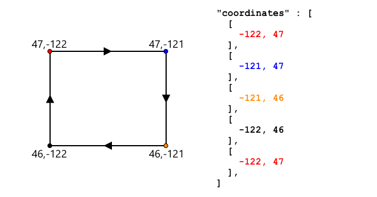

<!--
CO_OP_TRANSLATOR_METADATA:
{
  "original_hash": "078ae664c7b686bf069545e9a5fc95b2",
  "translation_date": "2025-08-27T00:36:26+00:00",
  "source_file": "3-transport/lessons/4-geofences/README.md",
  "language_code": "ar"
}
-->
# الأسوار الجغرافية


> رسم توضيحي من [نيتيا ناراسيمهان](https://github.com/nitya). اضغط على الصورة لعرض نسخة أكبر.

يقدم هذا الفيديو نظرة عامة على الأسوار الجغرافية وكيفية استخدامها في Azure Maps، وهي المواضيع التي سيتم تناولها في هذا الدرس:

[](https://www.youtube.com/watch?v=nsrgYhaYNVY)

> 🎥 اضغط على الصورة أعلاه لمشاهدة الفيديو

## اختبار ما قبل المحاضرة

[اختبار ما قبل المحاضرة](https://black-meadow-040d15503.1.azurestaticapps.net/quiz/27)

## المقدمة

في الدروس الثلاثة الأخيرة، استخدمت إنترنت الأشياء لتحديد مواقع الشاحنات التي تنقل منتجاتك من المزرعة إلى مركز المعالجة. قمت بجمع بيانات GPS، وإرسالها إلى السحابة لتخزينها، وعرضها على الخريطة. الخطوة التالية لتحسين كفاءة سلسلة التوريد الخاصة بك هي تلقي تنبيه عندما تكون الشاحنة على وشك الوصول إلى مركز المعالجة، بحيث يكون الطاقم جاهزًا بالمعدات اللازمة مثل الرافعات الشوكية فور وصول المركبة. بهذه الطريقة يمكن تفريغ الحمولة بسرعة، ولن تضطر لدفع تكاليف انتظار الشاحنة والسائق.

في هذا الدرس، ستتعلم عن الأسوار الجغرافية - وهي مناطق جغرافية محددة مثل منطقة تقع ضمن مسافة قيادة لمدة دقيقتين من مركز المعالجة، وكيفية اختبار ما إذا كانت إحداثيات GPS داخل أو خارج السور الجغرافي، حتى تتمكن من معرفة ما إذا كان جهاز استشعار GPS قد وصل إلى المنطقة أو غادرها.

في هذا الدرس سنتناول:

* [ما هي الأسوار الجغرافية](../../../../../3-transport/lessons/4-geofences)
* [تعريف السور الجغرافي](../../../../../3-transport/lessons/4-geofences)
* [اختبار النقاط مقابل السور الجغرافي](../../../../../3-transport/lessons/4-geofences)
* [استخدام الأسوار الجغرافية من خلال التعليمات البرمجية بدون خادم](../../../../../3-transport/lessons/4-geofences)

> 🗑 هذا هو الدرس الأخير في هذا المشروع، لذا بعد إكمال هذا الدرس والتكليف، لا تنس تنظيف خدمات السحابة الخاصة بك. ستحتاج إلى الخدمات لإكمال التكليف، لذا تأكد من إكماله أولاً.
>
> راجع [دليل تنظيف المشروع](../../../clean-up.md) إذا لزم الأمر للحصول على تعليمات حول كيفية القيام بذلك.

## ما هي الأسوار الجغرافية

السور الجغرافي هو حدود افتراضية لمنطقة جغرافية حقيقية. يمكن أن تكون الأسوار الجغرافية دوائر محددة كنقطة ونصف قطر (على سبيل المثال دائرة بعرض 100 متر حول مبنى)، أو مضلعات تغطي منطقة مثل منطقة مدرسة، حدود مدينة، أو حرم جامعي أو مكتبي.


> 💁 ربما تكون قد استخدمت الأسوار الجغرافية بالفعل دون أن تدرك ذلك. إذا قمت بتعيين تذكير باستخدام تطبيق التذكيرات على iOS أو Google Keep بناءً على موقع، فقد استخدمت سورًا جغرافيًا. تقوم هذه التطبيقات بإنشاء سور جغرافي بناءً على الموقع المحدد وتنبهك عندما يدخل هاتفك السور الجغرافي.

هناك العديد من الأسباب التي قد تجعلك ترغب في معرفة ما إذا كانت مركبة داخل أو خارج سور جغرافي:

* **التحضير للتفريغ** - تلقي إشعار بوصول مركبة إلى الموقع يسمح للطاقم بالاستعداد لتفريغ المركبة، مما يقلل من وقت انتظار المركبة. يمكن أن يسمح ذلك للسائق بإجراء المزيد من عمليات التسليم في اليوم مع وقت انتظار أقل.
* **الامتثال الضريبي** - بعض الدول، مثل نيوزيلندا، تفرض ضرائب على الطرق للمركبات التي تعمل بالديزل بناءً على وزن المركبة عند القيادة على الطرق العامة فقط. باستخدام الأسوار الجغرافية، يمكنك تتبع المسافة المقطوعة على الطرق العامة مقابل الطرق الخاصة في مواقع مثل المزارع أو مناطق قطع الأشجار.
* **مراقبة السرقة** - إذا كان من المفترض أن تبقى مركبة في منطقة معينة مثل مزرعة، وغادرت السور الجغرافي، فقد تكون قد سُرقت.
* **الامتثال المكاني** - بعض أجزاء مواقع العمل أو المزارع أو المصانع قد تكون محظورة على مركبات معينة، مثل إبقاء المركبات التي تحمل أسمدة صناعية ومبيدات حشرية بعيدًا عن الحقول التي تزرع منتجات عضوية. إذا تم دخول سور جغرافي، فإن المركبة تكون خارج الامتثال ويمكن إخطار السائق.

✅ هل يمكنك التفكير في استخدامات أخرى للأسوار الجغرافية؟

تتيح لك Azure Maps، الخدمة التي استخدمتها في الدرس السابق لعرض بيانات GPS، تعريف الأسوار الجغرافية، ثم اختبار ما إذا كانت نقطة داخل أو خارج السور الجغرافي.

## تعريف السور الجغرافي

يتم تعريف الأسوار الجغرافية باستخدام GeoJSON، تمامًا مثل النقاط التي تمت إضافتها إلى الخريطة في الدرس السابق. في هذه الحالة، بدلاً من أن تكون `FeatureCollection` تحتوي على قيم `Point`، فهي `FeatureCollection` تحتوي على `Polygon`.

```json
{
   "type": "FeatureCollection",
   "features": [
     {
       "type": "Feature",
       "geometry": {
         "type": "Polygon",
         "coordinates": [
           [
             [
               -122.13393688201903,
               47.63829579223815
             ],
             [
               -122.13389128446579,
               47.63782047131512
             ],
             [
               -122.13240802288054,
               47.63783312249837
             ],
             [
               -122.13238388299942,
               47.63829037035086
             ],
             [
               -122.13393688201903,
               47.63829579223815
             ]
           ]
         ]
       },
       "properties": {
         "geometryId": "1"
       }
     }
   ]
}
```

كل نقطة في المضلع يتم تعريفها كزوج من الإحداثيات (خط الطول، خط العرض) في مصفوفة، وهذه النقاط تكون في مصفوفة يتم تعيينها كـ `coordinates`. في `Point` في الدرس السابق، كانت `coordinates` مصفوفة تحتوي على قيمتين، خط العرض وخط الطول، أما في `Polygon` فهي مصفوفة من المصفوفات تحتوي على قيمتين، خط الطول وخط العرض.

> 💁 تذكر، GeoJSON يستخدم `خط الطول، خط العرض` للنقاط، وليس `خط العرض، خط الطول`

مصفوفة إحداثيات المضلع تحتوي دائمًا على إدخال واحد أكثر من عدد النقاط في المضلع، حيث يكون الإدخال الأخير هو نفسه الإدخال الأول، لإغلاق المضلع. على سبيل المثال، للمستطيل سيكون هناك 5 نقاط.



في الصورة أعلاه، هناك مستطيل. تبدأ إحداثيات المضلع من الزاوية العلوية اليسرى عند 47,-122، ثم تتحرك إلى اليمين عند 47,-121، ثم إلى الأسفل عند 46,-121، ثم إلى اليسار عند 46,-122، ثم تعود إلى النقطة الأولى عند 47,-122. هذا يعطي المضلع 5 نقاط - الزاوية العلوية اليسرى، الزاوية العلوية اليمنى، الزاوية السفلية اليمنى، الزاوية السفلية اليسرى، ثم الزاوية العلوية اليسرى لإغلاقه.

✅ حاول إنشاء مضلع GeoJSON حول منزلك أو مدرستك. استخدم أداة مثل [GeoJSON.io](https://geojson.io/).

### المهمة - تعريف سور جغرافي

لاستخدام سور جغرافي في Azure Maps، يجب أولاً تحميله إلى حساب Azure Maps الخاص بك. بمجرد تحميله، ستحصل على معرف فريد يمكنك استخدامه لاختبار نقطة مقابل السور الجغرافي. لتحميل الأسوار الجغرافية إلى Azure Maps، تحتاج إلى استخدام واجهة برمجة التطبيقات للخرائط عبر الويب. يمكنك استدعاء واجهة برمجة التطبيقات للخرائط في Azure باستخدام أداة تسمى [curl](https://curl.se).

> 🎓 Curl هي أداة سطر أوامر لإجراء طلبات إلى نقاط النهاية على الويب

1. إذا كنت تستخدم Linux أو macOS أو إصدارًا حديثًا من Windows 10، فمن المحتمل أن يكون curl مثبتًا بالفعل. قم بتشغيل الأمر التالي من الطرفية أو سطر الأوامر للتحقق:

    ```sh
    curl --version
    ```

    إذا لم تظهر معلومات الإصدار لـ curl، فستحتاج إلى تثبيته من [صفحة تنزيل curl](https://curl.se/download.html).

    > 💁 إذا كنت خبيرًا في استخدام Postman، يمكنك استخدامه بدلاً من ذلك إذا كنت تفضل ذلك.

1. قم بإنشاء ملف GeoJSON يحتوي على مضلع. ستقوم باختباره باستخدام جهاز استشعار GPS الخاص بك، لذا قم بإنشاء مضلع حول موقعك الحالي. يمكنك إما إنشاء واحد يدويًا عن طريق تحرير مثال GeoJSON المقدم أعلاه، أو استخدام أداة مثل [GeoJSON.io](https://geojson.io/).

    يجب أن يحتوي GeoJSON على `FeatureCollection`، تحتوي على `Feature` مع `geometry` من النوع `Polygon`.

    يجب عليك أيضًا إضافة عنصر `properties` على نفس المستوى مع عنصر `geometry`، ويجب أن يحتوي هذا على `geometryId`:

    ```json
    "properties": {
        "geometryId": "1"
    }
    ```

    إذا كنت تستخدم [GeoJSON.io](https://geojson.io/)، فستحتاج يدويًا إلى إضافة هذا العنصر إلى عنصر `properties` الفارغ، إما بعد تنزيل ملف JSON، أو في محرر JSON في التطبيق.

    يجب أن يكون `geometryId` فريدًا في هذا الملف. يمكنك تحميل أسوار جغرافية متعددة كـ `Features` متعددة في `FeatureCollection` في نفس ملف GeoJSON، طالما أن لكل منها `geometryId` مختلف. يمكن أن تحتوي المضلعات على نفس `geometryId` إذا تم تحميلها من ملف مختلف في وقت مختلف.

1. احفظ هذا الملف باسم `geofence.json`، وانتقل إلى مكان حفظه في الطرفية أو وحدة التحكم.

1. قم بتشغيل الأمر curl التالي لإنشاء السور الجغرافي:

    ```sh
    curl --request POST 'https://atlas.microsoft.com/mapData/upload?api-version=1.0&dataFormat=geojson&subscription-key=<subscription_key>' \
         --header 'Content-Type: application/json' \
         --include \
         --data @geofence.json
    ```

    استبدل `<subscription_key>` في عنوان URL بمفتاح API لحساب Azure Maps الخاص بك.

    يتم استخدام عنوان URL لتحميل بيانات الخريطة عبر واجهة برمجة التطبيقات `https://atlas.microsoft.com/mapData/upload`. يتضمن الاستدعاء معلمة `api-version` لتحديد واجهة برمجة التطبيقات لـ Azure Maps التي سيتم استخدامها، وذلك للسماح بتغيير واجهة برمجة التطبيقات بمرور الوقت مع الحفاظ على التوافق مع الإصدارات السابقة. يتم تعيين تنسيق البيانات التي يتم تحميلها إلى `geojson`.

    سيقوم هذا بتنفيذ طلب POST إلى واجهة برمجة التطبيقات للتحميل وإرجاع قائمة برؤوس الاستجابة التي تتضمن رأسًا يسمى `location`.

    ```output
    content-type: application/json
    location: https://us.atlas.microsoft.com/mapData/operations/1560ced6-3a80-46f2-84b2-5b1531820eab?api-version=1.0
    x-ms-azuremaps-region: West US 2
    x-content-type-options: nosniff
    strict-transport-security: max-age=31536000; includeSubDomains
    x-cache: CONFIG_NOCACHE
    date: Sat, 22 May 2021 21:34:57 GMT
    content-length: 0
    ```

    > 🎓 عند استدعاء نقطة نهاية ويب، يمكنك تمرير معلمات إلى الاستدعاء عن طريق إضافة `?` متبوعة بأزواج مفتاح-قيمة كـ `key=value`، وفصل أزواج المفتاح-القيمة بـ `&`.

1. لا تقوم Azure Maps بمعالجة هذا الطلب فورًا، لذا ستحتاج إلى التحقق لمعرفة ما إذا كان طلب التحميل قد انتهى باستخدام عنوان URL المقدم في رأس `location`. قم بإجراء طلب GET إلى هذا الموقع للتحقق من الحالة. ستحتاج إلى إضافة مفتاح الاشتراك الخاص بك إلى نهاية عنوان URL الخاص بـ `location` عن طريق إضافة `&subscription-key=<subscription_key>` إلى النهاية، واستبدال `<subscription_key>` بمفتاح API لحساب Azure Maps الخاص بك. قم بتشغيل الأمر التالي:

    ```sh
    curl --request GET '<location>&subscription-key=<subscription_key>'
    ```

    استبدل `<location>` بقيمة رأس `location`، و `<subscription_key>` بمفتاح API لحساب Azure Maps الخاص بك.

1. تحقق من قيمة `status` في الاستجابة. إذا لم تكن `Succeeded`، فانتظر دقيقة وحاول مرة أخرى.

1. بمجرد أن تعود الحالة كـ `Succeeded`، انظر إلى `resourceLocation` من الاستجابة. يحتوي هذا على تفاصيل حول المعرف الفريد (المعروف بـ UDID) لكائن GeoJSON. UDID هو القيمة بعد `metadata/`، وليس بما في ذلك `api-version`. على سبيل المثال، إذا كان `resourceLocation` هو:

    ```json
    {
      "resourceLocation": "https://us.atlas.microsoft.com/mapData/metadata/7c3776eb-da87-4c52-ae83-caadf980323a?api-version=1.0"
    }
    ```

    فإن UDID سيكون `7c3776eb-da87-4c52-ae83-caadf980323a`.

    احتفظ بنسخة من هذا UDID حيث ستحتاج إليه لاختبار السور الجغرافي.

## اختبار النقاط مقابل السور الجغرافي

بمجرد تحميل المضلع إلى Azure Maps، يمكنك اختبار نقطة لمعرفة ما إذا كانت داخل أو خارج السور الجغرافي. يمكنك القيام بذلك عن طريق إجراء طلب واجهة برمجة التطبيقات للويب، وتمرير UDID للسور الجغرافي، وخط العرض وخط الطول للنقطة التي تريد اختبارها.

عند إجراء هذا الطلب، يمكنك أيضًا تمرير قيمة تسمى `searchBuffer`. تحدد هذه القيمة مدى دقة واجهة برمجة التطبيقات عند إرجاع النتائج. السبب في ذلك هو أن GPS ليس دقيقًا تمامًا، وأحيانًا تكون المواقع غير دقيقة بمسافة أمتار أو أكثر. القيمة الافتراضية لـ `searchBuffer` هي 50 مترًا، ولكن يمكنك تعيين قيم من 0 متر إلى 500 متر.

عندما يتم إرجاع النتائج من استدعاء واجهة برمجة التطبيقات، فإن أحد أجزاء النتيجة هو `distance` يتم قياسها إلى أقرب نقطة على حافة السور الجغرافي، مع قيمة موجبة إذا كانت النقطة خارج السور الجغرافي، وقيمة سالبة إذا كانت داخل السور الجغرافي. إذا كانت هذه المسافة أقل من `searchBuffer`، يتم إرجاع المسافة الفعلية بالأمتار، وإلا تكون القيمة 999 أو -999. 999 تعني أن النقطة خارج السور الجغرافي بأكثر من `searchBuffer`، -999 تعني أنها داخل السور الجغرافي بأكثر من `searchBuffer`.


في الصورة أعلاه، يحتوي السور الجغرافي على منطقة بحث 50 مترًا.

* نقطة في مركز السور الجغرافي، داخل منطقة البحث بشكل كبير، لها مسافة **-999**
* نقطة خارج منطقة البحث بشكل كبير لها مسافة **999**
* نقطة داخل السور الجغرافي وداخل منطقة البحث، على بعد 6 أمتار من السور الجغرافي، لها مسافة **6 أمتار**
* نقطة خارج السور الجغرافي وداخل منطقة البحث، على بعد 39 مترًا من السور الجغرافي، لها مسافة **39 مترًا**

من المهم معرفة المسافة إلى حافة السور الجغرافي، والجمع بين هذه المعلومات ومعلومات أخرى مثل قراءات GPS الأخرى، السرعة وبيانات الطرق عند اتخاذ قرارات بناءً على موقع المركبة.

على سبيل المثال، تخيل قراءات GPS تظهر مركبة تسير على طريق ينتهي بجوار سور جغرافي. إذا كانت قيمة GPS واحدة غير دقيقة وتضع المركبة داخل السور الجغرافي، على الرغم من عدم وجود وصول للمركبات، فيمكن تجاهلها.


في الصورة أعلاه، هناك سياج جغرافي يغطي جزءًا من حرم مايكروسوفت. الخط الأحمر يُظهر شاحنة تسير على طول الطريق 520، مع دوائر تُظهر قراءات GPS. معظم هذه القراءات دقيقة وتقع على طول الطريق 520، باستثناء قراءة واحدة غير دقيقة داخل السياج الجغرافي. من المستحيل أن تكون هذه القراءة صحيحة - لا توجد طرق يمكن للشاحنة أن تنحرف فجأة من الطريق 520 إلى الحرم الجامعي ثم تعود إلى الطريق 520. الكود الذي يتحقق من هذا السياج الجغرافي سيحتاج إلى أخذ القراءات السابقة بعين الاعتبار قبل اتخاذ أي إجراء بناءً على نتائج اختبار السياج الجغرافي.

✅ ما البيانات الإضافية التي تحتاج إلى التحقق منها لمعرفة ما إذا كانت قراءة GPS يمكن اعتبارها صحيحة؟

### المهمة - اختبار النقاط مقابل سياج جغرافي

1. ابدأ بإنشاء عنوان URL للاستعلام عن واجهة برمجة التطبيقات (API). التنسيق هو:

    ```output
    https://atlas.microsoft.com/spatial/geofence/json?api-version=1.0&deviceId=gps-sensor&subscription-key=<subscription-key>&udid=<UDID>&lat=<lat>&lon=<lon>
    ```

    استبدل `<subscription_key>` بمفتاح API الخاص بحساب Azure Maps الخاص بك.

    استبدل `<UDID>` بـ UDID الخاص بالسياج الجغرافي من المهمة السابقة.

    استبدل `<lat>` و `<lon>` بخط العرض وخط الطول اللذين تريد اختباره.

    يستخدم هذا العنوان URL واجهة برمجة التطبيقات `https://atlas.microsoft.com/spatial/geofence/json` للاستعلام عن سياج جغرافي تم تعريفه باستخدام GeoJSON. يستهدف إصدار API `1.0`. معلمة `deviceId` مطلوبة ويجب أن تكون اسم الجهاز الذي تأتي منه خطوط العرض والطول.

    البحث الافتراضي هو 50 مترًا، ويمكنك تغيير ذلك عن طريق تمرير معلمة إضافية `searchBuffer=<distance>`، مع تعيين `<distance>` لمسافة البحث بالمتر، من 0 إلى 500.

1. استخدم curl لإجراء طلب GET إلى هذا العنوان URL:

    ```sh
    curl --request GET '<URL>'
    ```

    > 💁 إذا حصلت على رمز استجابة `BadRequest`، مع خطأ:
    >
    > ```output
    > Invalid GeoJSON: All feature properties should contain a geometryId, which is used for identifying the geofence.
    > ```
    >
    > فإن ملف GeoJSON الخاص بك يفتقد قسم `properties` مع `geometryId`. ستحتاج إلى إصلاح ملف GeoJSON الخاص بك، ثم تكرار الخطوات أعلاه لإعادة التحميل والحصول على UDID جديد.

1. ستحتوي الاستجابة على قائمة بـ `geometries`، واحدة لكل مضلع تم تعريفه في GeoJSON المستخدم لإنشاء السياج الجغرافي. يحتوي كل مضلع على 3 حقول مهمة: `distance`، `nearestLat` و `nearestLon`.

    ```output
    {
        "geometries": [
            {
                "deviceId": "gps-sensor",
                "udId": "7c3776eb-da87-4c52-ae83-caadf980323a",
                "geometryId": "1",
                "distance": 999.0,
                "nearestLat": 47.645875,
                "nearestLon": -122.142713
            }
        ],
        "expiredGeofenceGeometryId": [],
        "invalidPeriodGeofenceGeometryId": []
    }
    ```

    * `nearestLat` و `nearestLon` هما خط العرض وخط الطول لنقطة على حافة السياج الجغرافي الأقرب إلى الموقع الذي يتم اختباره.

    * `distance` هي المسافة من الموقع الذي يتم اختباره إلى أقرب نقطة على حافة السياج الجغرافي. الأرقام السالبة تعني داخل السياج الجغرافي، والموجبة خارجه. ستكون هذه القيمة أقل من 50 (مسافة البحث الافتراضية)، أو 999.

1. كرر هذه العملية عدة مرات مع مواقع داخل وخارج السياج الجغرافي.

## استخدام الأسوار الجغرافية من الكود الخالي من الخوادم

يمكنك الآن إضافة مشغل جديد إلى تطبيق Functions الخاص بك لاختبار بيانات أحداث GPS من IoT Hub مقابل السياج الجغرافي.

### مجموعات المستهلكين

كما تتذكر من الدروس السابقة، يسمح IoT Hub بإعادة تشغيل الأحداث التي تم استلامها ولكن لم تتم معالجتها. ولكن ماذا سيحدث إذا اتصلت مشغلات متعددة؟ كيف سيعرف أيها قام بمعالجة الأحداث؟

الإجابة هي أنه لا يمكنه ذلك! بدلاً من ذلك، يمكنك تعريف اتصالات منفصلة متعددة لقراءة الأحداث، وكل واحدة يمكنها إدارة إعادة تشغيل الرسائل غير المقروءة. تُعرف هذه باسم *مجموعات المستهلكين*. عند الاتصال بنقطة النهاية، يمكنك تحديد مجموعة المستهلكين التي تريد الاتصال بها. كل مكون من تطبيقك سيتصل بمجموعة مستهلكين مختلفة.


نظريًا، يمكن لما يصل إلى 5 تطبيقات الاتصال بكل مجموعة مستهلكين، وستتلقى جميعها الرسائل عند وصولها. من الأفضل أن يكون لكل تطبيق وصول إلى مجموعة مستهلكين واحدة فقط لتجنب معالجة الرسائل المكررة، وضمان معالجة جميع الرسائل المعلقة بشكل صحيح عند إعادة التشغيل. على سبيل المثال، إذا قمت بتشغيل تطبيق Functions الخاص بك محليًا بالإضافة إلى تشغيله في السحابة، فسيقوم كلاهما بمعالجة الرسائل، مما يؤدي إلى تخزين كتل مكررة في حساب التخزين.

إذا قمت بمراجعة ملف `function.json` الخاص بمشغل IoT Hub الذي أنشأته في درس سابق، فسترى مجموعة المستهلكين في قسم الربط الخاص بمشغل Event Hub:

```json
"consumerGroup": "$Default"
```

عند إنشاء IoT Hub، يتم إنشاء مجموعة المستهلكين `$Default` افتراضيًا. إذا كنت تريد إضافة مشغل إضافي، يمكنك إضافته باستخدام مجموعة مستهلكين جديدة.

> 💁 في هذا الدرس، ستستخدم وظيفة مختلفة لاختبار السياج الجغرافي عن تلك المستخدمة لتخزين بيانات GPS. الهدف هو توضيح كيفية استخدام مجموعات المستهلكين وفصل الكود لجعله أسهل في القراءة والفهم. في تطبيق الإنتاج، هناك العديد من الطرق التي يمكنك تصميم هذا بها - وضع كلاهما في وظيفة واحدة، استخدام مشغل على حساب التخزين لتشغيل وظيفة للتحقق من السياج الجغرافي، أو استخدام وظائف متعددة. لا توجد "طريقة صحيحة"، فهذا يعتمد على بقية تطبيقك واحتياجاتك.

### المهمة - إنشاء مجموعة مستهلكين جديدة

1. قم بتشغيل الأمر التالي لإنشاء مجموعة مستهلكين جديدة باسم `geofence` لـ IoT Hub الخاص بك:

    ```sh
    az iot hub consumer-group create --name geofence \
                                     --hub-name <hub_name>
    ```

    استبدل `<hub_name>` باسم IoT Hub الذي استخدمته.

1. إذا كنت تريد رؤية جميع مجموعات المستهلكين لـ IoT Hub، قم بتشغيل الأمر التالي:

    ```sh
    az iot hub consumer-group list --output table \
                                   --hub-name <hub_name>
    ```

    استبدل `<hub_name>` باسم IoT Hub الذي استخدمته. سيعرض هذا جميع مجموعات المستهلكين.

    ```output
    Name      ResourceGroup
    --------  ---------------
    $Default  gps-sensor
    geofence  gps-sensor
    ```

> 💁 عندما قمت بتشغيل مراقب أحداث IoT Hub في درس سابق، كان متصلاً بمجموعة المستهلكين `$Default`. لهذا السبب لا يمكنك تشغيل مراقب الأحداث ومشغل الأحداث في نفس الوقت. إذا كنت تريد تشغيل كليهما، يمكنك استخدام مجموعات مستهلكين أخرى لجميع تطبيقات الوظائف الخاصة بك، والاحتفاظ بـ `$Default` لمراقب الأحداث.

### المهمة - إنشاء مشغل IoT Hub جديد

1. أضف مشغل حدث IoT Hub جديد إلى تطبيق `gps-trigger` الذي أنشأته في درس سابق. قم بتسمية هذه الوظيفة `geofence-trigger`.

    > ⚠️ يمكنك الرجوع إلى [التعليمات لإنشاء مشغل حدث IoT Hub من المشروع 2، الدرس 5 إذا لزم الأمر](../../../2-farm/lessons/5-migrate-application-to-the-cloud/README.md#create-an-iot-hub-event-trigger).

1. قم بتكوين سلسلة اتصال IoT Hub في ملف `function.json`. يتم مشاركة ملف `local.settings.json` بين جميع المشغلات في تطبيق الوظائف.

1. قم بتحديث قيمة `consumerGroup` في ملف `function.json` للإشارة إلى مجموعة المستهلكين الجديدة `geofence`:

    ```json
    "consumerGroup": "geofence"
    ```

1. ستحتاج إلى استخدام مفتاح الاشتراك الخاص بـ Azure Maps في هذا المشغل، لذا أضف إدخالًا جديدًا إلى ملف `local.settings.json` باسم `MAPS_KEY`.

1. قم بتشغيل تطبيق الوظائف للتأكد من أنه يتصل ويعالج الرسائل. سيعمل مشغل `iot-hub-trigger` من الدرس السابق أيضًا ويقوم بتحميل الكتل إلى التخزين.

    > لتجنب قراءات GPS المكررة في تخزين الكتل، يمكنك إيقاف تشغيل تطبيق الوظائف الذي قمت بتشغيله في السحابة. للقيام بذلك، استخدم الأمر التالي:
    >
    > ```sh
    > az functionapp stop --resource-group gps-sensor \
    >                     --name <functions_app_name>
    > ```
    >
    > استبدل `<functions_app_name>` باسم تطبيق الوظائف الخاص بك.
    >
    > يمكنك إعادة تشغيله لاحقًا باستخدام الأمر التالي:
    >
    > ```sh
    > az functionapp start --resource-group gps-sensor \
    >                     --name <functions_app_name>
    > ```
    >
    > استبدل `<functions_app_name>` باسم تطبيق الوظائف الخاص بك.

### المهمة - اختبار السياج الجغرافي من المشغل

في وقت سابق من هذا الدرس، استخدمت curl للاستعلام عن سياج جغرافي لمعرفة ما إذا كانت نقطة تقع داخله أم خارجه. يمكنك إجراء طلب ويب مشابه من داخل المشغل الخاص بك.

1. للاستعلام عن السياج الجغرافي، تحتاج إلى UDID الخاص به. أضف إدخالًا جديدًا إلى ملف `local.settings.json` باسم `GEOFENCE_UDID` مع هذه القيمة.

1. افتح ملف `__init__.py` من المشغل الجديد `geofence-trigger`.

1. أضف الاستيراد التالي إلى أعلى الملف:

    ```python
    import json
    import os
    import requests
    ```

    تتيح لك حزمة `requests` إجراء استدعاءات واجهة برمجة التطبيقات (API). لا يحتوي Azure Maps على SDK لـ Python، لذا تحتاج إلى إجراء استدعاءات API لاستخدامه من كود Python.

1. أضف السطرين التاليين إلى بداية طريقة `main` للحصول على مفتاح اشتراك الخرائط:

    ```python
    maps_key = os.environ['MAPS_KEY']
    geofence_udid = os.environ['GEOFENCE_UDID']    
    ```

1. داخل الحلقة `for event in events`، أضف ما يلي للحصول على خط العرض وخط الطول من كل حدث:

    ```python
    event_body = json.loads(event.get_body().decode('utf-8'))
    lat = event_body['gps']['lat']
    lon = event_body['gps']['lon']
    ```

    يقوم هذا الكود بتحويل JSON من جسم الحدث إلى قاموس، ثم يستخرج `lat` و `lon` من الحقل `gps`.

1. عند استخدام `requests`، بدلاً من بناء عنوان URL طويل كما فعلت مع curl، يمكنك استخدام جزء URL فقط وتمرير المعلمات كقاموس. أضف الكود التالي لتعريف عنوان URL وتكوين المعلمات:

    ```python
    url = 'https://atlas.microsoft.com/spatial/geofence/json'

    params = {
        'api-version': 1.0,
        'deviceId': 'gps-sensor',
        'subscription-key': maps_key,
        'udid' : geofence_udid,
        'lat' : lat,
        'lon' : lon
    }
    ```

    ستتطابق العناصر الموجودة في قاموس `params` مع أزواج المفاتيح والقيم التي استخدمتها عند استدعاء واجهة برمجة التطبيقات عبر curl.

1. أضف الأسطر التالية من الكود لاستدعاء واجهة برمجة التطبيقات:

    ```python
    response = requests.get(url, params=params)
    response_body = json.loads(response.text)
    ```

    يقوم هذا باستدعاء عنوان URL مع المعلمات، ويحصل على كائن استجابة.

1. أضف الكود التالي أسفل هذا:

    ```python
    distance = response_body['geometries'][0]['distance']

    if distance == 999:
        logging.info('Point is outside geofence')
    elif distance > 0:
        logging.info(f'Point is just outside geofence by a distance of {distance}m')
    elif distance == -999:
        logging.info(f'Point is inside geofence')
    else:
        logging.info(f'Point is just inside geofence by a distance of {distance}m')
    ```

    يفترض هذا الكود وجود مضلع واحد، ويستخرج المسافة من هذا المضلع الوحيد. ثم يسجل رسائل مختلفة بناءً على المسافة.

1. قم بتشغيل هذا الكود. سترى في مخرجات السجل ما إذا كانت إحداثيات GPS داخل السياج الجغرافي أم خارجه، مع مسافة إذا كانت النقطة ضمن 50 مترًا. جرب هذا الكود مع أسوار جغرافية مختلفة بناءً على موقع مستشعر GPS الخاص بك، جرب تحريك المستشعر (على سبيل المثال متصل بشبكة WiFi من هاتف محمول، أو مع إحداثيات مختلفة على جهاز IoT افتراضي) لترى هذا التغيير.

1. عندما تكون جاهزًا، قم بنشر هذا الكود إلى تطبيق الوظائف الخاص بك في السحابة. لا تنسَ نشر إعدادات التطبيق الجديدة.

    > ⚠️ يمكنك الرجوع إلى [التعليمات لتحميل إعدادات التطبيق من المشروع 2، الدرس 5 إذا لزم الأمر](../../../2-farm/lessons/5-migrate-application-to-the-cloud/README.md#task---upload-your-application-settings).

    > ⚠️ يمكنك الرجوع إلى [التعليمات لنشر تطبيق الوظائف الخاص بك من المشروع 2، الدرس 5 إذا لزم الأمر](../../../2-farm/lessons/5-migrate-application-to-the-cloud/README.md#task---deploy-your-functions-app-to-the-cloud).

> 💁 يمكنك العثور على هذا الكود في مجلد [code/functions](../../../../../3-transport/lessons/4-geofences/code/functions).

---

## 🚀 التحدي

في هذا الدرس، أضفت سياجًا جغرافيًا واحدًا باستخدام ملف GeoJSON يحتوي على مضلع واحد. يمكنك تحميل مضلعات متعددة في نفس الوقت، طالما أن لديها قيم `geometryId` مختلفة في قسم `properties`.

حاول تحميل ملف GeoJSON يحتوي على مضلعات متعددة وقم بتعديل الكود الخاص بك لمعرفة أي مضلع تكون إحداثيات GPS الأقرب إليه أو داخله.

## اختبار ما بعد المحاضرة

[اختبار ما بعد المحاضرة](https://black-meadow-040d15503.1.azurestaticapps.net/quiz/28)

## المراجعة والدراسة الذاتية

* اقرأ المزيد عن الأسوار الجغرافية وبعض استخداماتها على [صفحة الأسوار الجغرافية على ويكيبيديا](https://en.wikipedia.org/wiki/Geo-fence).
* اقرأ المزيد عن واجهة برمجة التطبيقات للأسوار الجغرافية في Azure Maps على [وثائق Microsoft Azure Maps Spatial - Get Geofence](https://docs.microsoft.com/rest/api/maps/spatial/getgeofence?WT.mc_id=academic-17441-jabenn).
* اقرأ المزيد عن مجموعات المستهلكين في [الميزات والمصطلحات في Azure Event Hubs - وثائق مستهلكي الأحداث على Microsoft Docs](https://docs.microsoft.com/azure/event-hubs/event-hubs-features?WT.mc_id=academic-17441-jabenn#event-consumers).

## الواجب

[إرسال الإشعارات باستخدام Twilio](assignment.md)

---

**إخلاء المسؤولية**:  
تم ترجمة هذا المستند باستخدام خدمة الترجمة بالذكاء الاصطناعي [Co-op Translator](https://github.com/Azure/co-op-translator). بينما نسعى لتحقيق الدقة، يرجى العلم أن الترجمات الآلية قد تحتوي على أخطاء أو معلومات غير دقيقة. يجب اعتبار المستند الأصلي بلغته الأصلية المصدر الموثوق. للحصول على معلومات حاسمة، يُوصى بالاستعانة بترجمة بشرية احترافية. نحن غير مسؤولين عن أي سوء فهم أو تفسيرات خاطئة تنشأ عن استخدام هذه الترجمة.