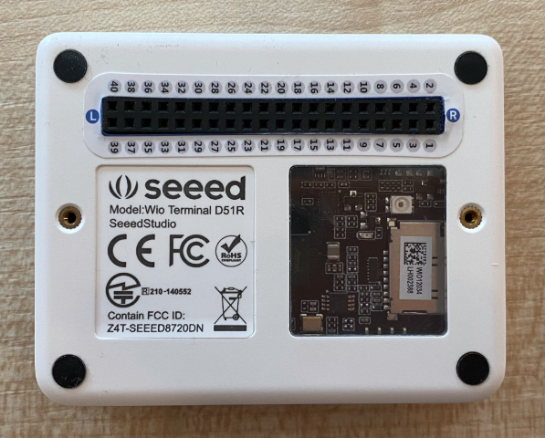

<!--
CO_OP_TRANSLATOR_METADATA:
{
  "original_hash": "160be8c0f558687f6686dca64f10f739",
  "translation_date": "2025-08-26T21:54:23+00:00",
  "source_file": "4-manufacturing/lessons/2-check-fruit-from-device/wio-terminal-camera.md",
  "language_code": "ar"
}
-->
# التقاط صورة - Wio Terminal

في هذا الجزء من الدرس، ستضيف كاميرا إلى Wio Terminal الخاص بك، وتلتقط صورًا منها.

## الأجهزة

يحتاج Wio Terminal إلى كاميرا.

الكاميرا التي ستستخدمها هي [ArduCam Mini 2MP Plus](https://www.arducam.com/product/arducam-2mp-spi-camera-b0067-arduino/). هذه كاميرا بدقة 2 ميجابكسل تعتمد على مستشعر الصور OV2640. تتواصل عبر واجهة SPI لالتقاط الصور، وتستخدم I2C لتكوين المستشعر.

## توصيل الكاميرا

لا تحتوي ArduCam على مقبس Grove، بل تتصل بكل من SPI وI2C عبر دبابيس GPIO على Wio Terminal.

### المهمة - توصيل الكاميرا

قم بتوصيل الكاميرا.


1. يجب توصيل الدبابيس الموجودة في قاعدة ArduCam بدبابيس GPIO على Wio Terminal. لتسهيل العثور على الدبابيس الصحيحة، قم بتثبيت ملصق دبابيس GPIO الذي يأتي مع Wio Terminal حول الدبابيس:

    

1. باستخدام أسلاك التوصيل، قم بإجراء الاتصالات التالية:

    | دبوس ArduCAM | دبوس Wio Terminal | الوصف                                 |
    | ------------ | ----------------- | ------------------------------------- |
    | CS           | 24 (SPI_CS)       | اختيار شريحة SPI                      |
    | MOSI         | 19 (SPI_MOSI)     | خرج وحدة التحكم SPI، إدخال الطرفية    |
    | MISO         | 21 (SPI_MISO)     | إدخال وحدة التحكم SPI، خرج الطرفية    |
    | SCK          | 23 (SPI_SCLK)     | ساعة SPI التسلسلية                    |
    | GND          | 6 (GND)           | الأرضي - 0 فولت                       |
    | VCC          | 4 (5V)            | مصدر طاقة 5 فولت                      |
    | SDA          | 3 (I2C1_SDA)      | بيانات تسلسلية I2C                    |
    | SCL          | 5 (I2C1_SCL)      | ساعة تسلسلية I2C                      |

    

    توفر اتصالات GND وVCC مصدر طاقة 5 فولت لـ ArduCam. تعمل الكاميرا بجهد 5 فولت، على عكس مستشعرات Grove التي تعمل بجهد 3 فولت. يأتي هذا الطاقة مباشرة من اتصال USB-C الذي يغذي الجهاز.

    > 💁 بالنسبة لاتصال SPI، لا تزال تسميات الدبابيس على ArduCam وأسماء دبابيس Wio Terminal المستخدمة في الكود تستخدم التسمية القديمة. ستستخدم التعليمات في هذا الدرس التسمية الجديدة، باستثناء عندما تُستخدم أسماء الدبابيس في الكود.

1. يمكنك الآن توصيل Wio Terminal بجهاز الكمبيوتر الخاص بك.

## برمجة الجهاز للاتصال بالكاميرا

يمكن الآن برمجة Wio Terminal لاستخدام كاميرا ArduCAM المرفقة.

### المهمة - برمجة الجهاز للاتصال بالكاميرا

1. قم بإنشاء مشروع جديد لـ Wio Terminal باستخدام PlatformIO. قم بتسمية هذا المشروع `fruit-quality-detector`. أضف الكود في وظيفة `setup` لتكوين المنفذ التسلسلي.

1. أضف الكود للاتصال بشبكة WiFi، مع بيانات اعتماد WiFi الخاصة بك في ملف يسمى `config.h`. لا تنسَ إضافة المكتبات المطلوبة إلى ملف `platformio.ini`.

1. مكتبة ArduCam غير متوفرة كمكتبة Arduino يمكن تثبيتها من ملف `platformio.ini`. بدلاً من ذلك، ستحتاج إلى تثبيتها من المصدر من صفحة GitHub الخاصة بهم. يمكنك الحصول عليها إما عن طريق:

    * استنساخ المستودع من [https://github.com/ArduCAM/Arduino.git](https://github.com/ArduCAM/Arduino.git)
    * التوجه إلى المستودع على GitHub في [github.com/ArduCAM/Arduino](https://github.com/ArduCAM/Arduino) وتنزيل الكود كملف مضغوط من زر **Code**

1. تحتاج فقط إلى مجلد `ArduCAM` من هذا الكود. انسخ المجلد بالكامل إلى مجلد `lib` في مشروعك.

    > ⚠️ يجب نسخ المجلد بالكامل، بحيث يكون الكود في `lib/ArduCam`. لا تقم فقط بنسخ محتويات مجلد `ArduCam` إلى مجلد `lib`، بل انسخ المجلد بالكامل.

1. يعمل كود مكتبة ArduCam مع أنواع متعددة من الكاميرات. يتم تكوين نوع الكاميرا الذي تريد استخدامه باستخدام أعلام المترجم - وهذا يحافظ على حجم المكتبة المدمجة صغيرًا قدر الإمكان عن طريق إزالة الكود الخاص بالكاميرات التي لا تستخدمها. لتكوين المكتبة لكاميرا OV2640، أضف ما يلي إلى نهاية ملف `platformio.ini`:

    ```ini
    build_flags =
        -DARDUCAM_SHIELD_V2
        -DOV2640_CAM
    ```

    هذا يحدد علمين للمترجم:

      * `ARDUCAM_SHIELD_V2` لإخبار المكتبة أن الكاميرا موجودة على لوحة Arduino، تُعرف باسم الدرع.
      * `OV2640_CAM` لإخبار المكتبة بتضمين الكود الخاص بكاميرا OV2640 فقط.

1. أضف ملف رأس إلى مجلد `src` يسمى `camera.h`. سيحتوي هذا الملف على الكود للتواصل مع الكاميرا. أضف الكود التالي إلى هذا الملف:

    ```cpp
    #pragma once
    
    #include <ArduCAM.h>
    #include <Wire.h>
    
    class Camera
    {
    public:
        Camera(int format, int image_size) : _arducam(OV2640, PIN_SPI_SS)
        {
            _format = format;
            _image_size = image_size;
        }
    
        bool init()
        {
            // Reset the CPLD
            _arducam.write_reg(0x07, 0x80);
            delay(100);
    
            _arducam.write_reg(0x07, 0x00);
            delay(100);
    
            // Check if the ArduCAM SPI bus is OK
            _arducam.write_reg(ARDUCHIP_TEST1, 0x55);
            if (_arducam.read_reg(ARDUCHIP_TEST1) != 0x55)
            {
                return false;
            }
                
            // Change MCU mode
            _arducam.set_mode(MCU2LCD_MODE);
    
            uint8_t vid, pid;
    
            // Check if the camera module type is OV2640
            _arducam.wrSensorReg8_8(0xff, 0x01);
            _arducam.rdSensorReg8_8(OV2640_CHIPID_HIGH, &vid);
            _arducam.rdSensorReg8_8(OV2640_CHIPID_LOW, &pid);
            if ((vid != 0x26) && ((pid != 0x41) || (pid != 0x42)))
            {
                return false;
            }
            
            _arducam.set_format(_format);
            _arducam.InitCAM();
            _arducam.OV2640_set_JPEG_size(_image_size);
            _arducam.OV2640_set_Light_Mode(Auto);
            _arducam.OV2640_set_Special_effects(Normal);
            delay(1000);
    
            return true;
        }
    
        void startCapture()
        {
            _arducam.flush_fifo();
            _arducam.clear_fifo_flag();
            _arducam.start_capture();
        }
    
        bool captureReady()
        {
            return _arducam.get_bit(ARDUCHIP_TRIG, CAP_DONE_MASK);
        }
    
        bool readImageToBuffer(byte **buffer, uint32_t &buffer_length)
        {
            if (!captureReady()) return false;
    
            // Get the image file length
            uint32_t length = _arducam.read_fifo_length();
            buffer_length = length;
    
            if (length >= MAX_FIFO_SIZE)
            {
                return false;
            }
            if (length == 0)
            {
                return false;
            }
    
            // create the buffer
            byte *buf = new byte[length];
    
            uint8_t temp = 0, temp_last = 0;
            int i = 0;
            uint32_t buffer_pos = 0;
            bool is_header = false;
    
            _arducam.CS_LOW();
            _arducam.set_fifo_burst();
            
            while (length--)
            {
                temp_last = temp;
                temp = SPI.transfer(0x00);
                //Read JPEG data from FIFO
                if ((temp == 0xD9) && (temp_last == 0xFF)) //If find the end ,break while,
                {
                    buf[buffer_pos] = temp;
    
                    buffer_pos++;
                    i++;
                    
                    _arducam.CS_HIGH();
                }
                if (is_header == true)
                {
                    //Write image data to buffer if not full
                    if (i < 256)
                    {
                        buf[buffer_pos] = temp;
                        buffer_pos++;
                        i++;
                    }
                    else
                    {
                        _arducam.CS_HIGH();
    
                        i = 0;
                        buf[buffer_pos] = temp;
    
                        buffer_pos++;
                        i++;
    
                        _arducam.CS_LOW();
                        _arducam.set_fifo_burst();
                    }
                }
                else if ((temp == 0xD8) & (temp_last == 0xFF))
                {
                    is_header = true;
    
                    buf[buffer_pos] = temp_last;
                    buffer_pos++;
                    i++;
    
                    buf[buffer_pos] = temp;
                    buffer_pos++;
                    i++;
                }
            }
            
            _arducam.clear_fifo_flag();
    
            _arducam.set_format(_format);
            _arducam.InitCAM();
            _arducam.OV2640_set_JPEG_size(_image_size);
    
            // return the buffer
            *buffer = buf;
        }
    
    private:
        ArduCAM _arducam;
        int _format;
        int _image_size;
    };
    ```

    هذا كود منخفض المستوى يقوم بتكوين الكاميرا باستخدام مكتبات ArduCam، ويستخرج الصور عند الحاجة باستخدام ناقل SPI. هذا الكود محدد جدًا لـ ArduCam، لذا لا تحتاج إلى القلق بشأن كيفية عمله في هذه المرحلة.

1. في `main.cpp`، أضف الكود التالي تحت عبارات `include` الأخرى لتضمين هذا الملف الجديد وإنشاء مثيل لفئة الكاميرا:

    ```cpp
    #include "camera.h"

    Camera camera = Camera(JPEG, OV2640_640x480);
    ```

    هذا ينشئ `Camera` لحفظ الصور كملفات JPEG بدقة 640 × 480. على الرغم من دعم دقات أعلى (حتى 3280x2464)، فإن المصنف يعمل على صور أصغر بكثير (227x227)، لذا لا توجد حاجة لالتقاط وإرسال صور أكبر.

1. أضف الكود التالي أسفل هذا لتعريف وظيفة لتكوين الكاميرا:

    ```cpp
    void setupCamera()
    {
        pinMode(PIN_SPI_SS, OUTPUT);
        digitalWrite(PIN_SPI_SS, HIGH);
    
        Wire.begin();
        SPI.begin();
    
        if (!camera.init())
        {
            Serial.println("Error setting up the camera!");
        }
    }
    ```

    تبدأ وظيفة `setupCamera` بتكوين دبوس اختيار شريحة SPI (`PIN_SPI_SS`) كمرتفع، مما يجعل Wio Terminal وحدة التحكم SPI. ثم تبدأ ناقلات I2C وSPI. وأخيرًا، تقوم بتهيئة فئة الكاميرا التي تكوّن إعدادات مستشعر الكاميرا وتضمن أن كل شيء متصل بشكل صحيح.

1. قم باستدعاء هذه الوظيفة في نهاية وظيفة `setup`:

    ```cpp
    setupCamera();
    ```

1. قم ببناء ورفع هذا الكود، وتحقق من الإخراج من الشاشة التسلسلية. إذا رأيت `Error setting up the camera!` فتحقق من الأسلاك للتأكد من أن جميع الكابلات توصل الدبابيس الصحيحة على ArduCam بالدبابيس الصحيحة على GPIO في Wio Terminal، وأن جميع أسلاك التوصيل مثبتة بشكل صحيح.

## التقاط صورة

يمكن الآن برمجة Wio Terminal لالتقاط صورة عند الضغط على زر.

### المهمة - التقاط صورة

1. تعمل المتحكمات الدقيقة على تشغيل الكود الخاص بك بشكل مستمر، لذا ليس من السهل تشغيل شيء مثل التقاط صورة دون الاستجابة لمستشعر. يحتوي Wio Terminal على أزرار، لذا يمكن إعداد الكاميرا لتشغيلها بواسطة أحد الأزرار. أضف الكود التالي إلى نهاية وظيفة `setup` لتكوين زر C (أحد الأزرار الثلاثة في الأعلى، الأقرب إلى مفتاح التشغيل).

    

    ```cpp
    pinMode(WIO_KEY_C, INPUT_PULLUP);
    ```

    وضع `INPUT_PULLUP` يعكس الإدخال بشكل أساسي. على سبيل المثال، عادةً ما يرسل الزر إشارة منخفضة عندما لا يتم الضغط عليه، وإشارة عالية عند الضغط عليه. عند ضبطه على `INPUT_PULLUP`، يرسل إشارة عالية عندما لا يتم الضغط عليه، وإشارة منخفضة عند الضغط عليه.

1. أضف وظيفة فارغة للاستجابة لضغط الزر قبل وظيفة `loop`:

    ```cpp
    void buttonPressed()
    {
        
    }
    ```

1. قم باستدعاء هذه الوظيفة في طريقة `loop` عندما يتم الضغط على الزر:

    ```cpp
    void loop()
    {
        if (digitalRead(WIO_KEY_C) == LOW)
        {
            buttonPressed();
            delay(2000);
        }
    
        delay(200);
    }
    ```

    يتحقق هذا المفتاح لمعرفة ما إذا كان الزر مضغوطًا. إذا تم الضغط عليه، يتم استدعاء وظيفة `buttonPressed`، وتتأخر الحلقة لمدة ثانيتين. هذا لإتاحة الوقت لتحرير الزر حتى لا يتم تسجيل الضغط الطويل مرتين.

    > 💁 الزر في Wio Terminal مضبوط على `INPUT_PULLUP`، لذا يرسل إشارة عالية عندما لا يتم الضغط عليه، وإشارة منخفضة عند الضغط عليه.

1. أضف الكود التالي إلى وظيفة `buttonPressed`:

    ```cpp
    camera.startCapture();
 
    while (!camera.captureReady())
        delay(100);

    Serial.println("Image captured");

    byte *buffer;
    uint32_t length;

    if (camera.readImageToBuffer(&buffer, length))
    {
        Serial.print("Image read to buffer with length ");
        Serial.println(length);

        delete(buffer);
    }
    ```

    يبدأ هذا الكود التقاط الكاميرا عن طريق استدعاء `startCapture`. لا تعمل أجهزة الكاميرا عن طريق إعادة البيانات عند طلبها، بل ترسل تعليمات لبدء الالتقاط، وستعمل الكاميرا في الخلفية لالتقاط الصورة، وتحويلها إلى JPEG، وتخزينها في ذاكرة محلية على الكاميرا نفسها. ثم يتحقق استدعاء `captureReady` لمعرفة ما إذا كان التقاط الصورة قد انتهى.

    بمجرد انتهاء الالتقاط، يتم نسخ بيانات الصورة من الذاكرة المؤقتة على الكاميرا إلى ذاكرة محلية (مصفوفة من البايتات) باستخدام استدعاء `readImageToBuffer`. يتم إرسال طول الذاكرة المؤقتة إلى الشاشة التسلسلية.

1. قم ببناء ورفع هذا الكود، وتحقق من الإخراج على الشاشة التسلسلية. في كل مرة تضغط فيها على زر C، سيتم التقاط صورة وسترى حجم الصورة يتم إرساله إلى الشاشة التسلسلية.

    ```output
    Connecting to WiFi..
    Connected!
    Image captured
    Image read to buffer with length 9224
    Image captured
    Image read to buffer with length 11272
    ```

    ستكون أحجام الصور مختلفة. يتم ضغطها كملفات JPEG وحجم ملف JPEG لدقة معينة يعتمد على ما هو موجود في الصورة.

> 💁 يمكنك العثور على هذا الكود في مجلد [code-camera/wio-terminal](../../../../../4-manufacturing/lessons/2-check-fruit-from-device/code-camera/wio-terminal).

😀 لقد نجحت في التقاط الصور باستخدام Wio Terminal الخاص بك.

## اختياري - التحقق من صور الكاميرا باستخدام بطاقة SD

أسهل طريقة لرؤية الصور التي تم التقاطها بواسطة الكاميرا هي كتابتها إلى بطاقة SD في Wio Terminal ثم عرضها على جهاز الكمبيوتر الخاص بك. قم بهذه الخطوة إذا كان لديك بطاقة microSD احتياطية ومقبس microSD في جهاز الكمبيوتر الخاص بك، أو محول.

يدعم Wio Terminal فقط بطاقات microSD بسعة تصل إلى 16 جيجابايت. إذا كان لديك بطاقة SD أكبر، فلن تعمل.

### المهمة - التحقق من صور الكاميرا باستخدام بطاقة SD

1. قم بتهيئة بطاقة microSD كـ FAT32 أو exFAT باستخدام التطبيقات ذات الصلة على جهاز الكمبيوتر الخاص بك (Disk Utility على macOS، File Explorer على Windows، أو باستخدام أدوات سطر الأوامر في Linux).

1. أدخل بطاقة microSD في المقبس أسفل مفتاح التشغيل مباشرة. تأكد من أنها دخلت بالكامل حتى تنقر وتبقى في مكانها، قد تحتاج إلى دفعها باستخدام ظفر أو أداة رفيعة.

1. أضف عبارات التضمين التالية في أعلى ملف `main.cpp`:

    ```cpp
    #include "SD/Seeed_SD.h"
    #include <Seeed_FS.h>
    ```

1. أضف الوظيفة التالية قبل وظيفة `setup`:

    ```cpp
    void setupSDCard()
    {
        while (!SD.begin(SDCARD_SS_PIN, SDCARD_SPI))
        {
            Serial.println("SD Card Error");
        }
    }
    ```

    يقوم هذا بتكوين بطاقة SD باستخدام ناقل SPI.

1. قم باستدعاء هذه الوظيفة من وظيفة `setup`:

    ```cpp
    setupSDCard();
    ```

1. أضف الكود التالي فوق وظيفة `buttonPressed`:

    ```cpp
    int fileNum = 1;

    void saveToSDCard(byte *buffer, uint32_t length)
    {
        char buff[16];
        sprintf(buff, "%d.jpg", fileNum);
        fileNum++;
    
        File outFile = SD.open(buff, FILE_WRITE );
        outFile.write(buffer, length);
        outFile.close();

        Serial.print("Image written to file ");
        Serial.println(buff);
    }
    ```

    هذا يعرّف متغيرًا عالميًا لعدد الملفات. يتم استخدام هذا لأسماء ملفات الصور بحيث يمكن التقاط صور متعددة بأسماء ملفات متزايدة - `1.jpg`، `2.jpg` وهكذا.

    ثم يعرّف وظيفة `saveToSDCard` التي تأخذ ذاكرة مؤقتة من بيانات البايت، وطول الذاكرة المؤقتة. يتم إنشاء اسم ملف باستخدام عدد الملفات، ويتم زيادة عدد الملفات استعدادًا للملف التالي. يتم كتابة البيانات الثنائية من الذاكرة المؤقتة إلى الملف.

1. قم باستدعاء وظيفة `saveToSDCard` من وظيفة `buttonPressed`. يجب أن يكون الاستدعاء **قبل** حذف الذاكرة المؤقتة:

    ```cpp
    Serial.print("Image read to buffer with length ");
    Serial.println(length);

    saveToSDCard(buffer, length);
    
    delete(buffer);
    ```

1. قم ببناء ورفع هذا الكود، وتحقق من الإخراج على الشاشة التسلسلية. في كل مرة تضغط فيها على زر C، سيتم التقاط صورة وحفظها على بطاقة SD.

    ```output
    Connecting to WiFi..
    Connected!
    Image captured
    Image read to buffer with length 16392
    Image written to file 1.jpg
    Image captured
    Image read to buffer with length 14344
    Image written to file 2.jpg
    ```

1. قم بإيقاف تشغيل بطاقة microSD وقم بإخراجها عن طريق دفعها قليلاً وإطلاقها، وستخرج. قد تحتاج إلى استخدام أداة رفيعة للقيام بذلك. قم بتوصيل بطاقة microSD بجهاز الكمبيوتر الخاص بك لعرض الصور.

    
> 💁 قد يستغرق الأمر بضع صور حتى يتكيف توازن اللون الأبيض في الكاميرا. ستلاحظ ذلك بناءً على لون الصور الملتقطة، قد تبدو الصور الأولى غير متوازنة في الألوان. يمكنك دائمًا التغلب على ذلك عن طريق تعديل الكود لالتقاط بضع صور يتم تجاهلها في وظيفة `setup`.


---

**إخلاء المسؤولية**:  
تم ترجمة هذا المستند باستخدام خدمة الترجمة بالذكاء الاصطناعي [Co-op Translator](https://github.com/Azure/co-op-translator). بينما نسعى لتحقيق الدقة، يرجى العلم أن الترجمات الآلية قد تحتوي على أخطاء أو معلومات غير دقيقة. يجب اعتبار المستند الأصلي بلغته الأصلية هو المصدر الموثوق. للحصول على معلومات حاسمة، يُوصى بالاستعانة بترجمة بشرية احترافية. نحن غير مسؤولين عن أي سوء فهم أو تفسيرات خاطئة ناتجة عن استخدام هذه الترجمة.