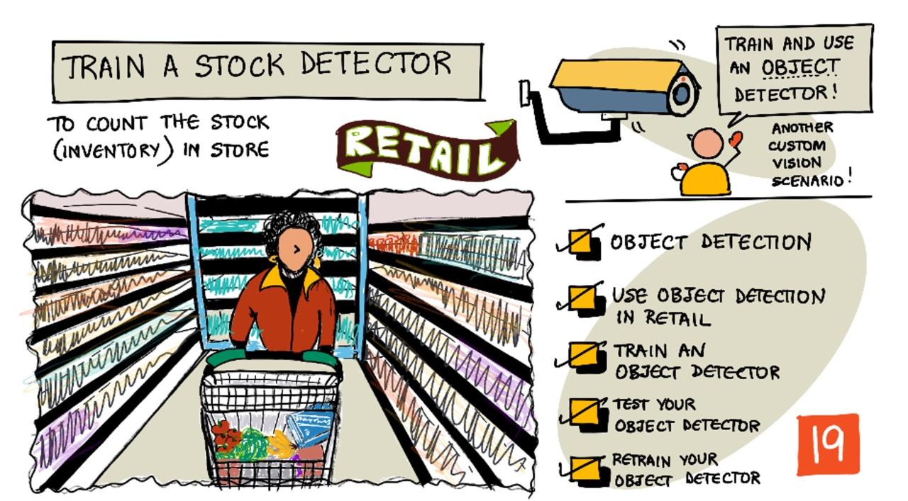

<!--
CO_OP_TRANSLATOR_METADATA:
{
  "original_hash": "8df310a42f902139a01417dacb1ffbef",
  "translation_date": "2025-08-26T21:37:16+00:00",
  "source_file": "5-retail/lessons/1-train-stock-detector/README.md",
  "language_code": "ar"
}
-->
# تدريب كاشف المخزون

> رسم توضيحي بواسطة [نيتيا ناراسيمهان](https://github.com/nitya). انقر على الصورة للحصول على نسخة أكبر.

يقدم هذا الفيديو نظرة عامة على كشف الكائنات باستخدام خدمة Azure Custom Vision، وهي خدمة سيتم تناولها في هذا الدرس.

> 🎥 انقر على الصورة أعلاه لمشاهدة الفيديو

## اختبار قبل المحاضرة

[اختبار قبل المحاضرة](https://black-meadow-040d15503.1.azurestaticapps.net/quiz/37)

## المقدمة

في المشروع السابق، استخدمت الذكاء الاصطناعي لتدريب مصنف صور - نموذج يمكنه تحديد ما إذا كانت الصورة تحتوي على شيء معين، مثل فاكهة ناضجة أو غير ناضجة. نوع آخر من نماذج الذكاء الاصطناعي التي يمكن استخدامها مع الصور هو كشف الكائنات. هذه النماذج لا تصنف الصورة باستخدام علامات، بل يتم تدريبها للتعرف على الكائنات، ويمكنها العثور عليها في الصور، ليس فقط اكتشاف وجود الكائن، بل تحديد مكانه في الصورة. يتيح لك هذا عد الكائنات في الصور.

في هذا الدرس، ستتعلم عن كشف الكائنات، بما في ذلك كيفية استخدامه في البيع بالتجزئة. ستتعلم أيضًا كيفية تدريب كاشف كائنات في السحابة.

في هذا الدرس سنتناول:

* [كشف الكائنات](../../../../../5-retail/lessons/1-train-stock-detector)
* [استخدام كشف الكائنات في البيع بالتجزئة](../../../../../5-retail/lessons/1-train-stock-detector)
* [تدريب كاشف كائنات](../../../../../5-retail/lessons/1-train-stock-detector)
* [اختبار كاشف الكائنات الخاص بك](../../../../../5-retail/lessons/1-train-stock-detector)
* [إعادة تدريب كاشف الكائنات الخاص بك](../../../../../5-retail/lessons/1-train-stock-detector)

## كشف الكائنات

يتضمن كشف الكائنات اكتشاف الكائنات في الصور باستخدام الذكاء الاصطناعي. على عكس مصنف الصور الذي قمت بتدريبه في المشروع الأخير، لا يتعلق كشف الكائنات بتوقع أفضل علامة للصورة ككل، بل بالعثور على كائن أو أكثر في الصورة.

### كشف الكائنات مقابل تصنيف الصور

تصنيف الصور يتعلق بتصنيف الصورة ككل - ما هي احتمالية أن تتطابق الصورة بأكملها مع كل علامة. تحصل على احتمالات لكل علامة تم استخدامها لتدريب النموذج.

في المثال أعلاه، تم تصنيف صورتين باستخدام نموذج تم تدريبه لتصنيف عبوات المكسرات أو علب معجون الطماطم. الصورة الأولى هي عبوة مكسرات، ولديها نتيجتان من مصنف الصور:

| العلامة         | الاحتمالية |
| --------------- | ----------: |
| `المكسرات`     | 98.4%       |
| `معجون الطماطم` | 1.6%        |

الصورة الثانية هي علبة معجون الطماطم، والنتائج هي:

| العلامة         | الاحتمالية |
| --------------- | ----------: |
| `المكسرات`     | 0.7%        |
| `معجون الطماطم` | 99.3%       |

يمكنك استخدام هذه القيم مع نسبة حدية للتنبؤ بما هو موجود في الصورة. ولكن ماذا لو كانت الصورة تحتوي على عدة علب من معجون الطماطم، أو كلاً من المكسرات ومعجون الطماطم؟ ربما لن تعطيك النتائج ما تريده. هنا يأتي دور كشف الكائنات.

كشف الكائنات يتضمن تدريب نموذج للتعرف على الكائنات. بدلاً من إعطائه صورًا تحتوي على الكائن وإخباره بأن كل صورة هي علامة واحدة أو أخرى، تقوم بتحديد الجزء من الصورة الذي يحتوي على الكائن المحدد، وتضع علامة عليه. يمكنك وضع علامة على كائن واحد في الصورة أو عدة كائنات. بهذه الطريقة يتعلم النموذج كيف يبدو الكائن نفسه، وليس فقط كيف تبدو الصور التي تحتوي على الكائن.

عندما تستخدمه للتنبؤ بالصور، بدلاً من الحصول على قائمة بالعلامات والنسب المئوية، تحصل على قائمة بالكائنات المكتشفة، مع صندوق الإحاطة واحتمالية أن يتطابق الكائن مع العلامة المخصصة.

> 🎓 *صناديق الإحاطة* هي الصناديق المحيطة بالكائن.

الصورة أعلاه تحتوي على عبوة مكسرات وثلاث علب من معجون الطماطم. كاشف الكائنات اكتشف المكسرات، وأعاد صندوق الإحاطة الذي يحتوي على المكسرات مع النسبة المئوية لاحتمالية أن يحتوي الصندوق على الكائن، في هذه الحالة 97.6%. كما اكتشف كاشف الكائنات ثلاث علب من معجون الطماطم، وقدم ثلاثة صناديق إحاطة منفصلة، واحد لكل علبة مكتشفة، ولكل منها نسبة مئوية لاحتمالية أن يحتوي الصندوق على علبة معجون الطماطم.

✅ فكر في بعض السيناريوهات المختلفة التي قد ترغب في استخدام نماذج الذكاء الاصطناعي القائمة على الصور من أجلها. أي منها يحتاج إلى تصنيف، وأي منها يحتاج إلى كشف الكائنات؟

### كيف يعمل كشف الكائنات

يستخدم كشف الكائنات نماذج تعلم آلي معقدة. تعمل هذه النماذج عن طريق تقسيم الصورة إلى خلايا متعددة، ثم تتحقق مما إذا كان مركز صندوق الإحاطة هو مركز صورة تتطابق مع إحدى الصور المستخدمة لتدريب النموذج. يمكنك التفكير في هذا كأنه تشغيل مصنف صور على أجزاء مختلفة من الصورة للبحث عن تطابقات.

> 💁 هذا تبسيط مفرط للغاية. هناك العديد من التقنيات لكشف الكائنات، ويمكنك قراءة المزيد عنها في [صفحة كشف الكائنات على ويكيبيديا](https://wikipedia.org/wiki/Object_detection).

هناك عدد من النماذج المختلفة التي يمكنها كشف الكائنات. أحد النماذج الشهيرة هو [YOLO (You only look once)](https://pjreddie.com/darknet/yolo/)، وهو سريع للغاية ويمكنه كشف 20 فئة مختلفة من الكائنات، مثل الأشخاص، الكلاب، الزجاجات والسيارات.

✅ اقرأ عن نموذج YOLO على [pjreddie.com/darknet/yolo/](https://pjreddie.com/darknet/yolo/)

يمكن إعادة تدريب نماذج كشف الكائنات باستخدام التعلم بالنقل لاكتشاف كائنات مخصصة.

## استخدام كشف الكائنات في البيع بالتجزئة

كشف الكائنات له استخدامات متعددة في البيع بالتجزئة. بعض الأمثلة تشمل:

* **التحقق من المخزون والعد** - التعرف على نقص المخزون على الأرفف. إذا كان المخزون منخفضًا جدًا، يمكن إرسال إشعارات للموظفين أو الروبوتات لإعادة تعبئة الأرفف.
* **كشف الأقنعة** - في المتاجر التي لديها سياسات ارتداء الأقنعة خلال الأحداث الصحية العامة، يمكن لكشف الكائنات التعرف على الأشخاص الذين يرتدون الأقنعة والذين لا يرتدونها.
* **الفوترة الآلية** - كشف العناصر التي يتم أخذها من الأرفف في المتاجر الآلية وفوترة العملاء بشكل مناسب.
* **كشف المخاطر** - التعرف على العناصر المكسورة على الأرضيات، أو السوائل المسكوبة، وتنبيه فرق التنظيف.

✅ قم ببعض البحث: ما هي بعض الاستخدامات الأخرى لكشف الكائنات في البيع بالتجزئة؟

## تدريب كاشف كائنات

يمكنك تدريب كاشف كائنات باستخدام Custom Vision، بطريقة مشابهة لتدريب مصنف الصور.

### المهمة - إنشاء كاشف كائنات

1. قم بإنشاء مجموعة موارد لهذا المشروع باسم `stock-detector`.

1. قم بإنشاء مورد تدريب Custom Vision مجاني، ومورد تنبؤ Custom Vision مجاني في مجموعة الموارد `stock-detector`. قم بتسميتهما `stock-detector-training` و`stock-detector-prediction`.

    > 💁 يمكنك فقط الحصول على مورد تدريب وتنبؤ مجاني واحد، لذا تأكد من تنظيف مشروعك من الدروس السابقة.

    > ⚠️ يمكنك الرجوع إلى [التعليمات لإنشاء موارد التدريب والتنبؤ من المشروع 4، الدرس 1 إذا لزم الأمر](../../../4-manufacturing/lessons/1-train-fruit-detector/README.md#task---create-a-cognitive-services-resource).

1. افتح بوابة Custom Vision على [CustomVision.ai](https://customvision.ai)، وقم بتسجيل الدخول باستخدام حساب Microsoft الذي استخدمته لحساب Azure الخاص بك.

1. اتبع [قسم إنشاء مشروع جديد في دليل البدء السريع لبناء كاشف كائنات على مستندات Microsoft](https://docs.microsoft.com/azure/cognitive-services/custom-vision-service/get-started-build-detector?WT.mc_id=academic-17441-jabenn#create-a-new-project) لإنشاء مشروع Custom Vision جديد. قد يتغير واجهة المستخدم، وهذه المستندات هي المرجع الأكثر تحديثًا دائمًا.

    قم بتسمية مشروعك `stock-detector`.

    عند إنشاء مشروعك، تأكد من استخدام مورد `stock-detector-training` الذي أنشأته سابقًا. استخدم نوع المشروع *كشف الكائنات*، والنطاق *المنتجات على الأرفف*.

    

    ✅ النطاق "المنتجات على الأرفف" مخصص بشكل خاص لاكتشاف المخزون على أرفف المتاجر. اقرأ المزيد عن النطاقات المختلفة في [مستندات اختيار النطاق على مستندات Microsoft](https://docs.microsoft.com/azure/cognitive-services/custom-vision-service/select-domain?WT.mc_id=academic-17441-jabenn#object-detection)

✅ خذ بعض الوقت لاستكشاف واجهة مستخدم Custom Vision لكاشف الكائنات الخاص بك.

### المهمة - تدريب كاشف الكائنات الخاص بك

لتدريب النموذج الخاص بك، ستحتاج إلى مجموعة من الصور التي تحتوي على الكائنات التي تريد كشفها.

1. اجمع صورًا تحتوي على الكائن الذي تريد كشفه. ستحتاج إلى ما لا يقل عن 15 صورة تحتوي على كل كائن للكشف عنه من زوايا مختلفة وفي ظروف إضاءة مختلفة، ولكن كلما زاد العدد كان أفضل. يستخدم كاشف الكائنات هذا نطاق *المنتجات على الأرفف*، لذا حاول ترتيب الكائنات كما لو كانت على رف متجر. ستحتاج أيضًا إلى بعض الصور لاختبار النموذج. إذا كنت تكشف عن أكثر من كائن، فستحتاج إلى بعض الصور الاختبارية التي تحتوي على جميع الكائنات.

    > 💁 الصور التي تحتوي على كائنات مختلفة متعددة تُحسب ضمن الحد الأدنى البالغ 15 صورة لجميع الكائنات في الصورة.

    يجب أن تكون صورك بصيغة png أو jpeg، وأقل من 6 ميجابايت. إذا قمت بإنشائها باستخدام iPhone على سبيل المثال، فقد تكون صورًا عالية الدقة بصيغة HEIC، لذا ستحتاج إلى تحويلها وربما تقليل حجمها. كلما زاد عدد الصور كان أفضل، ويجب أن يكون لديك عدد مماثل من الصور للكائنات الناضجة وغير الناضجة.

    النموذج مصمم للمنتجات على الأرفف، لذا حاول التقاط الصور للكائنات على الأرفف.

    يمكنك العثور على بعض الصور النموذجية التي يمكنك استخدامها في مجلد [images](../../../../../5-retail/lessons/1-train-stock-detector/images) للمكسرات ومعجون الطماطم.

1. اتبع [قسم تحميل الصور ووضع العلامات في دليل البدء السريع لبناء كاشف كائنات على مستندات Microsoft](https://docs.microsoft.com/azure/cognitive-services/custom-vision-service/get-started-build-detector?WT.mc_id=academic-17441-jabenn#upload-and-tag-images) لتحميل صور التدريب الخاصة بك. قم بإنشاء علامات ذات صلة بناءً على أنواع الكائنات التي تريد كشفها.

    

    عند رسم صناديق الإحاطة للكائنات، اجعلها ضيقة حول الكائن. قد يستغرق الأمر بعض الوقت لتحديد جميع الصور، ولكن الأداة ستكتشف ما تعتقد أنه صناديق الإحاطة، مما يجعل العملية أسرع.

    

    > 💁 إذا كان لديك أكثر من 15 صورة لكل كائن، يمكنك التدريب بعد 15 صورة ثم استخدام ميزة **العلامات المقترحة**. ستستخدم هذه الميزة النموذج المدرب لاكتشاف الكائنات في الصور غير الموسومة. يمكنك بعد ذلك تأكيد الكائنات المكتشفة، أو رفضها وإعادة رسم صناديق الإحاطة. يمكن أن يوفر هذا *الكثير* من الوقت.

1. اتبع [قسم تدريب الكاشف في دليل البدء السريع لبناء كاشف كائنات على مستندات Microsoft](https://docs.microsoft.com/azure/cognitive-services/custom-vision-service/get-started-build-detector?WT.mc_id=academic-17441-jabenn#train-the-detector) لتدريب كاشف الكائنات على الصور الموسومة الخاصة بك.

    سيتم إعطاؤك خيار نوع التدريب. اختر **التدريب السريع**.

سيبدأ كاشف الكائنات في التدريب. سيستغرق الأمر بضع دقائق حتى يكتمل التدريب.

## اختبار كاشف الكائنات الخاص بك

بمجرد تدريب كاشف الكائنات الخاص بك، يمكنك اختباره عن طريق إعطائه صورًا جديدة للكشف عن الكائنات فيها.

### المهمة - اختبار كاشف الكائنات الخاص بك

1. استخدم زر **الاختبار السريع** لتحميل صور الاختبار والتحقق من اكتشاف الكائنات. استخدم صور الاختبار التي أنشأتها سابقًا، وليس أيًا من الصور التي استخدمتها للتدريب.

    

1. جرب جميع صور الاختبار التي لديك وراقب الاحتمالات.

## إعادة تدريب كاشف الكائنات الخاص بك

عندما تختبر كاشف الكائنات الخاص بك، قد لا يعطي النتائج التي تتوقعها، كما هو الحال مع مصنفي الصور في المشروع السابق. يمكنك تحسين كاشف الكائنات الخاص بك عن طريق إعادة تدريبه باستخدام الصور التي يخطئ فيها.

في كل مرة تقوم فيها بإجراء تنبؤ باستخدام خيار الاختبار السريع، يتم تخزين الصورة والنتائج. يمكنك استخدام هذه الصور لإعادة تدريب النموذج الخاص بك.

1. استخدم علامة التبويب **التنبؤات** لتحديد الصور التي استخدمتها للاختبار.

1. قم بتأكيد أي اكتشافات دقيقة، واحذف أي اكتشافات غير صحيحة وأضف أي كائنات مفقودة.

1. أعد تدريب النموذج وأعد اختباره.

---

## 🚀 التحدي

ماذا سيحدث إذا استخدمت كاشف الكائنات مع عناصر متشابهة الشكل، مثل علب معجون الطماطم وعلب الطماطم المقطعة من نفس العلامة التجارية؟

إذا كان لديك أي عناصر متشابهة الشكل، جرب إضافتها إلى كاشف الكائنات الخاص بك واختبر النتائج.

## اختبار بعد المحاضرة
[اختبار ما بعد المحاضرة](https://black-meadow-040d15503.1.azurestaticapps.net/quiz/38)

## المراجعة والدراسة الذاتية

* عندما قمت بتدريب كاشف الكائنات الخاص بك، ربما لاحظت قيمًا مثل *الدقة*، *الاستدعاء*، و *mAP* التي تقيم النموذج الذي تم إنشاؤه. اقرأ عن هذه القيم باستخدام [قسم تقييم الكاشف في دليل البدء السريع لبناء كاشف الكائنات على مستندات Microsoft](https://docs.microsoft.com/azure/cognitive-services/custom-vision-service/get-started-build-detector?WT.mc_id=academic-17441-jabenn#evaluate-the-detector)
* اقرأ المزيد عن كشف الكائنات على [صفحة كشف الكائنات على ويكيبيديا](https://wikipedia.org/wiki/Object_detection)

## الواجب

[مقارنة المجالات](assignment.md)

---

**إخلاء المسؤولية**:  
تم ترجمة هذا المستند باستخدام خدمة الترجمة بالذكاء الاصطناعي [Co-op Translator](https://github.com/Azure/co-op-translator). بينما نسعى لتحقيق الدقة، يرجى العلم أن الترجمات الآلية قد تحتوي على أخطاء أو معلومات غير دقيقة. يجب اعتبار المستند الأصلي بلغته الأصلية المصدر الموثوق. للحصول على معلومات حاسمة، يُوصى بالاستعانة بترجمة بشرية احترافية. نحن غير مسؤولين عن أي سوء فهم أو تفسيرات خاطئة تنشأ عن استخدام هذه الترجمة.