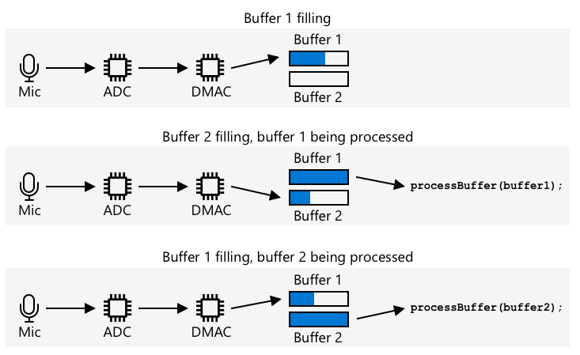

<!--
CO_OP_TRANSLATOR_METADATA:
{
  "original_hash": "2f336726b9410e97c3aaed76cc89b0d8",
  "translation_date": "2025-08-27T00:25:04+00:00",
  "source_file": "6-consumer/lessons/1-speech-recognition/wio-terminal-audio.md",
  "language_code": "ar"
}
-->
# التقاط الصوت - Wio Terminal

في هذا الجزء من الدرس، ستكتب كودًا لالتقاط الصوت باستخدام Wio Terminal الخاص بك. سيتم التحكم في التقاط الصوت بواسطة أحد الأزرار الموجودة في الجزء العلوي من Wio Terminal.

## برمجة الجهاز لالتقاط الصوت

يمكنك التقاط الصوت من الميكروفون باستخدام كود C++. يحتوي Wio Terminal على ذاكرة RAM بحجم 192KB فقط، وهي غير كافية لالتقاط أكثر من بضع ثوانٍ من الصوت. كما يحتوي على ذاكرة فلاش بحجم 4MB، والتي يمكن استخدامها بدلاً من ذلك، حيث يتم حفظ الصوت الملتقط في ذاكرة الفلاش.

الميكروفون المدمج يلتقط إشارة تناظرية يتم تحويلها إلى إشارة رقمية يمكن لـ Wio Terminal استخدامها. عند التقاط الصوت، يجب التقاط البيانات في الوقت المناسب - على سبيل المثال، لالتقاط الصوت عند 16KHz، يجب التقاط الصوت 16,000 مرة في الثانية بالضبط، مع فواصل زمنية متساوية بين كل عينة. بدلاً من استخدام الكود الخاص بك للقيام بذلك، يمكنك استخدام وحدة التحكم في الوصول المباشر للذاكرة (DMAC). هذه الدائرة يمكنها التقاط إشارة من مكان ما وكتابتها في الذاكرة دون مقاطعة الكود الذي يعمل على المعالج.

✅ اقرأ المزيد عن DMA على [صفحة الوصول المباشر للذاكرة على ويكيبيديا](https://wikipedia.org/wiki/Direct_memory_access).



يمكن لـ DMAC التقاط الصوت من ADC بفواصل زمنية ثابتة، مثل 16,000 مرة في الثانية للصوت عند 16KHz. يمكنه كتابة هذه البيانات الملتقطة إلى مخزن ذاكرة مخصص مسبقًا، وعندما يمتلئ، يصبح متاحًا للكود الخاص بك لمعالجته. استخدام هذه الذاكرة يمكن أن يؤخر التقاط الصوت، ولكن يمكنك إعداد مخازن متعددة. يكتب DMAC إلى المخزن 1، ثم عندما يمتلئ، يُعلم الكود الخاص بك بمعالجة المخزن 1، بينما يكتب DMAC إلى المخزن 2. عندما يمتلئ المخزن 2، يُعلم الكود الخاص بك، ويعود إلى الكتابة في المخزن 1. بهذه الطريقة، طالما أنك تعالج كل مخزن في وقت أقل من الوقت الذي يستغرقه ملء واحد، فلن تفقد أي بيانات.

بمجرد التقاط كل مخزن، يمكن كتابته إلى ذاكرة الفلاش. يجب كتابة ذاكرة الفلاش باستخدام عناوين محددة، مع تحديد مكان الكتابة وحجم الكتابة، مشابه لتحديث مصفوفة من البايتات في الذاكرة. ذاكرة الفلاش لديها خاصية الحبيبات، مما يعني أن عمليات المسح والكتابة تعتمد ليس فقط على كونها بحجم ثابت، ولكن أيضًا على التوافق مع هذا الحجم. على سبيل المثال، إذا كانت الحبيبات بحجم 4096 بايت وطلبت مسحًا عند العنوان 4200، فقد يمسح كل البيانات من العنوان 4096 إلى 8192. هذا يعني أنه عند كتابة بيانات الصوت إلى ذاكرة الفلاش، يجب أن تكون في أجزاء بالحجم الصحيح.

### المهمة - إعداد ذاكرة الفلاش

1. قم بإنشاء مشروع جديد تمامًا لـ Wio Terminal باستخدام PlatformIO. قم بتسمية هذا المشروع `smart-timer`. أضف كودًا في وظيفة `setup` لتكوين المنفذ التسلسلي.

1. أضف تبعيات المكتبة التالية إلى ملف `platformio.ini` لتوفير الوصول إلى ذاكرة الفلاش:

    ```ini
    lib_deps =
        seeed-studio/Seeed Arduino FS @ 2.1.1
        seeed-studio/Seeed Arduino SFUD @ 2.0.2
    ```

1. افتح ملف `main.cpp` وأضف التوجيه التالي لتضمين مكتبة ذاكرة الفلاش في أعلى الملف:

    ```cpp
    #include <sfud.h>
    #include <SPI.h>
    ```

    > 🎓 SFUD تعني Serial Flash Universal Driver، وهي مكتبة مصممة للعمل مع جميع شرائح ذاكرة الفلاش.

1. في وظيفة `setup`، أضف الكود التالي لإعداد مكتبة تخزين الفلاش:

    ```cpp
    while (!(sfud_init() == SFUD_SUCCESS))
        ;

    sfud_qspi_fast_read_enable(sfud_get_device(SFUD_W25Q32_DEVICE_INDEX), 2);
    ```

    هذا الكود يقوم بالتكرار حتى يتم تهيئة مكتبة SFUD، ثم يقوم بتشغيل القراءة السريعة. يمكن الوصول إلى ذاكرة الفلاش المدمجة باستخدام واجهة QSPI (Queued Serial Peripheral Interface)، وهي نوع من وحدات التحكم SPI التي تسمح بالوصول المستمر عبر قائمة انتظار مع استخدام قليل للمعالج. هذا يجعل القراءة والكتابة إلى ذاكرة الفلاش أسرع.

1. قم بإنشاء ملف جديد في مجلد `src` يسمى `flash_writer.h`.

1. أضف ما يلي إلى أعلى هذا الملف:

    ```cpp
    #pragma once

    #include <Arduino.h>
    #include <sfud.h>
    ```

    هذا يتضمن بعض ملفات الرأس المطلوبة، بما في ذلك ملف الرأس الخاص بمكتبة SFUD للتفاعل مع ذاكرة الفلاش.

1. قم بتعريف صف في ملف الرأس الجديد يسمى `FlashWriter`:

    ```cpp
    class FlashWriter
    {
    public:
    
    private:
    };
    ```

1. في القسم الخاص، أضف الكود التالي:

    ```cpp
    byte *_sfudBuffer;
    size_t _sfudBufferSize;
    size_t _sfudBufferPos;
    size_t _sfudBufferWritePos;

    const sfud_flash *_flash;
    ```

    هذا يحدد بعض الحقول للمخزن لاستخدامه لتخزين البيانات قبل كتابتها إلى ذاكرة الفلاش. هناك مصفوفة بايت، `_sfudBuffer`، لكتابة البيانات إليها، وعندما تمتلئ، يتم كتابة البيانات إلى ذاكرة الفلاش. الحقل `_sfudBufferPos` يخزن الموقع الحالي للكتابة في هذا المخزن، و `_sfudBufferWritePos` يخزن الموقع في ذاكرة الفلاش للكتابة إليه. `_flash` هو مؤشر لذاكرة الفلاش للكتابة إليها - بعض المتحكمات الدقيقة تحتوي على شرائح ذاكرة فلاش متعددة.

1. أضف الطريقة التالية إلى القسم العام لتهيئة هذا الصف:

    ```cpp
    void init()
    {
        _flash = sfud_get_device_table() + 0;
        _sfudBufferSize = _flash->chip.erase_gran;
        _sfudBuffer = new byte[_sfudBufferSize];
        _sfudBufferPos = 0;
        _sfudBufferWritePos = 0;
    }
    ```

    هذا يقوم بتكوين ذاكرة الفلاش على Wio Terminal للكتابة إليها، ويقوم بإعداد المخازن بناءً على حجم الحبيبات لذاكرة الفلاش. يتم ذلك في طريقة `init` بدلاً من المُنشئ لأن هذا يحتاج إلى أن يتم استدعاؤه بعد إعداد ذاكرة الفلاش في وظيفة `setup`.

1. أضف الكود التالي إلى القسم العام:

    ```cpp
    void writeSfudBuffer(byte b)
    {
        _sfudBuffer[_sfudBufferPos++] = b;
        if (_sfudBufferPos == _sfudBufferSize)
        {
            sfud_erase_write(_flash, _sfudBufferWritePos, _sfudBufferSize, _sfudBuffer);
            _sfudBufferWritePos += _sfudBufferSize;
            _sfudBufferPos = 0;
        }
    }

    void writeSfudBuffer(byte *b, size_t len)
    {
        for (size_t i = 0; i < len; ++i)
        {
            writeSfudBuffer(b[i]);
        }
    }

    void flushSfudBuffer()
    {
        if (_sfudBufferPos > 0)
        {
            sfud_erase_write(_flash, _sfudBufferWritePos, _sfudBufferSize, _sfudBuffer);
            _sfudBufferWritePos += _sfudBufferSize;
            _sfudBufferPos = 0;
        }
    }
    ```

    هذا الكود يحدد طرقًا لكتابة البايتات إلى نظام تخزين الفلاش. يعمل عن طريق الكتابة إلى مخزن في الذاكرة بالحجم المناسب لذاكرة الفلاش، وعندما يمتلئ، يتم كتابته إلى ذاكرة الفلاش، مع مسح أي بيانات موجودة في ذلك الموقع. هناك أيضًا طريقة `flushSfudBuffer` لكتابة مخزن غير مكتمل، حيث أن البيانات التي يتم التقاطها لن تكون مضاعفات دقيقة لحجم الحبيبات، لذا يجب كتابة الجزء الأخير من البيانات.

    > 💁 الجزء الأخير من البيانات سيكتب بيانات إضافية غير مرغوب فيها، ولكن هذا مقبول حيث سيتم قراءة البيانات المطلوبة فقط.

### المهمة - إعداد التقاط الصوت

1. قم بإنشاء ملف جديد في مجلد `src` يسمى `config.h`.

1. أضف ما يلي إلى أعلى هذا الملف:

    ```cpp
    #pragma once

    #define RATE 16000
    #define SAMPLE_LENGTH_SECONDS 4
    #define SAMPLES RATE * SAMPLE_LENGTH_SECONDS
    #define BUFFER_SIZE (SAMPLES * 2) + 44
    #define ADC_BUF_LEN 1600
    ```

    هذا الكود يقوم بإعداد بعض الثوابت لالتقاط الصوت.

    | الثابت               | القيمة  | الوصف |
    | --------------------- | -----: | - |
    | RATE                  | 16000  | معدل العينات للصوت. 16,000 هو 16KHz |
    | SAMPLE_LENGTH_SECONDS | 4      | طول الصوت الذي سيتم التقاطه. يتم ضبطه على 4 ثوانٍ. لتسجيل صوت أطول، قم بزيادة هذا. |
    | SAMPLES               | 64000  | العدد الإجمالي لعينات الصوت التي سيتم التقاطها. يتم ضبطه على معدل العينات * عدد الثواني |
    | BUFFER_SIZE           | 128044 | حجم مخزن الصوت الذي سيتم التقاطه. سيتم التقاط الصوت كملف WAV، وهو 44 بايت للرأس، ثم 128,000 بايت لبيانات الصوت (كل عينة هي 2 بايت) |
    | ADC_BUF_LEN           | 1600   | حجم المخازن لاستخدامها لالتقاط الصوت من DMAC |

    > 💁 إذا وجدت أن 4 ثوانٍ قصيرة جدًا لطلب مؤقت، يمكنك زيادة قيمة `SAMPLE_LENGTH_SECONDS`، وسيتم إعادة حساب جميع القيم الأخرى.

1. قم بإنشاء ملف جديد في مجلد `src` يسمى `mic.h`.

1. أضف ما يلي إلى أعلى هذا الملف:

    ```cpp
    #pragma once

    #include <Arduino.h>

    #include "config.h"
    #include "flash_writer.h"
    ```

    هذا يتضمن بعض ملفات الرأس المطلوبة، بما في ذلك ملفات الرأس `config.h` و `FlashWriter`.

1. أضف ما يلي لتعريف صف `Mic` يمكنه التقاط الصوت من الميكروفون:

    ```cpp
    class Mic
    {
    public:
        Mic()
        {
            _isRecording = false;
            _isRecordingReady = false;
        }
    
        void startRecording()
        {
            _isRecording = true;
            _isRecordingReady = false;
        }
    
        bool isRecording()
        {
            return _isRecording;
        }
    
        bool isRecordingReady()
        {
            return _isRecordingReady;
        }
    
    private:
        volatile bool _isRecording;
        volatile bool _isRecordingReady;
        FlashWriter _writer;
    };
    
    Mic mic;
    ```

    هذا الصف يحتوي حاليًا فقط على بعض الحقول لتتبع ما إذا كان التسجيل قد بدأ، وما إذا كان التسجيل جاهزًا للاستخدام. عندما يتم إعداد DMAC، فإنه يكتب باستمرار إلى مخازن الذاكرة، لذا فإن العلم `_isRecording` يحدد ما إذا كان يجب معالجة هذه المخازن أو تجاهلها. سيتم ضبط العلم `_isRecordingReady` عندما يتم التقاط 4 ثوانٍ من الصوت المطلوبة. الحقل `_writer` يُستخدم لحفظ بيانات الصوت إلى ذاكرة الفلاش.

    يتم بعد ذلك إعلان متغير عالمي كمثال لصف `Mic`.

1. أضف الكود التالي إلى القسم الخاص في صف `Mic`:

    ```cpp
    typedef struct
    {
        uint16_t btctrl;
        uint16_t btcnt;
        uint32_t srcaddr;
        uint32_t dstaddr;
        uint32_t descaddr;
    } dmacdescriptor;

    // Globals - DMA and ADC
    volatile dmacdescriptor _wrb[DMAC_CH_NUM] __attribute__((aligned(16)));
    dmacdescriptor _descriptor_section[DMAC_CH_NUM] __attribute__((aligned(16)));
    dmacdescriptor _descriptor __attribute__((aligned(16)));

    void configureDmaAdc()
    {
        // Configure DMA to sample from ADC at a regular interval (triggered by timer/counter)
        DMAC->BASEADDR.reg = (uint32_t)_descriptor_section;                    // Specify the location of the descriptors
        DMAC->WRBADDR.reg = (uint32_t)_wrb;                                    // Specify the location of the write back descriptors
        DMAC->CTRL.reg = DMAC_CTRL_DMAENABLE | DMAC_CTRL_LVLEN(0xf);           // Enable the DMAC peripheral
        DMAC->Channel[1].CHCTRLA.reg = DMAC_CHCTRLA_TRIGSRC(TC5_DMAC_ID_OVF) | // Set DMAC to trigger on TC5 timer overflow
                                        DMAC_CHCTRLA_TRIGACT_BURST;             // DMAC burst transfer

        _descriptor.descaddr = (uint32_t)&_descriptor_section[1];                    // Set up a circular descriptor
        _descriptor.srcaddr = (uint32_t)&ADC1->RESULT.reg;                           // Take the result from the ADC0 RESULT register
        _descriptor.dstaddr = (uint32_t)_adc_buf_0 + sizeof(uint16_t) * ADC_BUF_LEN; // Place it in the adc_buf_0 array
        _descriptor.btcnt = ADC_BUF_LEN;                                             // Beat count
        _descriptor.btctrl = DMAC_BTCTRL_BEATSIZE_HWORD |                            // Beat size is HWORD (16-bits)
                                DMAC_BTCTRL_DSTINC |                                    // Increment the destination address
                                DMAC_BTCTRL_VALID |                                     // Descriptor is valid
                                DMAC_BTCTRL_BLOCKACT_SUSPEND;                           // Suspend DMAC channel 0 after block transfer
        memcpy(&_descriptor_section[0], &_descriptor, sizeof(_descriptor));          // Copy the descriptor to the descriptor section

        _descriptor.descaddr = (uint32_t)&_descriptor_section[0];                    // Set up a circular descriptor
        _descriptor.srcaddr = (uint32_t)&ADC1->RESULT.reg;                           // Take the result from the ADC0 RESULT register
        _descriptor.dstaddr = (uint32_t)_adc_buf_1 + sizeof(uint16_t) * ADC_BUF_LEN; // Place it in the adc_buf_1 array
        _descriptor.btcnt = ADC_BUF_LEN;                                             // Beat count
        _descriptor.btctrl = DMAC_BTCTRL_BEATSIZE_HWORD |                            // Beat size is HWORD (16-bits)
                                DMAC_BTCTRL_DSTINC |                                    // Increment the destination address
                                DMAC_BTCTRL_VALID |                                     // Descriptor is valid
                                DMAC_BTCTRL_BLOCKACT_SUSPEND;                           // Suspend DMAC channel 0 after block transfer
        memcpy(&_descriptor_section[1], &_descriptor, sizeof(_descriptor));          // Copy the descriptor to the descriptor section

        // Configure NVIC
        NVIC_SetPriority(DMAC_1_IRQn, 0); // Set the Nested Vector Interrupt Controller (NVIC) priority for DMAC1 to 0 (highest)
        NVIC_EnableIRQ(DMAC_1_IRQn);      // Connect DMAC1 to Nested Vector Interrupt Controller (NVIC)

        // Activate the suspend (SUSP) interrupt on DMAC channel 1
        DMAC->Channel[1].CHINTENSET.reg = DMAC_CHINTENSET_SUSP;

        // Configure ADC
        ADC1->INPUTCTRL.bit.MUXPOS = ADC_INPUTCTRL_MUXPOS_AIN12_Val; // Set the analog input to ADC0/AIN2 (PB08 - A4 on Metro M4)
        while (ADC1->SYNCBUSY.bit.INPUTCTRL)
            ;                              // Wait for synchronization
        ADC1->SAMPCTRL.bit.SAMPLEN = 0x00; // Set max Sampling Time Length to half divided ADC clock pulse (2.66us)
        while (ADC1->SYNCBUSY.bit.SAMPCTRL)
            ;                                         // Wait for synchronization
        ADC1->CTRLA.reg = ADC_CTRLA_PRESCALER_DIV128; // Divide Clock ADC GCLK by 128 (48MHz/128 = 375kHz)
        ADC1->CTRLB.reg = ADC_CTRLB_RESSEL_12BIT |    // Set ADC resolution to 12 bits
                            ADC_CTRLB_FREERUN;          // Set ADC to free run mode
        while (ADC1->SYNCBUSY.bit.CTRLB)
            ;                       // Wait for synchronization
        ADC1->CTRLA.bit.ENABLE = 1; // Enable the ADC
        while (ADC1->SYNCBUSY.bit.ENABLE)
            ;                       // Wait for synchronization
        ADC1->SWTRIG.bit.START = 1; // Initiate a software trigger to start an ADC conversion
        while (ADC1->SYNCBUSY.bit.SWTRIG)
            ; // Wait for synchronization

        // Enable DMA channel 1
        DMAC->Channel[1].CHCTRLA.bit.ENABLE = 1;

        // Configure Timer/Counter 5
        GCLK->PCHCTRL[TC5_GCLK_ID].reg = GCLK_PCHCTRL_CHEN |     // Enable peripheral channel for TC5
                                            GCLK_PCHCTRL_GEN_GCLK1; // Connect generic clock 0 at 48MHz

        TC5->COUNT16.WAVE.reg = TC_WAVE_WAVEGEN_MFRQ; // Set TC5 to Match Frequency (MFRQ) mode
        TC5->COUNT16.CC[0].reg = 3000 - 1;            // Set the trigger to 16 kHz: (4Mhz / 16000) - 1
        while (TC5->COUNT16.SYNCBUSY.bit.CC0)
            ; // Wait for synchronization

        // Start Timer/Counter 5
        TC5->COUNT16.CTRLA.bit.ENABLE = 1; // Enable the TC5 timer
        while (TC5->COUNT16.SYNCBUSY.bit.ENABLE)
            ; // Wait for synchronization
    }

    uint16_t _adc_buf_0[ADC_BUF_LEN];
    uint16_t _adc_buf_1[ADC_BUF_LEN];
    ```

    هذا الكود يحدد طريقة `configureDmaAdc` التي تقوم بتكوين DMAC، وربطه بـ ADC وضبطه لملء مخزنين مختلفين بالتناوب، `_adc_buf_0` و `_adc_buf_1`.

    > 💁 أحد عيوب تطوير المتحكمات الدقيقة هو تعقيد الكود المطلوب للتفاعل مع الأجهزة، حيث يعمل الكود الخاص بك على مستوى منخفض جدًا يتفاعل مباشرة مع الأجهزة. هذا الكود أكثر تعقيدًا مما قد تكتبه لجهاز كمبيوتر أحادي اللوحة أو جهاز كمبيوتر مكتبي حيث لا يوجد نظام تشغيل للمساعدة. هناك بعض المكتبات المتاحة التي يمكن أن تبسط هذا، ولكن لا يزال هناك الكثير من التعقيد.

1. أسفل هذا، أضف الكود التالي:

    ```cpp
    // WAV files have a header. This struct defines that header
    struct wavFileHeader
    {
        char riff[4];         /* "RIFF"                                  */
        long flength;         /* file length in bytes                    */
        char wave[4];         /* "WAVE"                                  */
        char fmt[4];          /* "fmt "                                  */
        long chunk_size;      /* size of FMT chunk in bytes (usually 16) */
        short format_tag;     /* 1=PCM, 257=Mu-Law, 258=A-Law, 259=ADPCM */
        short num_chans;      /* 1=mono, 2=stereo                        */
        long srate;           /* Sampling rate in samples per second     */
        long bytes_per_sec;   /* bytes per second = srate*bytes_per_samp */
        short bytes_per_samp; /* 2=16-bit mono, 4=16-bit stereo          */
        short bits_per_samp;  /* Number of bits per sample               */
        char data[4];         /* "data"                                  */
        long dlength;         /* data length in bytes (filelength - 44)  */
    };

    void initBufferHeader()
    {
        wavFileHeader wavh;

        strncpy(wavh.riff, "RIFF", 4);
        strncpy(wavh.wave, "WAVE", 4);
        strncpy(wavh.fmt, "fmt ", 4);
        strncpy(wavh.data, "data", 4);

        wavh.chunk_size = 16;
        wavh.format_tag = 1; // PCM
        wavh.num_chans = 1;  // mono
        wavh.srate = RATE;
        wavh.bytes_per_sec = (RATE * 1 * 16 * 1) / 8;
        wavh.bytes_per_samp = 2;
        wavh.bits_per_samp = 16;
        wavh.dlength = RATE * 2 * 1 * 16 / 2;
        wavh.flength = wavh.dlength + 44;

        _writer.writeSfudBuffer((byte *)&wavh, 44);
    }
    ```

    هذا الكود يحدد رأس ملف WAV كهيكل يشغل 44 بايت من الذاكرة. يكتب تفاصيل إلى هذا الرأس حول معدل الملف الصوتي، الحجم، وعدد القنوات. يتم بعد ذلك كتابة هذا الرأس إلى ذاكرة الفلاش.

1. أسفل هذا الكود، أضف ما يلي لإعلان طريقة يتم استدعاؤها عندما تكون مخازن الصوت جاهزة للمعالجة:

    ```cpp
    void audioCallback(uint16_t *buf, uint32_t buf_len)
    {
        static uint32_t idx = 44;

        if (_isRecording)
        {
            for (uint32_t i = 0; i < buf_len; i++)
            {
                int16_t audio_value = ((int16_t)buf[i] - 2048) * 16;

                _writer.writeSfudBuffer(audio_value & 0xFF);
                _writer.writeSfudBuffer((audio_value >> 8) & 0xFF);
            }

            idx += buf_len;
                
            if (idx >= BUFFER_SIZE)
            {
                _writer.flushSfudBuffer();
                idx = 44;
                _isRecording = false;
                _isRecordingReady = true;
            }
        }
    }
    ```

    مخازن الصوت هي مصفوفات من أعداد صحيحة 16 بت تحتوي على الصوت من ADC. يقوم ADC بإرجاع قيم غير موقعة 12 بت (0-1023)، لذا يجب تحويلها إلى قيم موقعة 16 بت، ثم تحويلها إلى 2 بايت ليتم تخزينها كبيانات ثنائية خام.

    يتم كتابة هذه البايتات إلى مخازن ذاكرة الفلاش. تبدأ الكتابة عند الفهرس 44 - هذا هو الإزاحة من 44 بايت المكتوبة كرأس ملف WAV. بمجرد التقاط جميع البايتات المطلوبة لطول الصوت المطلوب، يتم كتابة البيانات المتبقية إلى ذاكرة الفلاش.

1. في القسم العام من صف `Mic`، أضف الكود التالي:

    ```cpp
    void dmaHandler()
    {
        static uint8_t count = 0;

        if (DMAC->Channel[1].CHINTFLAG.bit.SUSP)
        {
            DMAC->Channel[1].CHCTRLB.reg = DMAC_CHCTRLB_CMD_RESUME;
            DMAC->Channel[1].CHINTFLAG.bit.SUSP = 1;

            if (count)
            {
                audioCallback(_adc_buf_0, ADC_BUF_LEN);
            }
            else
            {
                audioCallback(_adc_buf_1, ADC_BUF_LEN);
            }

            count = (count + 1) % 2;
        }
    }
    ```

    هذا الكود سيتم استدعاؤه بواسطة DMAC لإخبار الكود الخاص بك بمعالجة المخازن. يتحقق من وجود بيانات لمعالجتها، ويستدعي طريقة `audioCallback` مع المخزن المناسب.

1. خارج الصف، بعد إعلان `Mic mic;`، أضف الكود التالي:

    ```cpp
    void DMAC_1_Handler()
    {
        mic.dmaHandler();
    }
    ```

    سيتم استدعاء `DMAC_1_Handler` بواسطة DMAC عندما تكون المخازن جاهزة للمعالجة. يتم العثور على هذه الوظيفة بالاسم، لذا تحتاج فقط إلى الوجود ليتم استدعاؤها.

1. أضف الطريقتين التاليتين إلى القسم العام من صف `Mic`:

    ```cpp
    void init()
    {
        analogReference(AR_INTERNAL2V23);

        _writer.init();

        initBufferHeader();
        configureDmaAdc();
    }

    void reset()
    {
        _isRecordingReady = false;
        _isRecording = false;

        _writer.reset();

        initBufferHeader();
    }
    ```

    تحتوي طريقة `init` على كود لتهيئة صف `Mic`. تقوم هذه الطريقة بضبط الجهد الصحيح لدبوس الميكروفون، إعداد كاتب ذاكرة الفلاش، كتابة رأس ملف WAV، وتكوين DMAC. طريقة `reset` تعيد ضبط ذاكرة الفلاش وتعيد كتابة الرأس بعد التقاط الصوت واستخدامه.

### المهمة - التقاط الصوت

1. في ملف `main.cpp`، أضف توجيه تضمين لملف الرأس `mic.h`:

    ```cpp
    #include "mic.h"
    ```

1. في وظيفة `setup`، قم بتهيئة زر C. سيبدأ التقاط الصوت عند الضغط على هذا الزر، ويستمر لمدة 4 ثوانٍ:

    ```cpp
    pinMode(WIO_KEY_C, INPUT_PULLUP);
    ```

1. أسفل هذا، قم بتهيئة الميكروفون، ثم اطبع إلى وحدة التحكم أن الصوت جاهز ليتم التقاطه:

    ```cpp
    mic.init();

    Serial.println("Ready.");
    ```

1. فوق وظيفة `loop`، قم بتعريف وظيفة لمعالجة الصوت الملتقط. في الوقت الحالي، لا تفعل هذه الوظيفة شيئًا، ولكن لاحقًا في هذا الدرس ستقوم بإرسال الكلام ليتم تحويله إلى نص:

    ```cpp
    void processAudio()
    {
    
    }
    ```

1. أضف ما يلي إلى وظيفة `loop`:

    ```cpp
    void loop()
    {
        if (digitalRead(WIO_KEY_C) == LOW && !mic.isRecording())
        {
            Serial.println("Starting recording...");
            mic.startRecording();
        }
    
        if (!mic.isRecording() && mic.isRecordingReady())
        {
            Serial.println("Finished recording");
    
            processAudio();
    
            mic.reset();
        }
    }
    ```

    هذا الكود يتحقق من زر C، وإذا تم الضغط عليه ولم يبدأ التسجيل، يتم ضبط العلم `_isRecording` في صف `Mic` على true. هذا سيؤدي إلى أن تقوم طريقة `audioCallback` في صف `Mic` بتخزين الصوت حتى يتم التقاط 4 ثوانٍ. بمجرد التقاط 4 ثوانٍ من الصوت، يتم ضبط العلم `_isRecording` على false، ويتم ضبط العلم `_isRecordingReady` على true. يتم بعد ذلك التحقق من هذا العلم في وظيفة `loop`، وعندما يكون true يتم استدعاء وظيفة `processAudio`، ثم يتم إعادة ضبط صف `Mic`.

1. قم ببناء هذا الكود، ورفعه إلى Wio Terminal الخاص بك واختبره من خلال المراقب التسلسلي. اضغط على زر C (الزر الموجود على الجانب الأيسر، الأقرب إلى مفتاح التشغيل)، وتحدث. سيتم التقاط 4 ثوانٍ من الصوت.

    ```output
    --- Available filters and text transformations: colorize, debug, default, direct, hexlify, log2file, nocontrol, printable, send_on_enter, time
    --- More details at http://bit.ly/pio-monitor-filters
    --- Miniterm on /dev/cu.usbmodem1101  9600,8,N,1 ---
    --- Quit: Ctrl+C | Menu: Ctrl+T | Help: Ctrl+T followed by Ctrl+H ---
    Ready.
    Starting recording...
    Finished recording
    ```
💁 يمكنك العثور على هذا الكود في [code-record/wio-terminal](../../../../../6-consumer/lessons/1-speech-recognition/code-record/wio-terminal) المجلد.
😀 لقد نجح برنامج تسجيل الصوت الخاص بك!

---

**إخلاء المسؤولية**:  
تم ترجمة هذا المستند باستخدام خدمة الترجمة بالذكاء الاصطناعي [Co-op Translator](https://github.com/Azure/co-op-translator). بينما نسعى لتحقيق الدقة، يرجى العلم أن الترجمات الآلية قد تحتوي على أخطاء أو معلومات غير دقيقة. يجب اعتبار المستند الأصلي بلغته الأصلية المصدر الرسمي. للحصول على معلومات حاسمة، يُوصى بالاستعانة بترجمة بشرية احترافية. نحن غير مسؤولين عن أي سوء فهم أو تفسيرات خاطئة تنشأ عن استخدام هذه الترجمة.