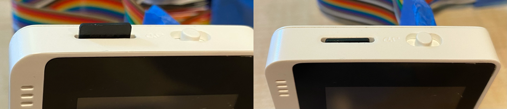

<!--
CO_OP_TRANSLATOR_METADATA:
{
  "original_hash": "93d352de36526b8990e41dd538100324",
  "translation_date": "2025-08-27T00:31:27+00:00",
  "source_file": "6-consumer/lessons/1-speech-recognition/wio-terminal-microphone.md",
  "language_code": "ar"
}
-->
# إعداد الميكروفون ومكبرات الصوت - Wio Terminal

في هذا الجزء من الدرس، ستقوم بإضافة مكبرات صوت إلى Wio Terminal الخاص بك. يحتوي Wio Terminal بالفعل على ميكروفون مدمج يمكن استخدامه لالتقاط الصوت.

## الأجهزة

يحتوي Wio Terminal بالفعل على ميكروفون مدمج يمكن استخدامه لالتقاط الصوت للتعرف على الكلام.

لإضافة مكبر صوت، يمكنك استخدام [ReSpeaker 2-Mics Pi Hat](https://www.seeedstudio.com/ReSpeaker-2-Mics-Pi-HAT.html). هذه لوحة خارجية تحتوي على ميكروفونين MEMS، بالإضافة إلى موصل مكبر صوت ومقبس سماعات.

ستحتاج إلى إضافة سماعات رأس، أو مكبر صوت بمنفذ 3.5 ملم، أو مكبر صوت بمنفذ JST مثل [Mono Enclosed Speaker - 2W 6 Ohm](https://www.seeedstudio.com/Mono-Enclosed-Speaker-2W-6-Ohm-p-2832.html).

لتوصيل ReSpeaker 2-Mics Pi Hat، ستحتاج إلى كابلات توصيل 40 دبوس (تُعرف أيضًا بكابلات ذكر-ذكر).

> 💁 إذا كنت مرتاحًا مع اللحام، يمكنك استخدام [40 Pin Raspberry Pi Hat Adapter Board For Wio Terminal](https://www.seeedstudio.com/40-Pin-Raspberry-Pi-Hat-Adapter-Board-For-Wio-Terminal-p-4730.html) لتوصيل ReSpeaker.

ستحتاج أيضًا إلى بطاقة SD لتنزيل وتشغيل الصوت. يدعم Wio Terminal بطاقات SD حتى حجم 16 جيجابايت، ويجب أن تكون مهيأة بنظام ملفات FAT32 أو exFAT.

### المهمة - توصيل ReSpeaker Pi Hat

1. مع إيقاف تشغيل Wio Terminal، قم بتوصيل ReSpeaker 2-Mics Pi Hat بـ Wio Terminal باستخدام كابلات التوصيل ومآخذ GPIO الموجودة في الجزء الخلفي من Wio Terminal:

    يجب توصيل الدبابيس بهذه الطريقة:

    

1. ضع ReSpeaker وWio Terminal بحيث تكون مآخذ GPIO مواجهة للأعلى وعلى الجانب الأيسر.

1. ابدأ من المقبس الموجود في أعلى يسار مقبس GPIO على ReSpeaker. قم بتوصيل كابل توصيل من المقبس العلوي الأيسر لـ ReSpeaker إلى المقبس العلوي الأيسر لـ Wio Terminal.

1. كرر هذه العملية على طول مآخذ GPIO الموجودة على الجانب الأيسر. تأكد من أن الدبابيس مثبتة بإحكام.

    

    

    > 💁 إذا كانت كابلات التوصيل متصلة في شرائط، احتفظ بها معًا - فهذا يسهل التأكد من أنك قمت بتوصيل جميع الكابلات بالترتيب.

1. كرر العملية باستخدام مآخذ GPIO اليمنى على ReSpeaker وWio Terminal. يجب أن تمر هذه الكابلات حول الكابلات الموجودة بالفعل.

    

    

    > 💁 إذا كانت كابلات التوصيل متصلة في شرائط، قم بتقسيمها إلى شريطين. مرر كل شريط على جانب من الكابلات الموجودة.

    > 💁 يمكنك استخدام شريط لاصق لتثبيت الدبابيس في كتلة للمساعدة في منع خروج أي منها أثناء التوصيل.
    >
    > 

1. ستحتاج إلى إضافة مكبر صوت.

    * إذا كنت تستخدم مكبر صوت بكابل JST، قم بتوصيله بمنفذ JST على ReSpeaker.

      

    * إذا كنت تستخدم مكبر صوت بمنفذ 3.5 ملم أو سماعات رأس، أدخلها في مقبس 3.5 ملم.

      

### المهمة - إعداد بطاقة SD

1. قم بتوصيل بطاقة SD بجهاز الكمبيوتر الخاص بك باستخدام قارئ خارجي إذا لم يكن لديك منفذ بطاقة SD.

1. قم بتهيئة بطاقة SD باستخدام الأداة المناسبة على جهاز الكمبيوتر الخاص بك، مع التأكد من استخدام نظام ملفات FAT32 أو exFAT.

1. أدخل بطاقة SD في منفذ بطاقة SD الموجود على الجانب الأيسر من Wio Terminal، أسفل زر التشغيل. تأكد من أن البطاقة دخلت بالكامل ونقرت في مكانها - قد تحتاج إلى أداة رفيعة أو بطاقة SD أخرى للمساعدة في دفعها بالكامل.

    

    > 💁 لإخراج بطاقة SD، تحتاج إلى دفعها قليلاً وستخرج. ستحتاج إلى أداة رفيعة للقيام بذلك مثل مفك مسطح الرأس أو بطاقة SD أخرى.

---

**إخلاء المسؤولية**:  
تم ترجمة هذا المستند باستخدام خدمة الترجمة بالذكاء الاصطناعي [Co-op Translator](https://github.com/Azure/co-op-translator). بينما نسعى لتحقيق الدقة، يرجى العلم أن الترجمات الآلية قد تحتوي على أخطاء أو عدم دقة. يجب اعتبار المستند الأصلي بلغته الأصلية المصدر الرسمي. للحصول على معلومات حاسمة، يُوصى بالاستعانة بترجمة بشرية احترافية. نحن غير مسؤولين عن أي سوء فهم أو تفسيرات خاطئة ناتجة عن استخدام هذه الترجمة.