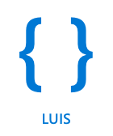

<!--
CO_OP_TRANSLATOR_METADATA:
{
  "original_hash": "6f4ba69d77f16c4a5110623a96a215c3",
  "translation_date": "2025-08-27T00:00:39+00:00",
  "source_file": "6-consumer/lessons/2-language-understanding/README.md",
  "language_code": "ar"
}
-->
# فهم اللغة


> رسم توضيحي بواسطة [نيتيا ناراسيمهان](https://github.com/nitya). اضغط على الصورة لنسخة أكبر.

## اختبار ما قبل المحاضرة

[اختبار ما قبل المحاضرة](https://black-meadow-040d15503.1.azurestaticapps.net/quiz/43)

## المقدمة

في الدرس السابق، قمت بتحويل الكلام إلى نص. لكي يتم استخدام هذا النص لبرمجة مؤقت ذكي، يجب أن يكون الكود الخاص بك قادرًا على فهم ما قيل. يمكنك افتراض أن المستخدم سيتحدث بعبارة ثابتة مثل "اضبط مؤقتًا لمدة 3 دقائق"، وتحليل هذه العبارة لمعرفة مدة المؤقت، ولكن هذا ليس مريحًا جدًا للمستخدم. إذا قال المستخدم "اضبط مؤقتًا لمدة 3 دقائق"، فإنك أو أنا سنفهم ما يعنيه، ولكن الكود الخاص بك لن يفهم ذلك لأنه يتوقع عبارة ثابتة.

هنا يأتي دور فهم اللغة، حيث يتم استخدام نماذج الذكاء الاصطناعي لتفسير النص وإرجاع التفاصيل المطلوبة. على سبيل المثال، يمكن للنموذج أن يفهم كلًا من "اضبط مؤقتًا لمدة 3 دقائق" و"اضبط مؤقتًا لمدة ثلاث دقائق"، ويستنتج أن المطلوب هو مؤقت لمدة 3 دقائق.

في هذا الدرس، ستتعلم عن نماذج فهم اللغة، وكيفية إنشائها وتدريبها واستخدامها في الكود الخاص بك.

في هذا الدرس سنتناول:

* [فهم اللغة](../../../../../6-consumer/lessons/2-language-understanding)
* [إنشاء نموذج لفهم اللغة](../../../../../6-consumer/lessons/2-language-understanding)
* [النوايا والكيانات](../../../../../6-consumer/lessons/2-language-understanding)
* [استخدام نموذج فهم اللغة](../../../../../6-consumer/lessons/2-language-understanding)

## فهم اللغة

استخدم البشر اللغة للتواصل منذ مئات الآلاف من السنين. نحن نتواصل بالكلمات أو الأصوات أو الأفعال ونفهم ما يُقال، ليس فقط معنى الكلمات أو الأصوات أو الأفعال، ولكن أيضًا سياقها. نحن نفهم الصدق والسخرية، مما يسمح لنفس الكلمات بأن تعني أشياء مختلفة بناءً على نبرة الصوت.

✅ فكر في بعض المحادثات التي أجريتها مؤخرًا. كم من هذه المحادثات سيكون من الصعب على الكمبيوتر فهمها لأنها تحتاج إلى سياق؟

فهم اللغة، الذي يُطلق عليه أيضًا فهم اللغة الطبيعية، هو جزء من مجال الذكاء الاصطناعي المعروف بمعالجة اللغة الطبيعية (NLP)، ويتعامل مع فهم النصوص، ومحاولة استيعاب تفاصيل الكلمات أو الجمل. إذا كنت تستخدم مساعدًا صوتيًا مثل Alexa أو Siri، فأنت قد استخدمت خدمات فهم اللغة. هذه الخدمات هي التي تحول "Alexa، شغّل أحدث ألبوم لتايلور سويفت" إلى ابنتي ترقص في غرفة المعيشة على أنغامها المفضلة.

> 💁 على الرغم من كل التقدم الذي أحرزته أجهزة الكمبيوتر، إلا أنها لا تزال بعيدة عن فهم النصوص بشكل حقيقي. عندما نتحدث عن فهم اللغة بالنسبة للكمبيوترات، فإننا لا نعني شيئًا قريبًا من التواصل البشري، بل نعني أخذ بعض الكلمات واستخلاص التفاصيل الرئيسية منها.

نحن كبشر نفهم اللغة دون الحاجة للتفكير في ذلك. إذا طلبت من شخص آخر "شغّل أحدث ألبوم لتايلور سويفت"، فإنه سيفهم فورًا ما أعنيه. بالنسبة للكمبيوتر، هذا أصعب. يجب عليه أن يأخذ الكلمات، التي تم تحويلها من الكلام إلى النص، ويستخلص المعلومات التالية:

* يجب تشغيل الموسيقى
* الموسيقى تخص الفنانة تايلور سويفت
* الموسيقى المطلوبة هي ألبوم كامل يحتوي على عدة مقاطع مرتبة
* لدى تايلور سويفت العديد من الألبومات، لذا يجب ترتيبها حسب التسلسل الزمني واختيار الأحدث

✅ فكر في بعض الجمل الأخرى التي قلتها عند تقديم طلبات، مثل طلب القهوة أو طلب شيء من أحد أفراد العائلة. حاول تقسيمها إلى أجزاء من المعلومات التي يحتاج الكمبيوتر لاستخلاصها لفهم الجملة.

نماذج فهم اللغة هي نماذج ذكاء اصطناعي يتم تدريبها لاستخلاص تفاصيل معينة من اللغة، ثم يتم تدريبها لمهام محددة باستخدام التعلم الانتقالي، بنفس الطريقة التي قمت بها بتدريب نموذج رؤية مخصص باستخدام مجموعة صغيرة من الصور. يمكنك أخذ نموذج، ثم تدريبه باستخدام النصوص التي تريد فهمها.

## إنشاء نموذج لفهم اللغة



يمكنك إنشاء نماذج لفهم اللغة باستخدام LUIS، وهي خدمة لفهم اللغة مقدمة من مايكروسوفت كجزء من خدمات Cognitive Services.

### المهمة - إنشاء مورد للتأليف

لاستخدام LUIS، تحتاج إلى إنشاء مورد للتأليف.

1. استخدم الأمر التالي لإنشاء مورد للتأليف في مجموعة الموارد `smart-timer`:

    ```python
    az cognitiveservices account create --name smart-timer-luis-authoring \
                                        --resource-group smart-timer \
                                        --kind LUIS.Authoring \
                                        --sku F0 \
                                        --yes \
                                        --location <location>
    ```

    استبدل `<location>` بالموقع الذي استخدمته عند إنشاء مجموعة الموارد.

    > ⚠️ خدمة LUIS غير متوفرة في جميع المناطق، لذا إذا حصلت على الخطأ التالي:
    >
    > ```output
    > InvalidApiSetId: The account type 'LUIS.Authoring' is either invalid or unavailable in given region.
    > ```
    >
    > اختر منطقة مختلفة.

    سيؤدي هذا إلى إنشاء مورد تأليف مجاني من فئة Free-tier.

### المهمة - إنشاء تطبيق لفهم اللغة

1. افتح بوابة LUIS على [luis.ai](https://luis.ai?WT.mc_id=academic-17441-jabenn) في متصفحك، وقم بتسجيل الدخول باستخدام نفس الحساب الذي كنت تستخدمه مع Azure.

1. اتبع التعليمات في الحوار لتحديد اشتراك Azure الخاص بك، ثم اختر مورد `smart-timer-luis-authoring` الذي قمت بإنشائه للتو.

1. من قائمة *تطبيقات المحادثة*، اختر زر **تطبيق جديد** لإنشاء تطبيق جديد. قم بتسمية التطبيق الجديد `smart-timer`، واضبط *الثقافة* على لغتك.

    > 💁 هناك حقل لمورد التنبؤ. يمكنك إنشاء مورد ثانٍ للتنبؤ، ولكن مورد التأليف المجاني يسمح بـ 1,000 تنبؤ شهريًا، وهو ما يكفي للتطوير، لذا يمكنك ترك هذا الحقل فارغًا.

1. اقرأ الدليل الذي يظهر بمجرد إنشاء التطبيق لفهم الخطوات التي تحتاج إلى اتخاذها لتدريب نموذج فهم اللغة. أغلق هذا الدليل عند الانتهاء.

## النوايا والكيانات

يعتمد فهم اللغة على *النوايا* و*الكيانات*. النوايا هي ما تشير إليه الكلمات، مثل تشغيل الموسيقى، ضبط مؤقت، أو طلب الطعام. الكيانات هي ما تشير إليه النية، مثل الألبوم، مدة المؤقت، أو نوع الطعام. كل جملة يفسرها النموذج يجب أن تحتوي على نية واحدة على الأقل، وربما كيان أو أكثر.

بعض الأمثلة:

| الجملة                                            | النية            | الكيانات                                   |
| ------------------------------------------------- | ---------------- | ------------------------------------------ |
| "شغّل أحدث ألبوم لتايلور سويفت"                  | *تشغيل الموسيقى* | *أحدث ألبوم لتايلور سويفت*                |
| "اضبط مؤقتًا لمدة 3 دقائق"                        | *ضبط مؤقت*       | *3 دقائق*                                 |
| "ألغِ المؤقت الخاص بي"                            | *إلغاء المؤقت*   | لا شيء                                    |
| "اطلب 3 بيتزا كبيرة بالأناناس وسلطة سيزر"         | *طلب طعام*       | *3 بيتزا كبيرة بالأناناس*، *سلطة سيزر*    |

✅ مع الجمل التي فكرت بها سابقًا، ما هي النية وأي كيانات في تلك الجملة؟

لتدريب LUIS، تبدأ بتحديد الكيانات. يمكن أن تكون هذه قائمة ثابتة من المصطلحات، أو يتم تعلمها من النص. على سبيل المثال، يمكنك تقديم قائمة ثابتة من الأطعمة المتوفرة في قائمتك، مع متغيرات (أو مرادفات) لكل كلمة، مثل *باذنجان* و*أوبرجين* كمرادفات لـ *باذنجان*. يحتوي LUIS أيضًا على كيانات مدمجة يمكن استخدامها، مثل الأرقام والمواقع.

لضبط مؤقت، يمكنك إنشاء كيان واحد باستخدام الكيانات المدمجة للأرقام للوقت، وآخر للوحدات، مثل الدقائق والثواني. يجب أن تحتوي كل وحدة على عدة متغيرات لتغطية الأشكال المفردة والجمع - مثل دقيقة ودقائق.

بمجرد تحديد الكيانات، تقوم بإنشاء النوايا. يتم تعلم هذه النوايا بواسطة النموذج بناءً على الجمل النموذجية التي تقدمها (المعروفة باسم العبارات). على سبيل المثال، لنية *ضبط مؤقت*، يمكنك تقديم الجمل التالية:

* `اضبط مؤقتًا لمدة 1 ثانية`
* `اضبط مؤقتًا لمدة 1 دقيقة و12 ثانية`
* `اضبط مؤقتًا لمدة 3 دقائق`
* `اضبط مؤقتًا لمدة 9 دقائق و30 ثانية`

ثم تخبر LUIS بالأجزاء من هذه الجمل التي تتطابق مع الكيانات:


الجملة `اضبط مؤقتًا لمدة 1 دقيقة و12 ثانية` تحتوي على النية `ضبط مؤقت`. كما تحتوي على كيانين، كل منهما له قيمتان:

|            | الوقت | الوحدة   |
| ---------- | ---: | -------- |
| 1 دقيقة    | 1    | دقيقة    |
| 12 ثانية   | 12   | ثانية    |

لتدريب نموذج جيد، تحتاج إلى مجموعة متنوعة من الجمل النموذجية المختلفة لتغطية الطرق العديدة التي قد يطلب بها شخص ما نفس الشيء.

> 💁 كما هو الحال مع أي نموذج ذكاء اصطناعي، كلما زادت البيانات ودقتها التي تستخدمها للتدريب، كان النموذج أفضل.

✅ فكر في الطرق المختلفة التي قد تطلب بها نفس الشيء وتتوقع أن يفهمها الإنسان.

### المهمة - إضافة كيانات إلى نماذج فهم اللغة

بالنسبة للمؤقت، تحتاج إلى إضافة كيانين - واحد لوحدة الوقت (الدقائق أو الثواني)، وآخر لعدد الدقائق أو الثواني.

يمكنك العثور على تعليمات استخدام بوابة LUIS في [Quickstart: Build your app in LUIS portal documentation on Microsoft docs](https://docs.microsoft.com/azure/cognitive-services/luis/luis-get-started-create-app?WT.mc_id=academic-17441-jabenn).

1. من بوابة LUIS، اختر علامة التبويب *الكيانات* وأضف كيان *number* المدمج عن طريق اختيار زر **إضافة كيان مدمج**، ثم اختيار *number* من القائمة.

1. أنشئ كيانًا جديدًا لوحدة الوقت باستخدام زر **إنشاء**. قم بتسمية الكيان `time unit` واضبط النوع على *قائمة*. أضف قيمًا لـ `minute` و`second` إلى قائمة *القيم الموحدة*، وأضف الأشكال المفردة والجمع إلى قائمة *المرادفات*. اضغط على `return` بعد إضافة كل مرادف لإضافته إلى القائمة.

    | القيمة الموحدة | المرادفات        |
    | -------------- | ---------------- |
    | minute         | دقيقة، دقائق     |
    | second         | ثانية، ثوانٍ     |

### المهمة - إضافة نوايا إلى نماذج فهم اللغة

1. من علامة التبويب *النوايا*، اختر زر **إنشاء** لإنشاء نية جديدة. قم بتسمية هذه النية `set timer`.

1. في الأمثلة، أدخل طرقًا مختلفة لضبط مؤقت باستخدام الدقائق والثواني، أو الجمع بينهما. يمكن أن تكون الأمثلة:

    * `اضبط مؤقتًا لمدة 1 ثانية`
    * `اضبط مؤقتًا لمدة 4 دقائق`
    * `اضبط مؤقتًا لمدة أربع دقائق وست ثوانٍ`
    * `اضبط مؤقتًا لمدة 9 دقائق و30 ثانية`
    * `اضبط مؤقتًا لمدة 1 دقيقة و12 ثانية`
    * `اضبط مؤقتًا لمدة 3 دقائق`
    * `اضبط مؤقتًا لمدة 3 دقائق و1 ثانية`
    * `اضبط مؤقتًا لمدة ثلاث دقائق وثانية واحدة`
    * `اضبط مؤقتًا لمدة 1 دقيقة و1 ثانية`
    * `اضبط مؤقتًا لمدة 30 ثانية`
    * `اضبط مؤقتًا لمدة 1 ثانية`

    قم بمزج الأرقام ككلمات وأرقام حتى يتعلم النموذج التعامل مع كليهما.

1. أثناء إدخال كل مثال، سيبدأ LUIS في اكتشاف الكيانات، وسيقوم بتسطيرها ووضع تسميات عليها.

    

### المهمة - تدريب واختبار النموذج

1. بمجرد تكوين الكيانات والنوايا، يمكنك تدريب النموذج باستخدام زر **تدريب** في القائمة العلوية. اختر هذا الزر، وسيتم تدريب النموذج في غضون ثوانٍ. سيكون الزر غير نشط أثناء التدريب، وسيتم تفعيله مرة أخرى بمجرد الانتهاء.

1. اختر زر **اختبار** من القائمة العلوية لاختبار نموذج فهم اللغة. أدخل نصًا مثل `اضبط مؤقتًا لمدة 5 دقائق و4 ثوانٍ` واضغط على return. ستظهر الجملة في مربع أسفل مربع النص الذي أدخلتها فيه، وأسفل ذلك ستظهر *النية الأعلى*، أو النية التي تم اكتشافها بأعلى احتمال. يجب أن تكون `set timer`. سيظهر اسم النية متبوعًا باحتمالية أن النية المكتشفة هي الصحيحة.

1. اختر خيار **التفتيش** لرؤية تحليل النتائج. سترى النية الأعلى تسجيلًا مع نسبة احتمالها، بالإضافة إلى قوائم الكيانات المكتشفة.

1. أغلق نافذة *الاختبار* عند الانتهاء من الاختبار.

### المهمة - نشر النموذج

لاستخدام هذا النموذج من الكود، تحتاج إلى نشره. عند النشر من LUIS، يمكنك النشر إما إلى بيئة تجريبية للاختبار، أو بيئة إنتاج للإصدار الكامل. في هذا الدرس، بيئة التجريب كافية.

1. من بوابة LUIS، اختر زر **نشر** من القائمة العلوية.

1. تأكد من اختيار *بيئة التجريب*، ثم اختر **تم**. ستظهر إشعار عند نشر التطبيق.

1. يمكنك اختبار ذلك باستخدام curl. لبناء أمر curl، تحتاج إلى ثلاثة قيم - نقطة النهاية، معرف التطبيق (App ID) ومفتاح API. يمكن الوصول إلى هذه القيم من علامة التبويب **إدارة** التي يمكن اختيارها من القائمة العلوية.

    1. من قسم *الإعدادات*، انسخ معرف التطبيق.
1. من قسم *Azure Resources*، اختر *Authoring Resource*، ثم انسخ *Primary Key* و *Endpoint URL*.

1. قم بتشغيل أمر curl التالي في موجه الأوامر أو الطرفية:

    ```sh
    curl "<endpoint url>/luis/prediction/v3.0/apps/<app id>/slots/staging/predict" \
          --request GET \
          --get \
          --data "subscription-key=<primary key>" \
          --data "verbose=false" \
          --data "show-all-intents=true" \
          --data-urlencode "query=<sentence>"
    ```

    استبدل `<endpoint url>` بـ Endpoint URL من قسم *Azure Resources*.

    استبدل `<app id>` بـ App ID من قسم *Settings*.

    استبدل `<primary key>` بـ Primary Key من قسم *Azure Resources*.

    استبدل `<sentence>` بالجملة التي ترغب في اختبارها.

1. سيكون ناتج هذا الاستدعاء مستند JSON يوضح تفاصيل الاستعلام، النية الرئيسية، وقائمة الكيانات المصنفة حسب النوع.

    ```JSON
    {
        "query": "set a timer for 45 minutes and 12 seconds",
        "prediction": {
            "topIntent": "set timer",
            "intents": {
                "set timer": {
                    "score": 0.97031575
                },
                "None": {
                    "score": 0.02205793
                }
            },
            "entities": {
                "number": [
                    45,
                    12
                ],
                "time-unit": [
                    [
                        "minute"
                    ],
                    [
                        "second"
                    ]
                ]
            }
        }
    }
    ```

    JSON أعلاه جاء من استعلام باستخدام `set a timer for 45 minutes and 12 seconds`:

    * كانت `set timer` هي النية الرئيسية بنسبة احتمال 97%.
    * تم اكتشاف كيانين من النوع *number*، وهما `45` و `12`.
    * تم اكتشاف كيانين من النوع *time-unit*، وهما `minute` و `second`.

## استخدام نموذج فهم اللغة

بمجرد نشر نموذج LUIS، يمكن استدعاؤه من الكود. في الدروس السابقة، استخدمت IoT Hub للتعامل مع الاتصال بالخدمات السحابية، وإرسال البيانات والاستماع للأوامر. هذا النهج غير متزامن - بمجرد إرسال البيانات، لا ينتظر الكود استجابة، وإذا كانت الخدمة السحابية معطلة، فلن تعرف.

بالنسبة لمؤقت ذكي، نريد استجابة فورية، حتى نتمكن من إبلاغ المستخدم بأن المؤقت قد تم ضبطه، أو تنبيهه بأن الخدمات السحابية غير متوفرة. لتحقيق ذلك، سيقوم جهاز IoT الخاص بنا باستدعاء نقطة نهاية ويب مباشرة بدلاً من الاعتماد على IoT Hub.

بدلاً من استدعاء LUIS من جهاز IoT، يمكنك استخدام كود بدون خادم مع نوع مختلف من المشغلات - مشغل HTTP. يتيح ذلك لتطبيق الوظائف الخاص بك الاستماع لطلبات REST والرد عليها. ستكون هذه الوظيفة نقطة نهاية REST يمكن لجهازك استدعاؤها.

> 💁 على الرغم من أنه يمكنك استدعاء LUIS مباشرة من جهاز IoT الخاص بك، إلا أنه من الأفضل استخدام شيء مثل الكود بدون خادم. بهذه الطريقة، عندما تريد تغيير تطبيق LUIS الذي تستدعيه، على سبيل المثال عند تدريب نموذج أفضل أو تدريب نموذج بلغة مختلفة، تحتاج فقط إلى تحديث الكود السحابي الخاص بك، بدلاً من إعادة نشر الكود على آلاف أو ملايين أجهزة IoT.

### المهمة - إنشاء تطبيق وظائف بدون خادم

1. أنشئ تطبيق وظائف Azure يسمى `smart-timer-trigger`، وافتحه في VS Code.

1. أضف مشغل HTTP إلى هذا التطبيق يسمى `speech-trigger` باستخدام الأمر التالي من داخل الطرفية في VS Code:

    ```sh
    func new --name text-to-timer --template "HTTP trigger"
    ```

    سيؤدي هذا إلى إنشاء مشغل HTTP يسمى `text-to-timer`.

1. اختبر مشغل HTTP عن طريق تشغيل تطبيق الوظائف. عند تشغيله، سترى نقطة النهاية مدرجة في الإخراج:

    ```output
    Functions:
    
            text-to-timer: [GET,POST] http://localhost:7071/api/text-to-timer
    ```

    اختبر ذلك بتحميل [http://localhost:7071/api/text-to-timer](http://localhost:7071/api/text-to-timer) في متصفحك.

    ```output
    This HTTP triggered function executed successfully. Pass a name in the query string or in the request body for a personalized response.
    ```

### المهمة - استخدام نموذج فهم اللغة

1. يتوفر SDK لـ LUIS عبر حزمة Pip. أضف السطر التالي إلى ملف `requirements.txt` لإضافة الاعتماد على هذه الحزمة:

    ```sh
    azure-cognitiveservices-language-luis
    ```

1. تأكد من أن الطرفية في VS Code تحتوي على البيئة الافتراضية مفعلة، وقم بتشغيل الأمر التالي لتثبيت حزم Pip:

    ```sh
    pip install -r requirements.txt
    ```

    > 💁 إذا واجهت أخطاء، قد تحتاج إلى ترقية pip باستخدام الأمر التالي:
    >
    > ```sh
    > pip install --upgrade pip
    > ```

1. أضف إدخالات جديدة إلى ملف `local.settings.json` لمفتاح API الخاص بـ LUIS، وEndpoint URL، وApp ID من علامة التبويب **MANAGE** في بوابة LUIS:

    ```JSON
    "LUIS_KEY": "<primary key>",
    "LUIS_ENDPOINT_URL": "<endpoint url>",
    "LUIS_APP_ID": "<app id>"
    ```

    استبدل `<endpoint url>` بـ Endpoint URL من قسم *Azure Resources* في علامة التبويب **MANAGE**. سيكون هذا `https://<location>.api.cognitive.microsoft.com/`.

    استبدل `<app id>` بـ App ID من قسم *Settings* في علامة التبويب **MANAGE**.

    استبدل `<primary key>` بـ Primary Key من قسم *Azure Resources* في علامة التبويب **MANAGE**.

1. أضف الواردات التالية إلى ملف `__init__.py`:

    ```python
    import json
    import os
    from azure.cognitiveservices.language.luis.runtime import LUISRuntimeClient
    from msrest.authentication import CognitiveServicesCredentials
    ```

    هذا يستورد بعض مكتبات النظام، بالإضافة إلى المكتبات للتفاعل مع LUIS.

1. احذف محتويات طريقة `main`، وأضف الكود التالي:

    ```python
    luis_key = os.environ['LUIS_KEY']
    endpoint_url = os.environ['LUIS_ENDPOINT_URL']
    app_id = os.environ['LUIS_APP_ID']
    
    credentials = CognitiveServicesCredentials(luis_key)
    client = LUISRuntimeClient(endpoint=endpoint_url, credentials=credentials)
    ```

    يقوم هذا بتحميل القيم التي أضفتها إلى ملف `local.settings.json` لتطبيق LUIS الخاص بك، وينشئ كائن بيانات الاعتماد باستخدام مفتاح API الخاص بك، ثم ينشئ كائن عميل LUIS للتفاعل مع تطبيق LUIS الخاص بك.

1. سيتم استدعاء مشغل HTTP هذا مع تمرير النص لفهمه كـ JSON، مع النص في خاصية تسمى `text`. يقوم الكود التالي باستخراج القيمة من جسم طلب HTTP، وتسجيلها في وحدة التحكم. أضف هذا الكود إلى وظيفة `main`:

    ```python
    req_body = req.get_json()
    text = req_body['text']
    logging.info(f'Request - {text}')
    ```

1. يتم طلب التنبؤات من LUIS عن طريق إرسال طلب تنبؤ - مستند JSON يحتوي على النص للتنبؤ. قم بإنشاء هذا باستخدام الكود التالي:

    ```python
    prediction_request = { 'query' : text }
    ```

1. يمكن بعد ذلك إرسال هذا الطلب إلى LUIS، باستخدام الفتحة المؤقتة التي تم نشر تطبيقك عليها:

    ```python
    prediction_response = client.prediction.get_slot_prediction(app_id, 'Staging', prediction_request)
    ```

1. يحتوي استجابة التنبؤ على النية الرئيسية - النية ذات أعلى درجة تنبؤ، بالإضافة إلى الكيانات. إذا كانت النية الرئيسية هي `set timer`، فيمكن قراءة الكيانات للحصول على الوقت المطلوب للمؤقت:

    ```python
    if prediction_response.prediction.top_intent == 'set timer':
        numbers = prediction_response.prediction.entities['number']
        time_units = prediction_response.prediction.entities['time unit']
        total_seconds = 0
    ```

    ستكون الكيانات من النوع `number` عبارة عن مصفوفة من الأرقام. على سبيل المثال، إذا قلت *"Set a four minute 17 second timer."*، فستحتوي مصفوفة `number` على عددين صحيحين - 4 و 17.

    ستكون الكيانات من النوع `time unit` عبارة عن مصفوفة من المصفوفات تحتوي على سلاسل نصية، مع كل وحدة زمنية كمصفوفة داخل المصفوفة. على سبيل المثال، إذا قلت *"Set a four minute 17 second timer."*، فستحتوي مصفوفة `time unit` على مصفوفتين تحتوي كل منهما على قيمة واحدة - `['minute']` و `['second']`.

    النسخة JSON لهذه الكيانات لـ *"Set a four minute 17 second timer."* هي:

    ```json
    {
        "number": [4, 17],
        "time unit": [
            ["minute"],
            ["second"]
        ]
    }
    ```

    يعرف هذا الكود أيضًا عدادًا للوقت الإجمالي للمؤقت بالثواني. سيتم ملؤه بالقيم من الكيانات.

1. الكيانات ليست مرتبطة، ولكن يمكننا افتراض بعض الأمور حولها. ستكون بالترتيب الذي تم التحدث به، لذا يمكن استخدام الموقع في المصفوفة لتحديد الرقم الذي يتطابق مع وحدة الزمن. على سبيل المثال:

    * *"Set a 30 second timer"* - سيكون هناك رقم واحد، `30`، ووحدة زمنية واحدة، `second`، لذا سيتطابق الرقم الوحيد مع وحدة الزمن الوحيدة.
    * *"Set a 2 minute and 30 second timer"* - سيكون هناك رقمان، `2` و `30`، ووحدتان زمنيتان، `minute` و `second`، لذا سيكون الرقم الأول للوحدة الزمنية الأولى (2 دقيقة)، والرقم الثاني للوحدة الزمنية الثانية (30 ثانية).

    الكود التالي يحصل على عدد العناصر في كيانات الرقم، ويستخدم ذلك لاستخراج العنصر الأول من كل مصفوفة، ثم الثاني وهكذا. أضف هذا داخل كتلة `if`.

    ```python
    for i in range(0, len(numbers)):
        number = numbers[i]
        time_unit = time_units[i][0]
    ```

    بالنسبة لـ *"Set a four minute 17 second timer."*، سيتكرر هذا مرتين، مما يعطي القيم التالية:

    | عدد التكرارات | `number` | `time_unit` |
    | ------------: | -------: | ----------- |
    | 0             | 4        | minute      |
    | 1             | 17       | second      |

1. داخل هذا التكرار، استخدم الرقم ووحدة الزمن لحساب الوقت الإجمالي للمؤقت، مع إضافة 60 ثانية لكل دقيقة، وعدد الثواني لأي ثوانٍ.

    ```python
    if time_unit == 'minute':
        total_seconds += number * 60
    else:
        total_seconds += number
    ```

1. خارج هذا التكرار عبر الكيانات، قم بتسجيل الوقت الإجمالي للمؤقت:

    ```python
    logging.info(f'Timer required for {total_seconds} seconds')
    ```

1. يجب إرجاع عدد الثواني من الوظيفة كاستجابة HTTP. في نهاية كتلة `if`، أضف ما يلي:

    ```python
    payload = {
        'seconds': total_seconds
    }
    return func.HttpResponse(json.dumps(payload), status_code=200)
    ```

    يقوم هذا الكود بإنشاء حمولة تحتوي على العدد الإجمالي للثواني للمؤقت، ويحولها إلى سلسلة JSON ويعيدها كنتيجة HTTP مع رمز حالة 200، مما يعني أن الاستدعاء كان ناجحًا.

1. أخيرًا، خارج كتلة `if`، تعامل مع حالة عدم التعرف على النية عن طريق إرجاع رمز خطأ:

    ```python
    return func.HttpResponse(status_code=404)
    ```

    404 هو رمز الحالة لـ *غير موجود*.

1. قم بتشغيل تطبيق الوظائف واختبره باستخدام curl.

    ```sh
    curl --request POST 'http://localhost:7071/api/text-to-timer' \
         --header 'Content-Type: application/json' \
         --include \
         --data '{"text":"<text>"}'
    ```

    استبدل `<text>` بنص طلبك، على سبيل المثال `set a 2 minutes 27 second timer`.

    سترى الإخراج التالي من تطبيق الوظائف:

    ```output
    Functions:

            text-to-timer: [GET,POST] http://localhost:7071/api/text-to-timer
    
    For detailed output, run func with --verbose flag.
    [2021-06-26T19:45:14.502Z] Worker process started and initialized.
    [2021-06-26T19:45:19.338Z] Host lock lease acquired by instance ID '000000000000000000000000951CAE4E'.
    [2021-06-26T19:45:52.059Z] Executing 'Functions.text-to-timer' (Reason='This function was programmatically called via the host APIs.', Id=f68bfb90-30e4-47a5-99da-126b66218e81)
    [2021-06-26T19:45:53.577Z] Timer required for 147 seconds
    [2021-06-26T19:45:53.746Z] Executed 'Functions.text-to-timer' (Succeeded, Id=f68bfb90-30e4-47a5-99da-126b66218e81, Duration=1750ms)
    ```

    سيعيد استدعاء curl ما يلي:

    ```output
    HTTP/1.1 200 OK
    Date: Tue, 29 Jun 2021 01:14:11 GMT
    Content-Type: text/plain; charset=utf-8
    Server: Kestrel
    Transfer-Encoding: chunked
    
    {"seconds": 147}
    ```

    عدد الثواني للمؤقت موجود في القيمة `"seconds"`.

> 💁 يمكنك العثور على هذا الكود في المجلد [code/functions](../../../../../6-consumer/lessons/2-language-understanding/code/functions).

### المهمة - جعل وظيفتك متاحة لجهاز IoT الخاص بك

1. لكي يتمكن جهاز IoT الخاص بك من استدعاء نقطة النهاية REST الخاصة بك، سيحتاج إلى معرفة عنوان URL. عندما قمت بالوصول إليها سابقًا، استخدمت `localhost`، وهو اختصار للوصول إلى نقاط النهاية REST على جهازك المحلي. للسماح لجهاز IoT الخاص بك بالوصول، تحتاج إما إلى النشر إلى السحابة، أو الحصول على عنوان IP الخاص بك للوصول إليه محليًا.

    > ⚠️ إذا كنت تستخدم Wio Terminal، فمن الأسهل تشغيل تطبيق الوظائف محليًا، حيث سيكون هناك اعتماد على مكتبات تعني أنك لا تستطيع نشر تطبيق الوظائف بنفس الطريقة التي قمت بها من قبل. قم بتشغيل تطبيق الوظائف محليًا وقم بالوصول إليه عبر عنوان IP الخاص بجهاز الكمبيوتر الخاص بك. إذا كنت تريد النشر إلى السحابة، سيتم توفير معلومات في درس لاحق حول كيفية القيام بذلك.

    * نشر تطبيق الوظائف - اتبع التعليمات في الدروس السابقة لنشر تطبيق الوظائف الخاص بك إلى السحابة. بمجرد النشر، سيكون عنوان URL هو `https://<APP_NAME>.azurewebsites.net/api/text-to-timer`، حيث `<APP_NAME>` هو اسم تطبيق الوظائف الخاص بك. تأكد أيضًا من نشر الإعدادات المحلية الخاصة بك.

      عند العمل مع مشغلات HTTP، يتم تأمينها افتراضيًا بمفتاح تطبيق الوظائف. للحصول على هذا المفتاح، قم بتشغيل الأمر التالي:

      ```sh
      az functionapp keys list --resource-group smart-timer \
                               --name <APP_NAME>                               
      ```

      انسخ قيمة الإدخال `default` من قسم `functionKeys`.

      ```output
      {
        "functionKeys": {
          "default": "sQO1LQaeK9N1qYD6SXeb/TctCmwQEkToLJU6Dw8TthNeUH8VA45hlA=="
        },
        "masterKey": "RSKOAIlyvvQEQt9dfpabJT018scaLpQu9p1poHIMCxx5LYrIQZyQ/g==",
        "systemKeys": {}
      }
      ```

      يجب إضافة هذا المفتاح كمعامل استعلام إلى عنوان URL، لذا سيكون عنوان URL النهائي هو `https://<APP_NAME>.azurewebsites.net/api/text-to-timer?code=<FUNCTION_KEY>`، حيث `<APP_NAME>` هو اسم تطبيق الوظائف الخاص بك، و `<FUNCTION_KEY>` هو مفتاح الوظيفة الافتراضي الخاص بك.

      > 💁 يمكنك تغيير نوع تفويض مشغل HTTP باستخدام إعداد `authlevel` في ملف `function.json`. يمكنك قراءة المزيد عن هذا في [قسم التكوين في مستندات Microsoft حول مشغل HTTP الخاص بـ Azure Functions](https://docs.microsoft.com/azure/azure-functions/functions-bindings-http-webhook-trigger?WT.mc_id=academic-17441-jabenn&tabs=python#configuration).

    * تشغيل تطبيق الوظائف محليًا والوصول باستخدام عنوان IP - يمكنك الحصول على عنوان IP الخاص بجهاز الكمبيوتر الخاص بك على الشبكة المحلية، واستخدامه لبناء عنوان URL.

      ابحث عن عنوان IP الخاص بك:

      * على Windows 10، اتبع [دليل العثور على عنوان IP الخاص بك](https://support.microsoft.com/windows/find-your-ip-address-f21a9bbc-c582-55cd-35e0-73431160a1b9?WT.mc_id=academic-17441-jabenn)
      * على macOS، اتبع [كيفية العثور على عنوان IP الخاص بك على جهاز Mac](https://www.hellotech.com/guide/for/how-to-find-ip-address-on-mac)
      * على Linux، اتبع القسم الخاص بالعثور على عنوان IP الخاص بك في [دليل العثور على عنوان IP الخاص بك في Linux](https://opensource.com/article/18/5/how-find-ip-address-linux)

      بمجرد الحصول على عنوان IP الخاص بك، ستتمكن من الوصول إلى الوظيفة عبر `http://`.
<عنوان_الآي_بي>
:7071/api/text-to-timer`، حيث سيكون `<IP_ADDRESS>` هو عنوان IP الخاص بك، على سبيل المثال `http://192.168.1.10:7071/api/text-to-timer`.

      > 💁 لاحظ أن هذا يستخدم المنفذ 7071، لذا بعد عنوان IP ستحتاج إلى كتابة `:7071`.

      > 💁 هذا سيعمل فقط إذا كان جهاز IoT الخاص بك على نفس الشبكة مع جهاز الكمبيوتر الخاص بك.

1. قم باختبار نقطة النهاية باستخدام curl.

---

## 🚀 التحدي

هناك العديد من الطرق لطلب نفس الشيء، مثل ضبط مؤقت. فكّر في طرق مختلفة للقيام بذلك، واستخدمها كأمثلة في تطبيق LUIS الخاص بك. قم باختبار هذه الطرق لترى مدى قدرة النموذج على التعامل مع طرق متعددة لطلب المؤقت.

## اختبار ما بعد المحاضرة

[اختبار ما بعد المحاضرة](https://black-meadow-040d15503.1.azurestaticapps.net/quiz/44)

## المراجعة والدراسة الذاتية

* اقرأ المزيد عن LUIS وإمكاناته في [صفحة توثيق فهم اللغة (LUIS) على موقع Microsoft docs](https://docs.microsoft.com/azure/cognitive-services/luis/?WT.mc_id=academic-17441-jabenn)
* اقرأ المزيد عن فهم اللغة في [صفحة فهم اللغة الطبيعية على ويكيبيديا](https://wikipedia.org/wiki/Natural-language_understanding)
* اقرأ المزيد عن مشغلات HTTP في [توثيق مشغل HTTP لوظائف Azure على موقع Microsoft docs](https://docs.microsoft.com/azure/azure-functions/functions-bindings-http-webhook-trigger?WT.mc_id=academic-17441-jabenn&tabs=python)

## الواجب

[إلغاء المؤقت](assignment.md)

---

**إخلاء المسؤولية**:  
تم ترجمة هذا المستند باستخدام خدمة الترجمة بالذكاء الاصطناعي [Co-op Translator](https://github.com/Azure/co-op-translator). بينما نسعى لتحقيق الدقة، يرجى العلم أن الترجمات الآلية قد تحتوي على أخطاء أو معلومات غير دقيقة. يجب اعتبار المستند الأصلي بلغته الأصلية المصدر الموثوق. للحصول على معلومات حاسمة، يُوصى بالاستعانة بترجمة بشرية احترافية. نحن غير مسؤولين عن أي سوء فهم أو تفسيرات خاطئة ناتجة عن استخدام هذه الترجمة.