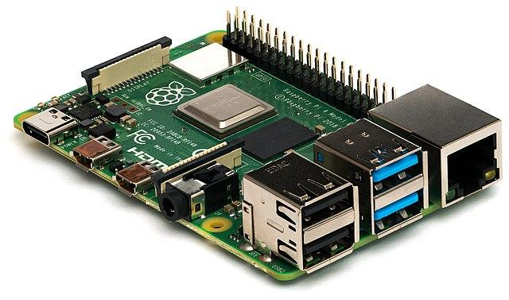

<!--
CO_OP_TRANSLATOR_METADATA:
{
  "original_hash": "9bae08314d8487cb76ddf3d8797e1544",
  "translation_date": "2025-08-28T10:19:18+00:00",
  "source_file": "1-getting-started/lessons/1-introduction-to-iot/README.md",
  "language_code": "bg"
}
-->
# Въведение в IoT

> Скица от [Nitya Narasimhan](https://github.com/nitya). Кликнете върху изображението за по-голяма версия.

Този урок е част от [Hello IoT серията](https://youtube.com/playlist?list=PLmsFUfdnGr3xRts0TIwyaHyQuHaNQcb6-) на [Microsoft Reactor](https://developer.microsoft.com/reactor/?WT.mc_id=academic-17441-jabenn). Урокът е представен в два видеоклипа - един час лекция и един час офис часове, в които се разглеждат по-задълбочено части от урока и се отговаря на въпроси.

> 🎥 Кликнете върху изображенията по-горе, за да гледате видеоклиповете

## Предварителен тест

[Предварителен тест](https://black-meadow-040d15503.1.azurestaticapps.net/quiz/1)

## Въведение

Този урок обхваща някои от основните теми, свързани с Интернет на нещата (IoT), и ви подготвя за настройка на вашия хардуер.

В този урок ще разгледаме:

* [Какво е "Интернет на нещата"?](../../../../../1-getting-started/lessons/1-introduction-to-iot)
* [IoT устройства](../../../../../1-getting-started/lessons/1-introduction-to-iot)
* [Настройка на вашето устройство](../../../../../1-getting-started/lessons/1-introduction-to-iot)
* [Приложения на IoT](../../../../../1-getting-started/lessons/1-introduction-to-iot)
* [Примери за IoT устройства около вас](../../../../../1-getting-started/lessons/1-introduction-to-iot)

## Какво е "Интернет на нещата"?

Терминът "Интернет на нещата" е въведен от [Кевин Аштън](https://wikipedia.org/wiki/Kevin_Ashton) през 1999 г., за да опише свързването на Интернет с физическия свят чрез сензори. Оттогава терминът се използва за описание на всяко устройство, което взаимодейства с физическия свят около него, било чрез събиране на данни от сензори, или чрез предоставяне на реални взаимодействия чрез актуатори (устройства, които извършват действия като включване на превключвател или осветяване на LED), обикновено свързани с други устройства или Интернет.

> **Сензори** събират информация от света, като измерват скорост, температура или местоположение.
>
> **Актуатори** преобразуват електрически сигнали в реални взаимодействия, като задействане на превключвател, включване на светлини, издаване на звуци или изпращане на контролни сигнали към друг хардуер, например за включване на електрически контакт.

IoT като технологична област включва не само устройства, но и облачни услуги, които могат да обработват данните от сензорите или да изпращат заявки към актуатори, свързани с IoT устройства. Включва и устройства, които нямат или не се нуждаят от Интернет връзка, често наричани edge устройства. Това са устройства, които могат сами да обработват и реагират на данни от сензори, обикновено използвайки AI модели, обучени в облака.

IoT е бързо развиваща се технологична област. Прогнозите сочат, че до края на 2020 г. са били внедрени и свързани към Интернет 30 милиарда IoT устройства. В бъдеще се очаква до 2025 г. IoT устройствата да събират почти 80 зетабайта данни или 80 трилиона гигабайта. Това е огромно количество данни!

✅ Направете малко проучване: Колко от данните, генерирани от IoT устройства, всъщност се използват и колко се губят? Защо толкова много данни се игнорират?

Тези данни са ключът към успеха на IoT. За да бъдете успешен IoT разработчик, трябва да разбирате какви данни трябва да събирате, как да ги събирате, как да вземате решения въз основа на тях и как да използвате тези решения за взаимодействие с физическия свят, ако е необходимо.

## IoT устройства

**Т** в IoT означава **Неща** - устройства, които взаимодействат с физическия свят около тях, било чрез събиране на данни от сензори, или чрез предоставяне на реални взаимодействия чрез актуатори.

Устройства за производствени или търговски цели, като потребителски фитнес тракери или индустриални контролери на машини, обикновено са специално създадени. Те използват персонализирани платки, а понякога дори и персонализирани процесори, проектирани да отговарят на нуждите на конкретна задача, било то да са достатъчно малки, за да се поберат на китката, или достатъчно здрави, за да работят в среда с висока температура, стрес или вибрации.

Като разработчик, който учи за IoT или създава прототип на устройство, ще трябва да започнете с комплект за разработка. Това са универсални IoT устройства, предназначени за разработчици, често с функции, които не бихте намерили на производствено устройство, като набор от външни пинове за свързване на сензори или актуатори, хардуер за поддръжка на дебъгинг или допълнителни ресурси, които биха добавили ненужни разходи при голямо производство.

Тези комплекти за разработка обикновено попадат в две категории - микроконтролери и едноплаткови компютри. Те ще бъдат представени тук, а в следващия урок ще разгледаме по-подробно.

> 💁 Вашият телефон също може да се счита за универсално IoT устройство, с вградени сензори и актуатори, като различни приложения използват тези сензори и актуатори по различни начини с различни облачни услуги. Можете дори да намерите някои IoT уроци, които използват приложение за телефон като IoT устройство.

### Микроконтролери

Микроконтролерът (наричан още MCU, съкращение от microcontroller unit) е малък компютър, състоящ се от:

🧠 Един или повече централни процесорни единици (CPU) - "мозъкът" на микроконтролера, който изпълнява вашата програма

💾 Памет (RAM и програмна памет) - където се съхраняват вашата програма, данни и променливи

🔌 Програмируеми входно/изходни (I/O) връзки - за комуникация с външни периферни устройства (свързани устройства) като сензори и актуатори

Микроконтролерите обикновено са евтини изчислителни устройства, като средните цени за тези, използвани в персонализиран хардуер, падат до около 0,50 щатски долара, а някои устройства са толкова евтини, колкото 0,03 щатски долара. Комплектите за разработка могат да започнат от 4 щатски долара, като разходите се увеличават с добавянето на повече функции. [Wio Terminal](https://www.seeedstudio.com/Wio-Terminal-p-4509.html), комплект за разработка на микроконтролери от [Seeed studios](https://www.seeedstudio.com), който има сензори, актуатори, WiFi и екран, струва около 30 щатски долара.

> 💁 Когато търсите микроконтролери в Интернет, бъдете внимателни при търсене на термина **MCU**, тъй като това ще върне много резултати за Marvel Cinematic Universe, а не за микроконтролери.

Микроконтролерите са проектирани да бъдат програмирани за изпълнение на ограничен брой много специфични задачи, а не да бъдат универсални компютри като PC или Mac. Освен в много специфични случаи, не можете да свържете монитор, клавиатура и мишка и да ги използвате за общи задачи.

Комплектите за разработка на микроконтролери обикновено идват с допълнителни вградени сензори и актуатори. Повечето платки ще имат един или повече програмируеми LED светлини, както и други устройства като стандартни конектори за добавяне на повече сензори или актуатори чрез различни екосистеми на производители или вградени сензори (обикновено най-популярните, като температурни сензори). Някои микроконтролери имат вградена безжична свързаност като Bluetooth или WiFi или имат допълнителни микроконтролери на платката за добавяне на тази свързаност.

> 💁 Микроконтролерите обикновено се програмират на C/C++.

### Едноплаткови компютри

Едноплатковият компютър е малко изчислително устройство, което съдържа всички елементи на пълноценен компютър на една малка платка. Това са устройства със спецификации, близки до настолен или лаптоп компютър, които работят с пълна операционна система, но са малки, използват по-малко енергия и са значително по-евтини.

Raspberry Pi е един от най-популярните едноплаткови компютри.

Подобно на микроконтролера, едноплатковите компютри имат CPU, памет и входно/изходни пинове, но имат допълнителни функции като графичен чип за свързване на монитори, аудио изходи и USB портове за свързване на клавиатури, мишки и други стандартни USB устройства като уеб камери или външна памет. Програмите се съхраняват на SD карти или твърди дискове заедно с операционната система, вместо на паметен чип, вграден в платката.

> 🎓 Можете да мислите за едноплатков компютър като за по-малка, по-евтина версия на PC или Mac, който използвате в момента, с добавени GPIO (универсални входно/изходни) пинове за взаимодействие със сензори и актуатори.

Едноплатковите компютри са напълно функционални компютри, така че могат да бъдат програмирани на всеки език. IoT устройствата обикновено се програмират на Python.

### Хардуерни избори за останалите уроци

Всички следващи уроци включват задачи, използващи IoT устройство за взаимодействие с физическия свят и комуникация с облака. Всеки урок поддържа 3 варианта за устройства - Arduino (с използване на Seeed Studios Wio Terminal) или едноплатков компютър, физически (Raspberry Pi 4) или виртуален, работещ на вашия PC или Mac.

Можете да прочетете за необходимия хардуер за изпълнение на всички задачи в [хардуерния наръчник](../../../hardware.md).

> 💁 Не е необходимо да закупувате IoT хардуер, за да изпълните задачите, можете да направите всичко с виртуален едноплатков компютър.

Кой хардуер ще изберете зависи от това, какво имате на разположение у дома или в училище, и какъв програмен език знаете или планирате да научите. И двата варианта за хардуер използват една и съща екосистема от сензори, така че ако започнете с един, можете да преминете към друг, без да се налага да заменяте по-голямата част от комплекта. Виртуалният едноплатков компютър ще бъде еквивалент на обучение с Raspberry Pi, като по-голямата част от кода може да бъде прехвърлена към Pi, ако в крайна сметка получите устройство и сензори.

### Arduino комплект за разработка

Ако се интересувате от изучаване на разработка на микроконтролери, можете да изпълните задачите, използвайки устройство Arduino. Ще ви е необходимо основно разбиране на програмирането на C/C++, тъй като уроците ще учат само код, който е свързан с рамката на Arduino, използваните сензори и актуатори, и библиотеките, които взаимодействат с облака.

Задачите ще използват [Visual Studio Code](https://code.visualstudio.com/?WT.mc_id=academic-17441-jabenn) с [PlatformIO разширението за разработка на микроконтролери](https://platformio.org). Можете също да използвате Arduino IDE, ако сте опитни с този инструмент, тъй като инструкции няма да бъдат предоставени.

### Комплект за разработка с едноплатков компютър

Ако се интересувате от изучаване на IoT разработка с едноплаткови компютри, можете да изпълните задачите, използвайки Raspberry Pi или виртуално устройство, работещо на вашия PC или Mac.

Ще ви е необходимо основно разбиране на програмирането на Python, тъй като уроците ще учат само код, който е свързан с използваните сензори и актуатори, и библиотеките, които взаимодействат с облака.

> 💁 Ако искате да научите програмиране на Python, разгледайте следните две видео серии:
>
> * [Python за начинаещи](https://channel9.msdn.com/Series/Intro-to-Python-Development?WT.mc_id=academic-17441-jabenn)
> * [Още Python за начинаещи](https://channel9.msdn.com/Series/More-Python-for-Beginners?WT.mc_id=academic-7372-jabenn)

Задачите ще използват [Visual Studio Code](https://code.visualstudio.com/?WT.mc_id=academic-17441-jabenn).

Ако използвате Raspberry Pi, можете да го стартирате с пълната десктоп версия на Raspberry Pi OS и да правите цялото програмиране директно на Pi, използвайки [версията на VS Code за Raspberry Pi OS](https://code.visualstudio.com/docs/setup/raspberry-pi?WT.mc_id=academic-17441-jabenn), или да стартирате Pi като устройство без монитор и да програмирате от вашия PC или Mac, използвайки VS Code с [Remote SSH разширението](https://code.visualstudio.com/docs/remote/ssh?WT.mc_id=academic-17441-jabenn), което ви позволява да се свържете с Pi и да редактирате, дебъгвате и изпълнявате код, сякаш програмирате директно на него.

Ако използвате опцията за виртуално устройство, ще програмирате директно на вашия компютър. Вместо да използвате сензори и актуатори, ще използвате инструмент за симулиране на този хардуер, предоставящ стойности на сензори, които можете да зададете, и показващ резултатите от актуаторите на екрана.

## Настройка на вашето устройство

Преди да започнете с програмирането на вашето IoT устройство, ще трябва да направите малко настройка. Следвайте съответните инструкции по-долу в зависимост от устройството, което ще използвате.
💁 Ако все още нямате устройство, вижте [ръководството за хардуер](../../../hardware.md), за да решите кое устройство ще използвате и какъв допълнителен хардуер трябва да закупите. Не е необходимо да купувате хардуер, тъй като всички проекти могат да се изпълняват на виртуален хардуер.
Тези инструкции включват връзки към уебсайтове на трети страни, създадени от производителите на хардуера или инструментите, които ще използвате. Това е с цел да се гарантира, че винаги използвате най-актуалните инструкции за различните инструменти и хардуер.

Следвайте съответното ръководство, за да настроите устройството си и да завършите проект "Hello World". Това ще бъде първата стъпка в създаването на IoT нощна лампа в рамките на 4 урока в тази начална част.

* [Arduino - Wio Terminal](wio-terminal.md)
* [Едноплатков компютър - Raspberry Pi](pi.md)
* [Едноплатков компютър - Виртуално устройство](virtual-device.md)

✅ Ще използвате VS Code както за Arduino, така и за едноплаткови компютри. Ако не сте го използвали досега, прочетете повече за него на [сайта на VS Code](https://code.visualstudio.com?WT.mc_id=academic-17441-jabenn).

## Приложения на IoT

IoT обхваща огромен набор от случаи на употреба, разделени в няколко основни групи:

* Потребителски IoT
* Търговски IoT
* Индустриален IoT
* Инфраструктурен IoT

✅ Направете малко проучване: За всяка от описаните по-долу области намерете един конкретен пример, който не е даден в текста.

### Потребителски IoT

Потребителски IoT се отнася до IoT устройства, които потребителите купуват и използват в дома си. Някои от тези устройства са изключително полезни, като например умни високоговорители, умни отоплителни системи и роботизирани прахосмукачки. Други са спорни по отношение на тяхната полезност, като например кранове с гласово управление, които след това не можете да изключите, защото гласовото управление не може да ви чуе над шума от течащата вода.

Потребителските IoT устройства дават възможност на хората да постигат повече в своето обкръжение, особено на 1 милиард души с увреждания. Роботизираните прахосмукачки могат да осигурят чисти подове на хора с проблеми в мобилността, които не могат сами да чистят, фурни с гласово управление позволяват на хора с ограничено зрение или моторен контрол да загреят фурната си само с гласа си, а здравни монитори позволяват на пациентите да следят хронични състояния с по-редовни и подробни актуализации за тяхното здраве. Тези устройства стават толкова разпространени, че дори малки деца ги използват като част от ежедневието си, например ученици, които учат виртуално по време на пандемията COVID, настройват таймери на умни домашни устройства, за да следят училищната си работа или аларми, които да им напомнят за предстоящи срещи в клас.

✅ Какви потребителски IoT устройства имате в дома си или на себе си?

### Търговски IoT

Търговски IoT обхваща използването на IoT в работната среда. В офис може да има сензори за заетост и детектори за движение, които управляват осветлението и отоплението, така че да се включват само когато са необходими, намалявайки разходите и въглеродните емисии. Във фабрика IoT устройствата могат да следят за опасности за безопасността, като например работници, които не носят каски, или шум, който е достигнал опасни нива. В търговията IoT устройствата могат да измерват температурата на хладилни помещения, предупреждавайки собственика на магазина, ако хладилник или фризер е извън необходимия температурен диапазон, или могат да следят наличността на рафтовете, за да насочат служителите към попълване на продадени продукти. Транспортната индустрия все повече разчита на IoT за наблюдение на местоположението на превозни средства, проследяване на пробега за таксуване на пътни потребители, следене на часовете на шофьорите и спазването на почивките, или уведомяване на персонала, когато превозно средство се приближава към депо за подготовка за товарене или разтоварване.

✅ Какви търговски IoT устройства имате във вашето училище или работно място?

### Индустриален IoT (IIoT)

Индустриален IoT, или IIoT, е използването на IoT устройства за управление и контрол на машини в голям мащаб. Това обхваща широк спектър от случаи на употреба, от фабрики до дигитално земеделие.

Фабриките използват IoT устройства по много различни начини. Машините могат да бъдат наблюдавани с множество сензори, които следят неща като температура, вибрации и скорост на въртене. Тези данни могат да бъдат наблюдавани, за да се позволи спиране на машината, ако тя излезе извън определени толеранси - например, ако стане твърде гореща, тя се изключва. Тези данни могат също да бъдат събирани и анализирани с течение на времето за предиктивна поддръжка, при която AI модели анализират данните, водещи до повреда, и използват това, за да предвидят други повреди преди да се случат.

Дигиталното земеделие е важно, ако планетата трябва да изхрани нарастващото население, особено за 2 милиарда души в 500 милиона домакинства, които се издържат от [прехранващо земеделие](https://wikipedia.org/wiki/Subsistence_agriculture). Дигиталното земеделие може да варира от няколко сензора на стойност няколко долара до огромни търговски инсталации. Фермерът може да започне с наблюдение на температурите и използване на [дни на растеж](https://wikipedia.org/wiki/Growing_degree-day), за да предвиди кога реколтата ще бъде готова за прибиране. Те могат да свържат мониторинг на влажността на почвата с автоматизирани напоителни системи, за да дадат на растенията си толкова вода, колкото е необходима, но не повече, за да гарантират, че реколтата им няма да изсъхне, без да се хаби вода. Фермерите дори стигат по-далеч, използвайки дронове, сателитни данни и AI за наблюдение на растежа на културите, болестите и качеството на почвата върху огромни площи земеделска земя.

✅ Какви други IoT устройства биха могли да помогнат на фермерите?

### Инфраструктурен IoT

Инфраструктурен IoT е наблюдение и управление на местната и глобалната инфраструктура, която хората използват всеки ден.

[Умни градове](https://wikipedia.org/wiki/Smart_city) са градски райони, които използват IoT устройства за събиране на данни за града и използването им за подобряване на начина, по който градът функционира. Тези градове обикновено се управляват чрез сътрудничество между местни власти, академични среди и местни бизнеси, като се следят и управляват неща като транспорт, паркиране и замърсяване. Например, в Копенхаген, Дания, замърсяването на въздуха е важно за местните жители, затова то се измерва и данните се използват за предоставяне на информация за най-чистите маршрути за колоездене и джогинг.

[Умни електрически мрежи](https://wikipedia.org/wiki/Smart_grid) позволяват по-добра аналитика на търсенето на електроенергия чрез събиране на данни за потреблението на ниво отделни домове. Тези данни могат да насочват решения на национално ниво, включително къде да се изграждат нови електроцентрали, и на лично ниво, като предоставят на потребителите информация за това колко електроенергия използват, кога я използват и дори предложения за намаляване на разходите, като например зареждане на електрически автомобили през нощта.

✅ Ако можехте да добавите IoT устройства за измерване на нещо във вашия район, какво би било то?

## Примери за IoT устройства около вас

Ще се изненадате колко много IoT устройства имате около себе си. Пиша това от вкъщи и имам следните устройства, свързани с интернет с умни функции като управление чрез приложение, гласово управление или способност за изпращане на данни към телефона ми:

* Множество умни високоговорители
* Хладилник, съдомиялна, фурна и микровълнова
* Монитор за електричество за соларни панели
* Умни контакти
* Видео звънец и камери за сигурност
* Умен термостат с множество умни сензори за стаи
* Отварачка за гаражна врата
* Домашни развлекателни системи и телевизори с гласово управление
* Осветление
* Тракери за фитнес и здраве

Всички тези видове устройства имат сензори и/или актуатори и комуникират с интернет. Мога да проверя от телефона си дали гаражната ми врата е отворена и да помоля умния си високоговорител да я затвори. Мога дори да я настроя на таймер, така че ако е все още отворена през нощта, тя да се затвори автоматично. Когато звънецът ми звъни, мога да видя от телефона си кой е там, където и да съм по света, и да говоря с него чрез високоговорител и микрофон, вградени в звънеца. Мога да следя кръвната си захар, сърдечния ритъм и моделите на съня си, търсейки модели в данните, за да подобря здравето си. Мога да управлявам осветлението си чрез облака и да седя на тъмно, когато интернет връзката ми прекъсне.

---

## 🚀 Предизвикателство

Избройте колкото се може повече IoT устройства, които имате в дома си, училището или работното място - може да са повече, отколкото си мислите!

## Тест след лекцията

[Тест след лекцията](https://black-meadow-040d15503.1.azurestaticapps.net/quiz/2)

## Преглед и самостоятелно обучение

Прочетете за ползите и неуспехите на потребителските IoT проекти. Проверете новинарски сайтове за статии за случаи, когато те са се провалили, като например проблеми с поверителността, хардуерни проблеми или проблеми, причинени от липса на свързаност.

Някои примери:

* Разгледайте Twitter акаунта **[Internet of Sh*t](https://twitter.com/internetofshit)** *(предупреждение за нецензурен език)* за добри примери за неуспехи с потребителски IoT.
* [c|net - Моят Apple Watch спаси живота ми: 5 души споделят своите истории](https://www.cnet.com/news/apple-watch-lifesaving-health-features-read-5-peoples-stories/)
* [c|net - Техник на ADT признава вина за шпиониране на клиентски камери години наред](https://www.cnet.com/news/adt-home-security-technician-pleads-guilty-to-spying-on-customer-camera-feeds-for-years/) *(предупреждение за съдържание - неконсенсуално воайорство)*

## Задание

[Разследвайте IoT проект](assignment.md)

---

**Отказ от отговорност**:  
Този документ е преведен с помощта на AI услуга за превод [Co-op Translator](https://github.com/Azure/co-op-translator). Въпреки че се стремим към точност, моля, имайте предвид, че автоматизираните преводи може да съдържат грешки или неточности. Оригиналният документ на неговия роден език трябва да се счита за авторитетен източник. За критична информация се препоръчва професионален човешки превод. Ние не носим отговорност за каквито и да е недоразумения или погрешни интерпретации, произтичащи от използването на този превод.