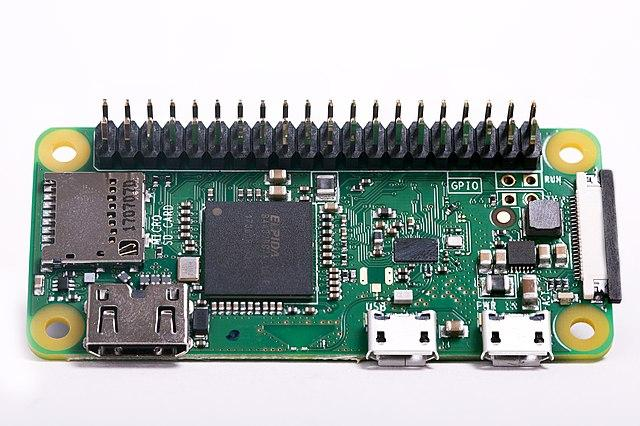

<!--
CO_OP_TRANSLATOR_METADATA:
{
  "original_hash": "9dd7f645ad1c6f20b72fee512987f772",
  "translation_date": "2025-08-28T10:01:54+00:00",
  "source_file": "1-getting-started/lessons/2-deeper-dive/README.md",
  "language_code": "bg"
}
-->
# По-задълбочен поглед върху IoT

> Скица от [Nitya Narasimhan](https://github.com/nitya). Кликнете върху изображението за по-голяма версия.

Този урок е част от [Hello IoT серията](https://youtube.com/playlist?list=PLmsFUfdnGr3xRts0TIwyaHyQuHaNQcb6-) на [Microsoft Reactor](https://developer.microsoft.com/reactor/?WT.mc_id=academic-17441-jabenn). Урокът е представен в два видеоклипа - един час урок и един час офис часове, където се разглеждат по-задълбочено части от урока и се отговаря на въпроси.

> 🎥 Кликнете върху изображенията по-горе, за да гледате видеоклиповете

## Предварителен тест

[Предварителен тест](https://black-meadow-040d15503.1.azurestaticapps.net/quiz/3)

## Въведение

Този урок разглежда по-задълбочено някои от концепциите, обсъдени в предишния урок.

В този урок ще разгледаме:

* [Компоненти на IoT приложение](../../../../../1-getting-started/lessons/2-deeper-dive)
* [По-задълбочен поглед върху микроконтролерите](../../../../../1-getting-started/lessons/2-deeper-dive)
* [По-задълбочен поглед върху едноплатковите компютри](../../../../../1-getting-started/lessons/2-deeper-dive)

## Компоненти на IoT приложение

Двата основни компонента на IoT приложението са *Интернетът* и *устройството*. Нека разгледаме тези два компонента по-подробно.

### Устройството

**Устройството** в IoT се отнася до устройство, което може да взаимодейства с физическия свят. Тези устройства обикновено са малки, нискобюджетни компютри, работещи с ниска скорост и използващи малко енергия - например, прости микроконтролери с килобайти RAM (за разлика от гигабайти в PC), работещи само на няколко стотици мегахерца (за разлика от гигахерци в PC), но понякога консумиращи толкова малко енергия, че могат да работят седмици, месеци или дори години на батерии.

Тези устройства взаимодействат с физическия свят, като използват сензори за събиране на данни от околната среда или чрез контролиране на изходи или задвижващи механизми за извършване на физически промени. Типичен пример за това е интелигентен термостат - устройство, което има температурен сензор, средство за задаване на желаната температура, като например циферблат или сензорен екран, и връзка с отоплителна или охлаждаща система, която може да се включи, когато откритата температура е извън желаните граници. Температурният сензор открива, че стаята е твърде студена, и задвижващ механизъм включва отоплението.

Съществува огромен набор от различни устройства, които могат да действат като IoT устройства - от специализирани хардуери, които засичат едно нещо, до универсални устройства, дори вашия смартфон! Смартфонът може да използва сензори за откриване на света около него и задвижващи механизми за взаимодействие със света - например, използвайки GPS сензор за откриване на вашето местоположение и високоговорител за предоставяне на навигационни инструкции до дестинация.

✅ Помислете за други системи около вас, които четат данни от сензор и използват тези данни за вземане на решения. Един пример би бил термостатът на фурна. Можете ли да намерите още?

### Интернетът

**Интернетът** в IoT приложението включва приложения, към които IoT устройството може да се свърже, за да изпраща и получава данни, както и други приложения, които могат да обработват данните от IoT устройството и да помагат при вземането на решения за това какви заявки да се изпращат към задвижващите механизми на IoT устройството.

Един типичен сценарий би бил наличието на някакъв вид облачна услуга, към която IoT устройството се свързва, и тази облачна услуга обработва неща като сигурност, както и получаване на съобщения от IoT устройството и изпращане на съобщения обратно към устройството. Тази облачна услуга след това се свързва с други приложения, които могат да обработват или съхраняват данни от сензори, или да използват данните от сензорите заедно с данни от други системи за вземане на решения.

Устройствата не винаги се свързват директно с Интернет чрез WiFi или кабелни връзки. Някои устройства използват мрежова комуникация, за да говорят помежду си чрез технологии като Bluetooth, свързвайки се чрез хъб устройство, което има Интернет връзка.

В примера с интелигентния термостат, термостатът би се свързал чрез домашен WiFi към облачна услуга, работеща в облака. Той би изпратил данните за температурата към тази облачна услуга, откъдето те ще бъдат записани в база данни, позволявайки на собственика на дома да провери текущите и минали температури чрез приложение на телефона. Друга услуга в облака би знаела каква температура иска собственикът на дома и би изпратила съобщения обратно към IoT устройството чрез облачната услуга, за да каже на отоплителната система да се включи или изключи.

Още по-интелигентна версия би могла да използва AI в облака с данни от други сензори, свързани към други IoT устройства, като сензори за заетост, които откриват кои стаи се използват, както и данни като времето и дори вашия календар, за да взема решения как да настрои температурата по интелигентен начин. Например, тя би могла да изключи отоплението, ако прочете от вашия календар, че сте на почивка, или да изключи отоплението на стая по стая, в зависимост от това кои стаи използвате, като се учи от данните, за да става все по-точна с времето.

✅ Какви други данни биха могли да помогнат за създаването на по-интелигентен термостат, свързан с Интернет?

### IoT на ръба

Въпреки че "I" в IoT означава Интернет, тези устройства не е задължително да се свързват с Интернет. В някои случаи устройствата могат да се свързват с "edge" устройства - шлюзови устройства, които работят във вашата локална мрежа, което означава, че можете да обработвате данни, без да правите заявка през Интернет. Това може да бъде по-бързо, когато имате много данни или бавна Интернет връзка, позволява ви да работите офлайн, когато Интернет връзката не е възможна, като например на кораб или в зона на бедствие при хуманитарна криза, и ви позволява да запазите данните си частни. Някои устройства ще съдържат код за обработка, създаден с облачни инструменти, и ще го изпълняват локално, за да събират и реагират на данни, без да използват Интернет връзка за вземане на решение.

Един пример за това е интелигентно домашно устройство като Apple HomePod, Amazon Alexa или Google Home, което ще слуша вашия глас, използвайки AI модели, обучени в облака, но изпълнявани локално на устройството. Тези устройства ще "се събудят", когато бъде изговорена определена дума или фраза, и едва тогава ще изпратят вашата реч през Интернет за обработка. Устройството ще спре да изпраща реч в подходящ момент, като например когато открие пауза във вашата реч. Всичко, което казвате преди събуждането на устройството с ключовата дума, и всичко, което казвате след като устройството е спряло да слуша, няма да бъде изпратено през Интернет към доставчика на устройството и следователно ще остане частно.

✅ Помислете за други сценарии, в които поверителността е важна, така че обработката на данни би била по-добре извършена на ръба, отколкото в облака. Подсказка - помислете за IoT устройства с камери или други устройства за изображения.

### IoT сигурност

С всяка Интернет връзка сигурността е важен аспект. Съществува стар виц, че "S в IoT означава сигурност" - няма "S" в IoT, което предполага, че не е сигурно.

IoT устройствата се свързват с облачна услуга и следователно са толкова сигурни, колкото е сигурна тази облачна услуга - ако вашата облачна услуга позволява на всяко устройство да се свърже, тогава могат да бъдат изпратени злонамерени данни или да се извършат вирусни атаки. Това може да има много реални последици, тъй като IoT устройствата взаимодействат и контролират други устройства. Например, [Stuxnet червеят](https://wikipedia.org/wiki/Stuxnet) манипулира клапани в центрофуги, за да ги повреди. Хакери също са се възползвали от [лоша сигурност, за да получат достъп до бебешки монитори](https://www.npr.org/sections/thetwo-way/2018/06/05/617196788/s-c-mom-says-baby-monitor-was-hacked-experts-say-many-devices-are-vulnerable) и други домашни устройства за наблюдение.

> 💁 Понякога IoT устройства и edge устройства работят в мрежа, напълно изолирана от Интернет, за да запазят данните частни и сигурни. Това е известно като [air-gapping](https://wikipedia.org/wiki/Air_gap_(networking)).

## По-задълбочен поглед върху микроконтролерите

В предишния урок въведохме микроконтролерите. Нека сега ги разгледаме по-задълбочено.

### CPU

CPU е "мозъкът" на микроконтролера. Това е процесорът, който изпълнява вашия код и може да изпраща данни към и да получава данни от свързани устройства. CPU може да съдържа едно или повече ядра - по същество едно или повече CPU, които могат да работят заедно, за да изпълняват вашия код.

CPU разчита на часовник, който тиктака милиони или милиарди пъти в секунда. Всеки тик или цикъл синхронизира действията, които CPU може да предприеме. С всеки тик CPU може да изпълни инструкция от програма, като например да извлече данни от външно устройство или да извърши математическо изчисление. Този редовен цикъл позволява всички действия да бъдат завършени преди следващата инструкция да бъде обработена.

Колкото по-бърз е цикълът на часовника, толкова повече инструкции могат да бъдат обработени всяка секунда и следователно толкова по-бърз е CPU. Скоростите на CPU се измерват в [Hertz (Hz)](https://wikipedia.org/wiki/Hertz), стандартна единица, където 1 Hz означава един цикъл или тик на часовника в секунда.

> 🎓 Скоростите на CPU често се дават в MHz или GHz. 1MHz е 1 милион Hz, 1GHz е 1 милиард Hz.

> 💁 CPU изпълнява програми, използвайки [fetch-decode-execute цикъл](https://wikipedia.org/wiki/Instruction_cycle). За всеки тик на часовника CPU ще извлече следващата инструкция от паметта, ще я декодира и след това ще я изпълни, като например използва аритметично-логическо устройство (ALU), за да събере 2 числа. Някои изпълнения ще отнемат няколко тика, така че следващият цикъл ще се изпълни при следващия тик след завършването на инструкцията.

Микроконтролерите имат много по-ниски скорости на часовника от настолните или лаптоп компютри, или дори от повечето смартфони. Например, Wio Terminal има CPU, който работи на 120MHz или 120,000,000 цикъла в секунда.

✅ Средният PC или Mac има CPU с множество ядра, работещи на множество гигахерци, което означава, че часовникът тиктака милиарди пъти в секунда. Проучете скоростта на часовника на вашия компютър и сравнете колко пъти е по-бърз от Wio Terminal.

Всеки цикъл на часовника консумира енергия и генерира топлина. Колкото по-бързи са тиктаканията, толкова повече енергия се консумира и повече топлина се генерира. PC-тата имат радиатори и вентилатори за премахване на топлината, без които те биха прегрели и изключили в рамките на секунди. Микроконтролерите често нямат нито едно от тези, тъй като работят много по-хладно и следователно много по-бавно. PC-тата работят на мрежово захранване или големи батерии за няколко часа, микроконтролерите могат да работят дни, месеци или дори години на малки батерии. Микроконтролерите могат също да имат ядра, които работят на различни скорости, превключвайки към по-бавни ядра с ниска мощност, когато натоварването на CPU е ниско, за да намалят консумацията на енергия.

> 💁 Някои PC-та и Mac-ове приемат същата комбинация от бързи ядра с висока мощност и по-бавни ядра с ниска мощност, превключвайки, за да оптимизират батерията. Например, M1 чипът в последните лаптопи на Apple може да превключва между 4 производителни ядра и 4 ефективни ядра, за да оптимизира живота на батерията или скоростта в зависимост от задачата, която се изпълнява.

✅ Направете малко проучване: Прочетете за CPU на [Wikipedia CPU статията](https://wikipedia.org/wiki/Central_processing_unit)

#### Задача

Разгледайте Wio Terminal.

Ако използвате Wio Terminal за тези уроци, опитайте да намерите CPU. Намерете секцията *Hardware Overview* на [Wio Terminal продуктовата страница](https://www.seeedstudio.com/Wio-Terminal-p-4509.html) за снимка на вътрешността и опитайте да намерите CPU през прозрачното пластмасово прозорче на гърба.

### Памет

Микроконтролерите обикновено
🎓 Програмната памет съхранява вашия код и остава, когато няма захранване.
> 🎓 RAM се използва за изпълнение на вашата програма и се нулира, когато няма захранване

Подобно на процесора, паметта в микроконтролера е с порядъци по-малка от тази на компютър или Mac. Типичен компютър може да има 8 гигабайта (GB) RAM, или 8,000,000,000 байта, като всеки байт е достатъчен за съхранение на една буква или число от 0 до 255. Микроконтролерът обикновено има само килобайти (KB) RAM, като един килобайт е 1,000 байта. Wio терминалът, споменат по-горе, има 192KB RAM, или 192,000 байта - повече от 40,000 пъти по-малко от средния компютър!

Диаграмата по-долу показва относителната разлика в размера между 192KB и 8GB - малката точка в центъра представлява 192KB.

Паметта за съхранение на програми също е по-малка от тази на компютър. Типичен компютър може да има 500GB твърд диск за съхранение на програми, докато микроконтролерът може да има само килобайти или няколко мегабайта (MB) памет (1MB е 1,000KB, или 1,000,000 байта). Wio терминалът има 4MB памет за съхранение на програми.

✅ Направете малко проучване: Колко RAM и памет за съхранение има компютърът, който използвате в момента? Как това се сравнява с микроконтролер?

### Вход/Изход

Микроконтролерите се нуждаят от входни и изходни (I/O) връзки, за да четат данни от сензори и да изпращат контролни сигнали към изпълнителни механизми. Те обикновено съдържат редица универсални входно/изходни (GPIO) пинове. Тези пинове могат да бъдат конфигурирани чрез софтуер като вход (т.е. получават сигнал) или изход (изпращат сигнал).

🧠⬅️ Входните пинове се използват за четене на стойности от сензори

🧠➡️ Изходните пинове изпращат инструкции към изпълнителни механизми

✅ Ще научите повече за това в следващ урок.

#### Задача

Разгледайте Wio терминала.

Ако използвате Wio терминал за тези уроци, намерете GPIO пиновете. Намерете секцията *Pinout diagram* на [страницата на продукта Wio Terminal](https://www.seeedstudio.com/Wio-Terminal-p-4509.html), за да научите кои пинове за какво служат. Wio терминалът идва с лепенка, която можете да залепите на гърба с номерата на пиновете, така че я добавете сега, ако още не сте го направили.

### Физически размер

Микроконтролерите обикновено са малки по размер, като най-малкият, [Freescale Kinetis KL03 MCU, е достатъчно малък, за да се побере в вдлъбнатината на голф топка](https://www.edn.com/tiny-arm-cortex-m0-based-mcu-shrinks-package/). Само процесорът в компютър може да бъде с размери 40mm x 40mm, и това не включва охлаждащите радиатори и вентилатори, необходими, за да може процесорът да работи повече от няколко секунди без прегряване, което го прави значително по-голям от цял микроконтролер. Комплектът за разработка Wio терминал с микроконтролер, корпус, екран и редица връзки и компоненти не е много по-голям от голия Intel i9 процесор и е значително по-малък от процесора с охлаждащ радиатор и вентилатор!

| Устройство                       | Размер                |
| -------------------------------- | --------------------- |
| Freescale Kinetis KL03           | 1.6mm x 2mm x 1mm     |
| Wio терминал                     | 72mm x 57mm x 12mm    |
| Intel i9 CPU, радиатор и вентилатор | 136mm x 145mm x 103mm |

### Рамки и операционни системи

Поради ниската си скорост и размер на паметта, микроконтролерите не използват операционна система (OS) в смисъла на десктоп компютрите. Операционната система, която кара вашия компютър да работи (Windows, Linux или macOS), се нуждае от много памет и процесорна мощност, за да изпълнява задачи, които са напълно ненужни за микроконтролер. Помнете, че микроконтролерите обикновено се програмират да изпълняват една или повече много специфични задачи, за разлика от универсален компютър като PC или Mac, който трябва да поддържа потребителски интерфейс, да възпроизвежда музика или филми, да предоставя инструменти за писане на документи или код, да играе игри или да сърфира в интернет.

За да програмирате микроконтролер без операционна система, ви е необходим инструментариум, който да ви позволи да изградите вашия код по начин, който микроконтролерът може да изпълни, използвайки API-та, които могат да комуникират с периферни устройства. Всеки микроконтролер е различен, така че производителите обикновено поддържат стандартни рамки, които ви позволяват да следвате стандартна "рецепта", за да изградите вашия код и да го изпълните на всеки микроконтролер, който поддържа тази рамка.

Можете да програмирате микроконтролери с операционна система - често наричана операционна система в реално време (RTOS), тъй като те са проектирани да обработват изпращането на данни към и от периферни устройства в реално време. Тези операционни системи са много леки и предоставят функции като:

* Многозадачност, позволяваща вашият код да изпълнява повече от един блок код едновременно, или на множество ядра, или като се редуват на едно ядро
* Мрежова свързаност за сигурна комуникация през интернет
* Компоненти за графичен потребителски интерфейс (GUI) за изграждане на потребителски интерфейси (UI) на устройства с екрани.

✅ Прочетете за различни RTOS: [Azure RTOS](https://azure.microsoft.com/services/rtos/?WT.mc_id=academic-17441-jabenn), [FreeRTOS](https://www.freertos.org), [Zephyr](https://www.zephyrproject.org)

#### Arduino

[Arduino](https://www.arduino.cc) вероятно е най-популярната рамка за микроконтролери, особено сред студенти, любители и създатели. Arduino е платформа за електроника с отворен код, която комбинира софтуер и хардуер. Можете да закупите съвместими с Arduino платки от самите Arduino или от други производители, след което да програмирате, използвайки рамката Arduino.

Платките Arduino се програмират на C или C++. Използването на C/C++ позволява вашият код да бъде компилиран много малък и да работи бързо, нещо необходимо за ограничено устройство като микроконтролер. Основата на приложение Arduino се нарича скица и представлява C/C++ код с две функции - `setup` и `loop`. Когато платката се стартира, кодът на рамката Arduino ще изпълни функцията `setup` веднъж, след което ще изпълнява функцията `loop` отново и отново, непрекъснато, докато захранването бъде изключено.

Вие бихте написали вашия начален код във функцията `setup`, като например свързване към WiFi и облачни услуги или инициализиране на пинове за вход и изход. Вашият код за обработка би се намирал във функцията `loop`, като например четене от сензор и изпращане на стойността към облака. Обикновено бихте включили забавяне във всяка итерация на цикъла, например ако искате данните от сензора да се изпращат на всеки 10 секунди, бихте добавили забавяне от 10 секунди в края на цикъла, за да може микроконтролерът да спи, спестявайки енергия, след което да изпълни цикъла отново, когато е необходимо, 10 секунди по-късно.

✅ Тази архитектура на програмиране е известна като *цикъл на събития* или *цикъл на съобщения*. Много приложения използват това под капака и това е стандартът за повечето десктоп приложения, които работят на операционни системи като Windows, macOS или Linux. Функцията `loop` слуша за съобщения от компоненти на потребителския интерфейс като бутони или устройства като клавиатурата и реагира на тях. Можете да прочетете повече в тази [статия за цикъла на събития](https://wikipedia.org/wiki/Event_loop).

Arduino предоставя стандартни библиотеки за взаимодействие с микроконтролери и I/O пинове, с различни реализации под капака, за да работят на различни микроконтролери. Например, функцията [`delay`](https://www.arduino.cc/reference/en/language/functions/time/delay/) ще паузира програмата за даден период от време, функцията [`digitalRead`](https://www.arduino.cc/reference/en/language/functions/digital-io/digitalread/) ще прочете стойност `HIGH` или `LOW` от даден пин, независимо от това на коя платка се изпълнява кодът. Тези стандартни библиотеки означават, че кодът на Arduino, написан за една платка, може да бъде прекомпилиран за всяка друга платка Arduino и ще работи, при условие че пиновете са същите и платките поддържат същите функции.

Съществува голяма екосистема от библиотеки на трети страни за Arduino, които ви позволяват да добавите допълнителни функции към вашите проекти с Arduino, като използване на сензори и изпълнителни механизми или свързване към облачни IoT услуги.

##### Задача

Разгледайте Wio терминала.

Ако използвате Wio терминал за тези уроци, прегледайте кода, който написахте в предишния урок. Намерете функциите `setup` и `loop`. Наблюдавайте серийния изход за многократно извикване на функцията `loop`. Опитайте да добавите код към функцията `setup`, за да пишете към серийния порт и наблюдавайте, че този код се извиква само веднъж при всяко рестартиране. Опитайте да рестартирате устройството с превключвателя за захранване отстрани, за да покажете, че това се извиква всеки път, когато устройството се рестартира.

## По-задълбочен поглед върху едноплатковите компютри

В предишния урок въведохме едноплатковите компютри. Сега нека ги разгледаме по-задълбочено.

### Raspberry Pi

[Фондацията Raspberry Pi](https://www.raspberrypi.org) е благотворителна организация от Великобритания, основана през 2009 г., с цел да насърчи изучаването на компютърни науки, особено на училищно ниво. Като част от тази мисия, те разработиха едноплатков компютър, наречен Raspberry Pi. Raspberry Pi в момента се предлага в 3 варианта - пълноразмерна версия, по-малката Pi Zero и модул за изчисления, който може да бъде вграден във вашето крайно IoT устройство.

Последната итерация на пълноразмерния Raspberry Pi е Raspberry Pi 4B. Той има четириядрен (4 ядра) процесор, работещ на 1.5GHz, 2, 4 или 8GB RAM, гигабитов Ethernet, WiFi, 2 HDMI порта, поддържащи 4k екрани, аудио и композитен видео изход, USB портове (2 USB 2.0, 2 USB 3.0), 40 GPIO пина, конектор за камера за модул Raspberry Pi камера и слот за SD карта. Всичко това на платка с размери 88mm x 58mm x 19.5mm, захранвана от USB-C адаптер с 3A. Цените започват от 35 щатски долара, много по-евтино от компютър или Mac.

> 💁 Съществува и Pi400, всичко в едно компютър с Pi4, вграден в клавиатура.

Pi Zero е много по-малък и с по-ниска мощност. Той има едноядрен процесор с честота 1GHz, 512MB RAM, WiFi (в модела Zero W), един HDMI порт, един micro-USB порт, 40 GPIO пина, конектор за камера за модул Raspberry Pi камера и слот за SD карта. Размерите му са 65mm x 30mm x 5mm и консумира много малко енергия. Zero струва 5 щатски долара, а версията W с WiFi - 10 щатски долара.

> 🎓 Процесорите и в двата модела са ARM процесори, за разлика от Intel/AMD x86 или x64 процесорите, които се намират в повечето компютри и Mac. Те са подобни на процесорите, които се намират в някои микроконтролери, както и в почти всички мобилни телефони, Microsoft Surface X и новите Apple Silicon базирани Mac компютри.

Всички варианти на Raspberry Pi работят с версия на Debian Linux, наречена Raspberry Pi OS. Тя е налична като лека версия без десктоп, която е идеална за проекти без екран, или като пълна версия с пълна десктоп среда, включваща уеб браузър, офис приложения, инструменти за програмиране и игри. Тъй като операционната система е версия на Debian Linux, можете да инсталирате всяко приложение или инструмент, който работи на Debian и е създаден за ARM процесора в Pi.

#### Задача

Разгледайте Raspberry Pi.

Ако използвате Raspberry Pi за тези уроци, прочетете за различните хардуерни компоненти на платката.

* Можете да намерите подробности за процесорите, използвани в [документацията за хардуера на Raspberry Pi](https://www.raspberrypi.org/documentation/hardware/raspberrypi/). Прочетете за процесора, използван в модела, който използвате.
* Намерете GPIO пиновете. Прочетете повече за тях в [документацията за GPIO на Raspberry Pi](https://www.raspberrypi.org/documentation/hardware/raspberrypi/gpio/README.md). Използвайте [ръководството за използване на GPIO пинове](https://www.raspberrypi.org/documentation/usage/gpio/README.md), за да идентифицирате различните пинове на вашия Pi.

### Програмиране на едноплаткови компютри

Едноплатковите компютри са пълноценни компютри, работещи с пълна операционна система. Това означава, че има широк набор от програмни езици, рамки и инструменти, които можете да използвате за програмирането им, за разлика от микроконтролерите, които разчитат на поддръжка за платката в рамки като Arduino. Повечето програмни езици имат библиотеки, които могат да достъпват GPIO пиновете, за да изпращат и получават данни от сензори и изпълнителни механизми.

✅ С кои програмни езици сте запознати? Поддържат ли се те на Linux?

Най-често използваният програмен език за изграждане на IoT приложения на Raspberry Pi е Python. Съществува огромна екосистема от хардуер, проектиран за Pi, и почти всички от тях включват необходимия код за използването им като Python библиотеки. Някои от тези екосистеми
### Използване на едноплаткови компютри в професионални IoT внедрения

Едноплатковите компютри се използват за професионални IoT внедрения, а не само като комплекти за разработчици. Те могат да предоставят мощен начин за управление на хардуер и изпълнение на сложни задачи, като например стартиране на модели за машинно обучение. Например, съществува [Raspberry Pi 4 compute module](https://www.raspberrypi.org/blog/raspberry-pi-compute-module-4/), който предлага цялата мощ на Raspberry Pi 4, но в по-компактен и по-евтин формат без повечето портове, проектиран за вграждане в персонализиран хардуер.

---

## 🚀 Предизвикателство

Предизвикателството в последния урок беше да изброите колкото се може повече IoT устройства, които се намират във вашия дом, училище или работно място. За всяко устройство в този списък, мислите ли, че е изградено около микроконтролери, едноплаткови компютри или дори комбинация от двете?

## Тест след лекцията

[Тест след лекцията](https://black-meadow-040d15503.1.azurestaticapps.net/quiz/4)

## Преглед и самостоятелно обучение

* Прочетете [ръководството за започване с Arduino](https://www.arduino.cc/en/Guide/Introduction), за да разберете повече за платформата Arduino.
* Прочетете [въведението към Raspberry Pi 4](https://www.raspberrypi.org/products/raspberry-pi-4-model-b/), за да научите повече за Raspberry Pi.
* Научете повече за някои от концепциите и акронимите в [статията "Какво са CPU, MPU, MCU и GPU" в Electrical Engineering Journal](https://www.eejournal.com/article/what-the-faq-are-cpus-mpus-mcus-and-gpus/).

✅ Използвайте тези ръководства, заедно с цените, показани чрез следване на връзките в [хардуерното ръководство](../../../hardware.md), за да решите коя хардуерна платформа искате да използвате или дали предпочитате да използвате виртуално устройство.

## Задача

[Сравнете и противопоставете микроконтролерите и едноплатковите компютри](assignment.md)

---

**Отказ от отговорност**:  
Този документ е преведен с помощта на AI услуга за превод [Co-op Translator](https://github.com/Azure/co-op-translator). Въпреки че се стремим към точност, моля, имайте предвид, че автоматизираните преводи може да съдържат грешки или неточности. Оригиналният документ на неговия роден език трябва да се счита за авторитетен източник. За критична информация се препоръчва професионален човешки превод. Ние не носим отговорност за недоразумения или погрешни интерпретации, произтичащи от използването на този превод.