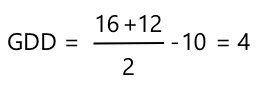

<!--
CO_OP_TRANSLATOR_METADATA:
{
  "original_hash": "d105b44deae539165855c976dcdeca99",
  "translation_date": "2025-08-28T11:30:35+00:00",
  "source_file": "2-farm/lessons/1-predict-plant-growth/README.md",
  "language_code": "bg"
}
-->
## Прогнозиране на растежа на растенията с IoT


> Скица от [Nitya Narasimhan](https://github.com/nitya). Кликнете върху изображението за по-голяма версия.

## Тест преди лекцията

[Тест преди лекцията](https://black-meadow-040d15503.1.azurestaticapps.net/quiz/9)

## Въведение

Растенията се нуждаят от определени условия, за да растат - вода, въглероден диоксид, хранителни вещества, светлина и топлина. В този урок ще научите как да изчислявате темповете на растеж и зрелост на растенията, като измервате температурата на въздуха.

В този урок ще разгледаме:

* [Дигитално земеделие](../../../../../2-farm/lessons/1-predict-plant-growth)
* [Защо температурата е важна в земеделието?](../../../../../2-farm/lessons/1-predict-plant-growth)
* [Измерване на околната температура](../../../../../2-farm/lessons/1-predict-plant-growth)
* [Дни на растеж (GDD)](../../../../../2-farm/lessons/1-predict-plant-growth)
* [Изчисляване на GDD с данни от температурен сензор](../../../../../2-farm/lessons/1-predict-plant-growth)

## Дигитално земеделие

Дигиталното земеделие трансформира начина, по който се извършва земеделие, като използва инструменти за събиране, съхранение и анализ на данни от земеделски дейности. В момента се намираме в период, описван като "Четвъртата индустриална революция" от Световния икономически форум, а възходът на дигиталното земеделие е наречен "Четвъртата земеделска революция" или "Земеделие 4.0".

> 🎓 Терминът "Дигитално земеделие" включва и цялата "верига на стойността в земеделието", тоест целия път от фермата до масата. Това включва проследяване на качеството на продукцията, докато храната се транспортира и обработва, системи за складове и електронна търговия, дори приложения за наемане на трактори!

Тези промени позволяват на фермерите да увеличат добивите, да използват по-малко торове и пестициди и да пестят вода по-ефективно. Въпреки че основно се използват в по-богатите страни, сензорите и другите устройства постепенно намаляват цената си, което ги прави по-достъпни и за развиващите се страни.

Някои техники, които се използват в дигиталното земеделие, са:

* Измерване на температурата - измерването на температурата позволява на фермерите да прогнозират растежа и зрелостта на растенията.
* Автоматизирано напояване - измерване на влажността на почвата и включване на напоителни системи, когато почвата е прекалено суха, вместо напояване по график. Напояването по график може да доведе до недостатъчно напояване по време на горещи и сухи периоди или до прекомерно напояване по време на дъждове. Чрез напояване само когато почвата има нужда, фермерите могат да оптимизират използването на вода.
* Контрол на вредителите - фермерите могат да използват камери на автоматизирани роботи или дронове, за да проверяват за вредители, след което да прилагат пестициди само там, където е необходимо, намалявайки количеството използвани пестициди и замърсяването на местните водоизточници.

✅ Направете проучване. Какви други техники се използват за подобряване на земеделските добиви?

> 🎓 Терминът "Прецизно земеделие" се използва за определяне на наблюдението, измерването и реагирането на нуждите на културите на ниво поле или дори на части от поле. Това включва измерване на нивата на вода, хранителни вещества и вредители и точното реагиране, например напояване само на малка част от полето.

## Защо температурата е важна в земеделието?

Когато изучаваме растенията, повечето ученици научават за необходимостта от вода, светлина, въглероден диоксид и хранителни вещества. Растенията също така се нуждаят от топлина, за да растат - затова растенията цъфтят през пролетта, когато температурата се повишава, защо кокичетата или нарцисите могат да поникнат рано при кратко затопляне и защо оранжериите са толкова ефективни за отглеждане на растения.

> 🎓 Оранжериите и парниците изпълняват подобна функция, но с важна разлика. Парниците се отопляват изкуствено и позволяват на фермерите да контролират температурата по-точно, докато оранжериите разчитат на слънцето за топлина и обикновено единственият контрол са прозорци или други отвори за изпускане на топлина.

Растенията имат базова или минимална температура, оптимална температура и максимална температура, всички базирани на среднодневните температури.

* Базова температура - това е минималната среднодневна температура, необходима за растежа на растението.
* Оптимална температура - това е най-добрата среднодневна температура за максимален растеж.
* Максимална температура - това е максималната температура, която растението може да издържи. Над тази температура растението ще спре растежа си, за да запази вода и да оцелее.

> 💁 Това са средни температури, изчислени като средно аритметично от дневните и нощните температури. Растенията също така се нуждаят от различни температури през деня и нощта, за да фотосинтезират по-ефективно и да пестят енергия през нощта.

Всяко растение има различни стойности за базова, оптимална и максимална температура. Затова някои растения процъфтяват в горещи страни, а други в по-студени.

✅ Направете проучване. За растенията във вашата градина, училище или местен парк, опитайте се да намерите базовата температура.


Графиката по-горе показва примерна зависимост между темпа на растеж и температурата. До базовата температура няма растеж. Темпът на растеж се увеличава до оптималната температура, след което намалява след достигане на този пик. 

Формата на тази графика варира при различните видове растения. Някои имат по-рязък спад след оптималната температура, други имат по-бавен ръст от базовата до оптималната температура.

> 💁 За да постигне най-добър растеж, фермерът трябва да знае трите температурни стойности и да разбира формата на графиките за растенията, които отглежда.

Ако фермерът има контрол върху температурата, например в търговски парник, той може да оптимизира условията за своите растения. Например, търговски парник за домати ще поддържа температура около 25°C през деня и 20°C през нощта, за да постигне най-бърз растеж.

> 🍅 Комбинирането на тези температури с изкуствено осветление, торове и контролиран въглероден диоксид позволява на търговските производители да отглеждат и събират реколта през цялата година.

## Измерване на околната температура

Температурните сензори могат да се използват с IoT устройства за измерване на околната температура.

### Задача - измерване на температурата

Следвайте съответното ръководство, за да наблюдавате температурите с вашето IoT устройство:

* [Arduino - Wio Terminal](wio-terminal-temp.md)
* [Едноплатков компютър - Raspberry Pi](pi-temp.md)
* [Едноплатков компютър - Виртуално устройство](virtual-device-temp.md)

## Дни на растеж (GDD)

Дните на растеж (известни също като единици на растеж) са начин за измерване на растежа на растенията въз основа на температурата. Ако растението има достатъчно вода, хранителни вещества и въглероден диоксид, температурата определя темпа на растеж.

Дните на растеж (GDD) се изчисляват за всеки ден като средната температура в Целзий за деня над базовата температура на растението. Всяко растение се нуждае от определен брой GDD, за да расте, да цъфти или да узрее. Колкото повече GDD има всеки ден, толкова по-бързо растението ще расте.

> 🇺🇸 За американците, дните на растеж могат също да се изчисляват във Фаренхайт. 5 GDD (в Целзий) са еквивалентни на 9 GDD (във Фаренхайт).

Пълната формула за GDD е малко сложна, но има опростено уравнение, което често се използва като добра приблизителност:


* **GDD** - това е броят на дните на растеж
* **T max** - това е дневната максимална температура в градуси Целзий
* **T min** - това е дневната минимална температура в градуси Целзий
* **T base** - това е базовата температура на растението в градуси Целзий

> 💁 Има вариации, които се занимават с T max над 30°C или T min под T base, но ще ги игнорираме засега.

### Пример - Царевица 🌽

В зависимост от сорта, царевицата се нуждае от между 800 и 2,700 GDD, за да узрее, като базовата температура е 10°C.

На първия ден над базовата температура са измерени следните температури:

| Измерване | Температура °C |
| :-------- | :------------: |
| Максимална | 16            |
| Минимална  | 12            |

Подставяйки тези числа в нашето уравнение:

* T max = 16
* T min = 12
* T base = 10

Това дава изчисление:



Царевицата е получила 4 GDD за този ден. Ако приемем сорт царевица, който се нуждае от 800 GDD, за да узрее, ще са необходими още 796 GDD, за да достигне зрелост.

✅ Направете проучване. За растенията във вашата градина, училище или местен парк, опитайте се да намерите броя на GDD, необходими за достигане на зрелост или за производство на реколта.

## Изчисляване на GDD с данни от температурен сензор

Растенията не растат на фиксирани дати - например не можете да засадите семе и да знаете, че растението ще даде плод точно след 100 дни. Вместо това фермерът може да има приблизителна представа колко време отнема на растението да расте, след което ще проверява ежедневно, за да види кога реколтата е готова.

Това има голямо въздействие върху труда в голяма ферма и съществува риск фермерът да пропусне реколта, която е готова неочаквано рано. Чрез измерване на температурите фермерът може да изчисли GDD, които растението е получило, което му позволява да проверява само близо до очакваната зрелост.

Чрез събиране на данни за температурата с IoT устройство фермерът може автоматично да бъде уведомен, когато растенията са близо до зрелост. Типична архитектура за това е IoT устройствата да измерват температурата, след което да публикуват тези данни чрез Интернет, използвайки нещо като MQTT. Сървърният код след това слуша тези данни и ги съхранява някъде, например в база данни. Това означава, че данните могат да бъдат анализирани по-късно, например чрез нощна задача за изчисляване на GDD за деня, сумиране на GDD за всяка култура досега и предупреждение, ако растението е близо до зрелост.


Сървърният код може също така да добавя допълнителна информация към данните. Например IoT устройството може да публикува идентификатор, който показва кое устройство е, а сървърният код може да използва това, за да намери местоположението на устройството и какви култури наблюдава. Може също така да добавя основни данни като текущото време, тъй като някои IoT устройства нямат необходимия хардуер за точно отчитане на времето или изискват допълнителен код за получаване на текущото време чрез Интернет.

✅ Защо мислите, че различните полета може да имат различни температури?

### Задача - публикуване на информация за температурата

Следвайте съответното ръководство, за да публикувате данни за температурата чрез MQTT с вашето IoT устройство, така че те да могат да бъдат анализирани по-късно:

* [Arduino - Wio Terminal](wio-terminal-temp-publish.md)
* [Едноплатков компютър - Raspberry Pi/Виртуално IoT устройство](single-board-computer-temp-publish.md)

### Задача - улавяне и съхранение на информацията за температурата

След като IoT устройството публикува телеметрия, сървърният код може да бъде написан, за да се абонира за тези данни и да ги съхранява. Вместо да ги запазва в база данни, сървърният код ще ги запазва в CSV файл (Comma Separated Values). CSV файловете съхраняват данни като редове от стойности в текстов формат, като всяка стойност е разделена със запетая, а всеки запис е на нов ред. Те са удобен, четим за хора и добре поддържан начин за съхранение на данни като файл.

CSV файлът ще има две колони - *дата* и *температура*. Колоната *дата* ще бъде зададена като текущата дата и час, когато съобщението е получено от сървъра, а *температурата* ще идва от телеметричното съобщение.

1. Повторете стъпките от урок 4, за да създадете сървърен код за абониране за телеметрия. Не е необходимо да добавяте код за публикуване на команди.

    Стъпките за това са:

    * Конфигуриране и активиране на Python виртуална среда

    * Инсталиране на pip пакета paho-mqtt

    * Написване на код за слушане на MQTT съобщения, публикувани в темата за телеметрия

      > ⚠️ Можете да се обърнете към [инструкциите в урок 4 за създаване на Python приложение за получаване на телеметрия, ако е необходимо](../../../1-getting-started/lessons/4-connect-internet/README.md#receive-telemetry-from-the-mqtt-broker).

    Назовете папката за този проект `temperature-sensor-server`.

1. Уверете се, че `client_name` отразява този проект:

    ```cpp
    client_name = id + 'temperature_sensor_server'
    ```

1. Добавете следните импорти в началото на файла, под съществуващите импорти:

    ```python
    from os import path
    import csv
    from datetime import datetime
    ```

    Това импортира библиотека за четене на файлове, библиотека за работа с CSV файлове и библиотека за работа с дати и часове.

1. Добавете следния код преди функцията `handle_telemetry`:

    ```python
    temperature_file_name = 'temperature.csv'
    fieldnames = ['date', 'temperature']
    
    if not path.exists(temperature_file_name):
        with open(temperature_file_name, mode='w') as csv_file:
            writer = csv.DictWriter(csv_file, fieldnames=fieldnames)
            writer.writeheader()
    ```

    Този код декларира някои константи за името на файла, в който ще се записва, и имената на колоните за CSV файла. Първият ред на CSV файла традиционно съдържа заглавия на колоните, разделени със запетая.

    Кодът след това проверява дали CSV файлът вече съществува. Ако не съществува, той се създава със заглав
Този код отваря CSV файла и добавя нов ред в края. Редът съдържа текущата дата и час, форматирани в четим за хора формат, последвани от температурата, получена от IoT устройството. Данните се съхраняват в [ISO 8601 формат](https://wikipedia.org/wiki/ISO_8601) с часовата зона, но без микросекунди.

1. Стартирайте този код по същия начин както преди, като се уверите, че вашето IoT устройство изпраща данни. CSV файл, наречен `temperature.csv`, ще бъде създаден в същата папка. Ако го отворите, ще видите дати/часове и измервания на температурата:

    ```output
    date,temperature
    2021-04-19T17:21:36-07:00,25
    2021-04-19T17:31:36-07:00,24
    2021-04-19T17:41:36-07:00,25
    ```

1. Стартирайте този код за известно време, за да съберете данни. Идеално би било да го стартирате за цял ден, за да съберете достатъчно данни за изчисленията на GDD.

    
> 💁 Ако използвате виртуално IoT устройство, изберете отметката за случайни стойности и задайте диапазон, за да избегнете получаването на една и съща температура всеки път, когато се връща стойността на температурата.
     

    > 💁 Ако искате да стартирате това за цял ден, трябва да се уверите, че компютърът, на който работи вашият сървърен код, няма да премине в режим на заспиване, като промените настройките за захранване или използвате нещо като [този Python скрипт за поддържане на системата активна](https://github.com/jaqsparow/keep-system-active).
    
> 💁 Можете да намерите този код в папката [code-server/temperature-sensor-server](../../../../../2-farm/lessons/1-predict-plant-growth/code-server/temperature-sensor-server).

### Задача - изчисляване на GDD с използване на съхранените данни

След като сървърът е събрал данни за температурата, GDD за дадено растение може да бъде изчислен.

Стъпките за ръчно изчисление са:

1. Намерете базовата температура за растението. Например, за ягоди базовата температура е 10°C.

1. От `temperature.csv` намерете най-високата и най-ниската температура за деня.

1. Използвайте формулата за изчисление на GDD, дадена по-рано, за да изчислите GDD.

Например, ако най-високата температура за деня е 25°C, а най-ниската е 12°C:


* 25 + 12 = 37
* 37 / 2 = 18.5
* 18.5 - 10 = 8.5

Следователно ягодите са получили **8.5** GDD. Ягодите се нуждаят от около 250 GDD, за да дадат плод, така че има още време.

---

## 🚀 Предизвикателство

Растенията се нуждаят от повече от топлина, за да растат. Какви други фактори са необходими?

За тези фактори, намерете дали има сензори, които могат да ги измерват. А какво ще кажете за актуатори, които да контролират тези нива? Как бихте създали едно или повече IoT устройства, за да оптимизирате растежа на растенията?

## Тест след лекцията

[Тест след лекцията](https://black-meadow-040d15503.1.azurestaticapps.net/quiz/10)

## Преглед и самостоятелно обучение

* Прочетете повече за дигиталното земеделие на [страницата за дигитално земеделие в Wikipedia](https://wikipedia.org/wiki/Digital_agriculture). Също така прочетете повече за прецизното земеделие на [страницата за прецизно земеделие в Wikipedia](https://wikipedia.org/wiki/Precision_agriculture).
* Пълното изчисление на растежните градус-дни (GDD) е по-сложно от опростеното, дадено тук. Прочетете повече за по-сложната формула и как да се справите с температури под базовата линия на [страницата за растежни градус-дни в Wikipedia](https://wikipedia.org/wiki/Growing_degree-day).
* Храната може да стане оскъдна в бъдеще, ако продължим да използваме същите методи за земеделие. Научете повече за високотехнологичните земеделски техники в [видеото за високотехнологични ферми на бъдещето в YouTube](https://www.youtube.com/watch?v=KIEOuKD9KX8).

## Задание

[Визуализирайте данните за GDD с помощта на Jupyter Notebook](assignment.md)

---

**Отказ от отговорност**:  
Този документ е преведен с помощта на AI услуга за превод [Co-op Translator](https://github.com/Azure/co-op-translator). Въпреки че се стремим към точност, моля, имайте предвид, че автоматизираните преводи може да съдържат грешки или неточности. Оригиналният документ на неговия роден език трябва да се счита за авторитетен източник. За критична информация се препоръчва професионален човешки превод. Ние не носим отговорност за недоразумения или погрешни интерпретации, произтичащи от използването на този превод.