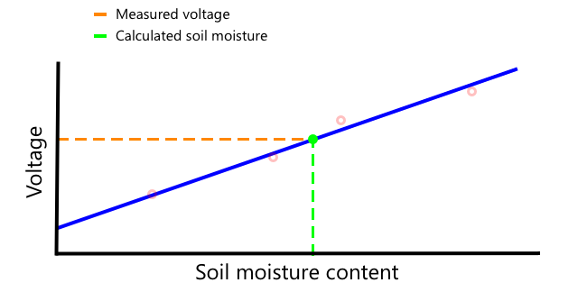

<!--
CO_OP_TRANSLATOR_METADATA:
{
  "original_hash": "4fb20273d299dc8d07a8f06c9cd0cdd9",
  "translation_date": "2025-08-28T11:01:17+00:00",
  "source_file": "2-farm/lessons/2-detect-soil-moisture/README.md",
  "language_code": "bg"
}
-->
C, произнасяно като *I-квадрат-C*, е протокол за комуникация между множество контролери и периферни устройства, при който всяко свързано устройство може да действа като контролер или периферия, комуникирайки през I²C шина (система за пренос на данни). Данните се изпращат като адресирани пакети, като всеки пакет съдържа адреса на свързаното устройство, за което е предназначен.

> 💁 Този модел преди се наричаше master/slave, но тази терминология се изоставя поради асоциацията ѝ с робството. [Асоциацията за хардуер с отворен код прие термините контролер/периферия](https://www.oshwa.org/a-resolution-to-redefine-spi-signal-names/), но все още може да срещнете препратки към старата терминология.

Устройствата имат адрес, който се използва при свързване към I²C шината, и обикновено е предварително зададен на устройството. Например, всеки тип сензор Grove от Seeed има един и същ адрес, така че всички светлинни сензори имат един и същ адрес, всички бутони имат адрес, който е различен от адреса на светлинния сензор. Някои устройства имат начини за промяна на адреса, като промяна на джъмпер настройки или запояване на пинове.

I²C има шина, състояща се от 2 основни проводника, заедно с 2 проводника за захранване:

| Проводник | Име | Описание |
| ---- | --------- | ----------- |
| SDA | Серийни данни | Този проводник се използва за изпращане на данни между устройствата. |
| SCL | Серийни часовник | Този проводник изпраща часовников сигнал с честота, зададена от контролера. |
| VCC | Общ колектор на напрежение | Захранването за устройствата. Това е свързано към проводниците SDA и SCL, за да осигури тяхното захранване чрез pull-up резистор, който изключва сигнала, когато няма устройство, което да е контролер. |
| GND | Земя | Осигурява обща земя за електрическата верига. |

За да изпрати данни, едно устройство издава стартово условие, за да покаже, че е готово да изпрати данни. След това то става контролер. Контролерът изпраща адреса на устройството, с което иска да комуникира, заедно с информация дали иска да чете или записва данни. След като данните са предадени, контролерът изпраща стоп условие, за да покаже, че е приключил. След това друго устройство може да стане контролер и да изпраща или получава данни.

22C има ограничения на скоростта, с три различни режима, които работят с фиксирани скорости. Най-бързият е режимът High Speed с максимална скорост от 3.4 Mbps (мегабита в секунда), въпреки че много малко устройства поддържат тази скорост. Например, Raspberry Pi е ограничен до fast mode със скорост 400 Kbps (килобита в секунда). Standard mode работи със скорост 100 Kbps.

> 💁 Ако използвате Raspberry Pi с Grove Base hat като ваш IoT хардуер, ще видите няколко I2C гнезда на платката, които можете да използвате за комуникация с I2C сензори. Аналоговите Grove сензори също използват I2C с ADC, за да изпращат аналогови стойности като цифрови данни, така че светлинният сензор, който използвахте, симулира аналогов пин, като стойността се изпраща през I2C, тъй като Raspberry Pi поддържа само цифрови пинове.

### Универсален асинхронен приемо-предавател (UART)

UART включва физическа схема, която позволява на две устройства да комуникират. Всяко устройство има 2 комуникационни пина - предаване (Tx) и приемане (Rx), като Tx пинът на първото устройство е свързан с Rx пина на второто, а Tx пинът на второто устройство е свързан с Rx пина на първото. Това позволява данните да се изпращат в двете посоки.

* Устройство 1 предава данни от своя Tx пин, които се приемат от устройство 2 на неговия Rx пин
* Устройство 1 получава данни на своя Rx пин, които се предават от устройство 2 от неговия Tx пин

> 🎓 Данните се изпращат по един бит наведнъж, което е известно като *серийна* комуникация. Повечето операционни системи и микроконтролери имат *серийни портове*, тоест връзки, които могат да изпращат и получават серийни данни, достъпни за вашия код.

UART устройствата имат [baud rate](https://wikipedia.org/wiki/Symbol_rate) (известна също като символна скорост), която е скоростта, с която данните ще се изпращат и получават в битове в секунда. Често срещана baud rate е 9,600, което означава, че 9,600 бита (0 и 1) данни се изпращат всяка секунда.

UART използва стартови и стоп битове - тоест изпраща стартов бит, за да покаже, че ще изпрати байт (8 бита) данни, след което стоп бит след изпращането на 8-те бита.

Скоростта на UART зависи от хардуера, но дори и най-бързите реализации не надвишават 6.5 Mbps (мегабита в секунда, или милиони битове, 0 или 1, изпратени в секунда).

Можете да използвате UART през GPIO пинове - можете да зададете един пин като Tx и друг като Rx, след което да ги свържете към друго устройство.

> 💁 Ако използвате Raspberry Pi с Grove Base hat като ваш IoT хардуер, ще видите UART гнездо на платката, което можете да използвате за комуникация със сензори, които използват UART протокола.

### Серийно периферно интерфейс (SPI)

SPI е проектиран за комуникация на къси разстояния, например на микроконтролер за връзка с устройство за съхранение като флаш памет. Той се основава на модел контролер/периферия с един контролер (обикновено процесорът на IoT устройството), който взаимодейства с множество периферии. Контролерът управлява всичко, като избира периферия и изпраща или заявява данни.

> 💁 Подобно на I2C, термините контролер и периферия са скорошни промени, така че може да срещнете по-старите термини.

SPI контролерите използват 3 жици, заедно с 1 допълнителна жица за всяка периферия. Перифериите използват 4 жици. Тези жици са:

| Жица | Име | Описание |
| ---- | --------- | ----------- |
| COPI | Изход на контролера, вход на периферията | Тази жица е за изпращане на данни от контролера към периферията. |
| CIPO | Вход на контролера, изход на периферията | Тази жица е за изпращане на данни от периферията към контролера. |
| SCLK | Сериен часовник | Тази жица изпраща часовников сигнал със скорост, зададена от контролера. |
| CS   | Избор на чип | Контролерът има множество жици, по една за всяка периферия, и всяка жица се свързва с CS жицата на съответната периферия. |

Жицата CS се използва за активиране на една периферия наведнъж, като се комуникира през жиците COPI и CIPO. Когато контролерът трябва да смени периферията, той деактивира CS жицата, свързана с текущо активната периферия, след което активира жицата, свързана с периферията, с която иска да комуникира следващата.

SPI е *пълен дуплекс*, което означава, че контролерът може да изпраща и получава данни едновременно от една и съща периферия, използвайки жиците COPI и CIPO. SPI използва часовников сигнал на жицата SCLK, за да поддържа устройствата синхронизирани, така че за разлика от изпращането директно през UART, не се нуждае от стартови и стоп битове.

Няма определени ограничения за скоростта на SPI, като реализациите често могат да предават множество мегабайти данни в секунда.

IoT комплекти за разработка често поддържат SPI през някои от GPIO пиновете. Например, на Raspberry Pi можете да използвате GPIO пинове 19, 21, 23, 24 и 26 за SPI.

### Безжична комуникация

Някои сензори могат да комуникират през стандартни безжични протоколи, като Bluetooth (главно Bluetooth Low Energy, или BLE), LoRaWAN (протокол за мрежи с ниска мощност и голям обхват) или WiFi. Това позволява отдалечени сензори, които не са физически свързани към IoT устройство.

Един такъв пример са търговските сензори за влажност на почвата. Те измерват влажността на почвата в поле, след което изпращат данните през LoRaWAN към хъб устройство, което обработва данните или ги изпраща през Интернет. Това позволява сензорът да бъде далеч от IoT устройството, което управлява данните, намалявайки консумацията на енергия и нуждата от големи WiFi мрежи или дълги кабели.

BLE е популярен за усъвършенствани сензори като фитнес тракери, които работят на китката. Те комбинират множество сензори и изпращат данните към IoT устройство, например вашия телефон, чрез BLE.

✅ Имате ли някакви Bluetooth сензори върху себе си, в дома си или в училището си? Те могат да включват температурни сензори, сензори за присъствие, тракери за устройства и фитнес устройства.

Един популярен начин за свързване на търговски устройства е Zigbee. Zigbee използва WiFi, за да формира мрежи от типа "мрежа" между устройствата, където всяко устройство се свързва с възможно най-много близки устройства, формирайки голям брой връзки като паяжина. Когато едно устройство иска да изпрати съобщение към Интернет, то го изпраща към най-близките устройства, които след това го препращат към други близки устройства и така нататък, докато достигне до координатор и може да бъде изпратено към Интернет.

> 🐝 Името Zigbee се отнася до танца на пчелите, когато се връщат в кошера.

## Измерване на нивата на влажност в почвата

Можете да измерите нивото на влажност в почвата, използвайки сензор за влажност на почвата, IoT устройство и стайно растение или близък участък от почва.

### Задача - измерване на влажността на почвата

Следвайте съответното ръководство, за да измерите влажността на почвата, използвайки вашето IoT устройство:

* [Arduino - Wio Terminal](wio-terminal-soil-moisture.md)
* [Едноплатков компютър - Raspberry Pi](pi-soil-moisture.md)
* [Едноплатков компютър - Виртуално устройство](virtual-device-soil-moisture.md)

## Калибриране на сензори

Сензорите разчитат на измерване на електрически свойства като съпротивление или капацитет.

> 🎓 Съпротивлението, измервано в омове (Ω), показва колко голямо е съпротивлението срещу електрическия ток, преминаващ през нещо. Когато напрежение се приложи към материал, количеството ток, което преминава през него, зависи от съпротивлението на материала. Можете да прочетете повече на [страницата за електрическо съпротивление в Wikipedia](https://wikipedia.org/wiki/Electrical_resistance_and_conductance).

> 🎓 Капацитетът, измерван във фаради (F), е способността на компонент или верига да събира и съхранява електрическа енергия. Можете да прочетете повече за капацитета на [страницата за капацитет в Wikipedia](https://wikipedia.org/wiki/Capacitance).

Тези измервания не винаги са полезни - представете си температурен сензор, който ви дава измерване от 22.5KΩ! Вместо това измерената стойност трябва да бъде преобразувана в полезна единица чрез калибриране - тоест съпоставяне на измерените стойности с измерваното количество, за да се позволи новите измервания да бъдат преобразувани в правилната единица.

Някои сензори идват предварително калибрирани. Например температурният сензор, който използвахте в предишния урок, вече беше калибриран, така че да може да връща измерване на температурата в °C. Във фабриката първият създаден сензор би бил изложен на редица известни температури и съпротивлението би било измерено. Това би било използвано за създаване на изчисление, което може да преобразува от измерената стойност в Ω (единицата за съпротивление) в °C.

> 💁 Формулата за изчисляване на съпротивлението от температура се нарича [уравнение на Щайнхарт–Харт](https://wikipedia.org/wiki/Steinhart–Hart_equation).

### Калибриране на сензор за влажност на почвата

Влажността на почвата се измерва чрез гравиметрично или обемно съдържание на вода.

* Гравиметричното е теглото на водата в единица тегло на почвата, измерено като брой килограми вода на килограм суха почва
* Обемното е обемът на водата в единица обем на почвата, измерено като брой кубически метри вода на кубически метри суха почва

> 🇺🇸 За американците, поради консистентността на единиците, тези могат да бъдат измерени в паунди вместо килограми или в кубически футове вместо кубически метри.

Сензорите за влажност на почвата измерват електрическо съпротивление или капацитет - това не само варира според влажността на почвата, но и според типа почва, тъй като компонентите в почвата могат да променят нейните електрически характеристики. Идеално е сензорите да бъдат калибрирани - тоест да се вземат показания от сензора и да се сравнят с измервания, направени по-научен начин. Например лаборатория може да изчисли гравиметричната влажност на почвата, използвайки проби от конкретно поле, взети няколко пъти в годината, и тези числа да се използват за калибриране на сензора, съпоставяйки показанията на сензора с гравиметричната влажност на почвата.

Графиката по-горе показва как да се калибрира сензор. Напрежението се записва за проба почва, която след това се измерва в лаборатория, като се сравнява влажното тегло със сухото тегло (чрез измерване на теглото влажно, след това изсушаване във фурна и измерване на сухото тегло). След като се вземат няколко показания, те могат да бъдат нанесени на графика и да се начертае линия, която да пасва на точките. Тази линия може след това да се използва за преобразуване на показанията на сензора за влажност на почвата, взети от IoT устройство, в реални измервания на влажността на почвата.

💁 За резистивните сензори за влажност на почвата напрежението се увеличава с увеличаване на влажността на почвата. За капацитивните сензори за влажност на почвата напрежението намалява с увеличаване на влажността на почвата, така че графиките за тях биха имали наклон надолу, а не нагоре.

Графиката по-горе показва напрежение, отчетено от сензор за влажност на почвата, и като се следва това до линията на графиката, може да се изчисли реалната влажност на почвата.

Този подход означава, че фермерът трябва да получи само няколко лабораторни измервания за поле, след което може да използва IoT устройства за измерване на влажността на почвата - драстично ускорявайки времето за вземане на измервания.

---

## 🚀 Предизвикателство

Резистивните и капацитивните сензори за влажност на почвата имат редица разлики. Какви са тези разлики и кой тип (ако има такъв) е най-добър за използване от фермер? Променя ли се този отговор между развиващите се и развитите страни?

## Тест след лекцията

[Тест след лекцията](https://black-meadow-040d15503.1.azurestaticapps.net/quiz/12)

## Преглед и самостоятелно обучение

Прочетете за хардуера и протоколите, използвани от сензорите и изпълнителните механизми:

* [GPIO страница в Wikipedia](https://wikipedia.org/wiki/General-purpose_input/output)
* [UART страница в Wikipedia](https://wikipedia.org/wiki/Universal_asynchronous_receiver-transmitter)
* [SPI страница в Wikipedia](https://wikipedia.org/wiki/Serial_Peripheral_Interface)
* [I2C страница в Wikipedia](https://wikipedia.org/wiki/I²C)
* [Zigbee страница в Wikipedia](https://wikipedia.org/wiki/Zigbee)

## Задание

[Калибрирайте вашия сензор](assignment.md)

---

**Отказ от отговорност**:  
Този документ е преведен с помощта на AI услуга за превод [Co-op Translator](https://github.com/Azure/co-op-translator). Въпреки че се стремим към точност, моля, имайте предвид, че автоматизираните преводи може да съдържат грешки или неточности. Оригиналният документ на неговия роден език трябва да се счита за авторитетен източник. За критична информация се препоръчва професионален човешки превод. Ние не носим отговорност за недоразумения или погрешни интерпретации, произтичащи от използването на този превод.