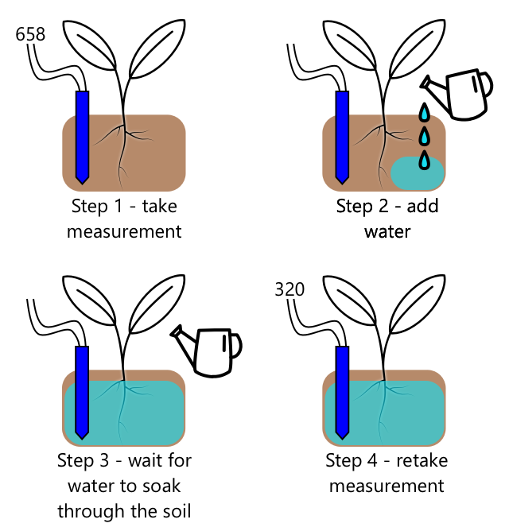

<!--
CO_OP_TRANSLATOR_METADATA:
{
  "original_hash": "f7bb24ba53fb627ddb38a8b24a05e594",
  "translation_date": "2025-08-28T11:39:43+00:00",
  "source_file": "2-farm/lessons/3-automated-plant-watering/README.md",
  "language_code": "bg"
}
-->
# Автоматизирано поливане на растения


> Скица от [Nitya Narasimhan](https://github.com/nitya). Кликнете върху изображението за по-голяма версия.

Този урок беше преподаван като част от [IoT за начинаещи Проект 2 - серия за дигитално земеделие](https://youtube.com/playlist?list=PLmsFUfdnGr3yCutmcVg6eAUEfsGiFXgcx) от [Microsoft Reactor](https://developer.microsoft.com/reactor/?WT.mc_id=academic-17441-jabenn).

[](https://youtu.be/g9FfZwv9R58)

## Тест преди лекцията

[Тест преди лекцията](https://black-meadow-040d15503.1.azurestaticapps.net/quiz/13)

## Въведение

В последния урок научихте как да наблюдавате влажността на почвата. В този урок ще научите как да изградите основните компоненти на автоматизирана система за поливане, която реагира на влажността на почвата. Ще научите също за времето - как сензорите могат да се нуждаят от време, за да реагират на промени, и как изпълнителните механизми могат да се нуждаят от време, за да променят свойствата, измервани от сензорите.

В този урок ще разгледаме:

* [Контролиране на устройства с висока мощност от IoT устройство с ниска мощност](../../../../../2-farm/lessons/3-automated-plant-watering)
* [Контролиране на реле](../../../../../2-farm/lessons/3-automated-plant-watering)
* [Контролиране на вашето растение чрез MQTT](../../../../../2-farm/lessons/3-automated-plant-watering)
* [Време за сензори и изпълнителни механизми](../../../../../2-farm/lessons/3-automated-plant-watering)
* [Добавяне на време към сървъра за управление на растенията](../../../../../2-farm/lessons/3-automated-plant-watering)

## Контролиране на устройства с висока мощност от IoT устройство с ниска мощност

IoT устройствата използват ниско напрежение. Докато това е достатъчно за сензори и изпълнителни механизми с ниска мощност като LED, то е твърде ниско за контролиране на по-голям хардуер, като водна помпа, използвана за напояване. Дори малки помпи, които бихте могли да използвате за стайни растения, изискват твърде много ток за IoT dev kit и биха изгорили платката.

> 🎓 Токът, измерван в ампери (A), е количеството електричество, преминаващо през веригата. Напрежението осигурява тласъка, токът е колко се тласка. Можете да прочетете повече за тока на [страницата за електрически ток в Wikipedia](https://wikipedia.org/wiki/Electric_current).

Решението за това е да имате помпа, свързана към външно захранване, и да използвате изпълнителен механизъм за включване на помпата, подобно на това как бихте включили лампа. Необходима е малка мощност (под формата на енергия в тялото ви), за да може пръстът ви да натисне ключа, и това свързва лампата към електрическата мрежа, работеща на 110v/240v.


> 🎓 [Електрическата мрежа](https://wikipedia.org/wiki/Mains_electricity) се отнася до електричеството, доставяно до домове и бизнеси чрез национална инфраструктура в много части на света.

✅ IoT устройствата обикновено осигуряват 3.3V или 5V, при по-малко от 1 ампер (1A) ток. Сравнете това с електрическата мрежа, която най-често е на 230V (120V в Северна Америка и 100V в Япония) и може да осигури мощност за устройства, които изискват 30A.

Има редица изпълнителни механизми, които могат да направят това, включително механични устройства, които можете да прикрепите към съществуващи ключове, имитиращи пръст, който ги включва. Най-популярното е реле.

### Релета

Релето е електромеханичен ключ, който преобразува електрически сигнал в механично движение, което включва ключа. Основата на релето е електромагнит.

> 🎓 [Електромагнитите](https://wikipedia.org/wiki/Electromagnet) са магнити, които се създават чрез пропускане на електричество през намотка от проводник. Когато електричеството е включено, намотката се намагнетизира. Когато електричеството е изключено, намотката губи своята магнетизация.


В релето управляващата верига захранва електромагнита. Когато електромагнитът е включен, той издърпва лост, който движи ключа, затваряйки двойка контакти и завършвайки изходната верига.


Когато управляващата верига е изключена, електромагнитът се изключва, освобождавайки лоста и отваряйки контактите, изключвайки изходната верига. Релетата са цифрови изпълнителни механизми - висок сигнал към релето го включва, нисък сигнал го изключва.

Изходната верига може да се използва за захранване на допълнителен хардуер, като система за напояване. IoT устройството може да включи релето, завършвайки изходната верига, която захранва системата за напояване, и растенията се поливат. IoT устройството може след това да изключи релето, прекъсвайки захранването към системата за напояване, спирайки водата.


Във видеото по-горе релето се включва. LED на релето светва, за да покаже, че е включено (някои платки с релета имат LED, които показват дали релето е включено или изключено), и захранването се изпраща към помпата, включвайки я и изпомпвайки вода към растение.

> 💁 Релетата могат също да се използват за превключване между две изходни вериги вместо за включване и изключване на една. Когато лостът се движи, той премества ключа от завършване на една изходна верига към завършване на друга изходна верига, обикновено споделяйки обща връзка за захранване или обща връзка за земя.

✅ Направете проучване: Има множество видове релета, с разлики като това дали управляващата верига включва или изключва релето, когато се приложи захранване, или множество изходни вериги. Разберете повече за тези различни видове.

Когато лостът се движи, обикновено можете да чуете как той прави контакт с електромагнита с ясно изразен звук на щракване.

> 💁 Реле може да бъде свързано така, че създаването на връзката всъщност да прекъсне захранването към релето, изключвайки го, което след това изпраща захранване към релето, включвайки го отново, и така нататък. Това означава, че релето ще щрака изключително бързо, създавайки бръмчащ звук. Това е начинът, по който някои от първите звънци, използвани в електрически звънци на врати, работеха.

### Мощност на релето

Електромагнитът не се нуждае от много мощност, за да се активира и да издърпа лоста, той може да се контролира с 3.3V или 5V изход от IoT dev kit. Изходната верига може да носи много повече мощност, в зависимост от релето, включително напрежение от електрическата мрежа или дори по-високи нива на мощност за индустриална употреба. По този начин IoT dev kit може да контролира система за напояване, от малка помпа за едно растение до огромна индустриална система за цяла търговска ферма.


Изображението по-горе показва реле Grove. Управляващата верига се свързва към IoT устройство и включва или изключва релето, използвайки 3.3V или 5V. Изходната верига има два терминала, всеки от тях може да бъде захранване или земя. Изходната верига може да обработва до 250V при 10A, достатъчно за редица устройства, захранвани от електрическата мрежа. Можете да получите релета, които могат да обработват дори по-високи нива на мощност.


В изображението по-горе захранването се доставя на помпа чрез реле. Има червен проводник, който свързва +5V терминала на USB захранване към един терминал на изходната верига на релето, и друг червен проводник, който свързва другия терминал на изходната верига към помпата. Черен проводник свързва помпата към земята на USB захранването. Когато релето се включи, то завършва веригата, изпращайки 5V към помпата, включвайки я.

## Контролиране на реле

Можете да контролирате реле от вашия IoT dev kit.

### Задача - контролиране на реле

Работете по съответното ръководство, за да контролирате реле, използвайки вашето IoT устройство:

* [Arduino - Wio Terminal](wio-terminal-relay.md)
* [Едноплатков компютър - Raspberry Pi](pi-relay.md)
* [Едноплатков компютър - Виртуално устройство](virtual-device-relay.md)

## Контролиране на вашето растение чрез MQTT

Досега вашето реле се контролираше директно от IoT устройството въз основа на едно измерване на влажността на почвата. В търговска система за напояване логиката за управление ще бъде централизирана, позволявайки вземането на решения за поливане, използвайки данни от множество сензори, и позволявайки всяка конфигурация да бъде променена на едно място. За да симулирате това, можете да контролирате релето чрез MQTT.

### Задача - контролиране на релето чрез MQTT

1. Добавете съответните MQTT библиотеки/pip пакети и код към вашия проект `soil-moisture-sensor`, за да се свържете с MQTT. Назовете идентификатора на клиента като `soilmoisturesensor_client`, предшестван от вашия идентификатор.

    > ⚠️ Можете да се обърнете към [инструкциите за свързване към MQTT в проект 1, урок 4, ако е необходимо](../../../1-getting-started/lessons/4-connect-internet/README.md#connect-your-iot-device-to-mqtt).

1. Добавете съответния код на устройството, за да изпращате телеметрия с настройките за влажност на почвата. За съобщението за телеметрия назовете свойството `soil_moisture`.

    > ⚠️ Можете да се обърнете към [инструкциите за изпращане на телеметрия към MQTT в проект 1, урок 4, ако е необходимо](../../../1-getting-started/lessons/4-connect-internet/README.md#send-telemetry-from-your-iot-device).

1. Създайте локален сървърен код, който да се абонира за телеметрия и да изпраща команда за контролиране на релето в папка, наречена `soil-moisture-sensor-server`. Назовете свойството в съобщението за команда `relay_on`, и задайте идентификатора на клиента като `soilmoisturesensor_server`, предшестван от вашия идентификатор. Запазете същата структура като сървърния код, който написахте за проект 1, урок 4, тъй като ще добавяте към този код по-късно в този урок.

    > ⚠️ Можете да се обърнете към [инструкциите за изпращане на телеметрия към MQTT](../../../1-getting-started/lessons/4-connect-internet/README.md#write-the-server-code) и [изпращане на команди чрез MQTT](../../../1-getting-started/lessons/4-connect-internet/README.md#send-commands-to-the-mqtt-broker) в проект 1, урок 4, ако е необходимо.

1. Добавете съответния код на устройството, за да контролирате релето от получени команди, използвайки свойството `relay_on` от съобщението. Изпратете true за `relay_on`, ако `soil_moisture` е по-голямо от 450, в противен случай изпратете false, същото като логиката, която добавихте за IoT устройството по-рано.

    > ⚠️ Можете да се обърнете към [инструкциите за реагиране на команди от MQTT в проект 1, урок 4, ако е необходимо](../../../1-getting-started/lessons/4-connect-internet/README.md#handle-commands-on-the-iot-device).

> 💁 Можете да намерите този код в папката [code-mqtt](../../../../../2-farm/lessons/3-automated-plant-watering/code-mqtt).

Уверете се, че кодът работи на вашето устройство и локален сървър, и го тествайте, като промените нивата на влажност на почвата, или чрез промяна на стойностите, изпратени от виртуалния сензор, или чрез промяна на нивата на влажност на почвата, добавяйки вода или премахвайки сензора от почвата.

## Време за сензори и изпълнителни механизми

В урок 3 създадохте нощна лампа - LED, който се включва веднага щом се открие ниско ниво на светлина от светлинен сензор. Светлинният сензор открива промяна в нивата на светлина моментално, и устройството може да реагира бързо, ограничено само от дължината на забавянето в функцията `loop` или цикъла `while True:`. Като IoT разработчик, не винаги можете да разчитате на толкова бърз цикъл на обратна връзка.

### Време за влажност на почвата

Ако сте направили последния урок за влажност на почвата, използвайки физически сензор, вероятно сте забелязали, че отнема няколко секунди, докато показанията за влажност на почвата спаднат, след като сте поливали растението си. Това не е защото сензорът е бавен, а защото водата се нуждае от време, за да проникне през почвата.
💁 Ако сте поливали твърде близо до сензора, може да сте забелязали, че показанията бързо спадат, а след това се връщат обратно нагоре – това се дължи на факта, че водата около сензора се разпространява в останалата част от почвата, намалявайки влагата в почвата около сензора.


На диаграмата по-горе измерването на влажността на почвата показва 658. Растението се полива, но тази стойност не се променя веднага, тъй като водата все още не е достигнала до сензора. Поливането може дори да приключи, преди водата да достигне сензора и стойността да спадне, за да отрази новото ниво на влажност.

Ако пишете код за управление на напоителна система чрез реле, базирано на нивата на влажност на почвата, трябва да вземете предвид това забавяне и да изградите по-интелигентно време за реакция във вашето IoT устройство.

✅ Отделете момент, за да помислите как бихте могли да направите това.

### Управление на времето на сензора и изпълнителния механизъм

Представете си, че сте натоварени със задачата да изградите напоителна система за ферма. Въз основа на типа почва, идеалното ниво на влажност за растенията е установено, че съответства на аналогово напрежение от 400-450.

Можете да програмирате устройството по същия начин като нощната лампа - през цялото време, когато сензорът отчита над 450, включете релето, за да включите помпата. Проблемът е, че водата отнема време, за да премине от помпата през почвата до сензора. Сензорът ще спре водата, когато засече ниво от 450, но нивото на водата ще продължи да пада, тъй като изпомпваната вода продължава да прониква през почвата. Крайният резултат е загуба на вода и риск от увреждане на корените.

✅ Запомнете - твърде много вода може да бъде толкова вредна за растенията, колкото и твърде малко, и разхищава ценен ресурс.

По-доброто решение е да се разбере, че има забавяне между включването на изпълнителния механизъм и промяната на свойството, което сензорът отчита. Това означава, че не само сензорът трябва да изчака известно време, преди да измери стойността отново, но и изпълнителният механизъм трябва да се изключи за известно време, преди да се направи следващото измерване на сензора.

Колко време трябва да бъде включено релето всеки път? По-добре е да се действа предпазливо и да се включва релето за кратко време, след това да се изчака водата да проникне, и след това да се провери нивото на влажност. В крайна сметка винаги можете да го включите отново, за да добавите още вода, но не можете да премахнете вода от почвата.

> 💁 Този вид управление на времето е много специфично за IoT устройството, което изграждате, свойството, което измервате, и използваните сензори и изпълнителни механизми.


Например, имам растение ягода със сензор за влажност на почвата и помпа, контролирана от реле. Наблюдавах, че когато добавя вода, отнема около 20 секунди, за да се стабилизира измерването на влажността на почвата. Това означава, че трябва да изключа релето и да изчакам 20 секунди, преди да проверя нивото на влажност. Предпочитам да има твърде малко вода, отколкото твърде много - винаги мога да включа помпата отново, но не мога да премахна вода от растението.



Това означава, че най-добрият процес би бил цикъл на поливане, който изглежда така:

* Включете помпата за 5 секунди
* Изчакайте 20 секунди
* Проверете влажността на почвата
* Ако нивото все още е над необходимото, повторете горните стъпки

5 секунди може да са твърде дълго за помпата, особено ако нивата на влажност са само малко над необходимото ниво. Най-добрият начин да разберете какво време да използвате е да го изпробвате, след това да го коригирате, когато имате данни от сензора, с постоянен цикъл на обратна връзка. Това може дори да доведе до по-гранулирано време, като например включване на помпата за 1 секунда за всеки 100 над необходимото ниво на влажност, вместо фиксирани 5 секунди.

✅ Направете проучване: Има ли други съображения за времето? Може ли растението да се полива по всяко време, когато влажността на почвата е твърде ниска, или има специфични часове от деня, които са добри и лоши за поливане на растенията?

> 💁 Прогнозите за времето също могат да бъдат взети предвид при управлението на автоматизирани напоителни системи за външно отглеждане. Ако се очаква дъжд, поливането може да бъде отложено до след края на дъжда. В този момент почвата може да е достатъчно влажна, че да не се нуждае от поливане, което е много по-ефективно, отколкото да се разхищава вода, като се полива точно преди дъжда.

## Добавете време към сървъра за управление на растенията

Кодът на сървъра може да бъде модифициран, за да добави управление около времето на цикъла на поливане и изчакването за промяна на нивата на влажност на почвата. Логиката на сървъра за управление на времето на релето е:

1. Получено съобщение за телеметрия
1. Проверете нивото на влажност на почвата
1. Ако е наред, не правете нищо. Ако измерването е твърде високо (което означава, че влажността на почвата е твърде ниска), тогава:
    1. Изпратете команда за включване на релето
    1. Изчакайте 5 секунди
    1. Изпратете команда за изключване на релето
    1. Изчакайте 20 секунди, за да се стабилизират нивата на влажност на почвата

Цикълът на поливане, процесът от получаване на съобщението за телеметрия до готовност за обработка на нивата на влажност на почвата отново, отнема около 25 секунди. Изпращаме нивата на влажност на почвата на всеки 10 секунди, така че има припокриване, при което съобщение се получава, докато сървърът изчаква стабилизиране на нивата на влажност на почвата, което може да започне нов цикъл на поливане.

Има два варианта за справяне с това:

* Променете кода на IoT устройството, така че да изпраща телеметрия само веднъж в минута, така че цикълът на поливане да бъде завършен преди изпращането на следващото съобщение
* Отпишете се от телеметрията по време на цикъла на поливане

Първият вариант не винаги е добро решение за големи ферми. Фермерът може да иска да записва нивата на влажност на почвата, докато почвата се полива, за по-късен анализ, например за да бъде наясно с потока на водата в различни области на фермата, за да насочи по-целенасочено поливане. Вторият вариант е по-добър - кодът просто игнорира телеметрията, когато не може да я използва, но телеметрията все още е налична за други услуги, които може да се абонират за нея.

> 💁 IoT данните не се изпращат само от едно устройство към една услуга, вместо това много устройства могат да изпращат данни към брокер, и много услуги могат да слушат данните от брокера. Например, една услуга може да слуша данни за влажността на почвата и да ги съхранява в база данни за анализ на по-късен етап. Друга услуга може също да слуша същата телеметрия, за да управлява напоителна система.

### Задача - добавете време към сървъра за управление на растенията

Актуализирайте кода на сървъра, за да управлява релето за 5 секунди, след това да изчака 20 секунди.

1. Отворете папката `soil-moisture-sensor-server` в VS Code, ако вече не е отворена. Уверете се, че виртуалната среда е активирана.

1. Отворете файла `app.py`

1. Добавете следния код към файла `app.py` под съществуващите импорти:

    ```python
    import threading
    ```

    Това изявление импортира `threading` от библиотеките на Python, което позволява на Python да изпълнява друг код, докато чака.

1. Добавете следния код преди функцията `handle_telemetry`, която обработва съобщенията за телеметрия, получени от кода на сървъра:

    ```python
    water_time = 5
    wait_time = 20
    ```

    Това определя колко дълго да работи релето (`water_time`) и колко дълго да се изчака след това, за да се провери влажността на почвата (`wait_time`).

1. Под този код добавете следното:

    ```python
    def send_relay_command(client, state):
        command = { 'relay_on' : state }
        print("Sending message:", command)
        client.publish(server_command_topic, json.dumps(command))
    ```

    Този код дефинира функция, наречена `send_relay_command`, която изпраща команда чрез MQTT за управление на релето. Телеметрията се създава като речник, след това се преобразува в JSON низ. Стойността, предадена в `state`, определя дали релето трябва да бъде включено или изключено.

1. След функцията `send_relay_code` добавете следния код:

    ```python
    def control_relay(client):
        print("Unsubscribing from telemetry")
        mqtt_client.unsubscribe(client_telemetry_topic)
    
        send_relay_command(client, True)
        time.sleep(water_time)
        send_relay_command(client, False)
    
        time.sleep(wait_time)
    
        print("Subscribing to telemetry")
        mqtt_client.subscribe(client_telemetry_topic)
    ```

    Това дефинира функция за управление на релето въз основа на необходимото време. Започва с отписване от телеметрията, така че съобщенията за влажност на почвата да не се обработват, докато поливането се извършва. След това изпраща команда за включване на релето. След това изчаква `water_time`, преди да изпрати команда за изключване на релето. Накрая изчаква нивата на влажност на почвата да се стабилизират за `wait_time` секунди. След това се абонира отново за телеметрията.

1. Променете функцията `handle_telemetry` на следното:

    ```python
    def handle_telemetry(client, userdata, message):
        payload = json.loads(message.payload.decode())
        print("Message received:", payload)
    
        if payload['soil_moisture'] > 450:
            threading.Thread(target=control_relay, args=(client,)).start()
    ```

    Този код проверява нивото на влажност на почвата. Ако е над 450, почвата се нуждае от поливане, така че извиква функцията `control_relay`. Тази функция се изпълнява на отделен нишка, работеща във фонов режим.

1. Уверете се, че вашето IoT устройство работи, след това изпълнете този код. Променете нивата на влажност на почвата и наблюдавайте какво се случва с релето - то трябва да се включи за 5 секунди, след това да остане изключено поне 20 секунди, като се включва само ако нивата на влажност на почвата не са достатъчни.

    ```output
    (.venv) ➜  soil-moisture-sensor-server ✗ python app.py
    Message received: {'soil_moisture': 457}
    Unsubscribing from telemetry
    Sending message: {'relay_on': True}
    Sending message: {'relay_on': False}
    Subscribing to telemetry
    Message received: {'soil_moisture': 302}
    ```

    Добър начин за тестване на това в симулирана напоителна система е да използвате суха почва, след това да налеете вода ръчно, докато релето е включено, спирайки наливането, когато релето се изключи.

> 💁 Можете да намерите този код в папката [code-timing](../../../../../2-farm/lessons/3-automated-plant-watering/code-timing).

> 💁 Ако искате да използвате помпа, за да изградите реална напоителна система, можете да използвате [6V водна помпа](https://www.seeedstudio.com/6V-Mini-Water-Pump-p-1945.html) с [USB терминално захранване](https://www.adafruit.com/product/3628). Уверете се, че захранването към или от помпата е свързано чрез релето.

---

## 🚀 Предизвикателство

Можете ли да се сетите за други IoT или електрически устройства, които имат подобен проблем, при който отнема време резултатите от изпълнителния механизъм да достигнат до сензора? Вероятно имате няколко в дома си или училището си.

* Какви свойства измерват?
* Колко време отнема на свойството да се промени след използване на изпълнителния механизъм?
* Ок ли е свойството да се промени над необходимата стойност?
* Как може да бъде върнато обратно към необходимата стойност, ако е нужно?

## Тест след лекцията

[Тест след лекцията](https://black-meadow-040d15503.1.azurestaticapps.net/quiz/14)

## Преглед и самостоятелно обучение

* Прочетете повече за релетата, включително тяхната историческа употреба в телефонни централи, на [страницата за релета в Wikipedia](https://wikipedia.org/wiki/Relay).

## Задание

[Изградете по-ефективен цикъл на поливане](assignment.md)

---

**Отказ от отговорност**:  
Този документ е преведен с помощта на AI услуга за превод [Co-op Translator](https://github.com/Azure/co-op-translator). Въпреки че се стремим към точност, моля, имайте предвид, че автоматичните преводи може да съдържат грешки или неточности. Оригиналният документ на неговия изходен език трябва да се счита за авторитетен източник. За критична информация се препоръчва професионален превод от човек. Ние не носим отговорност за каквито и да е недоразумения или погрешни интерпретации, произтичащи от използването на този превод.