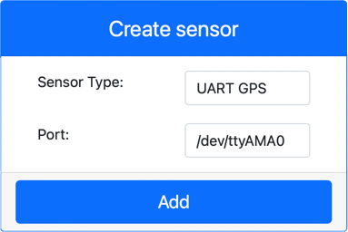

<!--
CO_OP_TRANSLATOR_METADATA:
{
  "original_hash": "64f18a8f8aaa1fef5e7320e0992d8b3a",
  "translation_date": "2025-08-28T09:40:32+00:00",
  "source_file": "3-transport/lessons/1-location-tracking/virtual-device-gps-sensor.md",
  "language_code": "bg"
}
-->
# Четене на GPS данни - Виртуален IoT хардуер

В тази част на урока ще добавите GPS сензор към вашето виртуално IoT устройство и ще четете стойности от него.

## Виртуален хардуер

Виртуалното IoT устройство ще използва симулиран GPS сензор, който е достъпен през UART чрез сериен порт.

Физическият GPS сензор има антена за улавяне на радиовълни от GPS сателити и преобразуване на GPS сигналите в GPS данни. Виртуалната версия симулира това, като ви позволява да зададете ширина и дължина, да изпратите сурови NMEA изречения или да качите GPX файл с множество локации, които могат да бъдат връщани последователно.

> 🎓 NMEA изреченията ще бъдат разгледани по-късно в този урок

### Добавяне на сензора към CounterFit

За да използвате виртуален GPS сензор, трябва да го добавите към приложението CounterFit.

#### Задача - добавяне на сензора към CounterFit

Добавете GPS сензора към приложението CounterFit.

1. Създайте ново Python приложение на вашия компютър в папка, наречена `gps-sensor`, с един файл, наречен `app.py`, и Python виртуална среда, и добавете pip пакетите за CounterFit.

    > ⚠️ Можете да се обърнете към [инструкциите за създаване и настройка на CounterFit Python проект в урок 1, ако е необходимо](../../../1-getting-started/lessons/1-introduction-to-iot/virtual-device.md).

1. Инсталирайте допълнителен pip пакет, за да добавите CounterFit shim, който може да комуникира със сензори, базирани на UART, през сериен порт. Уверете се, че инсталирате това от терминал с активирана виртуална среда.

    ```sh
    pip install counterfit-shims-serial
    ```

1. Уверете се, че уеб приложението CounterFit работи.

1. Създайте GPS сензор:

    1. В полето *Create sensor* в панела *Sensors*, отворете падащото меню *Sensor type* и изберете *UART GPS*.

    1. Оставете *Port* зададен на */dev/ttyAMA0*.

    1. Изберете бутона **Add**, за да създадете GPS сензора на порт `/dev/ttyAMA0`.

    

    GPS сензорът ще бъде създаден и ще се появи в списъка със сензори.

    

## Програмиране на GPS сензора

Виртуалното IoT устройство вече може да бъде програмирано да използва виртуалния GPS сензор.

### Задача - програмиране на GPS сензора

Програмирайте приложението за GPS сензора.

1. Уверете се, че приложението `gps-sensor` е отворено в VS Code.

1. Отворете файла `app.py`.

1. Добавете следния код в началото на `app.py`, за да свържете приложението с CounterFit:

    ```python
    from counterfit_connection import CounterFitConnection
    CounterFitConnection.init('127.0.0.1', 5000)
    ```

1. Добавете следния код под този, за да импортирате някои необходими библиотеки, включително библиотеката за CounterFit сериен порт:

    ```python
    import time
    import counterfit_shims_serial
    
    serial = counterfit_shims_serial.Serial('/dev/ttyAMA0')
    ```

    Този код импортира модула `serial` от pip пакета `counterfit_shims_serial`. След това се свързва към серийния порт `/dev/ttyAMA0` - това е адресът на серийния порт, който виртуалният GPS сензор използва за своя UART порт.

1. Добавете следния код под този, за да четете от серийния порт и да отпечатвате стойностите в конзолата:

    ```python
    def print_gps_data(line):
        print(line.rstrip())
    
    while True:
        line = serial.readline().decode('utf-8')
    
        while len(line) > 0:
            print_gps_data(line)
            line = serial.readline().decode('utf-8')
    
        time.sleep(1)
    ```

    Дефинира се функция, наречена `print_gps_data`, която отпечатва подадения ред в конзолата.

    След това кодът се изпълнява в безкраен цикъл, като чете колкото се може повече редове текст от серийния порт във всяка итерация. За всеки ред се извиква функцията `print_gps_data`.

    След като всички данни са прочетени, цикълът изчаква 1 секунда и опитва отново.

1. Стартирайте този код, като се уверите, че използвате различен терминал от този, в който работи приложението CounterFit, за да остане CounterFit приложението активно.

1. От приложението CounterFit променете стойността на GPS сензора. Можете да направите това по един от следните начини:

    * Задайте **Source** на `Lat/Lon` и задайте конкретна ширина, дължина и брой сателити, използвани за GPS фиксация. Тази стойност ще бъде изпратена само веднъж, така че маркирайте полето **Repeat**, за да се повтаря данните всяка секунда.

      

    * Задайте **Source** на `NMEA` и добавете няколко NMEA изречения в текстовото поле. Всички тези стойности ще бъдат изпратени, като има забавяне от 1 секунда преди всяко ново GGA (позиционна фиксация) изречение да бъде прочетено.

      

      Можете да използвате инструмент като [nmeagen.org](https://www.nmeagen.org), за да генерирате тези изречения, като рисувате върху карта. Тези стойности ще бъдат изпратени само веднъж, така че маркирайте полето **Repeat**, за да се повтарят данните една секунда след като всички са изпратени.

    * Задайте **Source** на GPX файл и качете GPX файл с местоположения на тракове. Можете да изтеглите GPX файлове от редица популярни сайтове за карти и туризъм, като [AllTrails](https://www.alltrails.com/). Тези файлове съдържат множество GPS местоположения като трак, а GPS сензорът ще връща всяко ново местоположение на интервали от 1 секунда.

      

      Тези стойности ще бъдат изпратени само веднъж, така че маркирайте полето **Repeat**, за да се повтарят данните една секунда след като всички са изпратени.

    След като конфигурирате настройките на GPS, изберете бутона **Set**, за да запишете тези стойности в сензора.

1. Ще видите суровия изход от GPS сензора, нещо подобно на следното:

    ```output
    $GNGGA,020604.001,4738.538654,N,12208.341758,W,1,3,,164.7,M,-17.1,M,,*67
    $GNGGA,020604.001,4738.538654,N,12208.341758,W,1,3,,164.7,M,-17.1,M,,*67
    ```

> 💁 Можете да намерите този код в папката [code-gps/virtual-device](../../../../../3-transport/lessons/1-location-tracking/code-gps/virtual-device).

😀 Вашата програма за GPS сензора беше успешна!

---

**Отказ от отговорност**:  
Този документ е преведен с помощта на AI услуга за превод [Co-op Translator](https://github.com/Azure/co-op-translator). Въпреки че се стремим към точност, моля, имайте предвид, че автоматизираните преводи може да съдържат грешки или неточности. Оригиналният документ на неговия роден език трябва да се счита за авторитетен източник. За критична информация се препоръчва професионален човешки превод. Ние не носим отговорност за недоразумения или погрешни интерпретации, произтичащи от използването на този превод.