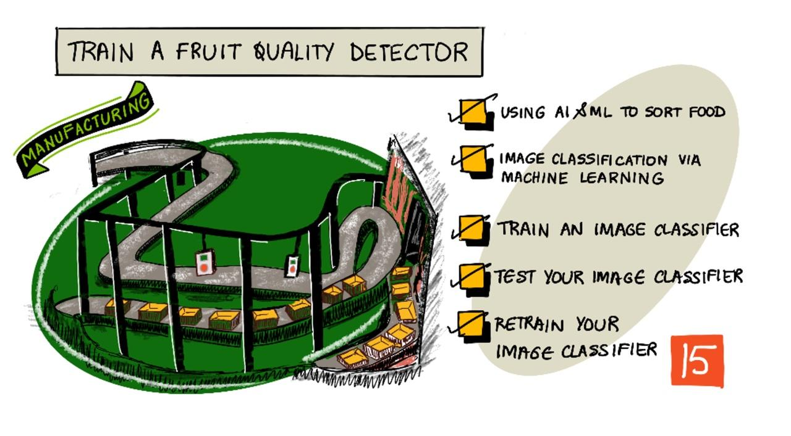

<!--
CO_OP_TRANSLATOR_METADATA:
{
  "original_hash": "f5e63c916d2dd97d58be12aaf76bd9f1",
  "translation_date": "2025-08-28T08:19:28+00:00",
  "source_file": "4-manufacturing/lessons/1-train-fruit-detector/README.md",
  "language_code": "bg"
}
-->
# Обучение на детектор за качество на плодове



> Скица от [Nitya Narasimhan](https://github.com/nitya). Кликнете върху изображението за по-голяма версия.

Това видео предоставя общ преглед на услугата Azure Custom Vision, която ще бъде разгледана в този урок.

[](https://www.youtube.com/watch?v=TETcDLJlWR4)

> 🎥 Кликнете върху изображението по-горе, за да гледате видеото.

## Тест преди лекцията

[Тест преди лекцията](https://black-meadow-040d15503.1.azurestaticapps.net/quiz/29)

## Въведение

Последният възход на Изкуствения интелект (AI) и Машинното обучение (ML) предоставя широк спектър от възможности на съвременните разработчици. ML моделите могат да бъдат обучени да разпознават различни обекти в изображения, включително неузрели плодове, което може да се използва в IoT устройства за сортиране на продукция, било то по време на събиране на реколтата или при обработка в заводи или складове.

В този урок ще научите за класификация на изображения – използване на ML модели за разграничаване между изображения на различни обекти. Ще научите как да обучите класификатор на изображения, за да различава плодове, които са добри, и плодове, които са лоши – било то недозрели, презрели, наранени или изгнили.

В този урок ще разгледаме:

* [Използване на AI и ML за сортиране на храни](../../../../../4-manufacturing/lessons/1-train-fruit-detector)
* [Класификация на изображения чрез Машинно обучение](../../../../../4-manufacturing/lessons/1-train-fruit-detector)
* [Обучение на класификатор на изображения](../../../../../4-manufacturing/lessons/1-train-fruit-detector)
* [Тестване на класификатора на изображения](../../../../../4-manufacturing/lessons/1-train-fruit-detector)
* [Повторно обучение на класификатора на изображения](../../../../../4-manufacturing/lessons/1-train-fruit-detector)

## Използване на AI и ML за сортиране на храни

Храненето на глобалното население е трудно, особено на цена, която прави храната достъпна за всички. Един от най-големите разходи е трудът, затова фермерите все повече се обръщат към автоматизация и инструменти като IoT, за да намалят разходите за труд. Ръчното събиране на реколтата е трудоемко (и често изтощително), и се заменя с машини, особено в по-богатите страни. Въпреки спестяванията от използването на машини за събиране на реколтата, има недостатък – способността за сортиране на храни по време на събирането.

Не всички култури узряват равномерно. Например, доматите могат да имат зелени плодове на лозата, когато по-голямата част е готова за събиране. Въпреки че е загуба да се събират тези плодове преждевременно, за фермера е по-евтино и по-лесно да събере всичко с машини и да изхвърли неузрелите плодове по-късно.

✅ Разгледайте различни плодове или зеленчуци, било то растящи близо до вас във ферми или в градината ви, или в магазини. Всички ли са с еднаква зрялост, или виждате вариации?

С възхода на автоматизираното събиране, сортирането на продукцията се премести от събирането към фабриката. Храната се транспортира по дълги конвейерни ленти с екипи от хора, които премахват всичко, което не отговаря на изискваните стандарти за качество. Събирането стана по-евтино благодарение на машините, но все още имаше разходи за ръчно сортиране на храната.


Следващата еволюция беше използването на машини за сортиране, било то вградени в комбайна или в заводите за обработка. Първото поколение от тези машини използваше оптични сензори за откриване на цветове, контролирайки механизми за изхвърляне на зелени домати в кош за отпадъци с помощта на лостове или въздушни струи, оставяйки червените домати да продължат по мрежата от конвейерни ленти.

В това видео, докато доматите падат от една конвейерна лента на друга, зелените домати се откриват и изхвърлят в кош с помощта на лостове.

✅ Какви условия бихте изискали в завод или на полето, за да работят тези оптични сензори правилно?

Последните еволюции на тези машини за сортиране използват AI и ML, като модели, обучени да различават добра продукция от лоша, не само по очевидни цветови разлики като зелени домати срещу червени, но и по по-фини разлики във външния вид, които могат да показват болести или наранявания.

## Класификация на изображения чрез Машинно обучение

Традиционното програмиране е процес, при който вземате данни, прилагате алгоритъм към тях и получавате резултат. Например, в последния проект използвахте GPS координати и геозона, приложихте алгоритъм, предоставен от Azure Maps, и получихте резултат дали точката е вътре или извън геозоната. Въвеждате повече данни, получавате повече резултати.


Машинното обучение обръща този процес – започвате с данни и известни резултати, а алгоритъмът за машинно обучение се учи от данните. След това можете да вземете този обучен алгоритъм, наречен *модел за машинно обучение* или *модел*, и да въведете нови данни, за да получите нови резултати.

> 🎓 Процесът, при който алгоритъмът за машинно обучение се учи от данните, се нарича *обучение*. Входните данни и известните резултати се наричат *обучителни данни*.

Например, можете да дадете на модел милиони снимки на неузрели банани като входни обучителни данни, с обучителен резултат, зададен като `неузрял`, и милиони снимки на узрели банани като обучителни данни с резултат, зададен като `узрял`. Алгоритъмът за ML ще създаде модел въз основа на тези данни. След това давате на този модел нова снимка на банан и той ще предскаже дали новата снимка е на узрял или неузрял банан.

> 🎓 Резултатите от ML моделите се наричат *предсказания*.


ML моделите не дават двоичен отговор, а вместо това дават вероятности. Например, модел може да получи снимка на банан и да предскаже `узрял` с 99.7% и `неузрял` с 0.3%. Вашият код би избрал най-доброто предсказание и би решил, че бананът е узрял.

Моделът за ML, използван за откриване на изображения като това, се нарича *класификатор на изображения* – той получава етикетирани изображения и след това класифицира нови изображения въз основа на тези етикети.

> 💁 Това е опростено обяснение, и има много други начини за обучение на модели, които не винаги изискват етикетирани резултати, като например неконтролирано обучение. Ако искате да научите повече за ML, разгледайте [ML за начинаещи, 24-урочна учебна програма за Машинно обучение](https://aka.ms/ML-beginners).

## Обучение на класификатор на изображения

За успешно обучение на класификатор на изображения са необходими милиони изображения. Оказва се, че след като имате класификатор на изображения, обучен на милиони или милиарди разнообразни изображения, можете да го използвате повторно и да го обучите с малък набор от изображения, за да получите отлични резултати, използвайки процес, наречен *трансферно обучение*.

> 🎓 Трансферното обучение е процес, при който прехвърляте наученото от съществуващ ML модел към нов модел, базиран на нови данни.

След като класификаторът на изображения е обучен за широк спектър от изображения, неговите вътрешни механизми са отлични в разпознаването на форми, цветове и модели. Трансферното обучение позволява на модела да използва това, което вече е научил за разпознаване на части от изображения, и да го използва за разпознаване на нови изображения.


Можете да си представите това като детски книги с форми, където след като можете да разпознаете полукръг, правоъгълник и триъгълник, можете да разпознаете платноходка или котка в зависимост от конфигурацията на тези форми. Класификаторът на изображения може да разпознава формите, а трансферното обучение го учи каква комбинация образува лодка или котка – или узрял банан.

Съществува широк спектър от инструменти, които могат да ви помогнат да направите това, включително облачни услуги, които могат да ви помогнат да обучите вашия модел и след това да го използвате чрез уеб API.

> 💁 Обучението на тези модели изисква много компютърна мощност, обикновено чрез графични процесори (GPUs). Същият специализиран хардуер, който прави игрите на вашия Xbox да изглеждат невероятно, може да се използва и за обучение на модели за машинно обучение. Чрез използване на облака можете да наемете време на мощни компютри с GPUs, за да обучите тези модели, получавайки достъп до необходимата изчислителна мощност само за времето, което ви е нужно.

## Custom Vision

Custom Vision е облачен инструмент за обучение на класификатори на изображения. Той ви позволява да обучите класификатор, използвайки само малък брой изображения. Можете да качвате изображения чрез уеб портал, уеб API или SDK, като давате на всяко изображение *етикет*, който представлява класификацията на това изображение. След това обучавате модела и го тествате, за да видите колко добре се представя. След като сте доволни от модела, можете да публикувате версии на него, които могат да бъдат достъпни чрез уеб API или SDK.


> 💁 Можете да обучите модел на Custom Vision с минимум 5 изображения на класификация, но повече е по-добре. Можете да получите по-добри резултати с поне 30 изображения.

Custom Vision е част от набор от AI инструменти от Microsoft, наречени Cognitive Services. Това са AI инструменти, които могат да се използват или без никакво обучение, или с малко обучение. Те включват разпознаване и превод на реч, разбиране на език и анализ на изображения. Те са достъпни с безплатен план като услуги в Azure.

> 💁 Безплатният план е напълно достатъчен за създаване на модел, неговото обучение и използване за разработка. Можете да прочетете за ограниченията на безплатния план на [страницата за ограничения и квоти на Custom Vision в Microsoft Docs](https://docs.microsoft.com/azure/cognitive-services/custom-vision-service/limits-and-quotas?WT.mc_id=academic-17441-jabenn).

### Задача - създаване на ресурс за Cognitive Services

За да използвате Custom Vision, първо трябва да създадете два ресурса за Cognitive Services в Azure, използвайки Azure CLI – един за обучение и един за предсказания.

1. Създайте Resource Group за този проект, наречена `fruit-quality-detector`.

1. Използвайте следната команда, за да създадете безплатен ресурс за обучение на Custom Vision:

    ```sh
    az cognitiveservices account create --name fruit-quality-detector-training \
                                        --resource-group fruit-quality-detector \
                                        --kind CustomVision.Training \
                                        --sku F0 \
                                        --yes \
                                        --location <location>
    ```

    Заменете `<location>` с местоположението, което сте използвали при създаването на Resource Group.

    Това ще създаде ресурс за обучение на Custom Vision във вашата Resource Group. Той ще се нарича `fruit-quality-detector-training` и ще използва `F0` SKU, което е безплатният план. Опцията `--yes` означава, че се съгласявате с условията на Cognitive Services.

> 💁 Използвайте SKU `S0`, ако вече имате безплатен акаунт, използващ някоя от услугите на Cognitive Services.

1. Използвайте следната команда, за да създадете безплатен ресурс за предсказания на Custom Vision:

    ```sh
    az cognitiveservices account create --name fruit-quality-detector-prediction \
                                        --resource-group fruit-quality-detector \
                                        --kind CustomVision.Prediction \
                                        --sku F0 \
                                        --yes \
                                        --location <location>
    ```

    Заменете `<location>` с местоположението, което сте използвали при създаването на Resource Group.

    Това ще създаде ресурс за предсказания на Custom Vision във вашата Resource Group. Той ще се нарича `fruit-quality-detector-prediction` и ще използва `F0` SKU, което е безплатният план. Опцията `--yes` означава, че се съгласявате с условията на Cognitive Services.

### Задача - създаване на проект за класификатор на изображения

1. Стартирайте портала Custom Vision на [CustomVision.ai](https://customvision.ai) и влезте с Microsoft акаунта, който сте използвали за вашия Azure акаунт.

1. Следвайте [секцията за създаване на нов проект от бързото ръководство за изграждане на класификатор в Microsoft Docs](https://docs.microsoft.com/azure/cognitive-services/custom-vision-service/getting-started-build-a-classifier?WT.mc_id=academic-17441-jabenn#create-a-new-project), за да създадете нов проект за Custom Vision. Потребителският интерфейс може да се промени, и тези документи винаги са най-актуалният източник.

    Наречете вашия проект `fruit-quality-detector`.

    Когато създавате проекта, уверете се, че използвате ресурса `fruit-quality-detector-training`, който създадохте по-рано. Използвайте тип проект *Classification*, тип класификация *Multiclass* и домейн *Food*.

    

✅ Отделете време, за да разгледате потребителския интерфейс на Custom Vision за вашия класификатор на изображения.

### Задача - обучение на вашия проект за класификатор на изображения

За да обучите класификатор на изображения, ще ви трябват множество снимки на плодове, както с добро, така и с лошо качество, за да ги етикетирате като добри и лоши, например узрял и презрял банан.
💁 Тези класификатори могат да класифицират изображения на всичко, така че ако нямате плодове с различно качество под ръка, можете да използвате два различни вида плодове или котки и кучета!
Идеално всяка снимка трябва да показва само плода, с или еднакъв фон, или разнообразие от фонове. Уверете се, че няма нищо във фона, което да е специфично за узрял или неузрял плод.

> 💁 Важно е да няма специфични фонове или предмети, които не са свързани с класифицирания обект за всеки етикет, иначе класификаторът може просто да класифицира на база фона. Имаше класификатор за рак на кожата, който беше обучен на снимки на бенки – както нормални, така и ракови, и раковите винаги бяха снимани с линийки до тях за измерване на размера. Оказа се, че класификаторът беше почти 100% точен в идентифицирането на линийки в снимките, а не на ракови бенки.

Класификаторите на изображения работят с много ниска резолюция. Например, Custom Vision може да обработва тренировъчни и предсказателни изображения до 10240x10240, но обучава и изпълнява модела върху изображения с размер 227x227. По-големите изображения се намаляват до този размер, така че се уверете, че обектът, който класифицирате, заема голяма част от изображението, иначе може да бъде твърде малък в намаленото изображение, използвано от класификатора.

1. Съберете снимки за вашия класификатор. Ще ви трябват поне 5 снимки за всеки етикет, за да обучите класификатора, но колкото повече, толкова по-добре. Ще ви трябват и няколко допълнителни изображения за тестване на класификатора. Тези изображения трябва да са различни снимки на един и същ обект. Например:

    * Използвайки 2 узрели банана, направете няколко снимки на всеки от тях от различни ъгли, като направите поне 7 снимки (5 за обучение, 2 за тестване), но идеално повече.

        

    * Повторете същия процес с 2 неузрели банана.

    Трябва да имате поне 10 тренировъчни изображения, с поне 5 узрели и 5 неузрели, и 4 тестови изображения – 2 узрели, 2 неузрели. Вашите изображения трябва да са в png или jpeg формат, с размер по-малък от 6MB. Ако ги създавате с iPhone например, те може да са с висока резолюция във формат HEIC, така че ще трябва да бъдат конвертирани и евентуално намалени. Колкото повече изображения, толкова по-добре, и трябва да имате подобен брой узрели и неузрели.

    Ако нямате както узрели, така и неузрели плодове, можете да използвате различни плодове или каквито и да е два обекта, които имате на разположение. Можете също да намерите примерни изображения в папката [images](../../../../../4-manufacturing/lessons/1-train-fruit-detector/images) на узрели и неузрели банани, които можете да използвате.

1. Следвайте [секцията за качване и етикетиране на изображения от бързото ръководство за създаване на класификатор в Microsoft документацията](https://docs.microsoft.com/azure/cognitive-services/custom-vision-service/getting-started-build-a-classifier?WT.mc_id=academic-17441-jabenn#upload-and-tag-images), за да качите вашите тренировъчни изображения. Етикетирайте узрелите плодове като `ripe`, а неузрелите като `unripe`.

    

1. Следвайте [секцията за обучение на класификатора от бързото ръководство за създаване на класификатор в Microsoft документацията](https://docs.microsoft.com/azure/cognitive-services/custom-vision-service/getting-started-build-a-classifier?WT.mc_id=academic-17441-jabenn#train-the-classifier), за да обучите класификатора на изображения върху качените от вас изображения.

    Ще ви бъде даден избор за тип обучение. Изберете **Quick Training**.

Класификаторът ще започне обучение. Ще отнеме няколко минути, докато обучението приключи.

> 🍌 Ако решите да изядете плодовете си, докато класификаторът се обучава, уверете се, че имате достатъчно изображения за тестване предварително!

## Тествайте вашия класификатор на изображения

След като класификаторът ви е обучен, можете да го тествате, като му дадете ново изображение за класификация.

### Задача - тествайте вашия класификатор на изображения

1. Следвайте [документацията за тестване на вашия модел в Microsoft документацията](https://docs.microsoft.com/azure/cognitive-services/custom-vision-service/test-your-model?WT.mc_id=academic-17441-jabenn#test-your-model), за да тествате вашия класификатор на изображения. Използвайте тестовите изображения, които създадохте по-рано, а не някое от изображенията, които използвахте за обучение.

    

1. Опитайте всички тестови изображения, до които имате достъп, и наблюдавайте вероятностите.

## Преобучете вашия класификатор на изображения

Когато тествате класификатора си, той може да не даде очакваните резултати. Класификаторите на изображения използват машинно обучение, за да правят прогнози за това какво има в изображението, на база вероятности, че определени характеристики на изображението означават, че то съответства на определен етикет. Те не разбират какво има в изображението – не знаят какво е банан или какво го прави банан, а не лодка. Можете да подобрите класификатора си, като го преобучите с изображения, които той класифицира неправилно.

Всеки път, когато направите прогноза, използвайки опцията за бърз тест, изображението и резултатите се съхраняват. Можете да използвате тези изображения, за да преобучите модела си.

### Задача - преобучете вашия класификатор на изображения

1. Следвайте [документацията за използване на предсказаното изображение за обучение в Microsoft документацията](https://docs.microsoft.com/azure/cognitive-services/custom-vision-service/test-your-model?WT.mc_id=academic-17441-jabenn#use-the-predicted-image-for-training), за да преобучите модела си, използвайки правилния етикет за всяко изображение.

1. След като моделът ви е преобучен, тествайте го с нови изображения.

---

## 🚀 Предизвикателство

Какво мислите, че ще се случи, ако използвате снимка на ягода с модел, обучен на банани, или снимка на надуваем банан, или човек в костюм на банан, или дори жълт анимационен герой като някой от Симпсън? 

Опитайте и вижте какви са прогнозите. Можете да намерите изображения за опит чрез [Bing Image search](https://www.bing.com/images/trending).

## Тест след лекцията

[Тест след лекцията](https://black-meadow-040d15503.1.azurestaticapps.net/quiz/30)

## Преглед и самостоятелно обучение

* Когато обучавахте класификатора си, щяхте да видите стойности за *Precision*, *Recall* и *AP*, които оценяват създадения модел. Прочетете какво означават тези стойности, използвайки [секцията за оценка на класификатора от бързото ръководство за създаване на класификатор в Microsoft документацията](https://docs.microsoft.com/azure/cognitive-services/custom-vision-service/getting-started-build-a-classifier?WT.mc_id=academic-17441-jabenn#evaluate-the-classifier).
* Прочетете как да подобрите класификатора си от [секцията за подобряване на вашия Custom Vision модел в Microsoft документацията](https://docs.microsoft.com/azure/cognitive-services/custom-vision-service/getting-started-improving-your-classifier?WT.mc_id=academic-17441-jabenn).

## Задание

[Обучете класификатора си за множество плодове и зеленчуци](assignment.md)

---

**Отказ от отговорност**:  
Този документ е преведен с помощта на AI услуга за превод [Co-op Translator](https://github.com/Azure/co-op-translator). Въпреки че се стремим към точност, моля, имайте предвид, че автоматичните преводи може да съдържат грешки или неточности. Оригиналният документ на неговия изходен език трябва да се счита за авторитетен източник. За критична информация се препоръчва професионален превод от човек. Не носим отговорност за каквито и да е недоразумения или погрешни интерпретации, произтичащи от използването на този превод.