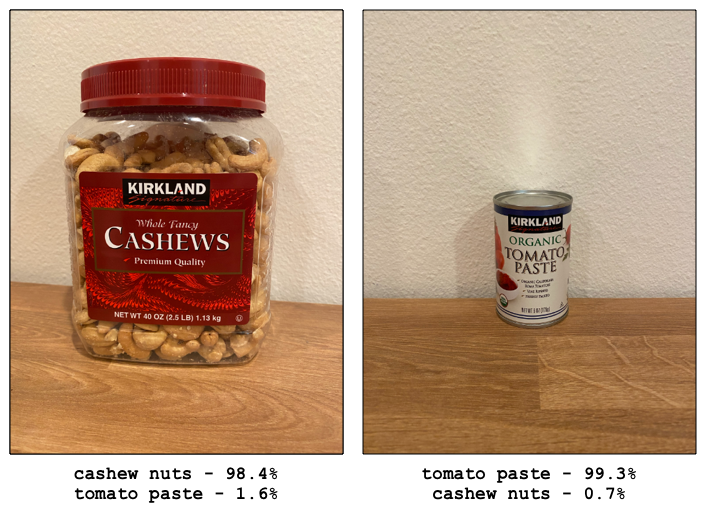

<!--
CO_OP_TRANSLATOR_METADATA:
{
  "original_hash": "8df310a42f902139a01417dacb1ffbef",
  "translation_date": "2025-08-28T10:45:05+00:00",
  "source_file": "5-retail/lessons/1-train-stock-detector/README.md",
  "language_code": "bg"
}
-->
# Обучение на детектор за наличности

> Скица от [Nitya Narasimhan](https://github.com/nitya). Кликнете върху изображението за по-голяма версия.

Това видео предоставя преглед на Обектно Разпознаване чрез услугата Azure Custom Vision, която ще бъде разгледана в този урок.

> 🎥 Кликнете върху изображението по-горе, за да гледате видеото

## Тест преди лекцията

[Тест преди лекцията](https://black-meadow-040d15503.1.azurestaticapps.net/quiz/37)

## Въведение

В предишния проект използвахте изкуствен интелект, за да обучите класификатор на изображения – модел, който може да определи дали дадено изображение съдържа нещо, например узрял или неузрял плод. Друг тип AI модел, който може да се използва с изображения, е обектното разпознаване. Тези модели не класифицират изображението чрез етикети, а се обучават да разпознават обекти и могат да ги намират в изображенията, като не само откриват, че обектът присъства, но и къде точно се намира в изображението. Това позволява броене на обекти в изображения.

В този урок ще научите за обектното разпознаване, включително как може да се използва в търговията на дребно. Ще научите също как да обучите детектор за обекти в облака.

В този урок ще разгледаме:

* [Обектно разпознаване](../../../../../5-retail/lessons/1-train-stock-detector)
* [Използване на обектно разпознаване в търговията на дребно](../../../../../5-retail/lessons/1-train-stock-detector)
* [Обучение на детектор за обекти](../../../../../5-retail/lessons/1-train-stock-detector)
* [Тестване на вашия детектор за обекти](../../../../../5-retail/lessons/1-train-stock-detector)
* [Повторно обучение на вашия детектор за обекти](../../../../../5-retail/lessons/1-train-stock-detector)

## Обектно разпознаване

Обектното разпознаване включва откриване на обекти в изображения с помощта на изкуствен интелект. За разлика от класификатора на изображения, който обучихте в последния проект, обектното разпознаване не се фокусира върху предсказване на най-подходящия етикет за цялото изображение, а върху намирането на един или повече обекти в изображението.

### Обектно разпознаване срещу класификация на изображения

Класификацията на изображения се отнася до класифициране на изображението като цяло – каква е вероятността цялото изображение да съответства на всеки етикет. Получавате вероятности за всеки етикет, използван за обучение на модела.

В горния пример две изображения са класифицирани с помощта на модел, обучен да класифицира кутии с кашу или консерви с доматено пюре. Първото изображение е кутия с кашу и има следните резултати от класификатора:

| Етикет         | Вероятност |
| -------------- | ----------: |
| `кашу`         | 98.4%       |
| `доматено пюре`| 1.6%        |

Второто изображение е консерва с доматено пюре и резултатите са:

| Етикет         | Вероятност |
| -------------- | ----------: |
| `кашу`         | 0.7%        |
| `доматено пюре`| 99.3%       |

Можете да използвате тези стойности с прагова стойност, за да предскажете какво има в изображението. Но какво ще стане, ако изображението съдържа множество консерви с доматено пюре или и кашу, и доматено пюре? Резултатите вероятно няма да ви дадат това, което искате. Тук идва на помощ обектното разпознаване.

Обектното разпознаване включва обучение на модел да разпознава обекти. Вместо да му давате изображения, съдържащи обекта, и да му казвате, че всяко изображение е един или друг етикет, маркирате секцията от изображението, която съдържа конкретния обект, и го етикетирате. Можете да маркирате един обект в изображение или няколко. Така моделът научава как изглежда самият обект, а не само как изглеждат изображенията, които съдържат обекта.

Когато след това го използвате за предсказване на изображения, вместо да получите списък с етикети и проценти, получавате списък с открити обекти, с техните ограничителни кутии и вероятността обектът да съответства на зададения етикет.

> 🎓 *Ограничителни кутии* са кутиите около обект.

Горното изображение съдържа както кутия с кашу, така и три консерви с доматено пюре. Детекторът за обекти е открил кашуто, връщайки ограничителната кутия, която съдържа кашуто, с вероятност от 97.6%. Детекторът за обекти също е открил три консерви с доматено пюре и предоставя три отделни ограничителни кутии – по една за всяка открита консерва, като всяка има процентна вероятност, че ограничителната кутия съдържа консерва с доматено пюре.

✅ Помислете за различни сценарии, за които бихте искали да използвате AI модели, базирани на изображения. Кои от тях биха изисквали класификация, а кои – обектно разпознаване?

### Как работи обектното разпознаване

Обектното разпознаване използва сложни ML модели. Тези модели работят, като разделят изображението на множество клетки и проверяват дали центърът на ограничителната кутия съвпада с центъра на изображение, което съответства на едно от изображенията, използвани за обучение на модела. Можете да си представите това като вид класификатор на изображения, който се прилага върху различни части от изображението, за да търси съвпадения.

> 💁 Това е драстично опростяване. Съществуват много техники за обектно разпознаване, за които можете да прочетете повече на [страницата за обектно разпознаване в Wikipedia](https://wikipedia.org/wiki/Object_detection).

Има редица различни модели, които могат да извършват обектно разпознаване. Един особено известен модел е [YOLO (You only look once)](https://pjreddie.com/darknet/yolo/), който е изключително бърз и може да разпознава 20 различни класа обекти, като хора, кучета, бутилки и коли.

✅ Прочетете повече за модела YOLO на [pjreddie.com/darknet/yolo/](https://pjreddie.com/darknet/yolo/)

Моделите за обектно разпознаване могат да бъдат преобучени чрез трансферно обучение, за да разпознават персонализирани обекти.

## Използване на обектно разпознаване в търговията на дребно

Обектното разпознаване има множество приложения в търговията на дребно. Някои от тях включват:

* **Проверка и броене на наличности** – разпознаване, когато наличностите на рафтовете са ниски. Ако наличностите са твърде ниски, могат да се изпращат известия до персонала или роботи за презареждане на рафтовете.
* **Разпознаване на маски** – в магазини с политики за носене на маски по време на обществени здравни събития, обектното разпознаване може да разпознава хора с маски и без маски.
* **Автоматизирано таксуване** – разпознаване на артикули, взети от рафтовете в автоматизирани магазини, и таксуване на клиентите съответно.
* **Откриване на опасности** – разпознаване на счупени предмети на пода или разляти течности и известяване на почистващите екипи.

✅ Направете проучване: Какви други приложения на обектното разпознаване в търговията на дребно можете да откриете?

## Обучение на детектор за обекти

Можете да обучите детектор за обекти, използвайки Custom Vision, по подобен начин, както обучихте класификатор на изображения.

### Задача – създаване на детектор за обекти

1. Създайте ресурсна група за този проект с име `stock-detector`.

1. Създайте безплатен ресурс за обучение на Custom Vision и безплатен ресурс за предсказване на Custom Vision в ресурсната група `stock-detector`. Наречете ги `stock-detector-training` и `stock-detector-prediction`.

    > 💁 Можете да имате само един безплатен ресурс за обучение и предсказване, така че се уверете, че сте изчистили проекта от предишните уроци.

    > ⚠️ Можете да се обърнете към [инструкциите за създаване на ресурси за обучение и предсказване от проект 4, урок 1, ако е необходимо](../../../4-manufacturing/lessons/1-train-fruit-detector/README.md#task---create-a-cognitive-services-resource).

1. Отворете портала Custom Vision на [CustomVision.ai](https://customvision.ai) и влезте с акаунта си в Microsoft, който използвате за вашия Azure акаунт.

1. Следвайте [секцията "Създаване на нов проект" от ръководството за бърз старт за изграждане на детектор за обекти в Microsoft Docs](https://docs.microsoft.com/azure/cognitive-services/custom-vision-service/get-started-build-detector?WT.mc_id=academic-17441-jabenn#create-a-new-project), за да създадете нов проект в Custom Vision. Интерфейсът може да се променя, така че тези документи са най-актуалният източник.

    Наречете проекта си `stock-detector`.

    Когато създавате проекта, уверете се, че използвате ресурса `stock-detector-training`, който създадохте по-рано. Изберете тип проект *Object Detection* и домейн *Products on Shelves*.

    

    ✅ Домейнът "Продукти на рафтове" е специално насочен към разпознаване на наличности на рафтовете в магазините. Прочетете повече за различните домейни в [документацията за избор на домейн в Microsoft Docs](https://docs.microsoft.com/azure/cognitive-services/custom-vision-service/select-domain?WT.mc_id=academic-17441-jabenn#object-detection)

✅ Отделете време, за да разгледате интерфейса на Custom Vision за вашия детектор за обекти.

### Задача – обучение на вашия детектор за обекти

За да обучите вашия модел, ще ви е необходим набор от изображения, съдържащи обектите, които искате да разпознавате.

1. Съберете изображения, които съдържат обекта за разпознаване. Ще ви трябват поне 15 изображения, съдържащи всеки обект за разпознаване, от различни ъгли и при различни условия на осветление, но колкото повече, толкова по-добре. Този детектор за обекти използва домейна *Products on Shelves*, така че се опитайте да подредите обектите така, сякаш са на рафт в магазин. Ще ви трябват и няколко изображения за тестване на модела. Ако разпознавате повече от един обект, ще искате някои тестови изображения, които съдържат всички обекти.

    > 💁 Изображения с множество различни обекти се броят към минималните 15 изображения за всички обекти в изображението.

    Вашите изображения трябва да бъдат в png или jpeg формат, с размер под 6MB. Ако ги създавате с iPhone например, те може да са високорезолюционни HEIC изображения, така че ще трябва да бъдат конвертирани и евентуално намалени. Колкото повече изображения, толкова по-добре, и трябва да имате подобен брой за узрели и неузрели обекти.

    Моделът е проектиран за продукти на рафтове, така че се опитайте да направите снимките на обектите върху рафтове.

    Можете да намерите примерни изображения, които можете да използвате, в папката [images](../../../../../5-retail/lessons/1-train-stock-detector/images) на кашу и доматено пюре.

1. Следвайте [секцията "Качване и маркиране на изображения" от ръководството за бърз старт за изграждане на детектор за обекти в Microsoft Docs](https://docs.microsoft.com/azure/cognitive-services/custom-vision-service/get-started-build-detector?WT.mc_id=academic-17441-jabenn#upload-and-tag-images), за да качите вашите тренировъчни изображения. Създайте подходящи етикети в зависимост от типовете обекти, които искате да разпознавате.

    

    Когато рисувате ограничителни кутии за обекти, дръжте ги плътно около обекта. Това може да отнеме известно време, за да очертаете всички изображения, но инструментът ще открие какво смята за ограничителни кутии, което ще ускори процеса.

    

    > 💁 Ако имате повече от 15 изображения за всеки обект, можете да обучите модела след първите 15 и след това да използвате функцията **Suggested tags**. Тя ще използва обучен модел, за да разпознае обектите в немаркираните изображения. Можете след това да потвърдите откритите обекти или да отхвърлите и прерисувате ограничителните кутии. Това може да спести *много* време.

1. Следвайте [секцията "Обучение на детектора" от ръководството за бърз старт за изграждане на детектор за обекти в Microsoft Docs](https://docs.microsoft.com/azure/cognitive-services/custom-vision-service/get-started-build-detector?WT.mc_id=academic-17441-jabenn#train-the-detector), за да обучите детектора за обекти върху вашите маркирани изображения.

    Ще имате избор за тип обучение. Изберете **Quick Training**.

Детекторът за обекти ще започне обучение. Това ще отнеме няколко минути.

## Тестване на вашия детектор за обекти

След като вашият детектор за обекти е обучен, можете да го тествате, като му предоставите нови изображения за разпознаване на обекти.

### Задача – тестване на вашия детектор за обекти

1. Използвайте бутона **Quick Test**, за да качите тестови изображения и да проверите дали обектите са разпознати. Използвайте тестовите изображения, които създадохте по-рано, а не тези, които използвахте за обучение.

    

1. Изпробвайте всички тестови изображения, с които разполагате, и наблюдавайте вероятностите.

## Повторно обучение на вашия детектор за обекти

Когато тествате вашия детектор за обекти, той може да не даде очакваните резултати, както беше с класификаторите на изображения в предишния проект. Можете да подобрите вашия детектор за обекти, като го преобучите с изображения, които той разпознава неправилно.

Всеки път, когато правите предсказание, използвайки опцията за бърз тест, изображението и резултатите се съхраняват. М
[Тест след лекцията](https://black-meadow-040d15503.1.azurestaticapps.net/quiz/38)

## Преглед и самостоятелно обучение

* Когато обучавахте вашия детектор на обекти, вероятно сте видели стойности за *Precision* (точност), *Recall* (припомняне) и *mAP* (средна прецизност), които оценяват създадения модел. Прочетете повече за тези стойности, като използвате [секцията "Оценка на детектора" от ръководството за бърз старт за създаване на детектор на обекти в Microsoft документацията](https://docs.microsoft.com/azure/cognitive-services/custom-vision-service/get-started-build-detector?WT.mc_id=academic-17441-jabenn#evaluate-the-detector)
* Научете повече за разпознаването на обекти на [страницата за разпознаване на обекти в Уикипедия](https://wikipedia.org/wiki/Object_detection)

## Задача

[Сравнете домейни](assignment.md)

---

**Отказ от отговорност**:  
Този документ е преведен с помощта на AI услуга за превод [Co-op Translator](https://github.com/Azure/co-op-translator). Въпреки че се стремим към точност, моля, имайте предвид, че автоматичните преводи може да съдържат грешки или неточности. Оригиналният документ на неговия изходен език трябва да се счита за авторитетен източник. За критична информация се препоръчва професионален превод от човек. Ние не носим отговорност за каквито и да било недоразумения или погрешни интерпретации, произтичащи от използването на този превод.