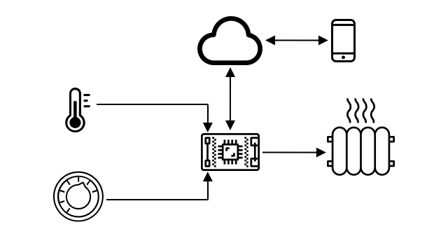

<!--
CO_OP_TRANSLATOR_METADATA:
{
  "original_hash": "9dd7f645ad1c6f20b72fee512987f772",
  "translation_date": "2025-08-27T13:12:34+00:00",
  "source_file": "1-getting-started/lessons/2-deeper-dive/README.md",
  "language_code": "bn"
}
-->
# IoT সম্পর্কে গভীর আলোচনা

> স্কেচনোট: [নিত্য নারাসিমহান](https://github.com/nitya)। বড় সংস্করণের জন্য ছবিতে ক্লিক করুন।

এই পাঠটি [Microsoft Reactor](https://developer.microsoft.com/reactor/?WT.mc_id=academic-17441-jabenn) থেকে [Hello IoT সিরিজ](https://youtube.com/playlist?list=PLmsFUfdnGr3xRts0TIwyaHyQuHaNQcb6-) এর অংশ হিসেবে শেখানো হয়েছিল। এটি দুটি ভিডিওতে শেখানো হয়েছিল - একটি ১ ঘণ্টার পাঠ এবং একটি ১ ঘণ্টার অফিস আওয়ার যেখানে পাঠের অংশগুলো আরও গভীরভাবে আলোচনা করা হয় এবং প্রশ্নের উত্তর দেওয়া হয়।

> 🎥 উপরের ছবিগুলোতে ক্লিক করে ভিডিওগুলো দেখুন

## প্রাক-পাঠ কুইজ

[প্রাক-পাঠ কুইজ](https://black-meadow-040d15503.1.azurestaticapps.net/quiz/3)

## ভূমিকা

এই পাঠে আমরা আগের পাঠে আলোচনা করা কিছু ধারণা আরও গভীরভাবে দেখব।

এই পাঠে আমরা আলোচনা করব:

* [একটি IoT অ্যাপ্লিকেশনের উপাদান](../../../../../1-getting-started/lessons/2-deeper-dive)
* [মাইক্রোকন্ট্রোলার সম্পর্কে গভীর আলোচনা](../../../../../1-getting-started/lessons/2-deeper-dive)
* [সিঙ্গল-বোর্ড কম্পিউটার সম্পর্কে গভীর আলোচনা](../../../../../1-getting-started/lessons/2-deeper-dive)

## একটি IoT অ্যাপ্লিকেশনের উপাদান

একটি IoT অ্যাপ্লিকেশনের দুটি প্রধান উপাদান হল *ইন্টারনেট* এবং *থিং*। চলুন এই দুটি উপাদান সম্পর্কে আরও বিস্তারিতভাবে দেখি।

### থিং

IoT-এর **থিং** অংশটি এমন একটি ডিভাইসকে বোঝায় যা বাস্তব জগতের সাথে যোগাযোগ করতে পারে। এই ডিভাইসগুলো সাধারণত ছোট, কম দামের কম্পিউটার, যা কম গতিতে চলে এবং কম শক্তি ব্যবহার করে - যেমন, সাধারণ মাইক্রোকন্ট্রোলার যেগুলো কিলোবাইট RAM (PC-তে গিগাবাইটের পরিবর্তে) এবং কয়েকশ মেগাহার্টজ গতিতে চলে (PC-তে গিগাহার্টজের পরিবর্তে), কিন্তু এত কম শক্তি ব্যবহার করে যে তারা সপ্তাহ, মাস বা এমনকি বছরের পর বছর ব্যাটারিতে চলতে পারে।

এই ডিভাইসগুলো বাস্তব জগতের সাথে যোগাযোগ করে, হয় সেন্সর ব্যবহার করে তাদের চারপাশ থেকে ডেটা সংগ্রহ করে বা আউটপুট বা অ্যাকচুয়েটর নিয়ন্ত্রণ করে শারীরিক পরিবর্তন ঘটায়। এর একটি সাধারণ উদাহরণ হল একটি স্মার্ট থার্মোস্ট্যাট - একটি ডিভাইস যার মধ্যে একটি তাপমাত্রা সেন্সর, একটি পছন্দসই তাপমাত্রা সেট করার উপায় যেমন একটি ডায়াল বা টাচস্ক্রিন, এবং একটি হিটিং বা কুলিং সিস্টেমের সাথে সংযোগ রয়েছে যা পছন্দসই সীমার বাইরে তাপমাত্রা সনাক্ত হলে চালু করা যায়। তাপমাত্রা সেন্সরটি সনাক্ত করে যে ঘরটি খুব ঠান্ডা এবং একটি অ্যাকচুয়েটর হিটিং চালু করে।

IoT ডিভাইস হিসেবে কাজ করতে পারে এমন বিভিন্ন ধরণের জিনিস রয়েছে, যেমন একটি নির্দিষ্ট হার্ডওয়্যার যা একটি জিনিস সনাক্ত করে, সাধারণ উদ্দেশ্য ডিভাইস, এমনকি আপনার স্মার্টফোনও! একটি স্মার্টফোন সেন্সর ব্যবহার করে তার চারপাশের জগত সনাক্ত করতে পারে এবং অ্যাকচুয়েটর ব্যবহার করে জগতের সাথে যোগাযোগ করতে পারে - যেমন একটি GPS সেন্সর ব্যবহার করে আপনার অবস্থান সনাক্ত করা এবং একটি স্পিকার ব্যবহার করে আপনাকে গন্তব্যে যাওয়ার নির্দেশনা দেওয়া।

✅ আপনার চারপাশে এমন অন্যান্য সিস্টেমের কথা ভাবুন যা একটি সেন্সর থেকে ডেটা পড়ে এবং সেই অনুযায়ী সিদ্ধান্ত নেয়। একটি উদাহরণ হতে পারে ওভেনের থার্মোস্ট্যাট। আরও উদাহরণ খুঁজে বের করতে পারেন?

### ইন্টারনেট

IoT অ্যাপ্লিকেশনের **ইন্টারনেট** অংশটি এমন অ্যাপ্লিকেশন নিয়ে গঠিত যা IoT ডিভাইস ডেটা পাঠাতে এবং গ্রহণ করতে সংযোগ করতে পারে, পাশাপাশি অন্যান্য অ্যাপ্লিকেশন যা IoT ডিভাইস থেকে ডেটা প্রক্রিয়া করতে পারে এবং IoT ডিভাইসের অ্যাকচুয়েটরকে কী অনুরোধ পাঠাতে হবে তা সিদ্ধান্ত নিতে সাহায্য করতে পারে।

একটি সাধারণ সেটআপ হতে পারে একটি ক্লাউড সার্ভিস যেখানে IoT ডিভাইস সংযোগ করে এবং এই ক্লাউড সার্ভিস নিরাপত্তা পরিচালনা করে, IoT ডিভাইস থেকে বার্তা গ্রহণ করে এবং ডিভাইসে বার্তা পাঠায়। এই ক্লাউড সার্ভিসটি অন্যান্য অ্যাপ্লিকেশনের সাথে সংযোগ করে যা সেন্সর ডেটা প্রক্রিয়া বা সংরক্ষণ করতে পারে, অথবা অন্যান্য সিস্টেম থেকে ডেটার সাথে সেন্সর ডেটা ব্যবহার করে সিদ্ধান্ত নিতে পারে।

ডিভাইসগুলো সবসময় সরাসরি ইন্টারনেটের সাথে WiFi বা তারযুক্ত সংযোগের মাধ্যমে সংযোগ করে না। কিছু ডিভাইস মেশ নেটওয়ার্কিং ব্যবহার করে একে অপরের সাথে ব্লুটুথের মতো প্রযুক্তির মাধ্যমে কথা বলে, একটি হাব ডিভাইসের মাধ্যমে সংযোগ করে যার একটি ইন্টারনেট সংযোগ রয়েছে।

স্মার্ট থার্মোস্ট্যাটের উদাহরণে, থার্মোস্ট্যাটটি হোম WiFi ব্যবহার করে ক্লাউডে একটি ক্লাউড সার্ভিসের সাথে সংযোগ করবে। এটি তাপমাত্রার ডেটা এই ক্লাউড সার্ভিসে পাঠাবে এবং সেখান থেকে এটি কোনো ধরনের ডাটাবেসে লেখা হবে যাতে বাড়ির মালিক একটি ফোন অ্যাপ ব্যবহার করে বর্তমান এবং অতীতের তাপমাত্রা পরীক্ষা করতে পারে। ক্লাউডে থাকা অন্য একটি সার্ভিস জানবে বাড়ির মালিক কী তাপমাত্রা চান এবং ক্লাউড সার্ভিসের মাধ্যমে IoT ডিভাইসে বার্তা পাঠাবে যাতে হিটিং সিস্টেম চালু বা বন্ধ করা যায়।

আরও স্মার্ট সংস্করণটি AI ব্যবহার করতে পারে যা ক্লাউডে অন্যান্য IoT ডিভাইসের সাথে সংযুক্ত সেন্সর থেকে ডেটা যেমন রুমের ব্যবহার সনাক্ত করার জন্য সেন্সর, আবহাওয়া এবং এমনকি আপনার ক্যালেন্ডারের মতো ডেটা ব্যবহার করে স্মার্টভাবে তাপমাত্রা সেট করার সিদ্ধান্ত নিতে পারে। উদাহরণস্বরূপ, এটি আপনার ক্যালেন্ডার থেকে পড়ে যদি আপনি ছুটিতে থাকেন তবে আপনার হিটিং বন্ধ করতে পারে, অথবা রুমের ব্যবহার অনুযায়ী রুম বাই রুম ভিত্তিতে হিটিং বন্ধ করতে পারে, ডেটা থেকে শিখে সময়ের সাথে আরও সঠিক হতে পারে।

✅ কী ধরনের অন্যান্য ডেটা একটি ইন্টারনেট সংযুক্ত থার্মোস্ট্যাটকে আরও স্মার্ট করতে সাহায্য করতে পারে?

### এজে IoT

যদিও IoT-এর I মানে ইন্টারনেট, এই ডিভাইসগুলো ইন্টারনেটের সাথে সংযুক্ত হতে হবে এমন কোনো বাধ্যবাধকতা নেই। কিছু ক্ষেত্রে, ডিভাইসগুলো 'এজ' ডিভাইসের সাথে সংযুক্ত হতে পারে - গেটওয়ে ডিভাইস যা আপনার লোকাল নেটওয়ার্কে চলে, যার ফলে আপনি ইন্টারনেটের মাধ্যমে কল না করেই ডেটা প্রক্রিয়া করতে পারেন। এটি দ্রুত হতে পারে যখন আপনার কাছে প্রচুর ডেটা থাকে বা একটি ধীর ইন্টারনেট সংযোগ থাকে, এটি আপনাকে অফলাইনে চালানোর অনুমতি দেয় যেখানে ইন্টারনেট সংযোগ সম্ভব নয় যেমন একটি জাহাজে বা একটি মানবিক সংকটের সময় একটি দুর্যোগ এলাকায়, এবং এটি আপনাকে ডেটা ব্যক্তিগত রাখতে দেয়। কিছু ডিভাইস ক্লাউড টুল ব্যবহার করে তৈরি করা প্রসেসিং কোড ধারণ করে এবং এটি লোকালভাবে চালায় যাতে ইন্টারনেট সংযোগ ব্যবহার না করেই ডেটা সংগ্রহ এবং সিদ্ধান্ত নেওয়া যায়।

এর একটি উদাহরণ হল একটি স্মার্ট হোম ডিভাইস যেমন Apple HomePod, Amazon Alexa, বা Google Home, যা আপনার কণ্ঠ শুনবে ক্লাউডে প্রশিক্ষিত AI মডেল ব্যবহার করে, কিন্তু ডিভাইসে লোকালভাবে চলবে। এই ডিভাইসগুলো একটি নির্দিষ্ট শব্দ বা বাক্যাংশ বলা হলে 'জেগে উঠবে' এবং শুধুমাত্র তখন আপনার বক্তব্য ইন্টারনেটের মাধ্যমে প্রক্রিয়াকরণের জন্য পাঠাবে। ডিভাইসটি আপনার বক্তব্যে বিরতি সনাক্ত করলে একটি উপযুক্ত সময়ে বক্তব্য পাঠানো বন্ধ করবে। আপনি ডিভাইসটিকে জাগানোর শব্দ বলার আগে যা কিছু বলেন এবং ডিভাইসটি শোনা বন্ধ করার পরে যা কিছু বলেন তা ডিভাইস প্রদানকারীর কাছে ইন্টারনেটের মাধ্যমে পাঠানো হবে না এবং তাই এটি ব্যক্তিগত থাকবে।

✅ এমন অন্যান্য পরিস্থিতির কথা ভাবুন যেখানে গোপনীয়তা গুরুত্বপূর্ণ, তাই ডেটা প্রক্রিয়াকরণ ক্লাউডের পরিবর্তে এজে করা ভালো হবে। একটি ইঙ্গিত - IoT ডিভাইসে ক্যামেরা বা অন্যান্য ইমেজিং ডিভাইসের কথা ভাবুন।

### IoT নিরাপত্তা

যেকোনো ইন্টারনেট সংযোগের ক্ষেত্রে, নিরাপত্তা একটি গুরুত্বপূর্ণ বিষয়। একটি পুরানো রসিকতা আছে যে 'IoT-তে S মানে নিরাপত্তা' - IoT-তে কোনো 'S' নেই, যা বোঝায় এটি নিরাপদ নয়।

IoT ডিভাইসগুলো একটি ক্লাউড সার্ভিসের সাথে সংযুক্ত হয় এবং তাই সেই ক্লাউড সার্ভিস যতটা নিরাপদ, ডিভাইসগুলোও ততটাই নিরাপদ - যদি আপনার ক্লাউড সার্ভিস কোনো ডিভাইসকে সংযোগ করার অনুমতি দেয় তবে ক্ষতিকারক ডেটা পাঠানো যেতে পারে বা ভাইরাস আক্রমণ হতে পারে। এটি বাস্তব জগতে খুবই গুরুতর পরিণতি ঘটাতে পারে কারণ IoT ডিভাইসগুলো অন্যান্য ডিভাইসের সাথে যোগাযোগ করে এবং নিয়ন্ত্রণ করে। উদাহরণস্বরূপ, [Stuxnet worm](https://wikipedia.org/wiki/Stuxnet) সেন্ট্রিফিউজের ভালভগুলিকে ক্ষতিগ্রস্ত করতে ম্যানিপুলেট করেছিল। হ্যাকাররা [দুর্বল নিরাপত্তার সুযোগ নিয়ে বেবি মনিটর](https://www.npr.org/sections/thetwo-way/2018/06/05/617196788/s-c-mom-says-baby-monitor-was-hacked-experts-say-many-devices-are-vulnerable) এবং অন্যান্য হোম নজরদারি ডিভাইসে প্রবেশ করেছে।

> 💁 কখনও কখনও IoT ডিভাইস এবং এজ ডিভাইসগুলো সম্পূর্ণভাবে ইন্টারনেট থেকে বিচ্ছিন্ন একটি নেটওয়ার্কে চলে যাতে ডেটা ব্যক্তিগত এবং নিরাপদ থাকে। এটি [এয়ার-গ্যাপিং](https://wikipedia.org/wiki/Air_gap_(networking)) নামে পরিচিত।

## মাইক্রোকন্ট্রোলার সম্পর্কে গভীর আলোচনা

আগের পাঠে আমরা মাইক্রোকন্ট্রোলার পরিচয় করিয়েছিলাম। এবার আমরা সেগুলো সম্পর্কে আরও গভীরভাবে দেখব।

### CPU

CPU হল মাইক্রোকন্ট্রোলারের 'মস্তিষ্ক'। এটি প্রসেসর যা আপনার কোড চালায় এবং যেকোনো সংযুক্ত ডিভাইস থেকে ডেটা পাঠাতে এবং গ্রহণ করতে পারে। CPU-তে এক বা একাধিক কোর থাকতে পারে - মূলত এক বা একাধিক CPU যা একসাথে আপনার কোড চালাতে পারে।

CPU একটি ক্লকের উপর নির্ভর করে যা প্রতি সেকেন্ডে লক্ষ লক্ষ বা বিলিয়ন বার টিক দেয়। প্রতিটি টিক বা সাইকেল CPU-এর কাজগুলোকে সিঙ্ক্রোনাইজ করে। প্রতিটি টিকের সময়, CPU একটি প্রোগ্রামের একটি নির্দেশনা কার্যকর করতে পারে, যেমন একটি বাহ্যিক ডিভাইস থেকে ডেটা পুনরুদ্ধার করা বা একটি গাণিতিক গণনা করা। এই নিয়মিত সাইকেলটি সমস্ত কাজ সম্পন্ন করার অনুমতি দেয় যাতে পরবর্তী নির্দেশনা প্রক্রিয়া করার আগে এটি সম্পন্ন হয়।

ক্লক সাইকেল যত দ্রুত, প্রতি সেকেন্ডে যত বেশি নির্দেশনা প্রক্রিয়া করা যায়, CPU তত দ্রুত। CPU গতি [Hertz (Hz)](https://wikipedia.org/wiki/Hertz) এ পরিমাপ করা হয়, একটি মানক একক যেখানে 1 Hz মানে প্রতি সেকেন্ডে এক সাইকেল বা ক্লক টিক।

> 🎓 CPU গতি প্রায়ই MHz বা GHz-এ দেওয়া হয়। 1MHz হল 1 মিলিয়ন Hz, 1GHz হল 1 বিলিয়ন Hz।

> 💁 CPU-গুলো [fetch-decode-execute cycle](https://wikipedia.org/wiki/Instruction_cycle) ব্যবহার করে প্রোগ্রাম চালায়। প্রতিটি ক্লক টিকের জন্য, CPU মেমরি থেকে পরবর্তী নির্দেশনা নিয়ে আসে, এটি ডিকোড করে, তারপর এটি কার্যকর করে যেমন একটি গাণিতিক লজিক ইউনিট (ALU) ব্যবহার করে দুটি সংখ্যা যোগ করা। কিছু কার্যকরকরণ একাধিক টিক নিতে পারে, তাই পরবর্তী সাইকেলটি নির্দেশনা সম্পন্ন হওয়ার পরে পরবর্তী টিকে চলবে।

মাইক্রোকন্ট্রোলারগুলোর ক্লক গতি ডেস্কটপ বা ল্যাপটপ কম্পিউটার, এমনকি বেশিরভাগ স্মার্টফোনের তুলনায় অনেক কম। উদাহরণস্বরূপ, Wio Terminal-এর একটি CPU রয়েছে যা 120MHz বা প্রতি সেকেন্ডে 120,000,000 সাইকেলে চলে।

✅ একটি গড় PC বা Mac-এর CPU রয়েছে যা একাধিক কোরে চলে এবং একাধিক গিগাহার্টজ গতিতে চলে, অর্থাৎ ক্লক প্রতি সেকেন্ডে বিলিয়ন বার টিক দেয়। আপনার কম্পিউটারের ক্লক গতি গবেষণা করুন এবং Wio Terminal-এর তুলনায় এটি কতবার দ্রুত তা তুলনা করুন।

প্রতিটি ক্লক সাইকেল শক্তি ব্যবহার করে এবং তাপ উৎপন্ন করে। টিক যত দ্রুত, তত বেশি শক্তি খরচ হয় এবং তত বেশি তাপ উৎপন্ন হয়। PC-তে তাপ অপসারণের জন্য হিট সিঙ্ক এবং ফ্যান থাকে, যা ছাড়া তারা কয়েক সেকেন্ডের মধ্যে অতিরিক্ত গরম হয়ে বন্ধ হয়ে যাবে। মাইক্রোকন্ট্রোলারগুলো প্রায়ই এগুলো থাকে না কারণ তারা অনেক ঠান্ডা চলে এবং তাই অনেক ধীর। PC-গুলো মেইনস পাওয়ার বা বড় ব্যাটারি থেকে কয়েক ঘণ্টা চলে, মাইক্রোকন্ট্রোলারগুলো ছোট ব্যাটারি থেকে দিন, মাস বা এমনকি বছর ধরে চলতে পারে। মাইক্রোকন্ট্রোলারগুলোতে এমন কোর থাকতে পারে যা বিভিন্ন গতিতে চলে, CPU-তে চাহিদা কম থাকলে শক্তি খরচ কমাতে ধীর গতির লো পাওয়ার কোরে স্যুইচ করে।

> 💁 কিছু PC এবং Mac একই মিশ্রণ গ্রহণ করছে যেখানে দ্রুত উচ্চ শক্তি কোর এবং ধীর লো পাওয়ার কোর রয়েছে, ব্যাটারি সংরক্ষণ করতে স্যুইচ করে। উদাহরণস্বরূপ, সর্বশেষ Apple ল্যাপটপে M1 চিপটি ব্যাটারি লাইফ বা গতি অপ্টিমাইজ করতে 4টি পারফরম্যান্স কোর এবং 4টি দক্ষতা কোরের মধ্যে স্যুইচ করতে পারে।

✅ একটু গবেষণা করুন: CPU সম্পর্কে [Wikipedia CPU article](https://wikipedia.org/wiki/Central_processing_unit) পড়ুন।

#### কাজ

Wio Terminal সম্পর্কে অনুসন্ধান করুন।

যদি আপনি এই পাঠগুলোর জন্য Wio Terminal ব্যবহার করেন, CPU খুঁজে বের করার চেষ্টা করুন। [Wio Terminal product page](https://www.seeedstudio.com/Wio-Terminal-p-4509.html)-এর *Hardware Overview* বিভাগে অভ্যন্তরীণ অংশের একটি ছবি খুঁজুন এবং পিছনের স্বচ্ছ প্লাস্টিকের জানালার মাধ্যমে CPU খুঁজে বের করার চেষ্টা করুন।

### মেমরি

মাইক্রোকন্ট্রোলারগুলো সাধারণত দুটি ধরণের মেমরি থাকে - প্রোগ্রাম মেমরি এবং র‍্যান্ডম-অ্যাক্সেস মেমরি (RAM)।

প্রোগ্রাম মেমরি নন-ভোলাটাইল, যার অর্থ যা কিছু এতে লেখা হয় তা ডিভাইসে কোনো পাওয়ার না থাকলেও থাকে। এটি
🎓 প্রোগ্রাম মেমরি আপনার কোড সংরক্ষণ করে এবং বিদ্যুৎ না থাকলেও থাকে।
> 🎓 র‍্যাম আপনার প্রোগ্রাম চালানোর জন্য ব্যবহৃত হয় এবং বিদ্যুৎ না থাকলে এটি রিসেট হয়ে যায়

মাইক্রোকন্ট্রোলারের মেমোরি সাধারণত পিসি বা ম্যাকের তুলনায় অনেক ছোট হয়, যেমন সিপিইউর ক্ষেত্রেও। একটি সাধারণ পিসিতে ৮ গিগাবাইট (GB) র‍্যাম থাকতে পারে, যা ৮,০০০,০০০,০০০ বাইটের সমান। প্রতিটি বাইট একটি অক্ষর বা ০-২৫৫ এর মধ্যে একটি সংখ্যা সংরক্ষণ করার জন্য যথেষ্ট। অন্যদিকে, একটি মাইক্রোকন্ট্রোলারে সাধারণত কিলোবাইট (KB) পরিমাণ র‍্যাম থাকে, যেখানে ১ কিলোবাইট মানে ১,০০০ বাইট। উপরে উল্লেখিত Wio টার্মিনালে ১৯২KB র‍্যাম রয়েছে, যা ১৯২,০০০ বাইট - একটি গড় পিসির তুলনায় ৪০,০০০ গুণ কম!

নিচের চিত্রটি ১৯২KB এবং ৮GB এর আপেক্ষিক আকারের পার্থক্য দেখায় - কেন্দ্রে ছোট বিন্দুটি ১৯২KB কে উপস্থাপন করে।

প্রোগ্রাম সংরক্ষণের ক্ষেত্রেও পিসির তুলনায় এটি ছোট। একটি সাধারণ পিসিতে প্রোগ্রাম সংরক্ষণের জন্য ৫০০GB হার্ড ড্রাইভ থাকতে পারে, যেখানে একটি মাইক্রোকন্ট্রোলারে কেবল কিলোবাইট বা কয়েক মেগাবাইট (MB) স্টোরেজ থাকতে পারে (১MB মানে ১,০০০KB বা ১,০০০,০০০ বাইট)। Wio টার্মিনালে ৪MB প্রোগ্রাম স্টোরেজ রয়েছে।

✅ একটু গবেষণা করুন: আপনি যে কম্পিউটারটি ব্যবহার করছেন তার কত র‍্যাম এবং স্টোরেজ রয়েছে? এটি একটি মাইক্রোকন্ট্রোলারের সাথে কীভাবে তুলনা করা যায়?

### ইনপুট/আউটপুট

মাইক্রোকন্ট্রোলারগুলিকে সেন্সর থেকে ডেটা পড়তে এবং অ্যাকচুয়েটরগুলিতে নিয়ন্ত্রণ সংকেত পাঠানোর জন্য ইনপুট এবং আউটপুট (I/O) সংযোগের প্রয়োজন হয়। এগুলিতে সাধারণত বেশ কয়েকটি সাধারণ উদ্দেশ্য ইনপুট/আউটপুট (GPIO) পিন থাকে। এই পিনগুলি সফটওয়্যারের মাধ্যমে ইনপুট (যা সংকেত গ্রহণ করে) বা আউটপুট (যা সংকেত পাঠায়) হিসাবে কনফিগার করা যায়।

🧠⬅️ ইনপুট পিনগুলি সেন্সর থেকে মান পড়ার জন্য ব্যবহৃত হয়

🧠➡️ আউটপুট পিনগুলি অ্যাকচুয়েটরগুলিতে নির্দেশ পাঠায়

✅ আপনি এটি সম্পর্কে আরও জানতে পরবর্তী পাঠে শিখবেন।

#### কাজ

Wio টার্মিনালটি অন্বেষণ করুন।

যদি আপনি এই পাঠগুলির জন্য Wio টার্মিনাল ব্যবহার করেন, তাহলে GPIO পিনগুলি খুঁজুন। [Wio টার্মিনাল প্রোডাক্ট পেজ](https://www.seeedstudio.com/Wio-Terminal-p-4509.html)-এর *পিনআউট ডায়াগ্রাম* বিভাগটি দেখুন এবং কোন পিনটি কোনটি তা শিখুন। Wio টার্মিনালের সাথে একটি স্টিকার আসে যা আপনি পিছনে লাগাতে পারেন যাতে পিন নম্বরগুলি চিহ্নিত থাকে। যদি আপনি এটি এখনও না লাগিয়ে থাকেন, তাহলে এখন লাগান।

### শারীরিক আকার

মাইক্রোকন্ট্রোলার সাধারণত আকারে ছোট হয়। সবচেয়ে ছোটটি, [Freescale Kinetis KL03 MCU একটি গলফ বলের ডিম্পলে ফিট করার মতো ছোট](https://www.edn.com/tiny-arm-cortex-m0-based-mcu-shrinks-package/)। একটি পিসির সিপিইউ ৪০মিমি x ৪০মিমি মাপের হতে পারে, এবং এটি তাপ সিঙ্ক এবং ফ্যান ছাড়াই, যা সিপিইউকে অতিরিক্ত গরম হওয়া ছাড়াই কয়েক সেকেন্ডের বেশি চালানোর জন্য প্রয়োজন। এটি একটি সম্পূর্ণ মাইক্রোকন্ট্রোলারের তুলনায় অনেক বড়। Wio টার্মিনাল ডেভেলপার কিট, যা একটি মাইক্রোকন্ট্রোলার, কেস, স্ক্রিন এবং বিভিন্ন সংযোগ এবং উপাদান নিয়ে গঠিত, একটি খালি Intel i9 CPU-এর চেয়ে খুব বেশি বড় নয় এবং তাপ সিঙ্ক এবং ফ্যান সহ সিপিইউর তুলনায় অনেক ছোট।

| ডিভাইস                          | আকার                  |
| ------------------------------- | --------------------- |
| Freescale Kinetis KL03          | ১.৬মিমি x ২মিমি x ১মিমি     |
| Wio টার্মিনাল                    | ৭২মিমি x ৫৭মিমি x ১২মিমি    |
| Intel i9 CPU, তাপ সিঙ্ক এবং ফ্যান | ১৩৬মিমি x ১৪৫মিমি x ১০৩মিমি |

### ফ্রেমওয়ার্ক এবং অপারেটিং সিস্টেম

তাদের কম গতি এবং মেমোরি আকারের কারণে, মাইক্রোকন্ট্রোলারগুলি ডেস্কটপ অর্থে একটি অপারেটিং সিস্টেম (OS) চালায় না। আপনার কম্পিউটার চালানোর জন্য প্রয়োজনীয় অপারেটিং সিস্টেম (Windows, Linux বা macOS) অনেক মেমোরি এবং প্রসেসিং পাওয়ার প্রয়োজন, যা মাইক্রোকন্ট্রোলারের জন্য সম্পূর্ণ অপ্রয়োজনীয় কাজগুলি চালানোর জন্য ব্যবহৃত হয়। মনে রাখবেন, মাইক্রোকন্ট্রোলার সাধারণত একটি বা একাধিক নির্দিষ্ট কাজ সম্পাদনের জন্য প্রোগ্রাম করা হয়, যেখানে একটি সাধারণ উদ্দেশ্য পিসি বা ম্যাক ব্যবহারকারীর ইন্টারফেস সমর্থন, গান বা সিনেমা চালানো, ডকুমেন্ট বা কোড লেখার টুল সরবরাহ, গেম খেলা বা ইন্টারনেট ব্রাউজ করার মতো কাজ করতে পারে।

একটি অপারেটিং সিস্টেম ছাড়াই মাইক্রোকন্ট্রোলার প্রোগ্রাম করতে, আপনাকে কিছু টুলিং প্রয়োজন যা আপনাকে আপনার কোড এমনভাবে তৈরি করতে দেয় যা মাইক্রোকন্ট্রোলার চালাতে পারে, এবং যেকোনো পেরিফেরালের সাথে কথা বলার জন্য API ব্যবহার করতে পারে। প্রতিটি মাইক্রোকন্ট্রোলার আলাদা, তাই নির্মাতারা সাধারণত স্ট্যান্ডার্ড ফ্রেমওয়ার্ক সমর্থন করে যা আপনাকে একটি স্ট্যান্ডার্ড 'রেসিপি' অনুসরণ করতে দেয় যাতে আপনার কোড তৈরি করা যায় এবং এটি যেকোনো মাইক্রোকন্ট্রোলারে চালানো যায় যা সেই ফ্রেমওয়ার্ক সমর্থন করে।

আপনি একটি অপারেটিং সিস্টেম ব্যবহার করে মাইক্রোকন্ট্রোলার প্রোগ্রাম করতে পারেন - যাকে প্রায়ই একটি রিয়েল-টাইম অপারেটিং সিস্টেম (RTOS) বলা হয়, কারণ এগুলি রিয়েল টাইমে পেরিফেরাল থেকে এবং পেরিফেরালে ডেটা পাঠানোর জন্য ডিজাইন করা হয়েছে। এই অপারেটিং সিস্টেমগুলি খুব হালকা এবং নিম্নলিখিত বৈশিষ্ট্যগুলি সরবরাহ করে:

* মাল্টি-থ্রেডিং, যা আপনার কোডকে একাধিক কোরে বা এক কোরে পালাক্রমে একাধিক কোড ব্লক চালানোর অনুমতি দেয়
* ইন্টারনেটের মাধ্যমে নিরাপদে যোগাযোগ করার জন্য নেটওয়ার্কিং
* স্ক্রিনযুক্ত ডিভাইসগুলিতে ব্যবহারকারীর ইন্টারফেস (UI) তৈরি করার জন্য গ্রাফিকাল ইউজার ইন্টারফেস (GUI) উপাদান।

✅ বিভিন্ন RTOS সম্পর্কে পড়ুন: [Azure RTOS](https://azure.microsoft.com/services/rtos/?WT.mc_id=academic-17441-jabenn), [FreeRTOS](https://www.freertos.org), [Zephyr](https://www.zephyrproject.org)

#### আরডুইনো

[Arduino](https://www.arduino.cc) সম্ভবত সবচেয়ে জনপ্রিয় মাইক্রোকন্ট্রোলার ফ্রেমওয়ার্ক, বিশেষ করে শিক্ষার্থী, শখের মানুষ এবং মেকারদের মধ্যে। Arduino একটি ওপেন সোর্স ইলেকট্রনিক্স প্ল্যাটফর্ম যা সফটওয়্যার এবং হার্ডওয়্যারকে একত্রিত করে। আপনি Arduino নিজেই বা অন্যান্য নির্মাতাদের কাছ থেকে Arduino সামঞ্জস্যপূর্ণ বোর্ড কিনতে পারেন, তারপর Arduino ফ্রেমওয়ার্ক ব্যবহার করে কোড করতে পারেন।

Arduino বোর্ডগুলি C বা C++ এ কোড করা হয়। C/C++ ব্যবহার করে আপনার কোড খুব ছোট আকারে কম্পাইল করা যায় এবং দ্রুত চালানো যায়, যা একটি সীমাবদ্ধ ডিভাইস যেমন মাইক্রোকন্ট্রোলারের জন্য প্রয়োজন। একটি Arduino অ্যাপ্লিকেশনের মূল অংশটিকে একটি স্কেচ বলা হয় এবং এটি C/C++ কোড যা দুটি ফাংশন নিয়ে গঠিত - `setup` এবং `loop`। বোর্ড চালু হলে, Arduino ফ্রেমওয়ার্ক কোড প্রথমে `setup` ফাংশনটি একবার চালাবে, তারপর এটি `loop` ফাংশনটি বারবার চালাবে, যতক্ষণ না পাওয়ার বন্ধ করা হয়।

আপনার `setup` ফাংশনে আপনার সেটআপ কোড লিখবেন, যেমন WiFi এবং ক্লাউড পরিষেবাগুলির সাথে সংযোগ স্থাপন করা বা ইনপুট এবং আউটপুটের জন্য পিনগুলি ইনিশিয়ালাইজ করা। আপনার `loop` কোডে প্রসেসিং কোড থাকবে, যেমন একটি সেন্সর থেকে পড়া এবং মানটি ক্লাউডে পাঠানো। আপনি সাধারণত প্রতিটি লুপে একটি বিলম্ব অন্তর্ভুক্ত করবেন, উদাহরণস্বরূপ, যদি আপনি শুধুমাত্র প্রতি ১০ সেকেন্ডে সেন্সর ডেটা পাঠাতে চান, তাহলে লুপের শেষে ১০ সেকেন্ডের বিলম্ব যোগ করবেন যাতে মাইক্রোকন্ট্রোলার ঘুমাতে পারে, শক্তি সঞ্চয় করতে পারে, এবং প্রয়োজন হলে ১০ সেকেন্ড পরে আবার লুপ চালাতে পারে।

✅ এই প্রোগ্রাম আর্কিটেকচারটি *ইভেন্ট লুপ* বা *মেসেজ লoop* নামে পরিচিত। অনেক অ্যাপ্লিকেশন এটি ব্যবহার করে এবং এটি Windows, macOS বা Linux-এর মতো OS-এ চলমান বেশিরভাগ ডেস্কটপ অ্যাপ্লিকেশনের জন্য মানক। `loop` ব্যবহারকারীর ইন্টারফেস উপাদান যেমন বোতাম বা কীবোর্ডের মতো ডিভাইস থেকে বার্তা শোনে এবং সেগুলির প্রতিক্রিয়া জানায়। আপনি এই [ইভেন্ট লoop সম্পর্কিত নিবন্ধে](https://wikipedia.org/wiki/Event_loop) আরও পড়তে পারেন।

Arduino মাইক্রোকন্ট্রোলার এবং I/O পিনগুলির সাথে ইন্টারঅ্যাক্ট করার জন্য স্ট্যান্ডার্ড লাইব্রেরি সরবরাহ করে, যা বিভিন্ন মাইক্রোকন্ট্রোলারে চালানোর জন্য বিভিন্ন বাস্তবায়ন অন্তর্ভুক্ত করে। উদাহরণস্বরূপ, [`delay` ফাংশন](https://www.arduino.cc/reference/en/language/functions/time/delay/) একটি নির্দিষ্ট সময়ের জন্য প্রোগ্রামটি বিরতি দেবে, [`digitalRead` ফাংশন](https://www.arduino.cc/reference/en/language/functions/digital-io/digitalread/) একটি নির্দিষ্ট পিন থেকে `HIGH` বা `LOW` মান পড়বে, বোর্ড যাই হোক না কেন। এই স্ট্যান্ডার্ড লাইব্রেরিগুলি নিশ্চিত করে যে একটি বোর্ডের জন্য লেখা Arduino কোড অন্য যেকোনো Arduino বোর্ডের জন্য পুনরায় কম্পাইল করা যেতে পারে এবং চালানো যাবে, যদি পিনগুলি একই থাকে এবং বোর্ডগুলি একই বৈশিষ্ট্য সমর্থন করে।

Arduino প্রকল্পগুলিতে অতিরিক্ত বৈশিষ্ট্য যোগ করার জন্য তৃতীয় পক্ষের Arduino লাইব্রেরির একটি বড় ইকোসিস্টেম রয়েছে, যেমন সেন্সর এবং অ্যাকচুয়েটর ব্যবহার করা বা ক্লাউড IoT পরিষেবাগুলির সাথে সংযোগ স্থাপন করা।

##### কাজ

Wio টার্মিনালটি অন্বেষণ করুন।

যদি আপনি এই পাঠগুলির জন্য Wio টার্মিনাল ব্যবহার করেন, তাহলে আগের পাঠে আপনি যে কোড লিখেছেন তা পুনরায় পড়ুন। `setup` এবং `loop` ফাংশনটি খুঁজুন। লুপ ফাংশনটি বারবার ডাকা হচ্ছে কিনা তা সিরিয়াল আউটপুটে পর্যবেক্ষণ করুন। `setup` ফাংশনে সিরিয়াল পোর্টে লেখার জন্য কোড যোগ করার চেষ্টা করুন এবং লক্ষ্য করুন যে এই কোডটি প্রতিবার ডিভাইসটি রিবুট করার সময় একবারই ডাকা হয়। পাশের পাওয়ার সুইচ দিয়ে আপনার ডিভাইসটি রিবুট করার চেষ্টা করুন এবং দেখুন এটি প্রতিবার রিবুট করার সময় ডাকা হয়।

## সিঙ্গল-বোর্ড কম্পিউটারগুলির গভীরতর বিশ্লেষণ

গত পাঠে, আমরা সিঙ্গল-বোর্ড কম্পিউটারগুলির সাথে পরিচিত হয়েছি। এবার আমরা সেগুলির আরও গভীরে দেখব।

### র‍্যাস্পবেরি পাই

[র‍্যাস্পবেরি পাই ফাউন্ডেশন](https://www.raspberrypi.org) একটি যুক্তরাজ্য ভিত্তিক দাতব্য সংস্থা যা ২০০৯ সালে প্রতিষ্ঠিত হয়েছিল, বিশেষ করে স্কুল স্তরে কম্পিউটার বিজ্ঞানের অধ্যয়ন প্রচারের জন্য। এই মিশনের অংশ হিসেবে, তারা একটি সিঙ্গল-বোর্ড কম্পিউটার তৈরি করে, যার নাম র‍্যাস্পবেরি পাই। র‍্যাস্পবেরি পাই বর্তমানে ৩টি ভেরিয়েন্টে উপলব্ধ - একটি পূর্ণ আকারের সংস্করণ, ছোট Pi Zero, এবং একটি কম্পিউট মডিউল যা আপনার চূড়ান্ত IoT ডিভাইসে তৈরি করা যেতে পারে।

পূর্ণ আকারের র‍্যাস্পবেরি পাই-এর সর্বশেষ সংস্করণটি র‍্যাস্পবেরি পাই ৪B। এতে একটি কোয়াড-কোর (৪ কোর) CPU রয়েছে যা ১.৫GHz-এ চলে, ২, ৪, বা ৮GB র‍্যাম, গিগাবিট ইথারনেট, WiFi, ২টি HDMI পোর্ট যা ৪k স্ক্রিন সমর্থন করে, একটি অডিও এবং কম্পোজিট ভিডিও আউটপুট পোর্ট, USB পোর্ট (২টি USB 2.0, ২টি USB 3.0), ৪০টি GPIO পিন, একটি র‍্যাস্পবেরি পাই ক্যামেরা মডিউলের জন্য ক্যamera সংযোগকারী, এবং একটি SD কার্ড স্লট। এটি একটি বোর্ডে ৮৮মিমি x ৫৮মিমি x ১৯.৫মিমি এবং একটি ৩A USB-C পাওয়ার সাপ্লাই দ্বারা চালিত হয়। এগুলি US$৩৫ থেকে শুরু হয়, যা একটি পিসি বা ম্যাকের তুলনায় অনেক সস্তা।

> 💁 এছাড়াও একটি Pi400 অল-ইন-ওয়ান কম্পিউটার রয়েছে যার মধ্যে একটি কীবোর্ডে একটি Pi4 তৈরি করা হয়েছে।

Pi Zero আকারে অনেক ছোট এবং কম শক্তিশালী। এতে একটি সিঙ্গল কোর ১GHz CPU, ৫১২MB র‍্যাম, WiFi (Zero W মডেলে), একটি একক HDMI পোর্ট, একটি মাইক্রো-USB পোর্ট, ৪০টি GPIO পিন, একটি র‍্যাস্পবেরি পাই ক্যamera মডিউলের জন্য ক্যamera সংযোগকারী, এবং একটি SD কার্ড স্লট রয়েছে। এটি ৬৫মিমি x ৩০মিমি x ৫মিমি মাপের এবং খুব কম শক্তি ব্যবহার করে। Zero-এর দাম US$৫, এবং WiFi সহ W সংস্করণের দাম US$১০।

> 🎓 উভয়টির CPU-ই ARM প্রসেসর, যা বেশিরভাগ পিসি এবং ম্যাকে পাওয়া Intel/AMD x86 বা x64 প্রসেসরের বিপরীতে। এগুলি কিছু মাইক্রোকন্ট্রোলার, প্রায় সমস্ত মোবাইল ফোন, Microsoft Surface X এবং নতুন Apple Silicon ভিত্তিক Apple Mac-এ পাওয়া CPU-এর মতো।

র‍্যাস্পবেরি পাই-এর সমস্ত ভেরিয়েন্ট একটি ডেবিয়ান লিনাক্স সংস্করণ চালায়, যার নাম র‍্যাস্পবেরি পাই OS। এটি একটি লাইট সংস্করণে উপলব্ধ, যেখানে কোনো ডেস্কটপ নেই, যা 'হেডলেস' প্রকল্পগুলির জন্য উপযুক্ত যেখানে স্ক্রিনের প্রয়োজন নেই, অথবা একটি পূর্ণ সংস্করণে একটি পূর্ণ ডেস্কটপ পরিবেশ সহ, ওয়েব ব্রাউজার, অফিস অ্যাপ্লিকেশন, কোডিং টুল এবং গেম সহ। যেহেতু OS একটি ডেবিয়ান লিনাক্স সংস্করণ, আপনি যেকোনো অ্যাপ্লিকেশন বা টুল ইনস্টল করতে পারেন যা ডেবিয়ানে চলে এবং পাই-এর ভিতরে থাকা ARM প্রসেসরের জন্য তৈরি।

#### কাজ

র‍্যাস্পবেরি পাই অন্বেষণ করুন।

যদি আপনি এই পাঠগুলির জন্য একটি র‍্যাস্পবেরি পাই ব্যবহার করেন, তাহলে বোর্ডের বিভিন্ন হার্ডওয়্যার উপাদান সম্পর্কে পড়ুন।

* [র‍্যাস্পবেরি পাই হার্ডওয়্যার ডকুমেন্টেশন পেজ](https://www.raspberrypi.org/documentation/hardware/raspberrypi
### পেশাদার IoT প্রকল্পে সিঙ্গল-বোর্ড কম্পিউটারের ব্যবহার

সিঙ্গল-বোর্ড কম্পিউটার শুধুমাত্র ডেভেলপার কিট হিসেবে নয়, পেশাদার IoT প্রকল্পেও ব্যবহৃত হয়। এগুলো হার্ডওয়্যার নিয়ন্ত্রণ এবং জটিল কাজ যেমন মেশিন লার্নিং মডেল চালানোর জন্য একটি শক্তিশালী উপায় প্রদান করতে পারে। উদাহরণস্বরূপ, [Raspberry Pi 4 compute module](https://www.raspberrypi.org/blog/raspberry-pi-compute-module-4/) একটি Raspberry Pi 4-এর সমস্ত ক্ষমতা সরবরাহ করে, তবে এটি একটি কমপ্যাক্ট এবং সস্তা ফর্ম ফ্যাক্টরে আসে, যেখানে বেশিরভাগ পোর্ট নেই এবং এটি কাস্টম হার্ডওয়্যারে ইনস্টল করার জন্য ডিজাইন করা হয়েছে।

---

## 🚀 চ্যালেঞ্জ

পূর্ববর্তী পাঠে চ্যালেঞ্জ ছিল আপনার বাড়ি, স্কুল বা কর্মস্থলে যত বেশি সম্ভব IoT ডিভাইসের তালিকা তৈরি করা। এই তালিকার প্রতিটি ডিভাইসের জন্য, আপনি কি মনে করেন সেগুলো মাইক্রোকন্ট্রোলার, সিঙ্গল-বোর্ড কম্পিউটার, নাকি উভয়ের মিশ্রণে তৈরি?

## লেকচার-পরবর্তী কুইজ

[লেকচার-পরবর্তী কুইজ](https://black-meadow-040d15503.1.azurestaticapps.net/quiz/4)

## পর্যালোচনা ও স্ব-অধ্যয়ন

* Arduino প্ল্যাটফর্ম সম্পর্কে আরও জানতে [Arduino getting started guide](https://www.arduino.cc/en/Guide/Introduction) পড়ুন।  
* Raspberry Pi সম্পর্কে আরও জানতে [introduction to the Raspberry Pi 4](https://www.raspberrypi.org/products/raspberry-pi-4-model-b/) পড়ুন।  
* [Electrical Engineering Journal-এর "What the FAQ are CPUs, MPUs, MCUs, and GPUs" প্রবন্ধে](https://www.eejournal.com/article/what-the-faq-are-cpus-mpus-mcus-and-gpus/) CPU, MPU, MCU এবং GPU সম্পর্কিত ধারণা এবং সংক্ষিপ্ত রূপ সম্পর্কে আরও জানুন।  

✅ এই গাইডগুলো ব্যবহার করুন এবং [hardware guide](../../../hardware.md)-এ দেওয়া লিঙ্কগুলোর মাধ্যমে খরচ বিশ্লেষণ করে সিদ্ধান্ত নিন আপনি কোন হার্ডওয়্যার প্ল্যাটফর্ম ব্যবহার করতে চান, অথবা আপনি ভার্চুয়াল ডিভাইস ব্যবহার করতে চান কিনা।

## অ্যাসাইনমেন্ট

[মাইক্রোকন্ট্রোলার এবং সিঙ্গল-বোর্ড কম্পিউটারের তুলনা ও পার্থক্য](assignment.md)

---

**অস্বীকৃতি**:  
এই নথিটি AI অনুবাদ পরিষেবা [Co-op Translator](https://github.com/Azure/co-op-translator) ব্যবহার করে অনুবাদ করা হয়েছে। আমরা যথাসাধ্য সঠিকতা নিশ্চিত করার চেষ্টা করি, তবে অনুগ্রহ করে মনে রাখবেন যে স্বয়ংক্রিয় অনুবাদে ত্রুটি বা অসঙ্গতি থাকতে পারে। মূল ভাষায় থাকা নথিটিকে প্রামাণিক উৎস হিসেবে বিবেচনা করা উচিত। গুরুত্বপূর্ণ তথ্যের জন্য, পেশাদার মানব অনুবাদ সুপারিশ করা হয়। এই অনুবাদ ব্যবহারের ফলে কোনো ভুল বোঝাবুঝি বা ভুল ব্যাখ্যা হলে আমরা দায়বদ্ধ থাকব না।