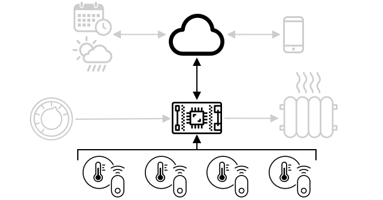

<!--
CO_OP_TRANSLATOR_METADATA:
{
  "original_hash": "71b5040e0b3472f1c0949c9b55f224c0",
  "translation_date": "2025-08-27T12:21:55+00:00",
  "source_file": "1-getting-started/lessons/4-connect-internet/README.md",
  "language_code": "bn"
}
-->
# আপনার ডিভাইসকে ইন্টারনেটের সাথে সংযুক্ত করুন


> স্কেচনোট: [নিত্য নারাসিমহান](https://github.com/nitya)। বড় সংস্করণের জন্য ছবিতে ক্লিক করুন।

এই পাঠটি [Hello IoT সিরিজ](https://youtube.com/playlist?list=PLmsFUfdnGr3xRts0TIwyaHyQuHaNQcb6-) এর অংশ হিসেবে [Microsoft Reactor](https://developer.microsoft.com/reactor/?WT.mc_id=academic-17441-jabenn) থেকে শেখানো হয়েছিল। এটি দুটি ভিডিওতে শেখানো হয়েছিল - একটি ১ ঘণ্টার পাঠ এবং একটি ১ ঘণ্টার অফিস আওয়ার যেখানে পাঠের অংশগুলো আরও গভীরভাবে আলোচনা করা হয় এবং প্রশ্নের উত্তর দেওয়া হয়।

[](https://youtu.be/O4dd172mZhs)

[](https://youtu.be/j-cVCzRDE2Q)

> 🎥 উপরের ছবিগুলোতে ক্লিক করে ভিডিওগুলো দেখুন

## প্রাক-পাঠ কুইজ

[প্রাক-পাঠ কুইজ](https://black-meadow-040d15503.1.azurestaticapps.net/quiz/7)

## পরিচিতি

IoT-এ **I** মানে **ইন্টারনেট** - ক্লাউড সংযোগ এবং পরিষেবাগুলো যা IoT ডিভাইসের অনেক বৈশিষ্ট্য সক্ষম করে, যেমন ডিভাইসের সাথে সংযুক্ত সেন্সর থেকে পরিমাপ সংগ্রহ করা, বা অ্যাকচুয়েটর নিয়ন্ত্রণের জন্য বার্তা পাঠানো। IoT ডিভাইস সাধারণত একটি স্ট্যান্ডার্ড যোগাযোগ প্রোটোকলের মাধ্যমে একটি একক ক্লাউড IoT পরিষেবার সাথে সংযুক্ত হয়, এবং সেই পরিষেবাটি আপনার IoT অ্যাপ্লিকেশনের অন্যান্য অংশের সাথে সংযুক্ত থাকে, যেমন AI পরিষেবা যা আপনার ডেটা সম্পর্কে স্মার্ট সিদ্ধান্ত নিতে পারে, বা নিয়ন্ত্রণ বা রিপোর্টিংয়ের জন্য ওয়েব অ্যাপ।

> 🎓 সেন্সর থেকে সংগ্রহ করা এবং ক্লাউডে পাঠানো ডেটাকে টেলিমেট্রি বলা হয়।

IoT ডিভাইস ক্লাউড থেকে বার্তা গ্রহণ করতে পারে। প্রায়শই এই বার্তাগুলোতে কমান্ড থাকে - অর্থাৎ, একটি অ্যাকশন সম্পাদন করার নির্দেশনা, হয় অভ্যন্তরীণভাবে (যেমন রিবুট বা ফার্মওয়্যার আপডেট), অথবা একটি অ্যাকচুয়েটর ব্যবহার করে (যেমন একটি আলো চালু করা)।

এই পাঠে IoT ডিভাইসগুলো ক্লাউডের সাথে সংযোগ করতে যে যোগাযোগ প্রোটোকলগুলো ব্যবহার করতে পারে এবং তারা যে ধরনের ডেটা পাঠাতে বা গ্রহণ করতে পারে তা পরিচিত করা হয়েছে। আপনি এগুলো হাতে-কলমে শিখবেন, আপনার নাইটলাইটে ইন্টারনেট নিয়ন্ত্রণ যোগ করবেন এবং LED নিয়ন্ত্রণের লজিক 'সার্ভার' কোডে স্থানান্তর করবেন যা স্থানীয়ভাবে চলবে।

এই পাঠে আমরা আলোচনা করব:

* [যোগাযোগ প্রোটোকল](../../../../../1-getting-started/lessons/4-connect-internet)
* [মেসেজ কিউইং টেলিমেট্রি ট্রান্সপোর্ট (MQTT)](../../../../../1-getting-started/lessons/4-connect-internet)
* [টেলিমেট্রি](../../../../../1-getting-started/lessons/4-connect-internet)
* [কমান্ড](../../../../../1-getting-started/lessons/4-connect-internet)

## যোগাযোগ প্রোটোকল

IoT ডিভাইসগুলো ইন্টারনেটের সাথে যোগাযোগ করতে যে জনপ্রিয় প্রোটোকলগুলো ব্যবহার করে তার মধ্যে কয়েকটি রয়েছে। সবচেয়ে জনপ্রিয় প্রোটোকলগুলো সাধারণত প্রকাশ/সাবস্ক্রাইব মেসেজিংয়ের উপর ভিত্তি করে তৈরি হয়, যেখানে একটি ব্রোকার ব্যবহৃত হয়। IoT ডিভাইসগুলো ব্রোকারের সাথে সংযুক্ত হয় এবং টেলিমেট্রি প্রকাশ করে এবং কমান্ড সাবস্ক্রাইব করে। ক্লাউড পরিষেবাগুলোও ব্রোকারের সাথে সংযুক্ত হয় এবং সমস্ত টেলিমেট্রি বার্তা সাবস্ক্রাইব করে এবং নির্দিষ্ট ডিভাইস বা ডিভাইসের গ্রুপে কমান্ড প্রকাশ করে।


MQTT IoT ডিভাইসের জন্য সবচেয়ে জনপ্রিয় যোগাযোগ প্রোটোকল এবং এটি এই পাঠে আলোচনা করা হয়েছে। অন্যান্য প্রোটোকলের মধ্যে রয়েছে AMQP এবং HTTP/HTTPS।

## মেসেজ কিউইং টেলিমেট্রি ট্রান্সপোর্ট (MQTT)

[MQTT](http://mqtt.org) একটি হালকা, ওপেন স্ট্যান্ডার্ড মেসেজিং প্রোটোকল যা ডিভাইসগুলোর মধ্যে বার্তা পাঠাতে পারে। এটি ১৯৯৯ সালে তেল পাইপলাইন পর্যবেক্ষণের জন্য ডিজাইন করা হয়েছিল এবং ১৫ বছর পরে IBM দ্বারা একটি ওপেন স্ট্যান্ডার্ড হিসেবে প্রকাশিত হয়।

MQTT-তে একটি একক ব্রোকার এবং একাধিক ক্লায়েন্ট থাকে। সমস্ত ক্লায়েন্ট ব্রোকারের সাথে সংযুক্ত হয় এবং ব্রোকার বার্তাগুলো প্রাসঙ্গিক ক্লায়েন্টদের কাছে রুট করে। বার্তাগুলো নামকৃত টপিক ব্যবহার করে রুট করা হয়, সরাসরি একটি নির্দিষ্ট ক্লায়েন্টে পাঠানো হয় না। একটি ক্লায়েন্ট একটি টপিকে বার্তা প্রকাশ করতে পারে, এবং যে কোনো ক্লায়েন্ট সেই টপিক সাবস্ক্রাইব করলে বার্তাটি গ্রহণ করবে।


✅ কিছু গবেষণা করুন। যদি আপনার অনেক IoT ডিভাইস থাকে, তাহলে কীভাবে নিশ্চিত করবেন যে আপনার MQTT ব্রোকার সমস্ত বার্তা পরিচালনা করতে পারে?

### আপনার IoT ডিভাইসকে MQTT-তে সংযুক্ত করুন

আপনার নাইটলাইটে ইন্টারনেট নিয়ন্ত্রণ যোগ করার প্রথম ধাপ হলো এটিকে একটি MQTT ব্রোকারের সাথে সংযুক্ত করা।

#### কাজ

আপনার ডিভাইসকে একটি MQTT ব্রোকারের সাথে সংযুক্ত করুন।

এই পাঠের এই অংশে, আপনি আপনার IoT নাইটলাইটকে ইন্টারনেটের সাথে সংযুক্ত করবেন যাতে এটি দূরবর্তীভাবে নিয়ন্ত্রিত হতে পারে। এই পাঠের পরে, আপনার IoT ডিভাইস একটি পাবলিক MQTT ব্রোকারে আলো স্তরের একটি টেলিমেট্রি বার্তা পাঠাবে, যেখানে এটি আপনার লেখা কিছু সার্ভার কোড দ্বারা গ্রহণ করা হবে। এই কোড আলো স্তর পরীক্ষা করবে এবং ডিভাইসটিকে LED চালু বা বন্ধ করার নির্দেশ দিয়ে একটি কমান্ড বার্তা পাঠাবে।

এই ধরনের সেটআপের একটি বাস্তব ব্যবহার হতে পারে একাধিক আলো সেন্সর থেকে ডেটা সংগ্রহ করা এবং তারপর আলো চালু করার সিদ্ধান্ত নেওয়া, এমন একটি স্থানে যেখানে অনেক আলো রয়েছে, যেমন একটি স্টেডিয়াম। এটি আলো চালু হওয়া বন্ধ করতে পারে যদি শুধুমাত্র একটি সেন্সর মেঘ বা একটি পাখি দ্বারা ঢেকে যায়, কিন্তু অন্যান্য সেন্সর যথেষ্ট আলো সনাক্ত করে।

✅ আর কী কী পরিস্থিতিতে একাধিক সেন্সর থেকে ডেটা মূল্যায়ন করা প্রয়োজন হতে পারে কমান্ড পাঠানোর আগে?

এই অ্যাসাইনমেন্টের অংশ হিসেবে একটি MQTT ব্রোকার সেটআপ করার জটিলতা এড়ানোর জন্য, আপনি একটি পাবলিক টেস্ট সার্ভার ব্যবহার করতে পারেন যা [Eclipse Mosquitto](https://www.mosquitto.org), একটি ওপেন-সোর্স MQTT ব্রোকার চালায়। এই টেস্ট ব্রোকারটি [test.mosquitto.org](https://test.mosquitto.org)-এ পাবলিকভাবে উপলব্ধ এবং একটি অ্যাকাউন্ট সেটআপ করার প্রয়োজন হয় না, যা MQTT ক্লায়েন্ট এবং সার্ভার পরীক্ষা করার জন্য একটি চমৎকার টুল।

> 💁 এই টেস্ট ব্রোকারটি পাবলিক এবং নিরাপদ নয়। আপনি যা প্রকাশ করেন তা যে কেউ শুনতে পারে, তাই এটি এমন কোনো ডেটার জন্য ব্যবহার করা উচিত নয় যা গোপন রাখতে হবে।


MQTT ব্রোকারের সাথে আপনার ডিভাইস সংযুক্ত করতে নিচের প্রাসঙ্গিক ধাপ অনুসরণ করুন:

* [Arduino - Wio Terminal](wio-terminal-mqtt.md)
* [Single-board computer - Raspberry Pi/Virtual IoT device](single-board-computer-mqtt.md)

### MQTT সম্পর্কে আরও গভীরভাবে জানুন

টপিকগুলোতে একটি হায়ারার্কি থাকতে পারে, এবং ক্লায়েন্টরা ওয়াইল্ডকার্ড ব্যবহার করে হায়ারার্কির বিভিন্ন স্তরে সাবস্ক্রাইব করতে পারে। উদাহরণস্বরূপ, আপনি `/telemetry/temperature` টপিকে তাপমাত্রার টেলিমেট্রি বার্তা এবং `/telemetry/humidity` টপিকে আর্দ্রতার বার্তা পাঠাতে পারেন, তারপর আপনার ক্লাউড অ্যাপে `/telemetry/*` টপিকে সাবস্ক্রাইব করতে পারেন যাতে তাপমাত্রা এবং আর্দ্রতার টেলিমেট্রি বার্তা উভয়ই গ্রহণ করা যায়।

বার্তাগুলো একটি কোয়ালিটি অফ সার্ভিস (QoS) দিয়ে পাঠানো যেতে পারে, যা বার্তা গ্রহণের গ্যারান্টি নির্ধারণ করে।

* একবারের বেশি নয় - বার্তাটি শুধুমাত্র একবার পাঠানো হয় এবং ক্লায়েন্ট এবং ব্রোকার ডেলিভারি নিশ্চিত করতে কোনো অতিরিক্ত পদক্ষেপ নেয় না (ফায়ার অ্যান্ড ফরগেট)।
* অন্তত একবার - বার্তাটি প্রেরকের দ্বারা একাধিকবার পুনরায় চেষ্টা করা হয় যতক্ষণ না স্বীকৃতি পাওয়া যায় (স্বীকৃত ডেলিভারি)।
* একবারই - প্রেরক এবং গ্রহণকারী একটি দুই-স্তরের হ্যান্ডশেকে যুক্ত হয় যাতে বার্তাটি শুধুমাত্র একবার গ্রহণ করা হয় (নিশ্চিত ডেলিভারি)।

✅ কোন পরিস্থিতিতে নিশ্চিত ডেলিভারি বার্তা প্রয়োজন হতে পারে, যেখানে ফায়ার অ্যান্ড ফরগেট বার্তা যথেষ্ট নয়?

যদিও নামটি মেসেজ কিউইং (MQTT-এর আদ্যক্ষর), এটি আসলে মেসেজ কিউ সমর্থন করে না। এর মানে হলো, যদি একটি ক্লায়েন্ট সংযোগ বিচ্ছিন্ন হয় এবং তারপর পুনরায় সংযুক্ত হয়, এটি সংযোগ বিচ্ছিন্ন হওয়ার সময় পাঠানো বার্তাগুলো গ্রহণ করবে না, শুধুমাত্র সেই বার্তাগুলো গ্রহণ করবে যা এটি ইতিমধ্যে QoS প্রক্রিয়া ব্যবহার করে প্রক্রিয়া করতে শুরু করেছে। বার্তাগুলোতে একটি রিটেইনড ফ্ল্যাগ সেট করা যেতে পারে। যদি এটি সেট করা হয়, MQTT ব্রোকার টপিকে পাঠানো সর্বশেষ বার্তাটি এই ফ্ল্যাগ দিয়ে সংরক্ষণ করবে এবং পরে টপিকে সাবস্ক্রাইব করা কোনো ক্লায়েন্টকে এটি পাঠাবে। এইভাবে, ক্লায়েন্টরা সর্বদা সর্বশেষ বার্তা পাবে।

MQTT একটি কিপ অ্যালাইভ ফাংশনও সমর্থন করে যা বার্তাগুলোর মধ্যে দীর্ঘ ব্যবধানের সময় সংযোগটি এখনও জীবিত কিনা তা পরীক্ষা করে।

> 🦟 [Eclipse Foundation থেকে Mosquitto](https://mosquitto.org) একটি ফ্রি MQTT ব্রোকার সরবরাহ করে যা আপনি নিজে চালাতে পারেন MQTT নিয়ে পরীক্ষা করার জন্য, এবং একটি পাবলিক MQTT ব্রোকার সরবরাহ করে যা আপনি আপনার কোড পরীক্ষা করার জন্য ব্যবহার করতে পারেন, যা [test.mosquitto.org](https://test.mosquitto.org)-এ হোস্ট করা হয়েছে।

MQTT সংযোগগুলো পাবলিক এবং ওপেন হতে পারে, অথবা ইউজারনেম এবং পাসওয়ার্ড, অথবা সার্টিফিকেট ব্যবহার করে এনক্রিপ্ট এবং সুরক্ষিত হতে পারে।

> 💁 MQTT TCP/IP-এর মাধ্যমে যোগাযোগ করে, যা HTTP-এর মতো একই নেটওয়ার্ক প্রোটোকল, কিন্তু একটি ভিন্ন পোর্টে। আপনি MQTT ওয়েবসকেটের মাধ্যমে ব্যবহার করতে পারেন ওয়েব অ্যাপের সাথে যোগাযোগ করতে যা ব্রাউজারে চলছে, অথবা এমন পরিস্থিতিতে যেখানে ফায়ারওয়াল বা অন্যান্য নেটওয়ার্কিং নিয়ম স্ট্যান্ডার্ড MQTT সংযোগগুলো ব্লক করে।

## টেলিমেট্রি

টেলিমেট্রি শব্দটি গ্রিক শব্দ থেকে উদ্ভূত, যার অর্থ দূর থেকে পরিমাপ করা। টেলিমেট্রি হলো সেন্সর থেকে ডেটা সংগ্রহ করা এবং ক্লাউডে পাঠানোর কাজ।

> 💁 প্রথম দিকের টেলিমেট্রি ডিভাইসগুলোর একটি ১৮৭৪ সালে ফ্রান্সে আবিষ্কৃত হয়েছিল এবং এটি মন্ট ব্ল্যাঙ্ক থেকে প্যারিসে রিয়েল-টাইম আবহাওয়া এবং তুষার গভীরতার তথ্য পাঠাত। এটি শারীরিক তার ব্যবহার করত কারণ তখন ওয়্যারলেস প্রযুক্তি উপলব্ধ ছিল না।

Lesson 1-এর স্মার্ট থার্মোস্ট্যাটের উদাহরণে ফিরে আসা যাক।



থার্মোস্ট্যাটে টেলিমেট্রি সংগ্রহ করার জন্য তাপমাত্রা সেন্সর রয়েছে। এটি সম্ভবত একটি তাপমাত্রা সেন্সর অন্তর্নির্মিত থাকবে, এবং এটি [Bluetooth Low Energy](https://wikipedia.org/wiki/Bluetooth_Low_Energy) (BLE)-এর মতো একটি ওয়্যারলেস প্রোটোকলের মাধ্যমে একাধিক বাহ্যিক তাপমাত্রা সেন্সরের সাথে সংযুক্ত হতে পারে।

এটি যে টেলিমেট্রি ডেটা পাঠাতে পারে তার একটি উদাহরণ হতে পারে:

| নাম | মান | বিবরণ |
| ---- | ----- | ----------- |
| `thermostat_temperature` | ১৮°C | থার্মোস্ট্যাটের অন্তর্নির্মিত তাপমাত্রা সেন্সর দ্বারা পরিমাপ করা তাপমাত্রা |
| `livingroom_temperature` | ১৯°C | একটি দূরবর্তী তাপমাত্রা সেন্সর দ্বারা পরিমাপ করা তাপমাত্রা, যা `livingroom` নামে চিহ্নিত করা হয়েছে এটি যে ঘরে রয়েছে তা সনাক্ত করতে |
| `bedroom_temperature` | ২১°C | একটি দূরবর্তী তাপমাত্রা সেন্সর দ্বারা পরিমাপ করা তাপমাত্রা, যা `bedroom` নামে চিহ্নিত করা হয়েছে এটি যে ঘরে রয়েছে তা সনাক্ত করতে |

ক্লাউড পরিষেবাটি এই টেলিমেট্রি ডেটা ব্যবহার করে গরম করার নিয়ন্ত্রণে কী কমান্ড পাঠাতে হবে তা নিয়ে সিদ্ধান্ত নিতে পারে।

### আপনার IoT ডিভাইস থেকে টেলিমেট্রি পাঠান

আপনার নাইটলাইটে ইন্টারনেট নিয়ন্ত্রণ যোগ করার পরবর্তী অংশ হলো আলো স্তরের টেলিমেট্রি MQTT ব্রোকারে একটি টেলিমেট্রি টপিকে পাঠানো।

#### কাজ - আপনার IoT ডিভাইস থেকে টেলিমেট্রি পাঠান

আলো স্তরের টেলিমেট্রি MQTT ব্রোকারে পাঠান।

ডেটা JSON-এ এনকোড করা হয় - JavaScript Object Notation-এর সংক্ষিপ্ত রূপ, একটি স্ট্যান্ডার্ড যা কী/মান জোড়া ব্যবহার করে টেক্সটে ডেটা এনকোড করে।

✅ যদি আপনি আগে JSON সম্পর্কে না জানেন, তাহলে [JSON.org ডকুমেন্টেশন](https://www.json.org/) থেকে আরও জানতে পারেন।

আপনার ডিভাইস থেকে MQTT ব্রোকারে টেলিমেট্রি পাঠানোর জন্য নিচের প্রাসঙ্গিক ধাপ অনুসরণ করুন:

* [Arduino - Wio Terminal](wio-terminal-telemetry.md)
* [Single-board computer - Raspberry Pi/Virtual IoT device](single-board-computer-telemetry.md)

### MQTT ব্রোকার থেকে টেলিমেট্রি গ্রহণ করুন

টেলিমেট্রি পাঠানোর কোনো মানে হয় না যদি অন্য প্রান্তে এটি শোনার মতো কিছু না থাকে। আলো স্তরের টেলিমেট্রি প্রক্রিয়া করার জন্য কিছু শোনার প্রয়োজন। এই 'সার্ভার' কোডটি এমন কোড যা আপনি একটি বড় IoT অ্যাপ্লিকেশনের অংশ হিসেবে একটি ক্লাউড পরিষেবায় স্থাপন করবেন, কিন্তু এখানে আপনি এই কোডটি আপনার কম্পিউটারে (অথবা আপনার Pi-তে যদি আপনি সরাসরি সেখানে কোড করছেন) স্থানীয়ভাবে চালাবেন। সার্ভার কোডটি একটি Python অ্যাপ নিয়ে গঠিত যা আলো স্তরের MQTT টেলিমেট্রি বার্তা শোনে। এই পাঠের পরে আপনি এটি LED চালু বা বন্ধ করার নির্দেশ দিয়ে একটি কমান্ড বার্তা পাঠাতে তৈরি করবেন।

✅ কিছু গবেষণা করুন: যদি কোনো শ্রোতা না থাকে তাহলে MQTT বার্তাগুলোর কী হয়?

#### Python এবং VS Code ইনস্টল করুন

যদি আপনার কম্পিউটারে Python এবং VS Code ইনস্টল না থাকে, তাহলে সার্ভার কোড লেখার জন্য আপনাকে উভয়ই ইনস্টল করতে হবে। যদি আপনি একটি ভার্চুয়াল IoT ডিভাইস ব্যবহার করছেন, অথবা আপনার Raspberry Pi-তে কাজ করছেন, তাহলে আপনি এই ধাপটি এড়িয়ে যেতে পারেন কারণ এটি ইতিমধ্যেই ইনস্টল এবং কনফিগার করা আছে।

##### কাজ - Python এবং VS Code ইনস্টল করুন

Python এবং VS Code ইনস্টল করুন।

1. Python ইনস্টল করুন। Python-এর সর্বশেষ সংস্করণ ইনস্টল করার জন্য [Python ডাউনলোড পৃষ্ঠা](https://www.python.org/downloads/) দেখুন।

1. Visual Studio Code (VS Code) ইনস্টল করুন। এটি সেই এডিটর যা আপনি Python-এ আপনার ভার্চুয়াল ডিভাইস কোড লেখার জন্য ব্যবহার করবেন। VS Code ইনস্টল করার জন্য [VS Code ডকুমেন্টেশন](https://code.visualstudio.com?WT.mc_id=academic-17441-jabenn)
💁 আপনি যদি পছন্দের কোনো Python IDE বা এডিটর ব্যবহার করতে চান, তাহলে এই পাঠগুলোতে তা করতে পারেন। তবে, পাঠগুলোতে VS Code ব্যবহার করার নির্দেশনা দেওয়া হবে।
1. VS Code-এ Pylance এক্সটেনশন ইনস্টল করুন। এটি VS Code-এর জন্য একটি এক্সটেনশন যা পাইথন ভাষার জন্য সাপোর্ট প্রদান করে। এই এক্সটেনশনটি VS Code-এ কীভাবে ইনস্টল করবেন তা জানতে [Pylance এক্সটেনশনের ডকুমেন্টেশন](https://marketplace.visualstudio.com/items?WT.mc_id=academic-17441-jabenn&itemName=ms-python.vscode-pylance) দেখুন।

#### পাইথন ভার্চুয়াল এনভায়রনমেন্ট কনফিগার করুন

পাইথনের একটি শক্তিশালী বৈশিষ্ট্য হলো [pip প্যাকেজ](https://pypi.org) ইনস্টল করার ক্ষমতা - এগুলো হলো ইন্টারনেটে প্রকাশিত অন্যদের লেখা কোডের প্যাকেজ। আপনি একটি কমান্ড ব্যবহার করে আপনার কম্পিউটারে একটি pip প্যাকেজ ইনস্টল করতে পারেন এবং তারপর সেই প্যাকেজটি আপনার কোডে ব্যবহার করতে পারেন। আপনি MQTT-এর মাধ্যমে যোগাযোগ করার জন্য একটি প্যাকেজ ইনস্টল করতে pip ব্যবহার করবেন।

ডিফল্টভাবে, যখন আপনি একটি প্যাকেজ ইনস্টল করেন, এটি আপনার কম্পিউটারের সর্বত্র উপলব্ধ হয়। এটি প্যাকেজ ভার্সনের সমস্যার কারণ হতে পারে - যেমন একটি অ্যাপ্লিকেশন একটি নির্দিষ্ট ভার্সনের উপর নির্ভর করে, যা অন্য অ্যাপ্লিকেশনের জন্য নতুন ভার্সন ইনস্টল করার সময় কাজ করা বন্ধ করে দিতে পারে। এই সমস্যার সমাধান করতে, আপনি একটি [পাইথন ভার্চুয়াল এনভায়রনমেন্ট](https://docs.python.org/3/library/venv.html) ব্যবহার করতে পারেন, যা মূলত একটি নির্দিষ্ট ফোল্ডারে পাইথনের একটি কপি। যখন আপনি pip প্যাকেজ ইনস্টল করবেন, সেগুলো কেবল সেই ফোল্ডারেই ইনস্টল হবে।

##### কাজ - পাইথন ভার্চুয়াল এনভায়রনমেন্ট কনফিগার করুন

পাইথন ভার্চুয়াল এনভায়রনমেন্ট কনফিগার করুন এবং MQTT pip প্যাকেজ ইনস্টল করুন।

1. আপনার টার্মিনাল বা কমান্ড লাইনে, একটি নতুন ডিরেক্টরি তৈরি এবং সেখানে নেভিগেট করতে নিচের কমান্ডটি চালান:

    ```sh
    mkdir nightlight-server
    cd nightlight-server
    ```

1. `.venv` ফোল্ডারে একটি ভার্চুয়াল এনভায়রনমেন্ট তৈরি করতে নিচের কমান্ডটি চালান:

    ```sh
    python3 -m venv .venv
    ```

    > 💁 ভার্চুয়াল এনভায়রনমেন্ট তৈরি করতে আপনাকে স্পষ্টভাবে `python3` কল করতে হবে, যদি আপনার কম্পিউটারে পাইথন 2 ইনস্টল করা থাকে। পাইথন 2 ইনস্টল থাকলে `python` কল করলে এটি পাইথন 2 ব্যবহার করবে, পাইথন 3 নয়।

1. ভার্চুয়াল এনভায়রনমেন্ট অ্যাক্টিভেট করুন:

    * Windows-এ:
        * যদি আপনি Command Prompt বা Windows Terminal-এর মাধ্যমে Command Prompt ব্যবহার করেন, তাহলে চালান:

            ```cmd
            .venv\Scripts\activate.bat
            ```

        * যদি আপনি PowerShell ব্যবহার করেন, তাহলে চালান:

            ```powershell
            .\.venv\Scripts\Activate.ps1
            ```

    * macOS বা Linux-এ চালান:

        ```cmd
        source ./.venv/bin/activate
        ```

    > 💁 এই কমান্ডগুলো সেই একই লোকেশন থেকে চালানো উচিত যেখানে আপনি ভার্চুয়াল এনভায়রনমেন্ট তৈরি করার কমান্ড চালিয়েছিলেন। `.venv` ফোল্ডারে কখনো নেভিগেট করার প্রয়োজন নেই। ভার্চুয়াল এনভায়রনমেন্ট অ্যাক্টিভেট করার কমান্ড এবং প্যাকেজ ইনস্টল বা কোড চালানোর কমান্ড সবসময় সেই ফোল্ডার থেকেই চালান যেখানে আপনি ভার্চুয়াল এনভায়রনমেন্ট তৈরি করেছিলেন।

1. একবার ভার্চুয়াল এনভায়রনমেন্ট অ্যাক্টিভেট হয়ে গেলে, ডিফল্ট `python` কমান্ডটি সেই ভার্সন চালাবে যা ভার্চুয়াল এনভায়রনমেন্ট তৈরি করতে ব্যবহৃত হয়েছিল। ভার্সনটি পেতে নিচের কমান্ডটি চালান:

    ```sh
    python --version
    ```

    আউটপুটটি নিম্নলিখিতর মতো হবে:

    ```output
    (.venv) ➜  nightlight-server python --version
    Python 3.9.1
    ```

    > 💁 আপনার পাইথন ভার্সন ভিন্ন হতে পারে - যতক্ষণ এটি 3.6 বা তার বেশি ভার্সন, ততক্ষণ ঠিক আছে। যদি না হয়, এই ফোল্ডারটি মুছে ফেলুন, পাইথনের নতুন ভার্সন ইনস্টল করুন এবং আবার চেষ্টা করুন।

1. [Paho-MQTT](https://pypi.org/project/paho-mqtt/) প্যাকেজটি ইনস্টল করতে নিচের কমান্ডগুলো চালান, যা একটি জনপ্রিয় MQTT লাইব্রেরি।

    ```sh
    pip install paho-mqtt
    ```

    এই pip প্যাকেজটি কেবল ভার্চুয়াল এনভায়রনমেন্টে ইনস্টল হবে এবং এর বাইরে উপলব্ধ হবে না।

#### সার্ভার কোড লিখুন

এখন সার্ভার কোডটি পাইথনে লেখা যেতে পারে।

##### কাজ - সার্ভার কোড লিখুন

সার্ভার কোড লিখুন।

1. ভার্চুয়াল এনভায়রনমেন্টের ভিতরে একটি `app.py` নামক পাইথন ফাইল তৈরি করতে আপনার টার্মিনাল বা কমান্ড লাইনে নিচের কমান্ডটি চালান:

    * Windows-এ চালান:

        ```cmd
        type nul > app.py
        ```

    * macOS বা Linux-এ চালান:

        ```cmd
        touch app.py
        ```

1. বর্তমান ফোল্ডারটি VS Code-এ খুলুন:

    ```sh
    code .
    ```

1. যখন VS Code চালু হবে, এটি পাইথন ভার্চুয়াল এনভায়রনমেন্ট অ্যাক্টিভেট করবে। এটি নিচের স্ট্যাটাস বারে রিপোর্ট করা হবে:

    

1. যদি VS Code টার্মিনাল চালু থাকে যখন VS Code শুরু হয়, এটি টার্মিনালে ভার্চুয়াল এনভায়রনমেন্ট অ্যাক্টিভেট করবে না। সহজ উপায় হলো **Kill the active terminal instance** বোতামটি ব্যবহার করে টার্মিনালটি বন্ধ করা:

    

1. *Terminal -> New Terminal* নির্বাচন করে বা `` CTRL+` `` চাপ দিয়ে একটি নতুন VS Code টার্মিনাল চালু করুন। নতুন টার্মিনাল ভার্চুয়াল এনভায়রনমেন্ট লোড করবে, এবং এটি টার্মিনালে অ্যাক্টিভেট করার কল দেখাবে। প্রম্পটে ভার্চুয়াল এনভায়রনমেন্টের নাম (`.venv`) থাকবে:

    ```output
    ➜  nightlight-server source .venv/bin/activate
    (.venv) ➜  nightlight 
    ```

1. VS Code এক্সপ্লোরার থেকে `app.py` ফাইলটি খুলুন এবং নিচের কোডটি যোগ করুন:

    ```python
    import json
    import time
    
    import paho.mqtt.client as mqtt
    
    id = '<ID>'
    
    client_telemetry_topic = id + '/telemetry'
    client_name = id + 'nightlight_server'
    
    mqtt_client = mqtt.Client(client_name)
    mqtt_client.connect('test.mosquitto.org')
    
    mqtt_client.loop_start()
    
    def handle_telemetry(client, userdata, message):
        payload = json.loads(message.payload.decode())
        print("Message received:", payload)
    
    mqtt_client.subscribe(client_telemetry_topic)
    mqtt_client.on_message = handle_telemetry
    
    while True:
        time.sleep(2)
    ```

    লাইনের 6-এ `<ID>`-এর জায়গায় আপনার ডিভাইস কোড তৈরি করার সময় ব্যবহৃত ইউনিক আইডি বসান।

    ⚠️ এটি **অবশ্যই** সেই একই আইডি হতে হবে যা আপনি আপনার ডিভাইসে ব্যবহার করেছিলেন, নাহলে সার্ভার কোডটি সঠিক টপিকে সাবস্ক্রাইব বা পাবলিশ করবে না।

    এই কোডটি একটি ইউনিক নাম সহ একটি MQTT ক্লায়েন্ট তৈরি করে এবং *test.mosquitto.org* ব্রোকারে সংযোগ করে। তারপর এটি একটি প্রসেসিং লুপ শুরু করে যা ব্যাকগ্রাউন্ড থ্রেডে চালায় এবং সাবস্ক্রাইব করা টপিকগুলোতে বার্তা শোনে।

    ক্লায়েন্টটি টেলিমেট্রি টপিকে বার্তা সাবস্ক্রাইব করে এবং একটি ফাংশন সংজ্ঞায়িত করে যা বার্তা পাওয়া গেলে কল হয়। যখন একটি টেলিমেট্রি বার্তা পাওয়া যায়, তখন `handle_telemetry` ফাংশনটি কল হয় এবং কনসোলে প্রাপ্ত বার্তাটি প্রিন্ট করে।

    অবশেষে একটি ইনফিনিট লুপ অ্যাপ্লিকেশনটি চালু রাখে। MQTT ক্লায়েন্টটি ব্যাকগ্রাউন্ড থ্রেডে বার্তা শোনে এবং প্রধান অ্যাপ্লিকেশন চালু থাকা অবস্থায় সবসময় চালু থাকে।

1. আপনার পাইথন অ্যাপ চালানোর জন্য VS Code টার্মিনাল থেকে নিচের কমান্ডটি চালান:

    ```sh
    python app.py
    ```

    অ্যাপটি IoT ডিভাইস থেকে বার্তা শোনার জন্য শুরু হবে।

1. নিশ্চিত করুন যে আপনার ডিভাইস চালু আছে এবং টেলিমেট্রি বার্তা পাঠাচ্ছে। আপনার ফিজিক্যাল বা ভার্চুয়াল ডিভাইসের আলো স্তর পরিবর্তন করুন। প্রাপ্ত বার্তাগুলো টার্মিনালে প্রিন্ট হবে:

    ```output
    (.venv) ➜  nightlight-server python app.py
    Message received: {'light': 0}
    Message received: {'light': 400}
    ```

    nightlight ভার্চুয়াল এনভায়রনমেন্টে থাকা `app.py` ফাইলটি চালু থাকতে হবে যাতে nightlight-server ভার্চুয়াল এনভায়রনমেন্টে থাকা `app.py` ফাইলটি প্রেরিত বার্তাগুলো গ্রহণ করতে পারে।

> 💁 আপনি এই কোডটি [code-server/server](../../../../../1-getting-started/lessons/4-connect-internet/code-server/server) ফোল্ডারে খুঁজে পেতে পারেন।

### টেলিমেট্রি কতবার পাঠানো উচিত?

টেলিমেট্রি কতবার মাপা এবং পাঠানো উচিত তা একটি গুরুত্বপূর্ণ বিষয়। উত্তর হলো - এটি নির্ভর করে। যদি আপনি প্রায়ই মাপেন, তবে আপনি পরিবর্তনের প্রতি দ্রুত সাড়া দিতে পারবেন, কিন্তু এতে বেশি শক্তি, ব্যান্ডউইথ, ডেটা এবং ক্লাউড রিসোর্স প্রয়োজন হবে। আপনাকে যথেষ্ট পরিমাণে মাপতে হবে, কিন্তু খুব বেশি নয়।

---

## 🚀 চ্যালেঞ্জ

শেষ তিনটি পাঠে চ্যালেঞ্জ ছিল আপনার বাড়ি, স্কুল বা কর্মস্থলে যত IoT ডিভাইস আছে সেগুলোর তালিকা তৈরি করা এবং নির্ধারণ করা যে সেগুলো মাইক্রোকন্ট্রোলার বা সিঙ্গেল-বোর্ড কম্পিউটারের উপর ভিত্তি করে তৈরি কিনা, অথবা উভয়ের মিশ্রণ কিনা, এবং সেগুলো কোন সেন্সর এবং অ্যাকচুয়েটর ব্যবহার করছে তা চিন্তা করা।
এই ডিভাইসগুলোর জন্য, ভাবুন তারা কী ধরনের বার্তা পাঠাচ্ছে বা গ্রহণ করছে। তারা কী ধরনের টেলিমেট্রি পাঠাচ্ছে? তারা কী ধরনের বার্তা বা কমান্ড গ্রহণ করতে পারে? আপনি কি মনে করেন এগুলো নিরাপদ?

## লেকচার-পরবর্তী কুইজ

[লেকচার-পরবর্তী কুইজ](https://black-meadow-040d15503.1.azurestaticapps.net/quiz/8)

## পর্যালোচনা ও স্ব-অধ্যয়ন

MQTT সম্পর্কে আরও জানুন [MQTT Wikipedia পেজে](https://wikipedia.org/wiki/MQTT)।

নিজে একটি MQTT ব্রোকার চালানোর চেষ্টা করুন [Mosquitto](https://www.mosquitto.org) ব্যবহার করে এবং আপনার IoT ডিভাইস ও সার্ভার কোড থেকে এর সাথে সংযোগ স্থাপন করুন।

> 💁 টিপ - ডিফল্টভাবে Mosquitto অ্যানোনিমাস সংযোগ (অর্থাৎ, ব্যবহারকারীর নাম এবং পাসওয়ার্ড ছাড়া সংযোগ) অনুমোদন করে না এবং এটি যে কম্পিউটারে চলছে তার বাইরে থেকে সংযোগ অনুমোদন করে না।
> আপনি এটি একটি [`mosquitto.conf` কনফিগ ফাইল](https://www.mosquitto.org/man/mosquitto-conf-5.html) ব্যবহার করে ঠিক করতে পারেন, যেখানে নিম্নলিখিত থাকবে:
>
> ```sh
> listener 1883 0.0.0.0
> allow_anonymous true
> ```

## অ্যাসাইনমেন্ট

[MQTT এবং অন্যান্য যোগাযোগ প্রোটোকলের তুলনা ও পার্থক্য](assignment.md)

---

**অস্বীকৃতি**:  
এই নথিটি AI অনুবাদ পরিষেবা [Co-op Translator](https://github.com/Azure/co-op-translator) ব্যবহার করে অনুবাদ করা হয়েছে। আমরা যথাসম্ভব সঠিক অনুবাদ প্রদানের চেষ্টা করি, তবে অনুগ্রহ করে মনে রাখবেন যে স্বয়ংক্রিয় অনুবাদে ত্রুটি বা অসঙ্গতি থাকতে পারে। মূল ভাষায় থাকা নথিটিকে প্রামাণিক উৎস হিসেবে বিবেচনা করা উচিত। গুরুত্বপূর্ণ তথ্যের জন্য, পেশাদার মানব অনুবাদ সুপারিশ করা হয়। এই অনুবাদ ব্যবহারের ফলে কোনো ভুল বোঝাবুঝি বা ভুল ব্যাখ্যা হলে আমরা দায়বদ্ধ থাকব না।