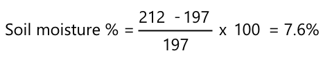

<!--
CO_OP_TRANSLATOR_METADATA:
{
  "original_hash": "506d21b544d5de47406c89ad496a21cd",
  "translation_date": "2025-08-27T11:48:06+00:00",
  "source_file": "2-farm/lessons/2-detect-soil-moisture/assignment.md",
  "language_code": "bn"
}
-->
# আপনার সেন্সর ক্যালিব্রেট করুন

## নির্দেশাবলী

এই পাঠে আপনি মাটির আর্দ্রতা সেন্সরের রিডিং সংগ্রহ করেছেন, যা 0-1023 এর মধ্যে মান হিসেবে পরিমাপ করা হয়। এগুলোকে প্রকৃত মাটির আর্দ্রতার রিডিংয়ে রূপান্তর করতে, আপনাকে আপনার সেন্সরটি ক্যালিব্রেট করতে হবে। এটি করার জন্য, মাটির নমুনা থেকে রিডিং নিন এবং তারপর এই নমুনাগুলোর থেকে গ্রাভিমেট্রিক মাটির আর্দ্রতা বিষয়বস্তু গণনা করুন।

প্রতিবার মাটির ভিন্ন ভিন্ন আর্দ্রতার সাথে এই ধাপগুলো একাধিকবার পুনরাবৃত্তি করতে হবে।

1. মাটির আর্দ্রতা সেন্সর ব্যবহার করে একটি মাটির আর্দ্রতার রিডিং নিন। এই রিডিংটি লিখে রাখুন।

1. মাটির একটি নমুনা নিন এবং এটি ওজন করুন। এই ওজনটি লিখে রাখুন।

1. মাটি শুকান - 110°C (230°F) তাপমাত্রার একটি উষ্ণ ওভেনে কয়েক ঘণ্টা ধরে শুকানো সবচেয়ে ভালো উপায়। আপনি এটি রোদে রাখতে পারেন, অথবা একটি উষ্ণ, শুকনো জায়গায় রাখতে পারেন যতক্ষণ না মাটি সম্পূর্ণ শুকিয়ে যায়। এটি গুঁড়ো এবং আলগা হওয়া উচিত।

    > 💁 ল্যাবে সবচেয়ে সঠিক ফলাফলের জন্য, মাটি 48-72 ঘণ্টা ধরে ওভেনে শুকানো উচিত। যদি আপনার স্কুলে শুকানোর ওভেন থাকে, তাহলে দেখুন আপনি এগুলো দীর্ঘ সময়ের জন্য ব্যবহার করতে পারেন কিনা। যত বেশি সময় শুকানো হবে, নমুনা তত বেশি শুকাবে এবং ফলাফল তত বেশি সঠিক হবে।

1. মাটির ওজন আবার মাপুন।

    > 🔥 যদি আপনি এটি ওভেনে শুকিয়ে থাকেন, নিশ্চিত করুন এটি প্রথমে ঠান্ডা হয়েছে!

গ্রাভিমেট্রিক মাটির আর্দ্রতা গণনা করার সূত্র হলো:

* W  
- ভেজা মাটির ওজন  
* W  
- শুকনো মাটির ওজন  

উদাহরণস্বরূপ, ধরুন আপনার কাছে একটি মাটির নমুনা আছে যার ভেজা ওজন 212g এবং শুকনো ওজন 197g।

* W = 212g  
* W = 197g  
* 212 - 197 = 15  
* 15 / 197 = 0.076  
* 0.076 * 100 = 7.6%  

এই উদাহরণে, মাটির গ্রাভিমেট্রিক আর্দ্রতা 7.6%।

যখন আপনি অন্তত ৩টি নমুনার রিডিং সংগ্রহ করবেন, তখন মাটির আর্দ্রতা % বনাম মাটির আর্দ্রতা সেন্সরের রিডিংয়ের একটি গ্রাফ আঁকুন এবং পয়েন্টগুলোর সাথে সেরা ফিটিং লাইন যোগ করুন। এরপর আপনি এই লাইন থেকে একটি নির্দিষ্ট সেন্সর রিডিংয়ের জন্য গ্রাভিমেট্রিক মাটির আর্দ্রতা বিষয়বস্তু গণনা করতে পারবেন।

## মূল্যায়ন সূচক

| মানদণ্ড | চমৎকার | পর্যাপ্ত | উন্নতির প্রয়োজন |
| -------- | --------- | -------- | ----------------- |
| ক্যালিব্রেশন ডেটা সংগ্রহ | অন্তত ৩টি ক্যালিব্রেশন নমুনা সংগ্রহ করুন | অন্তত ২টি ক্যালিব্রেশন নমুনা সংগ্রহ করুন | অন্তত ১টি ক্যালিব্রেশন নমুনা সংগ্রহ করুন |
| ক্যালিব্রেটেড রিডিং তৈরি | সফলভাবে ক্যালিব্রেশন গ্রাফ আঁকুন এবং সেন্সর থেকে একটি রিডিং নিন, এবং এটি গ্রাভিমেট্রিক মাটির আর্দ্রতা বিষয়বস্তুতে রূপান্তর করুন | সফলভাবে ক্যালিব্রেশন গ্রাফ আঁকুন | গ্রাফ আঁকতে অক্ষম |

---

**অস্বীকৃতি**:  
এই নথিটি AI অনুবাদ পরিষেবা [Co-op Translator](https://github.com/Azure/co-op-translator) ব্যবহার করে অনুবাদ করা হয়েছে। আমরা যথাসম্ভব সঠিকতার জন্য চেষ্টা করি, তবে অনুগ্রহ করে মনে রাখবেন যে স্বয়ংক্রিয় অনুবাদে ত্রুটি বা অসঙ্গতি থাকতে পারে। মূল ভাষায় থাকা নথিটিকে প্রামাণিক উৎস হিসেবে বিবেচনা করা উচিত। গুরুত্বপূর্ণ তথ্যের জন্য, পেশাদার মানব অনুবাদ সুপারিশ করা হয়। এই অনুবাদ ব্যবহারের ফলে কোনো ভুল বোঝাবুঝি বা ভুল ব্যাখ্যা হলে আমরা দায়বদ্ধ থাকব না।