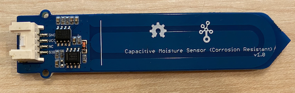

<!--
CO_OP_TRANSLATOR_METADATA:
{
  "original_hash": "9d4d00a47d5d0f3e6ce42c0d1020064a",
  "translation_date": "2025-08-27T11:50:50+00:00",
  "source_file": "2-farm/lessons/2-detect-soil-moisture/pi-soil-moisture.md",
  "language_code": "bn"
}
-->
# মাটির আর্দ্রতা পরিমাপ - র‌্যাস্পবেরি পাই

এই পাঠের এই অংশে, আপনি আপনার র‌্যাস্পবেরি পাই-তে একটি ক্যাপাসিটিভ মাটির আর্দ্রতা সেন্সর যোগ করবেন এবং এর থেকে মান পড়বেন।

## হার্ডওয়্যার

র‌্যাস্পবেরি পাই-এর জন্য একটি ক্যাপাসিটিভ মাটির আর্দ্রতা সেন্সর প্রয়োজন।

আপনার ব্যবহৃত সেন্সরটি একটি [Capacitive Soil Moisture Sensor](https://www.seeedstudio.com/Grove-Capacitive-Moisture-Sensor-Corrosion-Resistant.html), যা মাটির ক্যাপাসিট্যান্স সনাক্ত করে মাটির আর্দ্রতা পরিমাপ করে। মাটির আর্দ্রতা পরিবর্তনের সাথে সাথে এই বৈশিষ্ট্যটি পরিবর্তিত হয়। মাটির আর্দ্রতা বাড়লে ভোল্টেজ কমে যায়।

এটি একটি অ্যানালগ সেন্সর, যা একটি অ্যানালগ পিন ব্যবহার করে এবং পাই-এর Grove Base Hat-এ থাকা 10-বিট ADC ভোল্টেজকে 1-1,023 এর মধ্যে একটি ডিজিটাল সিগন্যালে রূপান্তর করে। এটি পরে GPIO পিনের মাধ্যমে পাই-তে পাঠানো হয়।

### মাটির আর্দ্রতা সেন্সর সংযুক্ত করুন

Grove মাটির আর্দ্রতা সেন্সরটি র‌্যাস্পবেরি পাই-এর সাথে সংযুক্ত করা যেতে পারে।

#### কাজ - মাটির আর্দ্রতা সেন্সর সংযুক্ত করুন

মাটির আর্দ্রতা সেন্সর সংযুক্ত করুন।



1. একটি Grove কেবলের এক প্রান্ত মাটির আর্দ্রতা সেন্সরের সকেটে প্রবেশ করান। এটি শুধুমাত্র একটি দিকেই প্রবেশ করবে।

1. র‌্যাস্পবেরি পাই বন্ধ অবস্থায়, Grove কেবলের অন্য প্রান্তটি পাই-তে সংযুক্ত Grove Base Hat-এর **A0** চিহ্নিত অ্যানালগ সকেটে সংযুক্ত করুন। এই সকেটটি GPIO পিনের পাশে থাকা সকেটের সারির ডান দিক থেকে দ্বিতীয়।


1. মাটিতে মাটির আর্দ্রতা সেন্সর প্রবেশ করান। এতে একটি 'সর্বোচ্চ অবস্থান লাইন' রয়েছে - সেন্সরের উপর একটি সাদা লাইন। এই লাইন পর্যন্ত সেন্সরটি প্রবেশ করান, তবে এর বাইরে নয়।


## মাটির আর্দ্রতা সেন্সর প্রোগ্রাম করুন

এখন র‌্যাস্পবেরি পাই-কে সংযুক্ত মাটির আর্দ্রতা সেন্সর ব্যবহার করার জন্য প্রোগ্রাম করা যেতে পারে।

### কাজ - মাটির আর্দ্রতা সেন্সর প্রোগ্রাম করুন

ডিভাইসটি প্রোগ্রাম করুন।

1. পাই চালু করুন এবং এটি বুট হওয়ার জন্য অপেক্ষা করুন।

1. VS Code চালু করুন, হয় সরাসরি পাই-তে, অথবা Remote SSH এক্সটেনশনের মাধ্যমে সংযোগ করুন।

    > ⚠️ [নাইটলাইট - পাঠ ১-এ VS Code সেটআপ এবং চালু করার নির্দেশাবলী প্রয়োজন হলে এখানে দেখুন](../../../1-getting-started/lessons/1-introduction-to-iot/pi.md)।

1. টার্মিনাল থেকে, `pi` ব্যবহারকারীর হোম ডিরেক্টরিতে `soil-moisture-sensor` নামে একটি নতুন ফোল্ডার তৈরি করুন। এই ফোল্ডারে `app.py` নামে একটি ফাইল তৈরি করুন।

1. এই ফোল্ডারটি VS Code-এ খুলুন।

1. `app.py` ফাইলে নিচের কোডটি যোগ করুন প্রয়োজনীয় লাইব্রেরি আমদানি করার জন্য:

    ```python
    import time
    from grove.adc import ADC
    ```

    `import time` স্টেটমেন্টটি `time` মডিউল আমদানি করে, যা এই অ্যাসাইনমেন্টে পরে ব্যবহৃত হবে।

    `from grove.adc import ADC` স্টেটমেন্টটি Grove Python লাইব্রেরি থেকে `ADC` আমদানি করে। এই লাইব্রেরিতে পাই বেস হ্যাটের অ্যানালগ-টু-ডিজিটাল কনভার্টারের সাথে ইন্টারঅ্যাক্ট করার এবং অ্যানালগ সেন্সর থেকে ভোল্টেজ পড়ার কোড রয়েছে।

1. এর নিচে নিচের কোডটি যোগ করুন `ADC` ক্লাসের একটি ইনস্ট্যান্স তৈরি করতে:

    ```python
    adc = ADC()
    ```

1. একটি ইনফিনিট লুপ যোগ করুন যা A0 পিনে থাকা এই ADC থেকে পড়বে এবং কনসোলে ফলাফল লিখবে। এই লুপটি প্রতিটি পড়ার মধ্যে ১০ সেকেন্ডের জন্য ঘুমাবে।

    ```python
    while True:
        soil_moisture = adc.read(0)
        print("Soil moisture:", soil_moisture)

        time.sleep(10)
    ```

1. পাইথন অ্যাপটি চালান। আপনি কনসোলে মাটির আর্দ্রতার পরিমাপ দেখতে পাবেন। মাটিতে পানি যোগ করুন, অথবা সেন্সরটি মাটি থেকে সরান এবং মান পরিবর্তন দেখুন।

    ```output
    pi@raspberrypi:~/soil-moisture-sensor $ python3 app.py 
    Soil moisture: 615
    Soil moisture: 612
    Soil moisture: 498
    Soil moisture: 493
    Soil moisture: 490
    Soil Moisture: 388
    ```

    উপরের উদাহরণ আউটপুটে, আপনি পানি যোগ করার সাথে সাথে ভোল্টেজ কমে যেতে দেখবেন।

> 💁 আপনি এই কোডটি [code/pi](../../../../../2-farm/lessons/2-detect-soil-moisture/code/pi) ফোল্ডারে খুঁজে পেতে পারেন।

😀 আপনার মাটির আর্দ্রতা সেন্সর প্রোগ্রাম সফল হয়েছে!

---

**অস্বীকৃতি**:  
এই নথিটি AI অনুবাদ পরিষেবা [Co-op Translator](https://github.com/Azure/co-op-translator) ব্যবহার করে অনুবাদ করা হয়েছে। আমরা যথাসম্ভব সঠিক অনুবাদ প্রদানের চেষ্টা করি, তবে অনুগ্রহ করে মনে রাখবেন যে স্বয়ংক্রিয় অনুবাদে ত্রুটি বা অসঙ্গতি থাকতে পারে। মূল ভাষায় থাকা নথিটিকে প্রামাণিক উৎস হিসেবে বিবেচনা করা উচিত। গুরুত্বপূর্ণ তথ্যের জন্য, পেশাদার মানব অনুবাদ সুপারিশ করা হয়। এই অনুবাদ ব্যবহারের ফলে কোনো ভুল বোঝাবুঝি বা ভুল ব্যাখ্যা হলে আমরা তার জন্য দায়ী থাকব না।