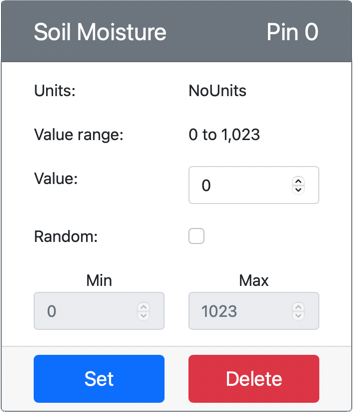

<!--
CO_OP_TRANSLATOR_METADATA:
{
  "original_hash": "2bf65f162bcebd35fbcba5fd245afac4",
  "translation_date": "2025-08-27T11:49:25+00:00",
  "source_file": "2-farm/lessons/2-detect-soil-moisture/virtual-device-soil-moisture.md",
  "language_code": "bn"
}
-->
# মাটির আর্দ্রতা পরিমাপ করুন - ভার্চুয়াল IoT হার্ডওয়্যার

এই পাঠের এই অংশে, আপনি আপনার ভার্চুয়াল IoT ডিভাইসে একটি ক্যাপাসিটিভ মাটির আর্দ্রতা সেন্সর যোগ করবেন এবং এর থেকে মান পড়বেন।

## ভার্চুয়াল হার্ডওয়্যার

ভার্চুয়াল IoT ডিভাইস একটি সিমুলেটেড Grove ক্যাপাসিটিভ মাটির আর্দ্রতা সেন্সর ব্যবহার করবে। এটি এই ল্যাবটিকে একটি Raspberry Pi এবং একটি বাস্তব Grove ক্যাপাসিটিভ মাটির আর্দ্রতা সেন্সরের সাথে ব্যবহারের মতোই রাখে।

একটি বাস্তব IoT ডিভাইসে, মাটির আর্দ্রতা সেন্সরটি একটি ক্যাপাসিটিভ সেন্সর হবে যা মাটির ক্যাপাসিট্যান্স সনাক্ত করে মাটির আর্দ্রতা পরিমাপ করে। মাটির আর্দ্রতা পরিবর্তনের সাথে সাথে এই বৈশিষ্ট্যটি পরিবর্তিত হয়। মাটির আর্দ্রতা বাড়ার সাথে সাথে ভোল্টেজ কমে যায়।

এটি একটি অ্যানালগ সেন্সর, তাই এটি ১০-বিট ADC ব্যবহার করে ১-১,০২৩ এর মধ্যে একটি মান রিপোর্ট করে।

### CounterFit-এ মাটির আর্দ্রতা সেন্সর যোগ করুন

একটি ভার্চুয়াল মাটির আর্দ্রতা সেন্সর ব্যবহার করতে, আপনাকে এটি CounterFit অ্যাপে যোগ করতে হবে।

#### কাজ - CounterFit-এ মাটির আর্দ্রতা সেন্সর যোগ করুন

CounterFit অ্যাপে মাটির আর্দ্রতা সেন্সর যোগ করুন।

1. আপনার কম্পিউটারে `soil-moisture-sensor` নামে একটি ফোল্ডারে একটি নতুন Python অ্যাপ তৈরি করুন, যেখানে একটি মাত্র ফাইল থাকবে `app.py` নামে এবং একটি Python ভার্চুয়াল এনভায়রনমেন্ট থাকবে। CounterFit pip প্যাকেজগুলো যোগ করুন।

    > ⚠️ প্রয়োজনে [পাঠ ১-এ CounterFit Python প্রকল্প তৈরি এবং সেটআপ করার নির্দেশাবলী](../../../1-getting-started/lessons/1-introduction-to-iot/virtual-device.md) দেখতে পারেন।

1. নিশ্চিত করুন যে CounterFit ওয়েব অ্যাপটি চালু রয়েছে।

1. একটি মাটির আর্দ্রতা সেন্সর তৈরি করুন:

    1. *Sensors* প্যানেলে *Create sensor* বক্সে যান, *Sensor type* ড্রপডাউন থেকে *Soil Moisture* নির্বাচন করুন।

    1. *Units* সেটিং *NoUnits* এ রাখুন।

    1. নিশ্চিত করুন যে *Pin* সেট করা আছে *0* এ।

    1. **Add** বোতামটি নির্বাচন করুন যাতে *Pin 0*-এ একটি *Soil Moisture* সেন্সর তৈরি হয়।

    

    মাটির আর্দ্রতা সেন্সরটি তৈরি হবে এবং সেন্সর তালিকায় প্রদর্শিত হবে।

    

## মাটির আর্দ্রতা সেন্সর অ্যাপ প্রোগ্রাম করুন

এখন CounterFit সেন্সর ব্যবহার করে মাটির আর্দ্রতা সেন্সর অ্যাপ প্রোগ্রাম করা যাবে।

### কাজ - মাটির আর্দ্রতা সেন্সর অ্যাপ প্রোগ্রাম করুন

মাটির আর্দ্রতা সেন্সর অ্যাপ প্রোগ্রাম করুন।

1. নিশ্চিত করুন যে `soil-moisture-sensor` অ্যাপটি VS Code-এ খোলা রয়েছে।

1. `app.py` ফাইলটি খুলুন।

1. CounterFit-এর সাথে অ্যাপটি সংযোগ করতে `app.py`-এর উপরে নিচের কোডটি যোগ করুন:

    ```python
    from counterfit_connection import CounterFitConnection
    CounterFitConnection.init('127.0.0.1', 5000)
    ```

1. প্রয়োজনীয় কিছু লাইব্রেরি ইমপোর্ট করতে `app.py` ফাইলে নিচের কোডটি যোগ করুন:

    ```python
    import time
    from counterfit_shims_grove.adc import ADC
    ```

    `import time` স্টেটমেন্টটি `time` মডিউল ইমপোর্ট করে যা এই অ্যাসাইনমেন্টে পরে ব্যবহৃত হবে।

    `from counterfit_shims_grove.adc import ADC` স্টেটমেন্টটি `ADC` ক্লাস ইমপোর্ট করে যা CounterFit সেন্সরের সাথে সংযুক্ত একটি ভার্চুয়াল অ্যানালগ টু ডিজিটাল কনভার্টারের সাথে ইন্টারঅ্যাক্ট করতে ব্যবহৃত হয়।

1. এর নিচে `ADC` ক্লাসের একটি ইনস্ট্যান্স তৈরি করতে নিচের কোডটি যোগ করুন:

    ```python
    adc = ADC()
    ```

1. একটি ইনফিনিট লুপ যোগ করুন যা পিন ০-এ এই ADC থেকে মান পড়বে এবং কনসোলে ফলাফল লিখবে। এই লুপটি প্রতিবার পড়ার মধ্যে ১০ সেকেন্ডের জন্য ঘুমাবে।

    ```python
    while True:
        soil_moisture = adc.read(0)
        print("Soil moisture:", soil_moisture)
    
        time.sleep(10)
    ```

1. CounterFit অ্যাপ থেকে মাটির আর্দ্রতা সেন্সরের মান পরিবর্তন করুন যা অ্যাপ দ্বারা পড়া হবে। এটি দুটি উপায়ে করা যেতে পারে:

    * মাটির আর্দ্রতা সেন্সরের জন্য *Value* বক্সে একটি সংখ্যা লিখুন, তারপর **Set** বোতামটি নির্বাচন করুন। আপনি যে সংখ্যা লিখবেন সেটি সেন্সর দ্বারা ফেরত দেওয়া মান হবে।

    * *Random* চেকবক্সটি চেক করুন এবং একটি *Min* এবং *Max* মান লিখুন, তারপর **Set** বোতামটি নির্বাচন করুন। প্রতিবার সেন্সর একটি মান পড়বে, এটি *Min* এবং *Max* এর মধ্যে একটি র্যান্ডম সংখ্যা পড়বে।

1. Python অ্যাপটি চালান। আপনি কনসোলে মাটির আর্দ্রতার পরিমাপ দেখতে পাবেন। *Value* বা *Random* সেটিংস পরিবর্তন করুন এবং মান পরিবর্তন হতে দেখুন।

    ```output
    (.venv) ➜ soil-moisture-sensor $ python app.py 
    Soil moisture: 615
    Soil moisture: 612
    Soil moisture: 498
    Soil moisture: 493
    Soil moisture: 490
    Soil Moisture: 388
    ```

> 💁 আপনি এই কোডটি [code/virtual-device](../../../../../2-farm/lessons/2-detect-soil-moisture/code/virtual-device) ফোল্ডারে খুঁজে পেতে পারেন।

😀 আপনার মাটির আর্দ্রতা সেন্সর প্রোগ্রাম সফল হয়েছে!

---

**অস্বীকৃতি**:  
এই নথিটি AI অনুবাদ পরিষেবা [Co-op Translator](https://github.com/Azure/co-op-translator) ব্যবহার করে অনুবাদ করা হয়েছে। আমরা যথাসম্ভব সঠিক অনুবাদ প্রদানের চেষ্টা করি, তবে অনুগ্রহ করে মনে রাখবেন যে স্বয়ংক্রিয় অনুবাদে ত্রুটি বা অসঙ্গতি থাকতে পারে। মূল ভাষায় থাকা নথিটিকে প্রামাণিক উৎস হিসেবে বিবেচনা করা উচিত। গুরুত্বপূর্ণ তথ্যের জন্য, পেশাদার মানব অনুবাদ সুপারিশ করা হয়। এই অনুবাদ ব্যবহারের ফলে কোনো ভুল বোঝাবুঝি বা ভুল ব্যাখ্যা হলে আমরা দায়বদ্ধ থাকব না।