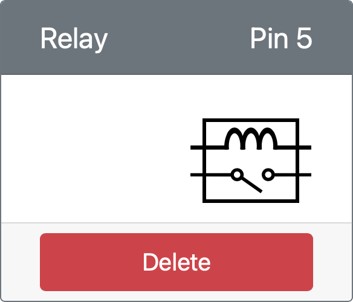

<!--
CO_OP_TRANSLATOR_METADATA:
{
  "original_hash": "f8f541ee945545017a51aaf309aa37c3",
  "translation_date": "2025-08-27T11:24:05+00:00",
  "source_file": "2-farm/lessons/3-automated-plant-watering/virtual-device-relay.md",
  "language_code": "bn"
}
-->
# রিলে নিয়ন্ত্রণ করুন - ভার্চুয়াল IoT হার্ডওয়্যার

এই পাঠের এই অংশে, আপনি মাটির আর্দ্রতা সেন্সরের পাশাপাশি আপনার ভার্চুয়াল IoT ডিভাইসে একটি রিলে যোগ করবেন এবং এটি মাটির আর্দ্রতার স্তরের উপর ভিত্তি করে নিয়ন্ত্রণ করবেন।

## ভার্চুয়াল হার্ডওয়্যার

ভার্চুয়াল IoT ডিভাইস একটি সিমুলেটেড Grove রিলে ব্যবহার করবে। এটি এই ল্যাবটিকে একটি ফিজিক্যাল Grove রিলে সহ Raspberry Pi ব্যবহার করার মতোই রাখে।

একটি ফিজিক্যাল IoT ডিভাইসে, রিলেটি সাধারণত একটি নরমালি-ওপেন রিলে হবে (অর্থাৎ, যখন রিলেতে কোনো সংকেত পাঠানো হয় না, তখন আউটপুট সার্কিট খোলা বা সংযুক্ত নয়)। এই ধরনের একটি রিলে 250V এবং 10A পর্যন্ত আউটপুট সার্কিট পরিচালনা করতে পারে।

### CounterFit-এ রিলে যোগ করুন

ভার্চুয়াল রিলে ব্যবহার করতে, আপনাকে এটি CounterFit অ্যাপে যোগ করতে হবে।

#### কাজ

CounterFit অ্যাপে রিলে যোগ করুন।

1. VS Code-এ আগের পাঠের `soil-moisture-sensor` প্রকল্পটি খুলুন যদি এটি ইতিমধ্যে খোলা না থাকে। আপনি এই প্রকল্পে যোগ করবেন।

1. নিশ্চিত করুন যে CounterFit ওয়েব অ্যাপটি চালু রয়েছে।

1. একটি রিলে তৈরি করুন:

    1. *Actuators* প্যানেলের *Create actuator* বাক্সে, *Actuator type* ড্রপডাউন থেকে *Relay* নির্বাচন করুন।

    1. *Pin*-কে *5* সেট করুন।

    1. **Add** বোতামটি নির্বাচন করুন যাতে পিন 5-এ রিলে তৈরি হয়।

    

    রিলে তৈরি হবে এবং অ্যাকচুয়েটর তালিকায় প্রদর্শিত হবে।

    

## রিলে প্রোগ্রাম করুন

এখন মাটির আর্দ্রতা সেন্সর অ্যাপটি ভার্চুয়াল রিলে ব্যবহার করার জন্য প্রোগ্রাম করা যেতে পারে।

### কাজ

ভার্চুয়াল ডিভাইস প্রোগ্রাম করুন।

1. VS Code-এ আগের পাঠের `soil-moisture-sensor` প্রকল্পটি খুলুন যদি এটি ইতিমধ্যে খোলা না থাকে। আপনি এই প্রকল্পে যোগ করবেন।

1. `app.py` ফাইলে বিদ্যমান ইমপোর্টগুলির নিচে নিম্নলিখিত কোড যোগ করুন:

    ```python
    from counterfit_shims_grove.grove_relay import GroveRelay
    ```

    এই স্টেটমেন্টটি Grove Python শিম লাইব্রেরি থেকে `GroveRelay` ইমপোর্ট করে ভার্চুয়াল Grove রিলের সাথে ইন্টারঅ্যাক্ট করার জন্য।

1. `ADC` ক্লাসের ঘোষণার নিচে নিম্নলিখিত কোড যোগ করুন একটি `GroveRelay` ইনস্ট্যান্স তৈরি করতে:

    ```python
    relay = GroveRelay(5)
    ```

    এটি একটি রিলে তৈরি করে পিন **5** ব্যবহার করে, যেখানে আপনি রিলেটি সংযুক্ত করেছেন।

1. রিলে কাজ করছে কিনা পরীক্ষা করতে, `while True:` লুপে নিম্নলিখিত কোড যোগ করুন:

    ```python
    relay.on()
    time.sleep(.5)
    relay.off()
    ```

    কোডটি রিলেকে চালু করে, 0.5 সেকেন্ড অপেক্ষা করে, তারপর রিলেকে বন্ধ করে।

1. Python অ্যাপ চালান। রিলে প্রতি 10 সেকেন্ডে চালু এবং বন্ধ হবে, চালু এবং বন্ধের মধ্যে অর্ধ সেকেন্ডের বিলম্ব থাকবে। আপনি CounterFit অ্যাপে ভার্চুয়াল রিলেকে চালু এবং বন্ধ হতে দেখবেন।

    

## মাটির আর্দ্রতা থেকে রিলে নিয়ন্ত্রণ করুন

এখন যেহেতু রিলেটি কাজ করছে, এটি মাটির আর্দ্রতার রিডিংয়ের প্রতিক্রিয়ায় নিয়ন্ত্রিত হতে পারে।

### কাজ

রিলেকে নিয়ন্ত্রণ করুন।

1. রিলে পরীক্ষা করার জন্য আপনি যে ৩টি লাইন কোড যোগ করেছিলেন তা মুছে ফেলুন। তাদের জায়গায় নিম্নলিখিত কোড যোগ করুন:

    ```python
    if soil_moisture > 450:
        print("Soil Moisture is too low, turning relay on.")
        relay.on()
    else:
        print("Soil Moisture is ok, turning relay off.")
        relay.off()
    ```

    এই কোডটি মাটির আর্দ্রতা সেন্সর থেকে মাটির আর্দ্রতার স্তর পরীক্ষা করে। যদি এটি 450-এর উপরে থাকে, এটি রিলেকে চালু করে, এবং যদি এটি 450-এর নিচে যায়, এটি রিলেকে বন্ধ করে।

    > 💁 মনে রাখবেন, ক্যাপাসিটিভ মাটির আর্দ্রতা সেন্সর পড়ে যে মাটির আর্দ্রতার স্তর যত কম, মাটিতে তত বেশি আর্দ্রতা থাকে এবং এর বিপরীত।

1. Python অ্যাপ চালান। আপনি দেখবেন রিলে মাটির আর্দ্রতার স্তরের উপর নির্ভর করে চালু বা বন্ধ হচ্ছে। মাটির আর্দ্রতা সেন্সরের জন্য *Value* বা *Random* সেটিংস পরিবর্তন করুন এবং মান পরিবর্তন দেখুন।

    ```output
    Soil Moisture: 638
    Soil Moisture is too low, turning relay on.
    Soil Moisture: 452
    Soil Moisture is too low, turning relay on.
    Soil Moisture: 347
    Soil Moisture is ok, turning relay off.
    ```

> 💁 আপনি এই কোডটি [code-relay/virtual-device](../../../../../2-farm/lessons/3-automated-plant-watering/code-relay/virtual-device) ফোল্ডারে খুঁজে পেতে পারেন।

😀 আপনার ভার্চুয়াল মাটির আর্দ্রতা সেন্সর রিলে নিয়ন্ত্রণ করার প্রোগ্রাম সফল হয়েছে!

---

**অস্বীকৃতি**:  
এই নথিটি AI অনুবাদ পরিষেবা [Co-op Translator](https://github.com/Azure/co-op-translator) ব্যবহার করে অনুবাদ করা হয়েছে। আমরা যথাসাধ্য সঠিকতা নিশ্চিত করার চেষ্টা করি, তবে অনুগ্রহ করে মনে রাখবেন যে স্বয়ংক্রিয় অনুবাদে ত্রুটি বা অসঙ্গতি থাকতে পারে। মূল ভাষায় থাকা নথিটিকে প্রামাণিক উৎস হিসেবে বিবেচনা করা উচিত। গুরুত্বপূর্ণ তথ্যের জন্য, পেশাদার মানব অনুবাদ সুপারিশ করা হয়। এই অনুবাদ ব্যবহারের ফলে কোনো ভুল বোঝাবুঝি বা ভুল ব্যাখ্যা হলে আমরা দায়বদ্ধ থাকব না।