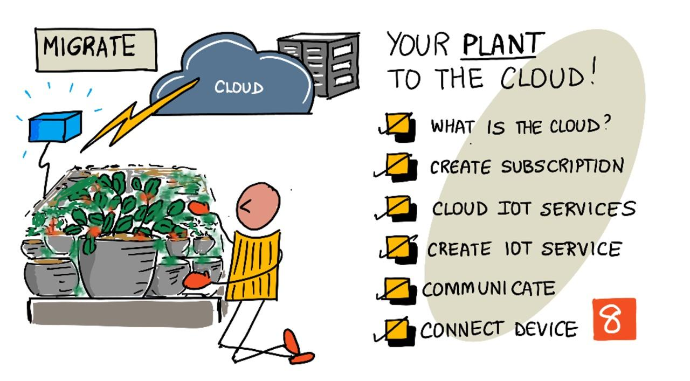

<!--
CO_OP_TRANSLATOR_METADATA:
{
  "original_hash": "4d8e7a066d75b625e7a979c14157041d",
  "translation_date": "2025-08-27T11:53:07+00:00",
  "source_file": "2-farm/lessons/4-migrate-your-plant-to-the-cloud/README.md",
  "language_code": "bn"
}
-->
# আপনার গাছকে ক্লাউডে স্থানান্তর করুন



> স্কেচনোট: [নিত্য নারাসিমহান](https://github.com/nitya)। বড় সংস্করণের জন্য ছবিতে ক্লিক করুন।

এই পাঠটি [IoT for Beginners Project 2 - Digital Agriculture series](https://youtube.com/playlist?list=PLmsFUfdnGr3yCutmcVg6eAUEfsGiFXgcx) এর অংশ হিসেবে [Microsoft Reactor](https://developer.microsoft.com/reactor/?WT.mc_id=academic-17441-jabenn) থেকে শেখানো হয়েছিল।

[](https://youtu.be/bNxjopXkhvk)

## প্রাক-পাঠ কুইজ

[প্রাক-পাঠ কুইজ](https://black-meadow-040d15503.1.azurestaticapps.net/quiz/15)

## ভূমিকা

পূর্ববর্তী পাঠে, আপনি শিখেছেন কীভাবে আপনার গাছকে একটি MQTT ব্রোকারের সাথে সংযুক্ত করতে হয় এবং স্থানীয়ভাবে চলমান সার্ভার কোড থেকে একটি রিলে নিয়ন্ত্রণ করতে হয়। এটি এমন একটি ইন্টারনেট-সংযুক্ত স্বয়ংক্রিয় সেচ ব্যবস্থার মূল কাঠামো তৈরি করে যা বাড়িতে ব্যক্তিগত গাছ থেকে শুরু করে বাণিজ্যিক খামার পর্যন্ত ব্যবহৃত হয়।

IoT ডিভাইসটি একটি পাবলিক MQTT ব্রোকারের সাথে যোগাযোগ করেছিল, যা নীতিগুলি প্রদর্শনের একটি উপায় ছিল, তবে এটি সবচেয়ে নির্ভরযোগ্য বা নিরাপদ পদ্ধতি নয়। এই পাঠে আপনি ক্লাউড এবং পাবলিক ক্লাউড পরিষেবাগুলির দ্বারা প্রদত্ত IoT ক্ষমতা সম্পর্কে শিখবেন। আপনি পাবলিক MQTT ব্রোকার থেকে এই ক্লাউড পরিষেবাগুলির একটিতে আপনার গাছ স্থানান্তর করার পদ্ধতিও শিখবেন।

এই পাঠে আমরা আলোচনা করব:

* [ক্লাউড কী?](../../../../../2-farm/lessons/4-migrate-your-plant-to-the-cloud)
* [ক্লাউড সাবস্ক্রিপশন তৈরি করুন](../../../../../2-farm/lessons/4-migrate-your-plant-to-the-cloud)
* [ক্লাউড IoT পরিষেবাগুলি](../../../../../2-farm/lessons/4-migrate-your-plant-to-the-cloud)
* [ক্লাউডে একটি IoT পরিষেবা তৈরি করুন](../../../../../2-farm/lessons/4-migrate-your-plant-to-the-cloud)
* [IoT Hub এর সাথে যোগাযোগ করুন](../../../../../2-farm/lessons/4-migrate-your-plant-to-the-cloud)
* [আপনার ডিভাইসকে IoT পরিষেবার সাথে সংযুক্ত করুন](../../../../../2-farm/lessons/4-migrate-your-plant-to-the-cloud)

## ক্লাউড কী?

ক্লাউডের আগে, যখন কোনো কোম্পানি তাদের কর্মচারীদের জন্য (যেমন ডাটাবেস বা ফাইল স্টোরেজ) বা জনসাধারণের জন্য (যেমন ওয়েবসাইট) পরিষেবা প্রদান করতে চাইত, তখন তারা একটি ডেটা সেন্টার তৈরি এবং পরিচালনা করত। এটি একটি ছোট সংখ্যক কম্পিউটার সহ একটি কক্ষ থেকে শুরু করে অনেক কম্পিউটার সহ একটি ভবন পর্যন্ত হতে পারে। কোম্পানিটি নিম্নলিখিত বিষয়গুলি পরিচালনা করত:

* কম্পিউটার কেনা
* হার্ডওয়্যার রক্ষণাবেক্ষণ
* বিদ্যুৎ এবং শীতলকরণ
* নেটওয়ার্কিং
* নিরাপত্তা, যার মধ্যে ভবন এবং কম্পিউটারের সফটওয়্যার সুরক্ষা অন্তর্ভুক্ত
* সফটওয়্যার ইনস্টলেশন এবং আপডেট

এটি খুব ব্যয়বহুল হতে পারে, দক্ষ কর্মচারীদের একটি বিস্তৃত পরিসর প্রয়োজন হতে পারে এবং প্রয়োজন হলে পরিবর্তন করতে অনেক ধীর হতে পারে। উদাহরণস্বরূপ, যদি একটি অনলাইন স্টোর একটি ব্যস্ত ছুটির মরসুমের জন্য পরিকল্পনা করতে চায়, তবে তাদের মাস আগে পরিকল্পনা করতে হবে, হার্ডওয়্যার কিনতে হবে, সেটি কনফিগার করতে হবে, ইনস্টল করতে হবে এবং তাদের বিক্রয় প্রক্রিয়া চালানোর জন্য সফটওয়্যার ইনস্টল করতে হবে। ছুটির মরসুম শেষ হওয়ার পরে এবং বিক্রয় আবার কমে গেলে, তারা এমন কম্পিউটার নিয়ে বসে থাকবে যা তারা কিনেছে এবং পরবর্তী ব্যস্ত মরসুম পর্যন্ত সেগুলি নিষ্ক্রিয় থাকবে।

✅ আপনি কি মনে করেন এটি কোম্পানিগুলিকে দ্রুত এগিয়ে যেতে দেবে? যদি একটি অনলাইন পোশাক বিক্রেতা হঠাৎ জনপ্রিয় হয়ে ওঠে কারণ একটি সেলিব্রিটি তাদের পোশাক পরেছে, তাহলে তারা কি অর্ডারের আকস্মিক প্রবাহ সমর্থন করার জন্য দ্রুত তাদের কম্পিউটিং ক্ষমতা বাড়াতে পারবে?

### অন্য কারো কম্পিউটার

ক্লাউডকে প্রায়ই মজার ছলে 'অন্য কারো কম্পিউটার' বলা হয়। প্রাথমিক ধারণাটি ছিল সহজ - কম্পিউটার কেনার পরিবর্তে, আপনি অন্য কারো কম্পিউটার ভাড়া নেন। অন্য কেউ, একটি ক্লাউড কম্পিউটিং প্রদানকারী, বিশাল ডেটা সেন্টার পরিচালনা করবে। তারা হার্ডওয়্যার কেনা এবং ইনস্টল করা, বিদ্যুৎ এবং শীতলকরণ পরিচালনা করা, নেটওয়ার্কিং, ভবনের নিরাপত্তা, হার্ডওয়্যার এবং সফটওয়্যার আপডেট, সবকিছু পরিচালনার জন্য দায়ী হবে। একজন গ্রাহক হিসেবে, আপনি প্রয়োজনীয় কম্পিউটার ভাড়া নেবেন, চাহিদা বাড়লে আরও ভাড়া নেবেন, তারপর চাহিদা কমলে কম ভাড়া নেবেন। এই ক্লাউড ডেটা সেন্টারগুলি সারা বিশ্বে ছড়িয়ে রয়েছে।


এই ডেটা সেন্টারগুলি একাধিক বর্গ কিলোমিটার আকারের হতে পারে। উপরের ছবিগুলি Microsoft ক্লাউড ডেটা সেন্টারে কয়েক বছর আগে তোলা হয়েছিল এবং প্রাথমিক আকার, পাশাপাশি পরিকল্পিত সম্প্রসারণ দেখায়। সম্প্রসারণের জন্য পরিষ্কার করা এলাকা ৫ বর্গ কিলোমিটারের বেশি।

> 💁 এই ডেটা সেন্টারগুলি এত বড় পরিমাণে বিদ্যুৎ প্রয়োজন যে কিছু তাদের নিজস্ব বিদ্যুৎ কেন্দ্র রয়েছে। তাদের আকার এবং ক্লাউড প্রদানকারীদের বিনিয়োগের কারণে, তারা সাধারণত পরিবেশগতভাবে খুবই বন্ধুত্বপূর্ণ। তারা অসংখ্য ছোট ডেটা সেন্টারের তুলনায় বেশি দক্ষ, তারা প্রধানত নবায়নযোগ্য শক্তিতে চলে, এবং ক্লাউড প্রদানকারীরা বর্জ্য কমানো, পানির ব্যবহার কমানো এবং ডেটা সেন্টার তৈরির জন্য কাটা বন পুনরায় রোপণ করার জন্য কঠোর পরিশ্রম করে। আপনি একটি ক্লাউড প্রদানকারী কীভাবে টেকসইতার জন্য কাজ করছে তা [Azure টেকসইতা সাইটে](https://azure.microsoft.com/global-infrastructure/sustainability/?WT.mc_id=academic-17441-jabenn) আরও পড়তে পারেন।

✅ কিছু গবেষণা করুন: Microsoft এর [Azure](https://azure.microsoft.com/?WT.mc_id=academic-17441-jabenn) বা Google's [GCP](https://cloud.google.com) এর মতো প্রধান ক্লাউড সম্পর্কে পড়ুন। তাদের কতটি ডেটা সেন্টার রয়েছে এবং সেগুলি কোথায় অবস্থিত?

ক্লাউড ব্যবহার করে কোম্পানিগুলির খরচ কম থাকে এবং তারা যা করতে সবচেয়ে ভালো তা করার দিকে মনোযোগ দিতে পারে, ক্লাউড কম্পিউটিং দক্ষতা প্রদানকারীর হাতে রেখে। কোম্পানিগুলিকে আর ডেটা সেন্টার স্পেস ভাড়া বা কিনতে, সংযোগ এবং বিদ্যুতের জন্য বিভিন্ন প্রদানকারীকে অর্থ প্রদান করতে বা বিশেষজ্ঞদের নিয়োগ করতে হবে না। পরিবর্তে, তারা ক্লাউড প্রদানকারীকে একটি মাসিক বিল দিতে পারে যাতে সবকিছু পরিচালিত হয়।

ক্লাউড প্রদানকারী তখন ব্যয়ের অর্থনৈতিক সুবিধা ব্যবহার করে খরচ কমাতে পারে, কম্পিউটারগুলি কম দামে বাল্কে কিনতে পারে, রক্ষণাবেক্ষণের জন্য তাদের কাজ কমাতে টুলিংয়ে বিনিয়োগ করতে পারে, এমনকি তাদের ক্লাউড অফার উন্নত করতে নিজস্ব হার্ডওয়্যার ডিজাইন এবং তৈরি করতে পারে।

### Microsoft Azure

Azure হল Microsoft এর ডেভেলপার ক্লাউড, এবং এই পাঠগুলির জন্য আপনি যে ক্লাউডটি ব্যবহার করবেন। নিচের ভিডিওটি Azure এর একটি সংক্ষিপ্ত বিবরণ দেয়:

[](https://www.microsoft.com/videoplayer/embed/RE4Ibng?WT.mc_id=academic-17441-jabenn)

## ক্লাউড সাবস্ক্রিপশন তৈরি করুন

ক্লাউডে পরিষেবা ব্যবহার করতে, আপনাকে একটি ক্লাউড প্রদানকারীর সাথে একটি সাবস্ক্রিপশনে সাইন আপ করতে হবে। এই পাঠের জন্য, আপনি একটি Microsoft Azure সাবস্ক্রিপশনে সাইন আপ করবেন। যদি আপনার ইতিমধ্যে একটি Azure সাবস্ক্রিপশন থাকে তবে আপনি এই কাজটি এড়িয়ে যেতে পারেন। এখানে বর্ণিত সাবস্ক্রিপশন বিবরণ লেখার সময় সঠিক, তবে পরিবর্তিত হতে পারে।

> 💁 যদি আপনি আপনার স্কুলের মাধ্যমে এই পাঠগুলি অ্যাক্সেস করেন, তাহলে আপনার কাছে ইতিমধ্যে একটি Azure সাবস্ক্রিপশন উপলব্ধ থাকতে পারে। আপনার শিক্ষকের সাথে চেক করুন।

Azure এর দুটি ভিন্ন ধরনের বিনামূল্যের সাবস্ক্রিপশনে সাইন আপ করা যায়:

* **Azure for Students** - এটি ১৮+ শিক্ষার্থীদের জন্য একটি সাবস্ক্রিপশন। সাইন আপ করতে আপনার ক্রেডিট কার্ডের প্রয়োজন নেই এবং আপনি শিক্ষার্থী হিসেবে যাচাই করতে আপনার স্কুল ইমেইল ঠিকানা ব্যবহার করেন। সাইন আপ করার সময় আপনি ক্লাউড রিসোর্সে ব্যয় করার জন্য US$100 পান, পাশাপাশি একটি IoT পরিষেবার বিনামূল্যের সংস্করণ সহ বিনামূল্যের পরিষেবা পান। এটি ১২ মাস স্থায়ী হয় এবং আপনি শিক্ষার্থী থাকা অবস্থায় প্রতি বছর এটি পুনর্নবীকরণ করতে পারেন।

* **Azure free subscription** - এটি এমন কারো জন্য একটি সাবস্ক্রিপশন যিনি শিক্ষার্থী নন। এই সাবস্ক্রিপশনে সাইন আপ করতে আপনার একটি ক্রেডিট কার্ডের প্রয়োজন হবে, তবে আপনার কার্ড বিল করা হবে না, এটি শুধুমাত্র যাচাই করার জন্য ব্যবহৃত হয় যে আপনি একজন বাস্তব মানুষ, বট নন। আপনি প্রথম ৩০ দিনে যে কোনো পরিষেবায় $200 ক্রেডিট পান, পাশাপাশি Azure পরিষেবার বিনামূল্যের স্তর পান। একবার আপনার ক্রেডিট শেষ হয়ে গেলে, আপনার কার্ড চার্জ করা হবে না যদি না আপনি একটি পে অ্যাজ ইউ গো সাবস্ক্রিপশনে রূপান্তর করেন।

> 💁 Microsoft শিক্ষার্থীদের জন্য একটি Azure for Students Starter সাবস্ক্রিপশন অফার করে যারা ১৮ বছরের কম বয়সী, তবে লেখার সময় এটি কোনো IoT পরিষেবা সমর্থন করে না।

### কাজ - একটি বিনামূল্যের ক্লাউড সাবস্ক্রিপশনে সাইন আপ করুন

যদি আপনি ১৮+ শিক্ষার্থী হন, তাহলে আপনি একটি Azure for Students সাবস্ক্রিপশনে সাইন আপ করতে পারেন। আপনাকে একটি স্কুল ইমেইল ঠিকানা দিয়ে যাচাই করতে হবে। আপনি এটি দুটি উপায়ে করতে পারেন:

* [education.github.com/pack](https://education.github.com/pack) এ GitHub student developer pack এর জন্য সাইন আপ করুন। এটি আপনাকে GitHub এবং Microsoft Azure সহ বিভিন্ন টুল এবং অফারে অ্যাক্সেস দেয়। একবার আপনি ডেভেলপার প্যাকের জন্য সাইন আপ করলে, আপনি Azure for Students অফারটি সক্রিয় করতে পারেন।

* সরাসরি [azure.microsoft.com/free/students](https://azure.microsoft.com/free/students/?WT.mc_id=academic-17441-jabenn) এ একটি Azure for Students অ্যাকাউন্টের জন্য সাইন আপ করুন।

> ⚠️ যদি আপনার স্কুল ইমেইল ঠিকানা স্বীকৃত না হয়, তাহলে এই রিপোতে একটি [ইস্যু](https://github.com/Microsoft/IoT-For-Beginners/issues) উত্থাপন করুন এবং আমরা দেখতে পারি এটি Azure for Students অনুমোদিত তালিকায় যোগ করা যেতে পারে কিনা।

যদি আপনি শিক্ষার্থী না হন, অথবা আপনার কাছে একটি বৈধ স্কুল ইমেইল ঠিকানা না থাকে, তাহলে আপনি একটি Azure Free সাবস্ক্রিপশনে সাইন আপ করতে পারেন।

* [azure.microsoft.com/free](https://azure.microsoft.com/free/?WT.mc_id=academic-17441-jabenn) এ একটি Azure Free Subscription এর জন্য সাইন আপ করুন।

## ক্লাউড IoT পরিষেবাগুলি

আপনি যে পাবলিক টেস্ট MQTT ব্রোকারটি ব্যবহার করছেন তা শেখার সময় একটি দুর্দান্ত টুল, তবে এটি একটি বাণিজ্যিক সেটিংয়ে ব্যবহারের জন্য একটি টুল হিসাবে কিছু অসুবিধা রয়েছে:

* নির্ভরযোগ্যতা - এটি একটি বিনামূল্যের পরিষেবা যার কোনো গ্যারান্টি নেই এবং যে কোনো সময় বন্ধ করা যেতে পারে
* নিরাপত্তা - এটি পাবলিক, তাই যে কেউ আপনার টেলিমেট্রি শুনতে বা আপনার হার্ডওয়্যার নিয়ন্ত্রণ করতে কমান্ড পাঠাতে পারে
* কর্মক্ষমতা - এটি শুধুমাত্র কয়েকটি টেস্ট মেসেজের জন্য ডিজাইন করা হয়েছে, তাই এটি প্রচুর পরিমাণে মেসেজ পাঠানোর ক্ষেত্রে সক্ষম হবে না
* আবিষ্কার - সংযুক্ত ডিভাইসগুলি সম্পর্কে জানার কোনো উপায় নেই

ক্লাউডে IoT পরিষেবাগুলি এই সমস্যাগুলি সমাধান করে। এগুলি বড় ক্লাউড প্রদানকারীদের দ্বারা রক্ষণাবেক্ষণ করা হয় যারা নির্ভরযোগ্যতার জন্য ব্যাপকভাবে বিনিয়োগ করে এবং যে কোনো সমস্যা দেখা দিলে তা ঠিক করার জন্য প্রস্তুত থাকে। এগুলিতে নিরাপত্তা অন্তর্ভুক্ত থাকে যাতে হ্যাকাররা আপনার ডেটা পড়তে বা রগ কমান্ড পাঠাতে না পারে। এগুলি উচ্চ কর্মক্ষমতাও প্রদান করে, প্রতিদিন অনেক মিলিয়ন মেসেজ পরিচালনা করতে সক্ষম, প্রয়োজন অনুযায়ী স্কেল করার জন্য ক্লাউডের সুবিধা গ্রহণ করে।

> 💁 যদিও আপনি এই সুবিধাগুলির জন্য একটি মাসিক ফি প্রদান করেন, বেশিরভাগ ক্লাউড প্রদানকারী তাদের IoT পরিষেবার একটি বিনামূল্যের সংস্করণ অফার করে যা প্রতিদিন সীমিত সংখ্যক মেসেজ বা সংযুক্ত ডিভাইসগুলির জন্য অনুমতি দেয়। এই বিনামূল্যের সংস্করণটি সাধারণত একজন ডেভেলপারকে পরিষেবা সম্পর্কে শেখার জন্য যথেষ্ট। এই পাঠে আপনি একটি বিনামূল্যের সংস্করণ ব্যবহার করবেন।

IoT ডিভাইসগুলি একটি ডিভাইস SDK ব্যবহার করে (একটি লাইব্রেরি যা পরিষেবার বৈশিষ্ট্যগুলির সাথে কাজ করার জন্য কোড প্রদান করে) বা MQTT বা HTTP এর মতো একটি যোগাযোগ প্রোটোকলের মাধ্যমে সরাসরি একটি ক্লাউড পরিষেবার সাথে সংযুক্ত হয়। ডিভাইস SDK সাধারণত সবচেয়ে সহজ পথ কারণ এটি আপনার জন্য সবকিছু পরিচালনা করে, যেমন কোন টপিক প্রকাশ বা সাবস্ক্রাইব করতে হবে এবং কীভাবে নিরাপত্তা পরিচালনা করতে হবে।


আপনার ডিভাইসটি তখন আপনার অ্যাপ্লিকেশনের অন্যান্য অংশের সাথে এই পরিষেবার মাধ্যমে যোগাযোগ করে - ঠিক যেমন আপনি MQTT এর মাধ্যমে টেলিমেট্রি পাঠিয়েছেন এবং কমান্ড গ্রহণ করেছেন। এটি সাধারণত একটি পরিষেবা SDK বা অনুরূপ লাইব্রেরি ব্যবহার করে। আপনার ডিভাইস থেকে মেসেজ পরিষেবাতে আসে যেখানে আপনার অ্যাপ্লিকেশনের অন্যান্য উপাদানগুলি সেগুলি পড়তে পারে এবং মেসেজগুলি আপনার ডিভাইসে ফিরে পাঠানো যেতে পারে।


এই পরিষেবাগুলি নিরাপত্তা প্রয়োগ করে সমস্ত ডিভাইস সম্পর্কে জানার মাধ্যমে যা সংযুক্ত হতে পারে এবং ডেটা পাঠাতে পারে, হয় ডিভাইসগুলি পরিষেবার সাথে প্রাক-নিবন্ধিত থাকে, অথবা ডিভাইসগুলিকে গোপন কী বা সার্টিফিকেট দেওয়া হয় যা তারা প্রথমবার পরিষেবার সাথে সংযুক্ত হলে নিজেদের নিবন্ধন করতে ব্যবহার করতে পারে। অজানা ডিভাইসগুলি সংযুক্ত হতে পারে না, যদি তারা চেষ্টা করে তবে পরিষেবা সংযোগটি প্রত্যাখ্যান করে এবং তাদের দ্বারা পাঠানো মেসেজগুলি উপেক্ষা করে।

✅ কিছু গবেষণা করুন: একটি ওপেন IoT পরিষেবা যেখানে যে কোনো ডিভাইস বা কোড সংযুক্ত হতে পারে তার অসুবিধা কী? আপনি কি হ্যাকারদের এই সুবিধা নেওয়ার নির্দিষ্ট উদাহরণ খুঁজে পেতে পারেন?

আপনার অ্যাপ্লিকেশনের অন্যান্য উপাদানগুলি IoT পরিষেবার সাথে সংযুক্ত হতে পারে এবং সংযুক্ত বা নিবন্ধিত সমস্ত ডিভাইস সম্পর্কে জানতে পারে এবং তাদের সাথে সরাসরি বা একসাথে যোগাযোগ করতে পারে।
💁 IoT পরিষেবাগুলি অতিরিক্ত সক্ষমতাও বাস্তবায়ন করে, এবং ক্লাউড প্রদানকারীদের অতিরিক্ত পরিষেবা এবং অ্যাপ্লিকেশন রয়েছে যা পরিষেবার সাথে সংযুক্ত করা যেতে পারে। উদাহরণস্বরূপ, যদি আপনি সমস্ত ডিভাইস দ্বারা পাঠানো টেলিমেট্রি বার্তাগুলি একটি ডাটাবেসে সংরক্ষণ করতে চান, তাহলে সাধারণত ক্লাউড প্রদানকারীর কনফিগারেশন টুলে কয়েকটি ক্লিক করলেই পরিষেবাটিকে ডাটাবেসের সাথে সংযুক্ত করে ডেটা স্ট্রিম করা সম্ভব।
## ক্লাউডে একটি IoT সার্ভিস তৈরি করুন

এখন যেহেতু আপনার একটি Azure সাবস্ক্রিপশন আছে, আপনি একটি IoT সার্ভিসে সাইন আপ করতে পারেন। Microsoft-এর IoT সার্ভিসকে Azure IoT Hub বলা হয়।


নিচের ভিডিওটি Azure IoT Hub-এর একটি সংক্ষিপ্ত ওভারভিউ দেয়:

[](https://www.youtube.com/watch?v=smuZaZZXKsU)

> 🎥 ভিডিওটি দেখতে উপরের ছবিতে ক্লিক করুন

✅ কিছু সময় নিয়ে গবেষণা করুন এবং [Microsoft IoT Hub ডকুমেন্টেশন](https://docs.microsoft.com/azure/iot-hub/about-iot-hub?WT.mc_id=academic-17441-jabenn)-এ IoT Hub-এর ওভারভিউ পড়ুন।

Azure-এ উপলব্ধ ক্লাউড সার্ভিসগুলো একটি ওয়েব-ভিত্তিক পোর্টাল বা কমান্ড-লাইন ইন্টারফেস (CLI) এর মাধ্যমে কনফিগার করা যায়। এই কাজের জন্য, আপনি CLI ব্যবহার করবেন।

### কাজ - Azure CLI ইনস্টল করুন

Azure CLI ব্যবহার করতে হলে প্রথমে এটি আপনার PC বা Mac-এ ইনস্টল করতে হবে।

1. [Azure CLI ডকুমেন্টেশন](https://docs.microsoft.com/cli/azure/install-azure-cli?WT.mc_id=academic-17441-jabenn)-এ নির্দেশনা অনুসরণ করে CLI ইনস্টল করুন।

1. Azure CLI বিভিন্ন এক্সটেনশন সমর্থন করে যা Azure সার্ভিসের বিস্তৃত পরিসর পরিচালনা করার ক্ষমতা যোগ করে। নিচের কমান্ডটি চালিয়ে IoT এক্সটেনশন ইনস্টল করুন:

    ```sh
    az extension add --name azure-iot
    ```

1. আপনার কমান্ড লাইন বা টার্মিনাল থেকে নিচের কমান্ডটি চালান Azure CLI থেকে আপনার Azure সাবস্ক্রিপশনে লগ ইন করতে।

    ```sh
    az login
    ```

    একটি ওয়েব পেজ আপনার ডিফল্ট ব্রাউজারে চালু হবে। আপনার Azure সাবস্ক্রিপশনে সাইন আপ করার জন্য ব্যবহৃত অ্যাকাউন্ট দিয়ে লগ ইন করুন। লগ ইন করার পরে, ব্রাউজার ট্যাবটি বন্ধ করতে পারেন।

1. যদি আপনার একাধিক Azure সাবস্ক্রিপশন থাকে, যেমন একটি স্কুল প্রদত্ত সাবস্ক্রিপশন এবং আপনার নিজস্ব Azure for Students সাবস্ক্রিপশন, তাহলে আপনাকে ব্যবহার করতে চান এমনটি নির্বাচন করতে হবে। নিচের কমান্ডটি চালান আপনার অ্যাক্সেসযোগ্য সমস্ত সাবস্ক্রিপশন তালিকাভুক্ত করতে:

    ```sh
    az account list --output table
    ```

    আউটপুটে, আপনি প্রতিটি সাবস্ক্রিপশনের নাম এবং তার `SubscriptionId` দেখতে পাবেন।

    ```output
    ➜  ~ az account list --output table
    Name                    CloudName    SubscriptionId                        State    IsDefault
    ----------------------  -----------  ------------------------------------  -------  -----------
    School-subscription     AzureCloud   cb30cde9-814a-42f0-a111-754cb788e4e1  Enabled  True
    Azure for Students      AzureCloud   fa51c31b-162c-4599-add6-781def2e1fbf  Enabled  False
    ```

    আপনি যে সাবস্ক্রিপশনটি ব্যবহার করতে চান তা নির্বাচন করতে নিচের কমান্ডটি ব্যবহার করুন:

    ```sh
    az account set --subscription <SubscriptionId>
    ```

    `<SubscriptionId>`-এর জায়গায় আপনার পছন্দের সাবস্ক্রিপশনের Id বসান। এই কমান্ডটি চালানোর পরে, আপনার অ্যাকাউন্ট তালিকা পুনরায় চালান। আপনি দেখবেন `IsDefault` কলামটি `True` হিসাবে চিহ্নিত হয়েছে আপনার নির্বাচিত সাবস্ক্রিপশনের জন্য।

### কাজ - একটি রিসোর্স গ্রুপ তৈরি করুন

Azure সার্ভিসগুলো, যেমন IoT Hub ইনস্ট্যান্স, ভার্চুয়াল মেশিন, ডাটাবেস বা AI সার্ভিসগুলোকে **রিসোর্স** বলা হয়। প্রতিটি রিসোর্সকে একটি **রিসোর্স গ্রুপ**-এর মধ্যে থাকতে হয়, যা এক বা একাধিক রিসোর্সের একটি যৌক্তিক গ্রুপিং।

> 💁 রিসোর্স গ্রুপ ব্যবহার করলে আপনি একাধিক সার্ভিস একসাথে পরিচালনা করতে পারেন। উদাহরণস্বরূপ, এই প্রকল্পের সমস্ত পাঠ শেষ করার পরে আপনি রিসোর্স গ্রুপটি মুছে ফেলতে পারেন, এবং এর মধ্যে থাকা সমস্ত রিসোর্স স্বয়ংক্রিয়ভাবে মুছে যাবে।

1. বিশ্বজুড়ে Azure-এর একাধিক ডেটা সেন্টার রয়েছে, যা অঞ্চলগুলিতে বিভক্ত। যখন আপনি একটি Azure রিসোর্স বা রিসোর্স গ্রুপ তৈরি করেন, তখন আপনাকে নির্দিষ্ট করতে হবে এটি কোথায় তৈরি করতে চান। নিচের কমান্ডটি চালান লোকেশনের তালিকা পেতে:

    ```sh
    az account list-locations --output table
    ```

    আপনি একটি দীর্ঘ লোকেশনের তালিকা দেখতে পাবেন।

    > 💁 লেখার সময়, আপনি ৬৫টি লোকেশনে ডিপ্লয় করতে পারেন।

    ```output
        ➜  ~ az account list-locations --output table
    DisplayName               Name                 RegionalDisplayName
    ------------------------  -------------------  -------------------------------------
    East US                   eastus               (US) East US
    East US 2                 eastus2              (US) East US 2
    South Central US          southcentralus       (US) South Central US
    ...
    ```

    আপনার কাছাকাছি অঞ্চলের `Name` কলামের মানটি নোট করুন। আপনি [Azure geographies page](https://azure.microsoft.com/global-infrastructure/geographies/?WT.mc_id=academic-17441-jabenn)-এ একটি মানচিত্রে অঞ্চলগুলো খুঁজে পেতে পারেন।

1. `soil-moisture-sensor` নামে একটি রিসোর্স গ্রুপ তৈরি করতে নিচের কমান্ডটি চালান। রিসোর্স গ্রুপের নাম আপনার সাবস্ক্রিপশনে ইউনিক হতে হবে।

    ```sh
    az group create --name soil-moisture-sensor \
                    --location <location>
    ```

    `<location>`-এর জায়গায় আগের ধাপে নির্বাচিত লোকেশনটি বসান।

### কাজ - একটি IoT Hub তৈরি করুন

এখন আপনি আপনার রিসোর্স গ্রুপে একটি IoT Hub রিসোর্স তৈরি করতে পারেন।

1. আপনার IoT Hub রিসোর্স তৈরি করতে নিচের কমান্ডটি ব্যবহার করুন:

    ```sh
    az iot hub create --resource-group soil-moisture-sensor \
                      --sku F1 \
                      --partition-count 2 \
                      --name <hub_name>
    ```

    `<hub_name>`-এর জায়গায় আপনার হাবের জন্য একটি নাম দিন। এই নামটি বিশ্বব্যাপী ইউনিক হতে হবে - অর্থাৎ অন্য কেউ একই নাম ব্যবহার করতে পারবে না। এই নামটি একটি URL-এ ব্যবহৃত হয় যা হাবের দিকে নির্দেশ করে, তাই এটি ইউনিক হতে হবে। `soil-moisture-sensor-` ব্যবহার করুন এবং শেষে কিছু ইউনিক আইডেন্টিফায়ার যোগ করুন, যেমন কিছু র্যান্ডম শব্দ বা আপনার নাম।

    `--sku F1` অপশনটি ফ্রি টিয়ার ব্যবহার করতে বলে। ফ্রি টিয়ার প্রতিদিন ৮,০০০ বার্তা এবং পূর্ণমূল্যের টিয়ারের বেশিরভাগ বৈশিষ্ট্য সমর্থন করে।

    > 🎓 Azure সার্ভিসের বিভিন্ন মূল্যস্তরকে টিয়ার বলা হয়। প্রতিটি টিয়ারের আলাদা খরচ এবং বিভিন্ন বৈশিষ্ট্য বা ডেটা ভলিউম প্রদান করে।

    > 💁 যদি আপনি মূল্য সম্পর্কে আরও জানতে চান, আপনি [Azure IoT Hub মূল্য গাইড](https://azure.microsoft.com/pricing/details/iot-hub/?WT.mc_id=academic-17441-jabenn) দেখতে পারেন।

    `--partition-count 2` অপশনটি IoT Hub কতগুলো ডেটা স্ট্রিম সমর্থন করবে তা সংজ্ঞায়িত করে। বেশি পার্টিশন ডেটা ব্লকিং কমায় যখন একাধিক ডিভাইস IoT Hub-এ পড়ে এবং লেখে। পার্টিশন এই পাঠের পরিধির বাইরে, তবে একটি ফ্রি টিয়ার IoT Hub তৈরি করতে এই মানটি সেট করতে হবে।

    > 💁 প্রতি সাবস্ক্রিপশনে শুধুমাত্র একটি ফ্রি টিয়ার IoT Hub থাকতে পারে।

IoT Hub তৈরি হবে। এটি সম্পন্ন হতে এক মিনিট বা তার বেশি সময় লাগতে পারে।

## IoT Hub-এর সাথে যোগাযোগ করুন

আগের পাঠে, আপনি MQTT ব্যবহার করেছিলেন এবং বিভিন্ন টপিকে বার্তা পাঠিয়েছিলেন এবং গ্রহণ করেছিলেন, যেখানে বিভিন্ন টপিকের বিভিন্ন উদ্দেশ্য ছিল। বিভিন্ন টপিকে বার্তা পাঠানোর পরিবর্তে, IoT Hub ডিভাইস এবং হাবের মধ্যে যোগাযোগের জন্য কয়েকটি সংজ্ঞায়িত পদ্ধতি রয়েছে।

> 💁 IoT Hub এবং আপনার ডিভাইসের মধ্যে এই যোগাযোগটি MQTT, HTTPS বা AMQP ব্যবহার করতে পারে।

* ডিভাইস থেকে ক্লাউড (D2C) বার্তা - এগুলো ডিভাইস থেকে IoT Hub-এ পাঠানো বার্তা, যেমন টেলিমেট্রি। এগুলো আপনার অ্যাপ্লিকেশন কোড দ্বারা IoT Hub থেকে পড়া যেতে পারে।

    > 🎓 IoT Hub একটি Azure সার্ভিস ব্যবহার করে যার নাম [Event Hubs](https://docs.microsoft.com/azure/event-hubs/?WT.mc_id=academic-17441-jabenn)। যখন আপনি হাবে পাঠানো বার্তা পড়ার জন্য কোড লিখেন, এগুলো প্রায়ই ইভেন্ট নামে পরিচিত।

* ক্লাউড থেকে ডিভাইস (C2D) বার্তা - এগুলো অ্যাপ্লিকেশন কোড থেকে IoT Hub-এর মাধ্যমে IoT ডিভাইসে পাঠানো বার্তা।

* ডিরেক্ট মেথড অনুরোধ - এগুলো অ্যাপ্লিকেশন কোড থেকে IoT Hub-এর মাধ্যমে IoT ডিভাইসে পাঠানো বার্তা যা ডিভাইসকে কিছু করতে অনুরোধ করে, যেমন একটি অ্যাকচুয়েটর নিয়ন্ত্রণ করা। এই বার্তাগুলো একটি প্রতিক্রিয়া প্রয়োজন যাতে আপনার অ্যাপ্লিকেশন কোড জানতে পারে এটি সফলভাবে প্রক্রিয়াকৃত হয়েছে কিনা।

* ডিভাইস টুইন - এগুলো JSON ডকুমেন্ট যা ডিভাইস এবং IoT Hub-এর মধ্যে সিঙ্ক্রোনাইজ থাকে এবং ডিভাইস দ্বারা রিপোর্ট করা সেটিংস বা অন্যান্য প্রপার্টি সংরক্ষণ করতে ব্যবহৃত হয়, অথবা IoT Hub দ্বারা ডিভাইসে সেট করা উচিত (যা `desired` নামে পরিচিত)।

IoT Hub বার্তা এবং ডিরেক্ট মেথড অনুরোধগুলো একটি কনফিগারযোগ্য সময়ের জন্য সংরক্ষণ করতে পারে (ডিফল্টভাবে এক দিন), তাই যদি একটি ডিভাইস বা অ্যাপ্লিকেশন কোড সংযোগ হারায়, এটি পুনরায় সংযোগ করার পরে অফলাইনে থাকা অবস্থায় পাঠানো বার্তাগুলো পুনরুদ্ধার করতে পারে। ডিভাইস টুইন IoT Hub-এ স্থায়ীভাবে সংরক্ষিত থাকে, তাই যেকোনো সময় একটি ডিভাইস পুনরায় সংযোগ করতে পারে এবং সর্বশেষ ডিভাইস টুইন পেতে পারে।

✅ কিছু গবেষণা করুন: এই বার্তা প্রকারগুলো সম্পর্কে আরও পড়ুন [Device-to-cloud communications guidance](https://docs.microsoft.com/azure/iot-hub/iot-hub-devguide-d2c-guidance?WT.mc_id=academic-17441-jabenn) এবং [Cloud-to-device communications guidance](https://docs.microsoft.com/azure/iot-hub/iot-hub-devguide-c2d-guidance?WT.mc_id=academic-17441-jabenn) IoT Hub ডকুমেন্টেশনে।

## আপনার ডিভাইসকে IoT সার্ভিসের সাথে সংযুক্ত করুন

একবার হাব তৈরি হয়ে গেলে, আপনার IoT ডিভাইস এটি সংযুক্ত করতে পারে। শুধুমাত্র নিবন্ধিত ডিভাইসগুলো একটি সার্ভিসে সংযুক্ত হতে পারে, তাই আপনাকে প্রথমে আপনার ডিভাইস নিবন্ধন করতে হবে। যখন আপনি নিবন্ধন করবেন তখন আপনি একটি সংযোগ স্ট্রিং ফিরে পাবেন যা ডিভাইসটি সংযুক্ত করতে ব্যবহার করতে পারে। এই সংযোগ স্ট্রিংটি ডিভাইস নির্দিষ্ট এবং এতে IoT Hub, ডিভাইস এবং একটি সিক্রেট কী সম্পর্কিত তথ্য থাকে যা এই ডিভাইসটিকে সংযুক্ত করতে অনুমতি দেয়।

> 🎓 সংযোগ স্ট্রিং একটি সাধারণ শব্দ যা সংযোগের বিস্তারিত তথ্য ধারণ করে এমন একটি টেক্সট টুকরো বোঝায়। এগুলো IoT Hub, ডাটাবেস এবং অন্যান্য অনেক সার্ভিসে সংযুক্ত করার সময় ব্যবহার করা হয়। এগুলো সাধারণত সার্ভিসের একটি আইডেন্টিফায়ার, যেমন একটি URL, এবং সিকিউরিটি তথ্য যেমন একটি সিক্রেট কী নিয়ে গঠিত। এগুলো SDK-তে পাস করা হয় সার্ভিসে সংযুক্ত করার জন্য।

> ⚠️ সংযোগ স্ট্রিংগুলো নিরাপদ রাখা উচিত! সিকিউরিটি একটি ভবিষ্যৎ পাঠে আরও বিস্তারিতভাবে আলোচনা করা হবে।

### কাজ - আপনার IoT ডিভাইস নিবন্ধন করুন

Azure CLI ব্যবহার করে আপনার IoT Hub-এ IoT ডিভাইস নিবন্ধন করা যেতে পারে।

1. একটি ডিভাইস নিবন্ধন করতে নিচের কমান্ডটি চালান:

    ```sh
    az iot hub device-identity create --device-id soil-moisture-sensor \
                                      --hub-name <hub_name>
    ```

    `<hub_name>`-এর জায়গায় আপনার IoT Hub-এর জন্য ব্যবহৃত নাম বসান।

    এটি `soil-moisture-sensor` আইডি সহ একটি ডিভাইস তৈরি করবে।

1. যখন আপনার IoT ডিভাইস SDK ব্যবহার করে আপনার IoT Hub-এ সংযুক্ত হবে, তখন এটি একটি সংযোগ স্ট্রিং ব্যবহার করতে হবে যা হাবের URL এবং একটি সিক্রেট কী দেয়। সংযোগ স্ট্রিং পেতে নিচের কমান্ডটি চালান:

    ```sh
    az iot hub device-identity connection-string show --device-id soil-moisture-sensor \
                                                      --output table \
                                                      --hub-name <hub_name>
    ```

    `<hub_name>`-এর জায়গায় আপনার IoT Hub-এর জন্য ব্যবহৃত নাম বসান।

1. আউটপুটে প্রদর্শিত সংযোগ স্ট্রিংটি সংরক্ষণ করুন কারণ এটি পরে প্রয়োজন হবে।

### কাজ - আপনার IoT ডিভাইসকে ক্লাউডে সংযুক্ত করুন

আপনার IoT ডিভাইসকে ক্লাউডে সংযুক্ত করতে প্রাসঙ্গিক গাইডটি অনুসরণ করুন:

* [Arduino - Wio Terminal](wio-terminal-connect-hub.md)
* [Single-board computer - Raspberry Pi/Virtual IoT device](single-board-computer-connect-hub.md)

### কাজ - ইভেন্ট মনিটর করুন

এই মুহূর্তে, আপনি আপনার সার্ভার কোড আপডেট করবেন না। পরিবর্তে, আপনি Azure CLI ব্যবহার করে আপনার IoT ডিভাইস থেকে ইভেন্ট মনিটর করতে পারেন।

1. নিশ্চিত করুন যে আপনার IoT ডিভাইস চলছে এবং মাটি আর্দ্রতা টেলিমেট্রি মান পাঠাচ্ছে।

1. আপনার IoT Hub-এ পাঠানো বার্তা মনিটর করতে আপনার কমmand prompt বা terminal-এ নিচের কমmandটি চালান:

    ```sh
    az iot hub monitor-events --hub-name <hub_name>
    ```

    `<hub_name>`-এর জায়গায় আপনার IoT Hub-এর জন্য ব্যবহৃত নাম বসান।

    আপনি আপনার IoT ডিভাইস দ্বারা পাঠানো বার্তাগুলো কনসোল আউটপুটে দেখতে পাবেন।

    ```output
    Starting event monitor, use ctrl-c to stop...
    {
        "event": {
            "origin": "soil-moisture-sensor",
            "module": "",
            "interface": "",
            "component": "",
            "payload": "{\"soil_moisture\": 376}"
        }
    },
    {
        "event": {
            "origin": "soil-moisture-sensor",
            "module": "",
            "interface": "",
            "component": "",
            "payload": "{\"soil_moisture\": 381}"
        }
    }
    ```

    `payload`-এর বিষয়বস্তু আপনার IoT ডিভাইস দ্বারা পাঠানো বার্তার সাথে মিলে যাবে।

    > লেখার সময়, `az iot` এক্সটেনশন Apple Silicon-এ সম্পূর্ণরূপে কাজ করছে না। যদি আপনি একটি Apple Silicon ডিভাইস ব্যবহার করেন, তাহলে আপনাকে বার্তাগুলো মনিটর করার জন্য অন্য একটি পদ্ধতি ব্যবহার করতে হবে, যেমন [Azure IoT Tools for Visual Studio Code](https://docs.microsoft.com/en-us/azure/iot-hub/iot-hub-vscode-iot-toolkit-cloud-device-messaging)।

1. এই বার্তাগুলোতে স্বয়ংক্রিয়ভাবে সংযুক্ত কিছু প্রপার্টি থাকে, যেমন বার্তা পাঠানোর সময়ের টাইমস্ট্যাম্প। এগুলোকে *annotations* বলা হয়। সমস্ত বার্তা annotations দেখতে নিচের কমmandটি ব্যবহার করুন:

    ```sh
    az iot hub monitor-events --properties anno --hub-name <hub_name>
    ```

    `<hub_name>`-এর জায়গায় আপনার IoT Hub-এর জন্য ব্যবহৃত নাম বসান।

    আপনি আপনার IoT ডিভাইস দ্বারা পাঠানো বার্তাগুলো কনসোল আউটপুটে দেখতে পাবেন।

    ```output
    Starting event monitor, use ctrl-c to stop...
    {
        "event": {
            "origin": "soil-moisture-sensor",
            "module": "",
            "interface": "",
            "component": "",
            "properties": {},
            "annotations": {
                "iothub-connection-device-id": "soil-moisture-sensor",
                "iothub-connection-auth-method": "{\"scope\":\"device\",\"type\":\"sas\",\"issuer\":\"iothub\",\"acceptingIpFilterRule\":null}",
                "iothub-connection-auth-generation-id": "637553997165220462",
                "iothub-enqueuedtime": 1619976150288,
                "iothub-message-source": "Telemetry",
                "x-opt-sequence-number": 1379,
                "x-opt-offset": "550576",
                "x-opt-enqueued-time": 1619976150277
            },
            "payload": "{\"soil_moisture\": 381}"
        }
    }
    ```

    annotations-এ টাইম মানগুলো [UNIX time](https://wikipedia.org/wiki/Unix_time)-এ থাকে, যা ১ জানুয়ারি ১৯৭০-এর মধ্যরাত থেকে সেকেন্ডের সংখ্যা নির্দেশ করে।

    ইভেন্ট মনিটর থেকে বেরিয়ে আসুন যখন আপনি কাজ শেষ করবেন।

### কাজ - আপনার IoT ডিভাইস নিয়ন্ত্রণ করুন

আপনি Azure CLI ব্যবহার করে আপনার IoT ডিভাইসে ডিরেক্ট মেথড কল করতে পারেন।

1. আপনার কমmand prompt বা terminal-এ নিচের কমmandটি চালান `relay_on` মেথডটি IoT ডিভাইসে চালানোর জন্য:

    ```sh
    az iot hub invoke-device-method --device-id soil-moisture-sensor \
                                    --method-name relay_on \
                                    --method-payload '{}' \
                                    --hub-name <hub_name>
    ```

    `
<hub_name>
` আপনার IoT Hub-এর জন্য আপনি যে নামটি ব্যবহার করেছেন তা দিয়ে `

    এটি `method-name` দ্বারা নির্ধারিত পদ্ধতির জন্য একটি সরাসরি মেথড অনুরোধ পাঠায়। সরাসরি মেথডগুলিতে একটি পে-লোড থাকতে পারে যা মেথডের জন্য ডেটা ধারণ করে, এবং এটি `method-payload` প্যারামিটারে JSON আকারে নির্দিষ্ট করা যেতে পারে।

    আপনি দেখবেন যে রিলে চালু হয়েছে এবং আপনার IoT ডিভাইস থেকে সংশ্লিষ্ট আউটপুট:

    ```output
    Direct method received -  relay_on
    ```

1. উপরের ধাপটি পুনরাবৃত্তি করুন, কিন্তু `--method-name`-এ `relay_off` সেট করুন। আপনি দেখবেন যে রিলে বন্ধ হয়েছে এবং IoT ডিভাইস থেকে সংশ্লিষ্ট আউটপুট।

---

## 🚀 চ্যালেঞ্জ

IoT Hub-এর ফ্রি টিয়ার প্রতিদিন ৮,০০০ বার্তা অনুমতি দেয়। আপনি যে কোডটি লিখেছেন তা প্রতি ১০ সেকেন্ডে টেলিমেট্রি বার্তা পাঠায়। প্রতি ১০ সেকেন্ডে একটি বার্তা হলে প্রতিদিন কত বার্তা পাঠানো হবে?

মাটি আর্দ্রতার পরিমাপ কত ঘন ঘন পাঠানো উচিত তা নিয়ে চিন্তা করুন। কীভাবে আপনি আপনার কোড পরিবর্তন করবেন যাতে ফ্রি টিয়ারের মধ্যে থাকা যায় এবং প্রয়োজন অনুযায়ী বার্তা পাঠানো যায় কিন্তু খুব বেশি না? যদি আপনি একটি দ্বিতীয় ডিভাইস যোগ করতে চান তাহলে কী করবেন?

## লেকচার-পরবর্তী কুইজ

[লেকচার-পরবর্তী কুইজ](https://black-meadow-040d15503.1.azurestaticapps.net/quiz/16)

## পর্যালোচনা ও স্ব-অধ্যয়ন

Arduino এবং Python-এর জন্য IoT Hub SDK উন্মুক্ত উৎস। GitHub-এ কোড রিপোজিটরিগুলিতে বিভিন্ন IoT Hub বৈশিষ্ট্য নিয়ে কাজ করার নমুনা রয়েছে।

* যদি আপনি Wio Terminal ব্যবহার করেন, তাহলে [GitHub-এ Arduino নমুনাগুলি](https://github.com/Azure/azure-iot-pal-arduino/tree/master/pal/samples) দেখুন।
* যদি আপনি Raspberry Pi বা ভার্চুয়াল ডিভাইস ব্যবহার করেন, তাহলে [GitHub-এ Python নমুনাগুলি](https://github.com/Azure/azure-iot-sdk-python/tree/master/azure-iot-hub/samples) দেখুন।

## অ্যাসাইনমেন্ট

[ক্লাউড সার্ভিস সম্পর্কে জানুন](assignment.md)

---

**অস্বীকৃতি**:  
এই নথিটি AI অনুবাদ পরিষেবা [Co-op Translator](https://github.com/Azure/co-op-translator) ব্যবহার করে অনুবাদ করা হয়েছে। আমরা যথাসম্ভব সঠিক অনুবাদ প্রদানের চেষ্টা করি, তবে অনুগ্রহ করে মনে রাখবেন যে স্বয়ংক্রিয় অনুবাদে ত্রুটি বা অসঙ্গতি থাকতে পারে। মূল ভাষায় থাকা নথিটিকে প্রামাণিক উৎস হিসেবে বিবেচনা করা উচিত। গুরুত্বপূর্ণ তথ্যের জন্য, পেশাদার মানব অনুবাদ সুপারিশ করা হয়। এই অনুবাদ ব্যবহারের ফলে কোনো ভুল বোঝাবুঝি বা ভুল ব্যাখ্যা হলে আমরা তার জন্য দায়ী থাকব না।