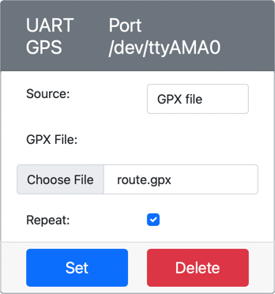

<!--
CO_OP_TRANSLATOR_METADATA:
{
  "original_hash": "64f18a8f8aaa1fef5e7320e0992d8b3a",
  "translation_date": "2025-08-27T14:38:07+00:00",
  "source_file": "3-transport/lessons/1-location-tracking/virtual-device-gps-sensor.md",
  "language_code": "bn"
}
-->
# জিপিএস ডেটা পড়ুন - ভার্চুয়াল IoT হার্ডওয়্যার

এই পাঠের এই অংশে, আপনি আপনার ভার্চুয়াল IoT ডিভাইসে একটি জিপিএস সেন্সর যোগ করবেন এবং এর থেকে ডেটা পড়বেন।

## ভার্চুয়াল হার্ডওয়্যার

ভার্চুয়াল IoT ডিভাইস একটি সিমুলেটেড জিপিএস সেন্সর ব্যবহার করবে, যা সিরিয়াল পোর্টের মাধ্যমে UART-এ অ্যাক্সেসযোগ্য।

একটি ফিজিক্যাল জিপিএস সেন্সরে একটি অ্যান্টেনা থাকবে যা জিপিএস স্যাটেলাইট থেকে রেডিও তরঙ্গ গ্রহণ করবে এবং জিপিএস সংকেতকে জিপিএস ডেটায় রূপান্তর করবে। ভার্চুয়াল সংস্করণটি এটি সিমুলেট করে, যা আপনাকে হয় একটি নির্দিষ্ট latitude এবং longitude সেট করতে, কাঁচা NMEA বাক্য পাঠাতে, অথবা একটি GPX ফাইল আপলোড করতে দেয়, যাতে একাধিক অবস্থান ধারাবাহিকভাবে ফেরত দেওয়া যায়।

> 🎓 NMEA বাক্যগুলো এই পাঠে পরে আলোচনা করা হবে

### CounterFit-এ সেন্সর যোগ করুন

ভার্চুয়াল জিপিএস সেন্সর ব্যবহার করতে, আপনাকে এটি CounterFit অ্যাপে যোগ করতে হবে।

#### কাজ - CounterFit-এ সেন্সর যোগ করুন

CounterFit অ্যাপে জিপিএস সেন্সর যোগ করুন।

1. আপনার কম্পিউটারে `gps-sensor` নামে একটি ফোল্ডারে একটি নতুন পাইথন অ্যাপ তৈরি করুন, যেখানে একটি মাত্র ফাইল থাকবে `app.py` নামে এবং একটি পাইথন ভার্চুয়াল এনভায়রনমেন্ট থাকবে। CounterFit-এর pip প্যাকেজগুলো যোগ করুন।

    > ⚠️ [CounterFit পাইথন প্রজেক্ট তৈরি এবং সেটআপ করার নির্দেশনা প্রথম পাঠে পাওয়া যাবে](../../../1-getting-started/lessons/1-introduction-to-iot/virtual-device.md)।

1. একটি অতিরিক্ত Pip প্যাকেজ ইনস্টল করুন, যা একটি CounterFit শিম ইনস্টল করবে, যা সিরিয়াল সংযোগের মাধ্যমে UART ভিত্তিক সেন্সরের সাথে কথা বলতে পারে। নিশ্চিত করুন যে আপনি এটি একটি টার্মিনাল থেকে ইনস্টল করছেন যেখানে ভার্চুয়াল এনভায়রনমেন্ট সক্রিয় রয়েছে।

    ```sh
    pip install counterfit-shims-serial
    ```

1. নিশ্চিত করুন যে CounterFit ওয়েব অ্যাপটি চালু রয়েছে।

1. একটি জিপিএস সেন্সর তৈরি করুন:

    1. *Sensors* প্যানেলের *Create sensor* বক্সে যান, *Sensor type* ড্রপডাউন থেকে *UART GPS* নির্বাচন করুন।

    1. *Port* `/dev/ttyAMA0` এ সেট করুন।

    1. **Add** বোতামটি নির্বাচন করুন, যাতে `/dev/ttyAMA0` পোর্টে জিপিএস সেন্সর তৈরি হয়।

    

    জিপিএস সেন্সর তৈরি হবে এবং সেন্সর তালিকায় প্রদর্শিত হবে।

    

## জিপিএস সেন্সর প্রোগ্রাম করুন

ভার্চুয়াল IoT ডিভাইস এখন ভার্চুয়াল জিপিএস সেন্সর ব্যবহার করার জন্য প্রোগ্রাম করা যেতে পারে।

### কাজ - জিপিএস সেন্সর প্রোগ্রাম করুন

জিপিএস সেন্সর অ্যাপ প্রোগ্রাম করুন।

1. নিশ্চিত করুন যে `gps-sensor` অ্যাপটি VS Code-এ খোলা রয়েছে।

1. `app.py` ফাইলটি খুলুন।

1. CounterFit-এর সাথে অ্যাপটি সংযুক্ত করতে `app.py`-এর শীর্ষে নিম্নলিখিত কোড যোগ করুন:

    ```python
    from counterfit_connection import CounterFitConnection
    CounterFitConnection.init('127.0.0.1', 5000)
    ```

1. এর নিচে কিছু প্রয়োজনীয় লাইব্রেরি আমদানি করতে এবং CounterFit সিরিয়াল পোর্ট লাইব্রেরি আমদানি করতে নিম্নলিখিত কোড যোগ করুন:

    ```python
    import time
    import counterfit_shims_serial
    
    serial = counterfit_shims_serial.Serial('/dev/ttyAMA0')
    ```

    এই কোডটি `counterfit_shims_serial` Pip প্যাকেজ থেকে `serial` মডিউল আমদানি করে। এটি `/dev/ttyAMA0` সিরিয়াল পোর্টে সংযোগ স্থাপন করে - এটি সেই সিরিয়াল পোর্টের ঠিকানা যা ভার্চুয়াল জিপিএস সেন্সর তার UART পোর্টের জন্য ব্যবহার করে।

1. এর নিচে সিরিয়াল পোর্ট থেকে ডেটা পড়তে এবং কনসোলে প্রিন্ট করতে নিম্নলিখিত কোড যোগ করুন:

    ```python
    def print_gps_data(line):
        print(line.rstrip())
    
    while True:
        line = serial.readline().decode('utf-8')
    
        while len(line) > 0:
            print_gps_data(line)
            line = serial.readline().decode('utf-8')
    
        time.sleep(1)
    ```

    একটি ফাংশন `print_gps_data` সংজ্ঞায়িত করা হয়েছে, যা কনসোলে প্রিন্ট করার জন্য পাস করা লাইনের ডেটা ব্যবহার করে।

    এরপর কোডটি অনন্ত লুপে চলে, প্রতিটি লুপে সিরিয়াল পোর্ট থেকে যতগুলি সম্ভব টেক্সট লাইন পড়ে। এটি প্রতিটি লাইনের জন্য `print_gps_data` ফাংশন কল করে।

    সমস্ত ডেটা পড়ার পর, লুপটি ১ সেকেন্ডের জন্য থামে এবং পুনরায় চেষ্টা করে।

1. এই কোডটি চালান, নিশ্চিত করুন যে আপনি CounterFit অ্যাপ চালানোর জন্য ব্যবহৃত টার্মিনাল থেকে আলাদা একটি টার্মিনাল ব্যবহার করছেন, যাতে CounterFit অ্যাপ চালু থাকে।

1. CounterFit অ্যাপ থেকে জিপিএস সেন্সরের মান পরিবর্তন করুন। এটি নিম্নলিখিত উপায়ে করা যেতে পারে:

    * **Source**-কে `Lat/Lon`-এ সেট করুন এবং একটি নির্দিষ্ট latitude, longitude এবং স্যাটেলাইট সংখ্যা নির্ধারণ করুন। এই মানটি কেবল একবার পাঠানো হবে, তাই **Repeat** বক্স চেক করুন যাতে ডেটা প্রতি সেকেন্ডে পুনরাবৃত্তি হয়।

      

    * **Source**-কে `NMEA`-তে সেট করুন এবং কিছু NMEA বাক্য টেক্সট বক্সে যোগ করুন। এই মানগুলো পাঠানো হবে, যেখানে প্রতিটি নতুন GGA (অবস্থান নির্ধারণ) বাক্য পাঠানোর আগে ১ সেকেন্ডের বিলম্ব থাকবে।

      

      আপনি [nmeagen.org](https://www.nmeagen.org)-এর মতো একটি টুল ব্যবহার করে মানচিত্রে আঁকতে এই বাক্যগুলো তৈরি করতে পারেন। এই মানগুলো কেবল একবার পাঠানো হবে, তাই **Repeat** বক্স চেক করুন যাতে সমস্ত ডেটা পাঠানোর পর প্রতি সেকেন্ডে পুনরাবৃত্তি হয়।

    * **Source**-কে GPX ফাইলে সেট করুন এবং একটি GPX ফাইল আপলোড করুন যেখানে ট্র্যাক অবস্থান রয়েছে। আপনি [AllTrails](https://www.alltrails.com/)-এর মতো জনপ্রিয় মানচিত্র এবং হাইকিং সাইট থেকে GPX ফাইল ডাউনলোড করতে পারেন। এই ফাইলগুলোতে একাধিক জিপিএস অবস্থান একটি ট্রেইল হিসেবে থাকে এবং জিপিএস সেন্সর প্রতি ১ সেকেন্ডে একটি নতুন অবস্থান ফেরত দেবে।

      

      এই মানগুলো কেবল একবার পাঠানো হবে, তাই **Repeat** বক্স চেক করুন যাতে সমস্ত ডেটা পাঠানোর পর প্রতি সেকেন্ডে পুনরাবৃত্তি হয়।

    একবার জিপিএস সেটিংস কনফিগার হয়ে গেলে, **Set** বোতামটি নির্বাচন করুন যাতে এই মানগুলো সেন্সরে প্রয়োগ হয়।

1. আপনি জিপিএস সেন্সরের কাঁচা আউটপুট দেখতে পাবেন, যা নিম্নলিখিতর মতো হতে পারে:

    ```output
    $GNGGA,020604.001,4738.538654,N,12208.341758,W,1,3,,164.7,M,-17.1,M,,*67
    $GNGGA,020604.001,4738.538654,N,12208.341758,W,1,3,,164.7,M,-17.1,M,,*67
    ```

> 💁 আপনি এই কোডটি [code-gps/virtual-device](../../../../../3-transport/lessons/1-location-tracking/code-gps/virtual-device) ফোল্ডারে খুঁজে পেতে পারেন।

😀 আপনার জিপিএস সেন্সর প্রোগ্রাম সফল হয়েছে!

---

**অস্বীকৃতি**:  
এই নথিটি AI অনুবাদ পরিষেবা [Co-op Translator](https://github.com/Azure/co-op-translator) ব্যবহার করে অনুবাদ করা হয়েছে। আমরা যথাসাধ্য সঠিকতার জন্য চেষ্টা করি, তবে অনুগ্রহ করে মনে রাখুন যে স্বয়ংক্রিয় অনুবাদে ত্রুটি বা অসঙ্গতি থাকতে পারে। মূল ভাষায় থাকা নথিটিকে প্রামাণিক উৎস হিসেবে বিবেচনা করা উচিত। গুরুত্বপূর্ণ তথ্যের জন্য, পেশাদার মানব অনুবাদ সুপারিশ করা হয়। এই অনুবাদ ব্যবহারের ফলে কোনো ভুল বোঝাবুঝি বা ভুল ব্যাখ্যা হলে আমরা দায়বদ্ধ থাকব না।