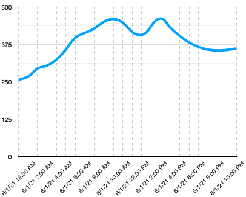

<!--
CO_OP_TRANSLATOR_METADATA:
{
  "original_hash": "9095c61445c2bca7245ef9b59a186a11",
  "translation_date": "2025-08-27T14:50:44+00:00",
  "source_file": "3-transport/lessons/3-visualize-location-data/README.md",
  "language_code": "bn"
}
-->
# অবস্থান ডেটা ভিজুয়ালাইজ করুন


> স্কেচনোট করেছেন [নিত্য নারাসিমহান](https://github.com/nitya)। বড় সংস্করণের জন্য ছবিতে ক্লিক করুন।

এই ভিডিওটি Azure Maps এবং IoT-এর একটি ওভারভিউ দেয়, যা এই পাঠে আলোচনা করা হবে।

[](https://www.youtube.com/watch?v=P5i2GFTtb2s)

> 🎥 উপরের ছবিতে ক্লিক করে ভিডিওটি দেখুন

## লেকচারের আগে কুইজ

[লেকচারের আগে কুইজ](https://black-meadow-040d15503.1.azurestaticapps.net/quiz/25)

## ভূমিকা

গত পাঠে আপনি শিখেছেন কীভাবে আপনার সেন্সর থেকে GPS ডেটা সংগ্রহ করে সার্ভারলেস কোড ব্যবহার করে ক্লাউডে একটি স্টোরেজ কন্টেইনারে সংরক্ষণ করতে হয়। এখন আপনি শিখবেন কীভাবে সেই পয়েন্টগুলোকে Azure মানচিত্রে ভিজুয়ালাইজ করতে হয়। আপনি শিখবেন কীভাবে একটি ওয়েব পৃষ্ঠায় একটি মানচিত্র তৈরি করতে হয়, GeoJSON ডেটা ফরম্যাট সম্পর্কে জানতে এবং কীভাবে এটি ব্যবহার করে আপনার মানচিত্রে সমস্ত সংগৃহীত GPS পয়েন্ট প্লট করতে হয়।

এই পাঠে আমরা আলোচনা করব:

* [ডেটা ভিজুয়ালাইজেশন কী](../../../../../3-transport/lessons/3-visualize-location-data)
* [মানচিত্র পরিষেবা](../../../../../3-transport/lessons/3-visualize-location-data)
* [একটি Azure Maps রিসোর্স তৈরি করুন](../../../../../3-transport/lessons/3-visualize-location-data)
* [ওয়েব পৃষ্ঠায় একটি মানচিত্র দেখান](../../../../../3-transport/lessons/3-visualize-location-data)
* [GeoJSON ফরম্যাট](../../../../../3-transport/lessons/3-visualize-location-data)
* [GeoJSON ব্যবহার করে মানচিত্রে GPS ডেটা প্লট করুন](../../../../../3-transport/lessons/3-visualize-location-data)

> 💁 এই পাঠে সামান্য HTML এবং JavaScript ব্যবহার করা হবে। আপনি যদি HTML এবং JavaScript ব্যবহার করে ওয়েব ডেভেলপমেন্ট সম্পর্কে আরও জানতে চান, [শুরুদের জন্য ওয়েব ডেভেলপমেন্ট](https://github.com/microsoft/Web-Dev-For-Beginners) দেখুন।

## ডেটা ভিজুয়ালাইজেশন কী

ডেটা ভিজুয়ালাইজেশন, নাম থেকেই বোঝা যায়, ডেটাকে এমনভাবে চিত্রিত করা যাতে এটি মানুষের জন্য সহজে বোঝা যায়। এটি সাধারণত চার্ট এবং গ্রাফের সাথে যুক্ত, তবে এটি যেকোনো পদ্ধতিতে ডেটাকে চিত্রিত করে উপস্থাপন করার একটি উপায়, যা মানুষকে ডেটা আরও ভালোভাবে বুঝতে এবং সিদ্ধান্ত নিতে সাহায্য করে।

একটি সহজ উদাহরণ নেওয়া যাক - ফার্ম প্রকল্পে আপনি মাটির আর্দ্রতার রিডিং সংগ্রহ করেছিলেন। ২০২১ সালের ১লা জুন প্রতি ঘণ্টায় সংগৃহীত মাটির আর্দ্রতার ডেটার একটি টেবিল নিম্নরূপ হতে পারে:

| তারিখ            | রিডিং  |
| ---------------- | ------: |
| ০১/০৬/২০২১ ০০:০০ |     ২৫৭ |
| ০১/০৬/২০২১ ০১:০০ |     ২৬৮ |
| ০১/০৬/২০২১ ০২:০০ |     ২৯৫ |
| ০১/০৬/২০২১ ০৩:০০ |     ৩০৫ |
| ০১/০৬/২০২১ ০৪:০০ |     ৩২৫ |
| ০১/০৬/২০২১ ০৫:০০ |     ৩৫৯ |
| ০১/০৬/২০২১ ০৬:০০ |     ৩৯৮ |
| ০১/০৬/২০২১ ০৭:০০ |     ৪১০ |
| ০১/০৬/২০২১ ০৮:০০ |     ৪২৯ |
| ০১/০৬/২০২১ ০৯:০০ |     ৪৫১ |
| ০১/০৬/২০২১ ১০:০০ |     ৪৬০ |
| ০১/০৬/২০২১ ১১:০০ |     ৪৫২ |
| ০১/০৬/২০২১ ১২:০০ |     ৪২০ |
| ০১/০৬/২০২১ ১৩:০০ |     ৪০৮ |
| ০১/০৬/২০২১ ১৪:০০ |     ৪৩১ |
| ০১/০৬/২০২১ ১৫:০০ |     ৪৬২ |
| ০১/০৬/২০২১ ১৬:০০ |     ৪৩২ |
| ০১/০৬/২০২১ ১৭:০০ |     ৪০২ |
| ০১/০৬/২০২১ ১৮:০০ |     ৩৮৭ |
| ০১/০৬/২০২১ ১৯:০০ |     ৩৬০ |
| ০১/০৬/২০২১ ২০:০০ |     ৩৫৮ |
| ০১/০৬/২০২১ ২১:০০ |     ৩৫৪ |
| ০১/০৬/২০২১ ২২:০০ |     ৩৫৬ |
| ০১/০৬/২০২১ ২৩:০০ |     ৩৬২ |

মানুষ হিসেবে এই ডেটা বোঝা কঠিন হতে পারে। এটি শুধুমাত্র সংখ্যার একটি প্রাচীর, যার কোনো অর্থ বোঝা যায় না। এই ডেটাকে ভিজুয়ালাইজ করার প্রথম ধাপ হতে পারে এটি একটি লাইন চার্টে প্লট করা:


এটি আরও উন্নত করা যেতে পারে একটি লাইন যোগ করে, যা দেখায় যে মাটির আর্দ্রতার রিডিং ৪৫০-এ পৌঁছালে স্বয়ংক্রিয় সেচ ব্যবস্থা চালু হয়েছিল:



এই চার্টটি খুব দ্রুত দেখায় মাটির আর্দ্রতার মাত্রা কী ছিল এবং সেচ ব্যবস্থা চালু হওয়ার পয়েন্টগুলো।

চার্টই ডেটা ভিজুয়ালাইজ করার একমাত্র উপায় নয়। আবহাওয়া ট্র্যাক করা IoT ডিভাইসগুলো ওয়েব অ্যাপ বা মোবাইল অ্যাপ ব্যবহার করে আবহাওয়ার অবস্থা চিত্রিত করতে পারে, যেমন মেঘলা দিনের জন্য মেঘের প্রতীক, বৃষ্টির দিনের জন্য বৃষ্টির মেঘের প্রতীক ইত্যাদি। ডেটা ভিজুয়ালাইজ করার অনেক উপায় রয়েছে, কিছু গুরুতর, কিছু মজার।

✅ ভাবুন আপনি কীভাবে ডেটা ভিজুয়ালাইজ হতে দেখেছেন। কোন পদ্ধতিগুলো সবচেয়ে পরিষ্কার ছিল এবং দ্রুত সিদ্ধান্ত নিতে সাহায্য করেছে?

সেরা ভিজুয়ালাইজেশনগুলো মানুষকে দ্রুত সিদ্ধান্ত নিতে সাহায্য করে। উদাহরণস্বরূপ, শিল্প যন্ত্রপাতি থেকে বিভিন্ন রিডিং দেখানোর জন্য একটি গেজের প্রাচীর বোঝা কঠিন হতে পারে, কিন্তু কিছু ভুল হলে একটি লাল আলো জ্বলে উঠলে মানুষ দ্রুত সিদ্ধান্ত নিতে পারে। কখনও কখনও সেরা ভিজুয়ালাইজেশন একটি জ্বলন্ত আলো!

GPS ডেটার সাথে কাজ করার সময়, সবচেয়ে পরিষ্কার ভিজুয়ালাইজেশন হতে পারে ডেটাকে মানচিত্রে প্লট করা। উদাহরণস্বরূপ, একটি মানচিত্রে ডেলিভারি ট্রাক দেখালে একটি প্রসেসিং প্ল্যান্টের কর্মীরা দেখতে পারেন কখন ট্রাকগুলো পৌঁছাবে। যদি এই মানচিত্রটি কেবল ট্রাকের বর্তমান অবস্থানের ছবি দেখানোর চেয়ে বেশি কিছু দেখায়, যেমন ট্রাকের বিষয়বস্তু সম্পর্কে ধারণা দেয়, তাহলে প্ল্যান্টের কর্মীরা সেই অনুযায়ী পরিকল্পনা করতে পারেন - যদি তারা কাছাকাছি একটি রেফ্রিজারেটেড ট্রাক দেখে, তারা ফ্রিজে জায়গা প্রস্তুত করতে জানে। 

## মানচিত্র পরিষেবা

মানচিত্র নিয়ে কাজ করা একটি আকর্ষণীয় কাজ, এবং বেছে নেওয়ার জন্য অনেক পরিষেবা রয়েছে, যেমন Bing Maps, Leaflet, Open Street Maps, এবং Google Maps। এই পাঠে, আপনি [Azure Maps](https://azure.microsoft.com/services/azure-maps/?WT.mc_id=academic-17441-jabenn) এবং কীভাবে এটি আপনার GPS ডেটা প্রদর্শন করতে পারে তা শিখবেন।


Azure Maps হলো "একটি ভূ-স্থানিক পরিষেবা এবং SDK-এর সংগ্রহ, যা ওয়েব এবং মোবাইল অ্যাপ্লিকেশনে ভৌগোলিক প্রেক্ষাপট প্রদান করতে তাজা মানচিত্র ডেটা ব্যবহার করে।" ডেভেলপারদের সরঞ্জাম সরবরাহ করা হয় সুন্দর, ইন্টারঅ্যাকটিভ মানচিত্র তৈরি করতে, যা ট্রাফিক রুট সুপারিশ, ট্রাফিক ঘটনার তথ্য প্রদান, ইনডোর নেভিগেশন, অনুসন্ধান ক্ষমতা, উচ্চতা তথ্য, আবহাওয়া পরিষেবা এবং আরও অনেক কিছু করতে পারে।

✅ কিছু [মানচিত্র কোড নমুনা](https://docs.microsoft.com/samples/browse?WT.mc_id=academic-17441-jabenn&products=azure-maps) নিয়ে পরীক্ষা করুন

আপনি মানচিত্রগুলোকে একটি ফাঁকা ক্যানভাস, টাইলস, স্যাটেলাইট চিত্র, রাস্তা সহ স্যাটেলাইট চিত্র, বিভিন্ন ধরণের গ্রেস্কেল মানচিত্র, ছায়াযুক্ত রিলিফ সহ মানচিত্র, নাইট ভিউ মানচিত্র এবং একটি উচ্চ কনট্রাস্ট মানচিত্র হিসাবে প্রদর্শন করতে পারেন। [Azure Event Grid](https://azure.microsoft.com/services/event-grid/?WT.mc_id=academic-17441-jabenn)-এর সাথে একীভূত করে আপনার মানচিত্রে রিয়েল-টাইম আপডেট পেতে পারেন। আপনি বিভিন্ন নিয়ন্ত্রণ সক্রিয় করে মানচিত্রের চেহারা এবং আচরণ নিয়ন্ত্রণ করতে পারেন, যাতে মানচিত্রটি পিঞ্চ, ড্র্যাগ এবং ক্লিকের মতো ইভেন্টগুলিতে প্রতিক্রিয়া জানায়। আপনার মানচিত্রের চেহারা নিয়ন্ত্রণ করতে, আপনি বুদবুদ, লাইন, বহুভুজ, হিট ম্যাপ এবং আরও অনেক কিছু সহ স্তর যোগ করতে পারেন। আপনি কোন স্টাইলের মানচিত্র বাস্তবায়ন করবেন তা আপনার SDK পছন্দের উপর নির্ভর করে।

আপনি Azure Maps API-তে অ্যাক্সেস করতে পারেন এর [REST API](https://docs.microsoft.com/javascript/api/azure-maps-rest/?WT.mc_id=academic-17441-jabenn&view=azure-maps-typescript-latest), এর [Web SDK](https://docs.microsoft.com/azure/azure-maps/how-to-use-map-control?WT.mc_id=academic-17441-jabenn), অথবা, যদি আপনি একটি মোবাইল অ্যাপ তৈরি করছেন, এর [Android SDK](https://docs.microsoft.com/azure/azure-maps/how-to-use-android-map-control-library?WT.mc_id=academic-17441-jabenn&pivots=programming-language-java-android) ব্যবহার করে।

এই পাঠে, আপনি ওয়েব SDK ব্যবহার করে একটি মানচিত্র আঁকবেন এবং আপনার সেন্সরের GPS অবস্থানের পথ প্রদর্শন করবেন। 

## একটি Azure Maps রিসোর্স তৈরি করুন

আপনার প্রথম ধাপ হলো একটি Azure Maps অ্যাকাউন্ট তৈরি করা। 

### কাজ - একটি Azure Maps রিসোর্স তৈরি করুন

1. আপনার টার্মিনাল বা কমান্ড প্রম্পট থেকে নিম্নলিখিত কমান্ডটি চালান `gps-sensor` রিসোর্স গ্রুপে একটি Azure Maps রিসোর্স তৈরি করতে:

    ```sh
    az maps account create --name gps-sensor \
                           --resource-group gps-sensor \
                           --accept-tos \
                           --sku S1
    ```

    এটি একটি `gps-sensor` নামে একটি Azure Maps রিসোর্স তৈরি করবে। ব্যবহৃত টিয়ারটি হলো `S1`, যা একটি পেইড টিয়ার, তবে এটি বিনামূল্যে একটি উদার পরিমাণ কল অন্তর্ভুক্ত করে।

    > 💁 Azure Maps ব্যবহারের খরচ দেখতে, [Azure Maps মূল্য নির্ধারণ পৃষ্ঠা](https://azure.microsoft.com/pricing/details/azure-maps/?WT.mc_id=academic-17441-jabenn) দেখুন।

1. মানচিত্র রিসোর্সের জন্য একটি API কী প্রয়োজন হবে। এই কীটি পেতে নিম্নলিখিত কমান্ডটি ব্যবহার করুন:

    ```sh
    az maps account keys list --name gps-sensor \
                              --resource-group gps-sensor \
                              --output table
    ```

    `PrimaryKey` মানটি কপি করে নিন। 

## ওয়েব পৃষ্ঠায় একটি মানচিত্র দেখান

এখন আপনি পরবর্তী ধাপে যেতে পারেন, যা হলো একটি ওয়েব পৃষ্ঠায় আপনার মানচিত্র প্রদর্শন করা। আমরা আপনার ছোট ওয়েব অ্যাপের জন্য কেবল একটি `html` ফাইল ব্যবহার করব; মনে রাখবেন যে একটি প্রোডাকশন বা টিম পরিবেশে, আপনার ওয়েব অ্যাপে আরও অনেক অংশ থাকতে পারে! 

### কাজ - ওয়েব পৃষ্ঠায় একটি মানচিত্র দেখান

1. আপনার স্থানীয় কম্পিউটারে কোথাও একটি ফোল্ডারে `index.html` নামে একটি ফাইল তৈরি করুন। একটি মানচিত্র ধারণ করার জন্য HTML মার্কআপ যোগ করুন:

    ```html
    <html>
    <head>
        <style>
            #myMap {
                width:100%;
                height:100%;
            }
        </style>
    </head>
    
    <body onload="init()">
        <div id="myMap"></div>
    </body>
    </html>
    ```

    মানচিত্রটি `myMap` `div`-এ লোড হবে। কয়েকটি স্টাইল এটিকে পৃষ্ঠার প্রস্থ এবং উচ্চতা জুড়ে প্রসারিত করতে দেয়।

    > 🎓 একটি `div` হলো একটি ওয়েব পৃষ্ঠার একটি অংশ, যা নামকরণ এবং স্টাইল করা যায়।

1. `<head>` ট্যাগের নিচে, মানচিত্র প্রদর্শন নিয়ন্ত্রণ করার জন্য একটি বাহ্যিক স্টাইল শীট এবং এর আচরণ পরিচালনা করার জন্য Web SDK থেকে একটি বাহ্যিক স্ক্রিপ্ট যোগ করুন:

    ```html
    <link rel="stylesheet" href="https://atlas.microsoft.com/sdk/javascript/mapcontrol/2/atlas.min.css" type="text/css" />
    <script src="https://atlas.microsoft.com/sdk/javascript/mapcontrol/2/atlas.min.js"></script>
    ```

    এই স্টাইল শীটে মানচিত্রের চেহারার সেটিংস রয়েছে এবং স্ক্রিপ্ট ফাইলে মানচিত্র লোড করার কোড রয়েছে। এই কোড যোগ করা C++ হেডার ফাইল অন্তর্ভুক্ত করা বা Python মডিউল আমদানি করার মতো।

1. সেই স্ক্রিপ্টের নিচে, মানচিত্র চালু করার জন্য একটি স্ক্রিপ্ট ব্লক যোগ করুন।

    ```javascript
    <script type='text/javascript'>
        function init() {
            var map = new atlas.Map('myMap', {
                center: [-122.26473, 47.73444],
                zoom: 12,
                authOptions: {
                    authType: "subscriptionKey",
                    subscriptionKey: "<subscription_key>",

                }
            });
        }
    </script>
    ```

    `<subscription_key>`-এর জায়গায় আপনার Azure Maps অ্যাকাউন্টের API কীটি প্রতিস্থাপন করুন।

    যদি আপনি আপনার `index.html` পৃষ্ঠাটি একটি ওয়েব ব্রাউজারে খুলেন, তবে আপনি একটি মানচিত্র দেখতে পাবেন, যা সিয়াটল এলাকায় কেন্দ্রীভূত।

    

    ✅ আপনার মানচিত্র প্রদর্শন পরিবর্তন করতে জুম এবং কেন্দ্র প্যারামিটার নিয়ে পরীক্ষা করুন। আপনার ডেটার অক্ষাংশ এবং দ্রাঘিমাংশের সাথে সম্পর্কিত বিভিন্ন কোঅর্ডিনেট যোগ করে মানচিত্রটি পুনরায় কেন্দ্রীভূত করতে পারেন।

> 💁 স্থানীয়ভাবে ওয়েব অ্যাপ নিয়ে কাজ করার একটি ভালো উপায় হলো [http-server](https://www.npmjs.com/package/http-server) ইনস্টল করা। এই টুলটি ব্যবহার করার আগে [node.js](https://nodejs.org/) এবং [npm](https://www.npmjs.com/) ইনস্টল করা প্রয়োজন। একবার এই টুলগুলো ইনস্টল হয়ে গেলে, আপনি আপনার `index.html` ফাইলের অবস্থানে যেতে পারেন এবং `http-server` টাইপ করতে পারেন। ওয়েব অ্যাপটি একটি স্থানীয় ওয়েবসার্ভারে [http://127.0.0.1:8080/](http://127.0.0.1:8080/) খুলবে।

## GeoJSON ফরম্যাট

এখন যেহেতু আপনার ওয়েব অ্যাপটি মানচিত্র সহ প্রদর্শিত হচ্ছে, আপনাকে আপনার স্টোরেজ অ্যাকাউন্ট থেকে GPS ডেটা বের করতে হবে এবং মানচিত্রের উপরে একটি স্তরে মার্কার হিসেবে প্রদর্শন করতে হবে। তার আগে, আসুন [GeoJSON](https://wikipedia.org/wiki/GeoJSON) ফরম্যাটটি দেখি, যা Azure Maps দ্বারা প্রয়োজন।

[GeoJSON](https://geojson.org/) হলো একটি ওপেন স্ট্যান্ডার্ড JSON স্পেসিফিকেশন, যা ভৌগোলিক-নির্দিষ্ট ডেটা পরিচালনার জন্য বিশেষভাবে ফরম্যাট করা হয়েছে। আপনি এটি সম্পর্কে শিখতে পারেন নমুনা ডেটা পরীক্ষা করে [geojson.io](https://geojson.io) ব্যবহার করে, যা GeoJSON ফাইল ডিবাগ করার জন্যও একটি দরকারী টুল।

নমুনা GeoJSON ডেটা দেখতে এরকম:

```json
{
  "type": "FeatureCollection",
  "features": [
    {
      "type": "Feature",
      "geometry": {
        "type": "Point",
        "coordinates": [
          -2.10237979888916,
          57.164918677004714
        ]
      }
    }
  ]
}
```

বিশেষভাবে লক্ষ্য করুন কীভাবে ডেটা একটি `FeatureCollection`-এর মধ্যে একটি `Feature` হিসেবে নেস্ট করা হয়েছে। এর মধ্যে `geometry` রয়েছে, যেখানে `coordinates` অক্ষাংশ এবং দ্রাঘিমাংশ নির্দেশ করে।

✅ আপনার GeoJSON তৈরি করার সময়, অবজেক্টে `latitude` এবং `longitude`-এর ক্রমের দিকে মনোযোগ দিন, নাহলে আপনার পয়েন্টগুলো সঠিক স্থানে প্রদর্শিত হবে না! GeoJSON পয়েন্টের জন্য `lon,lat` ক্রমে ডেটা আশা করে, `lat,lon` নয়।

`Geometry`-এর বিভিন্ন ধরণ থাকতে পারে, যেমন একটি একক পয়েন্ট বা একটি বহুভুজ। এই উদাহরণে, এটি একটি পয়েন্ট, যেখানে দুটি কোঅর্ডিনেট নির্দিষ্ট করা হয়েছে, দ্রাঘিমাংশ এবং অক্ষাংশ।
✅ Azure Maps স্ট্যান্ডার্ড GeoJSON সমর্থন করে এবং কিছু [উন্নত বৈশিষ্ট্য](https://docs.microsoft.com/azure/azure-maps/extend-geojson?WT.mc_id=academic-17441-jabenn) অন্তর্ভুক্ত করে, যার মধ্যে বৃত্ত এবং অন্যান্য জ্যামিতিক আকার আঁকার ক্ষমতা রয়েছে।

## GeoJSON ব্যবহার করে মানচিত্রে GPS ডেটা প্রদর্শন করুন

এখন আপনি পূর্ববর্তী পাঠে তৈরি করা স্টোরেজ থেকে ডেটা ব্যবহার করতে প্রস্তুত। মনে করিয়ে দেওয়ার জন্য, এটি blob স্টোরেজে একাধিক ফাইল হিসেবে সংরক্ষিত, তাই আপনাকে ফাইলগুলো পুনরুদ্ধার করতে হবে এবং সেগুলো পার্স করতে হবে যাতে Azure Maps ডেটা ব্যবহার করতে পারে।

### কাজ - ওয়েব পেজ থেকে স্টোরেজ অ্যাক্সেস করার জন্য কনফিগার করুন

যদি আপনি আপনার স্টোরেজ থেকে ডেটা আনতে কল করেন, তাহলে আপনি ব্রাউজারের কনসোলে ত্রুটি দেখতে পারেন। এর কারণ হলো, আপনাকে এই স্টোরেজে [CORS](https://developer.mozilla.org/docs/Web/HTTP/CORS) অনুমতি সেট করতে হবে যাতে বাইরের ওয়েব অ্যাপ্লিকেশনগুলো এর ডেটা পড়তে পারে।

> 🎓 CORS এর পূর্ণরূপ "Cross-Origin Resource Sharing" এবং সাধারণত নিরাপত্তার কারণে Azure-এ স্পষ্টভাবে সেট করতে হয়। এটি অপ্রত্যাশিত সাইটগুলোকে আপনার ডেটা অ্যাক্সেস করা থেকে বাধা দেয়।

1. CORS সক্রিয় করতে নিম্নলিখিত কমান্ডটি চালান:

    ```sh
    az storage cors add --methods GET \
                        --origins "*" \
                        --services b \
                        --account-name <storage_name> \
                        --account-key <key1>
    ```

    `<storage_name>` এর স্থানে আপনার স্টোরেজ অ্যাকাউন্টের নাম দিন। `<key1>` এর স্থানে আপনার স্টোরেজ অ্যাকাউন্টের অ্যাকাউন্ট কী দিন।

    এই কমান্ডটি যেকোনো ওয়েবসাইটকে (wildcard `*` মানে যেকোনো) *GET* অনুরোধ করার অনুমতি দেয়, অর্থাৎ আপনার স্টোরেজ অ্যাকাউন্ট থেকে ডেটা আনতে। `--services b` নির্দেশ করে যে এই সেটিং শুধুমাত্র blob-এর জন্য প্রযোজ্য।

### কাজ - স্টোরেজ থেকে GPS ডেটা লোড করুন

1. `init` ফাংশনের সম্পূর্ণ বিষয়বস্তু নিম্নলিখিত কোড দিয়ে প্রতিস্থাপন করুন:

    ```javascript
    fetch("https://<storage_name>.blob.core.windows.net/gps-data/?restype=container&comp=list")
        .then(response => response.text())
        .then(str => new window.DOMParser().parseFromString(str, "text/xml"))
        .then(xml => {
            let blobList = Array.from(xml.querySelectorAll("Url"));
                blobList.forEach(async blobUrl => {
                    loadJSON(blobUrl.innerHTML)                
        });
    })
    .then( response => {
        map = new atlas.Map('myMap', {
            center: [-122.26473, 47.73444],
            zoom: 14,
            authOptions: {
                authType: "subscriptionKey",
                subscriptionKey: "<subscription_key>",
    
            }
        });
        map.events.add('ready', function () {
            var source = new atlas.source.DataSource();
            map.sources.add(source);
            map.layers.add(new atlas.layer.BubbleLayer(source));
            source.add(features);
        })
    })
    ```

    `<storage_name>` এর স্থানে আপনার স্টোরেজ অ্যাকাউন্টের নাম দিন। `<subscription_key>` এর স্থানে আপনার Azure Maps অ্যাকাউন্টের API কী দিন।

    এখানে কয়েকটি গুরুত্বপূর্ণ কাজ হচ্ছে। প্রথমে, কোডটি আপনার blob কন্টেইনার থেকে GPS ডেটা আনতে একটি URL এন্ডপয়েন্ট ব্যবহার করে যা আপনার স্টোরেজ অ্যাকাউন্টের নাম দিয়ে তৈরি। এই URL `gps-data` থেকে ডেটা পুনরুদ্ধার করে, যা নির্দেশ করে যে রিসোর্স টাইপটি একটি কন্টেইনার (`restype=container`), এবং সমস্ত blob-এর তথ্য তালিকাভুক্ত করে। এই তালিকা blob নিজেই ফেরত দেয় না, তবে প্রতিটি blob-এর জন্য একটি URL ফেরত দেয় যা blob ডেটা লোড করতে ব্যবহার করা যেতে পারে।

    > 💁 আপনি এই URLটি আপনার ব্রাউজারে রাখতে পারেন এবং আপনার কন্টেইনারে থাকা সমস্ত blob-এর বিবরণ দেখতে পারেন। প্রতিটি আইটেমের একটি `Url` প্রপার্টি থাকবে যা আপনি ব্রাউজারে লোড করে blob-এর বিষয়বস্তু দেখতে পারেন।

    এই কোডটি প্রতিটি blob লোড করে, একটি `loadJSON` ফাংশন কল করে, যা পরবর্তী ধাপে তৈরি করা হবে। এরপর এটি মানচিত্র নিয়ন্ত্রণ তৈরি করে এবং `ready` ইভেন্টে কোড যোগ করে। এই ইভেন্টটি তখন কল করা হয় যখন মানচিত্রটি ওয়েব পেজে প্রদর্শিত হয়।

    `ready` ইভেন্ট একটি Azure Maps ডেটা সোর্স তৈরি করে - একটি কন্টেইনার যা GeoJSON ডেটা ধারণ করে যা পরে পূরণ করা হবে। এই ডেটা সোর্সটি ব্যবহার করে একটি bubble layer তৈরি করা হয় - অর্থাৎ GeoJSON-এর প্রতিটি পয়েন্টের উপর কেন্দ্রীভূত বৃত্তের সেট।

1. `init` ফাংশনের নিচে আপনার স্ক্রিপ্ট ব্লকে `loadJSON` ফাংশন যোগ করুন:

    ```javascript
    var map, features;

    function loadJSON(file) {
        var xhr = new XMLHttpRequest();
        features = [];
        xhr.onreadystatechange = function () {
            if (xhr.readyState === XMLHttpRequest.DONE) {
                if (xhr.status === 200) {
                    gps = JSON.parse(xhr.responseText)
                    features.push(
                        new atlas.data.Feature(new atlas.data.Point([parseFloat(gps.gps.lon), parseFloat(gps.gps.lat)]))
                    )
                }
            }
        };
        xhr.open("GET", file, true);
        xhr.send();
    }    
    ```

    এই ফাংশনটি fetch রুটিন দ্বারা কল করা হয় JSON ডেটা পার্স করার জন্য এবং এটিকে GeoJSON হিসেবে longitude এবং latitude কোঅর্ডিনেট হিসেবে পড়ার জন্য রূপান্তরিত করে। 
    পার্স করার পর, ডেটা GeoJSON `Feature` হিসেবে সেট করা হয়। মানচিত্রটি ইনিশিয়ালাইজ করা হবে এবং ছোট বুদবুদগুলো আপনার ডেটা যে পথটি চিহ্নিত করছে তার চারপাশে প্রদর্শিত হবে:

1. HTML পেজটি আপনার ব্রাউজারে লোড করুন। এটি মানচিত্র লোড করবে, তারপর স্টোরেজ থেকে সমস্ত GPS ডেটা লোড করবে এবং মানচিত্রে প্রদর্শন করবে।

    

> 💁 আপনি এই কোডটি [code](../../../../../3-transport/lessons/3-visualize-location-data/code) ফোল্ডারে খুঁজে পেতে পারেন।

---

## 🚀 চ্যালেঞ্জ

মানচিত্রে স্থির ডেটা মার্কার হিসেবে প্রদর্শন করা ভালো। আপনি কি এই ওয়েব অ্যাপটি উন্নত করতে পারেন যাতে অ্যানিমেশন যোগ করা যায় এবং মার্কারগুলোর পথ সময়ের সাথে প্রদর্শন করা যায়, timestamped json ফাইল ব্যবহার করে? এখানে [কিছু নমুনা](https://azuremapscodesamples.azurewebsites.net/) রয়েছে মানচিত্রে অ্যানিমেশন ব্যবহার করার।

## পোস্ট-লেকচার কুইজ

[পোস্ট-লেকচার কুইজ](https://black-meadow-040d15503.1.azurestaticapps.net/quiz/26)

## পর্যালোচনা ও স্ব-অধ্যয়ন

Azure Maps IoT ডিভাইসের সাথে কাজ করার জন্য বিশেষভাবে উপযোগী।

* [Azure Maps ডকুমেন্টেশনে](https://docs.microsoft.com/azure/azure-maps/tutorial-iot-hub-maps?WT.mc_id=academic-17441-jabenn) এর কিছু ব্যবহার সম্পর্কে গবেষণা করুন।
* [Azure Maps-এর সাথে আপনার প্রথম রুট ফাইন্ডিং অ্যাপ তৈরি করুন](https://docs.microsoft.com/learn/modules/create-your-first-app-with-azure-maps/?WT.mc_id=academic-17441-jabenn) শিরোনামের Microsoft Learn মডিউল ব্যবহার করে মানচিত্র তৈরি এবং ওয়েপয়েন্ট সম্পর্কে আপনার জ্ঞান গভীর করুন।

## অ্যাসাইনমেন্ট

[আপনার অ্যাপ ডিপ্লয় করুন](assignment.md)

---

**অস্বীকৃতি**:  
এই নথিটি AI অনুবাদ পরিষেবা [Co-op Translator](https://github.com/Azure/co-op-translator) ব্যবহার করে অনুবাদ করা হয়েছে। আমরা যথাসম্ভব সঠিক অনুবাদ প্রদানের চেষ্টা করি, তবে অনুগ্রহ করে মনে রাখবেন যে স্বয়ংক্রিয় অনুবাদে ত্রুটি বা অসঙ্গতি থাকতে পারে। মূল ভাষায় থাকা নথিটিকে প্রামাণিক উৎস হিসেবে বিবেচনা করা উচিত। গুরুত্বপূর্ণ তথ্যের জন্য, পেশাদার মানব অনুবাদ সুপারিশ করা হয়। এই অনুবাদ ব্যবহারের ফলে কোনো ভুল বোঝাবুঝি বা ভুল ব্যাখ্যা হলে আমরা দায়বদ্ধ থাকব না।