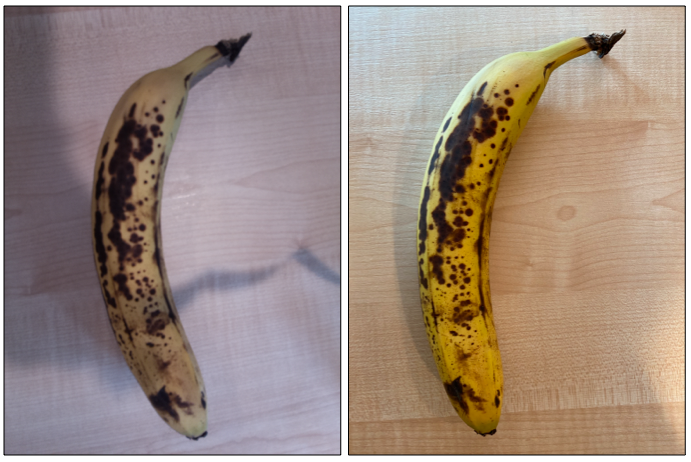

<!--
CO_OP_TRANSLATOR_METADATA:
{
  "original_hash": "557f4ee96b752e0651d2e6e74aa6bd14",
  "translation_date": "2025-08-27T10:15:15+00:00",
  "source_file": "4-manufacturing/lessons/2-check-fruit-from-device/README.md",
  "language_code": "bn"
}
-->
# IoT ডিভাইস থেকে ফলের গুণমান পরীক্ষা করুন


> স্কেচনোট: [নিত্য নারাসিমহান](https://github.com/nitya)। বড় সংস্করণের জন্য ছবিতে ক্লিক করুন।

## প্রাক-পাঠ কুইজ

[প্রাক-পাঠ কুইজ](https://black-meadow-040d15503.1.azurestaticapps.net/quiz/31)

## ভূমিকা

গত পাঠে আপনি ইমেজ ক্লাসিফায়ার সম্পর্কে শিখেছেন এবং কীভাবে সেগুলোকে ভালো এবং খারাপ ফল শনাক্ত করতে প্রশিক্ষণ দেওয়া যায়। এই ইমেজ ক্লাসিফায়ারকে একটি IoT অ্যাপ্লিকেশনে ব্যবহার করতে হলে, আপনাকে কোনো ধরনের ক্যামেরা ব্যবহার করে একটি ছবি তুলতে হবে এবং এই ছবিটি ক্লাউডে পাঠাতে হবে যাতে এটি শ্রেণীবদ্ধ করা যায়।

এই পাঠে আপনি ক্যামেরা সেন্সর সম্পর্কে শিখবেন এবং কীভাবে IoT ডিভাইসের সাথে সেগুলো ব্যবহার করে ছবি তুলতে হয়। এছাড়াও, আপনি শিখবেন কীভাবে আপনার IoT ডিভাইস থেকে ইমেজ ক্লাসিফায়ার কল করতে হয়।

এই পাঠে আমরা আলোচনা করব:

* [ক্যামেরা সেন্সর](../../../../../4-manufacturing/lessons/2-check-fruit-from-device)
* [IoT ডিভাইস ব্যবহার করে ছবি তোলা](../../../../../4-manufacturing/lessons/2-check-fruit-from-device)
* [আপনার ইমেজ ক্লাসিফায়ার প্রকাশ করা](../../../../../4-manufacturing/lessons/2-check-fruit-from-device)
* [IoT ডিভাইস থেকে ছবি শ্রেণীবদ্ধ করা](../../../../../4-manufacturing/lessons/2-check-fruit-from-device)
* [মডেল উন্নত করা](../../../../../4-manufacturing/lessons/2-check-fruit-from-device)

## ক্যামেরা সেন্সর

ক্যামেরা সেন্সর, নাম থেকেই বোঝা যায়, এমন ক্যামেরা যা আপনি আপনার IoT ডিভাইসের সাথে সংযুক্ত করতে পারেন। এগুলো স্থির ছবি তুলতে পারে বা স্ট্রিমিং ভিডিও ধারণ করতে পারে। কিছু ক্যামেরা কাঁচা ইমেজ ডেটা প্রদান করে, অন্যগুলো JPEG বা PNG-এর মতো ইমেজ ফাইলে ডেটা সংকুচিত করে। সাধারণত IoT ডিভাইসের সাথে কাজ করা ক্যামেরাগুলো ছোট এবং কম রেজোলিউশনযুক্ত হয়, তবে আপনি উচ্চ রেজোলিউশন ক্যামেরা পেতে পারেন যা শীর্ষস্থানীয় ফোনের সাথে প্রতিযোগিতা করতে পারে। আপনি বিভিন্ন ধরনের পরিবর্তনযোগ্য লেন্স, একাধিক ক্যামেরা সেটআপ, ইনফ্রা-রেড থার্মাল ক্যামেরা বা UV ক্যামেরা পেতে পারেন।


বেশিরভাগ ক্যামেরা সেন্সর ইমেজ সেন্সর ব্যবহার করে যেখানে প্রতিটি পিক্সেল একটি ফটোডায়োড। একটি লেন্স ইমেজটিকে ইমেজ সেন্সরে কেন্দ্রীভূত করে এবং হাজার হাজার বা লক্ষ লক্ষ ফটোডায়োড প্রতিটিতে পড়া আলো শনাক্ত করে এবং সেটিকে পিক্সেল ডেটা হিসেবে রেকর্ড করে।

> 💁 লেন্সগুলো ছবিকে উল্টে দেয়, তারপর ক্যামেরা সেন্সর ছবিটিকে সঠিকভাবে ঘুরিয়ে দেয়। আপনার চোখেও একই ঘটনা ঘটে - আপনি যা দেখেন তা আপনার চোখের পেছনে উল্টোভাবে শনাক্ত হয় এবং আপনার মস্তিষ্ক সেটিকে সংশোধন করে।

> 🎓 ইমেজ সেন্সরকে অ্যাক্টিভ-পিক্সেল সেন্সর (APS) বলা হয় এবং APS-এর সবচেয়ে জনপ্রিয় ধরন হলো কমপ্লিমেন্টারি মেটাল-অক্সাইড সেমিকন্ডাক্টর সেন্সর বা CMOS। আপনি হয়তো ক্যামেরা সেন্সরের জন্য CMOS সেন্সর শব্দটি শুনেছেন।

ক্যামেরা সেন্সরগুলো ডিজিটাল সেন্সর, যা ইমেজ ডেটাকে ডিজিটাল ডেটা হিসেবে পাঠায়, সাধারণত একটি লাইব্রেরির সাহায্যে যা যোগাযোগ প্রদান করে। ক্যামেরাগুলো SPI-এর মতো প্রোটোকল ব্যবহার করে সংযুক্ত হয় যাতে তারা বড় পরিমাণে ডেটা পাঠাতে পারে - ইমেজগুলো একটি তাপমাত্রা সেন্সরের মতো একক সংখ্যার তুলনায় অনেক বড়।

✅ IoT ডিভাইসের ক্ষেত্রে ইমেজ সাইজের সীমাবদ্ধতা কী কী? বিশেষ করে মাইক্রোকন্ট্রোলার হার্ডওয়্যারের সীমাবদ্ধতা নিয়ে চিন্তা করুন।

## IoT ডিভাইস ব্যবহার করে ছবি তোলা

আপনার IoT ডিভাইস ব্যবহার করে একটি ছবি তোলা এবং সেটিকে শ্রেণীবদ্ধ করা সম্ভব।

### কাজ - IoT ডিভাইস ব্যবহার করে ছবি তোলা

আপনার IoT ডিভাইস ব্যবহার করে ছবি তোলার জন্য প্রাসঙ্গিক গাইডটি অনুসরণ করুন:

* [Arduino - Wio Terminal](wio-terminal-camera.md)
* [Single-board computer - Raspberry Pi](pi-camera.md)
* [Single-board computer - Virtual device](virtual-device-camera.md)

## আপনার ইমেজ ক্লাসিফায়ার প্রকাশ করা

গত পাঠে আপনি আপনার ইমেজ ক্লাসিফায়ার প্রশিক্ষণ দিয়েছেন। আপনার IoT ডিভাইস থেকে এটি ব্যবহার করার আগে, আপনাকে মডেলটি প্রকাশ করতে হবে।

### মডেল ইটারেশন

গত পাঠে যখন আপনার মডেল প্রশিক্ষণ নিচ্ছিল, আপনি লক্ষ্য করতে পারেন যে **Performance** ট্যাবে পাশে ইটারেশনগুলো দেখানো হয়েছে। যখন আপনি প্রথম মডেলটি প্রশিক্ষণ দিয়েছিলেন, আপনি *Iteration 1* দেখতে পেতেন। যখন আপনি প্রেডিকশন ইমেজ ব্যবহার করে মডেলটি উন্নত করেছিলেন, তখন আপনি *Iteration 2* দেখতে পেতেন।

প্রতিবার আপনি মডেলটি প্রশিক্ষণ দেন, আপনি একটি নতুন ইটারেশন পান। এটি বিভিন্ন ডেটা সেটে প্রশিক্ষিত মডেলের বিভিন্ন সংস্করণ ট্র্যাক করার একটি উপায়। যখন আপনি **Quick Test** করেন, সেখানে একটি ড্রপ-ডাউন থাকে যা আপনি ইটারেশন নির্বাচন করতে ব্যবহার করতে পারেন, যাতে আপনি একাধিক ইটারেশনের মধ্যে ফলাফল তুলনা করতে পারেন।

যখন আপনি একটি ইটারেশন নিয়ে সন্তুষ্ট হন, আপনি এটি প্রকাশ করতে পারেন যাতে এটি বাইরের অ্যাপ্লিকেশনগুলো থেকে ব্যবহারযোগ্য হয়। এইভাবে আপনি একটি প্রকাশিত সংস্করণ রাখতে পারেন যা আপনার ডিভাইসগুলো ব্যবহার করে, তারপর একটি নতুন সংস্করণে একাধিক ইটারেশন নিয়ে কাজ করতে পারেন এবং যখন আপনি এটি নিয়ে সন্তুষ্ট হন তখন সেটি প্রকাশ করতে পারেন।

### কাজ - একটি ইটারেশন প্রকাশ করা

ইটারেশনগুলো Custom Vision পোর্টাল থেকে প্রকাশিত হয়।

1. [CustomVision.ai](https://customvision.ai) পোর্টাল চালু করুন এবং সাইন ইন করুন যদি এটি ইতিমধ্যে খোলা না থাকে। তারপর আপনার `fruit-quality-detector` প্রকল্পটি খুলুন।

1. উপরের অপশনগুলো থেকে **Performance** ট্যাব নির্বাচন করুন।

1. পাশে থাকা *Iterations* তালিকা থেকে সর্বশেষ ইটারেশন নির্বাচন করুন।

1. ইটারেশনের জন্য **Publish** বোতামটি নির্বাচন করুন।

    

1. *Publish Model* ডায়ালগে, *Prediction resource* সেট করুন `fruit-quality-detector-prediction` রিসোর্সে যা আপনি গত পাঠে তৈরি করেছিলেন। নাম `Iteration2` হিসেবে রেখে **Publish** বোতামটি নির্বাচন করুন।

1. প্রকাশিত হওয়ার পরে, **Prediction URL** বোতামটি নির্বাচন করুন। এটি প্রেডিকশন API-এর বিস্তারিত দেখাবে এবং আপনার IoT ডিভাইস থেকে মডেলটি কল করার জন্য এটি প্রয়োজন হবে। নিচের অংশটি *If you have an image file* নামে লেবেলযুক্ত এবং এটি আপনার প্রয়োজনীয় বিস্তারিত। দেখানো URL-এর একটি কপি নিন যা কিছুটা এরকম হবে:

    ```output
    https://<location>.api.cognitive.microsoft.com/customvision/v3.0/Prediction/<id>/classify/iterations/Iteration2/image
    ```

    যেখানে `<location>` হবে আপনার কাস্টম ভিশন রিসোর্স তৈরি করার সময় ব্যবহৃত অবস্থান এবং `<id>` হবে অক্ষর এবং সংখ্যার একটি দীর্ঘ ID।

    এছাড়াও *Prediction-Key* মানটির একটি কপি নিন। এটি একটি নিরাপদ কী যা আপনাকে মডেলটি কল করার সময় পাস করতে হবে। শুধুমাত্র সেই অ্যাপ্লিকেশনগুলো যা এই কী পাস করে মডেলটি ব্যবহার করতে পারে, অন্য কোনো অ্যাপ্লিকেশন প্রত্যাখ্যাত হয়।

    

✅ যখন একটি নতুন ইটারেশন প্রকাশিত হয়, এর একটি ভিন্ন নাম থাকে। আপনি কীভাবে মনে করেন যে IoT ডিভাইসটি কোন ইটারেশন ব্যবহার করছে তা পরিবর্তন করবেন?

## IoT ডিভাইস থেকে ছবি শ্রেণীবদ্ধ করা

আপনি এখন এই সংযোগের বিস্তারিত ব্যবহার করে আপনার IoT ডিভাইস থেকে ইমেজ ক্লাসিফায়ার কল করতে পারেন।

### কাজ - IoT ডিভাইস থেকে ছবি শ্রেণীবদ্ধ করা

আপনার IoT ডিভাইস ব্যবহার করে ছবি শ্রেণীবদ্ধ করার জন্য প্রাসঙ্গিক গাইডটি অনুসরণ করুন:

* [Arduino - Wio Terminal](wio-terminal-classify-image.md)
* [Single-board computer - Raspberry Pi/Virtual IoT device](single-board-computer-classify-image.md)

## মডেল উন্নত করা

আপনি দেখতে পারেন যে আপনার IoT ডিভাইসের সাথে সংযুক্ত ক্যামেরা ব্যবহার করে প্রাপ্ত ফলাফল আপনার প্রত্যাশার সাথে মেলে না। প্রেডিকশনগুলো সবসময় আপনার কম্পিউটার থেকে আপলোড করা ছবির মতো সঠিক হয় না। এর কারণ হলো মডেলটি প্রশিক্ষণের জন্য ব্যবহৃত ডেটা প্রেডিকশনের জন্য ব্যবহৃত ডেটার থেকে আলাদা।

একটি ইমেজ ক্লাসিফায়ারের জন্য সেরা ফলাফল পেতে, আপনি চাইবেন মডেলটি এমন ছবির মাধ্যমে প্রশিক্ষণ দিতে যা প্রেডিকশনের জন্য ব্যবহৃত ছবির সাথে যতটা সম্ভব মিল রয়েছে। উদাহরণস্বরূপ, যদি আপনি প্রশিক্ষণের জন্য আপনার ফোনের ক্যামেরা ব্যবহার করে ছবি তুলেন, তাহলে ছবির গুণমান, তীক্ষ্ণতা এবং রঙ IoT ডিভাইসের সাথে সংযুক্ত ক্যামেরার তুলনায় ভিন্ন হবে।



উপরের ছবিতে, বাম দিকে থাকা কলার ছবিটি একটি Raspberry Pi ক্যামেরা ব্যবহার করে তোলা হয়েছে, ডান দিকে থাকা ছবিটি একই কলা একই স্থানে একটি iPhone ব্যবহার করে তোলা হয়েছে। গুণমানে একটি উল্লেখযোগ্য পার্থক্য রয়েছে - iPhone ছবিটি আরও তীক্ষ্ণ, উজ্জ্বল রঙ এবং বেশি কনট্রাস্টযুক্ত।

✅ আপনার IoT ডিভাইসের মাধ্যমে তোলা ছবিগুলোতে ভুল প্রেডিকশন হওয়ার কারণ কী হতে পারে? IoT ডিভাইসটি যে পরিবেশে ব্যবহৃত হয় তা নিয়ে চিন্তা করুন, কোন কোন বিষয় ছবির গুণমানকে প্রভাবিত করতে পারে?

মডেল উন্নত করতে, আপনি IoT ডিভাইস থেকে তোলা ছবিগুলো ব্যবহার করে এটি পুনরায় প্রশিক্ষণ দিতে পারেন।

### কাজ - মডেল উন্নত করা

1. আপনার IoT ডিভাইস ব্যবহার করে পাকা এবং কাঁচা ফলের একাধিক ছবি শ্রেণীবদ্ধ করুন।

1. Custom Vision পোর্টালে, *Predictions* ট্যাবে ছবিগুলো ব্যবহার করে মডেলটি পুনরায় প্রশিক্ষণ দিন।

    > ⚠️ [প্রশিক্ষণ ক্লাসিফায়ার পুনরায় প্রশিক্ষণের নির্দেশনা প্রথম পাঠে দেখুন](../1-train-fruit-detector/README.md#retrain-your-image-classifier)।

1. যদি আপনার ছবিগুলো মূল প্রশিক্ষণের জন্য ব্যবহৃত ছবিগুলোর থেকে খুব ভিন্ন দেখায়, আপনি *Training Images* ট্যাবে থাকা সমস্ত মূল ছবিগুলো মুছে ফেলতে পারেন। ছবিগুলো নির্বাচন করতে, আপনার কার্সরটি ছবির উপর নিয়ে যান এবং একটি টিক চিহ্ন দেখাবে, সেই টিক চিহ্নটি নির্বাচন করুন।

1. মডেলের একটি নতুন ইটারেশন প্রশিক্ষণ দিন এবং উপরের ধাপগুলো ব্যবহার করে এটি প্রকাশ করুন।

1. আপনার কোডে এন্ডপয়েন্ট URL আপডেট করুন এবং অ্যাপটি পুনরায় চালান।

1. প্রেডিকশনের ফলাফল নিয়ে সন্তুষ্ট না হওয়া পর্যন্ত এই ধাপগুলো পুনরাবৃত্তি করুন।

---

## 🚀 চ্যালেঞ্জ

ইমেজ রেজোলিউশন বা আলো প্রেডিকশনে কতটা প্রভাব ফেলে?

আপনার ডিভাইস কোডে ছবির রেজোলিউশন পরিবর্তন করে দেখুন এটি ছবির গুণমানের উপর কোনো পার্থক্য করে কিনা। এছাড়াও আলো পরিবর্তন করে দেখুন।

যদি আপনি একটি উৎপাদন ডিভাইস তৈরি করেন যা খামার বা কারখানায় বিক্রি হবে, আপনি কীভাবে নিশ্চিত করবেন যে এটি সব সময় ধারাবাহিক ফলাফল প্রদান করে?

## পোস্ট-পাঠ কুইজ

[পোস্ট-পাঠ কুইজ](https://black-meadow-040d15503.1.azurestaticapps.net/quiz/32)

## পর্যালোচনা ও স্ব-অধ্যয়ন

আপনি পোর্টাল ব্যবহার করে আপনার কাস্টম ভিশন মডেল প্রশিক্ষণ দিয়েছেন। এটি ছবিগুলো উপলব্ধ থাকার উপর নির্ভর করে - এবং বাস্তব জগতে আপনি এমন প্রশিক্ষণ ডেটা পেতে নাও পারেন যা আপনার ডিভাইসের ক্যামেরা দ্বারা ধারণ করা ছবির সাথে মেলে। আপনি ডিভাইস থেকে সরাসরি প্রশিক্ষণ API ব্যবহার করে কাজ করতে পারেন, যা IoT ডিভাইস থেকে তোলা ছবিগুলো ব্যবহার করে একটি মডেল প্রশিক্ষণ দেয়।

* [Custom Vision SDK ব্যবহার করে দ্রুত শুরু](https://docs.microsoft.com/azure/cognitive-services/custom-vision-service/quickstarts/image-classification?WT.mc_id=academic-17441-jabenn&tabs=visual-studio&pivots=programming-language-python) পড়ুন।

## অ্যাসাইনমেন্ট

[শ্রেণীবিভাজনের ফলাফলের প্রতিক্রিয়া জানান](assignment.md)

---

**অস্বীকৃতি**:  
এই নথিটি AI অনুবাদ পরিষেবা [Co-op Translator](https://github.com/Azure/co-op-translator) ব্যবহার করে অনুবাদ করা হয়েছে। আমরা যথাসম্ভব সঠিক অনুবাদের চেষ্টা করি, তবে অনুগ্রহ করে মনে রাখবেন যে স্বয়ংক্রিয় অনুবাদে ত্রুটি বা অসঙ্গতি থাকতে পারে। নথিটির মূল ভাষায় লেখা সংস্করণটিকেই প্রামাণিক উৎস হিসেবে বিবেচনা করা উচিত। গুরুত্বপূর্ণ তথ্যের জন্য, পেশাদার মানব অনুবাদ ব্যবহার করার পরামর্শ দেওয়া হচ্ছে। এই অনুবাদ ব্যবহারের ফলে সৃষ্ট কোনো ভুল বোঝাবুঝি বা ভুল ব্যাখ্যার জন্য আমরা দায়ী নই।