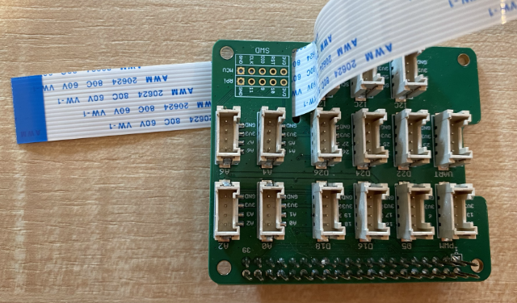

<!--
CO_OP_TRANSLATOR_METADATA:
{
  "original_hash": "c677667095f6133eee418c7e53615d05",
  "translation_date": "2025-08-27T10:20:10+00:00",
  "source_file": "4-manufacturing/lessons/2-check-fruit-from-device/pi-camera.md",
  "language_code": "bn"
}
-->
# একটি ছবি ধারণ করুন - রাস্পবেরি পাই

এই পাঠের অংশে, আপনি আপনার রাস্পবেরি পাই-তে একটি ক্যামেরা সেন্সর যোগ করবেন এবং এটি থেকে ছবি পড়বেন।

## হার্ডওয়্যার

রাস্পবেরি পাই-এর জন্য একটি ক্যামেরা প্রয়োজন।

আপনি যে ক্যামেরাটি ব্যবহার করবেন তা হলো [Raspberry Pi Camera Module](https://www.raspberrypi.org/products/camera-module-v2/)। এই ক্যামেরাটি রাস্পবেরি পাই-এর সাথে কাজ করার জন্য ডিজাইন করা হয়েছে এবং এটি পাই-এর একটি নির্দিষ্ট সংযোগকারীর মাধ্যমে সংযুক্ত হয়।

> 💁 এই ক্যামেরাটি [Camera Serial Interface, একটি প্রোটোকল যা Mobile Industry Processor Interface Alliance থেকে এসেছে](https://wikipedia.org/wiki/Camera_Serial_Interface), যা MIPI-CSI নামে পরিচিত। এটি ছবি পাঠানোর জন্য একটি নির্দিষ্ট প্রোটোকল।

## ক্যামেরা সংযুক্ত করুন

ক্যামেরাটি একটি রিবন কেবল ব্যবহার করে রাস্পবেরি পাই-এর সাথে সংযুক্ত করা যেতে পারে।

### কাজ - ক্যামেরা সংযুক্ত করুন


1. পাই বন্ধ করুন।

1. ক্যামেরার সাথে আসা রিবন কেবলটি ক্যামেরার সাথে সংযুক্ত করুন। এটি করতে, হোল্ডারের কালো প্লাস্টিক ক্লিপটি আলতো করে টেনে বের করুন যাতে এটি একটু বেরিয়ে আসে, তারপর কেবলটি সকেটে স্লাইড করুন। কেবলটির নীল দিকটি লেন্স থেকে দূরে এবং ধাতব পিন স্ট্রিপগুলি লেন্সের দিকে মুখ করে থাকবে। কেবলটি সম্পূর্ণভাবে ঢুকানোর পর, কালো প্লাস্টিক ক্লিপটি আবার জায়গায় ঠেলে দিন।

    [Raspberry Pi Getting Started with the Camera module documentation](https://projects.raspberrypi.org/en/projects/getting-started-with-picamera/2)-এ ক্লিপটি খুলে কেবলটি ঢোকানোর একটি অ্যানিমেশন দেখতে পারেন।

    

1. Grove Base Hat পাই থেকে সরিয়ে ফেলুন।

1. রিবন কেবলটি Grove Base Hat-এর ক্যামেরা স্লটের মধ্য দিয়ে পাস করুন। নিশ্চিত করুন যে কেবলটির নীল দিকটি **A0**, **A1** ইত্যাদি লেবেলযুক্ত অ্যানালগ পোর্টগুলোর দিকে মুখ করে।

    

1. রিবন কেবলটি পাই-এর ক্যামেরা পোর্টে ঢোকান। আবার, কালো প্লাস্টিক ক্লিপটি টেনে তুলুন, কেবলটি ঢোকান, তারপর ক্লিপটি আবার জায়গায় ঠেলে দিন। কেবলটির নীল দিকটি USB এবং ইথারনেট পোর্টগুলোর দিকে মুখ করে থাকবে।

    

1. Grove Base Hat পুনরায় লাগান।

## ক্যামেরা প্রোগ্রাম করুন

রাস্পবেরি পাই এখন [PiCamera](https://pypi.org/project/picamera/) পাইথন লাইব্রেরি ব্যবহার করে ক্যামেরা প্রোগ্রাম করার জন্য প্রস্তুত।

### কাজ - লিগ্যাসি ক্যামেরা মোড সক্রিয় করুন

দুর্ভাগ্যবশত, Raspberry Pi OS Bullseye-এর রিলিজের সাথে, OS-এর সাথে আসা ক্যামেরা সফটওয়্যার পরিবর্তিত হয়েছে, যার ফলে ডিফল্টভাবে PiCamera আর কাজ করে না। একটি বিকল্প তৈরি হচ্ছে, যার নাম PiCamera2, তবে এটি এখনও ব্যবহারের জন্য প্রস্তুত নয়।

বর্তমানে, আপনি আপনার পাই-কে লিগ্যাসি ক্যামেরা মোডে সেট করতে পারেন যাতে PiCamera কাজ করে। ক্যামেরা সকেটটি ডিফল্টভাবে নিষ্ক্রিয় থাকে, তবে লিগ্যাসি ক্যামেরা সফটওয়্যার চালু করলে এটি স্বয়ংক্রিয়ভাবে সক্রিয় হয়ে যায়।

1. পাই চালু করুন এবং বুট হওয়ার জন্য অপেক্ষা করুন।

1. VS Code চালু করুন, সরাসরি পাই-তে অথবা Remote SSH এক্সটেনশন ব্যবহার করে সংযোগ করুন।

1. আপনার টার্মিনাল থেকে নিম্নলিখিত কমান্ডগুলো চালান:

    ```sh
    sudo raspi-config nonint do_legacy 0
    sudo reboot
    ```

    এটি একটি সেটিং টগল করবে যাতে লিগ্যাসি ক্যামেরা সফটওয়্যার সক্রিয় হয়, তারপর সেটিং কার্যকর করতে পাই পুনরায় চালু হবে।

1. পাই পুনরায় চালু হওয়ার জন্য অপেক্ষা করুন, তারপর VS Code পুনরায় চালু করুন।

### কাজ - ক্যামেরা প্রোগ্রাম করুন

ডিভাইসটি প্রোগ্রাম করুন।

1. টার্মিনাল থেকে `pi` ব্যবহারকারীর হোম ডিরেক্টরিতে একটি নতুন ফোল্ডার তৈরি করুন যার নাম `fruit-quality-detector`। এই ফোল্ডারে একটি ফাইল তৈরি করুন যার নাম `app.py`।

1. এই ফোল্ডারটি VS Code-এ খুলুন।

1. ক্যামেরার সাথে ইন্টারঅ্যাক্ট করতে, আপনি PiCamera পাইথন লাইব্রেরি ব্যবহার করতে পারেন। নিম্নলিখিত কমান্ড দিয়ে Pip প্যাকেজটি ইনস্টল করুন:

    ```sh
    pip3 install picamera
    ```

1. আপনার `app.py` ফাইলে নিম্নলিখিত কোড যোগ করুন:

    ```python
    import io
    import time
    from picamera import PiCamera
    ```

    এই কোডটি প্রয়োজনীয় কিছু লাইব্রেরি ইমপোর্ট করে, যার মধ্যে `PiCamera` লাইব্রেরি রয়েছে।

1. এর নিচে ক্যামেরা ইনিশিয়ালাইজ করার জন্য নিম্নলিখিত কোড যোগ করুন:

    ```python
    camera = PiCamera()
    camera.resolution = (640, 480)
    camera.rotation = 0
    
    time.sleep(2)
    ```

    এই কোডটি একটি PiCamera অবজেক্ট তৈরি করে এবং রেজোলিউশন 640x480 সেট করে। যদিও উচ্চতর রেজোলিউশন সমর্থিত (3280x2464 পর্যন্ত), ইমেজ ক্লাসিফায়ার ছোট ছবি (227x227) নিয়ে কাজ করে, তাই বড় ছবি ধারণ করার প্রয়োজন নেই।

    `camera.rotation = 0` লাইনটি ছবির রোটেশন সেট করে। রিবন কেবলটি ক্যামেরার নিচে আসে, তবে যদি আপনার ক্যামেরাটি এমনভাবে ঘোরানো হয় যাতে এটি সহজে ক্লাসিফাই করতে চাওয়া আইটেমের দিকে নির্দেশ করে, তাহলে আপনি এই লাইনে রোটেশনের ডিগ্রি পরিবর্তন করতে পারেন।

    

    উদাহরণস্বরূপ, যদি আপনি রিবন কেবলটি এমনভাবে ঝুলান যাতে এটি ক্যামেরার উপরে থাকে, তাহলে রোটেশন 180 সেট করুন:

    ```python
    camera.rotation = 180
    ```

    ক্যামেরাটি চালু হতে কয়েক সেকেন্ড সময় নেয়, তাই `time.sleep(2)` ব্যবহার করা হয়েছে।

1. এর নিচে ছবিটি বাইনারি ডেটা হিসেবে ধারণ করার জন্য নিম্নলিখিত কোড যোগ করুন:

    ```python
    image = io.BytesIO()
    camera.capture(image, 'jpeg')
    image.seek(0)
    ```

    এই কোডটি একটি `BytesIO` অবজেক্ট তৈরি করে যাতে বাইনারি ডেটা সংরক্ষণ করা যায়। ক্যামেরা থেকে ছবিটি একটি JPEG ফাইল হিসেবে পড়া হয় এবং এই অবজেক্টে সংরক্ষণ করা হয়। এই অবজেক্টে একটি পজিশন ইন্ডিকেটর থাকে যা জানায় ডেটার কোন অংশে লেখা হচ্ছে, তাই `image.seek(0)` লাইনটি এই পজিশনটি শুরুতে নিয়ে যায় যাতে পরে সমস্ত ডেটা পড়া যায়।

1. এর নিচে ছবিটি একটি ফাইলে সংরক্ষণ করার জন্য নিম্নলিখিত কোড যোগ করুন:

    ```python
    with open('image.jpg', 'wb') as image_file:
        image_file.write(image.read())
    ```

    এই কোডটি `image.jpg` নামে একটি ফাইল লেখার জন্য খুলে, তারপর `BytesIO` অবজেক্ট থেকে সমস্ত ডেটা পড়ে এবং ফাইলে লেখে।

    > 💁 আপনি সরাসরি একটি ফাইলে ছবি ধারণ করতে পারেন `camera.capture` কল-এ ফাইলের নাম পাস করে। `BytesIO` অবজেক্ট ব্যবহার করার কারণ হলো, এই পাঠে পরে আপনি ছবিটি আপনার ইমেজ ক্লাসিফায়ারে পাঠাতে পারবেন।

1. ক্যামেরাটি কোনো কিছুর দিকে নির্দেশ করুন এবং এই কোডটি চালান।

1. একটি ছবি ধারণ করা হবে এবং বর্তমান ফোল্ডারে `image.jpg` নামে সংরক্ষণ করা হবে। আপনি এই ফাইলটি VS Code এক্সপ্লোরারে দেখতে পাবেন। ফাইলটি নির্বাচন করুন এবং ছবিটি দেখুন। যদি রোটেশন প্রয়োজন হয়, তাহলে `camera.rotation = 0` লাইনটি আপডেট করুন এবং আবার ছবি তুলুন।

> 💁 আপনি এই কোডটি [code-camera/pi](../../../../../4-manufacturing/lessons/2-check-fruit-from-device/code-camera/pi) ফোল্ডারে খুঁজে পেতে পারেন।

😀 আপনার ক্যামেরা প্রোগ্রাম সফল হয়েছে!

---

**অস্বীকৃতি**:  
এই নথিটি AI অনুবাদ পরিষেবা [Co-op Translator](https://github.com/Azure/co-op-translator) ব্যবহার করে অনুবাদ করা হয়েছে। আমরা যথাসাধ্য সঠিকতা নিশ্চিত করার চেষ্টা করি, তবে অনুগ্রহ করে মনে রাখবেন যে স্বয়ংক্রিয় অনুবাদে ত্রুটি বা অসঙ্গতি থাকতে পারে। মূল ভাষায় থাকা নথিটিকে প্রামাণিক উৎস হিসেবে বিবেচনা করা উচিত। গুরুত্বপূর্ণ তথ্যের জন্য, পেশাদার মানব অনুবাদ সুপারিশ করা হয়। এই অনুবাদ ব্যবহারের ফলে কোনো ভুল বোঝাবুঝি বা ভুল ব্যাখ্যা হলে আমরা দায়বদ্ধ থাকব না।